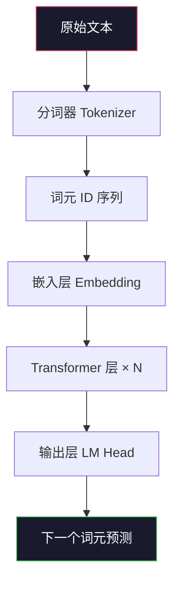
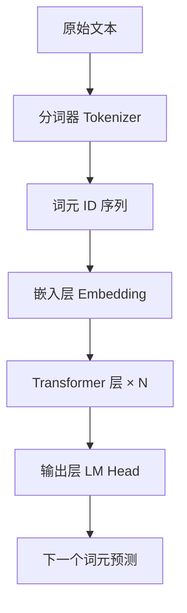
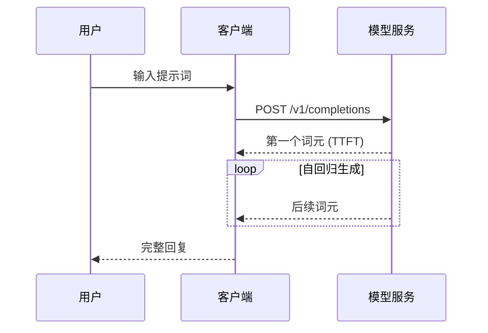
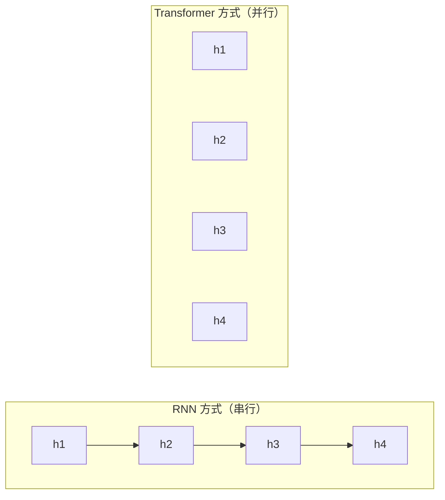
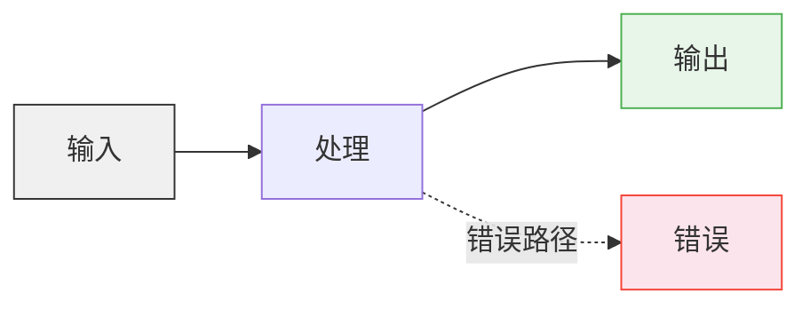

# 图表规范 (Figure Guide)

> **原则：** 优先 Mermaid，其次 ASCII，再次 SVG。不要为了画图而画图——每张图必须说明一件事情。

---

## 1. 何时需要配图

**不是每段文字都需要配图。** 配图的目的是：

| 场景 | 适合类型 | 示例 |
|---|---|---|
| 数据流/处理流程 | Mermaid 流程图 | 文本 → 分词器 → 词元序列 → 模型 |
| 架构/层级关系 | Mermaid 图 | Transformer 的各组件关系 |
| 对比（A vs B） | 表格 或 ASCII 并排 | RNN vs Transformer 对比 |
| 矩阵/二维数据 | ASCII 热力图 | 注意力权重可视化 |
| 时序/状态变化 | Mermaid 时序图 | 训练循环中的状态转移 |
| 数学关系 | LaTeX 公式 | 不需要图 |

**不需要配图的情况：**
- 文字本身就足够清晰的概念
- 可以用一句话表格说清楚的对比
- 纯粹装饰性的插图

---

## 2. Mermaid 优先

### 2.1 为什么优先 Mermaid

- 纯文本，可以被 Git diff 追踪
- 不需要外部工具即可渲染（GitHub、VS Code 均原生支持）
- 和代码一起版本管理
- 方便修改和维护

### 2.2 流程图（graph TD / LR）



**Markdown 写法：**

````markdown

````

**规则：**
- 节点文字使用中文（或英文术语，按术语表）
- 不超过 10 个节点
- 流向清晰：从左到右（LR）或从上到下（TD）
- 关键节点可以用 `style` 高亮（可选）
- 不追求花哨样式，追求信息清晰

### 2.3 时序图（sequenceDiagram）

适用于展示多步骤的交互过程。

````markdown

````

### 2.4 对比图（graph 子图）

````markdown

````

---

## 3. ASCII 图

### 3.1 何时用 ASCII

Mermaid 无法精确表达以下内容时，使用 ASCII：

- 矩阵结构展示
- 张量形状变换
- 数据结构（如掩码矩阵）
- 算法步骤的逐步演示

### 3.2 张量/矩阵展示

```
输入嵌入矩阵 X:
           d_model=8 →
  ┌                                   ┐
  │ 0.2  0.5 -0.1  0.8  0.3 -0.4  0.6  0.1 │ token_1
  │ 0.7 -0.3  0.4  0.2 -0.5  0.9  0.1 -0.2 │ token_2
  │ ...                                     │
  └                                   ┘
  n_tokens=6 ↓

注意力权重矩阵:
          key positions →
  ┌                    ┐
  │ 0.5 0.2 0.1 0.1 0.1 │ query_1
  │ 0.3 0.4 0.1 0.1 0.1 │ query_2
  │ 0.1 0.2 0.4 0.2 0.1 │ query_3
  │ 0.1 0.1 0.2 0.4 0.2 │ query_4
  │ 0.1 0.1 0.1 0.2 0.5 │ query_5
  └                    ┘
```

### 3.3 掩码示意图

```
因果掩码（Causal Mask）:
     k0  k1  k2  k3  k4
q0 [ 0  -∞  -∞  -∞  -∞ ]  只能看到自己
q1 [ 0   0  -∞  -∞  -∞ ]  能看到自己和前一个
q2 [ 0   0   0  -∞  -∞ ]  能看到前两个
q3 [ 0   0   0   0  -∞ ]
q4 [ 0   0   0   0   0 ]   能看到所有
```

### 3.4 ASCII 热力图

用字符密度表示数值大小：

```
注意力权重热力图:
       "我"  "爱"  "北"  "京"
"我" [ ██    ░     ░     ░   ]
"爱" [ ░     ██    ░     ░   ]
"北" [ ░     ░     ██    ░   ]
"京" [ ░     ░     ░     ██  ]

█ = 高注意力 (> 0.5)
▓ = 中注意力 (0.2-0.5)
░ = 低注意力 (< 0.2)
```

---

## 4. 外部图片（SVG/PNG）

### 4.1 何时使用外部图片

仅在 Mermaid 和 ASCII **都无法**有效表达时：
- 复杂架构图（如整个 Transformer 的完整结构）
- 训练曲线/损失曲线等数据可视化
- 照片、截图

### 4.2 文件格式

| 类型 | 格式 | 理由 |
|---|---|---|
| 架构图、流程图 | SVG | 无损缩放，体积小，可被文本编辑器修改 |
| 数据图表 | SVG 或 PNG | SVG 优先，有大量数据点时 PNG |
| 截图 | PNG | 截图不适合 SVG |
| ❌ GIF | 禁止 | 体积大，不可缩放，分散注意力 |

### 4.3 文件命名

```
# ✓ 正确
self-attention-matrix.svg
transformer-architecture.png
bpe-merge-steps.svg

# ❌ 错误
图1.svg
注意力机制图.png
Picture1.png
self attention matrix.svg     # 不要空格
Self-Attention.svg            # 不要大写
```

规则：
- 小写英文 + 连字符分隔
- 描述内容，不是编号
- 放在对应课程的 `assets/` 目录中
- 在正文中用相对路径引用：``

### 4.4 图片质量

- SVG：简洁，易于在文本编辑器中直接阅读源码
- PNG：分辨率 ≥ 2x（即 144 DPI 或以上），确保在高分屏上清晰
- 不包含水印、广告、来源不明的 Logo
- 如果你不是该图的原始作者，需要标注出处

---

## 5. 表格作为图表

很多情况下，一个精心设计的表格比图更有效：

```markdown
| 特性 | RNN | Transformer |
|---|---|---|
| 计算方式 | 串行（O(n)） | 并行（O(1)） |
| 长程依赖 | 梯度消失 | 直接连接（O(1) 距离） |
| 记忆能力 | 固定大小隐藏状态 | 可随序列增长 |
| 训练速度 | 慢（无法并行） | 快（GPU 友好） |
```

表格优于图表的场景：精确数据对比、特性对比、配置参数说明。

---

## 6. 颜色与样式

### 6.1 Mermaid 着色

仅在需要区分/强调时使用颜色。使用不超过 3 种颜色。



颜色语义：

| 颜色 | 含义 |
|---|---|
| 🟢 绿色系 | 正确、输出、成功 |
| 🔴 红色系 | 错误、警告、注意 |
| 🔵 蓝色系 | 信息、中立、处理中 |
| ⚪ 灰色系 | 输入、中性、辅助信息 |

### 6.2 不使用 emoji 作为图形元素

```markdown
# ❌ 不专业
✅ 正确 → ❌ 错误
🔥 热门 → 💀 过时

# ✓ 用文字或注释
[推荐] → [不推荐]
[常用] → [已弃用]
```

---

## 7. 图片引用

### 7.1 正文中引用

```markdown
# 带标题


# 文中提及
如图 1 所示，BPE 的合并过程是从字符到子词的逐步聚合。
```

### 7.2 Alt Text

必须写有意义的 alt text（图片无法加载时显示，也用于可访问性）：

```markdown
# ✓ 有意义的 alt text


# ❌ 无意义的 alt text

```

---

## 8. 自检清单

- [ ] 这张图确实能帮助理解吗？还是删掉也不影响？
- [ ] 优先尝试了 Mermaid 或 ASCII？
- [ ] 节点/元素文字使用了中文（按术语表）？
- [ ] 图片文件命名符合规范（小写英文 + 连字符）？
- [ ] 外部图片使用了 SVG（架构图）或高分辨率 PNG（截图）？
- [ ] 有意义的 alt text？
- [ ] 颜色不超过 3 种，有明确的语义？
- [ ] 没有使用 emoji 作为图形元素？
- [ ] 图片来源有出处标注？
