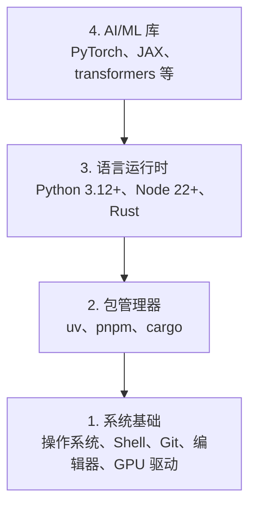

# 开发环境配置——Python、Node.js、Rust 一站式搭建

> 工具塑造思维。一次性设置好，以后不再烦恼。

**类型：** 构建
**编程语言：** Python、Node.js、Rust
**前置知识：** 无
**预计时间：** 45 分钟
**所处阶段：** Tier 1
**关联课程：** 第 00 阶段 · 02（Git 与协作）— 环境准备好后立即学习版本控制

---

## 🎯 学习目标

完成本课后，你能够：

- [ ] 从零搭建 Python 3.12+、Node.js 和 Rust 工具链
- [ ] 使用 uv 配置虚拟环境和可复现的依赖管理
- [ ] 验证 GPU 可用性并运行测试张量操作
- [ ] 理解四层技术栈：系统、包管理、运行时、AI 库

---

## 1. 问题

你将在 200 多课中用 Python、TypeScript、Rust 学习 AI 工程。如果环境是坏的，每一课都在解决工具问题而不是学习。

大多数人跳过环境搭建。然后花数小时调试导入错误、版本冲突和缺失的 CUDA 驱动。我们一次性正确地做这件事。

---

## 2. 核心概念

### 2.1 四层技术栈

AI 工程环境有四层，从底向上搭建：



每一层依赖下一层。我们从底向上安装。

### 2.2 语言选择

| 语言 | 用于 | 包管理器 |
|:-----|:-----|:---------|
| Python | ML、DL、NLP、视觉、音频、LLM | uv |
| TypeScript | 智能体、MCP、Web 应用 | pnpm |
| Rust | 性能关键、推理、系统 | cargo |

---

## 3. 从零实现

### 第 1 步：系统基础

```bash
# macOS
xcode-select --install
brew install git curl wget

# Ubuntu/Debian
sudo apt update && sudo apt install -y build-essential git curl wget

# Windows（使用 WSL2）
wsl --install -d Ubuntu-24.04
```

### 第 2 步：Python 与 uv

我们使用 `uv`——它比 pip 快 10-100 倍，自动处理虚拟环境：

```bash
curl -LsSf https://astral.sh/uv/install.sh | sh

uv python install 3.12

uv venv
source .venv/bin/activate  # Windows: .venv\Scripts\activate

uv pip install numpy matplotlib jupyter jupyterlab
```

验证：

```python
import sys
print(f"Python {sys.version}")

import numpy as np
print(f"NumPy {np.__version__}")
a = np.array([1, 2, 3])
print(f"向量: {a}，自身点积: {np.dot(a, a)}")
```

### 第 3 步：Node.js 与 pnpm

用于 TypeScript 课程（智能体、MCP 服务器、Web 应用）：

```bash
curl -fsSL https://fnm.vercel.app/install | bash
fnm install 22
fnm use 22

npm install -g pnpm

node -e "console.log('Node', process.version)"
```

### 第 4 步：Rust

用于性能关键课程（推理、系统）：

```bash
curl --proto '=https' --tlsv1.2 -sSf https://sh.rustup.rs | sh

rustc --version
cargo --version
```

### 第 5 步：GPU 验证

```bash
# NVIDIA GPU
nvidia-smi
```

```python
import torch
print(f"CUDA 可用: {torch.cuda.is_available()}")
if torch.cuda.is_available():
    print(f"GPU: {torch.cuda.get_device_name(0)}")
```

没有 GPU？没关系。大多数课程可在 CPU 上运行。需要 GPU 的课程会提供 Colab 链接。

### 第 6 步：一键验证

将所有验证代码集中到 `code/verify.py`，运行确认全部通过。

---

## 4. 工业工具

### 4.1 包管理器对比

| 语言 | 推荐 | 备选 |
|:-----|:-----|:-----|
| Python | uv（快 10-100x） | pip、poetry、conda |
| Node.js | pnpm（磁盘空间高效） | npm、yarn |
| Rust | cargo（官方） | — |
| Julia | Pkg（官方） | — |

### 4.2 编辑器推荐

| 编辑器 | 特点 | 适合 |
|:-------|:-----|:-----|
| VS Code | Python/Jupyter 支持最佳 | 通用课程 |
| PyCharm | 专业 Python IDE | Python 密集型 |
| Zed | 快速、Rust 原生 | 性能敏感 |
| Cursor | AI 辅助编码 | 初学者 |

---

## 5. 知识连线

本课搭建的环境是所有后续课程的基础：

- **第 03 阶段（GPU 与云）**：你会在这台机器上跑第一个 GPU 加速的训练
- **第 07 阶段（Transformer 深入）**：你用本课配置的 PyTorch 训练第一个 Transformer
- **第 10 阶段（大语言模型从零）**：你在这套环境中完成的第一个预训练循环

---

## 6. 工程最佳实践

- **使用版本锁定的依赖**：`uv pip freeze > requirements.txt` 确保可复现
- **虚拟环境在项目目录内**：`.venv/` 放在项目根目录，一起被 `.gitignore` 忽略
- **GPU 驱动版本向下兼容**：CUDA 版本不需要最新——PyTorch 支持多个版本
- **中文场景特别建议**：如需 pip 镜像加速，使用 `uv pip install --index-url https://pypi.tuna.tsinghua.edu.cn/simple`

---

## 7. 常见错误

### 错误 1：pip 版本冲突

**现象：** `pip install torch` 后导入失败或使用了 CPU 版本。

**原因：** pip 的依赖解析器不一定能处理 PyTorch 的特殊索引 URL。

**修复：** 始终使用 uv，或在 pip 中指定 `--index-url`。

### 错误 2：WSL2 与 Windows 文件系统混用

**现象：** 在 `/mnt/c/Users/...` 下运行 Python 非常慢。

**原因：** WSL2 跨文件系统性能差——Python 读取文件需要翻译系统调用。

**修复：** 将所有项目文件放在 WSL2 的 Linux 文件系统（`/home/...`）下。

### 错误 3：GPU 驱动安装后未重启

**现象：** `nvidia-smi` 报驱动未加载。

**原因：** GPU 驱动需要重启才能加载内核模块。

**修复：** 安装驱动后重新启动系统。

---

## 8. 面试考点

### Q1：为什么 `uv` 比 `pip` 快这么多？（难度：⭐⭐）

**参考答案：** uv 是用 Rust 编写的，利用了 Rust 的内存安全性和并发优势。它缓存已下载的包、并行解析依赖、在安装前预编译。pip 是纯 Python 实现的，串行执行每一步——多步骤开销叠加后差别显著。

### Q2：CVv环境变量有什么用？（难度：⭐）

**参考答案：** `PATH` 告诉 Shell 在哪些目录查找可执行文件。虚拟环境激活时，它将 `.venv/bin` 添加到 `PATH` 最前面，使得 `python` 和 `pip` 指向虚拟环境内的版本，而非系统版本。

---

## 🔑 关键术语

| 术语 | 人们怎么说 | 实际含义 |
|:-----|:---------|:---------|
| 虚拟环境 | "隔离 Python" | Python 包的独立安装目录，不影响系统其他项目 |
| uv | "快得多的 pip" | Rust 实现的 Python 包管理器，速度是 pip 的 10-100 倍 |
| CUDA | "GPU 编程" | NVIDIA 的并行计算平台，让 GPU 执行计算 |
| WSL2 | "Windows 上的 Linux" | Windows Subsystem for Linux——Windows 中运行 Linux 内核 |

---

## 📚 小结

你从底层到顶层搭建了完整的 AI 工程开发环境。从系统工具开始，安装 Python、Node.js 和 Rust，配置包管理器和虚拟环境，验证了 GPU 可用性。这套环境将伴随你完成后续所有阶段。

下一课学习 Git 与协作——版本控制是每个实验的安全网。

---

## ✏️ 练习

1. 【实现】运行 `code/verify.py` 验证脚本，修复任何失败的项目
2. 【理解】为本课程创建一个 Python 虚拟环境，安装 PyTorch 并运行验证
3. 【思考】在三种语言中分别写一个 Hello World 并运行：Python、Node.js、Rust

---

## 🚀 产出

| 产出 | 文件 | 说明 |
|:-----|:-----|:-----|
| 环境验证脚本 | `code/verify.py` | 一键检查 Python/Node/Rust/GPU |
| 可复用提示词 | `outputs/prompt-env-check.md` | 帮助 AI 助手诊断环境问题的提示词 |

---

## 📖 参考资料

1. [官方文档] uv 包管理器. https://docs.astral.sh/uv/
2. [官方文档] PyTorch 安装指南. https://pytorch.org/get-started/locally/
3. [官方文档] fnm（Fast Node Manager）. https://github.com/Schniz/fnm
4. [官方文档] Rust 安装. https://www.rust-lang.org/tools/install
5. [GitHub] WSL 安装指南. https://learn.microsoft.com/zh-cn/windows/wsl/install
