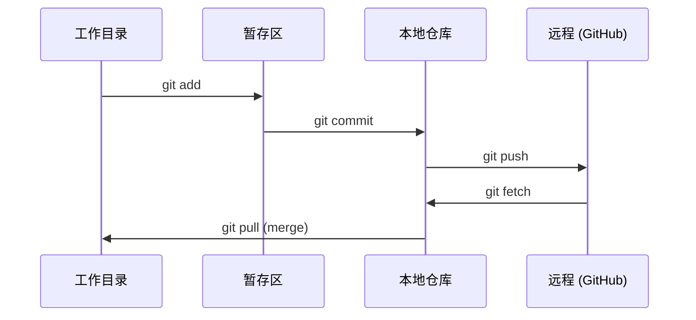

# Git 与协作——版本控制入门

> 版本控制不是可选的。你在这里构建的每个实验、每个模型、每课都被追踪。

**类型：** 概念课
**编程语言：** 无
**前置知识：** 第 00 阶段 · 01（开发环境配置）
**预计时间：** 30 分钟
**所处阶段：** Tier 1
**关联课程：** 第 00 阶段 · 03（GPU 与云）— 弄好版本控制后再用 GPU

---

## 🎯 学习目标

完成本课后，你能够：

- [ ] 配置 Git 身份并使用 `add`、`commit`、`push` 日常工作流
- [ ] 创建和合并分支进行实验隔离
- [ ] 编写排除模型检查点和大型二进制文件的 `.gitignore`
- [ ] 用 `git log` 浏览提交历史理解项目演变

---

## 1. 问题

你即将在 20 个阶段中编写数百个代码文件。没有版本控制，你会丢失工作、破坏无法撤销的内容、无法与他人协作。

Git 是工具。GitHub 是代码存放的地方。本节涵盖本课程所需的全部 Git 知识。

---

## 2. 核心概念

### 2.1 四个区



### 2.2 三件要记住的事

1. **频繁保存**（`git commit`）— 每完成一个逻辑步骤就提交
2. **推送到远程**（`git push`）— 提交只在本地，推送到 GitHub 才是备份
3. **分支做实验**（`git checkout -b experiment`）— 永远不在 main 上改代码

---

## 3. 从零实现

### 第 1 步：配置 Git

```bash
git config --global user.name "你的名字"
git config --global user.email "你@example.com"

git config --global init.defaultBranch main
```

### 第 2 步：日常工作流

```bash
# 查看当前状态
git status

# 添加文件到暂存区
git add file.py

# 提交到本地仓库
git commit -m "添加感知器实现"

# 推送到远程
git push origin main
```

### 第 3 步：分支实验

```bash
# 创建并切换到新分支
git checkout -b experiment/new-optimizer

# 修改代码、提交...
git add .
git commit -m "实验：AdamW 优化器"

# 回到 main 并合并
git checkout main
git merge experiment/new-optimizer
```

### 第 4 步：本课程的 Git 工作流

```bash
git clone <本课程仓库URL>
cd ai-engineering-from-scratch-zh

git checkout -b my-progress
# 学习课程，提交代码
git push origin my-progress
```

### 第 5 步：.gitignore

创建 `.gitignore` 文件排除不需要追踪的文件：

```text
# Python
__pycache__/
*.pyc
.venv/

# 模型检查点
*.pt
*.pth
*.safetensors
*.bin

# 大文件
*.ipynb_checkpoints/
.DS_Store
*.h5
*.hdf5

# 数据
data/
*.parquet
```

---

## 4. 工业工具

| 工具 | 用途 | 特点 |
|:-----|:-----|:-----|
| Git | 版本控制 | 分布式的文件快照管理 |
| GitHub | 代码托管 | 协作 + CI/CD + 代码审查 |
| Git Large Files (LFS) | 大文件追踪 | 替代 Git 处理二进制大文件 |
| GitHub CLI (`gh`) | 命令行 GitHub | PR、Issue、Actions 一站式 |

---

## 5. 知识连线

- **第 00 阶段 · 03（GPU 与云）**：将 GPU 代码推送到仓库，在不同机器上复现
- **第 01 阶段（数学基础）**：用分支尝试不同的公式实现
- **第 19 阶段（综合项目）**：跨 87 课的代码库需要扎实的版本控制习惯

---

## 6. 工程最佳实践

- **Git 大文件（LFS）**：模型检查点 >100MB 时使用 `git lfs track "*.pt"`
- **提交信息规范**：`"类型: 简短描述"` 格式（如 `"feat: 添加多头注意力"`、`"fix: 修复梯度裁剪溢出"`）
- **不要 commit `data/`**：数据文件从源下载，不在仓库中保存
- **中文场景特别建议**：中文文件名在 Git 中显示为百分比编码——日志中使用 `git log --name-status` 查看

---

## 7. 常见错误

### 错误 1：大文件误提交

**现象：** `git push` 报错大文件被拒绝。查看 `.gitignore` 不包含 `*.pt` 或 `data/`。

**原因：** 不小心将模型检查点或数据集添加到了暂存区。

**修复：** `git rm --cached large_file.pt` 移除追踪，然后添加 `.gitignore`。

### 错误 2：提交信息过于模糊

**现象：** 回看历史时无法理解一周前的提交做了什么。

**原因：** 提交信息只有 "fix"、"update" 等。

**修复：** 写具体信息："fix: 修复 LSTM 梯度爆炸，将梯度裁剪阈值设为 1.0"。

### 错误 3：直接在 main 上修改

**现象：** 实验破坏了主分支，无法回退到干净的起点。

**原因：** 没有在分支中做实验。

**修复：** 始终 `git checkout -b experiment-name`。

---

## 8. 面试考点

### Q1：`git merge` 和 `git rebase` 的区别是什么？（难度：⭐⭐）

**参考答案：** `merge` 创建一个新的合并提交，保留两个分支的历史。`rebase` 将当前分支的提交移动到目标分支的顶部，历史是线性的——更整洁但会改写历史。本课程建议使用 `merge`——简单且不会破坏他人的历史。

### Q2：`git revert` 和 `git reset` 的区别？（难度：⭐⭐）

**参考答案：** `reset` 删除历史记录，回到某个提交——如果已推送会破坏远程历史。`revert` 创建一个新的提交，取消之前的更改——安全地后退而不删除历史。对于已推送到 GitHub 的提交总是使用 `revert`。

---

## 🔑 关键术语

| 术语 | 人们怎么说 | 实际含义 |
|:-----|:---------|:---------|
| 提交 | "保存" | 整个项目在某个时间点的快照 |
| 分支 | "副本" | 指向提交的指针，随工作推进 |
| 合并 | "合并代码" | 将一个分支的更改应用到另一个分支 |
| 远程 | "云端" | 托管在别处的仓库副本（GitHub、GitLab） |

---

## 📚 小结

Git 是每个 AI 工程实验的安全网。你学会了配置、日常工作流、分支与合并、以及 `.gitignore`。对你来说只需要五个命令：`clone`、`add/commit/push`、`checkout -b`。下一课配置 GPU 和云服务。

---

## ✏️ 练习

1. 【实现】克隆本课程仓库，创建 `my-progress` 分支，创建一个文件，提交并推送
2. 【实现】创建 `.gitignore`，排除 `.pt`、`.pth`、`.safetensors` 模型文件
3. 【理解】用 `git log --oneline` 查看本课程的提交历史，了解课程的添加过程

---

## 🚀 产出

| 产出 | 文件 | 说明 |
|:-----|:-----|:-----|
| Git 配置检查 | `code/verify_git.py` | 检查 Git 配置和基本操作 |
| 可复用提示词 | `outputs/prompt-git-collab.md` | Git 协作最佳实践 |

---

## 📖 参考资料

1. [官方文档] Git 官方文档. https://git-scm.com/doc
2. [官方文档] GitHub 文档. https://docs.github.com/zh
3. [GitHub] 专业 Git 电子书. https://git-scm.com/book/zh/v2
