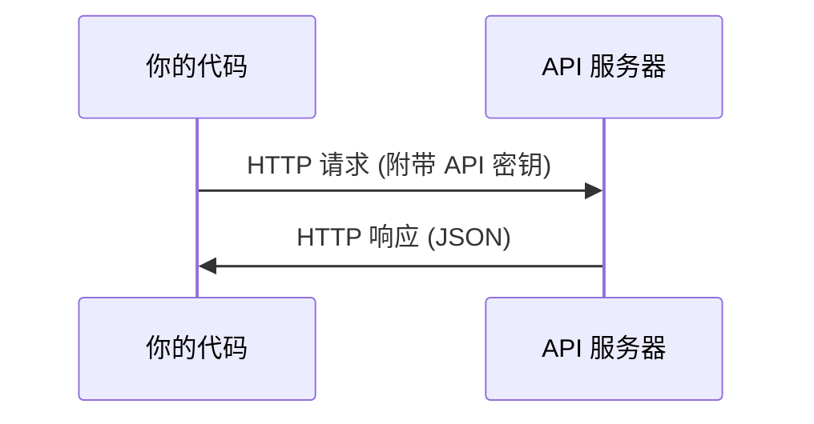

# API 与密钥——调用 LLM API 的第一步

> 每个 AI API 都一样：发送请求，得到响应。细节变了，模式没变。

**类型：** 构建
**编程语言：** Python、TypeScript
**前置知识：** 第 00 阶段 · 01（开发环境配置）
**预计时间：** 30 分钟
**所处阶段：** Tier 1
**关联课程：** 第 00 阶段 · 02（Git 与协作）— API 密钥文件必须加入 .gitignore

---

## 🎯 学习目标

完成本课后，你能够：

- [ ] 使用环境变量和 `.env` 文件安全存储 API 密钥
- [ ] 用 Anthropic Python SDK 和原始 HTTP 调用 LLM API
- [ ] 对比 SDK 和 HTTP 请求/响应格式，便于调试
- [ ] 识别并处理认证错误和速率限制

---

## 1. 问题

从第 11 阶段开始，你将调用 LLM API（Anthropic、OpenAI、Google）。在第 13-16 阶段，你将构建使用这些 API 的循环。你需要知道 API 密钥如何工作、如何安全存储，以及如何发起第一个 API 调用。

---

## 2. 核心概念

### 2.1 API 调用四要素



每个 API 调用包含：
1. **端点**（URL）
2. **API 密钥**（认证）
3. **请求体**（你想要什么）
4. **响应体**（你得到什么）

### 2.2 API 密钥存储

**永远不要**将 API 密钥放在代码中。使用环境变量或 `.env` 文件（并将其加入 `.gitignore`）。

---

## 3. 从零实现

### 第 1 步：安全存储密钥

```bash
export ANTHROPIC_API_KEY="sk-ant-..."
export OPENAI_API_KEY="sk-..."
```

或者使用 `.env` 文件：

```text
ANTHROPIC_API_KEY=sk-ant-...
OPENAI_API_KEY=sk-...
```

确保 `.gitignore` 包含：`.env`

### 第 2 步：第一个 API 调用（Python SDK）

```python
import anthropic

client = anthropic.Anthropic()
response = client.messages.create(
    model="claude-sonnet-4-20250514",
    max_tokens=256,
    messages=[{"role": "user", "content": "用一句话解释什么是神经网络。"}]
)
print(response.content[0].text)
```

### 第 3 步：第一个 API 调用（原始 HTTP）

```python
import os, urllib.request, json

url = "https://api.anthropic.com/v1/messages"
headers = {
    "Content-Type": "application/json",
    "x-api-key": os.environ["ANTHROPIC_API_KEY"],
    "anthropic-version": "2023-06-01",
}
body = json.dumps({
    "model": "claude-sonnet-4-20250514",
    "max_tokens": 256,
    "messages": [{"role": "user", "content": "用一句话解释什么是神经网络。"}]
}).encode()

req = urllib.request.Request(url, data=body, headers=headers, method="POST")
with urllib.request.urlopen(req) as resp:
    result = json.loads(resp.read())
    print(result["content"][0]["text"])
```

SDK 底层做的就是这些 HTTP 调用。理解原始 HTTP 调用有助于调试。

---

## 4. 工业工具

| API | 何时使用 | 免费额度 |
|:----|:--------|:---------|
| Anthropic（Claude） | 第 11-16 阶段（智能体、工具） | 注册送 $5 |
| OpenAI | 第 11 阶段（对比） | 注册送 $5 |
| Hugging Face | 第 4-10 阶段（模型、数据集） | 免费 |

你不需要现在全部设置。当课程需要时再配置。

---

## 5. 知识连线

- **第 11 阶段（LLM 工程）**：你会在提示词工程中大量使用这些 API 调用
- **第 13 阶段（工具与协议）**：你将构建通过这些 API 与工具交互的智能体
- **第 19 阶段（综合项目）**：87 课的端到端项目中，API 调用是连接各组件的核心

---

## 6. 工程最佳实践

- **永远不要将 API 密钥提交到 Git**：使用环境变量或 `.env` 文件，并确保 `.gitignore` 排除 `.env`
- **使用 try/except 处理 API 错误**：网络超时、认证失败、速率限制都是常见问题
- **中文场景特别建议**：Anthropic 和 OpenAI 的 API 服务从中国大陆直接访问可能不稳定，考虑使用代理或中转服务

---

## 7. 常见错误

### 错误 1：API 密钥被提交到 Git

**现象：** GitHub 提示检测到泄露的密钥。

**原因：** 将 `.env` 或包含密钥的文件提交到了 Git。

**修复：** 立即吊销旧密钥，使用 `git filter-branch` 移除文件历史，重新生成密钥。

### 错误 2：错误的 API 密钥格式

**现象：** 返回 401 Unauthorized 错误。

**原因：** 密钥缺少前缀或拼写错误。Anthropic 的密钥以 `sk-ant-` 开头。

**修复：** 打印 `os.environ.get("ANTHROPIC_API_KEY", "")[:10]` 确认前缀正确。

### 错误 3：未处理速率限制

**现象：** 返回 429 Too Many Requests 错误。

**原因：** 短时间内发送了太多请求。

**修复：** 实现指数退避重试：失败后等待 1 秒、2 秒、4 秒，然后重试。

---

## 8. 面试考点

### Q1：API 密钥和 OAuth 令牌的区别是什么？（难度：⭐）

**参考答案：** API 密钥是长期的静态凭证，用于服务端到服务端的通信。OAuth 令牌是短期的、代表用户授权的凭证，用于用户场景。LLM API 主要使用 API 密钥。

### Q2：为什么要在服务器端而非客户端存储 API 密钥？（难度：⭐⭐）

**参考答案：** 客户端代码可以被用户通过浏览器开发者工具查看。将密钥暴露在前端等于公开了你的账户。所有 API 调用必须在服务器端进行。

---

## 🔑 关键术语

| 术语 | 人们怎么说 | 实际含义 |
|:-----|:---------|:---------|
| API 密钥 | "API 的密码" | 标识你账户并授权请求的唯一字符串 |
| 速率限制 | "被限流了" | 每分钟/每小时的最大请求数 |
| 词元 | "一个词"（API 语境） | 计费单位：输入和输出词元分别计数 |
| 流式 | "实时响应" | 逐词获得响应而非等待完整响应 |

---

## 📚 小结

你学会了如何安全存储 API 密钥、如何用 SDK 和原始 HTTP 调用 LLM API，以及如何处理常见的错误。这是第 11-16 阶段的基础。下一课学习 Jupyter Notebook。

---

## ✏️ 练习

1. 【实现】获取 Anthropic API 密钥并发起第一个 API 调用
2. 【实现】尝试原始 HTTP 版本，对比响应格式与 SDK 版本
3. 【实验】故意使用错误的 API 密钥，阅读错误信息

---

## 🚀 产出

| 产出 | 文件 | 说明 |
|:-----|:-----|:-----|
| 可复用提示词 | `outputs/prompt-api-troubleshooter.md` | 诊断常见 API 错误 |

---

## 📖 参考资料

1. [官方文档] Anthropic Python SDK. https://docs.anthropic.com/en/api/
2. [官方文档] OpenAI API. https://platform.openai.com/docs/
3. [官方文档] Hugging Face Hub API. https://huggingface.co/docs/hub/api
