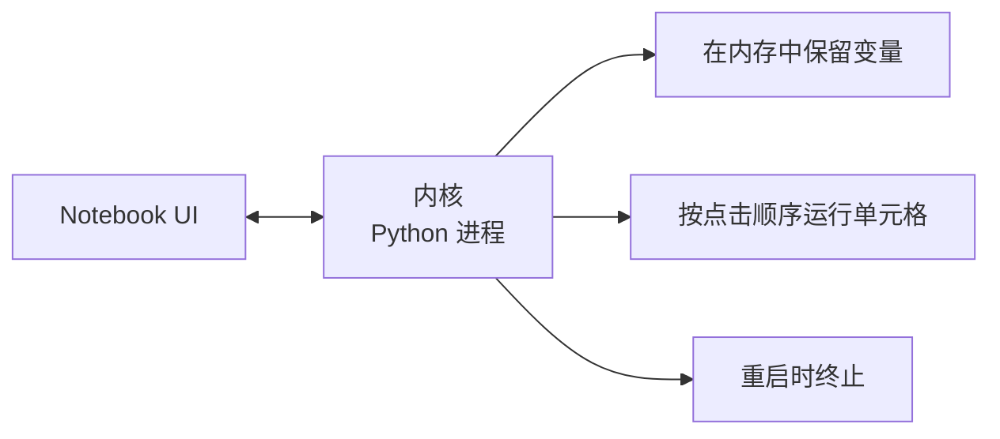

# Jupyter 笔记本——AI 工程的实验台

> 笔记本是 AI 工程的实验台。你在原型设计，然后把能用的搬到生产环境。

**类型：** 构建
**编程语言：** Python
**前置知识：** 第 00 阶段 · 01（开发环境配置）
**预计时间：** 30 分钟
**所处阶段：** Tier 1
**关联课程：** 第 00 阶段 · 03（GPU 与云服务）— Colab 是云端 Jupyter 的默认选择

---

## 🎯 学习目标

完成本课后，你能够：

- [ ] 安装并启动 JupyterLab 或 VS Code Jupyter 扩展
- [ ] 使用魔术命令 `%timeit`、`%%time`、`%matplotlib inline`
- [ ] 区分何时使用笔记本 vs 脚本
- [ ] 识别并避免常见笔记本陷阱

---

## 1. 问题

每个 AI 论文、教程和 Kaggle 竞赛都使用 Jupyter 笔记本。它们让你分块运行代码、内联查看输出、将代码与解释混合、快速迭代。但笔记本也存在陷阱——需要在适当的时候从笔记本迁移到脚本。

---

## 2. 核心概念

### 2.1 笔记本结构



每个单元格要么是代码要么是文本。代码在后台的 Python 内核中执行。

### 2.2 三种启动方式

| 方式 | 安装 | 适用 |
|:-----|:-----|:-----|
| JupyterLab | `pip install jupyterlab` → `jupyter lab` | 全功能 IDE |
| Jupyter Notebook | `pip install notebook` → `jupyter notebook` | 轻量 |
| VS Code | 安装 Jupyter 扩展 | 编辑器内集成 |

---

## 3. 从零实现

### 第 1 步：启动 JupyterLab

```bash
pip install jupyterlab
jupyter lab
```

### 第 2 步：掌握快捷键

**命令模式（按 Escape）：**

| 键 | 操作 |
|:---|:-----|
| `Shift+Enter` | 运行单元格，移到下一个 |
| `A` | 在上方插入 |
| `B` | 在下方插入 |
| `DD` | 删除单元格 |
| `M` | 转为 Markdown |
| `Y` | 转为代码 |

### 第 3 步：魔术命令

```python
%timeit np.random.randn(10000)   # 运行多次取平均
%%time                           # 运行一次计时
model.fit(X, y, epochs=10)

%matplotlib inline               # 内联显示图表
!pip install scikit-learn        # 在笔记本中安装包
%env CUDA_VISIBLE_DEVICES        # 查看环境变量
```

### 第 4 步：Rich Output 显示

```python
import pandas as pd
df = pd.DataFrame({"model": ["Linear", "CNN", "Transformer"], "accuracy": [0.72, 0.89, 0.94]})
df  # 自动显示格式化的 HTML 表格

import matplotlib.pyplot as plt
plt.plot([1, 2, 3], [1, 4, 9])
plt.show()  # 内联显示图表
```

### 第 5 步：笔记本 vs 脚本

| 使用笔记本 | 使用脚本 |
|:----------|:---------|
| 探索数据集 | 训练流水线 |
| 原型模型 | 可复用工具 |
| 可视化结果 | 生产代码 |
| 课程练习 | 包和库 |

规则：**在笔记本中探索，在脚本中发布**。

---

## 4. 工业工具

| 工具 | 特点 | 适用 |
|:-----|:-----|:-----|
| JupyterLab | 多标签、文件浏览器、终端 | 通用 |
| Google Colab | 免费 GPU、云存储 | 无 GPU 时 |
| VS Code | Git 集成、调试 | 开发一体化 |
| DeepNote | 云端 Jupyter | 团队协作 |

---

## 5. 知识连线

- **第 01 阶段（数学基础）**：用 Jupyter 验证线性代数和微积分概念
- **第 07 阶段（Transformer 深入）**：在笔记本中可视化注意力权重
- **第 19 阶段（综合项目）**：每个课程都可在 Jupyter 中交互式运行

---

## 6. 工程最佳实践

- **分享前重启并全部运行**：确保笔记本能从头到尾执行
- **定期重启内核**：删除陈旧变量，清除内存泄漏
- **`del variable` + `gc.collect()`**：手动释放大对象
- **中文场景特别建议**：Jupyter 完全支持中文 Markdown 和注释

---

## 7. 常见错误

### 错误 1：乱序执行

**现象：** 笔记本在你机器上能运行，但在别人机器上报错。

**原因：** 你以随机顺序运行了单元格。

**修复：** 分享前执行 Kernel → Restart & Run All。

### 错误 2：隐藏状态

**现象：** 删除了创建变量的单元格，但变量仍在内存中。

**原因：** 删除单元格不会清除该单元格创建的内存。

**修复：** 重启内核。定期重启。

### 错误 3：内存泄漏

**现象：** 加载 4GB 数据集、训练模型、加载另一个数据集——内存不释放。

**原因：** 大对象没有被垃圾回收。

**修复：** `del large_variable` → `import gc; gc.collect()`。或重启内核。

---

## 8. 面试考点

### Q1：Jupyter 的内核是什么？（难度：⭐）

**参考答案：** 内核是运行在后台的 Python 进程。当你运行单元格时，代码发送给内核执行，输出返回给 UI。所有单元格共享同一个内核，变量在单元格之间持久化。

### Q2：`%timeit` 和 `%%time` 的区别是什么？（难度：⭐）

**参考答案：** `%timeit` 自动多次运行代码并取平均值，适合微基准测试。`%%time` 运行一次并报告墙上时间，适合训练循环。

---

## 🔑 关键术语

| 术语 | 人们怎么说 | 实际含义 |
|:-----|:---------|:---------|
| 内核 | "运行代码的东西" | 一个单独的 Python 进程 |
| 单元格 | "代码块" | 笔记本中可独立运行的单元 |
| 魔术命令 | "Jupyter 技巧" | 以 `%` 或 `%%` 开头的特殊命令 |

---

## 📚 小结

Jupyter 笔记本是 AI 工程的实验台。你学会了启动笔记本、使用快捷键和魔术命令、以及区分笔记本 vs 脚本的适用场景。下一课学习 Python 虚拟环境。

---

## ✏️ 练习

1. 【实现】打开 JupyterLab，创建笔记本，用 `%timeit` 对比列表推导 vs numpy 创建随机数组
2. 【实现】创建一个包含 Markdown 和代码单元格的笔记本，运行 Restart & Run All 验证
3. 【理解】将 `code/notebook_tips.py` 粘贴到 Colab 笔记本，用免费 GPU 运行

---

## 🚀 产出

| 产出 | 文件 | 说明 |
|:-----|:-----|:-----|
| 可复用提示词 | `outputs/prompt-notebook-helper.md` | 调试笔记本问题 |

---

## 📖 参考资料

1. [官方文档] JupyterLab. https://jupyterlab.readthedocs.io/
2. [官方文档] Google Colab FAQ. https://research.google.com/colaboratory/faq.html
3. [博客] 28 Jupyter 笔记本技巧. https://www.dataquest.io/blog/jupyter-notebook-tips-tricks-shortcuts/
