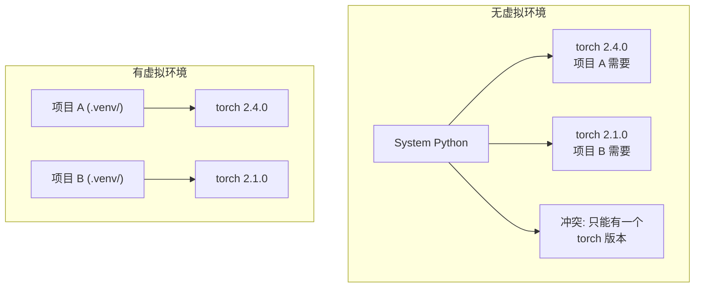

# Python 虚拟环境——依赖地狱的解药

> 依赖地狱是真实存在的。虚拟环境是解药。

**类型：** 构建
**编程语言：** Shell
**前置知识：** 第 00 阶段 · 01（开发环境配置）
**预计时间：** 30 分钟
**所处阶段：** Tier 1
**关联课程：** 第 00 阶段 · 07（Docker 容器）— 虚拟环境是单机隔离；容器是跨机器隔离

---

## 🎯 学习目标

完成本课后，你能够：

- [ ] 使用 uv、venv 或 conda 创建隔离的虚拟环境
- [ ] 编写 `pyproject.toml` 和锁文件实现可复现依赖
- [ ] 诊断并修复常见陷阱：全局安装、pip/conda 混用
- [ ] 实现每阶段环境策略解决依赖冲突

---

## 1. 问题

你为微调项目安装了 PyTorch 2.4。下周另一个项目需要 PyTorch 2.1（它的 CUDA 版本是锁定的）。你全局升级后第一个项目崩溃。你降级后第二个崩溃。

这是依赖地狱。在 AI/ML 工作中它经常发生：

- PyTorch、JAX、TensorFlow 各自发布自己的 CUDA 绑定
- 模型库锁定特定框架版本
- 全局 `pip install` 覆盖之前的版本

**修复**：每个项目使用自己的隔离环境。

---

## 2. 核心概念

### 2.1 虚拟环境对比



---

## 3. 从零实现

### 方案 1：uv 虚拟环境（推荐）

```bash
curl -LsSf https://astral.sh/uv/install.sh | sh
uv python install 3.12

cd 你的项目
uv venv
source .venv/bin/activate

uv pip install torch numpy matplotlib
```

### 方案 2：venv（Python 内置）

```bash
python3 -m venv .venv
source .venv/bin/activate  # Linux/macOS
.venv\Scripts\activate     # Windows

pip install torch numpy
```

### 方案 3：conda（需要时使用）

```bash
conda create -n myproject python=3.12
conda activate myproject
conda install pytorch torchvision torchaudio pytorch-cuda=12.4 -c pytorch -c nvidia
```

**规则：** 如果用 conda 管理某个环境，该环境内所有包都用 conda 管理。混合 pip 和 conda 会导致依赖冲突。

### pyproject.toml 基础

```toml
[project]
name = "ai-engineering"
version = "0.1.0"
requires-python = ">=3.11"
dependencies = ["numpy>=1.26", "matplotlib>=3.8", "jupyter>=1.0"]

[project.optional-dependencies]
torch = ["torch>=2.3", "torchvision>=0.18"]
llm = ["anthropic>=0.39", "openai>=1.50"]
```

```bash
uv pip install -e ".[torch]"   # 基础 + PyTorch
uv pip install -e ".[llm]"    # 基础 + LLM SDK
uv pip install -e ".[torch,llm]"  # 全部
```

---

## 4. 工业工具

| 工具 | 优点 | 缺点 |
|:-----|:-----|:-----|
| uv | 快 10-100x，自动管理 | 较新，社区较小 |
| venv | 内置，零安装 | 较慢，功能少 |
| conda | 管理非 Python 依赖 | 体积大，慢 |
| poetry | 精确的依赖解析 | 复杂度高 |

---

## 5. 知识连线

- **第 07 阶段（Transformer 深入）**：需要 PyTorch 特定版本的虚拟环境
- **第 11 阶段（LLM 工程）**：使用 LLM SDK 的虚拟环境
- **第 17 阶段（基础设施）**：容器化环境是虚拟环境的超集

---

## 6. 工程最佳实践

- **验证 `which python`**：应指向 `.venv/bin/python`，而非 `/usr/bin/python`
- **提交锁文件，不提交 `.venv/`**：锁文件可复现，虚拟环境不可移植
- **中文场景特别建议**：`uv` 使用 PyPI 镜像可加速：`uv pip install --index-url https://pypi.tuna.tsinghua.edu.cn/simple`

---

## 7. 常见错误

### 错误 1：全局安装

**现象：** `pip install torch` 后导入错误或使用 CPU 版本。

**修复：** 激活虚拟环境后再安装。`which python` 确认路径。

### 错误 2：pip 和 conda 混用

**现象：** conda 环境中混合使用 pip 导致依赖追踪失效。

**修复：** 如果必须用 pip，先安装所有 conda 包，最后再 pip 安装。

### 错误 3：忘记激活

**现象：** `python train.py` 找不到包，使用的是系统 Python。

**修复：** 激活后 Shell 提示符应显示环境名：`(.venv) $`

---

## 8. 面试考点

### Q1：虚拟环境和 conda 环境的区别是什么？（难度：⭐）

**参考答案：** 虚拟环境（venv/uv）只隔离 Python 包和解释器。conda 额外管理 CUDA 工具链、cuDNN、C 库等非 Python 依赖。如果你只需要 Python 包隔离，用 uv；如果需要系统级依赖隔离，用 conda。

### Q2：pyproject.toml 比 requirements.txt 好在哪？（难度：⭐⭐）

**参考答案：** pyproject.toml 支持可选依赖组（如 `[torch]`、`[llm]`），可以用 `pip install -e ".[torch]"` 按需安装。它还支持版本约束、元数据和构建系统声明，是 Python 打包的现代标准。

---

## 🔑 关键术语

| 术语 | 人们怎么说 | 实际含义 |
|:-----|:---------|:---------|
| 虚拟环境 | "隔离 Python" | 包含 Python 解释器和包的独立目录 |
| 锁文件 | "固定依赖" | 列出每个包及其精确版本的文件 |
| pyproject.toml | "新版 setup.py" | 标准 Python 项目配置文件 |
| 传递依赖 | "依赖的依赖" | 安装 A 依赖 B、B 依赖 C 时，C 是 A 的传递依赖 |

---

## 📚 小结

虚拟环境解决了 Python 依赖地狱。你学会了三种环境创建方式、pyproject.toml 和锁文件的使用、以及常见错误的修复。下一课学习 Docker 容器。

---

## ✏️ 练习

1. 【实现】运行 `env_setup.sh` 验证环境设置
2. 【实验】创建第二个虚拟环境，安装不同版本的 numpy，确认隔离
3. 【理解】为需要 PyTorch 和 Anthropic SDK 的项目编写 pyproject.toml

---

## 🚀 产出

| 产出 | 文件 | 说明 |
|:-----|:-----|:-----|
| 环境设置脚本 | `code/env_setup.sh` | 创建课程环境并验证 |

---

## 📖 参考资料

1. [官方文档] uv. https://docs.astral.sh/uv/
2. [官方文档] Python venv. https://docs.python.org/3/library/venv.html
3. [官方文档] conda 环境管理. https://docs.conda.io/projects/conda/en/latest/user-guide/tasks/manage-environments.html
