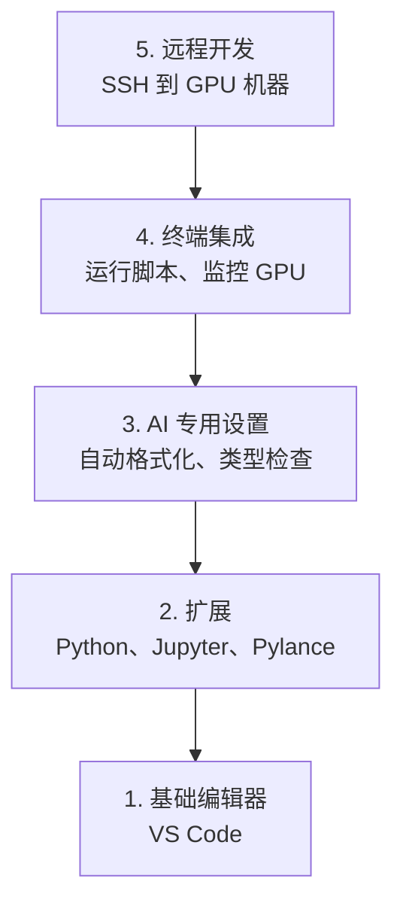

# 编辑器配置——AI 工程的最佳搭档

> 你的编辑器是你的副驾驶。配置一次，让它不再碍事而是全力帮你。

**类型：** 构建
**编程语言：** 无
**前置知识：** 第 00 阶段 · 01（开发环境配置）
**预计时间：** 20 分钟
**所处阶段：** Tier 1
**关联课程：** 第 00 阶段 · 02（Git 与协作）— GitLens 扩展增强 Git 集成

---

## 🎯 学习目标

完成本课后，你能够：

- [ ] 安装 VS Code 及 AI 工作的核心扩展
- [ ] 配置自动格式化、类型检查和笔记本输出滚动
- [ ] 设置 Remote SSH 在远程 GPU 机器上编辑代码
- [ ] 评估编辑器替代方案（Cursor、Windsurf、Neovim）

---

## 1. 问题

你将在编辑器中花数千小时写 Python、运行笔记本、调试训练循环、SSH 到 GPU 机器。配置不当的编辑器让每次会话都充满摩擦：没有自动补全、没有类型提示、没有内联错误、手动格式化、笨拙的终端。

正确的设置需要 20 分钟。跳过它每天浪费 20 分钟。

---

## 2. 核心概念

### 2.1 AI 工程编辑器需要五样东西



---

## 3. 从零实现

### 第 1 步：安装 VS Code

从 [code.visualstudio.com](https://code.visualstudio.com/) 下载。

```bash
code --version  # 验证
```

### 第 2 步：安装核心扩展

```bash
code --install-extension ms-python.python
code --install-extension ms-python.vscode-pylance
code --install-extension ms-toolsai.jupyter
code --install-extension eamodio.gitlens
code --install-extension ms-vscode-remote.remote-ssh
code --install-extension ms-python.debugpy
code --install-extension ms-python.black-formatter
code --install-extension charliermarsh.ruff
```

| 扩展 | 作用 |
|:-----|:-----|
| Python | 语言支持，虚拟环境检测 |
| Pylance | 快速类型检查、自动补全 |
| Jupyter | 在 VS Code 中运行笔记本 |
| GitLens | 查看谁改了什么，内联 blame |
| Remote SSH | 在远程机器上打开文件夹 |
| Black Formatter | 保存时自动格式化 |
| Ruff | 快速 lint 检查 |

### 第 3 步：配置设置

```json
{
    "python.analysis.typeCheckingMode": "basic",
    "editor.formatOnSave": true,
    "editor.rulers": [88, 120],
    "notebook.output.scrolling": true,
    "files.autoSave": "afterDelay"
}
```

为什么重要：

- **基本类型检查**：运行前捕获参数类型错误
- **保存时格式化**：Black 永远处理格式
- **88/120 标尺**：Black 在 88 列换行，120 标记注释过长
- **笔记本输出滚动**：训练循环打印数千行时不会爆炸

### 第 4 步：Remote SSH

```bash
# 生成 SSH 密钥
ssh-keygen -t ed25519 -C "your-email@example.com"
ssh-copy-id user@gpu-box-ip

# 添加到 ~/.ssh/config
Host gpu-box
    HostName 203.0.113.50
    User ubuntu
    IdentityFile ~/.ssh/id_ed25519
```

VS Code: `Ctrl+Shift+P` → "Remote-SSH: Connect to Host" → `gpu-box`

---

## 4. 工业工具

| 编辑器 | 特点 | 适用 |
|:-------|:-----|:-----|
| VS Code | 万能，Jupyter 一流支持 | 通用首选 |
| Cursor | AI 辅助编码 | 需要 AI 辅助 |
| Windsurf | AI 优先的 VS Code 分支 | 需要 AI 辅助 |
| Neovim | 可定制，快速 | 已熟练使用 Vim |

---

## 5. 知识连线

- **第 00 阶段 · 02（Git）**：GitLens 扩展让你在代码中看到谁改了什么
- **第 00 阶段 · 07（Docker）**：Remote SSH 让你在 GPU 机器上编辑，感觉像本地

---

## 6. 工程最佳实践

- **使用 Black + Ruff**：保存时格式化，永远不用手动调整
- **Remote SSH 前生成 SSH 密钥**：无密码访问，一键连接
- **中文场景特别建议**：Cursor 和 Windsurf 在国内访问稳定，可作为 VS Code 替代

---

## 7. 常见错误

### 错误 1：未安装 Pylance

**现象：** Python 代码没有自动补全和类型提示。

**原因：** 未安装 Pylance 扩展。

**修复：** `code --install-extension ms-python.vscode-pylance`。

### 错误 2：Remote SSH 连接超时

**现象：** 连接 GPU 机器时一直加载。

**原因：** 网络不通或 SSH 密钥未配置。

**修复：** 先用 `ssh user@host` 验证连接，再配置 Remote SSH。

---

## 8. 面试考点

### Q1：Remote SSH 工作原理是什么？（难度：⭐）

**参考答案：** VS Code 在远程机器上自动安装一个轻量级服务器组件。本地编辑器通过 SSH 与该服务器通信，远程运行终端、调试器和 LSP。你看到的 UI 是本地的，但代码和进程在远程机器上。

---

## 🔑 关键术语

| 术语 | 人们怎么说 | 实际含义 |
|:-----|:---------|:---------|
| LSP | "自动补全引擎" | 语言服务器协议——编辑器获取类型信息的标准 |
| Pylance | "Python 插件" | 微软的 Python 语言服务器 |
| Remote SSH | "在服务器上工作" | 远程机器上运行 VS Code 服务器的扩展 |

---

## 📚 小结

正确的编辑器配置是 AI 工程效率的基础。你安装了 VS Code、核心扩展、配置了类型检查和自动格式化、以及设置了 Remote SSH。下一课开始正式学习。

---

## ✏️ 练习

1. 【实现】安装所有列出的扩展
2. 【实现】将本课的 settings.json 复制到 VS Code 配置
3. 【理解】打开一个 Python 文件，验证 Pylance 显示类型提示且 Black 在保存时格式化

---

## 🚀 产出

| 产出 | 文件 | 说明 |
|:-----|:-----|:-----|
| VS Code 配置 | `code/.vscode/settings.json` | AI 工作推荐设置 |
| 扩展推荐 | `code/.vscode/extensions.json` | 推荐扩展列表 |

---

## 📖 参考资料

1. [官方文档] VS Code. https://code.visualstudio.com/docs
2. [官方文档] Pylance. https://marketplace.visualstudio.com/items?itemName=ms-python.vscode-pylance
3. [官方文档] Remote SSH. https://code.visualstudio.com/docs/remote/ssh
