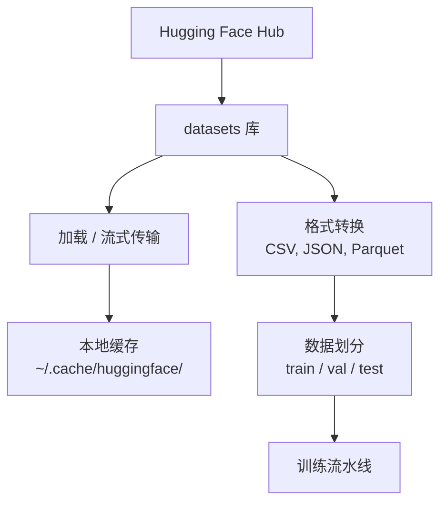

# 数据管理——AI 的燃料与管道

> 数据是燃料。管理方式决定你跑多快。

**类型：** 构建
**编程语言：** Python
**前置知识：** 第 00 阶段 · 01（开发环境配置）
**预计时间：** 45 分钟
**所处阶段：** Tier 1
**关联课程：** 第 00 阶段 · 06（Python 虚拟环境）— 安装 `datasets` 和 `huggingface_hub`

---

## 🎯 学习目标

完成本课后，你能够：

- [ ] 用 Hugging Face `datasets` 库加载、流式传输和缓存数据集
- [ ] 在 CSV、JSON、Parquet 和 Arrow 格式间转换并解释权衡
- [ ] 创建带固定随机种子的可复现训练/验证/测试集划分
- [ ] 用 `.gitignore`、Git LFS 或 DVC 管理大型模型和数据集文件

---

## 1. 问题

每个 AI 项目都从数据开始。你需要找到数据集、下载它们、转换格式、为训练和评测划分、版本化以确保实验可复现。手动操作慢且容易出错。你需要一个可重复的工作流。

---

## 2. 核心概念

### 2.1 数据管道



### 2.2 数据格式对比

| 格式 | 大小 | 读取速度 | 适用 |
|:-----|:-----|:---------|:-----|
| CSV | 大 | 慢 | 人类可读、电子表格 |
| JSON | 大 | 慢 | API、嵌套数据 |
| Parquet | 小 | 快 | 分析、列式查询 |
| Arrow | 小 | 最快 | 内存处理（datasets 内部） |

AI 工作中，Parquet 是最佳存储格式，Arrow 是内存中使用的格式，CSV 和 JSON 用于交换。

### 2.3 数据划分

每个 ML 项目需要三个划分：

- **训练集**：模型从此学习（通常 80%）
- **验证集**：训练期间检查进度（通常 10%）
- **测试集**：训练完成后的最终评估（通常 10%）

---

## 3. 从零实现

### 第 1 步：安装 datasets 库

```bash
pip install datasets huggingface_hub
```

### 第 2 步：加载数据集

```python
from datasets import load_dataset

dataset = load_dataset("imdb")
print(dataset)
print(dataset["train"][0])
```

首次下载后从 `~/.cache/huggingface/datasets/` 加载。

### 第 3 步：流式传输大型数据集

```python
dataset = load_dataset("wikimedia/wikipedia", "20220301.en", split="train", streaming=True)
for i, example in enumerate(dataset):
    print(example["title"])
    if i >= 4: break
```

### 第 4 步：格式转换

```python
dataset = load_dataset("imdb", split="train")
dataset.to_csv("imdb_train.csv")
dataset.to_json("imdb_train.json")
dataset.to_parquet("imdb_train.parquet")
```

### 第 5 步：数据划分

```python
dataset = load_dataset("imdb", split="train")
split = dataset.train_test_split(test_size=0.2, seed=42)
train_val = split["train"].train_test_split(test_size=0.125, seed=42)
train_ds, val_ds, test_ds = train_val["train"], train_val["test"], split["test"]
print(f"Train: {len(train_ds)}, Val: {len(val_ds)}, Test: {len(test_ds)}")
```

### 第 6 步：大文件管理

**方案 A：.gitignore（最简单）**

```
*.pt *.safetensors *.bin *.onnx models/ data/*.parquet
```

**方案 B：Git LFS（大文件追踪）**

```bash
git lfs install
git lfs track "*.bin" "*.safetensors"
git add .gitattributes
```

**方案 C：DVC（数据版本控制）**

```bash
pip install dvc; dvc init
dvc add data/training_set.parquet
git add data/training_set.parquet.dvc data/.gitignore
git commit -m "使用 DVC 追踪训练数据"
```

---

## 4. 工业工具

| 工具 | 适用 | 特点 |
|:-----|:-----|:-----|
| Hugging Face Datasets | 加载+缓存 | AI 标准方案 |
| Parquet | 存储 | 列式高效压缩 |
| Arrow | 内存 | 零拷贝读取 |
| DVC | 版本控制 | 可复现实验 |

---

## 5. 知识连线

- **第 04 阶段（计算机视觉）**：MNIST 和 CIFAR 数据集
- **第 05 阶段（NLP 基础）**：IMDB、WikiText 文本数据集
- **第 10 阶段（大语言模型从零）**：Common Crawl 大规模文本处理

---

## 6. 工程最佳实践

- **始终设置随机种子**：数据划分的可复现性依赖固定 seed
- **流式处理大文件**：10GB+ 数据集使用 `streaming=True`
- **用 Parquet 存储**：比 CSV 小 3-10 倍，读取快 5-10 倍
- **中文场景特别建议**：中文文本数据集（如 CLUE）在 HF Hub 上通常按子任务拆分，使用 `subset` 参数加载特定子集

---

## 7. 常见错误

### 错误 1：未设置种子的数据划分

**现象：** 每次运行训练结果不同，无法复现。

**原因：** `train_test_split` 默认随机划分。

**修复：** 始终传入 `seed=42`。

### 错误 2：将大数据集提交到 Git

**现象：** `git push` 超时或失败。

**原因：** 数据文件未被 `.gitignore` 排除。

**修复：** 在 `.gitignore` 中添加 `data/` 和 `*.parquet`。

---

## 8. 面试考点

### Q1：Parquet 比 CSV 好在哪里？（难度：⭐）

**参考答案：** Parquet 使用列式存储——读取特定列时只加载该列数据（而非整行）。压缩比高（通常 3-10 倍于 CSV），读取快 5-10 倍。CSV 需要解析每行，而 Parquet 直接加载二进制数据。

---

## 🔑 关键术语

| 术语 | 含义 |
|:-----|:-----|
| 数据集划分 | 训练/验证/测试集的命名子集 |
| 流式传输 | 逐行处理远程数据，不下载完整数据集 |
| Parquet | 列式存储格式，高效查询和压缩 |
| DVC | 数据版本控制——用 Git 追踪大文件变更 |

---

## 📚 小结

数据管理是 AI 项目的起点。你学会了用 Hugging Face Datasets 加载和转换数据、创建可复现的划分、以及管理大文件的三种方式。下一课学习终端和 Shell。

---

## ✏️ 练习

1. 【实现】加载 `glue` 数据集的 `mrpc` 配置，检查前 5 条示例
2. 【实现】将数据集转为 Parquet 并对比文件大小
3. 【实现】创建 70/15/15 划分并验证各集大小

---

## 🚀 产出

| 产出 | 文件 | 说明 |
|:-----|:-----|:-----|
| 数据工具 | `code/data_utils.py` | 数据加载、转换、划分 |

---

## 📖 参考资料

1. [官方文档] Hugging Face Datasets. https://huggingface.co/docs/datasets/
2. [官方文档] DVC. https://dvc.org/doc
3. [官方文档] Git LFS. https://git-lfs.github.com/
