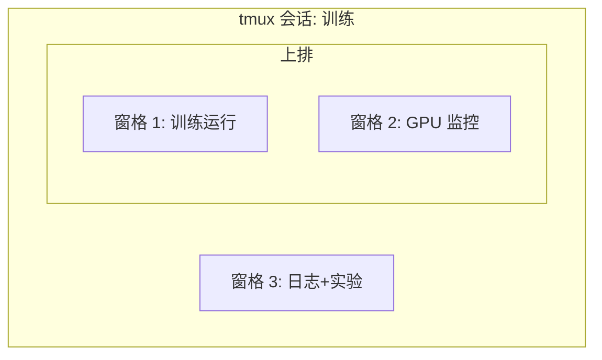

# 终端与 Shell——AI 工程师的主战场

> 终端是 AI 工程师待得最久的地方。在这里变得高效。

**类型：** 概念课
**编程语言：** Shell
**前置知识：** 第 00 阶段 · 01（开发环境配置）
**预计时间：** 35 分钟
**所处阶段：** Tier 1
**关联课程：** 第 00 阶段 · 03（GPU 与云）— SSH 和远程 GPU 管理是终端核心场景

---

## 🎯 学习目标

完成本课后，你能够：

- [ ] 用管道、重定向和 `grep` 从命令行过滤训练日志
- [ ] 创建多窗格 tmux 会话，同时训练和监控 GPU
- [ ] 用 `htop`、`nvtop`、`nvidia-smi` 监控系统和 GPU 资源
- [ ] 用 SSH、`scp`、`rsync` 在本地和远程机器间传输文件

---

## 1. 问题

你在终端中度过的时间会比任何编辑器都多。训练运行、GPU 监控、日志追踪、远程 SSH 会话、环境管理。每个 AI 工作流都涉及 Shell。这里慢了，哪里都慢。

本节涵盖 AI 工作最重要的终端技能。没有 Unix 历史。没有深入 Bash 脚本。只有你需要的。

---

## 2. 核心概念

### 2.1 tmux 会话结构



三个同时运行的进程。一个终端。你可以分离、回家、SSH 回来、重连。训练继续。

### 2.2 重定向速查

| 符号 | 作用 |
|:-----|:-----|
| `>` | stdout 写入文件（覆盖） |
| `>>` | stdout 追加到文件 |
| `2>` | stderr 写入文件 |
| `2>&1` | stderr 和 stdout 同向 |
| `\|` | stdout 作为下一个命令的 stdin |

---

## 3. 从零实现

### 第 1 步：Shell 基础

```bash
# 最有用的快捷键
# Ctrl+R → 输入历史命令片段搜索
# Ctrl+C → 中断运行
# Ctrl+L → 清屏
```

### 第 2 步：管道和重定向

```bash
# 追踪日志并过滤错误
tail -f train.log | grep --line-buffered "ERROR"

# 提取损失值
grep "loss:" train.log | awk '{print $NF}' > losses.txt

# stdout 和 stderr 分别重定向
python train.py > output.log 2> errors.log
```

### 第 3 步：后台进程

```bash
# 后台运行（关闭终端会终止）
python train.py &

# 后台运行（关闭终端不终止）
nohup python train.py > train.log 2>&1 &

# 检查后台进程
jobs; ps aux | grep train.py

# 终止
kill %1
```

### 第 4 步：tmux

```bash
# 安装
# macOS
brew install tmux
# Ubuntu
sudo apt install tmux

# 启动命名会话
tmux new -s training

# 分屏（Ctrl+B 然后按 " 水平分割，% 垂直分割）
# 分离训练继续（Ctrl+B 然后 d）
# 重连
tmux attach -t training
```

典型 AI 工作流：

```bash
tmux new -s train
# 窗格 1: 训练
python train.py --epochs 100
# Ctrl+B " 水平分割
watch -n1 nvidia-smi
# Ctrl+B % 垂直分割
tail -f logs/experiment.log
# 分离 Ctrl+B d，回家 SSH 重连 tmux attach -t train
```

### 第 5 步：监控工具

```bash
htop           # 系统进程（比 top 好）
nvtop          # GPU 进程（需要安装）
nvidia-smi     # 快速 GPU 检查
watch -n1 nvidia-smi  # 每秒更新
```

### 第 6 步：SSH 与文件传输

```bash
# 连接远程
ssh user@gpu-box-ip

# 复制文件到远程
scp model.pt user@gpu-box:~/models/

# 同步目录（断点续传）
rsync -avz --progress ./data/ user@gpu-box:~/data/

# 端口转发（远程 Jupyter 本地访问）
ssh -L 8888:localhost:8888 user@gpu-box
```

### 第 7 步：AI 常用模式

```bash
# 训练运行、记录所有日志、完成后通知
python train.py 2>&1 | tee train.log; echo "DONE" | mail -s "训练完成" you@email.com

# 找到最大的模型文件
find . -name "*.pt" -o -name "*.safetensors" | xargs du -h | sort -rh | head -20

# 检查磁盘空间
df -h; du -sh ./data/*
```

---

## 4. 工业工具

| 工具 | 用途 | 何时用 |
|:-----|:-----|:--------|
| tmux | 持久会话 | 每次训练运行（第 3 阶段+） |
| `tail -f` + `grep` | 监控训练日志 | 实时 |
| `htop` / `nvtop` | 调试慢训练、OOM | 问题诊断 |
| SSH + `rsync` | 远程 GPU 操作 | 云 GPU |

---

## 5. 知识连线

- **第 00 阶段 · 03（GPU 与云）**：SSH 是连接远程 GPU 的入口
- **第 00 阶段 · 07（Docker）**：容器内使用相同终端技能
- **第 03 阶段（深度学习核心）**：每个训练运行都需要 tmux 管理

---

## 6. 工程最佳实践

- **长时间训练用 tmux**：`command &` 和 `nohup` 都不如 tmux 方便
- **日志写入文件而非终端**：终端会滚动丢失，文件可搜索
- **用 rsync 替代 scp**：大文件传输更快，支持断点续传
- **中文场景特别建议**：远程机器的终端编码通常不支持中文——日志使用英文

---

## 7. 常见错误

### 错误 1：训练终端关闭导致进程终止

**现象：** SSH 断开后训练停止。

**原因：** 直接在 SSH 会话中运行命令。

**修复：** 始终在 tmux 会话中运行长时间任务。`tmux new -s train` → 运行训练 → `Ctrl+B d` → SSH 断开 → `tmux attach -t train` 重连。

### 错误 2：用 `>` 而非 `>>` 覆盖日志

**现象：** 每次运行覆盖之前所有日志。

**原因：** `>` 覆盖，`>>` 追加。

**修复：** 用 `>>` 追加，或在文件名中包含日期：`train_$(date +%Y%m%d).log`。

---

## 8. 面试考点

### Q1：tmux vs nohup 的区别？（难度：⭐）

**参考答案：** nohup 让进程在终端关闭后继续，但无法重连。tmux 在虚拟会话中运行，可以分离后重连，还可以多窗格并行。对 AI 工作来说，tmux 的分屏功能是关键——训练、监控、日志同时可见。

---

## 🔑 关键术语

| 术语 | 人们怎么说 | 实际含义 |
|:-----|:---------|:---------|
| Shell | "终端" | 解释命令的程序（bash、zsh） |
| tmux | "终端多路复用器" | 在一个窗口中运行多个终端会话 |
| 管道 | "竖线" | `\|` 运算符，将前一命令输出作为后一命令输入 |
| nohup | "不中断" | 运行命令时不响应挂断信号，终端关闭不杀进程 |

---

## 📚 小结

终端是 AI 工程的核心界面。你学会了管道重定向、后台进程、tmux 多窗格、监控工具和远程文件传输。下一课学习 Linux 基础。

---

## ✏️ 练习

1. 【实现】安装 tmux，创建三窗格会话：运行 `htop`、`watch -n1 date`、Python 脚本
2. 【实验】创建模拟训练日志，用 `grep`、`tail`、`awk` 提取损失值
3. 【理解】用 `df -h` 检查磁盘空间，用 `du -sh ~/.cache/*` 找到缓存占用

---

## 🚀 产出

| 产出 | 文件 | 说明 |
|:-----|:-----|:-----|
| Shell 别名 | `code/shell_aliases.sh` | AI 工作常用别名 |

---

## 📖 参考资料

1. [博客] The Missing Semester of Your CS Education. https://missing.csail.mit.edu/
2. [官方文档] tmux. https://github.com/tmux/tmux
