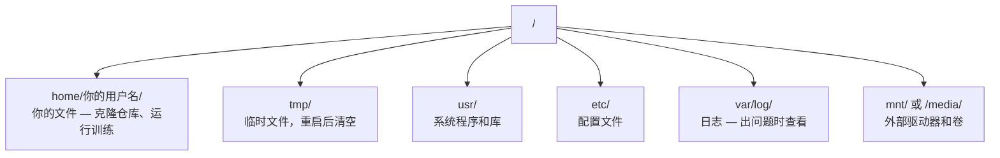

# Linux 基础——远程 GPU 机器的生存指南

> 大多数 AI 运行在 Linux 上。你需要知道足够多才不会卡住。

**类型：** 概念课
**编程语言：** Shell
**前置知识：** 第 00 阶段 · 01（开发环境配置）
**预计时间：** 30 分钟
**所处阶段：** Tier 1
**关联课程：** 第 00 阶段 · 10（终端与 Shell）— tmux 和 SSH 与此节紧密配合

---

## 🎯 学习目标

完成本课后，你能够：

- [ ] 导航 Linux 文件系统并执行基本文件操作
- [ ] 用 `chmod` 和 `chown` 管理文件权限
- [ ] 用 `apt` 安装系统包并配置新的 GPU 机器
- [ ] 识别 macOS 到 Linux 的常见差异

---

## 1. 问题

你在 macOS 或 Windows 上开发。但一旦 SSH 到云 GPU 盒子、租用 Lambda 实例、启动 EC2 机器，你就进入了 Ubuntu。终端是唯一的界面。没有 Finder、没有资源管理器、没有 GUI。如果不能导航文件系统、安装包、从命令行管理进程，你就卡在为 GPU 付费的同时搜索"Linux 中如何解压文件"。

本节是生存指南。覆盖在远程 Linux 机器上 AI 工作所需的一切。

---

## 2. 核心概念

### 2.1 Linux 文件系统布局



你的 home 目录是 `~` 或 `/home/你的用户名`。几乎所有操作都在这里。

### 2.2 15 个核心命令

导航：`pwd`, `ls -la`, `cd`
文件：`cp`, `mv`, `rm -rf`（永久删除，无撤销）
读取：`cat`, `head`, `tail -f`, `less`
搜索：`grep`, `find`
权限：`chmod +x`, `sudo`
包管理：`sudo apt update && sudo apt install`
进程：`htop`, `ps aux | grep`, `kill`
磁盘：`df -h`, `du -sh`
网络：`curl`, `wget`, `scp`, `rsync`
会话：`tmux`

---

## 3. 从零实现

### 第 1 步：导航与文件操作

```bash
pwd                          # 我在哪里？
ls -la                       # 这里有什么？（含隐藏文件和详细信息）
cd ~/projects                # 去那里
mkdir -p a/b/c               # 一次创建嵌套目录
cp -r src/ src-backup/       # 复制目录（递归）
rm -rf my-dir/               # 删除目录（永久，无撤销！）
```

### 第 2 步：权限管理

```bash
ls -l train.py
# -rwxr-xr-- 1 user group 2048 Mar 19 10:00 train.py
# ^^^ 所有者   ^^^ 组      ^^ 其他人

chmod +x train.sh            # 使脚本可执行
chmod 755 deploy.sh          # 所有者完全，其他人读+执行
chmod 644 config.yaml        # 所有者读写，其他人只读
chown user:group file.txt    # 更改所有者（需要 sudo）
```

### 第 3 步：包管理 apt

```bash
sudo apt update                           # 刷新包列表
sudo apt install -y htop tmux unzip       # 安装包
sudo apt install -y build-essential       # C 编译器、make
```

新 GPU 机器的标配安装：

```bash
sudo apt update && sudo apt install -y build-essential git curl wget tmux htop unzip python3-venv
```

### 第 4 步：磁盘空间

```bash
df -h                              # 所有挂载驱动器的使用情况
du -sh *                           # 当前目录各项大小
du -sh ~/.cache                    # 缓存大小
du -h --max-depth=1 / 2>/dev/null | sort -hr | head -20  # 找最大空间占用

# 清理
pip cache purge                    # 清理 pip 缓存
sudo apt clean                     # 清理 apt 缓存
```

### 第 5 步：网络和传输

```bash
# 下载
wget https://example.com/model.bin
curl -O https://example.com/data.tar.gz

# 传输
scp model.pt user@remote:/data/
rsync -avz --progress ./data/ user@remote:/data/  # 断点续传
```

### 第 6 步：WSL2（Windows 用户）

```bash
# PowerShell (管理员)
wsl --install -d Ubuntu-24.04

# 重启后，在 Ubuntu 中：
sudo apt update && sudo apt upgrade -y
```

WSL2 运行真实的 Linux 内核。所有本节内容在其中有效。GPU 直通通过 Windows 侧 NVIDIA 驱动支持。

---

## 4. 工业工具

| 命令 | 用途 | 频率 |
|:-----|:-----|:-----|
| `ls -la` | 查看文件详情 | 极高 |
| `grep` | 搜索日志 | 极高 |
| `tail -f` | 实时日志追踪 | 训练时 |
| `chmod` | 修复权限 | 脚本不可执行时 |
| `apt install` | 安装系统包 | 设置新机器 |

---

## 5. 知识连线

- **第 00 阶段 · 10（终端与 Shell）**：tmux 和管道在此节基础上扩展
- **第 00 阶段 · 03（GPU 与云）**：云 GPU 实例就是 Linux 机器
- **第 17 阶段（基础设施）**：生产环境完全在 Linux 上

---

## 6. 工程最佳实践

- **`rm -rf` 永久删除**：没有撤销。执行前双击检查路径
- **`rsync` 优于 `scp`**：大文件传输更快，支持断点续传
- **使用 WSL2 而非双启动**：Windows 用户获得完整 Linux 环境
- **中文场景特别建议**：远程机器终端通常不支持中文显示——日志和文件名使用英文

---

## 7. 常见错误

### 错误 1：权限拒绝

**现象：** `Permission denied`。

**原因：** 文件没有执行权限，或目录没有写权限。

**修复：** `chmod +x script.sh` 或 `sudo`。

### 错误 2：区分大小写不敏感

**现象：** `Model.py` 和 `model.py` 是两个不同文件。

**原因：** Linux 是大小写敏感文件系统，macOS 默认不敏感。

**修复：** 始终检查文件名大小写。

---

## 8. 面试考点

### Q1：WSL2 如何支持 GPU？（难度：⭐）

**参考答案：** WSL2 运行在 Windows 主机 GPU 之上。只需在 Windows 侧安装 NVIDIA 驱动（不需要 Linux 版本），CUDA 在 WSL2 内部即可用。WSL2 通过虚拟化层将 Windows 的 GPU 直通给 Linux 内核。

---

## 🔑 关键术语

| 术语 | 含义 |
|:-----|:-----|
| home 目录 | `~` 或 `/home/用户名`，你的文件所在位置 |
| chmod | 修改文件权限（读/写/执行） |
| apt | Ubuntu/Debian 的包管理器 |
| WSL2 | Windows Subsystem for Linux 2——Windows 中的 Linux 内核 |
| `rm -rf` | 递归强制删除——永久，无撤销 |

---

## 📚 小结

Linux 是 AI 工作的主战场。你学会了文件操作、权限管理、包管理、磁盘监控和 WSL2。这些是在远程 GPU 机器上不卡住的基础。下一课学习调试与性能分析。

---

## ✏️ 练习

1. 【实现】SSH 到任何 Linux 机器，创建项目目录，用 `touch` 创建文件
2. 【实现】用 apt 安装 `htop`，运行并找出内存占用最大的进程
3. 【实验】用 `df -h` 和 `du -sh ~/.cache/*` 分析磁盘占用

---

## 🚀 产出

| 产出 | 文件 | 说明 |
|:-----|:-----|:-----|
| Linux 速查卡 | `outputs/cheatsheet-linux.md` | 15 个核心命令速查 |

---

## 📖 参考资料

1. [博客] Linux 命令行完整指南. https://linuxcommand.org/
2. [官方文档] WSL2. https://learn.microsoft.com/zh-cn/windows/wsl/
