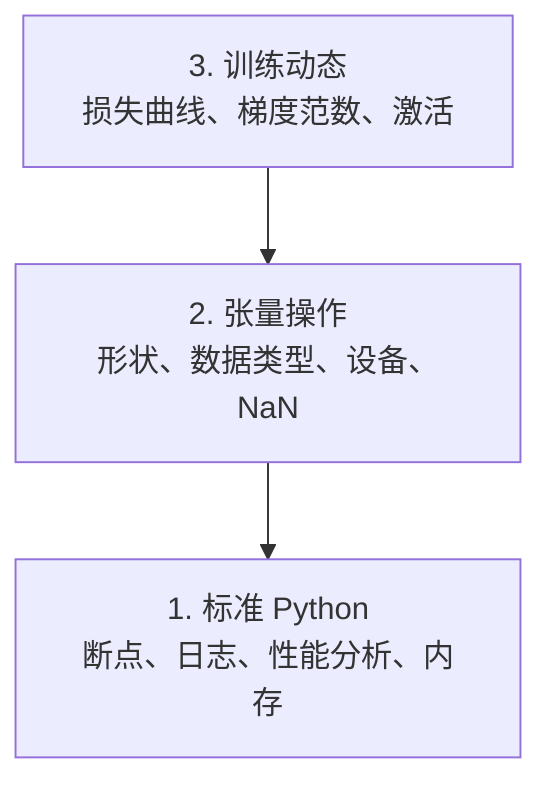

# 调试与性能分析——AI 代码的隐形错误

> 最糟糕的 AI bug 不会崩溃。它们在垃圾数据上静默训练，然后报告漂亮的损失曲线。

**类型：** 构建
**编程语言：** Python
**前置知识：** 第 00 阶段 · 01（开发环境配置）、基本 PyTorch 熟悉度
**预计时间：** 60 分钟
**所处阶段：** Tier 1
**关联课程：** 第 03 阶段 · 05（PyTorch 入门）— 本课的 `breakpoint()` 调试是后续所有 GPU 训练的核心技能

---

## 🎯 学习目标

完成本课后，你能够：

- [ ] 用 `debug_print` 检查张量形状、数据类型和 NaN 值
- [ ] 用 `cProfile`、`line_profiler`、`tracemalloc` 分析训练瓶颈
- [ ] 检测常见 AI bug：形状不匹配、NaN 损失、数据泄漏、设备不匹配
- [ ] 配置 TensorBoard 可视化损失曲线、权重直方图和梯度分布

---

## 1. 问题

AI 代码的失败方式不同于普通代码。Web 应用崩溃有堆栈跟踪。训练循环配置错误则运行 8 小时，花掉 $200 GPU 费用，然后输出一个对每个输入都预测均值的模型。代码从未报错。bug 是错误设备上的张量、遗忘的 `.detach()` 或泄露到特征中的标签。

---

## 2. 核心概念

### 2.1 AI 调试三层



80% 的 AI bug 在第 1 和第 2 层。

---

## 3. 从零实现

### 第 1 步：打印调试（真的有用）

```python
def debug_print(name, tensor):
    print(f"{name}: shape={tensor.shape}, dtype={tensor.dtype}, "
          f"device={tensor.device}, "
          f"min={tensor.min().item():.4f}, max={tensor.max().item():.4f}, "
          f"mean={tensor.mean().item():.4f}, "
          f"has_nan={tensor.isnan().any().item()}")
```

### 第 2 步：条件断点

```python
if loss.item() > 100 or torch.isnan(loss):
    breakpoint()  # 只在异常时停下
```

调试时使用：`p outputs.shape`、`p torch.isnan(outputs).sum()`、`c` 继续、`q` 退出。

### 第 3 步：Python 日志

```python
import logging
logging.basicConfig(level=logging.INFO, format="%(asctime)s [%(levelname)s] %(message)s",
                    handlers=[logging.FileHandler("training.log"), logging.StreamHandler()])
logger = logging.getLogger(__name__)
logger.info("开始训练: lr=%.4f, batch_size=%d", lr, batch_size)
```

### 第 4 步：内存分析

```python
# GPU 内存
if torch.cuda.is_available():
    print(f"已分配: {torch.cuda.memory_allocated()/1e9:.2f}GB")
    print(f"已缓存: {torch.cuda.memory_reserved()/1e9:.2f}GB")

# OOM 修复顺序：减小批次大小 → empty_cache() → 混合精度 → 梯度检查点
```

### 第 5 步：常见 AI Bug

| Bug | 现象 | 检测方法 |
|:----|:-----|:---------|
| 形状不匹配 | 运行时维度错误 | 每层 forward hook 检查形状 |
| NaN 损失 | 训练发散 | `torch.isnan(loss)` 检查 |
| 数据泄漏 | 测试集准确率 99% | 检查训练/测试集 ID 重叠 |
| 设备不匹配 | 隐式 CPU 运行慢 | 检查所有张量 `.device` |

### 第 6 步：TensorBoard

```python
from torch.utils.tensorboard import SummaryWriter
writer = SummaryWriter("runs/exp_1")
for step in range(num_steps):
    loss = train_step(model, batch)
    writer.add_scalar("loss/train", loss.item(), step)
    writer.add_scalar("lr", optimizer.param_groups[0]["lr"], step)
writer.close()
```

```bash
tensorboard --logdir=runs
```

TensorBoard 诊断：
- 损失不下降 → 学习率太低
- 损失剧烈振荡 → 学习率太高
- 损失变 NaN → 数值不稳定
- 训练损失降、验证损失升 → 过拟合
- 权重直方图趋零 → 梯度消失
- 梯度直方图爆炸 → 需要梯度裁剪

---

## 4. 工业工具

| 工具 | 用途 | 特点 |
|:-----|:-----|:-----|
| `breakpoint()` | 交互调试 | Python 内置 |
| TensorBoard | 训练可视化 | 损失、权重、梯度 |
| `cProfile` | 函数级分析 | 识别最慢函数 |
| `tracemalloc` | 内存分析 | 找到分配最多的行 |
| PyTorch `torch.profiler` | GPU 分析 | CUDA 和 CPU 操作 |

---

## 5. 知识连线

- **第 03 阶段 · 05（PyTorch 入门）**：`debug_print` 是调试张量操作的核心
- **第 19 阶段（综合项目）**：TensorBoard 在 87 课中用于监控所有训练运行
- **第 00 阶段 · 10（终端与 Shell）**：`htop` 和 `nvtop` 是系统级调试

---

## 6. 工程最佳实践

- **先检查形状再运行**：用 forward hook 检查模型每层形状
- **前 10 步用 `debug_print`**：检查 NaN 和值范围
- **训练中记录损失和梯度范数**：TensorBoard 可视化
- **中文场景特别建议**：TensorBoard 标签使用英文——中文标签在某些版本中显示异常

---

## 7. 常见错误

### 错误 1：张量在错误设备上静默运行

**现象：** 模型在 GPU，但某张量在 CPU——训练极慢。

**原因：** 忘记 `.to(device)` 或在错误位置创建张量。

**修复：** 用 `check_devices` 函数检查所有张量的设备。

### 错误 2：NaN 损失后继续训练

**现象：** 训练继续但所有权重变为 NaN。

**原因：** 未检测 NaN。

**修复：** 在训练循环中添加 `if torch.isnan(loss): print("NaN 步", step); breakpoint()`。

---

## 8. 面试考点

### Q1：AI 代码中最常见的隐形 bug 是什么？（难度：⭐⭐）

**参考答案：** 最常见的是设备不匹配——模型在 GPU 但输入在 CPU。这不会崩溃，训练继续运行，只是极慢（隐式传输开销）。其次是 NaN 损失——某层的数值不稳定导致所有后续权重被污染。第三是数据泄漏——训练集和测试集有重叠，导致评估指标虚高。

---

## 🔑 关键术语

| 术语 | 含义 |
|:-----|:-----|
| breakpoint() | Python 内置调试器，条件断点 |
| TensorBoard | 训练动态的可视化仪表板 |
| cProfile | 函数级 Python 性能分析器 |
| tracemalloc | 内存分配跟踪器 |
| forward hook | 在模型每层执行时触发的回调 |

---

## 📚 小结

AI 代码需要不同的调试方法。你学会了 `debug_print`、条件断点、TensorBoard 可视化，以及检测形状不匹配、NaN 损失、数据泄漏和设备错误。这些工具将帮助你发现 AI 代码中的隐形 bug。

---

## ✏️ 练习

1. 【实现】运行 `debug_tools.py`，故意在模型中引入 NaN（除零），观察检测器
2. 【实验】用 `cProfile` 分析训练循环，找出最慢的函数
3. 【实现】用 `tracemalloc` 找到数据加载管道中内存分配最多的行

---

## 🚀 产出

| 产出 | 文件 | 说明 |
|:-----|:-----|:-----|
| 调试工具集 | `code/debug_tools.py` | 张量检查、NaN 检测、设备检查、TensorBoard |

---

## 📖 参考资料

1. [官方文档] Python `breakpoint()`. https://docs.python.org/3/library/pdb.html
2. [官方文档] TensorBoard. https://www.tensorflow.org/tensorboard
3. [官方文档] PyTorch `torch.profiler`. https://pytorch.org/docs/stable/profiler.html
