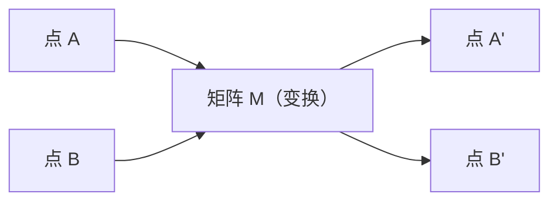

# 线性代数直觉——AI 模型就是戴着精致帽子的矩阵数学

> 每个 AI 模型就是戴着精致帽子的矩阵数学。

**类型：** 概念课
**编程语言：** Python、Julia
**前置知识：** 第 00 阶段（环境搭建）
**预计时间：** 60 分钟
**所处阶段：** Tier 1
**关联课程：** 第 01 阶段 · 02（向量矩阵运算）— 本节建立直觉，下节用代码构建完整操作

---

## 🎯 学习目标

完成本课后，你能够：

- [ ] 从零实现向量和矩阵运算（加法、点积、矩阵乘法）
- [ ] 从几何角度解释点积、投影和 Gram-Schmidt 过程
- [ ] 用行化简确定向量集的线性无关性、秩和基
- [ ] 将线性代数概念与 AI 应用联系起来：嵌入、注意力分数、LoRA

---

## 1. 问题

打开任何 ML 论文。第一页内你就会看到向量、矩阵、点积和变换。没有线性代数直觉，这些只是符号。有了直觉，你就能看到神经网络实际上在做什么——在空间中移动点。

你不需要成为数学家。你需要看到这些操作的几何意义，然后自己编码实现。

---

## 2. 核心概念

### 2.1 向量是点（也是方向）

向量就是数字列表。但这些数字有意义——它们是空间中的坐标。

```
向量 [3, 2] → 从原点 (0,0) 到 (3,2) 的箭头
大小：sqrt(3² + 2²) = sqrt(13)
方向：向右上方
```

在 AI 中，向量代表一切：
- 一个词 → 768 个数字的向量（嵌入空间中的"含义"）
- 一张图像 → 数百万像素值的向量
- 一个用户 → 偏好的向量

### 2.2 矩阵是变换

矩阵将一个向量变换为另一个。它可以旋转、缩放、拉伸或投影。



在 AI 中，矩阵就是模型：
- 神经网络权重 → 将输入变换为输出的矩阵
- 注意力分数 → 决定关注什么的矩阵
- 嵌入 → 将词映射为向量的矩阵

### 2.3 点积衡量相似性

```
a · b = a₁×b₁ + a₂×b₂ + ... + aₙ×bₙ

同方向:   a · b > 0  （相似）
垂直:     a · b = 0  （无关）
反方向:   a · b < 0  （不同）
```

这正是搜索引擎、推荐系统和 RAG 的工作方式——找到点积高的向量。

### 2.4 线性无关与秩

**线性无关**：向量集合中没有任何向量可以写成其他向量的组合。

```
v1 = [1, 0, 0]   ← 独立
v2 = [0, 1, 0]   ← 独立
v3 = [2, 1, 0]   ← v3 = 2*v1 + v2，依赖！
```

三个向量但只有两个自由维度。在 AI 中，特征矩阵应该有线性无关的列——如果两个特征完全相关（线性相关），模型无法区分它们的效应，导致多重共线性。

**秩（Rank）** = 线性无关列数 = 线性无关行数。

| 情况 | 秩 | 对 AI 的意义 |
|:-----|:---|:------------|
| 满秩 | = min(m, n) | 最小二乘唯一解存在。模型条件良好 |
| 秩亏 | < min(m, n) | 特征冗余。无数权重解。需要正则化 |
| 秩 1 | = 1 | 每列都是一个向量的缩放副本。数据在一条线上 |

### 2.5 投影

将向量 **a** 投影到 **b** 上：

```
proj_b(a) = (a·b / b·b) × b
```

残差 (a - proj_b(a)) 垂直于 b。这种正交分解是最小二乘拟合的基础。

投影在 ML 中无处不在：
- 线性回归最小化观测值到列空间的距离——解就是投影
- PCA 将数据投影到最大方差方向
- Transformer 中的注意力计算查询到键的投影

### 2.6 Gram-Schmidt 过程

将任意向量集转换为标准正交基。标准正交意味着每个向量长度为 1 且两两垂直。

```
输入: v1, v2, v3, ...
u1 = v1 / |v1|
w2 = v2 - (v2·u1) × u1
u2 = w2 / |w2|
w3 = v3 - (v3·u1) × u1 - (v3·u2) × u2
u3 = w3 / |w3|
输出: u1, u2, u3, ...  (标准正交基)
```

这就是 QR 分解的内部原理。Q 是标准正交基，R 捕获投影系数。

---

## 3. 从零实现

### 第 1 步：从零实现向量

```python
class Vector:
    def __init__(self, components):
        self.components = list(components)
        self.dim = len(self.components)
    def __add__(self, other):
        return Vector([a + b for a, b in zip(self.components, other.components)])
    def dot(self, other):
        return sum(a * b for a, b in zip(self.components, other.components))
    def magnitude(self):
        return sum(x**2 for x in self.components) ** 0.5
    def normalize(self):
        m = self.magnitude()
        return Vector([x / m for x in self.components])
    def cosine_similarity(self, other):
        return self.dot(other) / (self.magnitude() * other.magnitude())
    def __repr__(self):
        return f"Vector({self.components})"

a = Vector([1, 2, 3])
b = Vector([4, 5, 6])
print(f"a · b = {a.dot(b)}")           # 32
print(f"cos sim = {a.cosine_similarity(b):.4f}")  # 0.9746
```

### 第 2 步：从零实现矩阵

```python
class Matrix:
    def __init__(self, rows):
        self.rows = [list(row) for row in rows]
        self.shape = (len(self.rows), len(self.rows[0]))
    def __matmul__(self, other):
        if isinstance(other, Vector):
            return Vector([
                sum(self.rows[i][j] * other.components[j] for j in range(self.shape[1]))
                for i in range(self.shape[0])])
        rows = []
        for i in range(self.shape[0]):
            row = [sum(self.rows[i][k] * other.rows[k][j] for k in range(self.shape[1]))
                   for j in range(other.shape[1])]
            rows.append(row)
        return Matrix(rows)
    def __repr__(self):
        return f"Matrix({self.rows})"

rotation_90 = Matrix([[0, -1], [1, 0]])
point = Vector([3, 1])
rotated = rotation_90 @ point
print(f"旋转 90°: {rotated}")  # Vector([-1, 3])
```

### 第 3 步：投影与 Gram-Schmidt

```python
def project(a, b):
    scalar = a.dot(b) / b.dot(b)
    return Vector([scalar * x for x in b.components])

def gram_schmidt(vectors):
    orthonormal = []
    for v in vectors:
        w = v
        for u in orthonormal:
            w = Vector([x - project(w, u).components[i] for i, x in enumerate(w.components)])
        if w.magnitude() > 1e-10:
            orthonormal.append(w.normalize())
    return orthonormal

v1, v2, v3 = Vector([1, 0, 0]), Vector([1, 1, 0]), Vector([1, 1, 1])
basis = gram_schmidt([v1, v2, v3])
for i, u in enumerate(basis):
    print(f"u{i+1} = {u}, |u{i+1}| = {u.magnitude():.4f}")
```

### 第 4 步：与 AI 的联系

```python
import random
random.seed(42)
weights = Matrix([[random.gauss(0, 0.1) for _ in range(3)] for _ in range(2)])
x = Vector([1.0, 0.5, -0.3])
output = weights @ x
print(f"输入 (3D): {x}")
print(f"输出 (2D): {output}")
print("这就是神经网络层——矩阵乘法。")
```

---

## 4. 工业工具

### 4.1 NumPy 实现

```python
import numpy as np
a = np.array([1, 2, 3], dtype=float)
b = np.array([4, 5, 6], dtype=float)
print(f"cos sim = {np.dot(a, b) / (np.linalg.norm(a) * np.linalg.norm(b)):.4f}")
```

### 4.2 PyTorch 自动微分

```python
import torch
x = torch.randn(3, requires_grad=True)
y = torch.tensor([1.0, 0.0, 0.0])
sim = torch.dot(x, y)
sim.backward()
print(f"d(dot)/dx = {x.grad}")  # 梯度就是 y
```

---

## 5. 知识连线

本节建立的直觉是后续所有 AI 课程的基础：

- **第 03 阶段 · 03（矩阵变换）**：特征值和特征向量是 PCA 和 RNN 稳定性的核心
- **第 07 阶段（Transformer 深入）**：注意力分数就是 Q 和 K 的点积
- **第 19 阶段 · 60（投影层）**：模态对齐就是视觉特征到语言空间的投影

---

## 6. 工程最佳实践

- **用 NumPy/PyTorch 替代手写循环**：手写的目的是理解原理，生产环境使用 BLAS 加速实现
- **点积衡量相似性是全局的**：语义搜索、推荐系统、RAG 都基于这一原理
- **中文场景特别建议**：中文分词后的词元嵌入向量间的点积，比原始字节级表示更准确地反映语义相似度

---

## 7. 常见错误

### 错误 1：混淆向量和标量

**现象：** 代码中 `v * w` 被误解为点积。

**原因：** 数学中 `a · b` 表示点积，但 Python 中 `*` 是逐元素乘法。

**修复：** 点积用 `sum(a*b for a,b in zip(v,w))` 或 `np.dot(a,b)`。

### 错误 2：秩亏矩阵求逆

**现象：** `np.linalg.inv(A)` 报错。

**原因：** 矩阵不可逆（行列式为零）。

**修复：** 使用伪逆 `np.linalg.pinv(A)` 或添加正则化。

---

## 8. 面试考点

### Q1：点积在 AI 中的三个核心应用是什么？（难度：⭐）

**参考答案：** (1) 语义搜索——计算查询向量与文档向量的点积，找到最相关的文档；(2) 注意力机制——Transformer 中 Q 和 K 的点积决定注意力权重；(3) 推荐系统——用户向量和物品向量的点积预测相关性。

### Q2：LoRA 为什么用低秩矩阵？（难度：⭐⭐⭐）

**参考答案：** LoRA 将权重更新分解为两个低秩矩阵：A (4096×16) 和 B (16×4096)，仅 131K 参数替代 16M 的全权重更新。这假设权重更新在一个 16 维子空间中——即秩为 16。这基于实证观察：微调的权重变化矩阵确实是低秩的。LoRA 是线性代数在现代 LLM 中的直接应用。

---

## 🔑 关键术语

| 术语 | 人们怎么说 | 实际含义 |
|:-----|:---------|:---------|
| 向量 | "一个箭头" | n 维空间中的一个点或方向 |
| 矩阵 | "数字表格" | 从一个空间到另一个空间的线性变换 |
| 点积 | "乘再加" | 衡量两个向量的对齐程度——相似性搜索的核心 |
| 嵌入 | "某种 AI 魔法" | 代表某物含义的向量（词、图像、用户） |
| 秩 | "有多少维度" | 矩阵中线性无关列（或行）的数量 |
| 投影 | "影子" | 一个向量在另一个方向上的分量 |

---

## 📚 小结

线性代数是理解所有 AI 模型的基础。你从零实现了向量和矩阵操作，理解了点积衡量相似性、投影是降维的基础、Gram-Schmidt 是 QR 分解的核心。这些概念将贯穿后续所有课程。

---

## ✏️ 练习

1. 【实现】添加 `Vector.angle_between(other)` 计算两个向量的夹角
2. 【实现】创建 2x2 缩放矩阵，将向量 [1,1] 的 x 坐标加倍，y 坐标三倍
3. 【实验】用 5 个随机 50 维词向量找出最相似的两个（点积排序）

---

## 🚀 产出

| 产出 | 文件 | 说明 |
|:-----|:-----|:-----|
| 从零线性代数 | `code/linear_algebra_from_scratch.py` | Vector/Matrix 类、点积、投影、Gram-Schmidt |

---

## 📖 参考资料

1. [视频] 3Blue1Brown 线性代数的本质. https://www.3blue1brown.com/topics/linear-algebra
2. [文档] NumPy 广播规则. https://numpy.org/doc/stable/user/basics/broadcasting.html
3. [论文] Hu et al. "LoRA: Low-Rank Adaptation of Large Language Models". https://arxiv.org/abs/2106.09685
