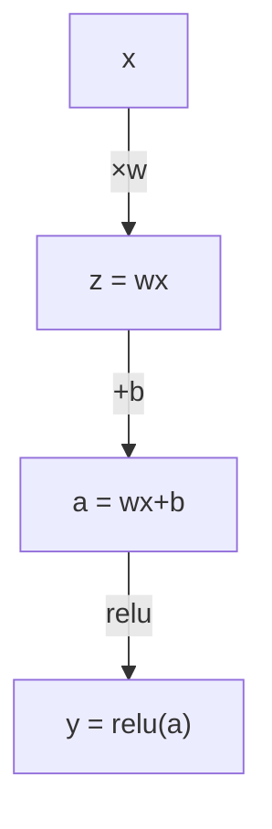

# 链式法则与自动微分——反向传播的引擎

> 链式法则是每个学习神经网络的引擎。

**类型：** 构建
**编程语言：** Python
**前置知识：** 第 01 阶段 · 04（机器学习微积分）
**预计时间：** 90 分钟
**所处阶段：** Tier 1
**关联课程：** 第 03 阶段 · 05（反向传播）— 本节的 Value 类是该阶段的基础

---

## 🎯 学习目标

完成本课后，你能够：

- [ ] 构建最小自动微分引擎（Value 类），记录操作并通过反向模式自动微分计算梯度
- [ ] 使用拓扑排序在计算图中实现前向和反向传播
- [ ] 仅用从零自动微分引擎构建并在 XOR 上训练多层感知器
- [ ] 通过与数值有限差分对比验证自动微分正确性

---

## 1. 问题

你能计算简单函数的导数。但神经网络不是简单函数——它是数百个函数的组合：矩阵乘法→加偏置→激活→矩阵乘法→softmax→交叉熵。输出是函数的函数的函数。

要训练网络，需要损失对每个权重的梯度。手写对百万参数不可能。数值有限差分太慢。

链式法则给出数学。自动微分给出算法。两者结合，你可以在单次前向传播的时间内精确计算任意函数组合的梯度。

---

## 2. 核心概念

### 2.1 链式法则

```
y = f(g(x))  →  dy/dx = f'(g(x)) × g'(x)
```

每个神经网络层是链中的一个链接。

### 2.2 计算图



前向计算值，反向传播梯度。

### 2.3 反向模式 vs 前向模式

| 模式 | 种子 | 方向 | 适用场景 |
|:-----|:-----|:-----|:---------|
| 前向 | dx/dx=1 | 输入→输出 | 少输入多输出 |
| 反向 | dy/dy=1 | 输出→输入 | 多输入少输出（神经网络） |

神经网络有百万输入（权重）和一个输出（损失），所以使用反向模式。

---

## 3. 从零实现

```python
"""从零实现自动微分——Value 类 + 反向传播。"""
import math, random

class Value:
    def __init__(self, data, children=(), op=''):
        self.data = data; self.grad = 0.0
        self._backward = lambda: None
        self._prev = set(children); self._op = op
    def __repr__(self): return f"V({self.data:.4f})"
    def __add__(self, other):
        other = other if isinstance(other, Value) else Value(other)
        out = Value(self.data + other.data, (self, other), '+')
        def _backward(): self.grad += out.grad; other.grad += out.grad
        out._backward = _backward; return out
    def __mul__(self, other):
        other = other if isinstance(other, Value) else Value(other)
        out = Value(self.data * other.data, (self, other), '*')
        def _backward(): self.grad += other.data * out.grad; other.grad += self.data * out.grad
        out._backward = _backward; return out
    def __neg__(self): return self * -1
    def __sub__(self, other): return self + (-other)
    def __pow__(self, n):
        out = Value(self.data**n, (self,), f'^{n}')
        def _backward(): self.grad += n * self.data**(n-1) * out.grad
        out._backward = _backward; return out
    def __truediv__(self, other): return self * (other**-1) if isinstance(other, Value) else self * (Value(other)**-1)
    def __radd__(self, other): return self + other
    def __rmul__(self, other): return self * other
    def relu(self):
        out = Value(max(0, self.data), (self,), 'relu')
        def _backward(): self.grad += (1.0 if out.data > 0 else 0.0) * out.grad
        out._backward = _backward; return out
    def tanh(self):
        t = math.tanh(self.data)
        out = Value(t, (self,), 'tanh')
        def _backward(): self.grad += (1 - t**2) * out.grad
        out._backward = _backward; return out
    def exp(self):
        e = math.exp(self.data)
        out = Value(e, (self,), 'exp')
        def _backward(): self.grad += e * out.grad
        out._backward = _backward; return out
    def log(self):
        out = Value(math.log(self.data), (self,), 'log')
        def _backward(): self.grad += (1.0 / self.data) * out.grad
        out._backward = _backward; return out
    def backward(self):
        topo, visited = [], set()
        def build(v):
            if v not in visited:
                visited.add(v)
                for c in v._prev: build(c)
                topo.append(v)
        build(self); self.grad = 1.0
        for v in reversed(topo): v._backward()


# Mini MLP
class Neuron:
    def __init__(self, n_in):
        self.w = [Value(random.uniform(-1,1)) for _ in range(n_in)]
        self.b = Value(0.0)
    def __call__(self, x):
        return sum((wi*xi for wi,xi in zip(self.w, x)), self.b).tanh()
    def parameters(self): return self.w + [self.b]

class Layer:
    def __init__(self, n_in, n_out):
        self.neurons = [Neuron(n_in) for _ in range(n_out)]
    def __call__(self, x): return [n(x) for n in self.neurons]
    def parameters(self): return [p for n in self.neurons for p in n.parameters()]

class MLP:
    def __init__(self, sizes):
        self.layers = [Layer(sizes[i], sizes[i+1]) for i in range(len(sizes)-1)]
    def __call__(self, x):
        for layer in self.layers: x = layer(x)
        return x[0] if len(x) == 1 else x
    def parameters(self): return [p for l in self.layers for p in l.parameters()]


def main():
    random.seed(42)
    model = MLP([2, 4, 1])
    xs = [[0,0],[0,1],[1,0],[1,1]]
    ys = [-1, 1, 1, -1]

    print("训练 XOR:")
    for step in range(100):
        preds = [model(x) for x in xs]
        loss = sum((p-y)**2 for p, y in zip(preds, ys))
        for p in model.parameters(): p.grad = 0.0
        loss.backward()
        for p in model.parameters(): p.data -= 0.05 * p.grad
        if step % 20 == 0: print(f"  步{step:3d} 损失={loss.data:.4f}")

    print("\n预测:")
    for x, y in zip(xs, ys):
        print(f"  {x} → {model(x).data:.3f} (目标 {y})")
    return 0

if __name__ == "__main__":
    import sys; sys.exit(main())
```

---

## 4. 工业工具

| 工具 | 实现方式 | 适用 |
|:-----|:---------|:-----|
| PyTorch autograd | 动态图反向模式 | 生产训练 |
| JAX autograd | 函数式+JIT | 高性能研究 |
| 本课 Value 类 | 静态图反向模式 | 教学理解 |

---

## 5. 知识连线

- **第 03 阶段 · 05（反向传播）**：本节的 Value 类是反向传播的教学实现
- **第 10 阶段（LLM 从零）**：理解自动微分是构建 GPT 训练循环的基础

---

## 6. 工程最佳实践

- **梯度检查是调试新操作的黄金标准**：数值导数 vs 自动微分差异 < 1e-5
- **PyTorch 的 `requires_grad=True` 是核心开关**：不设置就不会记录操作图
- **中文场景建议**：理解自动微分是调试任何训练问题的基础——NaN 损失、梯度爆炸的根源

---

## 7. 常见错误

### 错误 1：忘记重置梯度

**现象：** 每步梯度累积，训练崩溃。

**原因：** PyTorch 梯度通过加法累积而非覆盖。

**修复：** 每步 `optimizer.zero_grad()` 或 `model.zero_grad()`。

### 错误 2：在不需要梯度的计算中忘记 `torch.no_grad()`

**现象：** 内存占用持续增长。

**原因：** 每个操作都构建计算图。

**修复：** 评估时用 `with torch.no_grad():`。

---

## 8. 面试考点

### Q1：为什么反向模式自动微分适合神经网络？（难度：⭐⭐）

**参考答案：** 神经网络有百万输入（权重）和一个输出（损失）。反向模式只需一次反向传播即可计算所有输入的梯度，而前向模式需要为每个输入单独传播。反向模式的计算量与前向传播成正比——高效。

---

## 🔑 关键术语

| 术语 | 含义 |
|:-----|:-----|
| 链式法则 | 复合函数的导数=各层局部导数之积 |
| 计算图 | 前向传值、反向传梯度的有向无环图 |
| 反向模式 | 从输出到输入传播梯度——反向传播的基础 |
| 自动微分 | 记录操作并精确计算梯度的系统 |
| 梯度检查 | 数值导数 vs 自动微分验证正确性 |

---

## 📚 小结

自动微分是现代深度学习框架的核心。你实现了完整的 Value 类，构建了在 XOR 上训练的 MLP。这就是 PyTorch、TensorFlow、JAX 的微缩版本。

---

## ✏️ 练习

1. 【实现】添加 `__pow__` 操作，验证 x³ 在 x=2 的导数是 12
2. 【实现】用梯度检查验证 tanh 的导数正确性
3. 【实验】构建 3 层 MLP 并在非线性函数上训练

---

## 🚀 产出

| 产出 | 文件 | 说明 |
|:-----|:-----|:-----|
| 自动微分引擎 | `code/autodiff.py` | Value 类+反向传播+MLP |

---

## 📖 参考资料

1. [视频] 3Blue1Brown 反向传播. https://www.youtube.com/watch?v=tIeHLnjs5U8
2. [论文] Baydin et al. "Automatic Differentiation in ML: A Survey". https://arxiv.org/abs/1502.05767
