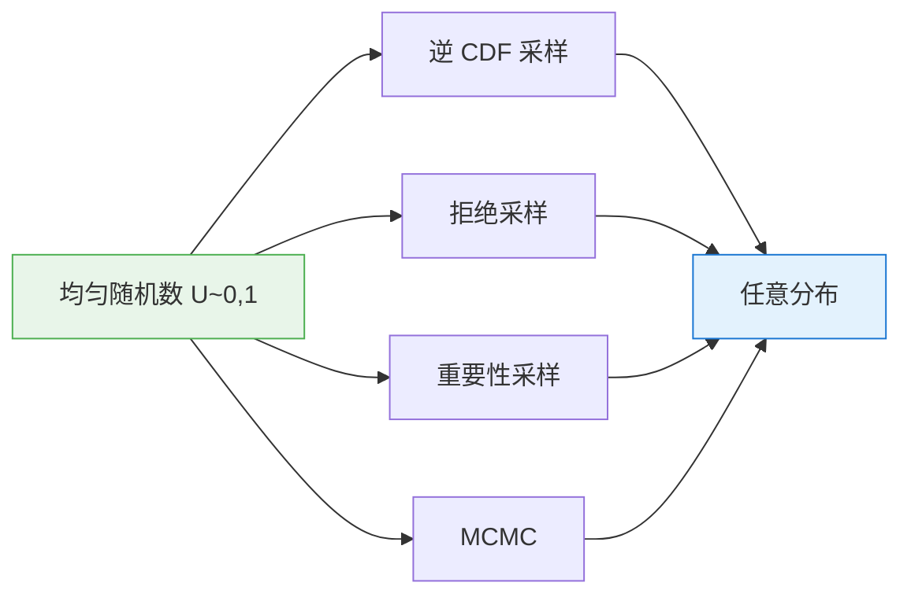

# 采样方法

> 生成式 AI 的每一次输出，都是一次精心设计的随机选择。

**类型：** 实现课
**语言：** Python
**前置知识：** 阶段 01 · 06-07（概率、贝叶斯定理）
**预计时间：** ~120 分钟
**所处阶段：** Tier 1
**关联课程：** 阶段 03 · 04（反向传播）— 重参数化技巧让梯度流过随机节点；阶段 10（大语言模型从零）— 温度、Top-k、Top-p 直接用于词元生成

## 🎯 学习目标

完成本课后，你能够：

- [ ] 从零实现逆 CDF、拒绝采样、重要性采样，仅使用均匀随机数
- [ ] 构建温度采样、Top-k 采样和 Top-p（核）采样，用于大语言模型的词元生成
- [ ] 解释重参数化技巧的原理，说明它为何能让 VAE 通过反向传播训练
- [ ] 运行 Metropolis-Hastings MCMC 从非标准化目标分布中采样
- [ ] 实现 Gumbel-Softmax 实现可微的分类采样

## 1. 问题

你的大语言模型处理完提示词后，输出一个包含 50,000 个 logit 的向量 —— 词表中每个词元一个。现在它必须从中选择一个。怎么选？

如果永远选概率最高的词元输出，每次回答都一模一样 —— 确定性、无趣、缺乏创造力。如果完全随机均匀采样，输出则是乱码。真正有用的生成，处在这两个极端之间的某个位置，而控制这个位置的，就是采样。

采样不止出现在文本生成中。强化学习通过采样轨迹来估计策略梯度；VAE 通过从学习到的分布中采样来获得隐表示，并把梯度传回采样操作；扩散模型通过采样噪声并逐步去噪来生成图像；Monte Carlo 方法估算那些没有解析解的积分；MCMC 算法探索高维后验分布 —— 这个空间根本无法穷举。

每一个生成式 AI 系统，本质上都是一个采样系统。采样策略直接决定了输出的质量、多样性和可控性。本课将从均匀随机数出发，从零构建所有主流采样方法，最终抵达驱动现代大语言模型和生成模型的核心技术。

## 2. 概念

### 2.1 为什么采样如此重要

采样在 AI 和机器学习中扮演四个核心角色。

**生成（Generation）。** 大语言模型、扩散模型、GAN 都通过采样产生输出。采样算法直接控制创造力、连贯性和多样性。温度、Top-k、核采样是工程师日常调节的旋钮。

**训练（Training）。** 随机梯度下降采样小批次；Dropout 采样要失活的神经元；数据增强采样随机变换；重要性采样在强化学习中重新加权样本以降低梯度方差（PPO、TRPO）。

**估计（Estimation）。** ML 中许多量没有封闭形式解 —— 数据分布上的期望损失、能量模型的配分函数、贝叶斯推断中的证据。Monte Carlo 估计通过样本均值来近似所有这些量。

**探索（Exploration）。** MCMC 算法在贝叶斯推断中探索后验分布；进化策略采样参数扰动；汤姆森采样（Thompson Sampling）在多臂老虎机中平衡探索与利用。

核心挑战：你只能从简单分布（均匀分布、正态分布）中直接采样。对于其他一切分布，你需要一种方法将简单样本转化为目标分布的样本。



### 2.2 均匀随机采样

所有采样方法都始于此。均匀随机数生成器在 [0, 1) 区间产生值，每个等长子区间具有相同概率。

```
U ~ Uniform(0, 1)

P(a <= U <= b) = b - a    (0 <= a <= b <= 1)

性质：
  E[U] = 0.5
  Var(U) = 1/12
```

要从 n 个元素的离散集合中均匀采样，生成 U 后返回 floor(n*U)。要从连续区间 [a, b] 采样，计算 a + (b-a)*U。

关键洞察：一个均匀随机数恰好包含产生任意分布一个样本所需的随机量。技巧在于找到正确的变换。

### 2.3 逆 CDF 方法（逆变换采样）

累积分布函数（CDF）将值映射为概率：

```
F(x) = P(X <= x)

性质：
  F 单调不减
  F(-inf) = 0
  F(+inf) = 1
  将实数轴映射到 [0, 1]
```

逆 CDF 将概率映射回值。如果 U ~ Uniform(0, 1)，则 X = F^{-1}(U) 服从目标分布。

```
算法：
  1. 生成 u ~ Uniform(0, 1)
  2. 返回 F^{-1}(u)

正确性证明：
  P(X <= x) = P(F^{-1}(U) <= x) = P(U <= F(x)) = F(x)
```

**指数分布示例：**

```
PDF: f(x) = lambda * exp(-lambda * x),   x >= 0
CDF: F(x) = 1 - exp(-lambda * x)

从 F(x) = u 解出 x：
  u = 1 - exp(-lambda * x)
  exp(-lambda * x) = 1 - u
  x = -ln(1 - u) / lambda

由于 (1-U) 与 U 同分布：
  x = -ln(u) / lambda
```

当你能写出 F^{-1} 的封闭形式时，这个方法效果很好。对于正态分布，没有封闭形式的逆 CDF，所以使用其他方法（Box-Muller，或数值近似）。

### 2.4 拒绝采样

当你无法求逆 CDF 但可以计算目标 PDF（即使未归一化）时，拒绝采样派上用场。

```
目标分布：p(x)（可计算，可能未归一化）
提议分布：q(x)（可从中采样）
上界：M，满足对所有 x 有 p(x) <= M * q(x)

算法：
  1. 从 q(x) 采样 x
  2. 从 Uniform(0, 1) 采样 u
  3. 如果 u < p(x) / (M * q(x))，接受 x
  4. 否则拒绝，回到步骤 1

接受率 = 1/M
```

上界 M 越紧，接受率越高。在低维（1-3 维）中拒绝采样效果良好。在高维空间中，接受率呈指数下降 —— 因为提议分布的大部分体积被拒绝。这就是拒绝采样的维度灾难。

### 2.5 重要性采样

有时你不需要从目标分布 p(x) 中采样，你需要的是估计在 p(x) 下的期望，而你拥有来自另一个分布 q(x) 的样本。

```
目标：估计 E_p[f(x)] = ∫ f(x) * p(x) dx

改写：
  E_p[f(x)] = ∫ f(x) * (p(x)/q(x)) * q(x) dx
            = E_q[f(x) * w(x)]

其中 w(x) = p(x) / q(x) 称为重要性权重。

估计器：
  E_p[f(x)] ≈ (1/N) * Σ f(x_i) * w(x_i)    其中 x_i ~ q(x)
```

这在强化学习中至关重要。在 PPO 中，你在旧策略 π_old 下收集轨迹，但想优化新策略 π_new。重要性权重为 π_new(a|s) / π_old(a|s)。PPO 裁剪这些权重以防止新策略偏离旧策略太远。

重要性采样估计器的方差取决于 q 与 p 的相似程度。如果 q 与 p 差异很大，少数样本获得巨大权重并主导估计。自归一化重要性采样通过除以权重之和来缓解此问题：

```
E_p[f(x)] ≈ Σ(w_i * f(x_i)) / Σ(w_i)
```

### 2.6 Monte Carlo 估计

Monte Carlo 估计通过随机样本的均值来近似积分。大数定律保证收敛。

```
目标：估计 I = ∫_D g(x) dx

方法：
  1. 从 D 中均匀采样 x_1, ..., x_N
  2. I ≈ (D 的体积 / N) * Σ g(x_i)

误差：O(1/√N)，与维度无关
```

误差率与维度无关。这就是 Monte Carlo 方法在高维空间中占主导地位的原因，而在高维中基于网格的积分是不可能的。

**估计 pi：**

```
在 [-1, 1] x [-1, 1] 中均匀采样 (x, y)
统计落入单位圆的数量：x^2 + y^2 <= 1
pi ≈ 4 * (落入数量) / (总数量)
```

### 2.7 马尔可夫链蒙特卡洛（MCMC）：Metropolis-Hastings

MCMC 构造一个马尔可夫链，使其平稳分布恰好是目标分布 p(x)。经过足够多的步骤后，链上的样本（近似地）服从 p(x)。

```
目标：p(x)（已知到归一化常数）
提议：q(x'|x)（给定当前状态如何提议下一状态）

Metropolis-Hastings 算法：
  1. 从某个 x_0 开始
  2. 对 t = 1, 2, ..., T：
     a. 提议 x' ~ q(x'|x_t)
     b. 计算接受率：
        alpha = [p(x') * q(x_t|x')] / [p(x_t) * q(x'|x_t)]
     c. 以概率 min(1, alpha) 接受：
        - 如果 u < alpha：x_{t+1} = x'
        - 否则：x_{t+1} = x_t
  3. 丢弃前 B 个样本（预烧期）
  4. 返回剩余样本
```

对于对称提议（q(x'|x) = q(x|x')），接受率简化为 p(x')/p(x)。这就是原始 Metropolis 算法。

**实用考量：**
- **预烧期（Burn-in）：** 丢弃链达到平衡前的早期样本
- **稀释（Thinning）：** 保留每第 k 个样本以降低自相关
- **提议尺度：** 太小则链移动缓慢（高接受率但探索慢）；太大则大多数提议被拒绝（低接受率，原地不动）
- 高维高斯提议的最优接受率约为 0.234

### 2.8 Gibbs 采样

Gibbs 采样是 MCMC 在多变量分布上的特例。它不在所有维度上同时提议移动，而是每次从条件分布中更新一个变量。

```
目标：p(x_1, x_2, ..., x_d)

算法：
  每次迭代 t：
    采样 x_1^{t+1} ~ p(x_1 | x_2^t, x_3^t, ..., x_d^t)
    采样 x_2^{t+1} ~ p(x_2 | x_1^{t+1}, x_3^t, ..., x_d^t)
    ...
    采样 x_d^{t+1} ~ p(x_d | x_1^{t+1}, x_2^{t+1}, ..., x_{d-1}^{t+1})
```

Gibbs 采样要求你能从每个条件分布 p(x_i | x_{-i}) 中采样。接受率始终为 1（每个提议都被接受），因为从精确条件分布采样自动满足细致平衡条件。

**局限性：** 当变量高度相关时，Gibbs 采样混合缓慢，因为一次更新一个变量无法在分布中做大范围的斜向移动。

### 2.9 温度采样（用于大语言模型）

大语言模型为词表中每个词元输出 logit z_1, ..., z_V。Softmax 将其转换为概率。温度在 softmax 之前对 logit 进行缩放：

```
p_i = exp(z_i / T) / Σ exp(z_j / T)

T = 1.0：标准 softmax（原始分布）
T -> 0：  argmax（确定性，始终选择最高 logit）
T -> inf：均匀（所有词元等概率）
T < 1.0：锐化分布（更自信，更少样性）
T > 1.0：平坦化分布（更少自信，更多样性）
```

**原理。** 除以 T < 1 会放大 logit 之间的差异。如果 z_1 = 2 且 z_2 = 1，除以 T = 0.5 得到 z_1/T = 4 和 z_2/T = 2，差值变大。Softmax 之后，最高 logit 的词元获得更大的概率份额。

**实践参考：**
- T = 0.0：贪心解码，适合事实性问答
- T = 0.3-0.7：轻度创意，适合代码生成
- T = 0.7-1.0：平衡，适合通用对话
- T = 1.0-1.5：创意写作、头脑风暴
- T > 1.5：越来越随机，很少有用

### 2.10 Top-k 采样

Top-k 采样将候选集限制为概率最高的 k 个词元，然后重新归一化并采样。

```
算法：
  1. 计算所有 V 个词元的 softmax 概率
  2. 按概率降序排列
  3. 仅保留前 k 个词元
  4. 重新归一化：p_i' = p_i / Σ_{j∈top-k} p_j
  5. 从归一化分布中采样

k = 1：贪心解码
k = V：无过滤（标准采样）
k = 40：典型设置，移除长尾低概率词元
```

Top-k 阻止模型选择词元分布长尾中极不可能的词元（错别字、无意义输出）。问题在于：k 是固定的，不随上下文变化。当模型很自信（一个词元占 95% 概率）时，k=40 仍允许 39 个替代；当模型不确定（概率分布在 1000 个词元上）时，k=40 会截断合理的选项。

### 2.11 Top-p（核）采样

Top-p 采样动态调整候选集大小。它不固定词元数量，而是保留累计概率超过 p 的最小词元集合。

```
算法：
  1. 计算所有 V 个词元的 softmax 概率
  2. 按概率降序排列
  3. 找到最小的 k，使得前 k 个概率之和 >= p
  4. 仅保留这 k 个词元
  5. 重新归一化并采样

p = 0.9：保留覆盖 90% 概率质量的词元
p = 1.0：无过滤
p = 0.1：非常限制，接近贪心
```

当模型自信时，核采样保留少量词元（可能 2-3 个）；当模型不确定时，保留很多（可能 200 个）。这种自适应行为是核采样通常产生比 Top-k 更好文本的原因。

**常见组合：**
- 温度 0.7 + Top-p 0.9：通用场景推荐
- 温度 0.0（贪心）：适合确定性任务
- 温度 1.0 + Top-k 50：Fan et al. (2018) 原论文设置

### 2.12 重参数化技巧（用于 VAE）

变分自编码器（VAE）通过在隐空间编码输入为分布、从该分布采样、再将样本解码回来学习表示。问题是：你无法通过采样操作反向传播。

```
标准采样（不可微）：
  z ~ N(mu, sigma^2)

  随机性阻挡梯度流。
  d/d_mu [从 N(mu, sigma^2) 采样] = ???
```

重参数化技巧将随机性与参数分离：

```
重参数化采样：
  epsilon ~ N(0, 1)          （固定随机噪声，无参数）
  z = mu + sigma * epsilon   （参数的确定性函数）

  现在 z 是 mu 和 sigma 的确定性可微函数。
  d(z)/d(mu) = 1
  d(z)/d(sigma) = epsilon

  梯度流过 mu 和 sigma。
```

**VAE 训练循环：**
1. 编码器为每个输入输出 mu 和 log(sigma^2)
2. 采样 epsilon ~ N(0, 1)
3. 计算 z = mu + sigma * epsilon
4. 解码 z 重建输入
5. 通过步骤 4、3、2、1 反向传播（因为步骤 3 可微）

没有重参数化技巧，VAE 无法用标准反向传播训练。这一个洞见使 VAE 变得实用。

### 2.13 Gumbel-Softmax（可微分类采样）

重参数化技巧适用于连续分布（高斯）。对于离散分类分布，我们需要不同方法。Gumbel-Softmax 提供了可微分的分类采样近似。

**Gumbel-Max 技巧（不可微）：**

```
从对数概率为 log(p_1), ..., log(p_k) 的分类分布中采样：
  1. 对每个类别采样 g_i ~ Gumbel(0, 1)
     （g = -log(-log(u))，其中 u ~ Uniform(0, 1)）
  2. 返回 argmax(log(p_i) + g_i)

这产生精确的分类样本。
```

**Gumbel-Softmax（可微近似）：**

```
将硬 argmax 替换为软 softmax：
  y_i = exp((log(p_i) + g_i) / tau) / Σ exp((log(p_j) + g_j) / tau)

tau（温度）控制近似程度：
  tau -> 0：  逼近 one-hot 向量（硬分类）
  tau -> inf：逼近均匀分布 (1/k, ..., 1/k)
  tau = 1.0： 软近似
```

Gumbel-Softmax 产生离散样本的连续松弛。输出是概率向量（软 one-hot）而不是硬 one-hot。梯度流过 softmax。训练中的前向传播可使用"直通估计器"：前向用硬 argmax，反向用软 Gumbel-Softmax 梯度。

### 2.14 分层采样

标准 Monte Carlo 采样可能因偶然因素在样本空间中留下空隙。分层采样通过将空间分层、从每层中各取一个点来强制均匀覆盖。

```
标准 Monte Carlo：
  从 [0, 1] 均匀采样 N 个点
  某些区域可能聚集，其他区域可能稀疏

分层采样：
  将 [0, 1] 均分为 N 层：[0, 1/N), [1/N, 2/N), ..., [(N-1)/N, 1)
  在每层内均匀采样一个点
  x_i = (i + u_i) / N，其中 u_i ~ Uniform(0, 1)，i = 0, ..., N-1
```

分层采样的方差始终小于等于标准 Monte Carlo：

```
Var(分层) <= Var(标准 Monte Carlo)

改进在 f(x) 平滑变化时最大。
对于分段常数函数，分层采样是精确的。
```

**应用场景：**
- 数值积分（准 Monte Carlo）
- 训练数据划分（确保每折类别平衡）
- NeRF（神经辐射场）沿相机光线使用分层采样

## 3. 从零实现

### 第 1 步：均匀采样与逆 CDF

```python
import math
import random

def sample_uniform(a, b):
    """从均匀分布 Uniform(a, b) 采样。"""
    return a + (b - a) * random.random()

def sample_exponential_inverse_cdf(lam):
    """使用逆 CDF 方法从指数分布中采样。

    逆函数为 F^{-1}(u) = -ln(1-u) / lambda。
    利用 1-U 与 U 同分布，简化为 -ln(u) / lambda。
    """
    u = random.random()
    return -math.log(u) / lam
```

生成 10,000 个指数分布样本，验证均值趋近 1/lambda。

### 第 2 步：拒绝采样

```python
def normal_pdf(x, mu, sigma):
    """正态分布的概率密度函数。"""
    coeff = 1.0 / (sigma * math.sqrt(2 * math.pi))
    exponent = -0.5 * ((x - mu) / sigma) ** 2
    return coeff * math.exp(exponent)

def rejection_sample(target_pdf, proposal_sample, proposal_pdf, M):
    """拒绝采样：从目标分布 p(x) 中采样。

    需要提议分布 q(x) 和上界 M 满足 p(x) <= M * q(x)。
    接受率 = 1/M。
    """
    while True:
        x = proposal_sample()
        u = random.random()
        if u < target_pdf(x) / (M * proposal_pdf(x)):
            return x
```

使用拒绝采样从截断正态分布中采样。通过直方图验证形状。

### 第 3 步：重要性采样

```python
def importance_sampling_estimate(f, target_pdf, proposal_pdf, proposal_sample, n):
    """使用重要性采样估计 E_p[f(x)]。"""
    weighted_sum = 0.0
    weight_sum = 0.0
    for _ in range(n):
        x = proposal_sample()
        w = target_pdf(x) / proposal_pdf(x)
        weighted_sum += f(x) * w
        weight_sum += w
    unnormalized = weighted_sum / n
    self_normalized = weighted_sum / weight_sum
    return unnormalized, self_normalized
```

估计正态分布下 E[X^2]，使用均匀提议分布。与已知答案（mu^2 + sigma^2）比较。

### 第 4 步：Monte Carlo 估计

```python
def monte_carlo_pi(n):
    """使用 Monte Carlo 方法估计 pi。"""
    inside = 0
    for _ in range(n):
        x = random.uniform(-1, 1)
        y = random.uniform(-1, 1)
        if x * x + y * y <= 1:
            inside += 1
    return 4 * inside / n
```

### 第 5 步：Metropolis-Hastings MCMC

```python
def metropolis_hastings(target_log_pdf, x0, n_samples, burn_in, proposal_std=1.0):
    """Metropolis-Hastings 算法。

    构造马尔可夫链使其平稳分布为目标分布 p(x)。
    使用对数概率避免数值下溢。
    """
    samples = []
    x = x0
    accepted = 0
    total = n_samples + burn_in

    for i in range(total):
        x_new = x + random.gauss(0, proposal_std)
        log_alpha = target_log_pdf(x_new) - target_log_pdf(x)

        if math.log(random.random() + 1e-300) < log_alpha:
            x = x_new
            if i >= burn_in:
                accepted += 1

        if i >= burn_in:
            samples.append(x)

    acceptance_rate = accepted / n_samples
    return samples, acceptance_rate
```

从双模态分布（两个高斯的混合）中采样。可视化链的轨迹。

### 第 6 步：Gibbs 采样

```python
def gibbs_sampling_2d(rho, n_samples, burn_in):
    """对二维高斯分布进行 Gibbs 采样。

    给定相关系数 rho，交替从条件分布中采样。
    接受率 = 100%。
    """
    x, y = 0.0, 0.0
    samples = []

    for i in range(n_samples + burn_in):
        x = random.gauss(rho * y, math.sqrt(1 - rho ** 2))
        y = random.gauss(rho * x, math.sqrt(1 - rho ** 2))
        if i >= burn_in:
            samples.append((x, y))

    return samples
```

### 第 7 步：温度采样

```python
def softmax(logits):
    """数值稳定的 softmax 实现。"""
    max_l = max(logits)
    exps = [math.exp(z - max_l) for z in logits]
    total = sum(exps)
    return [e / total for e in exps]

def temperature_sample(logits, temperature):
    """带温度的采样：将 logits 除以 T 后再 softmax。"""
    if temperature <= 0:
        return logits.index(max(logits))
    scaled = [z / temperature for z in logits]
    probs = softmax(scaled)
    return sample_from_probs(probs)
```

展示温度如何改变词元 logit 的输出分布。

### 第 8 步：Top-k 和 Top-p 采样

```python
def top_k_sample(logits, k):
    """Top-k 采样：仅保留概率最高的 k 个词元。"""
    indexed = sorted(enumerate(logits), key=lambda x: -x[1])
    top = indexed[:k]
    top_logits = [l for _, l in top]
    probs = softmax(top_logits)
    idx = sample_from_probs(probs)
    return top[idx][0]

def top_p_sample(logits, p):
    """Top-p（核）采样：保留累计概率超过 p 的最小集合。"""
    probs = softmax(logits)
    indexed = sorted(enumerate(probs), key=lambda x: -x[1])
    cumsum = 0.0
    selected = []
    for token_idx, prob in indexed:
        cumsum += prob
        selected.append((token_idx, prob))
        if cumsum >= p:
            break
    sel_probs = [pr for _, pr in selected]
    total = sum(sel_probs)
    sel_probs = [pr / total for pr in sel_probs]
    idx = sample_from_probs(sel_probs)
    return selected[idx][0]
```

### 第 9 步：重参数化技巧

```python
def reparam_sample(mu, sigma):
    """重参数化：将采样拆分为随机部分和确定性部分。

    z = mu + sigma * epsilon
    关于 mu 和 sigma 可微。
    """
    epsilon = random.gauss(0, 1)
    z = mu + sigma * epsilon
    return z, epsilon

def reparam_gradient(epsilon):
    """计算重参数化样本对 mu 和 sigma 的梯度。"""
    dz_dmu = 1.0
    dz_dsigma = epsilon
    return dz_dmu, dz_dsigma
```

演示梯度如何流过重参数化样本，但不能流过直接采样。

### 第 10 步：Gumbel-Softmax

```python
def gumbel_sample():
    """从标准 Gumbel 分布中采样。"""
    u = random.random()
    return -math.log(-math.log(u))

def gumbel_softmax_sample(log_probs, temperature):
    """Gumbel-Softmax：可微的分类采样近似。"""
    gumbels = [lp + gumbel_sample() for lp in log_probs]
    scaled = [g / temperature for g in gumbels]
    return softmax(scaled)
```

展示逐渐降低温度如何使输出逼近 one-hot 向量。完整实现包含所有可视化，见 `code/main.py`。

## 4. 工业工具

### 4.1 NumPy 和 SciPy

```python
import numpy as np
from scipy import stats

rng = np.random.default_rng(42)

# 指数分布采样
exponential_samples = rng.exponential(scale=2.0, size=10000)
print(f"指数分布均值: {exponential_samples.mean():.4f} (期望 2.0)")

# CDF 和逆 CDF
normal = stats.norm(loc=0, scale=1)
print(f"CDF at 1.96: {normal.cdf(1.96):.4f}")
print(f"逆 CDF at 0.975: {normal.ppf(0.975):.4f}")

# 温度采样
logits = np.array([2.0, 1.0, 0.5, 0.1, -1.0])
temperature = 0.7
scaled = logits / temperature
probs = np.exp(scaled - scaled.max()) / np.exp(scaled - scaled.max()).sum()
token = rng.choice(len(logits), p=probs)
print(f"采样到的词元索引: {token}")
```

### 4.2 PyTorch 中的采样

```python
import torch
import torch.nn.functional as F

# 温度采样
logits = torch.tensor([3.0, 2.0, 1.5, 0.5, -1.0, -2.0])
probs = F.softmax(logits / 0.7, dim=-1)
token = torch.multinomial(probs, num_samples=1)
print(f"采样结果: {token.item()}")

# Top-p 采样
def top_p_sampling_logits(logits, p=0.9):
    """工业级 Top-p 采样实现。"""
    sorted_logits, sorted_indices = torch.sort(logits, descending=True)
    cumulative_probs = torch.cumsum(F.softmax(sorted_logits, dim=-1), dim=-1)
    # 移除累计概率超过 p 的词元
    sorted_mask = cumulative_probs - F.softmax(sorted_logits, dim=-1) > p
    sorted_logits[sorted_mask] = float('-inf')
    # 恢复原始顺序
    logits.scatter_(0, sorted_indices, sorted_logits)
    return logits
```

### 4.3 大规模 MCMC 专用库

| 库 | 用途 | 特点 |
|---|---|---|
| PyMC | 全贝叶斯建模 | 内置 NUTS（自适应 HMC） |
| emcee | 集成 MCMC 采样器 | 适合贝叶斯推断 |
| NumPyro / JAX | GPU 加速 MCMC | 适合大规模模型 |

你已从零构建了这些方法。现在你知道库调用背后发生了什么。

## 5. 知识连线

本课学习的 Monte Carlo 方法和拒绝采样是后续所有概率建模的基础：

- **阶段 03 · 04（反向传播）**：重参数化技巧让 VAE 的梯度流过随机节点，这是理解生成模型训练的关键前置知识
- **阶段 08（生成式 AI）**：你会看到 VAE、GAN、扩散模型如何依赖本课的采样策略 —— 扩散模型的每一步去噪都是一次条件采样
- **阶段 10（大语言模型从零）**：温度、Top-k、Top-p 直接用于自回归词元生成，这是 LLM 推理的核心技术

## 6. 工程最佳实践

### 6.1 推荐方案

| 场景 | 推荐方案 | 备注 |
|---|---|---|
| 学习/实验 | 本课的纯 Python 实现 | 理解原理 |
| 生产环境采样 | NumPy/SciPy 的随机数生成器 | 性能优秀 |
| LLM 推理 | vLLM / TensorRT-LLM 内置采样器 | 高度优化 |
| VAE 训练 | PyTorch `torch.distributions` | 支持重参数化 |
| 贝叶斯推断 | PyMC / NumPyro | 专业 MCMC 库 |

### 6.2 中文场景特别建议

- 中文文本生成任务中，温度设为 0.7-0.9 通常效果较好 —— 中文词元粒度多样（字、子词、词），过高温度容易破坏语法结构
- 使用 Top-p 时，中文建议 p=0.85-0.95 —— 相比英文，中文词元分布更平坦，p 太小会丢失合理选项
- 基于中文语料训练的模型，建议先用小批次测试不同 (温度, Top-p) 组合，观察输出的多样性和连贯性

### 6.3 踩坑经验

- MCMC 的预烧期（burn-in）不足：只跑了 500 步就收集样本，结果偏离目标分布。至少 2000 步起步，且应通过轨迹图和自相关函数诊断收敛
- 拒绝采样的 M 值设得太大：导致接受率极低（<1%），程序长时间空跑。应通过寻找目标分布的精确最大值来收紧 M
- 温度采样忘记做数值稳定处理：logits 过大时 exp 溢出。始终先减去最大值再做 softmax
- Gumbel-Softmax 温度退火过快：直接将 tau 从 1.0 降到 0.01 导致训练不稳定。应采用线性退火或指数退火，从 1.0 缓慢降到 0.1-0.3

## 7. 常见错误

### 错误 1：MCMC 预烧期不足

**现象：** 采样结果出现明显的偏移或只分布在目标分布的某个模态（mode）上。

**原因：** 链尚未收敛到平稳分布就开始收集样本。早期样本不能代表目标分布。

**修复：**
```python
# ❌ 错误：没有 burn-in
samples, _ = metropolis_hastings(target_log_pdf, x0, n_samples=5000, burn_in=0)

# ✓ 正确：至少 2000 步 burn-in
samples, _ = metropolis_hastings(target_log_pdf, x0, n_samples=5000, burn_in=2000)
```

### 错误 2：拒绝采样的上界 M 选择不当

**现象：** 程序运行极长时间仍无法获得足够样本。

**原因：** M 值太大导致接受率 1/M 极低。在高维空间中尤其严重。

**修复：**
```python
# ❌ 错误：用全局最大值作为 M（可能远大于实际需要的值）
M = max(target_pdf(x) / proposal_pdf(x) for x in grid_points) * 2

# ✓ 正确：取 tighter 的 bound，适当牺牲理论保证换取效率
M = max(target_pdf(x) / proposal_pdf(x) for x in grid_points) * 1.05
```

### 错误 3：温度采样的数值溢出

**现象：** softmax 计算结果出现 `nan`。

**原因：** logit 值范围很大时，exp 计算溢出。

**修复：**
```python
# ❌ 错误：直接计算
probs = [math.exp(z / T) for z in logits]  # 可能溢出

# ✓ 正确：先减去最大值
max_logit = max(logits)
probs = [math.exp((z - max_logit) / T) for z in logits]
```

### 错误 4：混淆 Top-k 和 Top-p 的工作方式

**现象：** 在模型不确定时仍然使用 Top-k=40，切断了大量合理选项。

**原因：** Top-k 固定候选集大小，不考虑实际的分布形状。

**修复：**
```python
# ❌ 在不确定场景使用固定 k
idx = top_k_sample(logits, k=40)  # 可能截断合理选项

# ✓ 使用自适应的 Top-p
idx = top_p_sample(logits, p=0.9)  # 根据分布自动调整
```

### 错误 5：忘记重参数化技巧的梯度阻断

**现象：** VAE 训练时编码器参数不更新，或梯度为 NaN。

**原因：** 直接调用采样函数导致梯度无法流过随机节点。

**修复：**
```python
# ❌ 错误：直接采样，梯度无法传播
z = sample_normal(mu, sigma)

# ✓ 正确：使用重参数化
epsilon = random.gauss(0, 1)  # 梯度到此为止
z = mu + sigma * epsilon      # 关于 mu 和 sigma 可微
```

## 8. 面试考点

### Q1：温度 T < 1.0 对大语言模型的输出分布有什么影响？（难度：⭐⭐）

**参考答案：**

T < 1.0 在 softmax 之前将 logit 除以小于 1 的数，这放大了 logit 之间的差异。经过 softmax 后，最高概率词元获得更大的概率份额，其他词元的概率被压缩。T 趋近于 0 时退化为贪心解码（argmax）。

### Q2：Top-k 和 Top-p 采样的核心区别是什么？（难度：⭐⭐）

**参考答案：**

Top-k 始终固定保留 k 个词元，不考虑实际的概率分布。Top-p 根据分布自适应地保留累计概率超过 p 的最小词元集合。当模型自信时 Top-p 保留少量词元，不自信时保留更多。因此 Top-p 通常产生更自然的文本。

### Q3：为什么不能直接对采样操作 z ~ N(mu, sigma^2) 反向传播？（难度：⭐⭐）

**参考答案：**

采样操作引入了随机不连续性。当从分布中随机抽取一个样本时，无法计算 d(sample)/d(mu) —— 因为 sample 是随机的，不直接由 mu 决定。重参数化技巧通过改写 z = mu + sigma * epsilon（其中 epsilon ~ N(0,1) 与参数无关），使 z 成为 mu 和 sigma 的确定性可微函数，从而让梯度能够流过。

### Q4：Metropolis-Hastings MCMC 中，如果提议标准差设置过大会怎样？（难度：⭐⭐⭐）

**参考答案：**

如果提议标准差很大，提议的点会远离当前位置，大概率落在目标分布的低概率区域。这些提议会被拒绝，导致链基本停留在原地不动。接受率会变得极低，采样效率反而下降。高维高斯提议的最优接受率约为 23%。

### Q5：拒绝采样在高维空间中为何失效？（难度：⭐⭐⭐）

**参考答案：**

在高维空间中，提议分布的体积与目标分布重叠的部分呈指数级缩小。上界 M 必须增大以覆盖所有位置，导致接受率 1/M 指数下降。这是拒绝采样的维度灾难，也是为什么在高维场景中通常改用 MCMC 方法。

## 🔑 关键术语

| 术语 | 人们怎么说 | 实际含义 |
|---|---|---|
| 采样 | "随机抽取值" | 按照概率分布生成值 —— 所有生成式 AI 背后的机制 |
| 均匀分布 | "每个值等概率" | 区间 [a, b] 内每点概率密度为 1/(b-a) —— 所有采样方法的起点 |
| 逆 CDF | "概率变换" | F^{-1}(U) 将均匀样本转换为任意已知 CDF 分布的样本。精确且高效 |
| 拒绝采样 | "提议后接受/拒绝" | 从简单提议分布采样，按目标/提议比率接受。精确但浪费样本 |
| 重要性采样 | "重新加权样本" | 用 q(x) 的样本估计 p(x) 下的期望，通过 p(x)/q(x) 加权。PPO 的核心技术 |
| Monte Carlo | "样本均值近似" | 将积分近似为样本均值，误差 O(1/√N) 与维度无关 |
| MCMC | "收敛的随机游走" | 构造马尔可夫链使其平稳分布为目标分布。Metropolis-Hastings 是奠基算法 |
| Metropolis-Hastings | "接受上坡，偶尔下坡" | 提议移动，按密度比接受。细致平衡条件保证收敛到目标分布 |
| Gibbs 采样 | "一次更新一个变量" | 交替从条件分布中更新每个变量，100% 接受率 |
| 温度 | "置信度旋钮" | 在 softmax 前将 logit 除以 T。T<1 锐化分布，T>1 平坦化分布 |
| Top-k 采样 | "保留最好的 k 个" | 将概率置零除前 k 个词元，重新归一化后采样。候选集大小固定 |
| 核采样（Top-p） | "保留概率高的" | 保留累计概率超过 p 的最小词元集合。候选集大小自适应 |
| 重参数化技巧 | "把随机性移出去" | 改写 z = mu + sigma * epsilon，epsilon ~ N(0,1)。使采样可微，VAE 训练的关键 |
| Gumbel-Softmax | "软分类采样" | 使用 Gumbel 噪声 + 带温度 softmax 的可微分类采样近似 |
| 分层采样 | "强制均匀覆盖" | 将采样空间分层、从每层采样，方差始终小于等于标准 Monte Carlo |
| 预烧期（Burn-in） | "预热阶段" | MCMC 开始前丢弃的、尚未收敛到平稳分布的样本 |
| 细致平衡（Detailed Balance） | "可逆条件" | p(x) * T(x→y) = p(y) * T(y→x)。保证 p 是马尔可夫链平稳分布的充分条件 |

## 📚 小结

采样是生成式 AI 的核心机制 —— 从大语言模型的词元选择到扩散模型的图像生成，背后都是精心设计的随机性。你从零实现了逆 CDF、拒绝采样、重要性采样、MCMC 和重参数化技巧，并构建了大语言模型中的温度、Top-k、Top-p 采样方法。下一课将进入张量运算的世界，学习如何高效地表示和操作多维数据。

## ✏️ 练习

1. 【实现】实现柯西分布的逆 CDF 采样。其 CDF 为 F(x) = 0.5 + arctan(x)/π。生成 10,000 个样本并绘制直方图与真实 PDF 对比。注意观察重尾特性 —— 远离中心的极端值。

2. 【实现】使用拒绝采样从 Beta(2, 5) 分布中采样，使用 Uniform(0, 1) 作为提议分布。绘制接受样本与真实 Beta PDF 对比。理论接受率是多少？

3. 【实验】使用 Monte Carlo 估计 sin(x) 在 [0, π] 上的积分，分别使用 1,000、10,000、100,000 个样本。比较各层级的误差，验证误差是否按 O(1/√N) 缩放。

4. 【思考】扩散模型通过迭代采样生成图像。阅读 DDPM 论文的摘要，用你自己的话解释扩散模型中的采样如何与本课的重参数化技巧相联系。（提示：每一步去噪都是一次条件采样）

5. 【实验】构建一个完整的文本生成演示：给定 10 个词的词表和 logit，分别使用（a）贪心（b）温度 0.7（c）Top-k=3（d）Top-p=0.9 生成长度为 20 的序列。比较 5 次运行的输出多样性。

## 🚀 产出

本课产出以下可复用内容：

| 产出 | 文件 | 说明 |
|---|---|---|
| 采样方法完整实现 | `code/main.py` | 14 种采样方法从零实现，可运行 |
| 可复用提示词 | `outputs/prompt-sampling-tutor.md` | 采样方法学习引导提示词 |

## 📖 参考资料

1. [论文] Holbrook. "The Metropolis-Hastings Algorithm". arXiv, 2023. https://arxiv.org/abs/2304.07010
2. [论文] Jang, Gu, Poole. "Categorical Reparameterization with Gumbel-Softmax". ICLR, 2017. https://arxiv.org/abs/1611.01144
3. [论文] Holtzman et al. "The Curious Case of Neural Text Degeneration". ICLR, 2020. https://arxiv.org/abs/1904.09751
4. [论文] Kingma & Welling. "Auto-Encoding Variational Bayes". ICLR, 2014. https://arxiv.org/abs/1312.6114
5. [论文] Ho, Jain, Abbeel. "Denoising Diffusion Probabilistic Models". NeurIPS, 2020. https://arxiv.org/abs/2006.11239
6. [官方文档] PyTorch. "torch.distributions". https://pytorch.org/docs/stable/distributions.html
7. [GitHub] PyMC-Devs. "pymc". https://github.com/pymc-devs/pymc

---

> 本课程参考了 AI Engineering From Scratch（MIT License）的课程体系，在此基础上进行了重构和原创内容的扩充。所有中文表达、案例、LLM 视角分析、工程最佳实践、常见错误、面试考点等均为原创内容。
