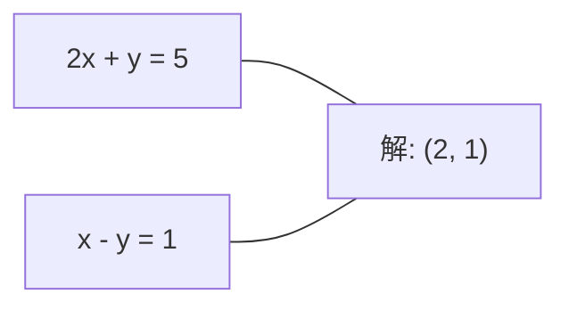
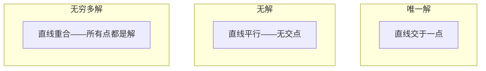

# 线性系统

> 求解 Ax = b 是数学史上最古老的问题——它至今仍在驱动你的神经网络。

**类型：** 实现课
**语言：** Python
**前置知识：** 第 01 阶段 · 01（线性代数直觉）、02（向量矩阵运算）、03（矩阵变换）
**预计时间：** ~120 分钟
**所处阶段：** Tier 1
**关联课程：** 第 02 阶段 · 01（线性回归）— 正规方程就是线性系统；第 03 阶段 · 02（反向传播）— 梯度计算中的线性系统求解

---

## 🎯 学习目标

完成本课后，你能够：

- [ ] 从零实现带部分主元的高斯消元法，理解回代求解的原理
- [ ] 实现 LU、Cholesky 分解，并根据矩阵特性选择合适的分解方法
- [ ] 推导正规方程，解释其与线性回归的等价关系
- [ ] 使用条件数诊断病态系统，并通过正则化改善数值稳定性
- [ ] 实现共轭梯度法，理解迭代方法在大规模稀疏系统中的优势

---

## 1. 问题

每次训练线性回归，你都在求解线性系统。每次计算最小二乘拟合，你都在求解线性系统。神经网络的每一层计算 `y = Wx + b`，本质上是在评估一个线性系统的一侧。加入正则化，你修改了这个系统。使用高斯过程，你在分解一个矩阵。计算马氏距离时求协方差矩阵的逆，你还是在求解线性系统。

方程 Ax = b 无处不在。A 是已知系数矩阵，b 是已知输出向量，x 是待求的未知向量。在线性回归中，A 是数据矩阵，b 是目标向量，x 是权重向量。整个模型归结为：找到 x 使得 Ax 尽可能接近 b。

但问题在于：当方程数量多于未知数时（数据点多于参数），精确解不存在。当矩阵近似奇异时，解对噪声极其敏感。当系统规模达到百万维时，直接分解在时间和内存上都不可行。

本课将从零构建求解线性系统的所有核心方法，让你理解为什么有的方法快、有的方法稳，为什么有的只适用于方阵而有的能处理超定系统，以及为什么矩阵的条件数决定了你的答案到底有没有意义。

---

## 2. 概念

### 2.1 几何直觉：Ax = b 在说什么

线性方程组有几何解释。每个方程定义一个超平面，解就是所有超平面的交点。

```
2x + y = 5          2D 空间中的两条直线
x - y  = 1          交于点 x=2, y=1
```



三种可能的情况：



矩阵语言中，"唯一解"意味着 A 可逆，"无解"意味着系统不一致，"无穷多解"意味着 A 有零空间。大多数机器学习问题属于"无精确解"类别——因为方程数（数据点）多于未知数（参数）。这正是最小二乘法的用武之地。

### 2.2 行视角 vs 列视角

Ax = b 有两种读法。

**行视角。** A 的每一行定义一个方程，每个方程是一个超平面，解是它们的交点。

**列视角。** A 的每一列是一个向量。问题变为：A 的列的哪个线性组合能产生 b？

```
A = | 2  1 |    b = | 5 |
    | 1 -1 |        | 1 |

行视角：联立求解 2x + y = 5 和 x - y = 1

列视角：找 x1, x2 使得
  x1 * [2, 1] + x2 * [1, -1] = [5, 1]
  2 * [2, 1] + 1 * [1, -1] = [4+1, 2-1] = [5, 1]  ✓
```

列视角更本质：如果 b 在 A 的列空间中，系统有解；如果不在，就找列空间中离 b 最近的点——那就是最小二乘解。

### 2.3 高斯消元

高斯消元将 Ax = b 转化为上三角系统 Ux = c，然后通过回代求解。这是最直接的方法。

```
算法步骤：
1. 对每一列 k（主元列）：
   a. 在第 k 列中寻找绝对值最大的元素（部分主元）
   b. 交换该行到第 k 行
   c. 对第 k 行下方的每一行 i：
      - 计算乘数 m = A[i][k] / A[k][k]
      - 从第 i 行减去 m 倍的第 k 行
2. 回代：从最后一个方程向上求解
```

示例：

```
原始方程组:
| 2  1  1 |  8 |       R2 = R2 - 2*R1     | 2  1   1 |  8 |
| 4  3  3 | 20 |  -->  R3 = R3 - R1  -->   | 0  1   1 |  4 |
| 2  3  1 | 12 |                            | 0  2   0 |  4 |

                       R3 = R3 - 2*R2     | 2  1   1 |  8 |
                                       --> | 0  1   1 |  4 |
                                           | 0  0  -2 | -4 |

回代:
  -2 * x3 = -4    -->  x3 = 2
  x2 + 2  = 4     -->  x2 = 2
  2*x1 + 2 + 2 = 8 --> x1 = 2
```

高斯消元的计算复杂度为 O(n^3)。对于 1000x1000 的系统，大约需要 10 亿次浮点运算。

### 2.4 部分主元：为什么必须做

不做主元选择时，高斯消元可能失败或产生垃圾结果。主元为零会导致除零错误；主元很小则会放大舍入误差。

```
无主元（危险）:                  有部分主元（稳定）:
| 0.001  1 | 1.001 |            先交换两行:
| 1      1 | 2     |            | 1      1 | 2     |
                                 | 0.001  1 | 1.001 |
m = 1/0.001 = 1000              m = 0.001/1 = 0.001
R2 = R2 - 1000*R1               R2 = R2 - 0.001*R1
| 0.001  1     | 1.001   |      | 1      1     | 2     |
| 0     -999   | -999.0  |      | 0      0.999 | 0.999 |

x2 = 1.000                       x2 = 1.000
x1 = 0.001/0.001 = 1.000        x1 = (2 - 1)/1 = 1.000
（精度损失严重）                 （乘数小，数值稳定）
```

### 2.5 LU 分解

LU 分解将 A 分解为下三角矩阵 L 和上三角矩阵 U：A = LU。L 存储消元乘数，U 是消元结果。

```
A = L @ U

| 2  1  1 |   | 1  0  0 |   | 2  1   1 |
| 4  3  3 | = | 2  1  0 | @ | 0  1   1 |
| 2  3  1 |   | 1  2  1 |   | 0  0  -2 |
```

为什么要分解而不是直接消元？因为一旦得到 L 和 U，对任意新 b 求解 Ax = b 只需 O(n^2)：

```
Ax = b
LUx = b
令 y = Ux:
  Ly = b    （前向替换，O(n^2)）
  Ux = y    （回代，O(n^2)）
```

O(n^3) 的分解成本只需支付一次。如果需要对同一个 A 求解 1000 个不同的 b，LU 方法节省的运算量是巨大的。

带部分主元时，得到 PA = LU，其中 P 是置换矩阵。

### 2.6 Cholesky 分解

当 A 对称（A = A^T）且正定（所有特征值为正）时，可分解为 A = LL^T，其中 L 是下三角矩阵。

```
A = L @ L^T

| 4  2 |   | 2  0 |   | 2  1 |
| 2  5 | = | 1  2 | @ | 0  2 |
```

Cholesky 比 LU 快一倍，存储需求减半。它只适用于对称正定矩阵，但这类矩阵在机器学习中频繁出现：

- 协方差矩阵是对称半正定的（加正则化后为正定）
- 高斯过程的核矩阵是对称正定的
- 凸函数在极小值点的 Hessian 矩阵是对称正定的
- A^T A 恒为对称半正定

在高斯过程中，你用 Cholesky 分解核矩阵 K，然后解 Kα = y 得到预测均值。Cholesky 因子还给出边际似然的对数行列式：log det(K) = 2 × sum(log(diag(L)))。

### 2.7 最小二乘：当 Ax = b 无精确解

当 A 是 m×n 矩阵且 m > n（方程多于未知数）时，系统是超定的，不存在精确解。此时最小化残差平方和：

```
minimize ||Ax - b||^2
```

最小解满足正规方程：

```
A^T A x = A^T b
```

推导：展开 ||Ax - b||^2 = x^T A^T A x - 2x^T A^T b + b^T b，对 x 求梯度并令其为零：2A^T A x - 2A^T b = 0。

```
超定系统（4 个方程，2 个未知数）:
| 1  1 |         | 3 |
| 1  2 | x     = | 5 |       没有精确解能满足全部 4 个方程
| 1  3 |         | 6 |
| 1  4 |         | 8 |

正规方程:
A^T A = | 4  10 |    A^T b = | 22 |
        | 10 30 |            | 63 |

解得: x = [1.5, 1.7]
```

### 2.8 正规方程 = 线性回归

这个联系是精确的。在线性回归中，数据矩阵 X 每行一个样本，每列一个特征。目标向量 y 每个样本一个值。权重向量 w 满足：

```
X^T X w = X^T y
w = (X^T X)^(-1) X^T y
```

这就是线性回归的闭式解。每次调用 `sklearn.linear_model.LinearRegression.fit()` 都在计算这个（或其等价形式）。

加入正则化项 λI 就得到岭回归：

```
(X^T X + λI) w = X^T y
```

正则化使矩阵条件数更好（更易准确求逆），并通过将权重向零收缩来防止过拟合。当 λ > 0 时，X^T X + λI 恒为对称正定，因此可用 Cholesky 求解。

### 2.9 条件数

条件数衡量解对输入扰动的敏感程度：

```
κ(A) = ||A|| · ||A^(-1)|| = σ_max / σ_min
```

其中 σ_max 和 σ_min 分别是最大和最小奇异值。

```
良态（κ ~ 1）:                    病态（κ ~ 10^15）:
b 的小扰动 -->                     b 的小扰动 -->
x 的小扰动                         x 的巨大变化

| 2  0 |   κ = 2/1 = 2            | 1   1          |   κ ~ 10^15
| 0  1 |   安全求解                | 1   1+10^(-15) |   解毫无意义
```

经验法则：

- κ < 100：安全，解是准确的
- κ ~ 10^k：大约损失 k 位精度
- κ ~ 10^16（float64）：解无意义，矩阵实际上奇异

在机器学习中，病态性常出现在特征近似共线时。正则化（加入 λI）将条件数从 σ_max/σ_min 改善为 (σ_max + λ)/(σ_min + λ)。

### 2.10 共轭梯度法

对于大规模稀疏系统（百万未知数），直接方法（LU、Cholesky）代价过高。迭代方法通过不断改进近似解来逼近真实解。

共轭梯度法（CG）求解 Ax = b，要求 A 对称正定。理论上最多 n 步得到精确解（精确算术下），实际中若 A 的特征值聚集则收敛更快。

```
算法框架：
  x0 = 初始猜测（通常为零）
  r0 = b - A x0           （残差）
  p0 = r0                 （搜索方向）

  对 k = 0, 1, 2, ...:
    α = (rk · rk) / (pk · A pk)
    x_{k+1} = xk + α * pk
    r_{k+1} = rk - α * A pk
    β = (r_{k+1} · r_{k+1}) / (rk · rk)
    p_{k+1} = r_{k+1} + β * pk
    若 ||r_{k+1}|| < 容差: 停止
```

CG 的应用场景：
- 大规模优化（Newton-CG 方法）
- 偏微分方程离散求解
- 核方法中核矩阵过大无法分解时
- 作为其他迭代求解器的预处理器

收敛速度取决于条件数——条件数越好收敛越快，这再次说明正则化的作用。

### 2.11 方法选择指南

| 方法 | 适用条件 | 复杂度 | 典型场景 |
|------|---------|--------|---------|
| 高斯消元 | 方阵、非奇异 | O(n^3) | 单次求解方阵系统 |
| LU 分解 | 方阵、非奇异 | O(n^3) 分解 + O(n^2) 求解 | 同一 A 多个 b |
| Cholesky | 对称正定 | O(n^3/3) | 协方差矩阵、岭回归 |
| 正规方程 | 超定（m > n） | O(mn^2 + n^3) | 线性回归（小 n） |
| QR 分解 | 任意 A（m ≥ n） | O(mn^2) | 最小二乘（数值稳定） |
| SVD / 伪逆 | 任意 A | O(mn^2) | 秩亏系统、最小范数解 |
| 共轭梯度 | 对称正定、稀疏 | O(k · nnz) | 大规模稀疏系统 |

---

## 3. 从零实现

### 第 1 步：高斯消元（带部分主元）

```python
import numpy as np

def gaussian_elimination(A, b):
    """高斯消元法求解 Ax = b。"""
    n = len(b)
    # 构造增广矩阵 [A | b]
    Ab = np.hstack([A.astype(float), b.reshape(-1, 1).astype(float)])

    for k in range(n):
        # 部分主元：在当前列中寻找绝对值最大的行
        max_row = k + np.argmax(np.abs(Ab[k:, k]))
        Ab[[k, max_row]] = Ab[[max_row, k]]

        if abs(Ab[k, k]) < 1e-12:
            raise ValueError(f"矩阵奇异，主元位置 {k}")

        # 消去当前列下方的元素
        for i in range(k + 1, n):
            m = Ab[i, k] / Ab[k, k]  # 乘数
            Ab[i, k:] -= m * Ab[k, k:]

    # 回代求解
    x = np.zeros(n)
    for i in range(n - 1, -1, -1):
        x[i] = (Ab[i, -1] - Ab[i, i+1:n] @ x[i+1:n]) / Ab[i, i]

    return x
```

**为什么这样做：** 部分主元避免小主元导致的数值不稳定。回代从最后一个方程开始，因为上三角矩阵的最后一个方程只含一个未知数。

### 第 2 步：LU 分解

```python
def lu_decompose(A):
    """LU 分解：PA = LU。"""
    n = A.shape[0]
    L = np.eye(n)
    U = A.astype(float).copy()
    P = np.eye(n)

    for k in range(n):
        # 部分主元
        max_row = k + np.argmax(np.abs(U[k:, k]))
        if max_row != k:
            U[[k, max_row]] = U[[max_row, k]]
            P[[k, max_row]] = P[[max_row, k]]
            if k > 0:
                L[[k, max_row], :k] = L[[max_row, k], :k]

        # 消元并记录乘数
        for i in range(k + 1, n):
            L[i, k] = U[i, k] / U[k, k]
            U[i, k:] -= L[i, k] * U[k, k:]

    return P, L, U

def lu_solve(P, L, U, b):
    """利用 LU 分解求解 Ax = b。"""
    n = len(b)
    Pb = P @ b.astype(float)

    # 前向替换：解 Ly = Pb
    y = np.zeros(n)
    for i in range(n):
        y[i] = Pb[i] - L[i, :i] @ y[:i]

    # 回代：解 Ux = y
    x = np.zeros(n)
    for i in range(n - 1, -1, -1):
        x[i] = (y[i] - U[i, i+1:] @ x[i+1:]) / U[i, i]

    return x
```

**为什么这样做：** 将 O(n^3) 的分解成本分摊到多次求解。L 记录乘数使得分解结果可复用。

### 第 3 步：Cholesky 分解

```python
def cholesky(A):
    """Cholesky 分解：A = LL^T（A 必须对称正定）。"""
    n = A.shape[0]
    L = np.zeros_like(A, dtype=float)

    for i in range(n):
        for j in range(i + 1):
            s = A[i, j] - L[i, :j] @ L[j, :j]
            if i == j:
                if s <= 0:
                    raise ValueError("矩阵不是正定的")
                L[i, j] = np.sqrt(s)
            else:
                L[i, j] = s / L[j, j]

    return L

def cholesky_solve(L, b):
    """利用 Cholesky 分解求解 Ax = b。"""
    n = len(b)
    # 前向替换：解 Ly = b
    y = np.zeros(n)
    for i in range(n):
        y[i] = (b[i] - L[i, :i] @ y[:i]) / L[i, i]

    # 回代：解 L^T x = y
    x = np.zeros(n)
    Lt = L.T
    for i in range(n - 1, -1, -1):
        x[i] = (y[i] - Lt[i, i+1:] @ x[i+1:]) / Lt[i, i]

    return x
```

**为什么这样做：** 利用对称正定性，只需计算下三角部分，运算量约为 LU 的一半。

### 第 4 步：最小二乘与岭回归

```python
def least_squares_normal(A, b):
    """通过正规方程求解最小二乘问题。"""
    AtA = A.T @ A
    Atb = A.T @ b
    return gaussian_elimination(AtA, Atb)

def ridge_regression(A, b, lam):
    """岭回归：求解 (A^T A + λI) x = A^T b。"""
    n = A.shape[1]
    AtA = A.T @ A + lam * np.eye(n)
    Atb = A.T @ b
    L = cholesky(AtA)
    return cholesky_solve(L, Atb)
```

**为什么这样做：** 正规方程将最小二乘问题转化为线性系统。岭回归加入 λI 保证矩阵对称正定，因此可用 Cholesky 求解。

### 第 5 步：条件数与共轭梯度

```python
def condition_number(A):
    """计算矩阵的条件数。"""
    _, S, _ = np.linalg.svd(A)
    if S[-1] < 1e-15:
        return float("inf")
    return S[0] / S[-1]

def conjugate_gradient(A, b, tol=1e-10, max_iter=None):
    """共轭梯度法求解 Ax = b（A 必须对称正定）。"""
    n = len(b)
    if max_iter is None:
        max_iter = n

    x = np.zeros(n)
    r = b.astype(float) - A @ x  # 残差
    p = r.copy()  # 搜索方向
    rs_old = r @ r

    for k in range(max_iter):
        Ap = A @ p
        alpha = rs_old / (p @ Ap)
        x = x + alpha * p
        r = r - alpha * Ap
        rs_new = r @ r
        if np.sqrt(rs_new) < tol:
            return x, k + 1
        beta = rs_new / rs_old
        p = r + beta * p
        rs_old = rs_new

    return x, max_iter
```

**为什么这样做：** 条件数告诉你解的可信度。共轭梯度在稀疏大规模系统中避免 O(n^3) 的分解成本，每次迭代只需矩阵-向量乘法 O(nnz)。

---

## 4. 工业工具

### 4.1 NumPy / SciPy 标准求解

```python
import numpy as np
from scipy import linalg

A = np.array([[2, 1, 1], [4, 3, 3], [2, 3, 1]], dtype=float)
b = np.array([8, 20, 12], dtype=float)

# 直接求解
x = np.linalg.solve(A, b)

# LU 分解
P, L, U = linalg.lu(A)
x_lu = linalg.solve_triangular(U, linalg.solve_triangular(L, P @ b, lower=True))

# Cholesky 分解
L = np.linalg.cholesky(A_posdef)
y = linalg.solve_triangular(L, b, lower=True)
x_chol = linalg.solve_triangular(L.T, y)

# 最小二乘
x_lstsq, residuals, rank, sv = np.linalg.lstsq(A_overdet, b, rcond=None)
```

### 4.2 scikit-learn 线性模型

```python
from sklearn.linear_model import LinearRegression, Ridge

# 普通线性回归（内部使用 LAPACK 的 DGESVD 或 DGELSY）
lr = LinearRegression()
lr.fit(X, y)
print(f"系数: {lr.coef_}, 截距: {lr.intercept_}")

# 岭回归（使用 Cholesky 或 SVD）
ridge = Ridge(alpha=1.0)
ridge.fit(X, y)
print(f"岭回归系数: {ridge.coef_}")
```

### 4.3 性能对比

| 实现方式 | 速度 | 内存 | 适用场景 |
|---------|------|------|---------|
| 我们的 NumPy 版 | 慢 | 低 | 学习理解 |
| np.linalg.solve | 快 | 中 | 通用稠密系统 |
| scipy.linalg.cho_solve | 很快 | 中 | 对称正定系统 |
| scipy.sparse.linalg.cg | 快（稀疏） | 低 | 大规模稀疏系统 |
| sklearn.linear_model | 快 | 中 | 生产环境回归 |

---

## 5. 知识连线

本课学习的线性系统求解方法，是后续多个阶段的数学基础：

- **阶段 02（机器学习基础）**：线性回归的闭式解就是正规方程——一个线性系统。你将看到今天实现的 `least_squares_normal` 如何直接给出最优权重。
- **阶段 03（深度学习核心）**：反向传播中的梯度计算涉及大量矩阵运算，理解条件数帮助你诊断梯度消失和爆炸问题。
- **阶段 08（生成式 AI）**：高斯过程中的核矩阵求逆、变分推断中的协方差更新，都依赖 Cholesky 分解。

---

## 6. 工程最佳实践

### 6.1 工业界常用方案

| 场景 | 推荐方案 | 备注 |
|------|---------|------|
| 小规模稠密系统（n < 1000） | `np.linalg.solve` | 内部使用 LAPACK，稳定高效 |
| 对称正定系统 | `scipy.linalg.cho_solve` | 比通用 LU 快一倍 |
| 超定最小二乘 | `np.linalg.lstsq` | 使用 SVD，数值稳定 |
| 大规模稀疏系统 | `scipy.sparse.linalg.cg` | 内存友好，适合百万维 |
| 同一 A 多个 b | 先分解再求解 | 分解一次，多次复用 |

### 6.2 中文场景特别建议

- 中文文本分类的特征矩阵常为稀疏（TF-IDF），优先使用稀疏求解器
- 金融风控模型中特征共线性严重（如"收入"与"消费"），务必检查条件数并加入正则化
- 推荐系统中的用户-物品矩阵规模巨大且稀疏，共轭梯度法是标准选择

### 6.3 踩坑经验

- 永远不要显式计算矩阵逆 A^(-1)。先分解再求解更快、更稳定
- 使用正规方程前检查条件数：κ(A^T A) = κ(A)^2，条件数会被平方
- 稀疏矩阵不要转为稠密再求解——100K×100K 的稀疏系统用 CG 只需几秒，稠密求解需要 80GB 内存
- 正则化系数 λ 的选择：从 0.01 开始，观察条件数和解的稳定性

---

## 7. 常见错误

### 错误 1：不做主元选择

**现象：** 求解结果与 NumPy 差异巨大，或得到 NaN。

**原因：** 小主元导致乘数过大，舍入误差被放大。

**修复：**
```python
# ❌ 错误：直接消元，不选主元
for i in range(k + 1, n):
    m = A[i, k] / A[k, k]  # 若 A[k][k] 很小，m 极大

# ✓ 正确：先选主元
max_row = k + np.argmax(np.abs(A[k:, k]))
A[[k, max_row]] = A[[max_row, k]]  # 交换
```

### 错误 2：对病态系统使用正规方程

**现象：** 解对噪声极其敏感，加入一个数据点后权重剧烈变化。

**原因：** 正规方程将条件数平方：κ(A^T A) = κ(A)^2。

**修复：**
```python
# ❌ 错误：直接解正规方程
x = np.linalg.solve(A.T @ A, A.T @ b)

# ✓ 正确：加入正则化或使用 QR
x = np.linalg.lstsq(A, b, rcond=None)[0]  # 使用 SVD，更稳定
```

### 错误 3：对大规模稀疏系统使用稠密求解

**现象：** 内存溢出（OOM），或求解时间不可接受。

**原因：** 稠密求解需要 O(n^2) 内存和 O(n^3) 时间。

**修复：**
```python
# ❌ 错误：转为稠密矩阵
x = np.linalg.solve(A.toarray(), b)

# ✓ 正确：使用稀疏迭代方法
from scipy.sparse.linalg import cg
x, info = cg(A, b, tol=1e-10)
```

### 错误 4：忽略条件数直接求解

**现象：** 解看起来合理但实际精度极差，预测结果不稳定。

**原因：** 条件数过大时，解的有效数字严重损失。

**修复：**
```python
# ✓ 正确：先检查条件数
kappa = np.linalg.cond(A)
if kappa > 1e10:
    print(f"警告：条件数 {kappa:.2e} 过大，考虑正则化")
    A = A + 1e-6 * np.eye(n)  # 加入正则化
```

### 错误 5：Cholesky 用于非正定矩阵

**现象：** 运行时错误 "Matrix is not positive definite"。

**原因：** 矩阵不对称或存在负特征值。

**修复：**
```python
# ❌ 错误：直接对任意矩阵使用 Cholesky
L = np.linalg.cholesky(A)  # 若 A 非正定则报错

# ✓ 正确：检查对称性和正定性，或使用 LU
if np.allclose(A, A.T) and np.all(np.linalg.eigvals(A) > 0):
    L = np.linalg.cholesky(A)
else:
    P, L, U = scipy.linalg.lu(A)  # 回退到 LU
```

---

## 8. 面试考点

### Q1：解释 Ax = b 的列视角，并说明为什么它比行视角更本质。（难度：⭐⭐）

**参考答案：**
列视角将 Ax = b 理解为"寻找 A 的列的线性组合使其等于 b"。如果 b 在 A 的列空间中，系统有精确解；如果不在，就找列空间中离 b 最近的点——这就是最小二乘解。列视角更本质是因为它直接揭示了"解是否存在"的几何条件（b 是否在列空间中），并且自然引出了最小二乘的概念。

### Q2：为什么 LU 分解比高斯消元更适合求解多个右端向量？（难度：⭐⭐）

**参考答案：**
LU 分解将 O(n^3) 的消元过程分解为 L 和 U 两个三角矩阵。之后对每个新右端向量 b，只需前向替换和回代，各 O(n^2)。如果需要对同一 A 求解 k 个不同的 b，高斯消元需要 O(k·n^3)，而 LU 只需 O(n^3 + k·n^2)。当 k 很大时，LU 节省的运算量是巨大的。

### Q3：条件数为 10^12 的矩阵，用 float64 求解大约损失多少位精度？（难度：⭐⭐）

**参考答案：**
大约损失 12 位精度。float64 提供约 15-16 位十进制精度，条件数 κ ~ 10^12 意味着损失 log10(10^12) = 12 位，剩余约 3-4 位可信数字。此时应考虑正则化或使用更稳定的方法（QR/SVD）。

### Q4：手写共轭梯度法的核心迭代步骤。（难度：⭐⭐⭐）

**参考答案：**
```python
# 初始化
x = np.zeros(n)
r = b - A @ x
p = r.copy()
rs_old = r @ r

# 迭代
for k in range(max_iter):
    Ap = A @ p
    alpha = rs_old / (p @ Ap)    # 步长
    x = x + alpha * p             # 更新解
    r = r - alpha * Ap             # 更新残差
    rs_new = r @ r
    if np.sqrt(rs_new) < tol:      # 收敛判断
        break
    beta = rs_new / rs_old        # 共轭参数
    p = r + beta * p              # 更新搜索方向
    rs_old = rs_new
```

### Q5：在推荐系统中，用户-物品评分矩阵 R 的分解通常不直接用 Cholesky，为什么？（难度：⭐⭐⭐）

**参考答案：**
推荐系统中的评分矩阵 R 是高度稀疏的（通常填充率 < 1%），且不是正定矩阵。Cholesky 要求矩阵对称正定，且对稀疏矩阵分解会产生大量填充（fill-in），破坏稀疏性。实际中推荐系统使用 ALS（交替最小二乘）、SGD 或基于 SVD 的方法，这些方法能有效利用稀疏性。

---

## 🔑 关键术语

| 术语 | 人们怎么说 | 实际含义 |
|------|---------|---------|
| 线性系统 | "就是解方程" | 一组线性方程 Ax = b，找到输入 x 使其经过变换 A 后产生输出 b |
| 高斯消元 | "行变换消元" | 通过行操作将对角线以下元素化为零，得到上三角系统后回代求解。O(n^3) |
| 部分主元 | "换行让计算更稳" | 每列选绝对值最大元素作为主元，避免除小数字导致的误差放大 |
| LU 分解 | "拆成两个三角形" | A = LU，L 存乘数，U 为消元结果。分摊 O(n^3) 成本到多次求解 |
| Cholesky 分解 | "矩阵开平方" | 对对称正定 A，分解为 A = LL^T。计算量约为 LU 的一半 |
| 最小二乘 | "找不到精确解就凑合" | 最小化残差平方和 \|\|Ax - b\|\|^2，用于超定系统 |
| 正规方程 | "求导等于零" | A^T A x = A^T b，最小二乘的梯度为零条件，即线性回归闭式解 |
| 条件数 | "结果靠不靠谱" | κ = σ_max/σ_min，衡量解对扰动的敏感度。损失约 log10(κ) 位精度 |
| 岭回归 | "加惩罚项的回归" | 解 (X^T X + λI)w = X^T y，正则化改善条件数并防止过拟合 |
| 共轭梯度 | "迭代法解大矩阵" | 对称正定系统的迭代求解器，最多 n 步收敛，适合大规模稀疏系统 |
| 超定系统 | "数据比参数多" | m > n 的 m×n 系统，无精确解，最小二乘找最佳近似。即每个回归问题 |
| 回代 | "从下往上解" | 从上三角系统的最后一个方程开始，逐行向上代入求解。O(n^2) |

---

## 📚 小结

线性系统 Ax = b 是机器学习的底层引擎——从线性回归的正规方程到高斯过程的核矩阵求逆，从神经网络的权重初始化到大规模优化的预处理，无处不在。你从零实现了高斯消元、LU 分解、Cholesky 分解和共轭梯度法，理解了条件数如何决定解的可信度，以及正则化如何改善数值稳定性。

下一课我们将学习数值稳定性——理解浮点运算中的误差如何在迭代中累积，以及为什么算法的"数学等价"不等于"数值等价"。

---

## ✏️ 练习

1. 【理解】用自己的话解释"列视角"如何统一了"有精确解"和"无精确解"两种情况。写 200 字以内的说明，让一个没有 ML 背景的程序员也能听懂。

2. 【实现】修改 `conjugate_gradient` 函数，使其支持预处理器（preconditioner）。输入一个预处理矩阵 M，在每次迭代中使用 M^{-1} 加速收敛。对比预处理前后在病态系统上的迭代次数。

3. 【实验】生成一个 50×5 的随机矩阵 X 和目标 y = Xw + 噪声。分别用正规方程、QR（`np.linalg.qr`）、SVD（`np.linalg.svd`）和 `np.linalg.lstsq` 求解。比较四种解，并计算 X^T X 的条件数，解释它如何影响你对各方法的信任度。

4. 【思考】在深度学习中，反向传播计算梯度时涉及大量矩阵乘法。如果权重矩阵的条件数很大，对梯度计算意味着什么？这与梯度消失/爆炸有什么关系？

---

## 🚀 产出

本课产出以下可复用内容：

| 产出 | 文件 | 说明 |
|------|------|------|
| 线性系统求解库 | `code/main.py` | 从零实现高斯消元、LU、Cholesky、最小二乘、岭回归、共轭梯度 |
| 求解器推荐提示词 | `outputs/prompt-linear-systems-tutor.md` | 根据矩阵特性推荐最优求解算法 |

---

## 📖 参考资料

1. [论文] Golub & Van Loan. "Matrix Computations (4th Edition)". Johns Hopkins University Press, 2013. https://www.cs.cornell.edu/cv/GolubVanLoan4/golubandvanloan.htm
2. [书籍] Trefethen & Bau. "Numerical Linear Algebra". SIAM, 1997. https://people.maths.ox.ac.uk/trefethen/text.html
3. [官方文档] NumPy Linear Algebra: https://numpy.org/doc/stable/reference/routines.linalg.html
4. [官方文档] SciPy Sparse Linear Algebra: https://docs.scipy.org/doc/scipy/reference/sparse.linalg.html
5. [课程] MIT 18.06 Linear Algebra (Gilbert Strang): https://ocw.mit.edu/courses/18-06-linear-algebra-spring-2010/

---

> 本课程参考了 AI Engineering From Scratch（MIT License）的课程体系，在此基础上进行了重构和原创内容的扩充。所有中文表达、案例、LLM 视角分析、工程最佳实践、常见错误、面试考点等均为原创内容。
