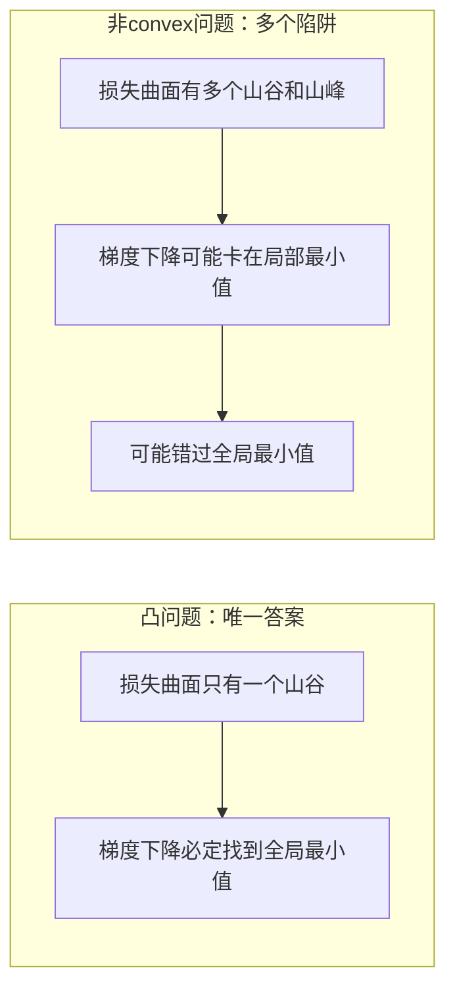

# 凸优化

> 凸问题只有一个山谷。神经网络有上千万个。分清这件事，决定了你的优化器是在"走迷宫"还是"下山"。

**类型：** 实现课
**语言：** Python
**前置知识：** 第 01 阶段 · 04（机器学习微积分）、08（优化算法）
**预计时间：** ~90 分钟
**所处阶段：** Tier 1
**关联课程：** 第 02 阶段 · 01（线性回归）— 线性回归的 MSE 损失是凸函数；第 02 阶段 · 03（支持向量机）— SVM 的求解依赖 KKT 条件与对偶理论

---

## 🎯 学习目标

完成本课后，你能够：

- [ ] 使用定义法、二阶导数法、Hessian 矩阵法三种方式判断一个函数的凸性
- [ ] 从零实现牛顿法，并解释其为什么对二次函数一步收敛
- [ ] 使用拉格朗日乘子法求解等式约束优化问题，解释其几何直觉
- [ ] 阐述 KKT 条件的四个条件，解释互补松弛性在 SVM 中的含义
- [ ] 解释为什么神经网络的损失曲面非凸，但随机梯度下降依然能找到好的解

---

## 1. 问题

第 08 课教你实现了梯度下降、动量和 Adam。这些优化器在任何曲面上都能"往山下走"——但它们没有给你任何保证。

在非凸曲面上，梯度下降可能卡在某个糟糕的局部最小值，可能被困在鞍点上反复震荡，也可能因为学习率设置不当而永远走不到谷底。你上次用 Adam 训练一个三层神经网络时，是不是换了三次随机种子才得到一个满意的 loss？

但机器学习中有一大类问题是**凸的**——线性回归、逻辑回归、支持向量机（SVM）、LASSO、岭回归。对于这些问题，存在更强的工具：**带数学保证的优化**。

凸问题只有一个山谷。任何"往山下走"的算法都一定会到达全局最小值。不需要随机重启，不需要精心设计学习率调度，不需要祈祷。

理解凸性带来三件事：第一，告诉你什么时候问题是"简单模式"（凸）还是"困难模式"（非凸）；第二，给你更快的优化工具——牛顿法；第三，解释机器学习中反复出现的核心概念：正则化本质是约束优化、SVM 的对偶形式、以及深度学习为什么在违反凸性所有优美性质的情况下依然能有效工作。

---

## 2. 概念

### 2.1 凸集

一个集合 $S$ 是凸集，当且仅当对于 $S$ 中的任意两点，连接它们的线段完全落在 $S$ 内部。

```
凸集 vs 非凸集：

  凸集：                    非凸集：
  ┌───────────┐             ★  ·  ★
  │  ·     ·  │              \ | /
  │    ───    │     vs        ·     ← 穿过洞的线段会离开集合
  │  (线段在内部)           / | \
                           ★  ·  ★
```

**形式化判定：** 对于任意 $x, y \in S$ 和任意 $t \in [0, 1]$，点 $tx + (1-t)y$ 也在 $S$ 中。

常见的凸集：

- 直线、平面、整个 $\mathbb{R}^n$
- 球体（圆、球面、超球面）
- 半空间：$\{x : a^T x \leq b\}$
- 任意多个凸集的交集仍是凸集

常见的非凸集：

- 圆环（中间有个洞）
- 两个不相交的圆的并集
- 任何一个有"凹痕"或"洞"的集合

### 2.2 凸函数

函数 $f$ 是凸函数，当且仅当其定义域是凸集，并且对于定义域内的任意两点 $x, y$ 和任意 $t \in [0, 1]$：

$$
f(tx + (1-t)y) \leq t f(x) + (1-t) f(y)
$$

**几何直觉：** 函数图像上任意两点之间的线段，始终在图像上方或在图像上。

```
凸函数:                      非凸函数:
     ╱  ╲                        ╱╲  ╱╲
    ╱    ╲  ← 弦在曲线上方       ╱  ╲╱  ╲  ← 存在局部极小值
   ╱      ╲                    ╱        ╲
  ╱   唯一山谷                 ╱  多个山谷  ╲
```

常见的凸函数：

- $f(x) = x^2$（抛物线）
- $f(x) = |x|$（绝对值）
- $f(x) = e^x$（指数函数）
- $f(x) = \max(0, x)$（ReLU，分段线性）
- $f(x) = -\log(x)$，$x > 0$
- 任何线性函数 $f(x) = a^T x + b$（既是凸函数也是凹函数）

### 2.3 三种凸性判定方法

| 判定方法 | 适用场景 | 判定条件 |
|---|---|---|
| **二阶导数法** | 一元函数 $f(x)$ | $f''(x) \geq 0$ 对所有 $x$ 成立 |
| **Hessian 矩阵法** | 多元函数 $f(x)$ | Hessian 矩阵 $H(x)$ 半正定（所有特征值 $\geq 0$） |
| **定义法** | 任何函数 | 直接验证 $f(tx + (1-t)y) \leq t f(x) + (1-t) f(y)$ |

示例验证：

- $f(x) = x^2$：$f''(x) = 2 \geq 0$，是凸函数
- $f(x) = x^3$：$f''(x) = 6x$，当 $x < 0$ 时为负，不是凸函数
- $f(x) = e^x$：$f''(x) = e^x > 0$，是凸函数

### 2.4 核心定理：凸性的力量

**凸优化的核心定理：对于凸函数，任何局部最小值都是全局最小值。**

这意味着梯度下降不会被困住——每条下山路都通向同一个终点。算法保证收敛到最优解。



凸性的直接推论：

- 不需要随机重启（random restart）
- 不需要精心设计的学习率衰减策略
- 可以证明收敛速率（取决于函数性质）
- 解是唯一的（至多相差平坦区域）

### 2.5 机器学习中的凸与非凸

| 问题 | 是否凸？ | 原因 |
|---|---|---|
| 线性回归（MSE） | 是 | 损失关于权重是二次的 |
| 逻辑回归 | 是 | 对数损失关于权重是凸的 |
| SVM（合页损失） | 是 | 线性函数的逐点最大值 |
| LASSO（L1 回归） | 是 | 凸函数之和仍是凸的 |
| 岭回归（L2） | 是 | 二次 + 二次 = 凸 |
| 神经网络（任何损失） | 否 | 非线性激活函数破坏凸性 |
| k-均值聚类 | 否 | 离散分配步骤 |
| 矩阵分解 | 否 | 未知数的乘积 |

规律：**线性模型 + 凸损失 = 凸问题**。一旦引入带有非线性激活函数的隐藏层，凸性立刻被打破。

### 2.6 Hessian 矩阵

函数 $f: \mathbb{R}^n \to \mathbb{R}$ 的 Hessian 矩阵 $H$ 是 $n \times n$ 的二阶偏导数矩阵：

$$
H_{ij} = \frac{\partial^2 f}{\partial x_i \partial x_j}
$$

以 $f(x, y) = x^2 + 3xy + y^2$ 为例：

$$
H = \begin{bmatrix} 2 & 3 \\ 3 & 2 \end{bmatrix}
$$

Hessian 矩阵告诉你曲率信息：

- 所有特征值均为正：每个方向都是上凸的（该点是局部极小值）
- 所有特征值均为负：每个方向都是下凹的（局部极大值）
- 特征值有正有负：鞍点（某些方向上凸，某些方向下凹）
- 特征值含零：该方向是平坦的（退化情形）

**条件数**（最大特征值与最小特征值之比）是衡量优化难度的关键指标。条件数越大，梯度下降在"狭长山谷"中来回震荡越严重。

### 2.7 牛顿法

梯度下降只用一阶信息（梯度），牛顿法额外使用二阶信息（Hessian 矩阵）。它在当前点拟合一个二次曲面，直接跳到该二次曲面的最小值处。

$$
\text{牛顿法：} \quad x_{k+1} = x_k - H^{-1} \nabla f(x_k)
$$

$$
\text{梯度下降：} \quad x_{k+1} = x_k - \eta \nabla f(x_k)
$$

牛顿法用逆 Hessian 矩阵替代了标量学习率，自动根据局部曲率调整步长和方向。

```
梯度下降（盲目地跟着梯度走）         牛顿法（利用曲率信息直接跳到谷底）

Step 0:  ●                            Step 0:  ●
Step 1:   ●                           Step 1:        ● ← 一步到达！
Step 2:    ●
...                                   （对二次函数精确）
Step 500:          ● 收敛
```

牛顿法的优势：

- 在最小值附近具有**二次收敛性**（每一步误差平方级减小）
- 无需手动设置学习率
- 对参数化方式具有尺度不变性

牛顿法的限制：

- 存储 Hessian 需要 $O(n^2)$ 内存，求逆需要 $O(n^3)$ 计算量
- 一个有 100 万参数的神经网络，Hessian 有 $10^{12}$ 个元素，求逆需要 $10^{18}$ 次运算
- 在大规模深度学习中不实用

### 2.8 约束优化与拉格朗日乘子法

现实中的优化问题通常带有约束。例如：最小化成本但预算有限，最小化误差但模型复杂度有上界。

**拉格朗日乘子法**将约束优化问题转化为无约束问题。

对于问题：最小化 $f(x)$，满足 $g(x) = 0$。

引入**拉格朗日乘子** $\lambda$，构造拉格朗日函数：

$$
\mathcal{L}(x, \lambda) = f(x) + \lambda \cdot g(x)
$$

在最优解处，$\mathcal{L}$ 的梯度为零：

$$
\frac{\partial \mathcal{L}}{\partial x} = \nabla f(x) + \lambda \nabla g(x) = 0
$$

$$
\frac{\partial \mathcal{L}}{\partial \lambda} = g(x) = 0
$$

**几何直觉：** 在约束最优解处，目标函数的梯度必须与约束函数的梯度平行。如果不平行，沿着约束曲面移动还能继续减小 $f$。

```
等值线 f(x,y): 同心椭圆
约束 g(x,y)=0: 直线

        ╱───╲
       ╱  ●  ╲  ← 最优解：等值线与约束线相切
      ╱ ╱   ╲ ╲     ∇f 与 ∇g 平行
     ╱ ╱     ╲ ╲
────●╱───────╲●────  ← 约束线 g(x,y) = 0
```

### 2.9 KKT 条件

KKT（Karush-Kuhn-Tucker）条件将拉格朗日乘子法推广到不等式约束。

对于问题：最小化 $f(x)$，满足 $g_i(x) \leq 0$，$i = 1, \ldots, m$。

最优解必须满足的四个条件：

$$
\begin{aligned}
\text{(1) 驻点性：} \quad & \nabla f(x) + \sum_i \lambda_i \nabla g_i(x) = 0 \\
\text{(2) 原始可行性：} \quad & g_i(x) \leq 0, \quad \forall i \\
\text{(3) 对偶可行性：} \quad & \lambda_i \geq 0, \quad \forall i \\
\text{(4) 互补松弛性：} \quad & \lambda_i \cdot g_i(x) = 0, \quad \forall i
\end{aligned}
$$

**互补松弛性**是关键洞察：每个约束要么是"紧"的（$g_i = 0$，解在边界上），要么乘子为零（约束不起作用）。一个不影响最优解的约束，其乘子必为零。

在 SVM 中：**支撑向量**就是那些约束起作用的数据点（$\lambda_i > 0$），其他数据点的 $\lambda_i = 0$，对决策边界没有影响。

### 2.10 正则化本质是约束优化

L1 和 L2 正则化不是随意的技巧，它们是约束优化的另一种表达。

**L2 正则化（岭回归）：**

$$
\begin{aligned}
\text{约束形式：} \quad & \min \text{Loss}(w) \quad \text{s.t.} \quad \|w\|_2^2 \leq t \\
\text{等价无约束形式：} \quad & \min \text{Loss}(w) + \lambda \|w\|_2^2
\end{aligned}
$$

约束 $\|w\|_2^2 \leq t$ 定义了一个球体（二维是圆）。解在损失等值线首次接触球面的位置。

**L1 正则化（LASSO）：**

$$
\begin{aligned}
\text{约束形式：} \quad & \min \text{Loss}(w) \quad \text{s.t.} \quad \|w\|_1 \leq t \\
\text{等价无约束形式：} \quad & \min \text{Loss}(w) + \lambda \|w\|_1
\end{aligned}
$$

约束 $\|w\|_1 \leq t$ 定义了一个菱形（二维是旋转的正方形）。

| 性质 | L2 约束（圆） | L1 约束（菱形） |
|---|---|---|
| **约束形状** | 球体（高维） | 菱形（二维）/ 多面体（高维） |
| **等值线接触位置** | 光滑边界上的任意点 | 更容易在角点（坐标轴对齐）接触 |
| **解的特征** | 权重变小但非零 | 部分权重精确为零（稀疏性） |
| **效果** | 权重收缩 | 特征选择 |

这就解释了为什么 L1 产生稀疏模型（做特征选择），而 L2 只是让权重变小。菱形的角点对齐坐标轴，等值线更容易在角点处接触，使得某些权重精确为零。

### 2.11 对偶理论

每个约束优化问题（原问题）都对应一个对偶问题。对于凸问题，原问题与对偶问题具有相同的最优值（强对偶性）。

$$
\begin{aligned}
\text{原问题：} \quad & \min f(x) \quad \text{s.t.} \quad g(x) \leq 0 \\
\text{拉格朗日函数：} \quad & \mathcal{L}(x, \lambda) = f(x) + \lambda \cdot g(x) \\
\text{对偶函数：} \quad & d(\lambda) = \min_x \mathcal{L}(x, \lambda) \\
\text{对偶问题：} \quad & \max_{\lambda \geq 0} d(\lambda)
\end{aligned}
$$

对偶的意义：

- 对偶问题有时比原问题更容易求解
- SVM 在**对偶形式**下求解——问题仅依赖于数据点之间的内积，从而可以使用核技巧
- 对偶为原问题最优值提供了一个下界，可用于评估解的质量

### 2.12 深度学习为什么在非凸世界中工作

神经网络的损失函数是高度非凸的。按经典优化理论，这类问题本不该被有效求解。然而随机梯度下降（SGD）在实践中总能找到足够好的解释。以下是几个关键原因。

**原因一：大多数局部最小值已经足够好。**

在高维空间中，随机临界点（梯度为零的位置）绝大多数是鞍点而非局部极小值。即便存在局部极小值，其损失值也往往接近全局最优。

**原因二：高维空间中鞍点才是真正障碍。**

对于 $n$ 维函数的临界点，它是局部极小值（所有 $n$ 个特征值为正）的概率约为 $2^{-n}$。当 $n = 10^6$ 时，这个概率小到可以忽略。SGD 的随机噪声有助于逃离鞍点。

**原因三：过参数化平滑了损失曲面。**

参数量超过训练样本数的网络具有更平滑、连通性更好的损失曲面。更宽的网络有更少的"坏"局部极小值。

**原因四：随机噪声充当隐式正则化。**

小批量 SGD 的噪声阻止算法落入尖锐的极小值（过拟合），倾向于平坦的极小值（泛化性好）。

```
低维空间（难以优化）          高维空间（容易优化）

  ╱╲  ╱╲  ╱╲                  ～～～～～～～～～～～～
 ╱  ╲╱  ╲╱  ╲   多个孤立极小值    ～ 连通的平滑山谷 ～
╱              ╲                ～～～～～～～～～～～～
                                     ↑
                               大多数路径通向好的解
```

| 方法 | 内存开销 | 每步计算量 | 适用场景 |
|---|---|---|---|
| 梯度下降 | $O(n)$ | $O(n)$ | 大规模模型基线 |
| 牛顿法 | $O(n^2)$ | $O(n^3)$ | 小规模凸问题 |
| L-BFGS | $O(mn)$ | $O(mn)$ | 中等规模凸问题 |
| Adam | $O(n)$ | $O(n)$ | 深度学习默认选择 |
| K-FAC | $O(n)$ | 每层 $O(n)$ | 大批量训练研究 |

---

## 3. 从零实现

### 第 1 步：凸性判定器

通过随机采样验证凸函数定义——这是最通用的判定方法。

```python
import random
import math


def check_convexity(f, dim, bounds=(-5, 5), samples=2000, label=""):
    """通过随机采样验证函数是否满足凸函数定义。

    对于凸函数 f，任意两点 x, y 和 t ∈ [0,1]，满足：
        f(t*x + (1-t)*y) <= t*f(x) + (1-t)*f(y)

    如果有任何采样违反该不等式，则函数非凸。

    Args:
        f: 待检测函数
        dim: 输入维度
        bounds: 采样区间
        samples: 采样次数
        label: 输出标签

    Returns:
        (is_convex, violations): 是否凸、违反次数
    """
    violations = 0
    worst_violation = 0.0
    for _ in range(samples):
        x = [random.uniform(*bounds) for _ in range(dim)]
        y = [random.uniform(*bounds) for _ in range(dim)]
        t = random.uniform(0, 1)
        # 凸组合：两点之间的插值点
        mid = [t * xi + (1 - t) * yi for xi, yi in zip(x, y)]
        lhs = f(mid)
        rhs = t * f(x) + (1 - t) * f(y)
        gap = lhs - rhs
        if gap > 1e-10:
            violations += 1
            worst_violation = max(worst_violation, gap)
    is_convex = violations == 0
    return is_convex, violations
```

**采样输出示例：**

```
  f(x) = x^2                     CONVEX      violations: 0/2000
  f(x) = |x|                     CONVEX      violations: 0/2000
  f(x) = e^x                     CONVEX      violations: 0/2000
  f(x) = sin(x)                  NOT CONVEX  violations: 843/2000
  f(x,y) = x^2 - y^2 [saddle]   NOT CONVEX  violations: 512/2000
```

### 第 2 步：Hessian 矩阵特征值分析

通过特征值判断函数在某点的曲率方向。

```python
def hessian_eigenvalues_2d(H):
    """计算 2x2 矩阵的特征值（解析解）。

    对于 H = [[a, b], [c, d]]，特征值满足：
        λ^2 - (a+d)*λ + (ad - bc) = 0
    """
    a, b = H[0][0], H[0][1]
    c, d = H[1][0], H[1][1]
    trace = a + d
    det = a * d - b * c
    discriminant = trace ** 2 - 4 * det
    if discriminant < 0:
        return None, None
    sqrt_disc = math.sqrt(discriminant)
    e1 = (trace + sqrt_disc) / 2
    e2 = (trace - sqrt_disc) / 2
    return e1, e2


def is_positive_semidefinite_2d(H):
    """判断 2x2 Hessian 矩阵是否半正定。

    半正定 ⟺ 所有特征值 >= 0 ⟺ 函数在该点处凸
    """
    e1, e2 = hessian_eigenvalues_2d(H)
    if e1 is None:
        return False
    return e1 >= -1e-10 and e2 >= -1e-10
```

### 第 3 步：牛顿法实现

牛顿法的核心——使用逆 Hessian 矩阵替代学习率。

```python
def invert_2x2(H):
    """2x2 矩阵求逆。

    H = [[a, b], [c, d]]，则 H^(-1) = (1/det) * [[d, -b], [-c, a]]
    det 接近零时返回 None（矩阵奇异）。
    """
    det = H[0][0] * H[1][1] - H[0][1] * H[1][0]
    if abs(det) < 1e-15:
        return None
    return [
        [H[1][1] / det, -H[0][1] / det],
        [-H[1][0] / det, H[0][0] / det],
    ]


def mat_vec_2d(M, v):
    """2x2 矩阵与 2 维向量的乘法。"""
    return [
        M[0][0] * v[0] + M[0][1] * v[1],
        M[1][0] * v[0] + M[1][1] * v[1],
    ]


def newtons_method(grad_f, hessian_f, x0, steps=100, tol=1e-12):
    """牛顿法优化。

    每一步计算 Hessian 的逆矩阵乘以梯度，更新参数。
    对于二次函数，理论上一步收敛到精确解。

    Args:
        grad_f: 梯度函数
        hessian_f: Hessian 矩阵函数
        x0: 初始点
        steps: 最大迭代次数
        tol: 梯度范数阈值

    Returns:
        history: 参数历史
    """
    x = list(x0)
    history = [x[:]]
    for _ in range(steps):
        g = grad_f(x)
        # 梯度足够小时判定收敛
        if sum(gi ** 2 for gi in g) < tol:
            break
        H = hessian_f(x)
        H_inv = invert_2x2(H)
        if H_inv is None:
            break  # Hessian 奇异，无法求逆
        # 牛顿步：x_new = x - H^(-1) * grad
        dx = mat_vec_2d(H_inv, g)
        x = [x[0] - dx[0], x[1] - dx[1]]
        history.append(x[:])
    return history
```

### 第 4 步：梯度下降对比

```python
def optimize_gd(grad_f, x0, lr=0.01, steps=1000, tol=1e-12):
    """梯度下降。

    沿负梯度方向以固定步长移动。
    条件数大时会在狭长山谷中震荡。
    """
    x = list(x0)
    history = [x[:]]
    for _ in range(steps):
        g = grad_f(x)
        if sum(gi ** 2 for gi in g) < tol:
            break
        x = [xi - lr * gi for xi, gi in zip(x, g)]
        history.append(x[:])
    return history
```

**运行对比：** 对于 $f(x,y) = 50x^2 + y^2$（条件数 = 50），起点 $(10, 10)$：

```
牛顿法：1 步收敛
梯度下降（lr=0.015）：约 300+ 步收敛

原因：牛顿法自动根据曲率调整步长，
      梯度下降在曲率小的方向步子太小，曲率大的方向步子太大。
```

### 第 5 步：拉格朗日乘子法求解约束优化

```python
def lagrange_solve(f_grad, g_val, g_grad, x0, lr=0.01,
                   lr_lambda=0.01, steps=5000):
    """使用拉格朗日乘子法求解等式约束优化问题。

    最小化 f(x)，满足 g(x) = 0。

    对 x 沿拉格朗日函数的梯度下降（最小化 L），
    对 λ 沿拉格朗日函数的梯度上升（最大化对偶）。

    Args:
        f_grad: 目标函数梯度
        g_val: 约束函数值
        g_grad: 约束函数梯度
        x0: 初始点
        lr: x 的学习率
        lr_lambda: λ 的学习率
        steps: 迭代次数

    Returns:
        history: (x, λ, g) 历史
    """
    x = list(x0)
    lam = 0.0
    history = []
    for _ in range(steps):
        fg = f_grad(x)
        gv = g_val(x)
        gg = g_grad(x)
        # x 的更新：沿 L 对 x 的梯度下降
        x = [
            xi - lr * (fgi + lam * ggi)
            for xi, fgi, ggi in zip(x, fg, gg)
        ]
        # λ 的更新：沿 L 对 λ 的梯度上升（对偶上升）
        lam = lam + lr_lambda * gv
        history.append((x[:], lam, gv))
    return history
```

**验证示例：** 最小化 $f(x,y) = x^2 + y^2$，约束 $x + y = 1$。

解析解为 $(0.5, 0.5)$，$\lambda = -1$。

```
  Step       x       y   lambda    g(x,y)    f(x,y)
  ------------------------------------------------
      1  1.9600  1.9600  -0.0400   2.920000   7.683200
     50  0.6653  0.6653  -0.3307   0.330709   0.882948
    500  0.5066  0.5066  -0.9867   0.013277   0.513277
   5000  0.5000  0.5000  -1.0000   0.000000   0.500000

解析解：x = 0.5, y = 0.5, λ = -1, f = 0.5
```

### 第 6 步：正则在几何上意味着什么

```python
def demo_regularization_geometry():
    """演示 L1 和 L2 正则化对应的几何约束。

    L2 约束 ||w||^2 <= t：球体，权重收缩但不为零
    L1 约束 ||w||_1 <= t：菱形，角点导致稀疏性
    """
    # 无约束最优解 (3, 2)
    # L2 投影：(3,2) 到单位圆上的最近点
    norm = math.sqrt(3 ** 2 + 2 ** 2)
    x_l2 = [3.0 / norm, 2.0 / norm]
    print(f"L2 投影解: ({x_l2[0]:.4f}, {x_l2[1]:.4f})")
    print(f"  ||w||^2 = {x_l2[0] ** 2 + x_l2[1] ** 2:.4f}")
    print(f"  两个权重都非零，仅缩小")

    # L1 投影：最优解在菱形角点 (1, 0)
    print(f"\nL1 约束下的最优在角点处，部分权重精确为零")
```

**输出示例：**

```
L2 约束（单位圆）：
  解: (0.8321, 0.5547)
  ||w||^2 = 1.0000
  权重收缩但不为零 —— 平滑的圆面让等值线在光滑点接触

L1 约束（单位菱形）：
  角点 (1, 0) 目标值 = 5.0  <-- 最优角点
  角点 (0, 1) 目标值 = 10.0
  权重精确为零 —— 菱形的尖角偏好坐标轴方向的解
```

---

## 4. 工业工具

### 4.1 SciPy 凸优化求解器

对于凸问题，使用专用求解器可以获得全局最优解的保证。

```python
import numpy as np
from scipy.optimize import minimize

# 岭回归：min ||Xw - y||^2 + λ||w||^2
n_samples, n_features = 100, 5
X = np.random.randn(n_samples, n_features)
y = X @ np.array([1.0, 2.0, 0.0, -1.0, 0.5]) + 0.1 * np.random.randn(n_samples)

lam = 0.1


def loss(w):
    residual = y - X @ w
    return np.sum(residual ** 2) + lam * np.sum(w ** 2)


def grad(w):
    return -2 * X.T @ (y - X @ w) + 2 * lam * w


# L-BFGS-B：适合凸问题的二阶近似方法
result = minimize(loss, np.zeros(n_features), method="L-BFGS-B", jac=grad)
print(f"最优权重: {result.x}")
print(f"收敛: {result.success}, 迭代次数: {result.nit}")
```

### 4.2 CVXPY：凸优化专用库

```python
import cvxpy as cp

n = 5
w = cp.Variable(n)
lam = 0.1

# 最小化 MSE + L2 正则化
objective = cp.Minimize(cp.sum_squares(X @ w - y) + lam * cp.sum_squares(w))
problem = cp.Problem(objective)
problem.solve()

print(f"最优权重: {w.value}")
print(f"最优值: {problem.value}")
```

### 4.3 Scikit-learn SVM（对偶形式 + 核技巧）

```python
from sklearn.svm import SVC

# SVM 在对偶形式下求解，天然支持核技巧
svm = SVC(kernel="rbf", C=1.0)
svm.fit(X_train, y_train)

print(f"支撑向量数量: {svm.n_support_}")
print(f"决策函数: {svm.decision_function(X_test[:3])}")
```

### 4.4 求解器选择指南

| 问题类型 | 推荐工具 | 备注 |
|---|---|---|
| 小规模凸问题 | CVXPY | 语法接近数学表达，自动识别凸性 |
| 中等规模凸问题 | SciPy L-BFGS-B | 无需额外安装，适合线性/逻辑回归 |
| SVM 训练 | sklearn.svm.SVC | LIBSVM 底层，支持核函数 |
| 深度学习（非凸） | PyTorch SGD/Adam | 接受局部最优，依赖过参数化 |
| L1 正则化（稀疏） | sklearn.Lasso | 使用坐标下降法 |

---

## 5. 知识连线

本课学习的凸性分析，会在后续多个阶段直接用到：

- **阶段 02（机器学习基础）**：线性回归的 MSE 损失是凸函数——理解了凸性，你就理解了为什么线性回归有解析解、为什么 SVM 能使用核技巧（对偶形式）
- **阶段 03（深度学习核心）**：神经网络的损失曲面是非凸的——本课解释了为什么 SGD 在违反凸性保证的情况下依然有效，以及鞍点为什么比局部极小值更值得担心
- **阶段 10（大语言模型从零）**：预训练大语言模型的 loss landscape 研究（如 loss spike 分析）依赖凸优化的直觉；Adam 的二阶矩本质上是对 Hessian 对角元素的近似估计

---

## 6. 工程最佳实践

### 6.1 凸问题 vs 非凸问题的工程策略

| 问题类型 | 策略 |
|---|---|
| **凸问题**（逻辑回归、SVM、LASSO） | 使用专用凸求解器（CVXPY、liblinear），可以获得全局收敛保证；无需随机重启 |
| **非凸问题**（神经网络） | 使用 SGD/Adam；接受局部最优；使用学习率调度 + 过参数化提升解的质量 |
| **不确定凸性** | 先用凸性判定方法检查；如果是凸问题却用 SGD 在跑，浪费了收敛保证 |

### 6.2 中文场景特别建议

- 中文文本分类任务中，使用逻辑回归 + L2 正则化作为基线。它是凸问题，训练快、可解释，是衡量深度学习模型提升的合理参照
- 在中文分词或命名实体识别中，条件随机场（CRF）的优化是凸的，可以用 L-BFGS 训练。Scikit-learn 的 `sklearn_crfsolver` 默认使用 L-BFGS
- 当使用 PyTorch 训练中文大语言模型时，AdamW 是默认选择。Adam 的 $v_t$（二阶矩）可理解为对 Hessian 对角的近似——虽然不如真正的牛顿法精确，但在百万参数规模下是唯一可行方案

### 6.3 踩坑经验

- 用 CVXPY 建模时忘记验证问题凸性，导致求解器报"Problem does not follow DCP rules"——CVXPY 要求规则化建模，任何非凸约束都会报错
- 对非凸问题使用牛顿法——Hessian 可能存在负特征值，导致牛顿步朝极大值方向移动。务必先确认凸性
- L1 正则化问题使用标准梯度下降——L1 在零点不可导。应使用近端梯度下降（proximal gradient）或次梯度方法（scikit-learn 的 Lasso 使用坐标下降法）
- 当 Hessian 条件数很大时，直接求 Hessian 的逆会数值不稳定。添加正则化项 $\epsilon I$ 保证正定性
- 在 SVM 对偶问题中，误以为所有 $\alpha_i > 0$ 的样本都是支撑向量。实际上，$\alpha_i = C$ 的样本是被错误分类或落在间隔内的样本，$0 < \alpha_i < C$ 的才是恰好位于间隔边界上的"自由支撑向量"

---

## 7. 常见错误

### 错误 1：对非凸问题使用牛顿法

**现象：** 使用牛顿法训练一个三层神经网络，loss 不降反升，出现 NaN。

**原因：** 非凸函数的 Hessian 可能存在负特征值，逆 Hessian 乘以梯度可能指向极大值方向而非极小值方向。

**修复：**

```python
# ❌ 错误：对非凸问题直接用牛顿法
H_inv = invert_2x2(hessian_f(x))
x = x - H_inv @ grad

# ✅ 方案 1：添加正则化保证 Hessian 正定性
epsilon = 1e-3
H_reg = H + epsilon * np.eye(len(H))
H_inv = np.linalg.inv(H_reg)

# ✅ 方案 2：对非凸问题使用一阶方法（SGD/Adam）
x = x - lr * grad
```

### 错误 2：混淆"损失函数凸"和"问题凸"

**现象：** 认为交叉熵损失是凸函数，所以神经网络的优化也是凸问题。

**原因：** 交叉熵在 logits 上是凸的，但神经网络从输入到 logits 的映射经过多层非线性激活。$f(W_2 \cdot \text{ReLU}(W_1 x))$ 关于 $(W_1, W_2)$ 的复合函数不再是凸的。

**修复：** 判定凸性时，必须对**你正在优化的参数**检查凸性，而不是对中间变量。

```
# ❌ 错误推理
"交叉熵是凸的 → 神经网络优化是凸的"

# ✅ 正确推理
"交叉熵关于 logits 是凸的，但 logits = f(x; W) 关于 W 高度非线性
 → 整个问题关于 W 是非凸的 → 使用 SGD/Adam"
```

### 错误 3：L1 正则化问题使用标准梯度下降

**现象：** L1 正则化模型的权重不会真正变成零，而是一个很接近零的小值（如 $10^{-7}$），特征选择效果差。

**原因：** L1 正则项 $\|w\|_1$ 在零点不可导。标准梯度下降在零点附近震荡，无法精确到达零。

**修复：**

```python
# ❌ 错误：标准梯度下降 + L1
w = w - lr * (grad_loss + lam * np.sign(w))

# ✅ 正确：使用近端梯度下降（软阈值算子）
w = w - lr * grad_loss
# 软阈值：proximal operator of L1 norm
w = np.sign(w) * np.maximum(np.abs(w) - lr * lam, 0)
```

### 错误 4：梯度下降学习率按最大特征值设置

**现象：** 对 $f(x,y) = 100x^2 + y^2$ 使用 $\eta = 0.02$（基于最大特征值 100 的设置），步子太大导致震荡。

**原因：** 理论上梯度下降的最优学习率是 $2/(\lambda_{\max} + \lambda_{\min})$，直接用 $1/\lambda_{\max}$ 在小特征值方向会导致严重震荡。

**修复：**

```python
# ❌ 过大的学习率导致震荡
lr = 1.0 / max_eigenvalue  # 在大曲率方向尚可，小曲率方向震荡

# ✅ 使用自适应方法或考虑条件数
# 方案 1：Adam 自动调整每个方向的学习率
optimizer = torch.optim.Adam(params, lr=0.001)

# 方案 2：使用 L-BFGS 近似处理曲率
result = minimize(loss, x0, method="L-BFGS-B", jac=grad)
```

### 错误 5：忽略强对偶性条件

**现象：** 对 SDP 问题求解对偶，发现对偶最优值远小于原问题最优值。

**原因：** 强对偶性（原问题与对偶问题最优值相等）并非总是成立。对于凸问题，需要满足 Slater 条件（存在严格可行解）。

**修复：** 在声明"可以通过对偶求解"之前，先验证 Slater 条件是否满足。对于大多数 SVM 问题（约束是线性的），Slater 条件成立，强对偶性保证成立。

---

## 8. 面试考点

### Q1：凸函数的二阶判定条件是什么？（难度：⭐⭐）

**参考答案：**
对于一元函数 $f(x)$，若 $f''(x) \geq 0$ 对所有 $x$ 成立，则 $f$ 是凸函数。
对于多元函数 $f(x)$，若 Hessian 矩阵 $H(x)$ 在所有 $x$ 处半正定（所有特征值 $\geq 0$），则 $f$ 是凸函数。
半正定等价于：对于任意向量 $v$，$v^T H v \geq 0$。

### Q2：牛顿法为什么对二次函数一步收敛？（难度：⭐⭐）

**参考答案：**
牛顿法在当前点对目标函数做二阶泰勒展开（二次近似），然后跳到该二次函数的最小值处。如果目标函数本身就是二次函数，其二阶泰勒展开是精确的——近似曲面与原曲面完全重合。因此一步就能跳到精确的全局最小值，与起始点无关。

### Q3：解释 KKT 条件中的互补松弛性，并说明它在 SVM 中的含义。（难度：⭐⭐⭐）

**参考答案：**
互补松弛性：$\lambda_i \cdot g_i(x) = 0$。每个不等式约束要么是紧的（$g_i = 0$，解在约束边界上），要么乘子为零（约束不起作用）。不可能同时 $\lambda_i > 0$ 且 $g_i < 0$。
在 SVM 中，只有支撑向量对应的约束是紧的（$\lambda_i > 0$），它们的决策边界恰好落在间隔上。其他样本的 $\lambda_i = 0$，对决策边界**没有影响**。这就是 SVM 的稀疏性——训练完成后，只需要存储支撑向量即可。

### Q4：为什么神经网络损失曲面高度非凸，SGD 却能找到好的解？（难度：⭐⭐⭐）

**参考答案：**
三个主要原因：（1）在高维空间中，随机临界点绝大多数是鞍点而非局部极小值，概率约为 $2^{-n}$；（2）存在的局部极小值大多损失接近全局最优，差距不大；（3）过参数化使损失曲面更平滑、连通性更好。此外，SGD 的小批量噪声帮助逃离鞍点，并偏好平坦极小值（泛化性更好）。

### Q5：手写拉格朗日乘子法求解（难度：⭐⭐⭐）

**参考答案：**

```python
# 问题：最小化 f(x,y) = x^2 + y^2，约束 x + y = 1
# 拉格朗日函数：L = x^2 + y^2 + λ(x + y - 1)
# 求偏导并令其为零：
#   ∂L/∂x = 2x + λ = 0  →  x = -λ/2
#   ∂L/∂y = 2y + λ = 0  →  y = -λ/2
#   ∂L/∂λ = x + y - 1 = 0
# 解得：x = y = 0.5, λ = -1
# 验证：代入约束 0.5 + 0.5 = 1 ✓
```

---

## 🔑 关键术语

| 术语 | 人们怎么说 | 实际含义 |
|---|---|---|
| 凸函数 | "就是一个碗的形状" | 函数图像上任意两点间的线段始终在图像上方；或 Hessian 矩阵在所有点半正定 |
| Hessian 矩阵 | "二阶导数的矩阵形式" | 所有二阶偏导数构成的对称矩阵，编码了函数在各方向的曲率信息 |
| 半正定 | "所有特征值都大于等于零" | 矩阵 $H$ 满足 $v^T H v \geq 0$ 对所有 $v$ 成立；等价于 Hessian 的"二阶导非负" |
| 条件数 | "Hessian 的条件数大就慢" | 最大特征值与最小特征值之比；条件数越大，梯度下降在狭长山谷中震荡越严重 |
| 牛顿法 | "用二阶信息的优化器" | 用逆 Hessian 矩阵替代标量学习率，对二次函数一步收敛，但对非凸问题可能失效 |
| 拉格朗日乘子 | "λ 就是那个系数" | 将约束优化转化为无约束问题的辅助变量；其大小反映约束的"松紧程度" |
| KKT 条件 | "带不等式约束的拉格朗日" | 含不等式约束问题最优解的四个必要条件，包括驻点性、可行性、对偶可行性、互补松弛性 |
| 互补松弛性 | "要么约束紧、要么乘子零" | $\lambda_i g_i(x) = 0$：不起作用的约束乘子必为零，SVM 中由此产生稀疏性 |
| 对偶问题 | "原问题的镜像版本" | 通过拉格朗日函数构造的伴生问题；凸问题下强对偶性保证两者最优值相等 |
| 强对偶性 | "原问题和对偶问题答案相同" | 原问题与对偶问题最优值相等，在凸问题满足 Slater 条件时成立 |
| 鞍点 | "不是极大也不是极小的点" | 梯度为零但 Hessian 有正有负特征值的点；高维空间中的主要障碍 |
| 过参数化 | "参数比数据多" | 使用超过训练样本数的参数；使损失曲面更平滑，减少坏的局部极小值 |

---

## 📚 小结

凸优化是机器学习的数学基石之一：凸函数只有一个山谷，任何局部最小值都是全局最小值；Hessian 矩阵编码了曲率信息，是理解牛顿法、条件数、鞍点的基础；拉格朗日乘子法与 KKT 条件将约束优化纳入统一框架，是 SVM 和对偶理论的核心。

下一课我们将学习**信息论**——从熵、交叉熵到 KL 散度，这些概念是理解损失函数设计、模型压缩和生成式人工智能的理论前提。

---

## ✏️ 练习

1. 【理解】用自己的话解释"凸函数"的定义。为什么说"凸函数的任何局部最小值都是全局最小值"？请画一个简图辅助说明，字数不超过 200 字。

2. 【实现】修改代码中的 `check_convexity` 函数，使其能检测**严格凸性**（strict convexity）：当且仅当不等式严格成立（lhs < rhs，等号仅在 x=y 或 t∈{0,1} 时为严格凸）。测试 $f(x) = x^4$ 和 $f(x) = x^2$，它们是否严格凸？

3. 【实验】对函数 $f(x,y) = x^2 + k \cdot xy + y^2$，分别取 $k = 0, 1, 2, 3$，使用 `hessian_eigenvalues_2d` 计算 Hessian 的特征值。找到使该函数**刚好失去凸性**的 $k$ 值临界点，并解释原因。

4. 【实现】实现投影梯度下降（Projected Gradient Descent）求解 L1 约束优化：最小化 $(x-3)^2 + (y-2)^2$，约束 $|x| + |y| \leq 1$。每步更新后将解投影回 L1 球内。验证解至少有一个坐标为零。

5. 【思考】在深度学习中，Adam 优化器使用一阶矩（均值）和二阶矩（方差）来调整每个参数的学习率。根据本课对牛顿法的理解，分析 Adam 与真实牛顿法的差距在哪里？Adam 的 $v_t$（二阶矩）在什么意义上是对 Hessian 对角元素的近似？

---

## 🚀 产出

本课产出以下可复用内容：

| 产出 | 文件 | 说明 |
|---|---|---|
| 凸优化从零实现 | `code/main.py` | 包含凸性判定、牛顿法、梯度下降、拉格朗日乘子法、正则化几何、对偶理论演示的完整代码 |
| 可复用提示词 | `outputs/prompt-convex-optimization-tutor.md` | 凸性判断与优化问题分析助手 |
| 课前/课后测验 | `quiz.json` | 检测凸优化核心概念掌握程度 |

---

## 📖 参考资料

1. [论文] Boyd & Vandenberghe. "Convex Optimization". Cambridge University Press, 2004. https://web.stanford.edu/~boyd/cvxbook/
2. [论文] Bottou, Curtis, Nocedal. "Optimization Methods for Large-Scale Machine Learning". SIAM Review, 2018. https://arxiv.org/abs/1606.04838
3. [论文] Choromanska et al. "The Loss Surfaces of Multilayer Networks". AISTATS, 2015. https://arxiv.org/abs/1412.0233
4. [书籍] Nocedal & Wright. "Numerical Optimization". Springer, 2006. https://link.springer.com/book/10.1007/978-0-387-40065-5
5. [官方文档] CVXPY: https://www.cvxpy.org/

---

> 本课程参考了 AI Engineering From Scratch（MIT License）的课程体系，在此基础上进行了重构和原创内容的扩充。所有中文表达、案例、LLM 视角分析、工程最佳实践、常见错误、面试考点等均为原创内容。
