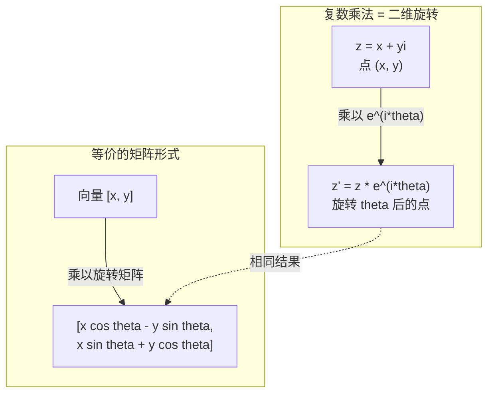
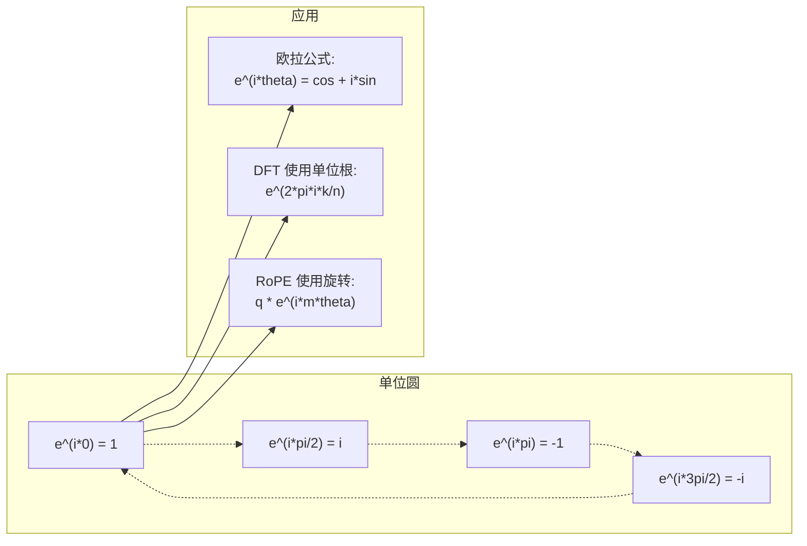

# 复数

> -1 的平方根不是虚构的。它是旋转、频率和半个信号处理的钥匙。

**类型：** 实现课
**语言：** Python
**前置知识：** 第 01 阶段 · 01-04（线性代数、微积分）
**预计时间：** ~60 分钟
**所处阶段：** Tier 1
**关联课程：** 第 07 阶段 · 02（自注意力机制）— 理解 RoPE 如何用复数旋转编码位置

## 🎯 学习目标

完成本课后，你能够：

- [ ] 在直角坐标和极坐标形式下执行复数四则运算（加、乘、除、共轭）
- [ ] 应用欧拉公式在复指数与三角函数之间转换
- [ ] 使用单位根从零实现离散傅里叶变换（DFT）
- [ ] 解释复数旋转如何支撑 RoPE 和正弦位置编码在 Transformer 中的作用

## 1. 问题

你打开一篇关于傅里叶变换的论文，发现到处都是 `i`。你查看 Transformer 的位置编码，看到不同频率下的 `sin` 和 `cos`——那是复指数的实部和虚部。你阅读量子计算的文献，发现一切都用复向量空间表达。

复数看起来抽象。一个建立在 -1 平方根之上的数系，感觉像数学技巧。但它不是技巧。它是旋转和振荡的自然语言。每当某物旋转、振动或振荡时，复数就是合适的工具。

不理解复数，就无法理解离散傅里叶变换。无法理解 FFT。无法理解 RoPE（旋转位置编码）如何在现代大语言模型中工作。无法理解为什么原始 Transformer 论文中的正弦位置编码使用那些特定频率。

本课从零构建复数运算，将其与几何联系起来，并精确展示复数在机器学习中出现的位置。

## 2. 概念

### 2.1 直观理解

复数有两部分：实部和虚部。

```
z = a + bi

其中：
  a 是实部
  b 是虚部
  i 是虚数单位，定义为 i^2 = -1
```

就是这样。你把数轴扩展成一个平面。实数坐在一条轴上。虚数坐在另一条轴上。每个复数都是这个平面上的一个点。

### 2.2 复数四则运算

**加法：** 实部与实部相加，虚部与虚部相加。

```
(a + bi) + (c + di) = (a + c) + (b + d)i

示例：(3 + 2i) + (1 + 4i) = 4 + 6i
```

**乘法：** 使用分配律，记住 i^2 = -1。

```
(a + bi)(c + di) = ac + adi + bci + bdi^2
                 = ac + adi + bci - bd
                 = (ac - bd) + (ad + bc)i

示例：(3 + 2i)(1 + 4i) = 3 + 12i + 2i + 8i^2
                        = 3 + 14i - 8
                        = -5 + 14i
```

**共轭：** 翻转虚部的符号。

```
(a + bi) 的共轭 = a - bi
```

一个复数与其共轭的乘积恒为实数：

```
(a + bi)(a - bi) = a^2 + b^2
```

**除法：** 分子分母同乘分母的共轭。

```
(a + bi) / (c + di) = (a + bi)(c - di) / (c^2 + d^2)
```

这消去了分母中的虚部，得到一个干净的复数。

### 2.3 复平面

复平面将每个复数映射为二维点。横轴是实轴，纵轴是虚轴。

```
z = 3 + 2i  对应点 (3, 2)
z = -1 + 0i 对应实轴上的点 (-1, 0)
z = 0 + 4i  对应虚轴上的点 (0, 4)
```

复数同时是一个点和从原点出发的向量。这种双重解释正是复数对几何有用的原因。

### 2.4 极坐标形式

平面上的任何点都可以用其到原点的距离和与正实轴的夹角来描述。

```
z = r * (cos(theta) + i*sin(theta))

其中：
  r = |z| = sqrt(a^2 + b^2)     （模，或绝对值）
  theta = atan2(b, a)             （辐角，或相位）
```

直角坐标形式 (a + bi) 适合加法。极坐标形式 (r, theta) 适合乘法。

**极坐标下的乘法：** 模相乘，辐角相加。

```
z1 = r1 * e^(i*theta1)
z2 = r2 * e^(i*theta2)

z1 * z2 = (r1 * r2) * e^(i*(theta1 + theta2))
```

这就是复数完美适合旋转的原因。乘以一个模为 1 的复数是纯旋转。

### 2.5 欧拉公式

连接复指数与三角函数的桥梁：

```
e^(i*theta) = cos(theta) + i*sin(theta)
```

这是本课最重要的公式。当 theta = pi 时：

```
e^(i*pi) = cos(pi) + i*sin(pi) = -1 + 0i = -1

因此：e^(i*pi) + 1 = 0
```

五个基本常数（e, i, pi, 1, 0）在一个等式中联系在一起。

### 2.6 为什么欧拉公式对机器学习重要

欧拉公式表明，`e^(i*theta)` 随 theta 变化时描绘出单位圆。theta = 0 时在 (1, 0)。theta = pi/2 时在 (0, 1)。theta = pi 时在 (-1, 0)。theta = 3*pi/2 时在 (0, -1)。完整一圈是 theta = 2*pi。

这意味着复指数就是旋转。而旋转在信号处理和机器学习中无处不在。

### 2.7 与二维旋转的联系

将复数 (x + yi) 乘以 e^(i*theta) 等价于将点 (x, y) 绕原点旋转角度 theta。

```
通过复数乘法旋转：
  (x + yi) * (cos(theta) + i*sin(theta))
  = (x*cos(theta) - y*sin(theta)) + (x*sin(theta) + y*cos(theta))i

通过矩阵乘法旋转：
  [cos(theta)  -sin(theta)] [x]   [x*cos(theta) - y*sin(theta)]
  [sin(theta)   cos(theta)] [y] = [x*sin(theta) + y*cos(theta)]
```

它们产生完全相同的结果。复数乘法就是二维旋转。旋转矩阵只是复数乘法的矩阵表示。



### 2.8 相量与旋转信号

复指数 e^(i*omega*t) 是单位圆上的一点，以角频率 omega 旋转。随着 t 增加，该点描绘出圆。

这个旋转点的实部是 cos(omega*t)。虚部是 sin(omega*t)。正弦信号是旋转复数的投影。

```
e^(i*omega*t) = cos(omega*t) + i*sin(omega*t)

实部:      cos(omega*t)    -- 余弦波
虚部:      sin(omega*t)    -- 正弦波
```

这就是相量表示。与其跟踪一个波动的正弦波，不如跟踪一个平滑旋转的箭头。相位偏移变为角度偏移。幅度变化变为模的变化。信号相加变为向量相加。

### 2.9 单位根

n 次单位根是单位圆上等距分布的 n 个点：

```
w_k = e^(2*pi*i*k/n)    for k = 0, 1, 2, ..., n-1
```

当 n = 4 时，根为：1, i, -1, -i（四个方位点）。
当 n = 8 时，得到四个方位点加上四个对角线方向。

单位根是离散傅里叶变换的基石。DFT 将信号分解为这 n 个等距频率上的分量。

### 2.10 与 DFT 的联系

信号 x[0], x[1], ..., x[N-1] 的离散傅里叶变换为：

```
X[k] = sum_{n=0}^{N-1} x[n] * e^(-2*pi*i*k*n/N)
```

每个 X[k] 测量信号与第 k 个单位根的相关性——一个频率为 k 的复正弦波。DFT 将信号分解为 n 个旋转相量，并告诉你每个相量的幅度和相位。

### 2.11 为什么 i 不是"虚的"

"虚数"这个词是历史偶然。笛卡尔使用时带有贬义。但 i 并不比负数更"虚"——当人们最初拒绝负数时，负数也是"不存在"的。负数回答"什么数加 5 等于 3？"。虚数单位回答"什么数平方等于 -1？"。

更有用的是：i 是一个 90 度旋转算子。将一个实数乘以 i 一次，你旋转 90 度到虚轴。再乘以 i 一次（i^2），你又旋转 90 度——现在指向负实轴方向。这就是为什么 i^2 = -1。这不神秘。这是由两个四分之一旋转构成的半旋转。

这就是复数在工程中无处不在的原因。任何旋转的东西——电磁波、量子态、信号振荡、位置编码——都自然地用复数描述。

### 2.12 复指数 vs 三角函数

在欧拉公式之前，工程师将信号写为 A*cos(omega*t + phi)——幅度 A，频率 omega，相位 phi。这可行但让运算痛苦。添加两个不同相位的余弦需要三角恒等式。

使用复指数，同一信号变为 A*e^(i*(omega*t + phi))。添加两个信号只是添加两个复数。乘法（调制）只是乘模和加辐角。相位偏移变为角度相加。频率偏移变为乘以相量。

整个信号处理领域转向复指数表示法，因为数学更简洁。"实信号"始终是复数表示的实部。虚部作为"簿记"携带，使所有代数自然成立。

### 2.13 与 Transformer 的联系

**正弦位置编码**（原始 Transformer 论文）：

```
PE(pos, 2i) = sin(pos / 10000^(2i/d))
PE(pos, 2i+1) = cos(pos / 10000^(2i/d))
```

sin 和 cos 对是不同频率下复指数的实部和虚部。每个频率为编码位置提供不同的"分辨率"。低频变化缓慢（粗粒度位置）。高频变化快速（细粒度位置）。它们一起为每个位置提供独特的频率指纹。

**RoPE（旋转位置编码）** 走得更远。它显式地将查询和键向量乘以复旋转矩阵。两个词元之间的相对位置变为旋转角度。注意力通过这些旋转后的向量计算，使模型通过复数乘法感知相对位置。

| 运算 | 代数形式 | 几何含义 |
|---|---|---|
| 加法 | (a+c) + (b+d)i | 复平面上的向量加法 |
| 乘法 | (ac-bd) + (ad+bc)i | 旋转并缩放 |
| 共轭 | a - bi | 关于实轴反射 |
| 模 | sqrt(a^2 + b^2) | 到原点的距离 |
| 辐角 | atan2(b, a) | 与正实轴的夹角 |
| 除法 | 乘以共轭 | 逆旋转并反向缩放 |
| 幂 | r^n * e^(i*n*theta) | 旋转 n 次，缩放 r^n 倍 |



## 3. 从零实现

### 第 1 步：复数类

构建一个支持算术运算、模、辐角以及直角坐标与极坐标形式转换的复数类。

```python
import math

class Complex:
    """复数类：支持直角坐标形式和极坐标形式之间的转换，以及四则运算。"""

    def __init__(self, real: float, imag: float = 0.0):
        self.real = float(real)
        self.imag = float(imag)

    def __add__(self, other):
        if isinstance(other, (int, float)):
            other = Complex(other)
        return Complex(self.real + other.real, self.imag + other.imag)

    def __mul__(self, other):
        """乘法：(a+bi)(c+di) = (ac-bd) + (ad+bc)i"""
        if isinstance(other, (int, float)):
            other = Complex(other)
        real_part = self.real * other.real - self.imag * other.imag
        imag_part = self.real * other.imag + self.imag * other.real
        return Complex(real_part, imag_part)

    def __truediv__(self, other):
        """除法：分子分母同乘分母的共轭，消去分母中的虚部"""
        if isinstance(other, (int, float)):
            other = Complex(other)
        denom = other.real ** 2 + other.imag ** 2
        if denom == 0:
            raise ZeroDivisionError("除以零复数")
        real_part = (self.real * other.real + self.imag * other.imag) / denom
        imag_part = (self.imag * other.real - self.real * other.imag) / denom
        return Complex(real_part, imag_part)

    def magnitude(self) -> float:
        """模（绝对值）：到原点的距离"""
        return math.sqrt(self.real ** 2 + self.imag ** 2)

    def phase(self) -> float:
        """辐角（相位）：与正实轴的夹角"""
        return math.atan2(self.imag, self.real)

    def conjugate(self):
        """共轭：虚部取反"""
        return Complex(self.real, -self.imag)
```

### 第 2 步：极坐标转换与欧拉公式

```python
def to_polar(z: Complex):
    """直角坐标 → 极坐标 (r, theta)"""
    return z.magnitude(), z.phase()

def from_polar(r: float, theta: float) -> Complex:
    """极坐标 (r, theta) → 直角坐标"""
    return Complex(r * math.cos(theta), r * math.sin(theta))

def euler(theta: float) -> Complex:
    """欧拉公式：e^(i*theta) = cos(theta) + i*sin(theta)"""
    return Complex(math.cos(theta), math.sin(theta))
```

验证：`euler(theta).magnitude()` 应始终为 1.0。`euler(0)` 应给出 (1, 0)。`euler(pi)` 应给出 (-1, 0)。

### 第 3 步：旋转

将点 (x, y) 旋转角度 theta 只需一次复数乘法：

```python
point = Complex(3, 4)
rotated = point * euler(math.pi / 4)
```

模保持不变。只有角度改变。

### 第 4 步：基于复数运算的 DFT

```python
def dft(signal):
    """离散傅里叶变换：O(N^2) 实现"""
    N = len(signal)
    result = []
    for k in range(N):
        total = Complex(0, 0)
        for n in range(N):
            angle = -2 * math.pi * k * n / N
            xn = signal[n] if isinstance(signal[n], Complex) else Complex(signal[n])
            total = total + xn * euler(angle)
        result.append(total)
    return result
```

这是 O(N^2) 的 DFT。每个输出 X[k] 是信号采样乘以单位根的和。

### 第 5 步：逆 DFT

逆 DFT 从频谱重建原始信号。与正 DFT 的唯一区别：翻转指数符号并除以 N。

```python
def idft(spectrum):
    """逆离散傅里叶变换：完美重建原始信号"""
    N = len(spectrum)
    result = []
    for n in range(N):
        total = Complex(0, 0)
        for k in range(N):
            angle = 2 * math.pi * k * n / N
            total = total + spectrum[k] * euler(angle)
        result.append(Complex(total.real / N, total.imag / N))
    return result
```

这给出完美重建。应用 DFT，然后 IDFT，你会在机器精度内得到原始信号。没有信息丢失。

### 第 6 步：单位根

```python
def roots_of_unity(n: int):
    """计算 n 次单位根：e^(2*pi*i*k/n), k = 0, 1, ..., n-1"""
    return [euler(2 * math.pi * k / n) for k in range(n)]
```

验证两个性质：
- 每个根的模恰好为 1。
- 所有 n 个根的和为零（它们通过对称性相互抵消）。

这些性质使 DFT 可逆。单位根形成频率域的正交基。

## 4. 工业工具

Python 内置复数支持。字面量 `j` 表示虚数单位。

```python
z = 3 + 2j
w = 1 + 4j

print(z + w)
print(z * w)
print(abs(z))

import cmath
print(cmath.phase(z))
print(cmath.exp(1j * cmath.pi))
```

对于数组，numpy 原生处理复数：

```python
import numpy as np

z = np.array([1+2j, 3+4j, 5+6j])
print(np.abs(z))
print(np.angle(z))
print(np.conj(z))
print(np.real(z))
print(np.imag(z))

signal = np.sin(2 * np.pi * 5 * np.linspace(0, 1, 128))
spectrum = np.fft.fft(signal)
freqs = np.fft.fftfreq(128, d=1/128)
```

| 实现方式 | 速度 | 内存 | 适用场景 |
|---|---|---|---|
| 我们的纯 Python 版 | 慢 | 低 | 学习理解 |
| numpy.fft | 快 | 中 | 实验/研究 |
| scipy.fft (FFTW) | 极快 | 中 | 生产环境 |
| PyTorch FFT | 快（GPU） | 中 | 深度学习流水线 |
| cuFFT (NVIDIA) | 极快 | 低 | GPU 大规模计算 |

## 5. 知识连线

本课学习的复数运算是后续多个阶段的基础：

- **阶段 03（深度学习核心）**：傅里叶变换是频域分析的核心工具，复数是频域表示的数学语言
- **阶段 07（Transformer 深入）**：RoPE 使用复旋转编码位置——理解了复数乘法如何等价于旋转，你就能理解为什么 Llama、Qwen 等现代大语言模型选择 RoPE 而非正弦位置编码
- **阶段 06（语音与音频）**：音频信号处理（如 Whisper 的梅尔频谱）大量使用 FFT 和复数运算

## 6. 工程最佳实践

### 6.1 工业界常用方案

| 场景 | 推荐方案 | 备注 |
|---|---|---|
| 学习/实验 | 纯 Python 实现 | 理解原理 |
| 中小规模信号处理 | `numpy.fft` | 开箱即用 |
| 大规模信号处理 | `scipy.fft` | 使用 FFTW 后端，性能优异 |
| 深度学习流水线 | `torch.fft` | GPU 加速，与 PyTorch 生态集成 |
| GPU 大规模计算 | `cupy.fft` / cuFFT | NVIDIA GPU 专用，吞吐量最高 |

### 6.2 中文场景特别建议

- 处理中文语音信号（如 ASR 任务）时，梅尔频谱的计算依赖复数 FFT——确保理解频谱的实部和虚部分别代表什么
- 在实现 RoPE 时，注意频率基底的计算 `1/10000^(2i/d)` 是浮点运算，使用 `float64` 可减少长序列下的数值误差
- 中文 NLP 中，Qwen 2 和 ChatGLM 系列使用 RoPE，而 BERT 系列不使用——理解这一差异有助于模型选型

### 6.3 踩坑经验

- DFT 实现中忘记负号：正变换用 `e^(-2*pi*i*k*n/N)`，逆变换用 `e^(2*pi*i*k*n/N)`，符号搞反会导致无法重建信号
- 单位根验证时直接用 `==` 比较浮点数——应使用容差比较 `abs(sum) < 1e-10`
- 旋转矩阵与复数乘法等价性验证时，忘记 `atan2` 的返回值范围是 `(-pi, pi]`，跨边界时可能出现 2*pi 的跳变
- 使用 numpy 的 `np.fft.fft` 时，输出频率顺序是 `[0, 1, ..., N/2, -N/2+1, ..., -1]`，需要用 `np.fft.fftshift` 将零频移到中心

## 7. 常见错误

### 错误 1：混淆 i 和 j

**现象：** 在 Python 中写 `3 + 2i` 报错 `NameError`。

**原因：** Python 使用 `j` 作为虚数单位符号，不是 `i`。这是电气工程传统的延续（i 被电流占用）。

**修复：**
```python
# ❌ 错误写法
z = 3 + 2i  # NameError

# ✓ 正确写法
z = 3 + 2j  # Python 的虚数单位是 j
```

### 错误 2：除法忘记乘以共轭

**现象：** 复数除法结果的分母仍含有虚部，无法得到标准形式。

**原因：** 没有将分子分母同乘分母的共轭来有理化分母。

**修复：**
```python
# ❌ 错误写法：直接除
result = (a + bi) / (c + di)  # 分母仍有虚部

# ✓ 正确写法：同乘共轭
# (a+bi)/(c+di) = (a+bi)(c-di) / (c^2+d^2)
conj = Complex(c, -d)
numerator = Complex(a, bi) * conj
denominator = c**2 + d**2
result = numerator / denominator
```

### 错误 3：辐角计算用 atan 而非 atan2

**现象：** 第二、三象限的复数辐角计算错误，相差 pi。

**原因：** `atan(b/a)` 无法区分 (a, b) 和 (-a, -b)，因为它们的 b/a 比值相同。`atan2(b, a)` 考虑了 a 和 b 的符号来确定正确象限。

**修复：**
```python
# ❌ 错误写法
theta = math.atan(b / a)  # 无法区分象限，且 a=0 时除零

# ✓ 正确写法
theta = math.atan2(b, a)  # 正确处理所有象限，a=0 时返回 ±pi/2
```

### 错误 4：DFT 正负号搞反

**现象：** 正变换和逆变换写反了，导致无法重建原始信号。

**原因：** 正 DFT 的指数符号是负的 `e^(-2*pi*i*k*n/N)`，逆 DFT 是正的。

**修复：**
```python
# ❌ 错误写法：正变换用了正号
angle = 2 * math.pi * k * n / N  # 这是逆变换的符号

# ✓ 正确写法
# 正变换：
angle = -2 * math.pi * k * n / N
# 逆变换：
angle = 2 * math.pi * k * n / N
```

### 错误 5：忽略浮点精度问题

**现象：** 验证 `e^(i*pi) + 1 = 0` 时，结果不是精确的 0，而是 `1e-16 + 0i`。

**原因：** 浮点运算存在精度误差，这是正常的数值计算现象。

**修复：**
```python
# ❌ 错误写法：精确比较
result = euler(math.pi) + 1
assert result == 0  # 会失败

# ✓ 正确写法：容差比较
assert abs(result.magnitude()) < 1e-10  # 通过
```

## 8. 面试考点

### Q1：复数乘法 (3 + 2i)(1 + 4i) 的结果是什么？（难度：⭐）

**参考答案：**

使用分配律展开：
```
(3 + 2i)(1 + 4i) = 3·1 + 3·4i + 2i·1 + 2i·4i
                 = 3 + 12i + 2i + 8i²
                 = 3 + 14i + 8(-1)
                 = 3 + 14i - 8
                 = -5 + 14i
```

### Q2：为什么复数适合表示旋转？解释复数乘法与二维旋转矩阵的等价性。（难度：⭐⭐）

**参考答案：**

复数极坐标形式为 z = r·e^(i·theta)。两个复数相乘时，模相乘、辐角相加：z1·z2 = (r1·r2)·e^(i·(theta1+theta2))。当模为 1 时，乘法只改变辐角——这就是旋转。

将复数 (x + yi) 乘以 e^(i·theta) 展开：
```
(x + yi)(cos θ + i·sin θ) = (x·cos θ - y·sin θ) + (x·sin θ + y·cos θ)i
```

二维旋转矩阵作用于向量 [x, y]：
```
[cos θ  -sin θ] [x]   [x·cos θ - y·sin θ]
[sin θ   cos θ] [y] = [x·sin θ + y·cos θ]
```

两者结果完全相同。复数乘法就是旋转矩阵的紧凑表示。

### Q3：解释 RoPE 如何利用复数旋转编码位置信息。（难度：⭐⭐⭐）

**参考答案：**

RoPE（旋转位置编码）的核心思想：将位置信息编码为旋转角度，使注意力分数自然感知相对位置。

具体做法：对于位置 m 的查询向量 q 和位置 n 的键向量 k，分别乘以复旋转因子 e^(i·m·theta) 和 e^(i·n·theta)。注意力分数变为：
```
q'·k'* = q·e^(i·m·theta) · k·e^(-i·n·theta) = q·k·e^(i·(m-n)·theta)
```

结果只依赖于相对位置 (m - n)，而非绝对位置。这让模型学会关注"距离我 3 个词元的词"，而不论这发生在序列的开头还是结尾。

Llama、Qwen 2 等现代大语言模型使用 RoPE，因为它具有更好的外推性——训练时未见过的更长序列仍能保持合理的位置感知。

### Q4：n 次单位根之和为什么为零？给出几何解释。（难度：⭐⭐）

**参考答案：**

n 次单位根为 w_k = e^(2*pi*i*k/n)，k = 0, 1, ..., n-1。它们是单位圆上等距分布的 n 个点。

几何上，这些点关于原点对称分布。每个点都有对应的"对径点"（相差 pi 弧度），两者相互抵消。当 n 为奇数时，虽然不存在严格的对径点，但所有向量的对称性仍使合力为零。

代数上，这是等比数列求和：
```
sum_{k=0}^{n-1} e^(2*pi*i*k/n) = (1 - e^(2*pi*i)) / (1 - e^(2*pi*i/n)) = 0
```

因为 e^(2*pi*i) = 1，分子为零。

## 🔑 关键术语

| 术语 | 人们怎么说 | 实际含义 |
|---|---|---|
| 复数 (Complex number) | "有 i 的数" | 形如 a + bi 的数，其中 a 为实部，b 为虚部，i^2 = -1 |
| 虚数单位 (Imaginary unit) | "不存在的数" | 定义为 i^2 = -1 的数——不是"虚构"的，而是 90 度旋转算子 |
| 复平面 (Complex plane) | "有实轴和虚轴的坐标系" | 横轴为实轴、纵轴为虚轴的二维平面，也称阿干特图 |
| 模 (Magnitude) | "复数的绝对值" | 到原点的距离：\|z\| = sqrt(a^2 + b^2) |
| 辐角 (Phase) | "复数的角度" | 与正实轴的夹角：atan2(b, a)，范围 (-pi, pi] |
| 共轭 (Conjugate) | "把 i 变成 -i" | 关于实轴的镜像：a + bi 的共轭是 a - bi |
| 极坐标形式 (Polar form) | "用 r 和 theta 表示" | z = r * e^(i*theta)——让乘法和旋转变得简单 |
| 欧拉公式 (Euler's formula) | "那个连接 e 和三角函数的公式" | e^(i*theta) = cos(theta) + i*sin(theta) |
| 相量 (Phasor) | "旋转的复数" | e^(i*omega*t)——用旋转箭头表示正弦信号 |
| 单位根 (Roots of unity) | "单位圆上的等分点" | e^(2*pi*i/k)，k = 0, ..., n-1——DFT 的基石 |
| DFT | "傅里叶变换" | 离散傅里叶变换——将信号分解为旋转相量 |
| RoPE | "旋转位置编码" | 旋转位置编码——用复旋转编码 Transformer 中的相对位置 |

## 📚 小结

复数是旋转和振荡的自然语言——从傅里叶变换到 Transformer 位置编码，从信号处理到量子计算，复数无处不在。你从零实现了复数类、欧拉公式、旋转操作、单位根和 DFT，理解了复数乘法与二维旋转的等价性。

下一课我们将学习数学基础的最后一项工具——组合数学与计数，为理解概率论和算法复杂度打下基础。

## ✏️ 练习

1. 【理解】用自己的话解释为什么复数乘法等价于二维旋转。写 200 字以内的说明，让一个没有数学基础的程序员也能听懂。

2. 【实现】修改 `dft` 函数，使其支持批量输入——输入形状从 `(N,)` 变为 `(batch, N)`，输出形状为 `(batch, N)`。

3. 【实验】创建一个信号，它是 sin(2*pi*3*t) 和 0.5*sin(2*pi*7*t) 的和，采样 32 个点。运行你的 DFT，验证幅度谱在频率 3 和 7 处有峰值，且 7 处的峰值高度是 3 处的一半。

4. 【思考】RoPE 是现代大语言模型（如 Llama、Qwen）的标准位置编码。阅读 RoPE 的原始论文（Su et al., 2021），用你自己的话解释：为什么 RoPE 比原始 Transformer 的正弦位置编码更适合长序列外推？

## 🚀 产出

本课产出以下可复用内容：

| 产出 | 文件 | 说明 |
|---|---|---|
| 复数运算完整实现 | `code/main.py` | 从零实现的复数类、欧拉公式、旋转、DFT/IDFT、单位根 |
| 可复用提示词 | `outputs/prompt-complex-numbers-tutor.md` | 复数运算与 ML 应用的快速参考 |

## 📖 参考资料

1. [论文] Su et al. "RoFormer: Enhanced Transformer with Rotary Position Embedding". arXiv, 2021. https://arxiv.org/abs/2104.09864
2. [论文] Vaswani et al. "Attention Is All You Need". NeurIPS, 2017. https://arxiv.org/abs/1706.03762
3. [书籍] Needham. "Visual Complex Analysis". Oxford University Press, 1997. https://global.oup.com/academic/product/visual-complex-analysis-9780198534464
4. [官方文档] NumPy. "numpy.fft". https://numpy.org/doc/stable/reference/routines.fft.html
5. [官方文档] Python. "cmath — Mathematical functions for complex numbers". https://docs.python.org/3/library/cmath.html

---

> 本课程参考了 AI Engineering From Scratch（MIT License）的课程体系，在此基础上进行了重构和原创内容的扩充。所有中文表达、案例、LLM 视角分析、工程最佳实践、常见错误、面试考点等均为原创内容。
