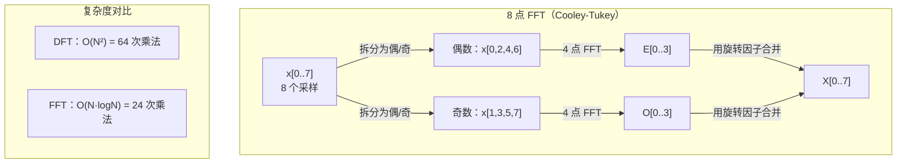
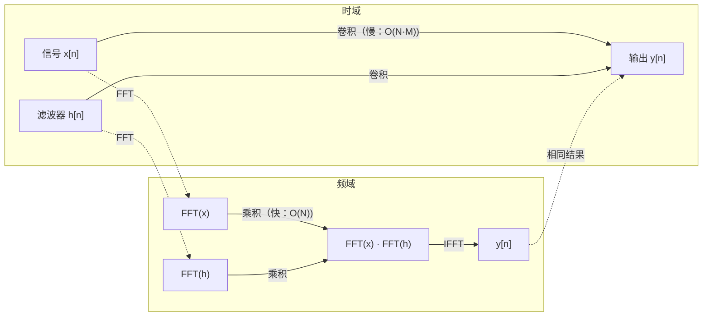

# 傅里叶变换

> 每个信号都是一组正弦波的叠加。傅里叶变换告诉你：是哪一组。

**类型：** 实现课
**语言：** Python
**前置知识：** 第 01 阶段 · 01-04（线性代数/复数）、第 19 节（复数运算）
**预计时间：** ~90 分钟
**所处阶段：** Tier 1
**关联课程：** 第 07 节 · 03（位置编码）— 正弦位置编码直接来源于傅里叶频率分解

---

## 🎯 学习目标

完成本课后，你能够：

- [ ] 从零实现 DFT 算法，并验证其与 Cooley-Tukey FFT 结果一致
- [ ] 解释频率系数的物理含义：从振幅谱和功率谱中提取信号的主要频率成分
- [ ] 应用卷积定理，通过 FFT 乘法实现快速卷积
- [ ] 将傅里叶频率分解思想与 Transformer 位置编码、CNN 卷积层联系起来
- [ ] 识别并避免频谱泄漏、混叠、零填充误区等常见陷阱

---

## 1. 问题

一段音频录音是一连串随时间变化的气压测量值。一只股票的价格是随日期变化的数值序列。一张图像是随空间变化的像素亮度网格。它们在时域（或空域）中呈现 —— 你看到的是数值随某个下标起伏。

但许多模式在时域中是不可见的。这段音频是纯音还是和弦？这只股票价格是否存在周期性波动？这张图像是否有重复纹理？这些问题的本质是关于**频率成分**的，而时域恰恰把它藏了起来。

傅里叶变换把数据从时域转换到频域。它把一个信号分解为不同频率的正弦波，每个正弦波携带**振幅**（有多强）和**相位**（从哪里开始）。傅里叶变换同时告诉你这两者。

这对机器学习为什么重要？因为频域思维无处不在。

- **卷积神经网络**执行卷积，而卷积在频域中就是乘法。
- **Transformer 位置编码**用频率分解来表示位置信息。
- **音频模型**（语音识别、音乐生成）在频谱图 —— 声音的频率表示 —— 上工作。
- **时间序列模型**寻找周期性模式。

理解了傅里叶变换，你就拥有了在所有这些领域工作的语言。

---

## 2. 概念

### 2.1 直觉理解

想象你在听一个交响乐团。你在空气中感受到的是一个复杂的压力波动 —— 看起来毫无规律。但你的大脑能做一件神奇的事：它能把"小提琴"和"长笛"分开。它们的音色不同，因为它们以不同的频率振动。

傅里叶变换就是数学上的"听觉"。它接收一个复杂信号，告诉你其中包含哪些频率，以及每个频率有多强。

```
时域视角：
  信号 ──→ 一个看起来很乱的波形

频域视角：
  信号 ──→ 3 Hz (强) + 7 Hz (中) + 15 Hz (弱)
```

就像一个鸡尾酒配方：最终的味道（时域信号）是几种基酒（不同频率的正弦波）按特定比例（振幅）和时机（相位）混合的结果。傅里叶变换就是那个"逆向工程"出配方的工具。

### 2.2 形式化定义：DFT

给定 N 个采样点 x[0], x[1], ..., x[N-1]，**离散傅里叶变换（DFT）** 产生 N 个频率系数 X[0], X[1], ..., X[N-1]：

$$
X[k] = \sum_{n=0}^{N-1} x[n] \cdot e^{-2\pi i \cdot k n / N}, \quad k = 0, 1, \ldots, N-1
$$

每个 X[k] 是一个复数。它的**模（magnitude）** |X[k]| 告诉你频率 k 的振幅，它的**辐角（phase）** angle(X[k]) 告诉你该频率的相位偏移。

**关键洞察：** $e^{-2\pi i \cdot k n / N}$ 是一个频率为 k 的**旋转子（phasor）**。DFT 计算信号与 N 个等间距频率之间的相关性。如果信号在频率 k 处有能量，相关性就很大；否则接近零。

### 2.3 每个系数的含义

```
DFT 输出的结构（N = 8 为例）：

X[0]     X[1]  X[2]  X[3]  X[4]  X[5]  X[6]  X[7]
 │        └──── 正频率 ────┘  │  └──── 负频率（镜像）────┘
 │                            │
直流分量                   奈奎斯特频率
（均值 × N）            （可表示的最高频率）
```

- **X[0]：直流分量。** 所有采样点的总和，正比于信号的均值。它代表零频（恒定）偏移。

- **X[k]（1 ≤ k ≤ N/2）：正频率。** X[k] 代表每 N 个采样点完成 k 个周期的频率。k 越大，频率越高。

- **X[N/2]：奈奎斯特频率。** 用 N 个采样点能表示的最高频率。超过这个值就会出现**混叠** —— 高频伪装成低频。

- **X[k]（N/2 < k < N）：负频率。** 对于实值信号，有 X[N-k] = conj(X[k])。负频率是正频率的镜像。因此有用的信息集中在前 N/2 + 1 个系数中。

### 2.4 逆 DFT

逆 DFT 从频率系数重建原始信号：

$$
x[n] = \frac{1}{N} \sum_{k=0}^{N-1} X[k] \cdot e^{2\pi i \cdot k n / N}, \quad n = 0, 1, \ldots, N-1
$$

与正变换的唯一区别：指数符号为正（而非负），以及 1/N 归一化因子。

逆 DFT 是**完美重建**。没有任何信息损失。你可以从时域到频域再回到时域，不产生任何误差。DFT 本质上是一个**基变换** —— 在另一个坐标系中重新表达相同的信息。

### 2.5 FFT：让计算变快

上面定义的 DFT 是 O(N²)：对 N 个输出系数中的每一个，都要对 N 个输入采样求和。当 N = 100 万时，需要 10¹² 次运算。

**快速傅里叶变换（FFT）** 以 O(N log N) 计算相同结果。当 N = 100 万时，仅需约 2000 万次运算。这正是频率分析变得实用的原因。

**Cooley-Tukey 算法**（最常用的 FFT）采用分治策略：

1. 将信号拆分为偶数下标和奇数下标采样。
2. 递归计算每半部分的 DFT。
3. 用**旋转因子（twiddle factors）** $e^{-2\pi i k / N}$ 合并两个半长 DFT。

$$
\begin{aligned}
X[k] &= E[k] + e^{-2\pi i k / N} \cdot O[k], \quad k = 0, \ldots, N/2 - 1 \\
X[k + N/2] &= E[k] - e^{-2\pi i k / N} \cdot O[k], \quad k = 0, \ldots, N/2 - 1
\end{aligned}
$$

其中 E 是偶数下标采样的 DFT，O 是奇数下标采样的 DFT。



FFT 要求信号长度为 2 的幂。实际应用中，信号会被零填充到最近的 2 的幂。

### 2.6 频谱分析

**功率谱** 是 |X[k]|² —— 每个频率系数的模的平方。它显示每个频率上有多少能量。

**相位谱** 是 angle(X[k]) —— 每个频率的相位偏移。对于大多数分析任务，你关注功率谱而忽略相位。

```
频率 bin k 处的功率：  P[k] = |X[k]|² = X[k].real² + X[k].imag²
频率 bin k 处的相位：  φ[k] = atan2(X[k].imag, X[k].real)
```

### 2.7 频率分辨率

DFT 的频率分辨率取决于采样点数 N 和采样率 fs。

$$
\text{bin } k \text{ 对应的频率：} f_k = k \cdot \frac{f_s}{N}
$$

$$
\text{频率分辨率：} \Delta f = \frac{f_s}{N}
$$

$$
\text{最大可表示频率：} f_{\max} = \frac{f_s}{2} \text{（奈奎斯特频率）}
```

要分辨两个相近的频率，需要更多的采样点。要捕获高频，需要更高的采样率。

### 2.8 卷积定理

这是信号处理中最重要的结果之一，也与 CNN 直接相关。

**时域中的卷积等于频域中的逐点乘积。**

$$
x * h = \text{IFFT}(\text{FFT}(x) \cdot \text{FFT}(h))
$$

其中 * 是卷积，· 是逐点乘积。



**为什么这很重要：**

- 直接卷积两个长度分别为 N 和 M 的信号需要 O(N·M) 次运算。
- 基于 FFT 的卷积需要 O(N log N) 次运算：变换两个信号、相乘、逆变换。
- 对于大卷积核，FFT 卷积显著更快。
- 这正是大感受野卷积层中发生的事。

注意：DFT 自然计算的是**圆周卷积**（信号会回绕）。对于**线性卷积**（不回绕），需要先将两个信号零填充到长度 N + M - 1。

### 2.9 窗函数

DFT 假设信号是周期性的 —— 它把 N 个采样点视为一个无限重复信号的一个周期。如果信号首尾值不同，边界处会产生不连续，表现为虚假的高频成分。这称为**频谱泄漏**。

窗函数通过将信号两端逐渐衰减到零来减少泄漏。

| 窗函数 | 形状 | 主瓣宽度 | 旁瓣电平 | 适用场景 |
|---|---|---|---|---|
| 矩形（无窗） | 平坦 | 最窄 | 最高（-13 dB） | 信号恰好是 N 点周期的整数倍 |
| 汉宁窗 | 升余弦 | 中等 | 低（-31 dB） | 通用频谱分析 |
| 海明窗 | 修正余弦 | 中等 | 更低（-42 dB） | 音频处理、语音分析 |
| 布莱克曼窗 | 三重余弦 | 宽 | 极低（-58 dB） | 旁瓣抑制最关键时 |

$$
\text{汉宁窗：} w[n] = 0.5 \cdot \left(1 - \cos\left(\frac{2\pi n}{N-1}\right)\right)
$$

$$
\text{海明窗：} w[n] = 0.54 - 0.46 \cdot \cos\left(\frac{2\pi n}{N-1}\right)
$$

应用窗函数的方法：在 DFT 之前逐元素乘以信号：`X = DFT(x · w)`。

### 2.10 DFT 的重要性质

| 性质 | 时域 | 频域 |
|---|---|---|
| 线性性 | a·x + b·y | a·X + b·Y |
| 时移 | x[n - k] | X[f] · e^(-2πi·f·k/N) |
| 频移 | x[n] · e^(2πi·f₀·n/N) | X[f - f₀] |
| 卷积 | x * h | X · H（逐点乘） |
| 乘积 | x · h（逐点） | X * H（圆周卷积，缩放 1/N） |
| 帕塞瓦尔定理 | Σ\|x[n]\|² | (1/N) · Σ\|X[k]\|² |
| 共轭对称（实输入） | x[n] 为实数 | X[k] = conj(X[N-k]) |

帕塞瓦尔定理表明：总能量在两个域中相同。能量在变换中守恒。

### 2.11 与位置编码的联系

原始 Transformer 使用正弦位置编码：

$$
\begin{aligned}
PE(pos, 2i) &= \sin\left(\frac{pos}{10000^{2i/d_{\text{model}}}}\right) \\
PE(pos, 2i+1) &= \cos\left(\frac{pos}{10000^{2i/d_{\text{model}}}}\right)
\end{aligned}
$$

每一对维度 (2i, 2i+1) 以不同频率振荡。频率从高（维度 0,1）到低（最后维度）按几何级数排列。这给每个位置一个跨所有频带的独特模式 —— 类似于傅里叶系数唯一标识一个信号。

关键性质：

- **唯一性：** 没有两个位置具有相同的编码。
- **有界值：** sin 和 cos 始终在 [-1, 1] 内。
- **相对位置：** 位置 p+k 的编码可以表示为位置 p 编码的线性函数。模型可以学习关注相对位置。

### 2.12 与 CNN 的联系

卷积层通过滑动一个学习到的滤波器（卷积核）来对输入进行卷积。数学上，这就是卷积运算。

根据卷积定理，这等价于：

1. 对输入做 FFT
2. 对卷积核做 FFT
3. 在频域中相乘
4. 对结果做 IFFT

标准 CNN 实现使用直接卷积（对小 3×3 卷积核更快）。但对于大卷积核或全局卷积，基于 FFT 的方法显著更快。一些架构（如 FNet）完全用 FFT 替代注意力，以 O(N log N) 复杂度达到与 O(N²) 注意力相当的精度。

---

## 3. 从零实现

### 第 1 步：复数类

DFT 的系数是复数。为了从零演示原理，我们手写一个极简复数类，而不是直接用 Python 内置的 `complex`。这样每一步运算都清晰可见。

```python
class Complex:
    """极简复数类，支持加减乘和共轭操作。"""

    def __init__(self, real=0.0, imag=0.0):
        self.real = float(real)
        self.imag = float(imag)

    def __add__(self, other):
        if isinstance(other, (int, float)):
            return Complex(self.real + other, self.imag)
        return Complex(self.real + other.real, self.imag + other.imag)

    def __mul__(self, other):
        if isinstance(other, (int, float)):
            return Complex(self.real * other, self.imag * other)
        # (a+bi)(c+di) = (ac-bd) + (ad+bc)i
        r = self.real * other.real - self.imag * other.imag
        i = self.real * other.imag + self.imag * other.real
        return Complex(r, i)

    def magnitude(self):
        """复数的模 |X[k]|，表示该频率分量的振幅。"""
        return math.sqrt(self.real ** 2 + self.imag ** 2)

    def conjugate(self):
        """复共轭。用于 IFFT：取共轭 → FFT → 再取共轭并除以 N。"""
        return Complex(self.real, -self.imag)
```

### 第 2 步：DFT — O(N²)

核心思想：对每一个频率 k，计算信号与频率 k 的复指数之间的相关性。

```python
def dft(x):
    """离散傅里叶变换。输入长度为 N 的信号，输出 N 个复数系数。"""
    N = len(x)
    result = []
    for k in range(N):
        total = Complex(0, 0)
        for n in range(N):
            angle = -2 * math.pi * k * n / N
            xn = x[n] if isinstance(x[n], Complex) else Complex(x[n])
            total = total + xn * euler(angle)
        result.append(total)
    return result
```

```python
def idft(X):
    """逆离散傅里叶变换。与 DFT 的唯一区别：指数符号为正，结果除以 N。"""
    N = len(X)
    result = []
    for n in range(N):
        total = Complex(0, 0)
        for k in range(N):
            angle = 2 * math.pi * k * n / N
            xk = X[k] if isinstance(X[k], Complex) else Complex(X[k])
            total = total + xk * euler(angle)
        result.append(Complex(total.real / N, total.imag / N))
    return result
```

### 第 3 步：FFT — O(N log N)

Cooley-Tukey 算法：将信号拆分为偶数下标和奇数下标两部分，递归计算各自的 DFT，再用旋转因子合并。

```python
def fft(x):
    """快速傅里叶变换。要求输入长度为 2 的幂，否则退化为 DFT。"""
    N = len(x)
    if N <= 1:
        return [x[0] if isinstance(x[0], Complex) else Complex(x[0])]
    if N % 2 != 0:
        return dft(x)

    # 分治：偶数下标和奇数下标
    even = fft([x[i] for i in range(0, N, 2)])
    odd = fft([x[i] for i in range(1, N, 2)])

    result = [Complex(0)] * N
    for k in range(N // 2):
        angle = -2 * math.pi * k / N
        twiddle = euler(angle)
        t = twiddle * odd[k]
        # 蝴蝶运算：合并两半的结果
        result[k] = even[k] + t
        result[k + N // 2] = even[k] - t
    return result
```

### 第 4 步：频谱分析辅助函数

```python
def power_spectrum(X):
    """功率谱 |X[k]|²，表示每个频率上的能量。"""
    return [xk.real ** 2 + xk.imag ** 2 for xk in X]

def magnitude_spectrum(X):
    """振幅谱 |X[k]|，表示每个频率分量的振幅。"""
    return [xk.magnitude() for xk in X]

def spectral_analysis(signal, sample_rate):
    """对信号进行频谱分析，返回正频率对应的频率值和振幅。"""
    N = len(signal)
    X = fft(signal)
    magnitudes = magnitude_spectrum(X)
    freqs = [k * sample_rate / N for k in range(N)]
    # 实信号只需前半部分（后半部分是镜像）
    return freqs[:N // 2 + 1], magnitudes[:N // 2 + 1]
```

### 第 5 步：卷积定理

```python
def convolve_fft(x, h):
    """基于 FFT 的卷积 — O(N log N)。利用卷积定理：时域卷积 = 频域乘积。"""
    N = len(x) + len(h) - 1
    # 零填充到 2 的幂，以便 FFT 高效计算
    padded_N = 1
    while padded_N < N:
        padded_N *= 2

    x_padded = list(x) + [0.0] * (padded_N - len(x))
    h_padded = list(h) + [0.0] * (padded_N - len(h))

    X = fft(x_padded)
    H = fft(h_padded)

    # 频域逐点相乘
    Y = [xk * hk for xk, hk in zip(X, H)]

    y = ifft(Y)
    return [y[n].real for n in range(N)]
```

### 第 6 步：窗函数

```python
def hann_window(N):
    """汉宁窗：两端渐变为零，用于通用频谱分析。"""
    return [0.5 * (1 - math.cos(2 * math.pi * n / (N - 1))) for n in range(N)]

def hamming_window(N):
    """海明窗：比汉宁窗更好地抑制旁瓣，用于音频处理。"""
    return [0.54 - 0.46 * math.cos(2 * math.pi * n / (N - 1)) for n in range(N)]

def apply_window(signal, window):
    """将窗函数逐元素乘以信号。"""
    return [s * w for s, w in zip(signal, window)]
```

运行 `code/main.py` 可看到 9 个演示的完整输出，涵盖单频信号、多频信号、FFT vs DFT 对比、完美重构、卷积定理、窗函数效果、帕塞瓦尔定理、位置编码频率结构、复杂度增长曲线。

---

## 4. 工业工具

实际工程中，使用 NumPy 和 SciPy 提供的高度优化 FFT 实现。

### 4.1 NumPy FFT

```python
import numpy as np

# 生成一个 5 Hz 的正弦信号
sample_rate = 256
N = 256
t = np.arange(N) / sample_rate
signal = np.sin(2 * np.pi * 5 * t)

# 计算 FFT
spectrum = np.fft.fft(signal)
freqs = np.fft.fftfreq(N, d=1/sample_rate)

# 功率谱（只取正频率部分）
power = np.abs(spectrum) ** 2
positive_freqs = freqs[:N // 2]
positive_power = power[:N // 2]

# 找到主导频率
peak_bin = np.argmax(positive_power)
peak_freq = positive_freqs[peak_bin]
print(f"主导频率: {peak_freq:.1f} Hz")  # 主导频率: 5.0 Hz
```

### 4.2 SciPy 窗函数与 STFT

```python
from scipy.signal import windows, stft

# 加窗
window = windows.hann(256)
windowed = signal * window
spectrum = np.fft.fft(windowed)

# 短时傅里叶变换（STFT）—— 用于生成频谱图
frequencies, times, Zxx = stft(signal, fs=sample_rate, nperseg=256)
spectrogram = np.abs(Zxx) ** 2
print(f"频谱图形状: {spectrogram.shape}")  # (频率 bins, 时间帧)
```

### 4.3 基于 FFT 的快速卷积

```python
from scipy.signal import fftconvolve

# 比直接卷积快得多，尤其对大卷积核
result = fftconvolve(signal, kernel, mode='full')
```

### 4.4 性能对比

| 实现方式 | 速度 | 内存 | 适用场景 |
|---|---|---|---|
| 我们的 NumPy 版 DFT | 慢（O(N²)） | 低 | 学习理解 |
| NumPy FFT | 快（C 实现） | 中 | 通用计算 |
| SciPy FFT | 快（FFTW 后端） | 中 | 科学计算 |
| PyTorch FFT | 快（GPU 加速） | 中 | 深度学习流水线 |
| cuFFT（NVIDIA） | 极快（GPU） | 高 | 大规模信号处理 |

---

## 5. 知识连线

本课学习的傅里叶变换，是后续多个阶段的核心数学工具：

- **阶段 03（深度学习核心）**：卷积神经网络中的卷积层本质上就是卷积运算，而卷积定理让我们可以在频域中高效计算它。理解 FFT 能帮你理解为什么大卷积核的 FFT 卷积更快。

- **阶段 07（Transformer 深入）**：Transformer 的正弦位置编码直接来源于傅里叶频率分解 —— 每个位置被赋予一个独特的"频谱指纹"。RoPE（旋转位置嵌入）也可以理解为在频域中对位置信息进行旋转。

- **阶段 06（语音与音频）**：语音识别模型（如 Whisper）的输入是梅尔频谱图 —— 通过 STFT 从音频波形转换而来。傅里叶变换是音频机器学习的基石。

---

## 6. 工程最佳实践

### 6.1 工业界常用方案

| 场景 | 推荐方案 | 备注 |
|---|---|---|
| 学习/实验 | NumPy `np.fft.fft` | 开箱即用 |
| 通用信号处理 | SciPy `scipy.signal` | 含窗函数、STFT、滤波器设计 |
| 深度学习流水线 | PyTorch `torch.fft` | GPU 加速，与 autograd 兼容 |
| 大规模实时处理 | NVIDIA cuFFT | GPU 上的高性能 FFT |
| 音频 ML 预处理 | librosa | 专为音频设计的频谱图计算 |

### 6.2 中文场景特别建议

- 中文语音处理时，采样率通常为 16 kHz（语音识别）或 44.1 kHz（音频分析）。确保采样率设置正确，否则频率轴标注会出错。
- 处理中文文本的"频率"分析（如词频周期检测）时，注意文本不是均匀采样信号，需要先转换为数值序列再做 FFT。
- 使用 `librosa.stft` 生成梅尔频谱图时，`n_fft` 通常设为 1024 或 2048，`hop_length` 设为 `n_fft // 4`（75% 重叠）。

### 6.3 踩坑经验

- **忘记去除直流分量**：信号均值（X[0]）过大会掩盖附近的低频内容。FFT 前先减去均值：`signal = signal - np.mean(signal)`。
- **频率轴标注错误**：`np.fft.fftfreq` 返回的是归一化频率，需要乘以采样率才能得到 Hz。
- **圆周卷积 vs 线性卷积混淆**：直接用 `fft` 做卷积会得到圆周卷积。需要线性卷积时，先将两个信号零填充到 `len(x) + len(h) - 1`。
- **频谱泄漏未处理**：信号频率不在整数 bin 上时，能量会泄漏到相邻 bin。使用汉宁窗或海明窗缓解。
- **零填充误区**：零填充让频谱看起来更平滑，但不提高实际频率分辨率。真正的分辨率取决于观测时长 T = N / fs。

---

## 7. 常见错误

### 错误 1：频率轴标注错误

**现象：** FFT 分析后，峰值频率与预期不符，差了一个倍数。

**原因：** 使用 `np.fft.fftfreq(N)` 时忘记乘以采样率。`fftfreq` 默认返回归一化频率（周期/采样），范围 [-0.5, 0.5]。

**修复：**

```python
# ❌ 错误写法
freqs = np.fft.fftfreq(N)  # 这是归一化频率，不是 Hz

# ✓ 正确写法
freqs = np.fft.fftfreq(N, d=1/sample_rate)  # d 是采样间隔，单位秒
```

### 错误 2：圆周卷积与线性卷积混淆

**现象：** 用 FFT 做卷积后，结果两端出现"回绕"伪影。

**原因：** DFT 自然计算圆周卷积（信号首尾相连）。如果直接对原始长度信号做 FFT → 乘积 → IFFT，得到的是圆周卷积而非线性卷积。

**修复：**

```python
# ❌ 错误写法（得到圆周卷积）
Y = fft(x) * fft(h)
y = ifft(Y)

# ✓ 正确写法（零填充后得到线性卷积）
N = len(x) + len(h) - 1
x_padded = np.pad(x, (0, N - len(x)))
h_padded = np.pad(h, (0, N - len(h)))
Y = fft(x_padded) * fft(h_padded)
y = np.real(ifft(Y))
```

### 错误 3：忽略频谱泄漏

**现象：** 单频信号的 FFT 结果在多个频率 bin 上都有显著能量，而不是集中在一个 bin。

**原因：** 信号频率不是频率分辨率的整数倍（即窗口内不是整数个周期），导致边界不连续，能量泄漏到相邻 bin。

**修复：**

```python
# ❌ 错误写法（直接 FFT）
spectrum = np.fft.fft(signal)

# ✓ 正确写法（加窗后 FFT）
window = np.hanning(len(signal))
spectrum = np.fft.fft(signal * window)
```

### 错误 4：零填充提高分辨率

**现象：** 对信号零填充到 16K 点后做 FFT，以为能分辨更接近的两个频率。

**原因：** 零填充只增加频率 bin 的密度（更平滑的频谱插值），但不增加任何新信息。真正的频率分辨率取决于观测时长 T = N_original / fs。

**修复：**

```python
# ❌ 错误认知
# "零填充到 16384 点，分辨率就提高了"

# ✓ 正确认知
# 要分辨间隔 1 Hz 的信号，需要至少 T = 1/1 = 1 秒的观测时间
# 零填充不能替代更长的实际观测
```

### 错误 5：忘记处理负频率

**现象：** 对实信号做 FFT 后，绘制完整频谱时出现对称的"双峰"，误以为有两个频率成分。

**原因：** 实信号的 DFT 具有共轭对称性：X[k] = conj(X[N-k])。后半部分系数是前半部分的镜像（负频率），包含冗余信息。

**修复：**

```python
# ❌ 错误写法（绘制全部 N 个 bin）
plt.plot(freqs, np.abs(spectrum))

# ✓ 正确写法（只绘制前半部分正频率）
N = len(spectrum)
plt.plot(freqs[:N//2], np.abs(spectrum[:N//2]))
```

---

## 8. 面试考点

### Q1：DFT 和 FFT 的区别是什么？（难度：⭐⭐）

**参考答案：**

DFT 是直接按定义计算傅里叶变换，复杂度 O(N²)。FFT 是计算 DFT 的一种快速算法，复杂度 O(N log N)。FFT 不改变 DFT 的结果，只是用分治策略（Cooley-Tukey）减少了重复计算。当 N = 100 万时，DFT 需要 10¹² 次运算，FFT 仅需约 2×10⁷ 次，加速约 500 倍。

### Q2：卷积定理是什么？为什么它对 CNN 很重要？（难度：⭐⭐）

**参考答案：**

卷积定理指出：时域中的卷积等于频域中的逐点乘积，即 x * h = IFFT(FFT(x) · FFT(h))。对 CNN 的重要性在于：直接卷积的复杂度是 O(N·M)，而 FFT 卷积是 O(N log N)。对于大卷积核或全局卷积，FFT 方法显著更快。此外，一些架构（如 FNet）完全用 FFT 替代自注意力，以 O(N log N) 复杂度达到与 O(N²) 注意力相当的性能。

### Q3：什么是频谱泄漏？如何减少它？（难度：⭐⭐）

**参考答案：**

频谱泄漏是指：当信号在分析窗口内不是整数个周期时，DFT 假设信号周期性延拓会在边界产生不连续，导致能量从真实频率"泄漏"到相邻频率 bin。减少泄漏的方法是使用窗函数（汉宁窗、海明窗、布莱克曼窗），将信号两端逐渐衰减到零，消除边界不连续。代价是主瓣变宽（频率分辨率略微下降），但旁瓣被显著抑制。

### Q4：零填充能提高频率分辨率吗？为什么？（难度：⭐⭐⭐）

**参考答案：**

不能。零填充在时域添加零值采样，在频域的效果是在现有频率 bin 之间插值（sinc 插值），让频谱看起来更平滑。但它不增加任何新信息，因此不能分辨比 1/T Hz 更接近的两个频率（T 是实际观测时长）。真正的频率分辨率只取决于 T = N_original / fs。要分辨更接近的频率，必须采集更长时间的实际数据。

### Q5：Transformer 的正弦位置编码与傅里叶变换有什么关系？（难度：⭐⭐⭐）

**参考答案：**

Transformer 的位置编码使用不同频率的正弦和余弦函数对位置进行编码。每一对维度 (2i, 2i+1) 对应一个频率，频率从高到低按几何级数排列。这与傅里叶变换的思想相同：用一组不同频率的振荡函数来"标识"一个位置/信号。高频维度变化快（精细分辨率），低频维度变化慢（粗分辨率），组合起来给每个位置一个独特的"频谱指纹"。这使得模型可以通过注意力机制学习相对位置关系。

---

## 🔑 关键术语

| 术语 | 人们怎么说 | 实际含义 |
|---|---|---|
| DFT（离散傅里叶变换） | "把信号变成频率" | 将 N 个时域采样转换为 N 个频域系数，每个系数是信号与一个复指数的相关性 |
| FFT（快速傅里叶变换） | "更快的 DFT" | 以 O(N log N) 计算 DFT 的算法，Cooley-Tukey 通过递归拆分偶/奇下标实现 |
| 频率 bin | "第 k 个频率" | DFT 输出中的第 k 个位置，对应实际频率 k·fs/N Hz |
| 直流分量 | "信号的均值" | X[0]，零频系数，等于所有采样点的总和（均值 × N） |
| 奈奎斯特频率 | "最高频率" | fs/2，采样率 fs 下能表示的最高频率，超过此值会发生混叠 |
| 功率谱 | "频谱的平方" | \|X[k]\|²，每个频率上的能量分布 |
| 频谱泄漏 | "频率散开了" | 非整数周期截断导致能量扩散到相邻频率 bin，可通过加窗缓解 |
| 窗函数 | "让信号变平滑" | 两端渐变为零的函数（汉宁、海明、布莱克曼），用于减少频谱泄漏 |
| 旋转因子 | "那个 e 的幂次" | e^(-2πi·k/N)，FFT 蝴蝶运算中用于合并两个半长 DFT 的复指数 |
| 卷积定理 | "卷积变乘法" | 时域卷积 = 频域逐点乘积，是 FFT 卷积和 CNN 频域分析的基础 |
| 圆周卷积 | "首尾相连的卷积" | DFT 自然计算的卷积，信号会回绕；需要线性卷积时先零填充 |
| 帕塞瓦尔定理 | "能量守恒" | 总能量在时域和频域相等：Σ\|x[n]\|² = (1/N)·Σ\|X[k]\|² |
| 混叠 | "高频变低频" | 超过奈奎斯特频率的信号会伪装成低频，无法从采样中恢复 |

---

## 📚 小结

傅里叶变换将信号从时域转换到频域，揭示了信号中隐藏的频率结构。你从零实现了 DFT 和 Cooley-Tukey FFT，验证了卷积定理，并将这些概念与 Transformer 位置编码和 CNN 卷积层联系起来。

下一课我们将学习小波变换 —— 一种在时域和频域同时提供局部化的工具，弥补了傅里叶变换在时间定位上的不足。

---

## ✏️ 练习

1. 【理解】用自己的话解释 DFT 的物理含义。为什么 DFT 的每个系数 X[k] 是一个复数？复数的模和辐角分别代表什么？写 200 字以内的说明。

2. 【实现】修改 `convolve_fft` 函数，使其支持 batch 维度 —— 输入形状从 `(N,)` 变为 `(batch, N)`。对每个 batch 独立计算卷积。

3. 【实验】生成一个包含 10 Hz 和 10.5 Hz 两个相近频率的信号（采样率 256 Hz，持续 1 秒）。分别用无窗、汉宁窗、海明窗计算功率谱。哪个窗函数最能区分这两个峰值？为什么？

4. 【思考】FNet 论文用 FFT 完全替代了 Transformer 中的自注意力机制。查阅论文摘要，解释为什么 FFT 可以替代注意力，以及这种替代的优缺点是什么。

5. 【证明】证明帕塞瓦尔定理：对于任意长度为 N 的信号，Σ\|x[n]\|² = (1/N)·Σ\|X[k]\|²。提示：利用 DFT 的正交性。

---

## 🚀 产出

本课产出以下可复用内容：

| 产出 | 文件 | 说明 |
|---|---|---|
| 傅里叶变换完整实现 | `code/main.py` | 从零实现 DFT、FFT、IFFT、卷积定理、窗函数、位置编码 |
| 可复用提示词 | `outputs/prompt-fourier-transform-tutor.md` | 频谱分析引导提示词，可复用为 AI 助手工具 |

---

## 📖 参考资料

1. [论文] Cooley, Tukey. "An Algorithm for the Machine Calculation of Complex Fourier Series". Mathematics of Computation, 1965. https://www.ams.org/journals/mcom/1965-19-090/S0025-5718-1965-0178586-1/

2. [论文] Vaswani et al. "Attention Is All You Need". NeurIPS, 2017. https://arxiv.org/abs/1706.03762

3. [论文] Lee-Thorp et al. "FNet: Mixing Tokens with Fourier Transforms". NAACL, 2021. https://arxiv.org/abs/2105.03824

4. [官方文档] NumPy FFT: https://numpy.org/doc/stable/reference/routines.fft.html

5. [官方文档] SciPy Signal Processing: https://docs.scipy.org/doc/scipy/reference/signal.html

6. [书籍] Smith. "The Scientist and Engineer's Guide to Digital Signal Processing". 1997. http://www.dspguide.com/

---

> 本课程参考了 AI Engineering From Scratch（MIT License）的课程体系，在此基础上进行了重构和原创内容的扩充。所有中文表达、案例、LLM 视角分析、工程最佳实践、常见错误、面试考点等均为原创内容。
