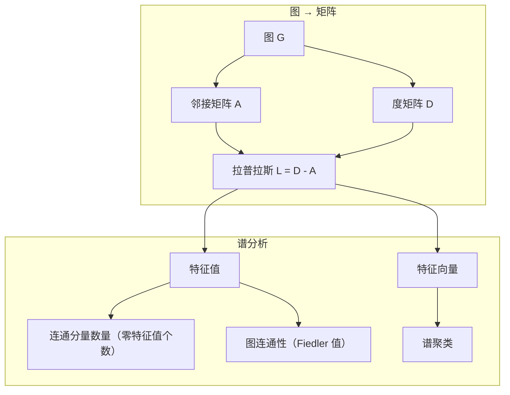
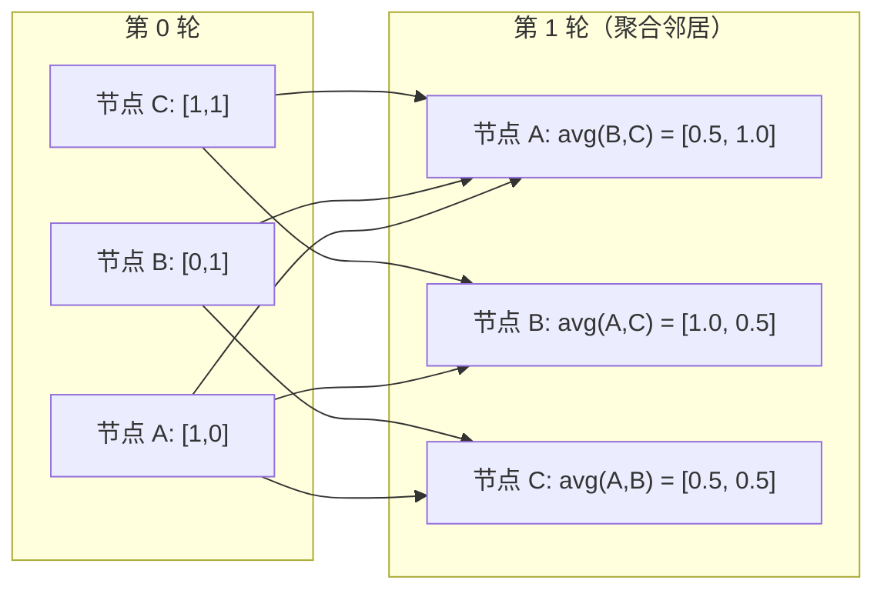

# 图论

> 关系就是数据。如果你的数据有连接，你就离不开图论。

**类型：** 实现课
**语言：** Python
**前置知识：** 阶段 01 · 01-03（线性代数、向量矩阵运算）
**预计时间：** ~90 分钟
**所处阶段：** Tier 1
**关联课程：** 阶段 03 · 02（神经网络基础）— 图神经网络的消息传递与神经网络的前向传播原理相同

## 🎯 学习目标

完成本课后，你能够：

- [ ] 从零实现图的邻接矩阵和邻接表表示，写出 BFS 与 DFS 遍历算法
- [ ] 计算图的拉普拉斯矩阵，通过其特征值检测连通分量数量
- [ ] 实现谱聚类算法，利用 Fiedler 向量对图节点进行无监督分组
- [ ] 实现一轮 GNN 消息传递，理解图卷积的矩阵形式含义
- [ ] 用 PageRank 和 Dijkstra 分析节点重要性和最短路径

## 1. 问题

社交网络、分子结构、知识图谱、论文引用网络、城市路网——它们都是图。传统机器学习把数据当作扁平的表格处理：每行是一个独立样本，每列是一个特征。但**当连接本身携带信号时，这种方法就失效了**。

考虑一个电商推荐场景。用户的购买历史很重要，但她的好友购买历史更重要——尤其是那些"她信任但还没买过"的商品。这种关系的结构蕴含了巨大的预测价值。

再看分子性质预测。你想判断一种分子能否与特定蛋白质结合。原子类型是基础信息，但真正决定性质的是原子之间的键合方式——即分子的拓扑结构。结构本身就是数据。

图神经网络（GNN）是当前深度学习中增长最快的方向之一，驱动着药物发现、社交推荐、欺诈检测和知识图谱推理等应用。而所有 GNN 都建立在同一个基础上：基本图论。

做好这件事，你需要掌握四个核心工具：

1. **矩阵表示**——将图转换为矩阵，从而可以用矩阵运算处理图
2. **遍历算法**——探索图的结构，寻找路径和连通性
3. **拉普拉斯矩阵**——谱图理论中最重要的矩阵，特征值揭示图的全局结构
4. **消息传递**——让信息在节点间传播：这是 GNN 工作的核心操作

## 2. 概念

### 2.1 图的基本结构

一个图 $G = (V, E)$ 由顶点（节点）集合 $V$ 和边集合 $E$ 构成。每条边连接两个节点。

**有向图 vs 无向图。** 在无向图中，边 $(u, v)$ 表示 $u$ 和 $v$ 互相连接。在有向图中，边 $(u, v)$ 只表示从 $u$ 指向 $v$，反方向不一定成立。

**加权图 vs 无权图。** 无权图的边要么存在要么不存在；加权图的每条边有一个数值权重——可以是距离、代价或关系强度。

| 图类型 | 示例 |
|---|---|
| 无向·无权 | 微信好友关系 |
| 有向·无权 | 微博关注关系 |
| 无向·加权 | 城市间距离（公路网） |
| 有向·加权 | 网页超链接（PageRank 分数） |

### 2.2 邻接矩阵

邻接矩阵 $A$ 是图的核心表示方式。对于 $n$ 个节点的图：

$$
A[i][j] = \begin{cases} w_{ij} & \text{若存在边 } i \to j \\ 0 & \text{否则} \end{cases}
$$

对于无向图，$A$ 是对称矩阵：$A[i][j] = A[j][i]$。对于无权图，非零元素为 1。

**示例——三角形图：**

```
节点: 0, 1, 2
边: (0,1), (1,2), (0,2)

A = [[0, 1, 1],
     [1, 0, 1],
     [1, 1, 0]]
```

邻接矩阵是每个 GNN 的输入。对 $A$ 的矩阵运算对应于对图的操作。

### 2.3 度与度矩阵

节点的**度（Degree）** 是连接到该节点的边的数量。对于有向图，分为入度（指向该节点的边）和出度（从该节点指出的边）。

**度矩阵 $D$** 是对角矩阵：

$$
D[i][j] = \begin{cases} \deg(v_i) & i = j \\ 0 & i \neq j \end{cases}
$$

节点 0 的度是 2（连接了节点 1 和 2），所以 $D[0][0] = 2$。

度反映了节点的重要性。高度节点就是"枢纽"。社交网络的度分布服从幂律（少数枢纽节点，大量叶子节点），而随机图的度服从泊松分布。

### 2.4 BFS 与 DFS

两种基本的图遍历算法，各有用途。

**广度优先搜索（BFS）：** 先访问所有邻居，再访问邻居的邻居。使用队列（FIFO）。

```
BFS 从节点 0 开始：
  访问 0
  队列: [1, 2]          （0 的邻居）
  访问 1
  队列: [2, 3]          （加入 1 的邻居）
  访问 2
  队列: [3]             （2 的邻居已访问）
  访问 3
  队列: []              （完成）
```

BFS 可以求**无权图的最短路径**——从起点到任意节点的距离等于该节点首次被发现时的 BFS 层级。这也是为什么社交网络中的"几度人脉"用 BFS 计算。

**深度优先搜索（DFS）：** 一条路走到底再回溯。使用栈（LIFO）或递归。

```
DFS 从节点 0 开始：
  访问 0
  栈: [1, 2]           （0 的邻居）
  访问 2                （栈顶弹出）
  栈: [1, 3]           （加入 2 的邻居）
  访问 3                （栈顶弹出）
  栈: [1]
  访问 1                （栈顶弹出）
  栈: []               （完成）
```

DFS 的典型应用：

- 寻找连通分量（从每个未访问节点启动 DFS）
- 环检测（DFS 树中的后向边）
- 拓扑排序（反转 DFS 完成顺序）

| 算法 | 数据结构 | 能找到什么 | 典型场景 |
|---|---|---|---|
| BFS | 队列 | 最短路径 | 社交距离、知识图谱遍历 |
| DFS | 栈 | 连通分量、环 | 连通性检测、拓扑排序 |

### 2.5 拉普拉斯矩阵

$L = D - A$。这是谱图理论中最重要的矩阵。

以三角形为例：

```
D = [[2, 0, 0],    A = [[0, 1, 1],    L = [[ 2, -1, -1],
     [0, 2, 0],         [1, 0, 1],         [-1,  2, -1],
     [0, 0, 2]]         [1, 1, 0]]         [-1, -1,  2]]
```

拉普拉斯矩阵有四个关键性质：

1. **$L$ 是半正定的。** 所有特征值 $\geq 0$。
2. **零特征值的个数等于连通分量的个数。** 连通图恰好有一个零特征值；有 3 个不相连部分的图有 3 个零特征值。
3. **最小的非零特征值（Fiedler 值）衡量连通性。** Fiedler 值越大，图连接得越好；Fiedler 值越小，说明图存在"瓶颈"。
4. **Fiedler 值对应的特征向量（Fiedler 向量）揭示最佳分割方式。** 正值节点归为一组，负值节点归为另一组——这就是谱聚类。



### 2.6 谱聚类

谱聚类利用拉普拉斯矩阵的特征向量进行无监督节点分组：

1. 计算拉普拉斯矩阵 $L$
2. 取 $L$ 的前 $k$ 个特征向量（跳过第一个，对连通图它是全 1 向量）
3. 将这 $k$ 个特征向量作为节点的新坐标
4. 对这些坐标运行 K-means 聚类

**为什么有效？** $L$ 的特征向量编码了图上"最平滑"的函数。连接紧密的节点得到相似的特征向量值，被瓶颈分隔的节点得到不同的值。特征向量自然地将簇分离开。

### 2.7 消息传递

图神经网络的核心操作。每个节点收集邻居的消息，聚合后更新自身状态：

$$
h_v^{(k+1)} = \sigma\left(W \cdot \text{AGGREGATE}\left(\{h_u^{(k)} : u \in \mathcal{N}(v)\}\right)\right)
$$

最简单的形式：AGGREGATE = 均值，UPDATE = 线性变换 + 激活函数：

$$
h_v^{(k+1)} = \sigma\left(W \cdot \text{mean}\left(\{h_u^{(k)} : u \in \mathcal{N}(v)\}\right)\right)
$$

这本质上是矩阵乘法。设 $H$ 为所有节点的特征矩阵，$A$ 为邻接矩阵：

$$
H^{(k+1)} = \sigma\left(A_{\text{norm}} \cdot H^{(k)} \cdot W\right)
$$

其中 $A_{\text{norm}}$ 是行归一化的邻接矩阵（每行和为 1）。

一轮消息传递让每个节点"看到"它的直接邻居。两轮让它看到邻居的邻居。$K$ 轮后，每个节点拥有其 $K$ 跳邻域的信息。



### 2.8 核心概念与 ML 应用对照

| 概念 | ML 应用 |
|---|---|
| 邻接矩阵 | GNN 输入表示 |
| 拉普拉斯矩阵 | 谱聚类、社区发现 |
| BFS/DFS | 知识图谱遍历、路径查找 |
| 度分布 | 节点重要性、特征工程 |
| 消息传递 | GNN 层（GCN、GAT、GraphSAGE） |
| 拉普拉斯特征值 | 社区检测、图分割 |
| 谱聚类 | 无监督节点分组 |
| PageRank | 节点重要性排序、网页搜索 |

## 3. 从零实现

### 第 1 步：图的类与基本表示

```python
class Graph:
    def __init__(self, n_nodes, directed=False):
        self.n = n_nodes
        self.directed = directed
        # 邻接表：adj[u][v] = weight
        self.adj = {i: {} for i in range(n_nodes)}

    def add_edge(self, u, v, weight=1.0):
        self.adj[u][v] = weight
        if not self.directed:
            self.adj[v][u] = weight

    def adjacency_matrix(self):
        """构造邻接矩阵（稠密，用于谱分析）。"""
        A = np.zeros((self.n, self.n))
        for u in range(self.n):
            for v, w in self.adj[u].items():
                A[u][v] = w
        return A

    def degree_matrix(self):
        """构造度矩阵 D（对角矩阵）。"""
        D = np.zeros((self.n, self.n))
        for i in range(self.n):
            D[i][i] = sum(self.adj[i].values())
        return D

    def laplacian(self):
        """拉普拉斯矩阵 L = D - A。"""
        return self.degree_matrix() - self.adjacency_matrix()
```

**为什么用邻接表存储？** 对于稀疏图（大多数真实图都是稀疏的），邻接表的内存是 $O(V + E)$，而邻接矩阵是 $O(V^2)$。但谱分析需要矩阵形式，所以提供转换方法。

### 第 2 步：BFS 与 DFS

```python
from collections import deque

def bfs(graph, start):
    """广度优先搜索——使用队列，逐层遍历。"""
    visited = set([start])
    order = []
    distances = {start: 0}
    queue = deque([(start, 0)])

    while queue:
        node, dist = queue.popleft()
        order.append(node)
        for neighbor in graph.neighbors(node):
            if neighbor not in visited:
                visited.add(neighbor)
                distances[neighbor] = dist + 1
                queue.append((neighbor, dist + 1))
    return order, distances

def dfs(graph, start):
    """深度优先搜索——使用栈，一条路走到底。"""
    visited = set()
    order = []
    stack = [start]

    while stack:
        node = stack.pop()
        if node in visited:
            continue
        visited.add(node)
        order.append(node)
        for neighbor in reversed(graph.neighbors(node)):
            if neighbor not in visited:
                stack.append(neighbor)
    return order
```

**为什么 BFS 能找到最短路径？** BFS 按距离起点的远近逐层扩展。第一次访问到某个节点时，必然是通过最短路径到达的——因为所有更短的路径都已经被探索过了。

### 第 3 步：连通分量与拉普拉斯特征值

```python
def connected_components(graph):
    """通过重复 BFS 找出所有连通分量。"""
    visited = set()
    components = []
    for node in range(graph.n):
        if node not in visited:
            order, _ = bfs(graph, node)
            visited.update(order)
            components.append(order)
    return components

def laplacian_eigenvalues(graph):
    """计算拉普拉斯矩阵的特征值。"""
    L = graph.laplacian()
    # eigvalsh 专用于对称矩阵，返回升序排列的特征值
    return np.linalg.eigvalsh(L)
```

**为什么零特征值个数等于连通分量数？** 每个连通分量对应一个全 1 的特征向量（在该分量内为 1，其余为 0），这些向量都是 $L$ 的零特征值对应的特征向量。不同分量的特征向量线性无关，所以零特征值的几何重数等于连通分量数。

### 第 4 步：谱聚类

```python
def spectral_clustering(graph, k=2):
    """谱聚类：利用拉普拉斯特征向量进行节点分组。"""
    L = graph.laplacian()
    eigenvalues, eigenvectors = np.linalg.eigh(L)

    if k == 2:
        # k=2 时直接用 Fiedler 向量的符号分割
        fiedler = eigenvectors[:, 1]
        labels = np.zeros(graph.n, dtype=int)
        labels[fiedler < 0] = 1
        return labels

    # k>2 时取前 k 个非平凡特征向量，运行 K-means
    features = eigenvectors[:, 1:k + 1]
    # 归一化：基于角度聚类而非距离
    norms = np.linalg.norm(features, axis=1, keepdims=True)
    norms[norms == 0] = 1
    features = features / norms
    # ... K-means 聚类 ...
```

**为什么跳过第一个特征向量？** 对连通图，第一个特征值是 0，对应的特征向量是全 1 向量（所有节点值相同），不包含任何分割信息。第二个特征向量（Fiedler 向量）才是"最平滑的非平凡函数"。

### 第 5 步：Dijkstra 最短路径

```python
import heapq

def dijkstra(graph, start):
    """Dijkstra 算法——加权图最短路径（非负权重）。"""
    INF = float('inf')
    distances = {i: INF for i in range(graph.n)}
    distances[start] = 0
    pq = [(0, start)]  # 优先队列：(距离, 节点)
    visited = set()

    while pq:
        dist, u = heapq.heappop(pq)
        if u in visited:
            continue
        visited.add(u)
        for v in graph.neighbors(u):
            weight = graph.adj[u][v]
            new_dist = dist + weight
            if new_dist < distances[v]:
                distances[v] = new_dist
                heapq.heappush(pq, (new_dist, v))
    return distances
```

**为什么用优先队列？** 每次选择当前距离最小的节点进行"松弛"操作，保证一旦节点被访问，其距离就是最终的最短距离。时间复杂度 $O((V + E) \log V)$。

### 第 6 步：GNN 消息传递

```python
def message_passing(graph, features, weight_matrix):
    """一轮 GNN 消息传递：聚合邻居特征 → 线性变换。"""
    A = graph.adjacency_matrix()
    # 行归一化：每个节点的邻居特征取均值
    row_sums = A.sum(axis=1, keepdims=True)
    row_sums[row_sums == 0] = 1  # 孤立节点避免除零
    A_norm = A / row_sums

    # 聚合邻居特征 → 线性变换
    aggregated = A_norm @ features
    output = aggregated @ weight_matrix
    return output
```

**为什么行归一化？** 如果不归一化，高度节点的特征会不断膨胀，低度节点的特征会被淹没。行归一化（每个节点取邻居均值）保证特征尺度一致。

### 第 7 步：PageRank

```python
def pagerank(graph, damping=0.85, max_iter=100, tol=1e-6):
    """PageRank：模拟随机冲浪者的稳态分布。"""
    n = graph.n
    scores = np.ones(n) / n

    for _ in range(max_iter):
        new_scores = np.ones(n) * (1 - damping) / n
        dangling_sum = 0.0

        for u in range(n):
            out_deg = graph.degree(u)
            if out_deg > 0:
                for v in graph.neighbors(u):
                    new_scores[v] += damping * scores[u] / out_deg
            else:
                dangling_sum += scores[u]  # 悬挂节点

        new_scores += damping * dangling_sum / n
        if np.abs(new_scores - scores).sum() < tol:
            break
        scores = new_scores
    return scores
```

**为什么处理悬挂节点？** 没有出边的节点（如 PDF 文件、图片链接）会"吸收"随机冲浪者的概率。将悬挂节点的分数均匀分配给所有节点，保证总概率为 1。

### 第 8 步：最小生成树（Kruskal）

```python
class UnionFind:
    """并查集：高效判断两个节点是否连通。"""
    def __init__(self, n):
        self.parent = list(range(n))
        self.rank = [0] * n

    def find(self, x):
        if self.parent[x] != x:
            self.parent[x] = self.find(self.parent[x])  # 路径压缩
        return self.parent[x]

    def union(self, x, y):
        px, py = self.find(x), self.find(y)
        if px == py:
            return False  # 已在同一分量，合并会成环
        # 按秩合并
        if self.rank[px] < self.rank[py]:
            px, py = py, px
        self.parent[py] = px
        if self.rank[px] == self.rank[py]:
            self.rank[px] += 1
        return True

def kruskal_mst(graph):
    """Kruskal 算法：贪心选择最小边，用并查集避免成环。"""
    edges = []
    seen = set()
    for u in range(graph.n):
        for v, w in graph.adj[u].items():
            key = (min(u, v), max(u, v))
            if key not in seen:
                seen.add(key)
                edges.append((w, u, v))
    edges.sort()  # 按权重排序

    uf = UnionFind(graph.n)
    mst_edges = []
    for weight, u, v in edges:
        if uf.union(u, v):
            mst_edges.append((u, v, weight))
            if len(mst_edges) == graph.n - 1:
                break
    return mst_edges
```

**为什么用并查集？** 判断一条边是否会形成环，等价于判断它的两个端点是否已在同一连通分量。并查集将这个判断优化到近乎 $O(1)$。

## 4. 工业工具

### 4.1 NetworkX —— Python 图分析标准库

```python
import networkx as nx
import numpy as np

# 加载经典数据集：Zachary 空手道俱乐部（34 节点，78 边）
G = nx.karate_club_graph()

# 邻接矩阵与拉普拉斯矩阵
A = nx.adjacency_matrix(G).toarray()
L = nx.laplacian_matrix(G).toarray()

# 特征值分析
eigenvalues = np.linalg.eigvalsh(L.astype(float))
print(f"最小特征值: {np.round(eigenvalues[:5], 4)}")
print(f"连通分量数: {nx.number_connected_components(G)}")

# 社区发现
communities = nx.community.greedy_modularity_communities(G)
print(f"发现 {len(communities)} 个社区")

# PageRank
pr = nx.pagerank(G)
top_nodes = sorted(pr.items(), key=lambda x: x[1], reverse=True)[:5]
print(f"Top 5 PageRank 节点: {top_nodes}")
```

### 4.2 PyTorch Geometric —— GNN 工业标准

```python
import torch
import torch.nn.functional as F
from torch_geometric.nn import GCNConv
from torch_geometric.datasets import KarateClub

# 加载数据集
dataset = KarateClub()
data = dataset[0]

# 定义 2 层 GCN
class GCN(torch.nn.Module):
    def __init__(self, in_channels, hidden, out_channels):
        super().__init__()
        self.conv1 = GCNConv(in_channels, hidden)
        self.conv2 = GCNConv(hidden, out_channels)

    def forward(self, x, edge_index):
        x = self.conv1(x, edge_index)
        x = F.relu(x)
        x = self.conv2(x, edge_index)
        return F.log_softmax(x, dim=1)

model = GCN(dataset.num_features, 16, dataset.num_classes)
print(f"模型结构:\n{model}")
print(f"节点数: {data.num_nodes}, 边数: {data.num_edges}")
```

### 4.3 工具对比

| 工具 | 适用场景 | 性能 | 依赖 |
|---|---|---|---|
| 本课从零实现 | 学习理解核心算法 | 慢 | 仅 NumPy |
| NetworkX | 中小规模图分析（< 10K 节点） | 中等 | 纯 Python |
| PyTorch Geometric | GNN 训练与推理 | 快（GPU 加速） | PyTorch + 稀疏矩阵 |
| DGL（深度图图书馆） | 大规模 GNN 训练 | 极快 | PyTorch/MXNet |
| cuGraph | GPU 加速的图算法 | 极快 | NVIDIA GPU + RAPIDS |

## 5. 知识连线

本课学习的图论知识，是后续多个阶段的直接基础：

- **阶段 03（深度学习核心）**：消息传递机制是图神经网络的前向传播——理解了矩阵形式的 $H' = A_{\text{norm}} H W$，你就理解了 GNN 层的工作原理
- **阶段 07（Transformer 深入）**：自注意力可以看作在完全图上的消息传递——每个节点（词元）聚合所有其他节点的信息，注意力权重就是动态的邻接矩阵
- **阶段 12（多模态 AI）**：知识图谱推理依赖图遍历和路径查找算法——BFS/DFS 是知识图谱查询的基础操作

## 6. 工程最佳实践

### 6.1 工业界常用方案

| 场景 | 推荐方案 | 备注 |
|---|---|---|
| 中小规模图分析（< 10K 节点） | NetworkX | 纯 Python，易于调试 |
| GNN 训练（研究） | PyTorch Geometric | 灵活的 Message Passing API |
| GNN 训练（生产） | DGL | 支持大规模稀疏图，分布式训练 |
| GPU 图算法 | cuGraph | NVIDIA RAPIDS 生态，适合亿级边 |
| 知识图谱存储 | Neo4j / NebulaGraph | 支持 Cypher 查询语言 |

### 6.2 中文场景特别建议

- 中文知识图谱（如 CN-DBpedia）的节点和边通常带有中文属性，注意使用 UTF-8 编码存储
- 社交网络分析中，中文用户的"关注"关系通常是有向图（A 关注 B 不代表 B 关注 A），不要用无向图建模
- 处理中文文本构建图时（如关键词共现网络），先进行中文分词再建边，避免字级切分导致语义丢失

### 6.3 踩坑经验

- **忘记处理不连通图**：运行 GNN 前先检查连通分量，否则孤立节点的特征永远不会更新
- **稀疏图使用稠密邻接矩阵**：10K 节点的图用稠密矩阵需要 ~800MB 内存，用稀疏矩阵只需几 MB
- **GNN 忘记加自环**：邻接矩阵 $A$ 不包含自连接，消息传递时节点会丢失自身特征。使用 $\hat{A} = A + I$ 加入自环
- **消息传递层数过多导致过平滑**：超过 4-5 层后，所有节点的表示会趋于相同（特征值收敛到主特征向量）。使用残差连接或 Jump Knowledge 网络缓解
- **邻接矩阵未归一化**：直接相乘会导致特征尺度随层数指数增长，使用对称归一化 $\hat{D}^{-1/2}\hat{A}\hat{D}^{-1/2}$

## 7. 常见错误

### 错误 1：混淆 BFS 和 DFS 的数据结构

**现象：** BFS 用了栈，结果变成"类 DFS"，无法正确计算最短路径。

**原因：** BFS 必须用队列（FIFO）才能保证先访问距离近的节点。用栈会导致先访问深度大的节点。

**修复：**

```python
# ❌ 错误：BFS 用了栈
stack = [start]
while stack:
    node = stack.pop()  # 弹出最后一个 → 深度优先

# ✓ 正确：BFS 用队列
from collections import deque
queue = deque([start])
while queue:
    node = queue.popleft()  # 弹出第一个 → 广度优先
```

### 错误 2：拉普拉斯矩阵特征值计算用错函数

**现象：** 特征值出现微小的虚部（如 $0 + 1e-15j$），导致连通分量计数错误。

**原因：** `np.linalg.eig` 用于一般矩阵，可能返回复数。拉普拉斯矩阵是对称矩阵，应该用 `eigvalsh`。

**修复：**

```python
# ❌ 错误：一般矩阵的特征值分解
eigenvalues = np.linalg.eig(L)[0]  # 可能返回复数

# ✓ 正确：对称矩阵专用
eigenvalues = np.linalg.eigvalsh(L)  # 保证返回实数，升序排列
```

### 错误 3：消息传递忘记归一化

**现象：** 训练 GNN 时特征值爆炸（NaN），或高度节点主导聚合结果。

**原因：** 直接 $AHW$ 会让高度节点的特征被多次累加，尺度远大于低度节点。

**修复：**

```python
# ❌ 错误：未归一化
output = A @ features @ W

# ✓ 正确：行归一化（每个节点取邻居均值）
row_sums = A.sum(axis=1, keepdims=True)
row_sums[row_sums == 0] = 1
A_norm = A / row_sums
output = A_norm @ features @ W
```

### 错误 4：谱聚类忘记跳过第一个特征向量

**现象：** 所有节点被分到同一类，聚类失败。

**原因：** 第一个特征向量是全 1 向量（对应特征值 0），不包含分割信息。用它做聚类没有意义。

**修复：**

```python
# ❌ 错误：从第 0 列开始取
features = eigenvectors[:, 0:k]  # 第 0 列是全 1 向量

# ✓ 正确：跳过第 0 列
features = eigenvectors[:, 1:k + 1]  # 从第 1 列开始
```

### 错误 5：Dijkstra 用于负权重图

**现象：** 最短路径结果错误——某些节点的距离被低估。

**原因：** Dijkstra 的贪心策略假设一旦节点被访问，其距离就是最终距离。负权重会打破这个假设。

**修复：**

```python
# ❌ 错误：Dijkstra 用于负权重
# 节点 0 → 节点 1（权重 -5），节点 0 → 节点 2（权重 1）
# Dijkstra 会错误地认为节点 1 的距离是 -5，无法继续优化

# ✓ 正确：负权重用 Bellman-Ford 算法
# 或者检测权重，发现负值时切换算法
if any(weight < 0 for _, _, weight in edges):
    print("检测到负权重，切换到 Bellman-Ford 算法")
```

## 8. 面试考点

### Q1：拉普拉斯矩阵 $L = D - A$ 的零特征值个数有什么意义？（难度：⭐⭐）

**参考答案：**
零特征值个数等于图的连通分量个数。连通图恰好有 1 个零特征值。这是因为每个连通分量对应一个"指示向量"（该分量内节点为 1，其余为 0），这些向量都是 $L$ 的零空间中的特征向量，且不同分量的指示向量线性无关。

### Q2：为什么 GNN 消息传递需要归一化？不归一化会怎样？（难度：⭐⭐）

**参考答案：**
不归一化时，高度节点的特征会被多次累加（每个邻居都加一次），导致特征尺度随度数增长。这会使高度节点主导训练，低度节点的信息被淹没。归一化（行归一化或对称归一化）保证每个节点的聚合结果在相同尺度上。不归一化的后果：训练不稳定、梯度爆炸/消失、模型偏向高度节点。

### Q3：手写谱聚类的完整流程（难度：⭐⭐⭐）

**参考答案：**

```python
def spectral_clustering(graph, k):
    # 1. 计算拉普拉斯矩阵
    L = graph.degree_matrix() - graph.adjacency_matrix()
    # 2. 特征分解，取前 k 个特征向量（跳过第一个）
    eigenvalues, eigenvectors = np.linalg.eigh(L)
    features = eigenvectors[:, 1:k + 1]
    # 3. 归一化（基于角度聚类）
    norms = np.linalg.norm(features, axis=1, keepdims=True)
    features = features / norms
    # 4. K-means 聚类
    labels = kmeans(features, k)
    return labels
```

### Q4：BFS 和 Dijkstra 的区别和联系？（难度：⭐⭐）

**参考答案：**
BFS 是 Dijkstra 在无权图上的特例。当所有边权重为 1 时，Dijkstra 的优先队列退化为普通队列，等同于 BFS。BFS 时间复杂度 $O(V + E)$，Dijkstra 为 $O((V + E) \log V)$。BFS 只能处理无权图，Dijkstra 处理非负权重图。

### Q5：PageRank 中阻尼系数 $d$ 的作用是什么？为什么通常取 0.85？（难度：⭐⭐⭐）

**参考答案：**
阻尼系数 $d$ 表示随机冲浪者继续跟随链接的概率，$(1 - d)$ 表示跳转到随机页面的概率。作用：1）防止"陷阱"（一组互相链接但没有出边的页面吸收所有分数）；2）保证马尔可夫链的遍历性，使 PageRank 收敛到唯一稳态分布。0.85 是原始论文的经验值——太小（如 0.5）会让分数过于均匀，失去区分度；太大（如 0.99）会让收敛变慢且对陷阱敏感。

## 🔑 关键术语

| 术语 | 人们怎么说 | 实际含义 |
|---|---|---|
| 图 (Graph) | "节点和边" | 数学结构 $G = (V, E)$，编码成对关系 |
| 邻接矩阵 | "连接表" | $n \times n$ 矩阵，$A[i][j] = 1$ 表示节点 $i$ 和 $j$ 之间有边 |
| 度 | "节点有多受欢迎" | 连接到该节点的边的数量 |
| 拉普拉斯矩阵 | "D 减 A" | $L = D - A$，特征值揭示图的全局结构 |
| Fiedler 值 | "代数连通度" | 拉普拉斯矩阵最小的非零特征值，衡量图的连通强度 |
| BFS | "一层一层搜" | 先访问所有邻居再深入，能找到无权图最短路径 |
| DFS | "一条路走到底" | 沿一条路径深入再回溯，用于连通分量和环检测 |
| 消息传递 | "节点跟邻居说话" | 每个节点聚合邻居信息，是 GNN 的核心操作 |
| 谱聚类 | "用特征向量分组" | 利用拉普拉斯特征向量对图节点进行无监督聚类 |
| 连通分量 | "一块独立的部分" | 极大连通子图——分量内任意两节点互相可达 |
| PageRank | "网页排名" | 通过随机游走稳态分布衡量节点重要性 |

## 📚 小结

图论将关系结构编码为矩阵，让我们可以用线性代数的工具分析连接。你从零实现了图的表示、BFS/DFS 遍历、拉普拉斯谱分析、谱聚类、Dijkstra 最短路径、PageRank 和 GNN 消息传递——这些是图神经网络的完整基础。

下一课我们将进入阶段 02（机器学习基础），学习如何将图论与概率模型结合，构建更强大的结构化数据建模能力。

## ✏️ 练习

1. 【理解】用自己的话解释拉普拉斯矩阵的特征值如何反映图的结构。为什么零特征值个数等于连通分量数？写 200 字以内的说明。

2. 【实现】修改 `message_passing` 函数，加入自环（self-loop）支持——即聚合时包含节点自身的特征。对比有无自环时节点特征的变化。

3. 【实验】构造两个团（clique），分别包含 5 个和 8 个节点，中间用 1 条边连接。运行谱聚类，观察 Fiedler 值。然后逐渐增加连接两个团的边（2 条、3 条、5 条），记录 Fiedler 值的变化趋势并解释原因。

4. 【思考】GCN 的对称归一化 $\hat{D}^{-1/2}\hat{A}\hat{D}^{-1/2}$ 与本课使用的行归一化 $D^{-1}A$ 有什么区别？各自适用于什么场景？

5. 【实现】实现 Bellman-Ford 算法，支持负权重边的最短路径计算。构造一个包含负权重的有向图，对比 Dijkstra 和 Bellman-Ford 的输出差异。

## 🚀 产出

本课产出以下可复用内容：

| 产出 | 文件 | 说明 |
|---|---|---|
| 图论算法完整实现 | `code/main.py` | 包含 Graph 类、BFS/DFS、Dijkstra、PageRank、谱聚类、消息传递、Kruskal MST |
| 图分析提示词 | `outputs/prompt-graph-theory-tutor.md` | 根据图结构问题推荐合适的算法和表示 |

## 📖 参考资料

1. [论文] Kipf & Welling. "Semi-Supervised Classification with Graph Convolutional Networks". ICLR, 2017. https://arxiv.org/abs/1609.02907
2. [论文] Page et al. "The PageRank Citation Ranking: Bringing Order to the Web". Stanford InfoLab, 1999. http://ilpubs.stanford.edu:8090/422/
3. [书籍] Spielman. "Spectral Graph Theory". Yale University Lecture Notes, 2012. https://cs.yale.edu/homes/spielman/sgt/
4. [书籍] Hamilton. "Graph Representation Learning". Morgan & Claypool, 2020. https://www.cs.mcgill.ca/~wlh/grl_book/
5. [论文] Bronstein et al. "Geometric Deep Learning: Grids, Groups, Graphs, Geodesics, and Gauges". 2021. https://arxiv.org/abs/2104.13478
6. [官方文档] PyTorch Geometric: https://pytorch-geometric.readthedocs.io/
7. [GitHub] NetworkX: https://github.com/networkx/networkx

---

> 本课程参考了 AI Engineering From Scratch（MIT License）的课程体系，在此基础上进行了重构和原创内容的扩充。所有中文表达、案例、LLM 视角分析、工程最佳实践、常见错误、面试考点等均为原创内容。
