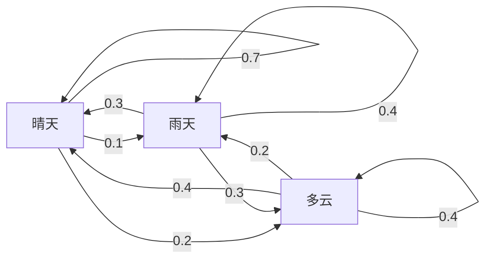
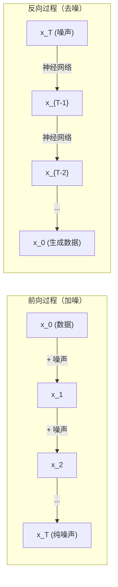

# 随机过程

> 随机性不是混乱，而是有结构的舞蹈。掌握它，你就掌握了扩散模型、强化学习和贝叶斯推断的底层语言。

**类型：** 实现课
**语言：** Python
**前置知识：** 阶段 01 · 06-07（概率与分布、贝叶斯定理）
**预计时间：** ~75 分钟
**所处阶段：** Tier 1
**关联课程：** 阶段 08（生成式 AI）— 扩散模型的前向与反向过程；阶段 09（强化学习）— 马尔可夫决策过程

---

## 🎯 学习目标

完成本课后，你能够：

- [ ] 从零实现一维/二维随机游走，验证位移的 $\sqrt{n}$ 缩放规律
- [ ] 构建马尔可夫链模拟器，通过特征值分解计算平稳分布
- [ ] 实现朗之万动力学和 Metropolis-Hastings MCMC 采样算法
- [ ] 解释前向扩散过程与布朗运动的联系，说明反向过程如何生成数据
- [ ] 根据问题特征选择合适的随机过程框架（马尔可夫链 / MCMC / 扩散 / 朗之万）

---

## 1. 问题

你的大语言模型每次只生成一个词元。给定当前上下文，模型输出一个概率分布，从中采样下一个词元，然后继续。这不是静态的随机——每一步都依赖上一步的结果。这是一个**随机过程**。

扩散模型（如 Stable Diffusion）将一张图片逐步加噪，直到变成纯随机噪声，然后让神经网络学会反向去噪，从噪声中"想象"出新的图片。前向过程是一个马尔可夫链，反向过程是一个学习到的马尔可夫链在倒着跑。

强化学习智能体在环境中执行动作，每个动作以一定概率转移到新状态。整个交互过程是一个马尔可夫决策过程。

贝叶斯推断的核心工具 MCMC（马尔可夫链蒙特卡洛），通过构造一个马尔可夫链，使其平稳分布恰好等于你想采样的后验分布。

这些看似不同的系统，都建立在四个基础概念之上：

1. **随机游走** — 最简单的随机过程
2. **马尔可夫链** — 带结构的随机性，用转移矩阵描述
3. **朗之万动力学** — 带噪声的梯度下降
4. **梅特罗波利斯-黑斯廷斯** — 从任意分布采样

不理解随机过程，你调温度参数时不知道发生了什么，训练扩散模型时不知道前向过程为什么那样设计，跑 MCMC 时不知道链为什么没有收敛。

---

## 2. 概念

### 2.1 随机游走

从位置 0 开始。每步抛一枚公平硬币：正面向右（+1），反面向左（-1）。

经过 $n$ 步后，你的位置是 $n$ 个随机 $\pm 1$ 值的和。期望位置是 0（游走是无偏的），但**期望距离**随 $\sqrt{n}$ 增长。

```
第 0 步:  位置 = 0
第 1 步:  位置 = +1 或 -1
第 2 步:  位置 = +2, 0, 或 -2
...
第 100 步:  期望距离原点约 10（sqrt(100)）
第 10000 步: 期望距离原点约 100（sqrt(10000)）
```

这违反直觉。游走是公平的——没有朝任一方向的漂移。但随着时间推移，它离起点越来越远。$n$ 步后的标准差是 $\sqrt{n}$。

**为什么是 $\sqrt{n}$？** 每步 $X_i$ 是 $\pm 1$，方差为 1。$n$ 步后位置 $S_n = X_1 + \cdots + X_n$，由于独立性，$\text{Var}(S_n) = n$，标准差 $= \sqrt{n}$。由中心极限定理，$S_n / \sqrt{n}$ 收敛于标准正态分布。

这个 $\sqrt{n}$ 缩放无处不在：SGD 噪声按 $1/\sqrt{\text{batch\_size}}$ 缩放，嵌入维度缩放按 $\sqrt{d}$。**平方根是独立随机加法的签名**。

**与布朗运动的联系。** 取步长为 $1/\sqrt{n}$、单位时间走 $n$ 步的随机游走，当 $n \to \infty$ 时，游走收敛到布朗运动 $B(t)$ —— 一个连续时间过程，$B(t)$ 服从均值为 0、方差为 $t$ 的正态分布。

布朗运动是扩散的数学基础。它模拟流体中粒子的随机抖动、股票价格的波动，以及——至关重要的——扩散模型中的噪声过程。

### 2.2 马尔可夫链

马尔可夫链是一个按照固定概率在状态之间转移的系统。核心性质：**下一状态只依赖当前状态，不依赖历史**。

$$P(X_{t+1} = j \mid X_t = i, X_{t-1}, \cdots) = P(X_{t+1} = j \mid X_t = i)$$

这称为**马尔可夫性质**（无后效性）。它意味着你可以用一个转移矩阵 $P$ 描述整个动态：

$$P[i][j] = \text{从状态 } i \text{ 转移到状态 } j \text{ 的概率}$$

$P$ 的每一行求和为 1（你必须去某个地方）。

**示例 —— 天气模型：**

```
状态：晴天(0)、雨天(1)、多云(2)

P = [[0.7, 0.1, 0.2],    (晴天: 70% 仍晴天, 10% 转雨, 20% 转多云)
     [0.3, 0.4, 0.3],    (雨天: 30% 转晴, 40% 仍雨, 30% 转多云)
     [0.4, 0.2, 0.4]]    (多云: 40% 转晴, 20% 转雨, 40% 仍多云)
```



从任意状态开始。经过多次转移，状态分布收敛到**平稳分布** $\pi$，满足 $\pi P = \pi$。这是 $P$ 的左特征向量（特征值为 1）。

对于天气链，平稳分布可能是 $[0.53, 0.18, 0.29]$ —— 长期来看，53% 的日子是晴天，与起始状态无关。

**计算平稳分布的方法：**

| 方法 | 原理 | 适用场景 |
|---|---|---|
| 幂迭代法 | 反复用初始分布乘以 $P$，直到收敛 | 状态数很大时 |
| 特征值法 | 求 $P^T$ 的特征值 1 对应的特征向量 | 状态数较少时 |

**收敛条件。** 马尔可夫链收敛到唯一平稳分布，当且仅当它满足：
- **不可约（Irreducible）**：任意状态可达任意其他状态
- **非周期（Aperiodic）**：链没有固定周期的循环

大多数在机器学习中遇到的链都满足这两个条件。

**吸收态。** 如果进入某状态后永远无法离开（$P[i][i] = 1$），该状态称为吸收态。吸收态马尔可夫链建模有终止状态的过程——游戏结束、客户流失、词元序列遇到结束符。

**混合时间。** 链需要多少步才能"接近"平稳分布？谱隙（$1 - \lambda_2$，$\lambda_2$ 为第二大特征值）控制混合速度。谱隙越大，混合越快。

### 2.3 布朗运动

随机游走的连续时间极限。位置 $B(t)$ 有三个性质：

1. $B(0) = 0$
2. $B(t) - B(s)$ 服从均值为 0、方差为 $t-s$ 的正态分布（$t > s$）
3. 不重叠区间上的增量相互独立

布朗运动连续但处处不可导——它在每个尺度上都有抖动。平面上的轨迹分形维数为 2。

离散模拟时，用以下公式近似：

$$B(t + \Delta t) = B(t) + \sqrt{\Delta t} \cdot z, \quad z \sim N(0, 1)$$

$\sqrt{\Delta t}$ 缩放是关键，它来自中心极限定理在随机游走上的应用。

### 2.4 朗之万动力学

梯度下降寻找函数的最小值。朗之万动力学寻找正比于 $\exp(-U(x)/T)$ 的概率分布，其中 $U$ 是能量函数，$T$ 是温度。

$$x_{t+1} = x_t - \Delta t \cdot \nabla U(x_t) + \sqrt{2 T \Delta t} \cdot z_t$$

两个力同时作用于粒子：
- **梯度力**（$-\Delta t \cdot \nabla U$）：推向低能量区域（开发）
- **随机力**（$\sqrt{2 T \Delta t} \cdot z$）：随机方向扰动（探索）

温度 $T = 0$ 时退化为纯梯度下降。温度极高时退化为随机游走。在合适的温度下，粒子探索能量景观，在低能量区域停留更久。

### 2.5 MCMC：马尔可夫链蒙特卡洛

有时你需要从可以计算（到一个常数）但无法直接采样的分布 $p(x)$ 中采样。贝叶斯后验就是典型例子——你知道似然乘以先验，但归一化常数不可计算。

**Metropolis-Hastings** 构造一个马尔可夫链，使其平稳分布为 $p(x)$：

1. 从当前位置 $x$ 出发
2. 从提议分布 $Q(x' \mid x)$ 生成候选点 $x'$
3. 计算接受比：$a = \frac{p(x') Q(x \mid x')}{p(x) Q(x' \mid x)}$
4. 以概率 $\min(1, a)$ 接受 $x'$，否则留在 $x$
5. 重复

如果 $Q$ 是对称的（如高斯），接受比简化为 $a = p(x') / p(x)$。你只需要概率的比值——归一化常数被抵消。

**为什么有效。** 接受比保证细致平衡：在 $x$ 且移动到 $x'$ 的概率等于在 $x'$ 且移动到 $x$ 的概率。细致平衡意味着 $p(x)$ 是链的平稳分布。

**实践要点：**
- **预烧期（Burn-in）**：丢弃前 $N$ 个样本，让链有足够时间从起始点到达平稳分布
- **稀释（Thinning）**：每隔 $k$ 个样本保留一个，减少自相关
- **多链验证**：从不同起点运行多条链，若收敛到同一分布则说明收敛
- **接受率**：$d$ 维高斯提议的最优接受率约为 23%（Roberts & Rosenthal, 2001）

### 2.6 扩散模型中的随机过程



DDPM（Ho et al., 2020）的前向过程是一个马尔可夫链：

$$q(x_t \mid x_{t-1}) = \mathcal{N}(x_t; \sqrt{1-\beta_t} \cdot x_{t-1}, \beta_t I)$$

经过 $T$ 步后，$x_T$ 近似为 $\mathcal{N}(0, I)$。反向过程由神经网络参数化，预测每步加入的噪声：

$$p_\theta(x_{t-1} \mid x_t) = \mathcal{N}(x_{t-1}; \mu_\theta(x_t, t), \sigma_t^2 I)$$

生成的每一步，都是一个学习到的马尔可夫链的一步。

---

## 3. 从零实现

### 第 1 步：随机游走模拟器

```python
import numpy as np

def random_walk_1d(n_steps, seed=None):
    """一维随机游走：每步等概率向左或向右。"""
    rng = np.random.RandomState(seed)
    steps = rng.choice([-1, 1], size=n_steps)
    # 累积求和得到位置序列，positions[0] = 0
    positions = np.concatenate([[0], np.cumsum(steps)])
    return positions

def random_walk_2d(n_steps, seed=None):
    """二维随机游走：每步等概率向上下左右。"""
    rng = np.random.RandomState(seed)
    directions = rng.choice(4, size=n_steps)  # 0=右, 1=左, 2=上, 3=下
    dx = np.zeros(n_steps)
    dy = np.zeros(n_steps)
    dx[directions == 0] = 1
    dx[directions == 1] = -1
    dy[directions == 2] = 1
    dy[directions == 3] = -1
    x = np.concatenate([[0], np.cumsum(dx)])
    y = np.concatenate([[0], np.cumsum(dy)])
    return x, y
```

一维游走存储累积和。每步 $\pm 1$，$n$ 步后位置是总和。方差随 $n$ 线性增长，标准差随 $\sqrt{n}$ 增长。

### 第 2 步：马尔可夫链

```python
class MarkovChain:
    def __init__(self, transition_matrix, state_names=None):
        self.P = np.array(transition_matrix, dtype=float)
        self.n_states = len(self.P)
        self.state_names = state_names or [str(i) for i in range(self.n_states)]

    def step(self, current_state, rng=None):
        """按转移概率采样下一个状态。"""
        if rng is None:
            rng = np.random.RandomState()
        probs = self.P[current_state]
        return rng.choice(self.n_states, p=probs)

    def simulate(self, start_state, n_steps, seed=None):
        """模拟 n 步转移过程。"""
        rng = np.random.RandomState(seed)
        states = [start_state]
        current = start_state
        for _ in range(n_steps):
            current = self.step(current, rng)
            states.append(current)
        return states

    def stationary_distribution(self):
        """通过特征值分解计算平稳分布。"""
        eigenvalues, eigenvectors = np.linalg.eig(self.P.T)
        idx = np.argmin(np.abs(eigenvalues - 1.0))
        stationary = np.real(eigenvectors[:, idx])
        stationary = np.clip(stationary, 0, None)
        total = stationary.sum()
        if total > 0:
            stationary = stationary / total
        return stationary
```

平稳分布是 $P$ 的特征值 1 对应的左特征向量。通过计算 $P^T$ 的特征向量（转置将左特征向量转为右特征向量）来求解。

### 第 3 步：朗之万动力学

```python
def langevin_dynamics(grad_U, x0, dt, temperature, n_steps, seed=None):
    """朗之万动力学采样。"""
    rng = np.random.RandomState(seed)
    x = np.array(x0, dtype=float)
    trajectory = [x.copy()]
    for _ in range(n_steps):
        noise = rng.randn(*x.shape)
        # 梯度下降 + 噪声扰动
        x = x - dt * grad_U(x) + np.sqrt(2 * temperature * dt) * noise
        trajectory.append(x.copy())
    return np.array(trajectory)
```

梯度将 $x$ 推向低能量区域。噪声防止陷入局部极小。平衡时样本分布正比于 $\exp(-U(x)/T)$。

### 第 4 步：Metropolis-Hastings

```python
def metropolis_hastings(target_log_prob, proposal_std, x0, n_samples, seed=None):
    """Metropolis-Hastings MCMC 采样。"""
    rng = np.random.RandomState(seed)
    x = np.array(x0, dtype=float)
    samples = [x.copy()]
    accepted = 0
    for _ in range(n_samples - 1):
        # 生成候选点（对称高斯提议）
        x_proposed = x + rng.randn(*x.shape) * proposal_std
        # 计算对数接受比
        log_ratio = target_log_prob(x_proposed) - target_log_prob(x)
        # 以概率 min(1, exp(log_ratio)) 接受
        if np.log(rng.rand()) < log_ratio:
            x = x_proposed
            accepted += 1
        samples.append(x.copy())
    acceptance_rate = accepted / (n_samples - 1)
    return np.array(samples), acceptance_rate
```

算法生成候选点，检查是否概率更高（或按比率概率接受），重复。接受率应在 23%~50% 之间以获得良好混合。

### 第 5 步：前向扩散过程

```python
def diffusion_forward(signal, n_steps, beta_start=0.0001, beta_end=0.02, seed=None):
    """前向扩散：逐步加噪直到信号退化为纯噪声。"""
    rng = np.random.RandomState(seed)
    betas = np.linspace(beta_start, beta_end, n_steps)
    trajectory = [signal.copy()]
    x = signal.copy()
    for t in range(n_steps):
        noise = rng.randn(*x.shape)
        x = np.sqrt(1 - betas[t]) * x + np.sqrt(betas[t]) * noise
        trajectory.append(x.copy())
    return np.array(trajectory), betas
```

这是 DDPM 的前向过程。经过 $T$ 步后，$x_T$ 近似为 $\mathcal{N}(0, I)$ 的纯高斯噪声。

---

## 4. 工业工具

实际工程中，你通常会使用成熟的库。但理解底层机制对调试和调优至关重要。

### 4.1 NumPy 实现转移矩阵的幂迭代

```python
import numpy as np

P = np.array([[0.7, 0.1, 0.2],
              [0.3, 0.4, 0.3],
              [0.4, 0.2, 0.4]])

# 幂迭代法求平稳分布
distribution = np.array([1.0, 0.0, 0.0])
for _ in range(100):
    distribution = distribution @ P

print(f"平稳分布: {np.round(distribution, 4)}")
# 输出: 平稳分布: [0.5263 0.1754 0.2982]
```

反复将初始分布乘以 $P$，最终收敛到平稳分布。这是求主左特征向量的幂方法。

### 4.2 验证马尔可夫链收敛速度

```python
import numpy as np

P = np.array([[0.9, 0.1], [0.3, 0.7]])

eigenvalues = np.linalg.eigvals(P)
spectral_gap = 1 - sorted(np.abs(eigenvalues))[-2]
print(f"特征值: {eigenvalues}")
print(f"谱隙: {spectral_gap:.4f}")
print(f"近似混合时间: {1/spectral_gap:.1f} 步")
# 输出: 谱隙: 0.2000
#       近似混合时间: 5.0 步
```

谱隙告诉你链遗忘初始状态的速度。谱隙 0.2 意味着约 5 步混合，谱隙 0.01 意味着约 100 步。运行长模拟前先检查这个——慢混合的链浪费算力。

### 4.3 与真实框架的联系

| 工具 | 用途 | 说明 |
|---|---|---|
| Hugging Face `diffusers` | `DDPMScheduler` 实现前向和反向马尔可夫链 | 扩散模型训练与推理 |
| NumPyro / PyMC | MCMC 采样（NUTS 采样器，Metropolis-Hastings 的改进版） | 贝叶斯推断 |
| Gymnasium | 环境步进函数定义马尔可夫决策过程 | 强化学习 |

---

## 5. 知识连线

本课学习的随机过程理论，是后续多个阶段的数学基础：

- **阶段 08（生成式 AI）**：扩散模型的前向过程是一个逐步加噪的马尔可夫链，反向过程是学习到的去噪链——理解了随机过程，你就理解了 Stable Diffusion 和 DDPM 的工作原理
- **阶段 09（强化学习）**：马尔可夫决策过程（MDP）是强化学习的数学框架——智能体在每个状态下选择动作，环境按概率转移，整个交互就是一个随机过程
- **阶段 10（大语言模型从零）**：词元生成是一个马尔可夫链——温度参数控制转移概率的尖锐程度，Top-k 和 Top-p 采样修改了马尔可夫转移概率

---

## 6. 工程最佳实践

### 6.1 工业界常用方案

| 场景 | 推荐方案 | 备注 |
|---|---|---|
| 学习/实验 | NumPy 从零实现 | 理解原理 |
| 扩散模型训练 | Hugging Face `diffusers` | `DDPMScheduler` 内置多种噪声调度 |
| 贝叶斯推断 | NumPyro / PyMC | NUTS 采样器比原始 MH 更高效 |
| 强化学习 | Gymnasium + Stable Baselines3 | 标准 MDP 环境接口 |
| 大规模 MCMC | Stan / Turing.jl | 哈密顿蒙特卡洛（HMC），收敛更快 |

### 6.2 中文场景特别建议

- 中文文本的词元生成过程与英文相同，但由于分词器对中文效率较低（每个中文字可能需要 2-3 个词元），马尔可夫链的有效"状态空间"更大，温度参数对生成质量的影响更敏感
- 在中文 NLP 任务中使用 MCMC 进行后验采样时，注意预烧期可能需要更长——中文语言模型的后验分布通常更复杂
- 训练中文扩散模型（如中文文本到图像）时，噪声调度 $\beta_t$ 的设置与英文场景相同，但需要更多训练步数来收敛

### 6.3 踩坑经验

- MCMC 接受率过低（< 10%）：提议分布方差太大，候选点经常跳到低概率区域被拒绝。减小 `proposal_std`
- MCMC 接受率过高（> 90%）：提议分布方差太小，链几乎总是接受但移动太慢。增大 `proposal_std`
- 朗之万动力学发散：步长 $\Delta t$ 太大。减小 $\Delta t$（通常 0.001 ~ 0.1）
- 马尔可夫链不收敛：检查是否不可约且非周期。周期性链会振荡而非收敛，添加自环可修复
- 忘记丢弃预烧期样本：早期样本偏向起始点，导致估计偏差。始终丢弃前 10%~25% 的样本

---

## 7. 常见错误

### 错误 1：混淆随机游走的期望位置与期望距离

**现象：** 模拟 10000 步随机游走后，报告"期望位置是 0，所以游走不会远离起点"。

**原因：** 期望位置确实是 0（无偏），但期望**距离**（标准差）是 $\sqrt{n} = 100$。这两个量度描述不同的东西。

**修复：**

```python
# ❌ 错误：用期望位置判断游走范围
final_pos = walk[-1]
print(f"位置: {final_pos}")  # 接近 0，误以为没走远

# ✓ 正确：用标准差（sqrt(n)）判断典型距离
distance = abs(final_pos)
print(f"距离原点: {distance}, 预期约 {np.sqrt(n_steps):.1f}")
```

### 错误 2：MCMC 不检查收敛就直接使用样本

**现象：** 运行 MCMC 后直接使用所有样本计算后验均值，结果严重偏离理论值。

**原因：** 链尚未收敛到平稳分布，早期样本来自起始点附近的偏置区域。

**修复：**

```python
# ❌ 错误：使用所有样本
samples, _ = metropolis_hastings(log_prob, 1.0, x0, 10000)
posterior_mean = samples.mean()  # 被起始点偏置

# ✓ 正确：丢弃预烧期样本
burn_in = 2500  # 丢弃前 25%
posterior_mean = samples[burn_in:].mean()
```

### 错误 3：朗之万动力学步长过大导致发散

**现象：** 采样过程中样本值迅速趋向无穷大，NaN 出现。

**原因：** 步长 $\Delta t$ 过大，梯度项和噪声项导致更新不稳定。

**修复：**

```python
# ❌ 错误：步长过大
trajectory = langevin_dynamics(grad_U, x0, dt=1.0, temperature=1.0, n_steps=1000)

# ✓ 正确：使用小步长
trajectory = langevin_dynamics(grad_U, x0, dt=0.01, temperature=1.0, n_steps=1000)
```

### 错误 4：马尔可夫链转移矩阵行概率和不为 1

**现象：** 模拟时 `rng.choice` 报错"概率和不为 1"，或结果分布不收敛。

**原因：** 转移矩阵某行概率和不等于 1，违反了随机矩阵的定义。

**修复：**

```python
# ❌ 错误：行概率和不是 1
P = [[0.7, 0.1, 0.1],  # 和为 0.9
     [0.3, 0.4, 0.3],
     [0.4, 0.2, 0.4]]

# ✓ 正确：每行归一化
P = np.array([[0.7, 0.1, 0.1],
              [0.3, 0.4, 0.3],
              [0.4, 0.2, 0.4]])
P = P / P.sum(axis=1, keepdims=True)  # 归一化确保每行和为 1
```

### 错误 5：扩散模型噪声调度设置不当

**现象：** 前向过程 100 步后信号仍有明显结构（噪声不够），或 10 步就变成纯噪声。

**原因：** 噪声调度 $\beta_t$ 的范围不合适——太小则加噪不足，太大则过快丢失信号。

**修复：**

```python
# ❌ 错误：beta 范围太小，100 步后仍有信号
trajectory, _ = diffusion_forward(signal, n_steps=100, beta_start=1e-6, beta_end=0.001)

# ✓ 正确：DDPM 推荐的 beta 范围
trajectory, _ = diffusion_forward(signal, n_steps=100, beta_start=0.0001, beta_end=0.02)
```

---

## 8. 面试考点

### Q1：随机游走经过 $n$ 步后，期望距离原点有多远？为什么？（难度：⭐⭐）

**参考答案：**

期望距离（标准差）为 $\sqrt{n}$。每步 $X_i$ 是 $\pm 1$，方差为 1。$n$ 步后位置 $S_n = X_1 + \cdots + X_n$，由于独立性，$\text{Var}(S_n) = n$，标准差 $= \sqrt{n}$。注意：期望**位置**是 0（无偏），但期望**距离**是 $\sqrt{n}$。这是两个不同的量度。

### Q2：什么是马尔可夫性质？为什么它对机器学习重要？（难度：⭐⭐）

**参考答案：**

马尔可夫性质（无后效性）：下一状态只依赖当前状态，不依赖历史。形式化表达为 $P(X_{t+1} \mid X_t, X_{t-1}, \cdots) = P(X_{t+1} \mid X_t)$。重要性在于：它允许用一个转移矩阵 $P$ 完全描述系统动态，将指数级的历史依赖压缩为矩阵运算。这使得大规模状态空间的建模和计算成为可能。

### Q3：解释 Metropolis-Hastings 算法为什么能收敛到目标分布。（难度：⭐⭐⭐）

**参考答案：**

MH 算法通过接受比 $\alpha = \frac{p(x') Q(x \mid x')}{p(x) Q(x' \mid x)}$ 保证**细致平衡**：$p(x) \cdot Q(x' \mid x) \cdot \alpha(x \to x') = p(x') \cdot Q(x \mid x') \cdot \alpha(x' \to x)$。细致平衡意味着目标分布 $p(x)$ 是马尔可夫链的平稳分布。在不可约、非周期的条件下，链最终收敛到 $p(x)$。归一化常数在比值中被抵消，因此只需计算未归一化的概率。

### Q4：朗之万动力学中温度参数 $T$ 的作用是什么？$T \to 0$ 和 $T \to \infty$ 分别退化成什么？（难度：⭐⭐）

**参考答案：**

温度 $T$ 控制探索与开发的权衡。更新公式为 $x_{t+1} = x_t - \Delta t \cdot \nabla U(x_t) + \sqrt{2 T \Delta t} \cdot z_t$。$T \to 0$ 时噪声项消失，退化为纯梯度下降（确定性优化）。$T \to \infty$ 时噪声主导，退化为随机游走。中间温度下，粒子在探索能量景观的同时倾向于停留在低能量区域，平衡时分布正比于 $\exp(-U(x)/T)$。

### Q5：扩散模型的前向过程和反向过程分别是什么？为什么前向过程要设计成马尔可夫链？（难度：⭐⭐⭐）

**参考答案：**

前向过程是逐步加噪的马尔可夫链：$x_t = \sqrt{1-\beta_t} \cdot x_{t-1} + \sqrt{\beta_t} \cdot \epsilon$，经过 $T$ 步后 $x_T \approx \mathcal{N}(0, I)$。反向过程是学习到的去噪链：$p_\theta(x_{t-1} \mid x_t)$ 由神经网络参数化。前向过程设计成马尔可夫链的原因：（1）数学上易于分析——已知 $x_0$ 可直接采样任意 $x_t$；（2）马尔可夫性质使反向过程的条件概率形式简洁，便于神经网络学习。

---

## 🔑 关键术语

| 术语 | 人们怎么说 | 实际含义 |
|---|---|---|
| 随机游走（Random Walk） | "抛硬币移动" | 每步位置由随机增量改变的过程，$n$ 步后标准差为 $\sqrt{n}$ |
| 马尔可夫性质（Markov Property） | "无记忆性" | 未来只依赖当前状态，与历史无关：$P(X_{t+1} \mid X_t, \cdots) = P(X_{t+1} \mid X_t)$ |
| 转移矩阵（Transition Matrix） | "概率表" | $P[i][j]$ = 从状态 $i$ 转移到 $j$ 的概率，每行求和为 1 |
| 平稳分布（Stationary Distribution） | "长期平均" | 满足 $\pi P = \pi$ 的分布——链的平衡态，与起始状态无关 |
| 布朗运动（Brownian Motion） | "随机抖动" | 随机游走的连续时间极限，$B(t) \sim N(0, t)$，处处连续但不可导 |
| 朗之万动力学（Langevin Dynamics） | "带噪声的梯度下降" | 更新规则结合确定性梯度和随机扰动，用于从能量函数采样 |
| MCMC | "走向目标的行走" | 构造马尔可夫链使其平稳分布等于目标分布，从而间接采样 |
| Metropolis-Hastings | "提议-接受/拒绝" | MCMC 算法，通过接受比保证细致平衡，归一化常数被抵消 |
| 温度（Temperature） | "随机性旋钮" | 控制探索与开发权衡的参数：低温度偏确定性，高温度偏随机性 |
| 扩散过程（Diffusion Process） | "噪声进、噪声出" | 前向逐步加噪，反向逐步去噪，用于生成数据 |
| 谱隙（Spectral Gap） | "收敛速度指标" | $1 - \lambda_2$，控制马尔可夫链收敛到平稳分布的速度 |
| 预烧期（Burn-in） | "热身阶段" | MCMC 起始阶段产生的偏置样本，应丢弃 |

---

## 📚 小结

随机过程是描述"有结构的随机性"的数学语言——从随机游走的 $\sqrt{n}$ 缩放，到马尔可夫链的平稳分布，再到朗之万动力学和 MCMC 采样。你从零实现了五个核心算法，理解了扩散模型前向过程为何是马尔可夫链、温度参数如何控制生成随机性。

下一课我们将进入阶段 02（机器学习基础），学习随机过程在真实机器学习系统中的应用。

---

## ✏️ 练习

1. 【理解】用自己的话解释：为什么随机游走的期望位置是 0，但期望距离是 $\sqrt{n}$？这两个量度分别描述了什么？写 150 字以内的说明。

2. 【实现】修改 `random_walk_2d` 函数，使其支持"带漂移"的游走——每个方向可以有不同的概率（如向右概率 0.3，向左 0.2，向上 0.25，向下 0.25）。观察 10000 步后游走的整体偏移方向。

3. 【实验】取一个双峰目标分布 $p(x) \propto \exp(-(x^2-1)^2)$，分别用 Metropolis-Hastings（不同 `proposal_std`）和朗之万动力学采样。比较两种方法在"穿越势垒"（从 -1 到 +1）的频率差异。

4. 【思考】扩散模型的前向过程为什么选择线性噪声调度 $\beta_t$？如果使用余弦调度（如 Improved DDPM 所提），会有什么优势？查阅相关论文，用 200 字说明你的理解。

---

## 🚀 产出

本课产出以下可复用内容：

| 产出 | 文件 | 说明 |
|---|---|---|
| 随机过程核心算法 | `code/main.py` | 从零实现随机游走、马尔可夫链、朗之万动力学、MCMC、前向扩散 |
| 可复用提示词 | `outputs/prompt-stochastic-processes-tutor.md` | 根据问题特征推荐合适的随机过程框架 |

---

## 📖 参考资料

1. [论文] Ho, Jain, Abbeel. "Denoising Diffusion Probabilistic Models". NeurIPS, 2020. https://arxiv.org/abs/2006.11239
2. [论文] Song, Ermon. "Generative Modeling by Estimating Gradients of the Data Distribution". NeurIPS, 2019. https://arxiv.org/abs/1907.05600
3. [论文] Roberts, Rosenthal. "General State Space Markov Chains and MCMC Algorithms". Probability Surveys, 2004. https://arxiv.org/abs/math/0404033
4. [论文] Welling, Teh. "Bayesian Learning via Stochastic Gradient Langevin Dynamics". ICML, 2011. https://arxiv.org/abs/1101.3281
5. [书籍] Norris. "Markov Chains". Cambridge University Press, 1997.
6. [官方文档] Hugging Face diffusers — DDPMScheduler: https://huggingface.co/docs/diffusers/api/schedulers/ddpm

---

> 本课程参考了 AI Engineering From Scratch（MIT License）的课程体系，在此基础上进行了重构和原创内容的扩充。所有中文表达、案例、LLM 视角分析、工程最佳实践、常见错误、面试考点等均为原创内容。
