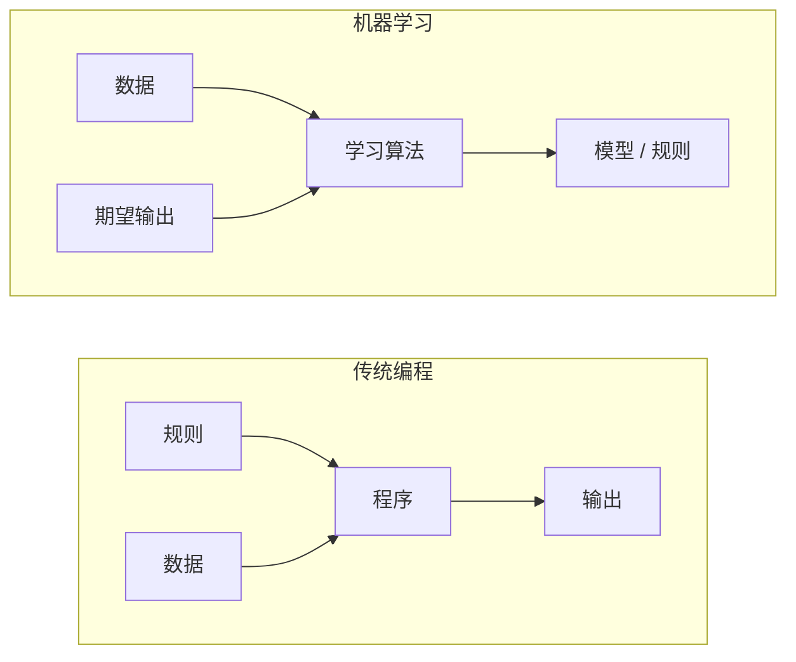
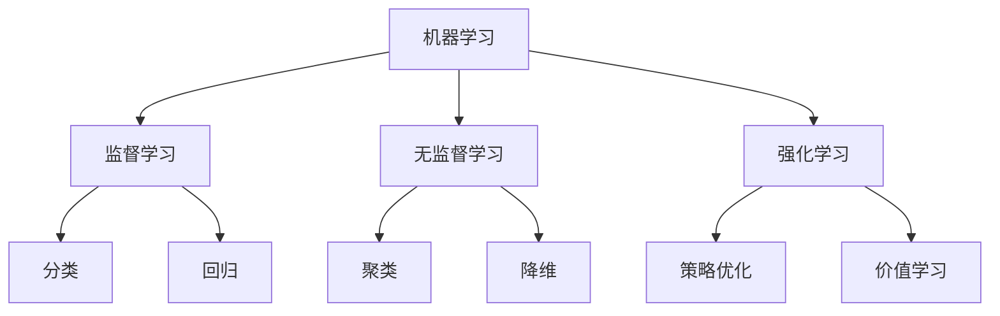
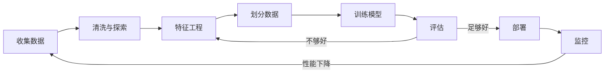

# 什么是机器学习——与其写一千条规则，不如让数据自己找规律

> 与其写一千条规则，不如让数据自己找规律。

**类型：** 实现课
**语言：** Python
**前置知识：** 第 01 阶段（数学基础）
**预计时间：** ~45 分钟
**所处阶段：** Tier 1
**关联课程：** 第 02 阶段 · 02（过拟合与正则化）— 本节建立 ML 全流程直觉，下节深入模型为什么会"学歪"

---

## 🎯 学习目标

完成本课后，你能够：

- [ ] 区分监督学习、无监督学习和强化学习，并判断给定问题属于哪一类
- [ ] 从零实现最近质心分类器，与随机基线对比评估其性能
- [ ] 区分分类任务与回归任务，为每种任务选择合适的损失函数
- [ ] 判断一个业务问题是否适合用机器学习解决，还是用规则更合适
- [ ] 解释过拟合、欠拟合和偏差-方差权衡的直觉含义

---

## 1. 问题

你要做一个垃圾邮件过滤器。传统做法：坐下来写几百条规则——"如果邮件包含'免费领取'，标记为垃圾。如果标题有三个以上感叹号，标记为垃圾。"你花了两周写规则。然后垃圾邮件发送者换了措辞。你的规则失效了。你继续写。恶性循环。

机器学习翻转了这个过程。你不再写规则，而是给计算机成千上万封标注好的邮件（"垃圾"或"非垃圾"），让它自己找出规律。计算机发现了你永远想不到的模式。当垃圾邮件发送者改变策略时，你用新数据重新训练，而不是重写代码。

从"编写规则"到"从数据中学习"，这就是机器学习的核心。每个推荐引擎、语音助手、自动驾驶系统和大语言模型，本质上都是这个思路。

但机器学习不是万能的。如果你只有 10 条数据，或者规则本身就很简单（比如摄氏转华氏温度），用机器学习反而会把问题搞复杂。**知道什么时候该用 ML，什么时候不该用，和知道怎么用一样重要。**

---

## 2. 核心概念

### 2.1 从数据中学习，而非编写规则

传统编程和机器学习解决问题的方向正好相反。



**传统编程：** 你写规则，程序把规则应用到数据上，产出输出。

**机器学习：** 你提供数据和期望输出，算法自己发现规则。

训练产出的"模型"就是规则——以数字（权重、参数）的形式编码。它能从见过的样本泛化，对从未见过的数据做出预测。

### 2.2 机器学习的三种类型



**监督学习（Supervised Learning）：** 你有输入-输出对。模型学习从输入到输出的映射。
- "这里有 1万张标注了猫或狗的照片。学会区分它们。"
- "这里有房屋特征和价格。学会预测价格。"

**无监督学习（Unsupervised Learning）：** 你只有输入，没有标签。模型自己发现数据结构。
- "这里有 1万个客户的购买记录。找出自然的分组。"
- "这里有 1000 维的数据点。降到 2 维，同时保留结构。"

**强化学习（Reinforcement Learning）：** 智能体在环境中执行动作，获得奖励或惩罚。它学习一个策略来最大化总奖励。
- "玩这个游戏。赢加 1 分，输减 1 分。找出最佳策略。"
- "控制这个机械臂。抓到物体加 1 分，每浪费一秒扣 0.01 分。"

实际工作中，大部分场景用的是监督学习。无监督学习常用于预处理和探索性分析。强化学习驱动游戏 AI、机器人控制，以及大语言模型的 RLHF（基于人类反馈的强化学习）。

### 2.3 分类与回归

这是监督学习的两大核心任务。

| 维度 | 分类 | 回归 |
|------|------|------|
| 输出 | 离散类别 | 连续数值 |
| 示例 | "这封邮件是垃圾吗？" | "这套房多少钱？" |
| 输出空间 | {猫, 狗, 鸟} | 任意实数 |
| 损失函数 | 交叉熵、准确率 | 均方误差、MAE |
| 决策方式 | 类别之间的边界 | 拟合数据的曲线 |

分类回答"是哪一类？"回归回答"有多少？"

有些问题两种方式都可以。预测股票涨跌是分类，预测具体价格是回归。

### 2.4 机器学习工作流

每个机器学习项目都遵循同样的流水线，不管用什么算法。



- **收集数据：** 获取原始数据。数据量通常越多越好，但质量比数量更重要。
- **清洗与探索：** 处理缺失值、去重、可视化分布、发现异常。这一步通常占项目总时间的 60%-80%。
- **特征工程：** 把原始数据转换成模型能用的特征。日期转成星期几，数值列归一化，类别变量编码。好的特征比花哨的算法更重要。
- **划分数据：** 分成训练集、验证集和测试集。模型在训练集上学习，你在验证集上调超参数，在测试集上报告最终性能。
- **训练模型：** 将训练数据输入算法，算法调整内部参数以最小化损失函数。
- **评估：** 在验证集/测试集上衡量性能。如果不达标，回到特征工程或换算法。
- **部署：** 将模型投入生产环境，对新数据做预测。
- **监控：** 持续跟踪性能。数据分布会变化（数据漂移），模型会退化。性能下降时重新训练。

### 2.5 训练集、验证集、测试集

这是初学者最容易搞错的概念。你必须在模型从未见过的数据上评估性能。否则你测量的只是记忆能力，而不是学习能力。

| 划分 | 用途 | 使用时机 | 典型比例 |
|------|------|----------|----------|
| 训练集 | 模型从中学习 | 训练过程中 | 60%-80% |
| 验证集 | 调超参数、比较模型 | 每次训练后 | 10%-20% |
| 测试集 | 最终无偏性能估计 | 仅在最后用一次 | 10%-20% |

测试集是神圣的。你只能看它一次。如果你不断根据测试集表现调整模型，你实际上是在测试集上训练，报告的数字毫无意义。

对于小数据集，使用 k 折交叉验证：将数据分成 k 份，用 k-1 份训练，1 份验证，轮换 k 次，取平均结果。

### 2.6 过拟合与欠拟合


**欠拟合：** 模型太简单，无法捕捉数据中的模式。用直线拟合曲线关系。训练误差高，测试误差也高。

**过拟合：** 模型太复杂，把训练数据中的噪声也记住了。一条波浪线穿过每个训练点，但在新数据上表现很差。训练误差低，测试误差高。

**恰好的拟合：** 模型捕捉到真实模式，但没有记住噪声。训练误差和测试误差都合理偏低。

过拟合的信号：
- 训练准确率远高于验证准确率
- 模型在训练数据上表现好，在新数据上表现差
- 增加训练数据能提升性能（说明模型在记忆而非学习）

修复过拟合：获取更多数据、降低模型复杂度、正则化、Dropout、早停。

修复欠拟合：使用更复杂的模型、增加特征、减少正则化、训练更久。

### 2.7 偏差-方差权衡

这是过拟合与欠拟合背后的数学框架。

**偏差（Bias）：** 来自模型的错误假设。当真实关系是非线性时，线性模型有高偏差。高偏差导致欠拟合。

**方差（Variance）：** 来自对训练数据微小波动的敏感度。高方差模型在不同训练子集上给出截然不同的预测。高方差导致过拟合。

| 模型复杂度 | 偏差 | 方差 | 结果 |
|-----------|------|------|------|
| 太低（直线拟合曲线） | 高 | 低 | 欠拟合 |
| 适中 | 中 | 中 | 良好泛化 |
| 太高（20 次多项式拟合 10 个点） | 低 | 高 | 过拟合 |

总误差 = 偏差² + 方差 + 不可约噪声

你无法减少不可约噪声（数据本身的随机性）。目标是找到偏差² + 方差最小的甜蜜点。

### 2.8 没有免费午餐定理

没有任何单一算法对所有问题都是最好的。在一个类别的问题上表现好的算法，在另一类问题上会表现差。这就是为什么数据科学家要尝试多种算法并比较结果。

实际选择取决于：数据量大小、特征数量、关系是否线性、是否需要可解释性、算力预算。

### 2.9 什么时候不该用机器学习

ML 很强大，但不总是合适的工具。伸手拿模型之前，先问自己是否真的需要。

**不要用 ML 的场景：**

- **规则简单且明确。** 税务计算、排序算法、单位换算。如果你能用几条 if 语句写清楚，模型只会增加复杂度而没有收益。
- **没有数据或数据极少。** ML 需要样本来学习。只有 10 个数据点，你训练不出任何有意义的东西。先收集数据。
- **错误的代价灾难性，需要保证正确性。** 医疗剂量计算、核反应堆控制、密码学验证。ML 模型是概率性的，有时会出错。如果"有时出错"不可接受，用确定性方法。
- **查表或启发式就能解决问题。** 如果一个简单阈值或表格覆盖 99% 的情况，加 ML 只会增加维护成本而没有实质提升。
- **需要解释决策但无法解释。** 受监管行业（贷款、保险、司法）有时要求每个决策都能完全解释。部分 ML 模型可解释（线性回归、小决策树），但大多数不行。
- **问题变化比你重新训练还快。** 如果规则每天变，重新训练需要一周，模型永远是过时的。

---

## 3. 从零实现

本节用 NumPy 从零实现一个最近质心分类器——最简单的机器学习算法之一。它展示了核心思路：从数据中学习，然后在新数据上预测。

### 第 1 步：最近质心分类器

最近质心分类器计算训练数据中每个类的中心（均值）。预测时，将每个新点分配到最近的中心所属的类。

```python
import numpy as np


class NearestCentroid:
    """最近质心分类器——最简单的 ML 算法。"""

    def __init__(self):
        self.classes = None
        self.centroids = None

    def fit(self, X, y):
        """训练：计算每个类的质心（均值向量）。"""
        self.classes = np.unique(y)
        # 对每个类，计算该类所有样本在每个特征上的均值
        self.centroids = np.array([
            X[y == c].mean(axis=0) for c in self.classes
        ])

    def predict(self, X):
        """预测：将每个样本分配到最近的质心。"""
        # 计算每个样本到每个质心的欧氏距离
        distances = np.array([
            np.sqrt(((X - c) ** 2).sum(axis=1))
            for c in self.centroids
        ])
        # 选择距离最小的类
        return self.classes[distances.argmin(axis=0)]

    def score(self, X, y):
        """计算准确率。"""
        return np.mean(self.predict(X) == y)
```

整个算法就是这样。`fit` 计算两个均值，`predict` 计算距离。没有梯度下降，没有迭代，没有超参数。

### 第 2 步：生成数据并训练

我们生成一个两类略有重叠的二维分类数据集。质心分类器在类中心之间画出线性决策边界。

```python
def generate_classification_data(n_per_class=100, n_features=2, separation=2.0, seed=42):
    """生成二分类数据集。separation 越大，两类越容易分开。"""
    rng = np.random.RandomState(seed)
    center_0 = np.ones(n_features) * (separation / 2)
    center_1 = np.ones(n_features) * (-separation / 2)
    X_class0 = rng.randn(n_per_class, n_features) + center_0
    X_class1 = rng.randn(n_per_class, n_features) + center_1
    X = np.vstack([X_class0, X_class1])
    y = np.array([0] * n_per_class + [1] * n_per_class)
    shuffle_idx = rng.permutation(len(y))
    return X[shuffle_idx], y[shuffle_idx]


def train_test_split(X, y, test_fraction=0.3, seed=42):
    """将数据随机划分为训练集和测试集。"""
    rng = np.random.RandomState(seed)
    n = len(y)
    idx = rng.permutation(n)
    split = int(n * (1 - test_fraction))
    return X[idx[:split]], X[idx[split:]], y[idx[:split]], y[idx[split:]]
```

### 第 3 步：与基线对比

每个 ML 模型都应该和一个简单的基线对比。这里基线随机猜测类别。如果你的 ML 模型连随机猜测都不如，那就有问题了。

```python
def random_baseline(y_train, y_test, seed=42):
    """随机猜测基线：按训练集类别比例随机预测。"""
    rng = np.random.RandomState(seed)
    classes, counts = np.unique(y_train, return_counts=True)
    probs = counts / counts.sum()
    preds = rng.choice(classes, size=len(y_test), p=probs)
    return np.mean(preds == y_test)


def majority_baseline(y_train, y_test):
    """多数类基线：总是预测训练集中最常见的类。"""
    values, counts = np.unique(y_train, return_counts=True)
    majority_class = values[np.argmax(counts)]
    preds = np.full(len(y_test), majority_class)
    return np.mean(preds == y_test)
```

质心分类器在这个干净数据集上应该达到 90%+ 准确率。随机基线约 50%。

### 第 4 步：为什么这很重要

最近质心分类器极其简单。没有超参数，没有迭代，没有梯度下降。但它抓住了机器学习的基本模式：

1. **学习**——从训练数据中学习一个表示（质心）
2. **预测**——用该表示在新数据上做预测（最近距离）
3. **评估**——与基线对比（随机猜测）

从逻辑回归到 Transformer，每个 ML 算法都遵循同样的三步模式。表示变得更复杂，但工作流不变。

### 第 5 步：质心分类器的局限

最近质心分类器假设每个类形成一个单一的团。它画出线性决策边界。它在以下情况会失败：

- 类有多个簇（比如数字"1"有多种写法）
- 决策边界是非线性的（比如一个类包围另一个类）
- 特征尺度差异很大（距离被最大尺度的特征主导）

这些局限驱动了后续所有算法的学习。K 近邻处理多簇问题。决策树处理非线性边界。特征缩放解决尺度问题。每一课都建立在前一课的局限之上。

---

## 4. 工业工具

scikit-learn 提供了 `NearestCentroid` 和标准数据生成器：

```python
from sklearn.neighbors import NearestCentroid
from sklearn.datasets import make_classification
from sklearn.model_selection import train_test_split

# 生成 500 个样本、2 个特征的二分类数据集
X, y = make_classification(
    n_samples=500, n_features=2, n_redundant=0,
    n_clusters_per_class=1, random_state=42
)
X_train, X_test, y_train, y_test = train_test_split(X, y, test_size=0.3)

clf = NearestCentroid()
clf.fit(X_train, y_train)
print(f"准确率: {clf.score(X_test, y_test):.3f}")
```

```text
准确率: 0.907
```

| 实现方式 | 速度 | 内存 | 适用场景 |
|---------|------|------|---------|
| 我们的 NumPy 版 | 慢 | 低 | 学习理解 |
| scikit-learn | 快 | 中 | 实验 / 生产 |
| PyTorch + GPU | 极快 | 高 | 大规模训练 |

---

## 5. 知识连线

本节学习的监督学习范式，是后续所有机器学习课程的基础：

- **第 02 阶段 · 02（过拟合与正则化）**：你会看到为什么模型会"记住"噪声，以及如何用正则化技术对抗它
- **第 03 阶段（深度学习核心）**：同样的训练-验证-测试流程、损失函数、偏差-方差权衡，在神经网络规模上运作
- **第 10 阶段（大语言模型从零）**：GPT 的预训练本质上是自监督学习——本节学到的"从数据中学习"被放大到了数十亿参数的规模

---

## 6. 工程最佳实践

### 6.1 工业界常用方案

| 场景 | 推荐方案 | 备注 |
|------|---------|------|
| 快速实验 | scikit-learn | 开箱即用，API 统一 |
| 深度学习 | PyTorch / TensorFlow | 灵活，社区活跃 |
| 大规模数据 | Spark MLlib | 分布式训练 |
| 生产部署 | ONNX / TensorRT | 模型导出与加速推理 |
| 自动化 ML | AutoML (FLAML, Optuna) | 自动调参，节省时间 |

### 6.2 中文场景特别建议

- 中文文本分类任务中，特征工程阶段需要额外考虑分词（jieba、pkuseg），因为中文没有天然的空格分隔
- 处理中文电商评论等用户生成内容时，注意处理拼音缩写（"yyds"、"xswl"）和表情符号
- 中文数据集往往类别不平衡更严重（如欺诈检测），建议优先使用 F1 分数而非准确率作为评估指标

### 6.3 踩坑经验

- 训练集和测试集划分前忘记设置随机种子，导致每次实验结果不同，无法复现
- 在特征工程阶段使用了测试集信息（如用全量数据做归一化），造成数据泄露
- 类别不平衡时只看准确率——99% 的准确率可能只是模型学会了全部预测为多数类
- 模型上线后没有监控数据漂移，三个月后性能下降一半才发现

---

## 7. 常见错误

### 错误 1：在测试集上调参

**现象：** 模型在测试集上表现很好，但上线后效果很差。

**原因：** 如果你根据测试集的表现反复调整超参数，你实际上是在测试集上训练。测试集应当只在最终评估时使用一次。

```python
# ❌ 错误：反复在测试集上调参
for lr in [0.001, 0.01, 0.1]:
    model = train(X_train, y_train, lr=lr)
    acc = model.score(X_test, y_test)  # 不应该看测试集！
    print(f"lr={lr}, test_acc={acc}")

# ✓ 正确：用验证集调参，最后才看测试集
for lr in [0.001, 0.01, 0.1]:
    model = train(X_train, y_train, lr=lr)
    acc = model.score(X_val, y_val)  # 用验证集选超参数
    print(f"lr={lr}, val_acc={acc}")
# 选完最佳 lr 后，只在测试集上评估一次
final_acc = best_model.score(X_test, y_test)
```

### 错误 2：忽视基线

**现象：** 模型准确率 85%，但实际没有用。

**原因：** 如果数据集中 85% 的样本属于同一类，那么一个"总是预测多数类"的模型也能达到 85% 准确率。你的 ML 模型并没有比这个简单策略更好。

```python
# ✓ 正确：先建立基线
majority_acc = majority_baseline(y_train, y_test)
print(f"多数类基线: {majority_acc:.3f}")

model_acc = clf.score(X_test, y_test)
print(f"模型准确率: {model_acc:.3f}")
print(f"相对提升: {(model_acc - majority_acc) / majority_acc * 100:.1f}%")
```

### 错误 3：特征尺度不统一

**现象：** 模型被数值大的特征主导，小尺度特征被忽略。

**原因：** 基于距离的算法（如最近质心、KNN）对特征尺度敏感。如果特征 A 的范围是 0-10000，特征 B 的范围是 0-1，距离计算会被特征 A 主导。

```python
# ❌ 错误：直接使用原始特征
clf.fit(X_train, y_train)  # 如果特征尺度差异大，结果会被大尺度特征主导

# ✓ 正确：先做特征归一化
from sklearn.preprocessing import StandardScaler
scaler = StandardScaler()
X_train_scaled = scaler.fit_transform(X_train)  # 只在训练集上 fit
X_test_scaled = scaler.transform(X_test)        # 测试集用同样的参数 transform
clf.fit(X_train_scaled, y_train)
```

### 错误 4：用准确率评估不平衡数据

**现象：** 准确率 99%，但模型一个正样本都没找出来。

**原因：** 在欺诈检测等场景中，正样本可能只占 0.1%。模型全部预测为负也能达到 99.9% 准确率，但毫无用处。

```python
# ✓ 正确：使用精确率、召回率和 F1 分数
from sklearn.metrics import classification_report
print(classification_report(y_test, y_pred, target_names=["正常", "欺诈"]))
```

---

## 8. 面试考点

### Q1：监督学习、无监督学习和强化学习的区别是什么？（难度：⭐⭐）

**参考答案：**
监督学习使用带标签的数据（输入-输出对），学习从输入到输出的映射，典型任务包括分类和回归。无监督学习使用无标签数据，目标是发现数据中的内在结构，典型任务包括聚类和降维。强化学习不直接给正确答案，而是让智能体通过与环境交互获得奖励信号，学习最大化长期回报的策略。

判断一个场景属于哪种类型，关键看数据是否有标签：有标签→监督学习，无标签→无监督学习，通过试错学习→强化学习。

### Q2：什么是过拟合？如何检测和修复？（难度：⭐⭐）

**参考答案：**
过拟合指模型过度记忆了训练数据中的噪声和细节，导致在训练集上表现很好但在新数据上泛化能力差。

检测方法：训练准确率远高于验证准确率；增加训练数据后性能提升（说明之前是在记忆而非学习）。

修复方法：获取更多训练数据、降低模型复杂度、添加正则化（L1/L2）、使用 Dropout、早停（当验证误差开始上升时停止训练）。

### Q3：为什么需要划分训练集、验证集和测试集？只用训练集和测试集行不行？（难度：⭐⭐）

**参考答案：**
不行。如果你用测试集来调参或选择模型，测试集的信息会"泄露"到训练过程中。你根据测试集反复调整，实际上是在测试集上训练，导致报告的性能过于乐观，无法反映真实泛化能力。

验证集的作用是在开发过程中提供反馈（调参、选模型），而测试集只在最终评估时使用一次，给出无偏的性能估计。

### Q4：解释偏差-方差权衡，以及它与过拟合/欠拟合的关系。（难度：⭐⭐⭐）

**参考答案：**
偏差衡量模型的预测值与真实值之间的系统性偏差——高偏差意味着模型太简单（欠拟合）。方差衡量模型对训练数据微小波动的敏感度——高方差意味着模型太复杂，记住了噪声（过拟合）。

总误差 = 偏差² + 方差 + 不可约噪声。随着模型复杂度增加，偏差减小但方差增大。目标是找到两者之和最小的平衡点，使总误差最小。

### Q5：什么情况下不该用机器学习？举三个例子。（难度：⭐⭐）

**参考答案：**
1. **规则简单明确时**：如摄氏转华氏温度（F = 9/5 × C + 32），用公式即可，ML 只会增加复杂度。
2. **数据极少时**：只有几十个样本无法训练出可靠的模型，先收集数据。
3. **需要保证正确性时**：如医疗剂量计算、核反应堆控制，ML 的概率性输出不可接受，应使用确定性方法。

---

## 🔑 关键术语

| 术语 | 人们怎么说 | 实际含义 |
|------|-----------|---------|
| 模型 (Model) | "那个 AI" | 一个带有可学习参数的数学函数，将输入映射到输出 |
| 训练 (Training) | "教 AI 认识东西" | 运行优化算法调整模型参数，使预测与已知输出匹配 |
| 特征 (Feature) | "输入表格的一列" | 数据中可测量的属性，模型用它来做预测 |
| 标签 (Label) | "正确答案" | 训练样本的已知输出，用于计算误差信号 |
| 超参数 (Hyperparameter) | "需要调的参数" | 训练前设置的、控制学习过程的参数（学习率、层数等） |
| 损失函数 (Loss Function) | "模型有多错" | 衡量预测值与真实值之间差距的函数，训练目标是最小化它 |
| 过拟合 (Overfitting) | "它把答案背下来了" | 模型学到了训练数据特有的噪声而非通用模式，在新数据上失效 |
| 欠拟合 (Underfitting) | "它什么都没学会" | 模型太简单，无法捕捉数据中的真实模式 |
| 泛化 (Generalization) | "在新数据上也能用" | 模型对未见过数据做出准确预测的能力 |
| 交叉验证 (Cross-validation) | "换几批数据测一测" | 反复划分训练/测试折并取平均，得到更稳健的性能估计 |
| 正则化 (Regularization) | "让权重小一点" | 在损失函数中添加惩罚项，抑制模型复杂度过高 |
| 数据漂移 (Data drift) | "数据变了" | 输入数据的统计分布随时间变化，导致模型性能退化 |

---

## 📚 小结

机器学习的核心思路是从数据中学习规律，而不是手动编写规则。你从零实现了一个最近质心分类器，理解了训练-预测-评估的基本流程，并掌握了过拟合、欠拟合和偏差-方差权衡的直觉。

下一课我们将深入过拟合问题——理解它为什么会发生，以及如何用正则化技术来对抗它。

---

## ✏️ 练习

1. 【理解】用自己的话解释监督学习、无监督学习和强化学习的区别，各举一个中文互联网产品的例子（如抖音推荐、微信读书分类、王者荣耀 AI）。写 200 字以内。

2. 【实现】修改 `NearestCentroid` 类，支持 `predict_proba` 方法——返回每个样本属于每个类的概率（基于距离的软分配）。提示：用距离的倒数做 softmax。

3. 【实验】用 scikit-learn 加载鸢尾花（Iris）数据集，按 70/15/15 划分训练/验证/测试集。训练一个最近质心分类器，解释为什么不能在验证集上调参后在同一测试集上报告最终性能。

4. 【思考】一个模型在训练集上准确率 99%，在测试集上 60%。诊断问题并列出三种修复方法。如果增加训练数据后测试准确率反而下降，可能是什么原因？

5. 【判断】以下场景适合用机器学习吗？说明理由：(a) 根据用户历史行为推荐商品；(b) 计算员工工资；(c) 检测信用卡欺诈；(d) 将 Markdown 转为 HTML。

---

## 🚀 产出

本课产出以下可复用内容：

| 产出 | 文件 | 说明 |
|------|------|------|
| 最近质心分类器实现 | `code/main.py` | 从零实现，包含数据生成、基线对比、多场景演示 |
| 可复用提示词 | `outputs/prompt-ml-intro-tutor.md` | 将模糊业务问题转化为具体 ML 任务的提示词 |

---

## 📖 参考资料

1. [论文] Mitchell, T. M. "Machine Learning". McGraw-Hill, 1997. https://www.cs.cmu.edu/~tom/mlbook.html
2. [书籍] Goodfellow, Bengio, Courville. 《Deep Learning》. MIT Press, 2016. https://www.deeplearningbook.org/
3. [书籍] 李航. 《统计学习方法（第2版）》. 清华大学出版社, 2019.
4. [官方文档] Scikit-learn User Guide: https://scikit-learn.org/stable/user_guide.html
5. [官方文档] Google Machine Learning Crash Course: https://developers.google.com/machine-learning/crash-course

---

> 本课程参考了 AI Engineering From Scratch（MIT License）的课程体系，在此基础上进行了重构和原创内容的扩充。所有中文表达、案例、LLM 视角分析、工程最佳实践、常见错误、面试考点等均为原创内容。
