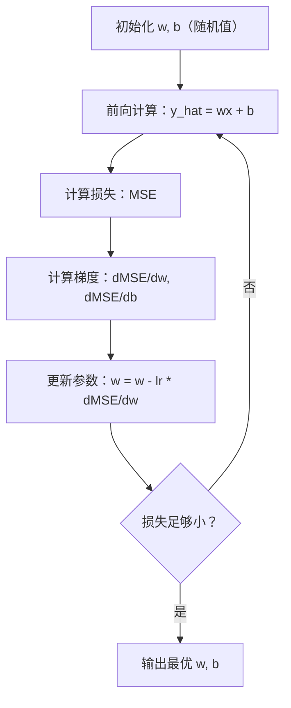

# 线性回归——机器学习的第一性原理

> 线性回归不是简单的"画一条线"。它是整个机器学习训练循环的缩影：定义模型、定义损失、优化参数。

**类型：** 实现课
**编程语言：** Python
**前置知识：** 第 01 阶段（数学基础）——向量、矩阵、梯度、优化
**预计时间：** ~90 分钟
**所处阶段：** Tier 1
**关联课程：** 第 02 阶段 · 03（逻辑回归）——从回归到分类的桥梁

---

## 🎯 学习目标

完成本课后，你能够：

- [ ] 从零实现梯度下降算法，推导均方误差（MSE）对权重和偏置的梯度
- [ ] 比较梯度下降与正规方程的计算复杂度，根据场景选择合适方法
- [ ] 实现多元线性回归，解释特征标准化对梯度下降收敛速度的影响
- [ ] 解释 Ridge（L2）和 Lasso（L1）正则化如何防止过拟合，理解稀疏性的来源
- [ ] 使用 scikit-learn 在生产环境中应用线性回归、Ridge 和 Lasso

---

## 1. 问题

你有一组房屋面积和售价的数据。朋友问："一套 120 平方米的房子大概值多少钱？"

你可以凭直觉在散点图上画一条线，然后读出预测值。但直觉不能规模化——当数据量达到百万级、特征扩展到几十个时，你需要一个系统化的方法。

线性回归给出了这个方法。更重要的是，它引入了**完整的机器学习训练循环**：

```
定义模型 → 定义损失函数 → 优化参数 → 评估性能
```

这个循环是**所有**机器学习算法的骨架。神经网络、推荐系统、大语言模型的微调——本质上都在重复这个循环。掌握线性回归，你就掌握了理解一切 ML 算法的钥匙。

线性回归在工业界的应用远不止"预测房价"：

- **需求预测**：电商平台预测商品销量，优化库存
- **A/B 测试分析**：量化新功能对转化率的影响
- **金融建模**：风险评估、信用评分
- **基线模型**：任何回归任务的起点——如果复杂模型连线性回归都比不过，说明特征工程有问题

---

## 2. 核心概念

### 2.1 模型：一条直线的数学

线性回归假设输入 $x$ 和输出 $y$ 之间存在线性关系：

$$y = wx + b$$

- $w$（权重/斜率）：$x$ 每增加 1，$y$ 变化多少
- $b$（偏置/截距）：$x = 0$ 时 $y$ 的值

当有多个特征时，模型扩展为：

$$y = w_1 x_1 + w_2 x_2 + \cdots + w_n x_n + b$$

向量形式：$\hat{y} = \mathbf{w}^T \mathbf{x} + b$

目标：找到一组 $\mathbf{w}$ 和 $b$，使得预测值 $\hat{y}$ 尽可能接近真实值 $y$。

### 2.2 损失函数：均方误差（MSE）

如何衡量"尽可能接近"？需要一个标量来量化预测的错误程度。**均方误差（MSE）** 是最常用的选择：

$$\text{MSE} = \frac{1}{n} \sum_{i=1}^{n} (\hat{y}_i - y_i)^2$$

为什么用平方？两个原因：

1. **大误差惩罚更大**：误差 10 的惩罚是误差 1 的 100 倍，不是 10 倍。这迫使模型优先修正大误差。
2. **处处可微**：平方函数光滑，梯度处处存在，便于优化。

MSE 的图像是一个**凸抛物面**（碗形）。碗底就是 MSE 最小的地方——训练的目标就是找到碗底。

### 2.3 梯度下降：沿着山坡往下走

梯度下降的核心思想：计算损失函数在当前参数处的梯度（斜率），然后沿反方向更新参数。



对于 MSE 损失，梯度的解析表达式为：

$$\frac{\partial \text{MSE}}{\partial w} = \frac{2}{n} \sum_{i=1}^{n} (\hat{y}_i - y_i) x_i$$

$$\frac{\partial \text{MSE}}{\partial b} = \frac{2}{n} \sum_{i=1}^{n} (\hat{y}_i - y_i)$$

参数更新规则：

$$w \leftarrow w - \alpha \cdot \frac{\partial \text{MSE}}{\partial w}$$

$$b \leftarrow b - \alpha \cdot \frac{\partial \text{MSE}}{\partial b}$$

其中 $\alpha$ 是**学习率**，控制每步更新的幅度。

学习率的选择至关重要：

| 学习率 | 现象 |
|--------|------|
| 太大（如 1.0） | 参数在最优解附近震荡甚至发散，损失不降反升 |
| 太小（如 0.0001） | 收敛极慢，需要数倍甚至数十倍的迭代次数 |
| 合适（如 0.01） | 损失稳步下降，最终收敛到最优解 |

### 2.4 正规方程：一步到位的解析解

对于线性回归，存在一个**封闭解**（closed-form solution），无需迭代即可直接求得最优参数：

$$\mathbf{w} = (\mathbf{X}^T \mathbf{X})^{-1} \mathbf{X}^T \mathbf{y}$$

对于单特征情况，斜率和截距的公式为：

$$w = \frac{\sum (x_i - \bar{x})(y_i - \bar{y})}{\sum (x_i - \bar{x})^2}, \quad b = \bar{y} - w\bar{x}$$

**梯度下降 vs 正规方程**：

| 维度 | 梯度下降 | 正规方程 |
|------|----------|----------|
| 计算复杂度 | $O(kn)$，$k$ 为迭代次数 | $O(n^3)$，$n$ 为特征数（矩阵求逆） |
| 适用规模 | 百万级样本、千级特征 | 万级样本、百级特征 |
| 需要学习率 | 是 | 否 |
| 收敛保证 | 凸函数下收敛到全局最优 | 直接得到全局最优 |

当特征数超过 1000 时，正规方程的矩阵求逆代价过高，梯度下降是更好的选择。

### 2.5 多元线性回归与特征标准化

当有多个特征时，模型拟合的是一个超平面而非直线。此时**特征标准化**变得关键。

如果特征量级差异巨大（如面积 500-3000 vs 卧室数 1-5），MSE 的等高线呈细长椭圆形：

```
未标准化：              标准化后：
    ↑                    ↑
    |  /‾‾‾\            |  /‾‾\
    | /     \           | |    |
    |/       \          | |    |
    +--------→          +-----→
    细长椭圆，梯度       近似圆形，梯度
    震荡前进            直指中心
```

标准化公式（Z-score）：

$$x' = \frac{x - \mu}{\sigma}$$

标准化后，梯度下降的收敛速度可以提升数倍。

### 2.6 多项式回归：用直线拟合曲线

真实关系往往不是线性的。通过构造多项式特征，线性回归可以拟合曲线：

$$y = w_1 x + w_2 x^2 + w_3 x^3 + b$$

这仍然是"线性"回归——因为模型对**权重**是线性的，只是使用了 $x$ 的非线性函数作为特征。

多项式次数越高，拟合能力越强，但过拟合风险也越大。一个 10 次多项式可以完美穿过 10 个训练点，但在新数据上可能表现极差。

### 2.7 R² 决定系数：模型解释了多少方差

MSE 的绝对值依赖于 $y$ 的量纲，难以跨数据集比较。**R² 决定系数** 提供了无量纲的评估：

$$R^2 = 1 - \frac{SS_{\text{res}}}{SS_{\text{tot}}} = 1 - \frac{\sum (y_i - \hat{y}_i)^2}{\sum (y_i - \bar{y})^2}$$

- $R^2 = 1.0$：完美预测
- $R^2 = 0.0$：模型等价于始终预测均值
- $R^2 < 0.0$：模型比预测均值还差

### 2.8 正则化：Ridge 与 Lasso

当特征多或存在多重共线性时，模型倾向于学习大权重，导致过拟合。**正则化**通过在损失函数中加入惩罚项来约束权重。

**Ridge 回归（L2 正则化）**：

$$\text{Loss} = \text{MSE} + \lambda \sum_{i=1}^{n} w_i^2$$

L2 惩罚让权重趋向小值但不为零。适用于特征都有用但需要抑制过拟合的场景。

**Lasso 回归（L1 正则化）**：

$$\text{Loss} = \text{MSE} + \lambda \sum_{i=1}^{n} |w_i|$$

L1 惩罚会让部分权重**精确为零**，等价于自动特征选择。适用于高维稀疏场景。

```
Ridge (L2):              Lasso (L1):
  ●●●●●                   ●○○●○
  ●●●●●                   ○●●○○
  所有权重缩小             部分权重为零
  无稀疏性                产生稀疏性
```

---

## 3. 从零实现

### 第 1 步：简单线性回归 + 梯度下降

```python
class LinearRegressionGD:
    """基于梯度下降的简单线性回归（单特征）。"""

    def __init__(self, learning_rate=0.01):
        self.w = 0.0  # 权重（斜率）
        self.b = 0.0  # 偏置（截距）
        self.lr = learning_rate
        self.cost_history = []

    def predict(self, X):
        """前向计算：y_hat = wx + b。"""
        return [self.w * x + self.b for x in X]

    def compute_cost(self, X, y):
        """计算均方误差 MSE = (1/n) * sum((y_hat - y)^2)。"""
        predictions = self.predict(X)
        n = len(y)
        return sum((pred - actual) ** 2 for pred, actual in zip(predictions, y)) / n

    def compute_gradients(self, X, y):
        """计算 MSE 对 w 和 b 的偏导数。

        dMSE/dw = (2/n) * sum((y_hat - y) * x)
        dMSE/db = (2/n) * sum(y_hat - y)
        """
        predictions = self.predict(X)
        n = len(y)
        dw = (2 / n) * sum((pred - actual) * x for pred, actual, x in zip(predictions, y, X))
        db = (2 / n) * sum(pred - actual for pred, actual in zip(predictions, y))
        return dw, db

    def fit(self, X, y, epochs=1000, print_every=200):
        """训练：迭代更新参数，沿梯度反方向移动。"""
        for epoch in range(epochs):
            dw, db = self.compute_gradients(X, y)
            self.w -= self.lr * dw  # 沿梯度反方向更新
            self.b -= self.lr * db
            cost = self.compute_cost(X, y)
            self.cost_history.append(cost)
            if epoch % print_every == 0:
                print(f"  Epoch {epoch:4d} | 损失: {cost:.4f} | w: {self.w:.4f} | b: {self.b:.4f}")
        return self

    def r_squared(self, X, y):
        """计算 R² 决定系数。"""
        predictions = self.predict(X)
        y_mean = sum(y) / len(y)
        ss_res = sum((actual - pred) ** 2 for actual, pred in zip(y, predictions))
        ss_tot = sum((actual - y_mean) ** 2 for actual in y)
        return 1 - (ss_res / ss_tot)
```

**为什么这样设计？** `compute_gradients` 和 `compute_cost` 分开实现，是因为梯度只需要偏导数，而成本函数值用于监控收敛。分开后便于调试和扩展。

### 第 2 步：正规方程（解析解）

```python
class LinearRegressionNormal:
    """基于正规方程的线性回归——一步到位的解析解。"""

    def __init__(self):
        self.w = 0.0
        self.b = 0.0

    def fit(self, X, y):
        """通过最小二乘法公式直接求解。

        w = sum((x_i - x_mean)(y_i - y_mean)) / sum((x_i - x_mean)^2)
        b = y_mean - w * x_mean
        """
        n = len(X)
        x_mean = sum(X) / n
        y_mean = sum(y) / n
        numerator = sum((X[i] - x_mean) * (y[i] - y_mean) for i in range(n))
        denominator = sum((X[i] - x_mean) ** 2 for i in range(n))
        self.w = numerator / denominator
        self.b = y_mean - self.w * x_mean
        return self

    def predict(self, X):
        return [self.w * x + self.b for x in X]

    def r_squared(self, X, y):
        predictions = self.predict(X)
        y_mean = sum(y) / len(y)
        ss_res = sum((actual - pred) ** 2 for actual, pred in zip(y, predictions))
        ss_tot = sum((actual - y_mean) ** 2 for actual in y)
        return 1 - (ss_res / ss_tot)
```

**为什么正规方程不需要学习率？** 因为它直接求解 $\frac{\partial \text{MSE}}{\partial w} = 0$ 的解析解，不存在迭代过程。

### 第 3 步：多元线性回归 + 特征标准化

```python
class MultipleLinearRegression:
    """基于梯度下降的多元线性回归（多特征）。"""

    def __init__(self, n_features, learning_rate=0.01):
        self.weights = [0.0] * n_features  # 每个特征一个权重
        self.bias = 0.0
        self.lr = learning_rate
        self.cost_history = []

    def predict_single(self, x):
        return sum(w * xi for w, xi in zip(self.weights, x)) + self.bias

    def predict(self, X):
        return [self.predict_single(x) for x in X]

    def compute_cost(self, X, y):
        predictions = self.predict(X)
        n = len(y)
        return sum((pred - actual) ** 2 for pred, actual in zip(predictions, y)) / n

    def fit(self, X, y, epochs=1000, print_every=200):
        n = len(y)
        n_features = len(X[0])
        for epoch in range(epochs):
            predictions = self.predict(X)
            errors = [pred - actual for pred, actual in zip(predictions, y)]
            # 对每个特征的权重计算梯度并更新
            for j in range(n_features):
                grad = (2 / n) * sum(errors[i] * X[i][j] for i in range(n))
                self.weights[j] -= self.lr * grad
            # 偏置项的梯度（不加正则化）
            grad_b = (2 / n) * sum(errors)
            self.bias -= self.lr * grad_b
            cost = self.compute_cost(X, y)
            self.cost_history.append(cost)
            if epoch % print_every == 0:
                print(f"  Epoch {epoch:4d} | 损失: {cost:.4f}")
        return self

    def r_squared(self, X, y):
        predictions = self.predict(X)
        y_mean = sum(y) / len(y)
        ss_res = sum((actual - pred) ** 2 for actual, pred in zip(y, predictions))
        ss_tot = sum((actual - y_mean) ** 2 for actual in y)
        return 1 - (ss_res / ss_tot)


def standardize(X):
    """Z-score 标准化：零均值、单位方差。

    为什么需要？当特征量级差异大时，等高线呈细长椭圆，
    梯度下降来回震荡。标准化后接近圆形，梯度直指最低点。
    """
    n_features = len(X[0])
    n_samples = len(X)
    means = [sum(X[i][j] for i in range(n_samples)) / n_samples for j in range(n_features)]
    stds = []
    for j in range(n_features):
        variance = sum((X[i][j] - means[j]) ** 2 for i in range(n_samples)) / n_samples
        stds.append(variance ** 0.5)
    X_scaled = []
    for i in range(n_samples):
        row = [(X[i][j] - means[j]) / stds[j] if stds[j] > 0 else 0 for j in range(n_features)]
        X_scaled.append(row)
    return X_scaled, means, stds
```

**为什么偏置不加正则化？** 偏置 $b$ 只是平移预测结果，不影响模型的复杂度。对 $b$ 加惩罚会导致模型欠拟合。

### 第 4 步：多项式回归

```python
class PolynomialRegression:
    """多项式回归——用多项式特征拟合非线性关系。

    模型：y = w1*x + w2*x^2 + w3*x^3 + ... + b
    仍是线性回归（对权重线性），但使用非线性特征。
    """

    def __init__(self, degree, learning_rate=0.01):
        self.degree = degree
        self.weights = [0.0] * degree
        self.bias = 0.0
        self.lr = learning_rate

    def make_features(self, X):
        """为每个 x 构造多项式特征 [x, x^2, ..., x^degree]。"""
        return [[x ** (d + 1) for d in range(self.degree)] for x in X]

    def predict(self, X):
        features = self.make_features(X)
        return [sum(w * f for w, f in zip(self.weights, row)) + self.bias for row in features]

    def fit(self, X, y, epochs=1000, print_every=200):
        features = self.make_features(X)
        n = len(y)
        for epoch in range(epochs):
            predictions = [sum(w * f for w, f in zip(self.weights, row)) + self.bias for row in features]
            errors = [pred - actual for pred, actual in zip(predictions, y)]
            for j in range(self.degree):
                grad = (2 / n) * sum(errors[i] * features[i][j] for i in range(n))
                self.weights[j] -= self.lr * grad
            grad_b = (2 / n) * sum(errors)
            self.bias -= self.lr * grad_b
            if epoch % print_every == 0:
                cost = sum(e ** 2 for e in errors) / n
                print(f"  Epoch {epoch:4d} | 损失: {cost:.6f}")
        return self

    def r_squared(self, X, y):
        predictions = self.predict(X)
        y_mean = sum(y) / len(y)
        ss_res = sum((actual - pred) ** 2 for actual, pred in zip(y, predictions))
        ss_tot = sum((actual - y_mean) ** 2 for actual in y)
        return 1 - (ss_res / ss_tot)
```

**为什么多项式回归仍是"线性"回归？** 因为模型对**权重** $w$ 是线性的。$x^2$、$x^3$ 只是特征变换，不影响优化问题的线性性质。

### 第 5 步：Ridge 回归（L2 正则化）

```python
class RidgeRegression:
    """Ridge 回归——带 L2 正则化的线性回归。

    损失 = MSE + alpha * sum(w_i^2)
    梯度 = dMSE/dw + 2 * alpha * w
    """

    def __init__(self, n_features, learning_rate=0.01, alpha=1.0):
        self.weights = [0.0] * n_features
        self.bias = 0.0
        self.lr = learning_rate
        self.alpha = alpha  # 正则化强度

    def predict_single(self, x):
        return sum(w * xi for w, xi in zip(self.weights, x)) + self.bias

    def predict(self, X):
        return [self.predict_single(x) for x in X]

    def fit(self, X, y, epochs=1000, print_every=200):
        n = len(y)
        n_features = len(X[0])
        for epoch in range(epochs):
            predictions = self.predict(X)
            errors = [pred - actual for pred, actual in zip(predictions, y)]
            mse = sum(e ** 2 for e in errors) / n
            reg_term = self.alpha * sum(w ** 2 for w in self.weights)
            cost = mse + reg_term
            for j in range(n_features):
                grad = (2 / n) * sum(errors[i] * X[i][j] for i in range(n))
                grad += 2 * self.alpha * self.weights[j]  # L2 惩罚的梯度
                self.weights[j] -= self.lr * grad
            grad_b = (2 / n) * sum(errors)  # 偏置不加正则化
            self.bias -= self.lr * grad_b
            if epoch % print_every == 0:
                print(f"  Epoch {epoch:4d} | 损失: {cost:.4f} | L2惩罚: {reg_term:.4f}")
        return self
```

**为什么 L2 惩罚的梯度是 $2\alpha w$？** 因为 $\frac{d}{dw}(\alpha w^2) = 2\alpha w$。这个梯度始终指向零，推动权重向零收缩。

### 第 6 步：Lasso 回归（L1 正则化）

```python
class LassoRegression:
    """Lasso 回归——带 L1 正则化的线性回归。

    损失 = MSE + alpha * sum(|w_i|)
    梯度 = dMSE/dw + alpha * sign(w)
    关键区别：L1 惩罚会让部分权重精确为零（稀疏性）。
    """

    def __init__(self, n_features, learning_rate=0.01, alpha=1.0):
        self.weights = [0.0] * n_features
        self.bias = 0.0
        self.lr = learning_rate
        self.alpha = alpha

    def predict_single(self, x):
        return sum(w * xi for w, xi in zip(self.weights, x)) + self.bias

    def predict(self, X):
        return [self.predict_single(x) for x in X]

    def fit(self, X, y, epochs=1000, print_every=200):
        n = len(y)
        n_features = len(X[0])
        for epoch in range(epochs):
            predictions = self.predict(X)
            errors = [pred - actual for pred, actual in zip(predictions, y)]
            mse = sum(e ** 2 for e in errors) / n
            reg_term = self.alpha * sum(abs(w) for w in self.weights)
            cost = mse + reg_term
            for j in range(n_features):
                grad = (2 / n) * sum(errors[i] * X[i][j] for i in range(n))
                # L1 惩罚的梯度是 sign(w)，在 0 处取 0
                grad += self.alpha * (1 if self.weights[j] > 0 else (-1 if self.weights[j] < 0 else 0))
                self.weights[j] -= self.lr * grad
            grad_b = (2 / n) * sum(errors)
            self.bias -= self.lr * grad_b
            if epoch % print_every == 0:
                print(f"  Epoch {epoch:4d} | 损失: {cost:.4f} | L1惩罚: {reg_term:.4f}")
        return self
```

**为什么 L1 会产生稀疏解？** L1 惩罚的梯度是常数 $\pm\alpha$（不依赖于 $w$ 的大小），所以即使 $w$ 很小，每次更新也会向零推动 $\alpha$。当 $w$ 接近零时，这个恒定的推力会把 $w$ 精确压到零。而 L2 的梯度 $2\alpha w$ 随 $w$ 变小而变小，永远不会把 $w$ 精确压到零。

---

## 4. 工业工具

### 4.1 scikit-learn 实现

```python
from sklearn.linear_model import LinearRegression, Ridge, Lasso
from sklearn.preprocessing import PolynomialFeatures, StandardScaler
from sklearn.model_selection import train_test_split
from sklearn.metrics import mean_squared_error, r2_score
import numpy as np

np.random.seed(42)
X = np.random.uniform(0, 10, (100, 1))
y = 3.0 * X.squeeze() + 7.0 + np.random.normal(0, 2.0, 100)

X_train, X_test, y_train, y_test = train_test_split(X, y, test_size=0.2, random_state=42)

# 普通线性回归
lr = LinearRegression()
lr.fit(X_train, y_train)
print(f"系数: {lr.coef_[0]:.4f}, 截距: {lr.intercept_:.4f}")
print(f"测试集 R²: {r2_score(y_test, lr.predict(X_test)):.4f}")

# 多项式回归
poly = PolynomialFeatures(degree=2, include_bias=False)
X_poly_train = poly.fit_transform(X_train)
X_poly_test = poly.transform(X_test)
lr_poly = LinearRegression()
lr_poly.fit(X_poly_train, y_train)
print(f"2 次多项式 R²: {r2_score(y_test, lr_poly.predict(X_poly_test)):.4f}")

# Ridge 回归
scaler = StandardScaler()
X_train_scaled = scaler.fit_transform(X_train)
X_test_scaled = scaler.transform(X_test)
ridge = Ridge(alpha=1.0)
ridge.fit(X_train_scaled, y_train)
print(f"Ridge R²: {r2_score(y_test, ridge.predict(X_test_scaled)):.4f}")

# Lasso 回归
lasso = Lasso(alpha=1.0)
lasso.fit(X_train_scaled, y_train)
print(f"Lasso R²: {r2_score(y_test, lasso.predict(X_test_scaled)):.4f}")
print(f"Lasso 系数: {lasso.coef_}（部分可能为零）")
```

### 4.2 性能对比

| 实现方式 | 速度 | 数值稳定性 | 适用场景 |
|----------|------|------------|----------|
| 从零实现（Python 循环） | 慢 | 一般 | 学习理解 |
| scikit-learn | 快 | 高 | 生产环境 |
| PyTorch + GPU | 极快 | 高 | 大规模训练 |

### 4.3 何时使用哪种方法

| 场景 | 推荐方法 | 理由 |
|------|----------|------|
| 特征数 < 100，样本 < 10K | 正规方程 | 一步到位，无需调学习率 |
| 特征数 > 1000 或样本 > 100K | 梯度下降（SGD） | 避免 $O(n^3)$ 矩阵求逆 |
| 特征多且有多重共线性 | Ridge 回归 | L2 惩罚稳定求解 |
| 高维稀疏特征（如文本） | Lasso 或 ElasticNet | L1 惩罚自动特征选择 |
| 需要拟合非线性关系 | 多项式回归 + 正则化 | 控制复杂度防止过拟合 |

---

## 5. 知识连线

本课学习的线性回归训练循环，是后续所有机器学习课程的基础：

- **第 02 阶段 · 03（逻辑回归）**：将线性回归的实值输出通过 Sigmoid 函数映射为概率，实现分类——损失函数从 MSE 变为交叉熵，但训练循环完全相同
- **第 03 阶段（深度学习核心）**：神经网络的每一层本质上就是多个线性回归 + 激活函数，反向传播是梯度下降在高维参数空间中的推广
- **第 09 阶段（强化学习）**：价值函数估计常用线性回归作为函数逼近器，是理解深度强化学习的前置知识

---

## 6. 工程最佳实践

### 6.1 工业界常用方案

| 场景 | 推荐方案 | 备注 |
|------|----------|------|
| 快速基线 | `sklearn.linear_model.LinearRegression` | 开箱即用，基于 LAPACK 的 SVD 分解，数值稳定 |
| 特征多/共线性 | `sklearn.linear_model.RidgeCV` | 自动交叉验证选择最优 alpha |
| 高维稀疏 | `sklearn.linear_model.LassoCV` 或 `ElasticNetCV` | 自动特征选择 |
| 大规模数据 | `sklearn.linear_model.SGDRegressor` | 支持在线学习，内存友好 |
| 生产部署 | ONNX 导出 + TensorRT | 线性模型推理极快，可嵌入 C++ 服务 |

### 6.2 中文场景特别建议

- **房价预测**：中国各城市房价量级差异巨大（一线 vs 三线），务必对目标变量取对数后再回归，避免大值主导损失
- **特征工程**：中文地址、小区名称等类别特征，使用目标编码（Target Encoding）而非 One-Hot，避免维度爆炸
- **时间序列**：电商销量预测中，加入"是否节假日"、"是否双十一"等布尔特征，效果显著提升

### 6.3 踩坑经验

- **未标准化就训练多元回归**：梯度下降不收敛或收敛极慢。始终先做 `StandardScaler`
- **在测试集上 fit 标准化器**：数据泄露！标准化器只能在训练集上 fit，然后 transform 测试集
- **忽略多重共线性**：两个高度相关的特征（如"平方米"和"平方英尺"）会导致权重不稳定，使用 Ridge 或删除其一
- **多项式次数过高**：10 次以上多项式在边界处剧烈震荡（龙格现象），配合 Ridge 使用或限制次数 ≤ 5
- **R² 高就上线**：训练集 R² 高可能是过拟合。始终看测试集 R²，并检查残差分布

---

## 7. 常见错误

### 错误 1：学习率过大导致发散

**现象：** 训练过程中损失先下降后突然飙升，最终变成 `inf` 或 `NaN`。

**原因：** 学习率过大，参数更新步幅超过最优解，在损失曲面上来回弹跳，越弹越远。

**修复：**

```python
# ❌ 学习率过大
model = LinearRegressionGD(learning_rate=1.0)

# ✅ 从较小值开始，观察损失曲线
model = LinearRegressionGD(learning_rate=0.01)
# 如果损失不下降，尝试 0.001；如果下降太慢，尝试 0.05
```

### 错误 2：忘记标准化特征

**现象：** 多元线性回归训练 1000 轮后损失仍在高位，且不同特征的权重量级差异巨大。

**原因：** 特征量级差异导致损失曲面细长椭圆，梯度下降沿壁震荡，无法快速到达中心。

**修复：**

```python
# ❌ 直接训练
model.fit(X_raw, y)

# ✅ 先标准化
X_scaled, means, stds = standardize(X_raw)
model.fit(X_scaled, y)
# 预测时对新数据也要用相同的 means 和 stds 做标准化
```

### 错误 3：在测试集上 fit 标准化器

**现象：** 模型在测试集上表现异常好，但上线后效果很差。

**原因：** 标准化器的均值和标准差包含了测试集信息，造成数据泄露。

**修复：**

```python
# ❌ 数据泄露
scaler.fit(X_all)  # 包含了测试集
X_test_scaled = scaler.transform(X_test)

# ✅ 只用训练集 fit
scaler.fit(X_train)
X_test_scaled = scaler.transform(X_test)
```

### 错误 4：对偏置项加正则化

**现象：** 模型预测结果整体偏移，所有预测值都偏高或偏低。

**原因：** 对偏置 $b$ 加 L2 惩罚，迫使 $b$ 趋向零，导致模型无法学习数据的基线值。

**修复：**

```python
# ❌ 偏置也加正则化
reg_term = alpha * (sum(w ** 2 for w in weights) + bias ** 2)

# ✅ 只对权重加正则化
reg_term = alpha * sum(w ** 2 for w in weights)
# 偏置的更新不加正则化梯度
```

### 错误 5：多项式次数过高导致过拟合

**现象：** 训练集 $R^2 = 0.99$，测试集 $R^2 = 0.3$。

**原因：** 高次多项式过度拟合训练数据中的噪声，泛化能力差。

**修复：**

```python
# ❌ 10 次多项式
poly = PolynomialRegression(degree=10)

# ✅ 使用较低次数 + Ridge 正则化
from sklearn.linear_model import Ridge
from sklearn.preprocessing import PolynomialFeatures
poly = PolynomialFeatures(degree=3)  # 限制次数
X_poly = poly.fit_transform(X)
model = Ridge(alpha=1.0)  # 加正则化
model.fit(X_poly, y)
```

---

## 8. 面试考点

### Q1：梯度下降和正规方程的区别是什么？各自适用场景？（难度：⭐⭐）

**参考答案：**

梯度下降通过迭代更新参数逐步逼近最优解，计算复杂度为 $O(kn)$（$k$ 为迭代次数），适用于大规模数据集和特征数较多的场景。正规方程通过解析解 $\mathbf{w} = (\mathbf{X}^T\mathbf{X})^{-1}\mathbf{X}^T\mathbf{y}$ 一步求解，计算复杂度为 $O(n^3)$（$n$ 为特征数），适用于特征数较少（< 1000）的场景。当特征数超过 1000 时，矩阵求逆的代价过高，梯度下降更高效。

### Q2：为什么 MSE 使用平方误差而不是绝对误差？（难度：⭐⭐）

**参考答案：**

两个原因：(1) 平方误差对大误差的惩罚更大（误差 10 的惩罚是误差 1 的 100 倍），迫使模型优先修正大误差；(2) 平方函数处处可微，梯度处处存在，便于使用梯度下降优化。绝对误差在零点不可微，优化更复杂。但绝对误差（MAE）对异常值更鲁棒，在异常值多的场景下可以考虑。

### Q3：Ridge 和 Lasso 正则化的核心区别？为什么 L1 会产生稀疏解？（难度：⭐⭐⭐）

**参考答案：**

Ridge（L2）惩罚 $\lambda \sum w_i^2$，梯度为 $2\lambda w$，随 $w$ 变小而变小，权重趋向小值但不为零。Lasso（L1）惩罚 $\lambda \sum |w_i|$，梯度为 $\lambda \cdot \text{sign}(w)$，是恒定大小，即使 $w$ 很小也会向零推动，最终把不重要的特征权重精确压到零。几何上，L1 的约束区域是菱形，最优解容易落在顶点（某些维度为零）；L2 的约束区域是圆形，最优解几乎不会恰好在坐标轴上。

### Q4：手写梯度下降更新公式（难度：⭐⭐）

**参考答案：**

给定 MSE 损失 $L = \frac{1}{n}\sum(\hat{y}_i - y_i)^2$，其中 $\hat{y}_i = wx_i + b$：

$$\frac{\partial L}{\partial w} = \frac{2}{n}\sum_{i=1}^{n}(\hat{y}_i - y_i)x_i, \quad \frac{\partial L}{\partial b} = \frac{2}{n}\sum_{i=1}^{n}(\hat{y}_i - y_i)$$

更新规则：$w \leftarrow w - \alpha \frac{\partial L}{\partial w}$，$b \leftarrow b - \alpha \frac{\partial L}{\partial b}$。

### Q5：多项式回归中，如何判断过拟合？如何缓解？（难度：⭐⭐⭐）

**参考答案：**

判断：训练集 $R^2$ 很高（如 0.99）但测试集 $R^2$ 显著较低（如 0.5），或两者差距超过 0.1-0.2。缓解方法：(1) 降低多项式次数；(2) 加入 Ridge 或 Lasso 正则化；(3) 增加训练数据量；(4) 使用交叉验证选择最优次数。

---

## 🔑 关键术语

| 术语 | 人们怎么说 | 实际含义 |
|------|------------|----------|
| 线性回归 | "画一条线穿过数据" | 找到使预测值与真实值之差的平方和最小的权重 $w$ 和偏置 $b$ |
| 均方误差（MSE）| "平均误差的平方" | $\frac{1}{n}\sum(\hat{y} - y)^2$，对大误差惩罚更重的损失函数 |
| 梯度下降 | "沿着山坡往下走" | 通过计算损失函数的梯度，沿反方向迭代更新参数的优化算法 |
| 学习率 | "步长" | 控制每次参数更新幅度的超参数，过大导致发散，过小导致收敛慢 |
| 正规方程 | "直接解出来" | $\mathbf{w} = (\mathbf{X}^T\mathbf{X})^{-1}\mathbf{X}^T\mathbf{y}$，无需迭代的解析解 |
| R² 决定系数 | "模型有多好" | 模型解释的方差占总方差的比例，1.0 为完美，0.0 等价于预测均值 |
| 特征标准化 | "让特征可比" | 将特征缩放到零均值单位方差，使梯度下降收敛更快 |
| 正则化 | "惩罚复杂度" | 在损失函数中加入约束项，抑制大权重，防止过拟合 |
| Ridge 回归 | "L2 正则化" | 加入 $\lambda \sum w_i^2$ 惩罚，权重趋向小值但不为零 |
| Lasso 回归 | "L1 正则化" | 加入 $\lambda \sum \|w_i\|$ 惩罚，部分权重精确为零（稀疏性）|
| 过拟合 | "背答案" | 模型过度拟合训练数据中的噪声，在新数据上表现差 |

---

## 📚 小结

线性回归是机器学习训练循环的原型——定义模型、定义损失、优化参数。你从零实现了梯度下降、正规方程、多元回归、多项式回归以及 Ridge/Lasso 正则化，理解了特征标准化、过拟合、稀疏性等核心概念。

下一课我们将把线性回归的实值输出通过 Sigmoid 函数映射为概率，实现分类任务——逻辑回归。

---

## ✏️ 练习

1. 【实现】在 `LinearRegressionGD` 基础上实现**随机梯度下降（SGD）**：每次只用一个样本计算梯度并更新。对比批量梯度下降和 SGD 的收敛曲线，观察 SGD 的震荡现象。

2. 【实验】生成三次函数数据 $y = 2x^3 - 3x^2 + x + 5 + \epsilon$，分别用 1 次、3 次、10 次多项式拟合。记录训练集和测试集 $R^2$，在多少次时过拟合变得明显？

3. 【思考】Ridge 回归有解析解 $\mathbf{w} = (\mathbf{X}^T\mathbf{X} + \lambda\mathbf{I})^{-1}\mathbf{X}^T\mathbf{y}$。对比 L2 正则化前后的矩阵 $\mathbf{X}^T\mathbf{X}$，解释为什么加入 $\lambda\mathbf{I}$ 能改善矩阵的条件数（condition number）。

4. 【实现】实现 ElasticNet 回归（L1 + L2 组合惩罚）：损失 = MSE + $\lambda_1 \sum\|w_i\|$ + $\lambda_2 \sum w_i^2$。在 scikit-learn 的 `ElasticNet` 上验证你的实现。

---

## 🚀 产出

| 产出 | 文件 | 说明 |
|------|------|------|
| 完整线性回归实现 | `code/main.py` | 梯度下降、正规方程、多元回归、多项式回归、Ridge、Lasso |
| 可复用提示词 | `outputs/prompt-linear-regression-tutor.md` | 线性回归方法选择决策助手 |

---

## 📖 参考资料

1. [论文] Hastie, Tibshirani, Friedman. "The Elements of Statistical Learning". Springer, 2009. https://hastie.su.domains/ElemStatLearn/（第 3 章：线性回归方法）
2. [书籍] James, Witten, Hastie, Tibshirani. "An Introduction to Statistical Learning". Springer, 2021. https://www.statlearning.com/（第 3 章：线性回归，免费 PDF）
3. [官方文档] scikit-learn. "Linear Models". https://scikit-learn.org/stable/modules/linear_model.html
4. [论文] Tibshirani. "Regression Shrinkage and Selection via the Lasso". Journal of the Royal Statistical Society, 1996. https://doi.org/10.1111/j.2517-6161.1996.tb02080.x
5. [论文] Hoerl, Kennard. "Ridge Regression: Biased Estimation for Nonorthogonal Problems". Technometrics, 1970. https://doi.org/10.1080/00401706.1970.10488634

---

> 本课程参考了 AI Engineering From Scratch（MIT License）的课程体系，在此基础上进行了重构和原创内容的扩充。所有中文表达、案例、LLM 视角分析、工程最佳实践、常见错误、面试考点等均为原创内容。
