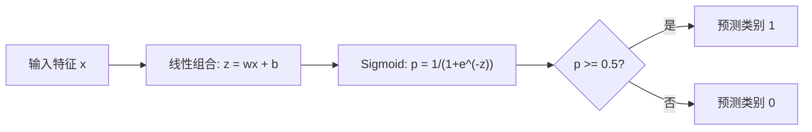
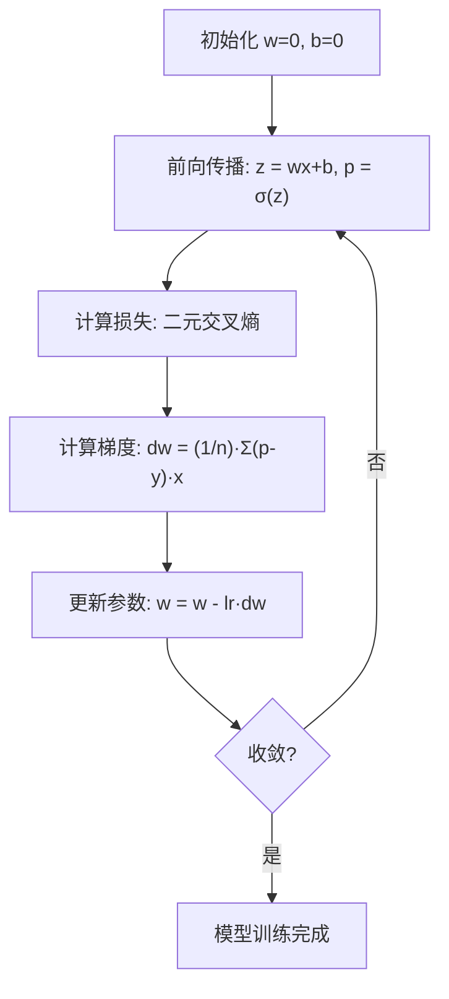

# 逻辑回归

> 一条直线弯成 S 曲线，就能用概率回答"是或否"的问题。

**类型：** 实现课
**语言：** Python
**前置知识：** 阶段 02 · 01（什么是机器学习）、阶段 02 · 02（线性回归）
**预计时间：** ~90 分钟
**所处阶段：** Tier 1
**关联课程：** 阶段 03 · 01（感知机与神经网络）— 逻辑回归是单层神经网络的雏形

---

## 🎯 学习目标

完成本课后，你能够：

- [ ] 从零实现逻辑回归，理解 Sigmoid 函数如何将线性输出映射为概率
- [ ] 解释为什么分类问题不能用均方误差（MSE），以及二元交叉熵损失为何是凸函数
- [ ] 实现并解释精确率、召回率、F1 分数和混淆矩阵，根据业务场景选择合适的指标
- [ ] 从零实现 Softmax 回归，扩展到多分类场景
- [ ] 理解决策边界的含义，并能根据业务需求调整分类阈值

---

## 1. 问题

你正在构建一个肿瘤良恶性预测系统。输入是肿瘤尺寸，输出应该是"恶性"或"良性"。

你先用线性回归试了一下。模型输出 0.3、1.7、-0.5 这样的数字。什么意思？1.7 代表"非常恶性"吗？-0.5 代表"非常良性"吗？线性回归的输出没有上界和下界，它根本不知道"概率"是什么。

更糟糕的是，一个极端异常值（比如某个患者肿瘤尺寸特别大）会把整条直线拉偏，导致所有人的预测都出问题。

分类问题需要的是：

- 输出在 0 到 1 之间（概率）
- 一个清晰的决策边界（是或否）
- 对远离边界的异常值不敏感

逻辑回归解决了这个问题。它把线性回归的输出通过一个 S 形函数（Sigmoid）压缩到 (0, 1)，输出的是一个概率值。设定一个阈值（通常 0.5），就完成了分类。

尽管名字里有"回归"二字，逻辑回归是一个**分类算法**。名字来源于它使用的逻辑函数（Logistic Function，即 Sigmoid 函数），与回归分析无关。

---

## 2. 概念

### 2.1 为什么线性回归不适合分类

想象一个场景：根据学习小时数预测考试是否通过（1 = 通过，0 = 未通过）。

```
学习时长（小时）:  1   2   3   4   5   6   7   8   9   10
是否通过:         0   0   0   0   1   1   1   1   1   1
```

线性回归拟合出一条直线。在 1 小时处预测值可能是 -0.2，在 10 小时处可能是 1.3。这些值不是概率——它们小于 0 或大于 1。更糟的是，如果有一个学了 50 小时的异常样本，整条直线都会被拉偏。

分类需要的函数必须满足：

- 输出在 0 到 1 之间（概率的数学定义）
- 在边界处有清晰的过渡（决策边界）
- 对远离边界的异常值不敏感

### 2.2 Sigmoid 函数

Sigmoid 函数（也叫逻辑函数）恰好满足这些要求：

$$
\sigma(z) = \frac{1}{1 + e^{-z}}
$$

关键性质：

- 当 $z \to +\infty$ 时，$\sigma(z) \to 1$
- 当 $z \to -\infty$ 时，$\sigma(z) \to 0$
- 当 $z = 0$ 时，$\sigma(z) = 0.5$
- 输出始终在 (0, 1) 之间
- 函数处处光滑可微

导数有一个非常简洁的形式：

$$
\sigma'(z) = \sigma(z) \cdot (1 - \sigma(z))
$$

这使得梯度计算非常高效——你只需要计算一次 Sigmoid，就能同时得到函数值和导数值。

### 2.3 逻辑回归 = 线性模型 + Sigmoid

逻辑回归的模型结构：



输出 $p$ 被解释为 $P(y=1|x)$——给定输入 $x$ 时样本属于类别 1 的概率。决策边界就是 $wx + b = 0$ 的位置，此时 Sigmoid 输出恰好 0.5。

### 2.4 二元交叉熵损失

逻辑回归不能用均方误差（MSE）。MSE 配合 Sigmoid 会产生一个非凸的代价曲面，有多个局部最小值，梯度下降容易卡住。

逻辑回归使用的是**二元交叉熵损失**（Binary Cross-Entropy Loss，也叫对数损失）：

$$
L = -\frac{1}{n} \sum_{i=1}^{n} \left[ y_i \log(p_i) + (1-y_i) \log(1-p_i) \right]
$$

直觉理解：

| 真实标签 $y$ | 预测概率 $p$ | 损失 |
|---|---|---|
| 1 | 接近 1 | $\log(1) = 0$（预测正确，损失低） |
| 1 | 接近 0 | $\log(0) \to -\infty$（预测错误，损失极高） |
| 0 | 接近 0 | $\log(1) = 0$（预测正确，损失低） |
| 0 | 接近 1 | $\log(0) \to -\infty$（预测错误，损失极高） |

这个损失函数对逻辑回归是凸的，保证只有一个全局最小值。

### 2.5 梯度下降更新规则

二元交叉熵配合 Sigmoid 的梯度形式非常简洁：

$$
\frac{\partial L}{\partial w} = \frac{1}{n} \sum_{i=1}^{n} (p_i - y_i) x_i
$$

$$
\frac{\partial L}{\partial b} = \frac{1}{n} \sum_{i=1}^{n} (p_i - y_i)
$$

注意：这个形式与线性回归的梯度看起来完全一样。区别在于 $p_i = \sigma(wx + b)$ 而不是 $p_i = wx + b$。Sigmoid 引入了非线性，但梯度更新规则保持不变。



### 2.6 决策边界

对于二维输入（两个特征），决策边界是满足以下条件的直线：

$$
w_1 x_1 + w_2 x_2 + b = 0
$$

直线一侧的点被分为类别 1，另一侧为类别 0。逻辑回归**总是产生线性决策边界**。如果需要曲线边界，要么添加多项式特征，要么使用非线性模型。

### 2.7 多分类：Softmax 回归

二分类用 Sigmoid，多分类用 Softmax。对于 $K$ 个类别，Softmax 函数为：

$$
\text{softmax}(z_i) = \frac{e^{z_i}}{\sum_{j=1}^{K} e^{z_j}}
$$

每个类别有自己的权重向量。模型计算每个类别的分数 $z_i$，Softmax 将其转换为概率分布（所有概率之和为 1）。预测类别是概率最高的那个。

对应的损失函数是**类别交叉熵**：

$$
L = -\frac{1}{n} \sum_{i=1}^{n} \sum_{k=1}^{K} y_{ik} \log(p_{ik})
$$

其中 $y_{ik}$ 是 one-hot 编码（真实类别为 1，其余为 0）。

### 2.8 评估指标

准确率在类别不平衡时会产生误导。一个 95% 负例的数据集，模型全部预测为负例就能获得 95% 准确率，但毫无用处。

**混淆矩阵：**

| | 预测正类 | 预测负类 |
|---|---|---|
| **真实正类** | 真正例 (TP) | 假负例 (FN) |
| **真实负类** | 假正例 (FP) | 真负例 (TN) |

**精确率（Precision）**：预测为正类的样本中，真正为正类的比例。

$$
\text{Precision} = \frac{TP}{TP + FP}
$$

**召回率（Recall）**：真实为正类的样本中，被正确预测的比例。

$$
\text{Recall} = \frac{TP}{TP + FN}
$$

**F1 分数**：精确率和召回率的调和平均，平衡两个指标。

$$
F1 = 2 \cdot \frac{\text{Precision} \cdot \text{Recall}}{\text{Precision} + \text{Recall}}
$$

何时优先哪个指标：

- **精确率优先**：假正例代价高时（如垃圾邮件过滤，不想误杀正常邮件）
- **召回率优先**：假负例代价高时（如癌症筛查，不想漏诊）
- **F1 优先**：需要单一综合指标时

---

## 3. 从零实现

### 第 1 步：Sigmoid 函数与数据生成

```python
import math
import random

def sigmoid(z):
    """Sigmoid 函数：将任意实数映射到 (0, 1) 区间。"""
    # 裁剪 z 的范围防止 exp 溢出
    z = max(-500, min(500, z))
    return 1.0 / (1.0 + math.exp(-z))

# 生成两个高斯分布簇的数据
random.seed(42)
N = 200
X, y = [], []

for _ in range(N // 2):
    X.append([random.gauss(2, 1), random.gauss(2, 1)])
    y.append(0)

for _ in range(N // 2):
    X.append([random.gauss(5, 1), random.gauss(5, 1)])
    y.append(1)
```

为什么裁剪 z？当 $z < -500$ 时，$e^{-z}$ 会超出浮点数范围导致溢出。裁剪是数值稳定性的基本技巧。

### 第 2 步：逻辑回归模型

```python
class LogisticRegression:
    def __init__(self, n_features, learning_rate=0.01):
        self.weights = [0.0] * n_features
        self.bias = 0.0
        self.lr = learning_rate
        self.loss_history = []

    def predict_proba(self, x):
        """预测属于类别 1 的概率。"""
        z = sum(w * xi for w, xi in zip(self.weights, x)) + self.bias
        return sigmoid(z)

    def predict(self, x, threshold=0.5):
        """根据阈值预测类别。"""
        return 1 if self.predict_proba(x) >= threshold else 0

    def compute_loss(self, X, y):
        """二元交叉熵损失。"""
        n = len(y)
        total = 0.0
        for i in range(n):
            p = self.predict_proba(X[i])
            p = max(1e-15, min(1 - 1e-15, p))  # 防止 log(0)
            total += y[i] * math.log(p) + (1 - y[i]) * math.log(1 - p)
        return -total / n

    def fit(self, X, y, epochs=1000, print_every=200):
        """批量梯度下降训练。"""
        n = len(y)
        n_features = len(X[0])
        for epoch in range(epochs):
            dw = [0.0] * n_features
            db = 0.0
            for i in range(n):
                p = self.predict_proba(X[i])
                error = p - y[i]
                for j in range(n_features):
                    dw[j] += error * X[i][j]
                db += error
            for j in range(n_features):
                self.weights[j] -= self.lr * (dw[j] / n)
            self.bias -= self.lr * (db / n)
            loss = self.compute_loss(X, y)
            self.loss_history.append(loss)
```

为什么用 `error = p - y` 而不是 `y - p`？因为交叉熵对 $w$ 求导后，梯度恰好是 $(p - y) \cdot x$。如果反过来，更新方向就反了。

### 第 3 步：分类评估指标

```python
class ClassificationMetrics:
    def __init__(self, y_true, y_pred):
        self.tp = sum(1 for t, p in zip(y_true, y_pred) if t == 1 and p == 1)
        self.tn = sum(1 for t, p in zip(y_true, y_pred) if t == 0 and p == 0)
        self.fp = sum(1 for t, p in zip(y_true, y_pred) if t == 0 and p == 1)
        self.fn = sum(1 for t, p in zip(y_true, y_pred) if t == 1 and p == 0)

    def precision(self):
        denom = self.tp + self.fp
        return self.tp / denom if denom > 0 else 0

    def recall(self):
        denom = self.tp + self.fn
        return self.tp / denom if denom > 0 else 0

    def f1(self):
        p, r = self.precision(), self.recall()
        return 2 * p * r / (p + r) if (p + r) > 0 else 0
```

为什么分母要检查是否为 0？当模型没有预测任何正例时（TP + FP = 0），精确率无定义。返回 0 是合理的默认行为。

### 第 4 步：决策边界分析

```python
w1, w2 = model.weights
b = model.bias
print(f"决策边界: {w1:.4f}*x1 + {w2:.4f}*x2 + {b:.4f} = 0")
# 解出 x2: x2 = (-w1/w2)*x1 + (-b/w2)
print(f"x2 = {-w1/w2:.4f}*x1 + {-b/w2:.4f}")
```

决策边界是线性方程。在二维空间中它是一条直线，在三维空间中它是一个平面，在高维空间中它是一个超平面。

### 第 5 步：多分类 Softmax 回归

```python
class SoftmaxRegression:
    def __init__(self, n_features, n_classes, learning_rate=0.01):
        self.n_classes = n_classes
        self.lr = learning_rate
        # 每个类别有独立的权重向量
        self.weights = [[0.0] * n_features for _ in range(n_classes)]
        self.biases = [0.0] * n_classes

    def softmax(self, scores):
        """Softmax：将分数转换为概率分布。"""
        max_score = max(scores)  # 减去最大值防止 exp 溢出
        exp_scores = [math.exp(s - max_score) for s in scores]
        total = sum(exp_scores)
        return [e / total for e in exp_scores]

    def predict_proba(self, x):
        scores = [
            sum(self.weights[k][j] * x[j] for j in range(len(x))) + self.biases[k]
            for k in range(self.n_classes)
        ]
        return self.softmax(scores)

    def predict(self, x):
        probs = self.predict_proba(x)
        return probs.index(max(probs))
```

为什么 Softmax 要先减去最大值？$e^{1000}$ 会溢出，但 $e^{1000-1000} = e^0 = 1$ 不会。减去最大值不改变 Softmax 的结果（分子分母同时缩放），但保证了数值稳定性。

### 第 6 步：阈值调优

```python
thresholds = [0.3, 0.4, 0.5, 0.6, 0.7]
for t in thresholds:
    y_pred_t = [1 if model.predict_proba(x) >= t else 0 for x in X_test]
    m = ClassificationMetrics(y_test, y_pred_t)
    print(f"阈值 {t:.1f} -> 精确率: {m.precision():.4f}, 召回率: {m.recall():.4f}")
```

降低阈值 → 更多样本被预测为正类 → 召回率上升、精确率下降。升高阈值则相反。根据业务需求选择最优阈值。

---

## 4. 工业工具

### 4.1 scikit-learn 实现

```python
from sklearn.linear_model import LogisticRegression as SklearnLR
from sklearn.metrics import classification_report, confusion_matrix
from sklearn.model_selection import train_test_split
from sklearn.preprocessing import StandardScaler
import numpy as np

# 数据准备
np.random.seed(42)
X = np.vstack([np.random.randn(100, 2) + [2, 2],
               np.random.randn(100, 2) + [5, 5]])
y = np.array([0] * 100 + [1] * 100)

# 先划分，再标准化（防止数据泄露）
X_train, X_test, y_train, y_test = train_test_split(X, y, test_size=0.2)

# 标准化：逻辑回归对特征尺度敏感
scaler = StandardScaler()
X_train = scaler.fit_transform(X_train)
X_test = scaler.transform(X_test)

# 训练
model = SklearnLR()
model.fit(X_train, y_train)

# 评估
y_pred = model.predict(X_test)
print(classification_report(y_test, y_pred))
```

### 4.2 关键参数对比

| 参数 | 作用 | 推荐设置 |
|---|---|---|
| `C` | 正则化强度的倒数（越小正则化越强） | 默认 1.0，网格搜索调优 |
| `penalty` | 正则化类型 | `'l2'` 通用，`'l1'` 特征选择 |
| `solver` | 优化算法 | `'lbfgs'` 默认，`'saga'` 支持 L1 |
| `class_weight` | 类别权重 | `'balanced'` 处理不平衡数据 |
| `max_iter` | 最大迭代次数 | 默认 100，不收敛时增大 |

### 4.3 性能对比

| 实现方式 | 速度 | 适用场景 |
|---|---|---|
| 从零实现（纯 Python） | 慢 | 学习理解原理 |
| scikit-learn | 快 | 生产环境、中小规模数据 |
| PyTorch + GPU | 极快 | 大规模数据、深度学习流水线 |

---

## 5. 知识连线

本课学习的逻辑回归，是后续多个阶段的基石：

- **阶段 03（深度学习核心）**：逻辑回归加上隐藏层就变成了神经网络，Sigmoid 激活函数是最早使用的激活函数之一
- **阶段 05（NLP 基础）**：文本分类（情感分析、垃圾邮件检测）的首选基线模型就是逻辑回归 + TF-IDF
- **阶段 10（大语言模型从零）**：语言模型的输出层本质上就是一个 Softmax 回归——在词表上做多分类

---

## 6. 工程最佳实践

### 6.1 工业界常用方案

| 场景 | 推荐方案 | 备注 |
|---|---|---|
| 快速基线 | scikit-learn `LogisticRegression` | 训练秒级完成，可解释性强 |
| 高维稀疏特征（文本） | `SGDClassifier(loss='log_loss')` | 支持在线学习，内存友好 |
| 需要概率校准 | `LogisticRegression` + `CalibratedClassifierCV` | 确保输出概率可靠 |
| 类别不平衡 | `class_weight='balanced'` | 自动按类别频率调整权重 |
| 大规模数据 | PyTorch + GPU | 配合 DataLoader 处理百万级样本 |

### 6.2 中文场景特别建议

- 中文文本分类时，先做分词再提取 TF-IDF 特征，逻辑回归通常能达到 85%+ 的准确率，作为基线足够
- 中文情感分析中，注意否定词处理（"不 好" vs "好"），建议使用 bigram 特征
- 中文类别不平衡场景（如欺诈检测），优先使用 `class_weight='balanced'` 而不是过采样

### 6.3 踩坑经验

- 忘记标准化特征：逻辑回归使用梯度下降，未标准化的特征会导致收敛慢且决策边界偏移
- 用测试集调阈值：阈值应该在验证集上调，否则是数据泄露
- 只看准确率：不平衡数据上，准确率是假象。始终看混淆矩阵和 F1
- 忽略正则化强度：高维数据默认 `C=1.0` 可能过拟合，建议交叉验证调参
- 类别标签不是 0/1：scikit-learn 要求标签为整数，字符串标签需要先编码

---

## 7. 常见错误

### 错误 1：对分类问题使用 MSE 损失

**现象：** 训练初期损失震荡不下降，或者收敛到局部最优，准确率远低于预期。

**原因：** MSE 配合 Sigmoid 产生非凸代价曲面，有多个局部最小值。梯度下降容易卡住。

**修复：**

```python
# ❌ 错误：使用 MSE 损失
loss = (p - y) ** 2

# ✓ 正确：使用二元交叉熵损失
p = max(1e-15, min(1 - 1e-15, p))
loss = -(y * math.log(p) + (1 - y) * math.log(1 - p))
```

### 错误 2：Sigmoid 输入未做数值保护

**现象：** 训练中出现 `RuntimeWarning: overflow encountered in exp`，损失变成 NaN。

**原因：** 当 $z$ 是一个很大的负数时，$e^{-z}$ 溢出为 `inf`。

**修复：**

```python
# ❌ 直接计算，可能溢出
return 1.0 / (1.0 + math.exp(-z))

# ✓ 裁剪 z 的范围
z = max(-500, min(500, z))
return 1.0 / (1.0 + math.exp(-z))
```

### 错误 3：Softmax 未做数值稳定处理

**现象：** 某些样本的 Softmax 输出为 `nan`，模型无法训练。

**原因：** 当分数很大时，$e^{z_i}$ 溢出。

**修复：**

```python
# ❌ 直接计算
exp_scores = [math.exp(s) for s in scores]

# ✓ 减去最大值（不改变结果，但防止溢出）
max_score = max(scores)
exp_scores = [math.exp(s - max_score) for s in scores]
```

### 错误 4：训练前未标准化特征

**现象：** 模型收敛极慢，训练损失下降缓慢，最终准确率偏低。

**原因：** 逻辑回归使用梯度下降。特征尺度差异大时，损失函数的等高线是狭长的椭圆，梯度下降呈锯齿形缓慢前进。

**修复：**

```python
# ✓ 在训练前标准化特征
scaler = StandardScaler()
X_train = scaler.fit_transform(X_train)  # 只在训练集上 fit
X_test = scaler.transform(X_test)         # 测试集只 transform
```

### 错误 5：在测试集上调阈值

**现象：** 模型在测试集上表现很好，但实际部署后效果变差。

**原因：** 用测试集选择阈值是一种数据泄露——你让测试集参与了决策过程，评估结果偏乐观。

**修复：**

```python
# ✓ 使用验证集调阈值
# 先将数据分为训练集 / 验证集 / 测试集
# 在验证集上搜索最优阈值
# 最后用测试集评估最终性能
```

---

## 8. 面试考点

### Q1：为什么逻辑回归叫"回归"却用于分类？（难度：⭐⭐）

**参考答案：**
名字来源于它使用的逻辑函数（Logistic Function，即 Sigmoid 函数），而非回归分析。逻辑回归的核心是在线性组合 $wx + b$ 上施加 Sigmoid 变换，输出的是类别 1 的概率。它预测的是概率分布，不是连续值，因此是分类算法。

### Q2：二元交叉熵损失为什么是凸的，而 MSE + Sigmoid 不是？（难度：⭐⭐⭐）

**参考答案：**
MSE 配合 Sigmoid 时，损失对参数 $w$ 的二阶导数会变号，导致非凸。而二元交叉熵配合 Sigmoid 时，损失对 $w$ 的二阶导数始终非负（Hessian 矩阵半正定），因此是凸函数。凸性保证了梯度下降能找到全局最优解。从信息论角度，交叉熵衡量的是两个概率分布之间的差异，是分类问题的自然选择。

### Q3：精确率和召回率如何权衡？在癌症筛查场景中应该优先哪个？（难度：⭐⭐）

**参考答案：**
癌症筛查应优先召回率。假阴性（漏诊癌症）的代价远高于假阳性（误诊为癌症，可通过后续检查确认）。降低分类阈值可以提高召回率（更多真实患者被发现），但会降低精确率（更多健康人被误诊）。实际中通常用 F1 或 F2 分数（更重视召回率）作为综合指标。

### Q4：手写 Softmax 回归的前向传播和损失计算（难度：⭐⭐⭐）

**参考答案：**

```python
def softmax(scores):
    """scores 形状: (n_classes,)"""
    max_score = max(scores)
    exp_scores = [math.exp(s - max_score) for s in scores]
    total = sum(exp_scores)
    return [e / total for e in exp_scores]

def categorical_cross_entropy(probs, true_class):
    """probs: softmax 输出，true_class: 真实类别索引"""
    return -math.log(max(probs[true_class], 1e-15))
```

### Q5：逻辑回归的决策边界为什么是线性的？如何让它产生非线性边界？（难度：⭐⭐⭐）

**参考答案：**
因为决策边界由 $wx + b = 0$ 定义，这是一个线性方程。要获得非线性边界，可以：(1) 添加多项式特征（如 $x_1^2, x_2^2, x_1 x_2$），将数据映射到高维空间；(2) 使用核方法（如 SVM 的核技巧）；(3) 使用神经网络，通过隐藏层自动学习非线性特征组合。

---

## 🔑 关键术语

| 术语 | 人们怎么说 | 实际含义 |
|---|---|---|
| 逻辑回归 | "用于分类的回归" | 线性模型 + Sigmoid 函数，输出类别概率的分类算法 |
| Sigmoid 函数 | "那个 S 曲线" | $\sigma(z) = 1/(1+e^{-z})$，将任意实数映射到 (0, 1) |
| 二元交叉熵 | "对数损失" | $-[y\log(p) + (1-y)\log(1-p)]$，对自信的错误预测施以极高惩罚 |
| 决策边界 | "分界线" | 模型输出概率等于 0.5 的超平面，分隔不同类别 |
| Softmax | "多分类版 Sigmoid" | 将分数向量转换为概率分布（所有概率之和为 1） |
| 精确率 | "预测为正的有多少是真的" | TP / (TP + FP)，衡量预测正类的可靠性 |
| 召回率 | "正例被找出来了多少" | TP / (TP + FN)，衡量对正例的覆盖程度 |
| F1 分数 | "精确率和召回率的平均" | 精确率和召回率的调和平均，平衡两个指标 |
| 混淆矩阵 | "错误清单" | TP、TN、FP、FN 的表格，展示分类错误的详细分布 |
| 阈值 | "分界线" | 概率高于此值预测为正类（默认 0.5，可根据业务调整） |
| One-hot 编码 | "用 0 和 1 表示类别" | 类别 $k$ 表示为长度为 $K$ 的向量，仅第 $k$ 位为 1 |

---

## 📚 小结

逻辑回归通过 Sigmoid 函数将线性模型的输出压缩为概率，解决了分类问题的核心需求。你从零实现了二元交叉熵损失、梯度下降优化、Softmax 多分类，以及精确率、召回率、F1 等评估指标。

下一课我们将学习感知机与神经网络——逻辑回归加上隐藏层，就是深度学习的起点。

---

## ✏️ 练习

1. 【理解】用自己的话解释：为什么逻辑回归的决策边界一定是线性的？如果要分类两个同心圆分布的数据，你会怎么做？写 200 字以内的说明。

2. 【实现】修改 `LogisticRegression` 类，加入 L2 正则化（权重衰减）。正则化项为 $\frac{\lambda}{2} \|w\|^2$，注意正则化不应作用于偏置 $b$。

3. 【实验】生成一个类别不平衡的数据集（正负样本比例 1:9）。分别训练带 `class_weight='balanced'` 和不带的逻辑回归，对比两者的混淆矩阵和 F1 分数差异。

4. 【思考】Softmax 回归的输出概率在什么情况下会过于"自信"（即使预测错误，概率也很高）？这与模型校准（Calibration）有什么关系？

---

## 🚀 产出

本课产出以下可复用内容：

| 产出 | 文件 | 说明 |
|---|---|---|
| 逻辑回归完整实现 | `code/main.py` | 从零实现的逻辑回归、Softmax 回归、评估指标 |
| 分类基线指南 | `outputs/prompt-logistic-regression-tutor.md` | 建立分类问题基线的决策清单 |

---

## 📖 参考资料

1. [论文] Cox, D.R. "The Regression Analysis of Binary Sequences". Journal of the Royal Statistical Society, 1958. https://www.jstor.org/stable/2983890
2. [论文] Berger, J.O. "Statistical Decision Theory and Bayesian Analysis". Springer, 1985.
3. [官方文档] scikit-learn. "Logistic Regression". https://scikit-learn.org/stable/modules/linear_model.html#logistic-regression
4. [书籍] 李航. 《统计学习方法（第3版）》. 清华大学出版社, 2019.
5. [书籍] Goodfellow, Bengio, Courville. 《Deep Learning》. MIT Press, 2016. https://www.deeplearningbook.org

---

> 本课程参考了 AI Engineering From Scratch（MIT License）的课程体系，在此基础上进行了重构和原创内容的扩充。所有中文表达、案例、LLM 视角分析、工程最佳实践、常见错误、面试考点等均为原创内容。
