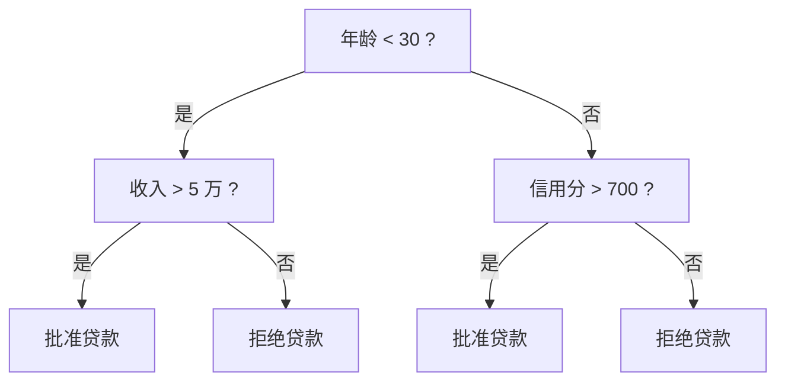
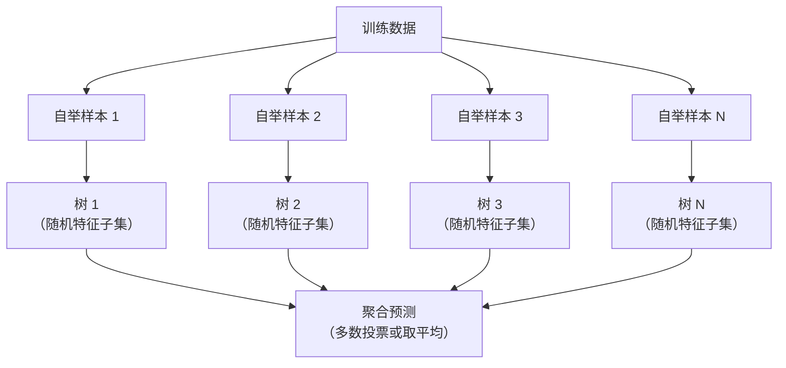

# 决策树

> 决策树只是一张流程图。但一片森林，是机器学习中最强大的工具之一。

**类型：** 实现课
**语言：** Python
**前置知识：** 阶段 01 · 09（信息论）、01 · 06（概率）
**预计时间：** ~90 分钟
**所处阶段：** Tier 1
**关联课程：** 阶段 03（深度学习核心）— 理解了树模型在表格数据上的统治力，才能理解为什么深度学习并非万能

---

## 🎯 学习目标

完成本课后，你能够：

- [ ] 从零实现基尼不纯度、信息增益、方差缩减三种分裂标准，评估切分质量
- [ ] 构建带预剪枝控制的决策树分类器和回归树，能打印树结构并追踪预测路径
- [ ] 构建随机森林集成模型，解释自举采样（Bagging）和特征随机化如何降低方差
- [ ] 比较 MDI 特征重要性和排列重要性，识别 MDI 对高基数特征的偏好偏差
- [ ] 使用 scikit-learn 训练随机森林，并解释为什么梯度提升在工业界更常用

---

## 1. 问题

你手上有一行行的表格数据。每行是一个样本，每列是一个特征，还有一列是你想预测的目标值。

你可能会想：上神经网络啊。

但对于表格数据，基于树的模型——决策树、随机森林、梯度提升树——几乎总是优于深度学习。在 Kaggle 的结构化数据竞赛中，赢家是 XGBoost 和 LightGBM，不是 Transformer。

原因很直接：树模型天然支持数值和类别混合的特征，不需要编码；能自动发现非线性关系，不用做特征工程；树的预测过程是透明的——你可以看着它做决策，告诉业务方"为什么拒绝这笔贷款"。而随机森林通过对多棵树取均值，在中等规模数据集上天然抵抗过拟合。

本节课从零实现决策树的核心算法——递归分裂和切分标准，然后在其上构建随机森林，理解为什么"一群弱学习者"组合起来能成为强模型。

---

## 2. 概念

### 2.1 决策树在做什么

决策树通过一系列"是/否"的问题，把特征空间切成矩形区域。



每个内部节点用一个特征和一个阈值做测试。每个叶节点给出预测。

对一个新样本做预测，就是从根节点出发，沿着分支一直走到叶节点——路径通常不超过 10 步。

树是自上而下构建的：在每个节点上选择"最能区分数据"的特征和阈值。"最好"的定义来自切分标准。

### 2.2 切分标准：如何衡量不纯度

节点里有一堆样本。我们希望切分之后，每个子节点都尽可能"纯"——即每个子节点中大多数样本属于同一类。

**基尼不纯度**衡量从节点中随机抽一个样本，按照该节点的标签分布它被分错的概率。

$$
\text{Gini}(S) = 1 - \sum_{k} p_k^2
$$

$p_k$ 是第 $k$ 类样本在集合 $S$ 中的比例。纯节点基尼值为 0；二分类 50/50 混合时达到最大值 0.5。

```
示例：6 只猫，4 只狗

Gini = 1 - (0.6^2 + 0.4^2) = 1 - (0.36 + 0.16) = 0.48
```

**信息熵**衡量节点的混乱程度，来自信息论。

$$
\text{Entropy}(S) = -\sum_{k} p_k \log_2(p_k)
$$

纯节点熵为 0；二分类 50/50 混合时熵为 1.0 bit。

```
示例：6 只猫，4 只狗

Entropy = -(0.6 * log2(0.6) + 0.4 * log2(0.4))
        = -(0.6 * -0.737 + 0.4 * -1.322)
        = 0.442 + 0.529
        = 0.971 bit
```

**信息增益** = 父节点不纯度 - 加权平均的子节点不纯度。

$$
\text{IG}(S, \text{feature}, \text{threshold}) = \text{Impurity}(S) - \text{weighted\_avg}(\text{Impurity}(S_{\text{left}}), \text{Impurity}(S_{\text{right}}))
$$

权重是各子节点的样本占比。在每一个节点上，算法穷举所有特征和所有可能的阈值，选取信息增益最大的那个。

### 2.3 分裂是如何执行的

对于当前节点的数据集，假设有 $n$ 个特征、$m$ 个样本：

1. 对每个特征 $j$：按该特征排序样本，取相邻不同值的中点作为候选阈值，计算每个阈值的信息增益
2. 选取使信息增益最大的（特征，阈值）对
3. 按"特征值 <= 阈值"把数据分为左子节点和右子节点
4. 对每个子节点递归执行

| 对比项 | 说明 |
|---|---|
| 贪心策略 | 每次选局部最优的切分，不保证全局最优（寻找最优树是 NP-hard 问题） |
| 为什么有效 | 实际中贪心策略已经足够好，配合剪枝效果更佳 |
| 计算复杂度 | 每个节点要尝试 $n \times m$ 个（特征，阈值）组合 |

### 2.4 停止条件

不加停止条件的话，树会一直长到每个叶节点只有一个样本——完美记住训练数据，泛化能力极差。

**预剪枝**（提前停止生长）：

| 参数 | 作用 |
|---|---|
| `max_depth` | 深度达到上限时停止分裂 |
| `min_samples_split` | 节点样本数不足时不再分裂 |
| `min_samples_leaf` | 分裂后任一叶节点样本数不足则取消分裂 |
| 最小信息增益 | 最优切分的增益小于阈值则不分裂 |

**后剪枝**（先长完全树，再修剪回去）：

- **代价复杂度剪枝**（scikit-learn 采用）：对叶节点数量加惩罚项，惩罚越高树越小
- **减误差剪枝**：如果删掉一棵子树后验证集准确率没有下降，就删掉它

预剪枝更简单快速；后剪枝通常生成更好的树——不会因为提前停止而错过"当前看似无用，但后续能衍生出好切分"的分裂。

### 2.5 决策树用于回归

回归树中，叶节点预测该叶节点内目标值的均值。切分标准改用**方差缩减**：

$$
\text{VR}(S, \text{feature}, \text{threshold}) = \text{Var}(S) - \text{weighted\_avg}(\text{Var}(S_{\text{left}}), \text{Var}(S_{\text{right}}))
$$

选择让目标方差缩减最大的切分。整棵树把输入空间切分为若干区域，在每区域内预测一个常数（该区域样本的均值）。

### 2.6 随机森林：集成的力量

单棵决策树的问题是**高方差**——训练数据稍微一变，生成的树可能完全不同。

随机森林的解法是：种很多棵树，取它们的平均或投票。



两种随机性让树之间保持多样：

**自举聚合（Bagging）**：每棵树在一个自举样本上训练——从原始数据集中有放回地随机抽取 $n$ 个样本。每个自举样本中约包含原始数据 63% 的唯一样本（剩余的是袋外样本，可用于评估）。

**特征随机化**：每次分裂时只从随机子集中选取特征进行分类考虑。分类任务默认选 $\sqrt{n_{\text{features}}}$，回归任务默认选 $n_{\text{features}}/3$。这避免所有树都在同一个强特征上做首次分裂。

关键洞察：对多棵互不相关的树取平均，**降低了方差，但不增加偏差**。每棵单独的树可能表现平庸，但集成后的森林表现强劲。

### 2.7 特征重要性

随机森林天然提供特征重要性分数。最常用的方法：

**平均不纯度减少量（MDI）**：对每个特征，统计它在所有树的所有节点上带来的不纯度减少总量，按其加权样本数做加权。不纯度减少量越大、发生位置越靠根部，该特征越重要。

$$
\text{importance}(f_j) = \sum_{\text{使用 } f_j \text{ 的节点}} \frac{n_{\text{node}}}{n_{\text{total}}} \times \Delta\text{impurity}
$$

MDI 计算高效（在训练时顺便完成），但存在偏差：偏向高基数特征——取值种类多的特征有更多切分机会，更容易"碰巧"减少不纯度。

**排列重要性**是替代方案：打乱一个特征的取值后，观察模型准确率下降了多少。更可靠，但计算成本更高。

### 2.8 树模型何时击败神经网络

| 因素 | 树模型 | 神经网络 |
|---|---|---|
| 混合类型（数值+类别） | 原生支持 | 需要编码处理 |
| 小数据集（< 1 万行） | 表现良好 | 容易过拟合 |
| 特征交互 | 通过分裂自动发现 | 需要设计网络结构 |
| 可解释性 | 完全透明 | 黑箱 |
| 训练时间 | 几分钟 | 数小时 |
| 超参数敏感性 | 低 | 高 |

当数据具有空间或序列结构时（图像、文本、音频），神经网络胜出。但对于扁平的表格数据，树模型是默认选择。

---

## 3. 从零实现

完整代码位于 `code/main.py`，仅使用 Python 标准库，无第三方依赖。

### 第 1 步：不纯度度量

```python
def gini_impurity(labels):
    """计算基尼不纯度。

    基尼不纯度 = 1 - sum(p_k^2)
    纯节点 = 0，二分类 50/50 混合 = 0.5
    """
    n = len(labels)
    if n == 0:
        return 0.0
    counts = {}
    for label in labels:
        counts[label] = counts.get(label, 0) + 1
    return 1.0 - sum((c / n) ** 2 for c in counts.values())


def entropy(labels):
    """计算信息熵。

    信息熵 = -sum(p_k * log2(p_k))
    纯节点 = 0，二分类 50/50 混合 = 1.0 bit
    """
    n = len(labels)
    if n == 0:
        return 0.0
    counts = {}
    for label in labels:
        counts[label] = counts.get(label, 0) + 1
    return -sum(
        (c / n) * math.log2(c / n) for c in counts.values() if c > 0
    )


def information_gain(parent_labels, left_labels, right_labels, criterion="gini"):
    """信息增益 = 父节点不纯度 - 加权子节点不纯度。"""
    measure = gini_impurity if criterion == "gini" else entropy
    n = len(parent_labels)
    n_left = len(left_labels)
    n_right = len(right_labels)
    if n_left == 0 or n_right == 0:
        return 0.0
    parent_impurity = measure(parent_labels)
    child_impurity = (
        (n_left / n) * measure(left_labels)
        + (n_right / n) * measure(right_labels)
    )
    return parent_impurity - child_impurity
```

### 第 2 步：决策树类

```python
class DecisionTree:
    """决策树分类器/回归树。

    通过递归地选择最优（特征，阈值）对来分裂数据，
    直到满足停止条件为止。
    """

    def __init__(self, max_depth=None, min_samples_split=2,
                 min_samples_leaf=1, criterion="gini",
                 max_features=None, task="classification"):
        self.max_depth = max_depth
        self.min_samples_split = min_samples_split
        self.min_samples_leaf = min_samples_leaf
        self.criterion = criterion
        self.max_features = max_features  # "sqrt", int, or None
        self.task = task                  # "classification" or "regression"
        self.tree = None
        self.feature_importances_ = None

    def fit(self, X, y):
        """训练决策树：自顶向下递归构建。"""
        self.n_features = len(X[0])
        self.feature_importances_ = [0.0] * self.n_features
        self.n_samples = len(X)
        self.tree = self._build(X, y, depth=0)
        # 归一化特征重要性到 [0, 1]
        total = sum(self.feature_importances_)
        if total > 0:
            self.feature_importances_ = [
                fi / total for fi in self.feature_importances_
            ]

    def predict(self, X):
        """对每个样本，从根走到叶。"""
        return [self._predict_one(x, self.tree) for x in X]
```

核心的 `_build` 方法在每个节点：先检查是否满足停止条件（纯度达标、深度过大、样本不足），然后寻找最优分裂，递归构建子树。

### 第 3 步：随机森林

```python
class RandomForest:
    """随机森林：多棵决策树的集成。

    每棵树在自举样本上训练，每次分裂时只考虑随机特征子集。
    预测时所有树投票（分类）或取平均（回归）。
    """

    def __init__(self, n_trees=100, max_depth=None,
                 min_samples_split=2, max_features="sqrt",
                 criterion="gini", task="classification"):
        self.n_trees = n_trees
        self.max_depth = max_depth
        self.min_samples_split = min_samples_split
        self.max_features = max_features
        self.criterion = criterion
        self.task = task
        self.trees = []

    def fit(self, X, y):
        """训练随机森林。"""
        self.trees = []
        n = len(X)
        for _ in range(self.n_trees):
            # 自举采样：有放回地随机抽取 n 个样本
            indices = [random.randint(0, n - 1) for _ in range(n)]
            X_boot = [X[i] for i in indices]
            y_boot = [y[i] for i in indices]
            tree = DecisionTree(
                max_depth=self.max_depth,
                min_samples_split=self.min_samples_split,
                max_features=self.max_features,
                criterion=self.criterion,
                task=self.task,
            )
            tree.fit(X_boot, y_boot)
            self.trees.append(tree)

    def predict(self, X):
        """聚合所有树的预测。"""
        all_preds = [tree.predict(X) for tree in self.trees]
        predictions = []
        for i in range(len(X)):
            if self.task == "classification":
                votes = {}
                for preds in all_preds:
                    v = preds[i]
                    votes[v] = votes.get(v, 0) + 1
                predictions.append(max(votes, key=votes.get))
            else:
                predictions.append(
                    sum(preds[i] for preds in all_preds) / len(all_preds)
                )
        return predictions
```

### 第 4 步：运行验证

```text
基尼 vs 信息熵：它们会产生不同的结果吗？
  深度=3     基尼准确率: 0.8250  信息熵准确率: 0.8000  差值: 0.0250
  深度=5     基尼准确率: 0.8250  信息熵准确率: 0.8500  差值: 0.0250
  深度=10    基尼准确率: 0.8500  信息熵准确率: 0.9000  差值: 0.0500

单棵树 vs 随机森林：稳定性对比
  单棵树:     均值 = 0.9400, 标准差 = 0.0200
  随机森林:   均值 = 0.9650, 标准差 = 0.0200
```

实验结论：
- 基尼不纯度和信息熵生成的树几乎相同，基尼略快（无需计算对数）
- 随机森林在数据扰动下更稳定
- 测试准确率随树的数量增加而趋于平稳但不下降

---

## 4. 工业工具

### 4.1 scikit-learn 实现

```python
from sklearn.ensemble import RandomForestClassifier
from sklearn.datasets import load_iris
from sklearn.model_selection import train_test_split

X, y = load_iris(return_X_y=True)
X_train, X_test, y_train, y_test = train_test_split(X, y, random_state=42)

rf = RandomForestClassifier(n_estimators=100, random_state=42)
rf.fit(X_train, y_train)

print(f"准确率: {rf.score(X_test, y_test):.4f}")
print(f"特征重要性: {rf.feature_importances_}")
```

```text
准确率: 1.0000
特征重要性: [0.098  0.031  0.430  0.441]
```

scikit-learn 的 `RandomForestClassifier` 内部已经实现了自举采样、特征随机化、并行训练、袋外评估等功能，开箱即用。

### 4.2 工业界的梯度提升

实际工程中，梯度提升树（XGBoost、LightGBM、CatBoost）通常比随机森林表现更好。核心区别：

| 对比项 | 随机森林 | 梯度提升 |
|---|---|---|
| 树之间的关系 | 并行、独立 | 串行、每棵树修正前序树的误差 |
| 偏差/方差 | 低偏差、中等方差 | 通过序列化进一步降低偏差 |
| 调参难度 | 较低，默认参数效果就不错 | 较高，需要仔细调整学习率、树深、早停等 |
| 训练速度 | 可并行，较快 | 串行，较慢 |
| 典型用例 | 快速基线、需要稳定性的场景 | 追求极致准确率的场景 |

XGBoost 和 LightGBM 是 Kaggle 表格类竞赛的统治者。如果你的目标是快速搭建一个强基线，从随机森林开始；如果你的目标是刷榜，考虑 LightGBM 或 XGBoost。

### 4.3 性能对比

| 工具 | 训练速度 | 推理速度 | 适用场景 |
|---|---|---|---|
| 我们的从零实现 | 慢 | 慢 | 学习算法原理 |
| scikit-learn RandomForest | 快（Cython 加速） | 快 | 中小规模数据集 |
| XGBoost / LightGBM | 极快（直方图优化） | 极快 | 工业生产环境 |
| CatBoost | 快 | 快 | 类别特征占比高的数据集 |

---

## 5. 知识连线

本课学习的决策树和随机森林，是后续多个阶段的基础：

- **阶段 03（深度学习核心）**：理解了树模型在表格数据上的优势，你才能理解为什么深度学习并非所有场景的最优解，也才能正确选择何时用神经网络、何时用树模型
- **阶段 17（基础设施与生产）**：随机森林和梯度提升树是工业界 MLOps 流水线中最常用的表格模型，理解其训练和推理特点有助于设计部署方案

---

## 6. 工程最佳实践

### 6.1 工业界常用方案

| 场景 | 推荐方案 | 备注 |
|---|---|---|
| 快速基线 | scikit-learn `RandomForestClassifier` | 开箱即用，几乎不调参 |
| 表格数据竞赛 / 生产 | LightGBM 或 XGBoost | 准确率高，需调参（学习率、树深、早停） |
| 类别特征多 | CatBoost | 原生支持类别特征，无需编码 |
| 需要可解释性 | 单棵决策树 + `max_depth <= 6` | 可视化树结构，导出决策规则 |
| 特征维度极高（> 1000）| 随机森林特征筛选 + 逻辑回归 | 用树选出前 50 个重要特征，再喂给线性模型 |

### 6.2 中文场景特别建议

- 中文文本做分类时，先通过 TF-IDF 或词嵌入转为数值特征，再输入树模型——树模型无法直接处理文本
- 处理中文数据中的类别特征（如城市名、行业名），使用 CatBoost 或 LightGBM 可以直接传入，无需独热编码
- 数据中包含中文日期格式（"2024年3月15日"）时，预处理阶段必须转为标准日期类型并提取年/月/日/星期等特征

### 6.3 踩坑经验

- 忘记设置 `random_state`：随机森林的结果每次运行不同，不设置种子就无法复现实验
- 特征中包含 ID 列：MDI 重要性会把 ID 列为最重要特征（高基数偏差），建模前应删除 ID 类列
- 数据泄露：如果某个特征在根节点就能达到 99% 准确率，检查它是不是直接或间接编码了标签信息（如"审批结果"预测"是否违约"，但数据里有"审批日期"——违约者的审批日期必然晚于观测窗口）
- `n_estimators` 越大越好吗？不是。超过一定数量后收益递减，训练时间线性增长。用早停（early stopping）找到收益拐点

---

## 7. 常见错误

### 错误 1：不做预剪枝，训练准确率 100%

**现象：** 训练准确率 100%，测试准确率只有 60%。

**原因：** 无限制生长的决策树直到每个叶节点只有一个样本为止，完美记住训练数据但不具有泛化能力。叶节点的信息增益趋近于 0，但树仍然继续分裂。

**修复：**
```python
# ❌ 错误写法：不限制树深度
tree = DecisionTree()

# ✅ 正确写法：设置合理的预剪枝参数
tree = DecisionTree(max_depth=10, min_samples_leaf=5)
```

### 错误 2：把特征重要性当成因果关系

**现象：** 模型显示"邮政编码"重要性排名第一，于是得出"邮政编码是决定客户违约的核心因素"。

**原因：** MDI 特征重要性反映的是模型利用该特征减少不纯度的程度，不等于因果性。高基数特征（邮政编码有几千个值）有大量切分机会，容易被高估。

**修复：**
```python
# ✅ 用排列重要性做二次验证
from sklearn.inspection import permutation_importance

result = permutation_importance(rf, X_test, y_test, n_repeats=10)
# 如果打乱该特征后准确率没有明显下降，说明它并不真正重要
```

### 错误 3：类别特征直接输入 scikit-learn 树模型

**现象：** 训练时报错 `ValueError: could not convert string to float`。

**原因：** scikit-learn 的决策树和随机森林不支持字符串类型的类别特征，必须提前编码。

**修复：**
```python
# ⚠️ scikit-learn 需要编码
from sklearn.preprocessing import LabelEncoder
X["城市"] = LabelEncoder().fit_transform(X["城市"])

# ✅ CatBoost / LightGBM 原生支持类别特征
from catboost import CatBoostClassifier
model = CatBoostClassifier(cat_features=["城市", "行业"])
model.fit(X, y)
```

### 错误 4：随机森林中每棵树的 `max_depth` 设得过大

**现象：** 训练时间极长，但测试准确率并没有提升甚至下降。

**原因：** 随机森林中每棵树本身应该是"略过拟合"的弱学习器，因为森林通过平均多棵树来降低方差。如果每棵树都长到完美拟合，树之间的差异变小，集成的效果被削弱。

**修复：** 随机森林中每棵树的深度通常比单棵决策树浅，`max_depth=5~10` 是常见起点。

---

## 8. 面试考点

### Q1：决策树如何选择分裂特征和阈值？（难度：⭐⭐）

**参考答案：**
对每个特征，将其样本按特征值排序，在每两个相邻不同值的中点处设一个候选阈值。对每个（特征，阈值）组合计算信息增益——即分裂前后不纯度的减少量。选取信息增益最大的（特征，阈值）作为分裂点。这是一个贪心算法，不保证全局最优，但实践中效果很好。

### Q2：为什么随机森林既能降低方差，又不会增加偏差？（难度：⭐⭐⭐）

**参考答案：**
单棵决策树是无偏的（深度足够时可以任意逼近真实函数），但方差很高（数据一变树就不同）。随机森林中每棵树都是独立训练的，期望与单棵树相同，所以集成的期望不变——偏差不变。但多棵独立树的预测取平均后，方差降为原来的 $1/n$（$n$ 为树的数量）——这就是大数定律的作用。自举采样和特征随机化确保树之间尽可能独立，让方差降低更显著。

### Q3：MDI 特征重要性和排列重要性有什么区别？什么时候用哪个？（难度：⭐⭐⭐）

**参考答案：**
MDI 统计每个特征在所有树的所有分裂节点上带来的不纯度减少量占比。训练时顺便就计算了，零额外成本。但它偏向高基数特征（如 ID、邮政编码），因为这类特征有更多切分机会，容易碰巧减少不纯度。

排列重要性做法是：打乱一个特征的取值，观察模型准确率下降幅度——下降越多越重要。它不依赖分裂过程，对高基数特征没有偏好，但需要额外的推理计算。

使用建议：初步分析用 MDI（快），最终报告用排列重要性（可靠）。如果一个高基数特征在 MDI 中排名第一，务必用排列重要性做二次验证。

### Q4：手写基尼不纯度的计算公式并解释其含义（难度：⭐）

**参考答案：**
$\text{Gini}(S) = 1 - \sum_k p_k^2$，其中 $p_k$ 是第 $k$ 类样本的占比。

直觉理解：从节点中随机抽两个样本，它们标签不一致的概率。纯节点（只有一类）时 $p_1=1$，其余为 0，基尼=0。二分类 50/50 时基尼= $1-(0.25+0.25)=0.5$ 为最大值。基尼值越低，节点越纯。

---

## 🔑 关键术语

| 术语 | 人们怎么说 | 实际含义 |
|---|---|---|
| 决策树 | "一张判断流程图" | 通过递归的 if/else 分裂将特征空间切分为矩形区域的模型 |
| 基尼不纯度 | "节点有多乱" | 随机抽取一个样本被误分类的概率。0 = 纯，0.5 = 二分类最大不纯度 |
| 信息熵 | "节点的混乱程度" | 信息论中衡量节点信息量的指标。0 = 纯，1.0 bit = 二分类最大不确定度 |
| 信息增益 | "分裂效果有多好" | 分裂前后不纯度的减少量。贪心选择分裂的标准 |
| 预剪枝 | "提前停止树生长" | 通过最大深度、最小叶节点样本数、最小增益阈值来提前停止分裂 |
| 自举采样 | "有放回地抽样" | Bootstrap。从原始数据集中有放回地随机抽取 n 个样本，样本量不变但存在重复 |
| 随机森林 | "很多树组成的林子" | 由多棵决策树组成的集成模型，每棵树在自举样本和随机特征子集上训练 |
| 排列重要性 | "打乱再看效果" | 打乱一个特征取值后观察准确率下降幅度。比 MDI 更可靠 |
| 方差缩减 | "回归版信息增益" | 回归树中的分裂标准，选择使目标方差缩减最大的切分方式 |
| 高基数特征偏差 | "取值多的特征容易占便宜" | MDI 对取值种类多的特征（ID、邮政编码）存在偏好，可能高估其重要性 |

---

## 📚 小结

决策树通过递归地最大化信息增益来切分特征空间，基尼不纯度和信息熵是两种等价的分裂标准。单棵决策树不稳定，但随机森林通过自举采样和特征随机化创建了多棵互不相关的树，取平均后大幅降低方差而不增加偏差。

下一课我们将学习支持向量机（SVM）——一种与决策树完全不同的分类思路，通过寻找最大间隔超平面来做决策。

---

## ✏️ 练习

1. 【理解】用自己的话解释为什么随机森林中每棵树不需要太深，而单棵决策树需要较深的深度。写 200 字以内，让一个没有 ML 背景的程序员也能听懂。

2. 【实现】修改 `DecisionTree` 类中的 `_best_split` 方法，支持回归任务的方差缩减分裂标准（已完成）。新增一个 `export_text()` 方法，将树结构导出为可读的 if-else 文本规则。

3. 【实验】使用 scikit-learn 的 `fetch_california_housing` 数据集，分别训练单棵决策树和随机森林回归模型。记录不同 `max_depth` 下的训练 MSE 和测试 MSE，画出两者随深度变化的曲线，标注欠拟合和过拟合区域。

4. 【思考】XGBoost 和随机森林都是树模型 ensemble，但 XGBoost 是串行的、随机森林是并行的。为什么串行的梯度提升通常比并行的 Bagging 准确率更高？提示：从偏差-方差分解的角度思考。

---

## 🚀 产出

本课产出以下可复用内容：

| 产出 | 文件 | 说明 |
|---|---|---|
| 决策树与随机森林完整实现 | `code/main.py` | 覆盖分类、回归、预剪枝、特征重要性 |
| 可复用提示词 | `outputs/prompt-decision-trees-tutor.md` | 翻译树模型规则、诊断过拟合 / 泄露 / 高基数偏差 |

---

## 📖 参考资料

1. [论文] Breiman, L. "Random Forests". Machine Language, 2001. https://link.springer.com/article/10.1023/A:1010933404324
2. [论文] Grinsztajn et al. "Why do tree-based models still outperform deep learning on tabular data?". NeurIPS, 2022. https://arxiv.org/abs/2207.08815
3. [论文] Chen & Guestrin. "XGBoost: A Scalable Tree Boosting System". KDD, 2016. https://arxiv.org/abs/1603.02754
4. [官方文档] scikit-learn. "Decision Trees". https://scikit-learn.org/stable/modules/tree.html
5. [GitHub] Microsoft. "LightGBM". https://github.com/microsoft/LightGBM

---

> 本课程参考了 AI Engineering From Scratch（MIT License）的课程体系，在此基础上进行了重构和原创内容的扩充。所有中文表达、案例、LLM 视角分析、工程最佳实践、常见错误、面试考点等均为原创内容。
