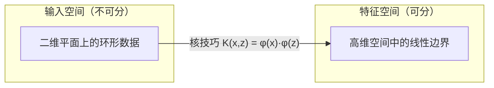
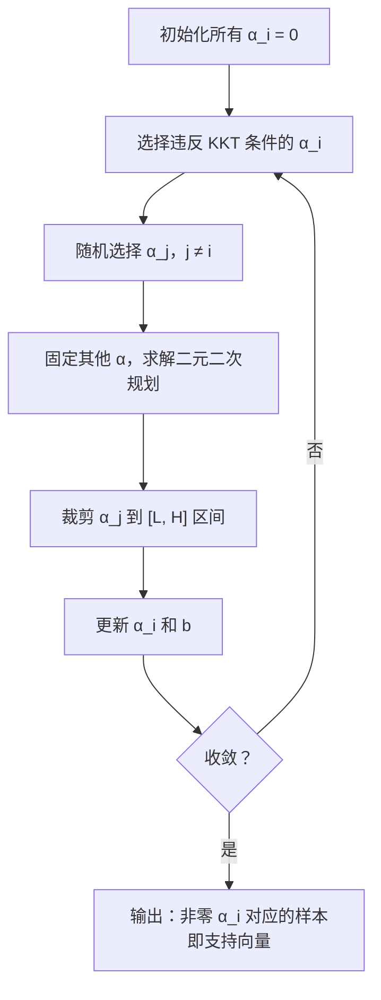

# 支持向量机——找一条最宽的路，让两类数据各走各的

> 最好的分界线不是刚好能把两类分开——而是留出最大余地的那条。

**类型：** 实现课
**语言：** Python
**前置知识：** 第 01 阶段 · 08（优化算法）、14（范数与距离）、18（凸优化）
**预计时间：** ~90 分钟
**所处阶段：** Tier 1
**关联课程：** 第 03 阶段 · 02（反向传播）— 本课理解的凸优化思想是后续非凸优化的对比基线

---

## 🎯 学习目标

完成本课后，你能够：

- [ ] 从零实现线性 SVM，通过梯度下降优化原始形式的目标函数
- [ ] 解释最大间隔原则的直觉和理论动机，从训练结果中识别支持向量
- [ ] 实现线性核、多项式核和 RBF 核，解释核技巧如何避免显式的高维映射
- [ ] 分析 C 参数如何控制间隔宽度与分类错误之间的权衡
- [ ] 实现简化版 SMO 算法，求解带核函数的 SVM 对偶问题

---

## 1. 问题

你手头有两类数据点，需要画一条线（或超平面）把它们分开。能画多少条？无数条。

你应该选哪一条？

答案出乎意料地简洁：**选间隔最宽的那条。** 间隔（margin）就是决策边界到最近样本的距离。间隔越宽，分类器对新数据的泛化能力越强——因为它在两类之间留出了最大的缓冲地带。

这个直觉催生了支持向量机（Support Vector Machine, SVM），它是机器学习中最具数学优雅性的算法之一。在深度学习崛起之前，SVM 是分类任务的绝对王者。即便在今天，SVM 仍然是以下场景的首选：

- 数据集较小（几百到几千样本）
- 特征维度极高且稀疏（文本的 TF-IDF 特征）
- 需要数学保证（间隔 = 泛化误差的上界）
- 训练时间必须极短（线性 SVM 每轮迭代只需 O(n·d)）

SVM 的核心洞察不只是"找一个好的分界线"。它从根本上重新定义了分类问题：**从"勉强分开"到"留出最大余地"**。这个思想影响了整整一代机器学习算法。

---

## 2. 概念

### 2.1 最大间隔分类器

给定线性可分的训练数据，标签 y_i 取值为 {-1, +1}，特征为 x_i。我们要找一个超平面 w^T x + b = 0，使得两类样本分别位于超平面两侧。

一个样本到超平面的距离为：

$$\text{distance} = \frac{|w^T x_i + b|}{\|w\|}$$

正确分类的条件是 y_i · (w^T x_i + b) > 0。**间隔**是超平面到两侧最近样本的距离之和：

$$\text{margin} = \frac{2}{\|w\|}$$

SVM 的优化目标是：**最大化间隔**——等价于最小化 ||w||²（数学上更容易处理）：

$$\min_{w,b} \frac{1}{2} \|w\|^2 \quad \text{subject to} \quad y_i(w^T x_i + b) \geq 1, \; \forall i$$

这是一个凸二次规划问题，有唯一全局最优解。

```
间隔几何直观：

    + 类                      - 类
      ○                          ●
        ○                          ●
  ─────────────  w·x+b = +1  ─────────────   ← 正间隔边界
  ═════════════════════════════════════════   ← 决策边界 (w·x+b = 0)  最宽的路
  ─────────────  w·x+b = -1  ─────────────   ← 负间隔边界
        ○                          ●
          ○                          ●

         ← 间隔宽度 = 2/||w|| →
```

**支持向量**（Support Vector）就是恰好落在间隔边界上的那些样本——它们满足 y_i · (w^T x_i + b) = 1。关键结论是：**只有支持向量决定了决策边界**。移除非支持向量的样本，边界纹丝不动。这就是 SVM 名称的由来。

### 2.2 铰链损失：SVM 的语言

硬间隔要求所有样本严格分类正确，这在现实中几乎不可能。**软间隔**引入松弛变量 ξ_i 来容许违规：

$$\min_{w,b} \frac{1}{2} \|w\|^2 + C \sum_i \xi_i \quad \text{subject to} \quad y_i(w^T x_i + b) \geq 1 - \xi_i, \; \xi_i \geq 0$$

消去约束后，得到无约束优化形式，其中的损失函数就是**铰链损失**（Hinge Loss）：

$$\mathcal{L}(w,b) = \frac{\lambda}{2}\|w\|^2 + \frac{1}{n}\sum_i \max(0, \; 1 - y_i(w^T x_i + b))$$

```
铰链损失的形状：

  loss
    |
    | \
    |  \
    |   \
    |    \
    |     \_______________
    |
    +-----|-----|-------->  y · f(x)
         0     1

  当 y·f(x) >= 1：损失为零（正确分类且在间隔外）
  当 y·f(x) < 1：  损失线性增长（间隔内或分类错误）
```

铰链损失与逻辑回归的对数损失对比：

| 特性 | 铰链损失 | 对数损失 |
|---|---|---|
| 公式 | max(0, 1 - y·f(x)) | log(1 + exp(-y·f(x))) |
| 间隔外的值 | 精确为零 | 趋近零但永不等于零 |
| 解的稀疏性 | 稀疏（仅支持向量有贡献） | 稠密（所有样本都有贡献） |
| 预测时效率 | 只需存储支持向量 | 需要全部训练数据 |

铰链损失的"硬截止"特性使 SVM 天然产生稀疏模型——这是它在预测阶段内存高效的根本原因。

### 2.3 原始形式 vs 对偶形式

SVM 有两种数学等价的形式：

**原始形式**（Primal）：直接优化 w 和 b。可用梯度下降求解，每轮复杂度 O(n·d)。适合数据量大、特征维度高的场景。

```python
# 原始形式的梯度更新规则
if y[i] * (w·x[i] + b) >= 1:
    w = w - lr * λ * w              # 仅权重衰减
else:
    w = w - lr * (λ*w - y[i]*x[i]) # 推开决策边界
    b = b - lr * (-y[i])
```

**对偶形式**（Dual）：通过拉格朗日乘子法转换，只涉及样本间的点积：

$$\max_{\alpha} \sum_i \alpha_i - \frac{1}{2}\sum_{i,j} \alpha_i \alpha_j y_i y_j (x_i \cdot x_j)$$

$$0 \leq \alpha_i \leq C, \quad \sum_i \alpha_i y_i = 0$$

对偶形式的优雅之处在于：**它只依赖点积 x_i · x_j**。这为核技巧打开了大门。

### 2.4 核技巧：隐式地进入高维空间

核技巧的精髓是一句话：**用核函数 K(x_i, x_j) 替换对偶形式中的点积 x_i · x_j**。

核函数隐式地计算两个样本在高维特征空间中的相似度，但不需要显式地映射到高维空间。

| 核函数 | 公式 | 特点 |
|---|---|---|
| 线性核 | K(x,z) = x · z | 原始空间中的相似度，适合线性可分数据 |
| 多项式核 | K(x,z) = (x · z + c)^d | 捕获 d 阶特征交互 |
| RBF 核 | K(x,z) = exp(-γ‖x-z‖²) | 映射到无限维空间，可学习任意平滑边界 |



RBF 核尤其值得关注。它把数据映射到了**无限维**的空间——读者可以想象一个完全没有边界的可能性。γ 参数控制高斯函数的宽度：γ 越大，单个样本的影响范围越小，决策边界越复杂。

### 2.5 SMO：让训练跑起来

对偶形式的优化不能用普通梯度下降——等式约束 Σα_i y_i = 0 使得同时更新一个变量成为不可能。

Platt（1998）提出的 SMO（序列最小优化）算法优雅地解决了这个问题：**每次只选择两个拉格朗日乘子 α_i 和 α_j，固定其他变量，求解一个可解析求解的二次规划子问题**。



SMO 的关键在于"最小"——每次优化两个变量时，子问题有闭式解，不需要调用外部优化器。

---

## 3. 从零实现

### 第 1 步：铰链损失

铰链损失是 SVM 一切讨论的起点。它度量一个样本离"安全分类"有多远。

```python
def hinge_loss(X, y, w, b):
    """计算铰链损失。

    当样本正确分类且位于间隔之外（y*f(x) >= 1）时损失为零。
    否则损失线性增长——离正确分类越远，惩罚越大。
    """
    n = len(X)
    total = 0.0
    for i in range(n):
        margin = y[i] * (dot(w, X[i]) + b)
        total += max(0.0, 1.0 - margin)
    return total / n
```

### 第 2 步：线性 SVM（原始形式）

通过梯度下降直接优化原始形式的目标函数。不需要 QP 求解器。

```python
class LinearSVM:
    """线性支持向量机——原始形式的梯度下降实现。"""

    def __init__(self, lr=0.001, lambda_param=0.01, n_epochs=1000):
        self.lr = lr              # 学习率
        self.lambda_param = lambda_param  # 正则化强度（大 λ = 强正则化）
        self.n_epochs = n_epochs
        self.w = None
        self.b = 0.0

    def fit(self, X, y):
        n_features = len(X[0])
        self.w = [0.0] * n_features
        self.b = 0.0

        for epoch in range(self.n_epochs):
            for i in range(len(X)):
                margin = y[i] * (dot(self.w, X[i]) + self.b)
                if margin >= 1:
                    # 间隔外：只衰减权重
                    self.w = [wj - self.lr * self.lambda_param * wj
                              for wj in self.w]
                else:
                    # 间隔内或分类错误：推开边界
                    self.w = [wj - self.lr * (self.lambda_param * wj - y[i] * X[i][j])
                              for j, wj in enumerate(self.w)]
                    self.b -= self.lr * (-y[i])

    def margin_width(self):
        """间隔宽度 = 2 / ||w||"""
        w_norm = vec_norm(self.w)
        return 2.0 / w_norm if w_norm > 0 else 0.0

    def find_support_vectors(self, X, y, tol=0.1):
        """支持向量：落在间隔边界上的样本（y*f(x) ≈ 1）"""
        svs = []
        for i in range(len(X)):
            margin = y[i] * (dot(self.w, X[i]) + self.b)
            if abs(margin - 1.0) < tol:
                svs.append(i)
        return svs
```

### 第 3 步：核函数

三种核函数，每种隐式映射到不同维度的特征空间。

```python
def linear_kernel(x, z):
    """线性核：原始空间中的点积。等价于不映射。"""
    return dot(x, z)

def polynomial_kernel(x, z, degree=3, c=1.0):
    """多项式核：K(x,z) = (x·z + c)^d。
    隐式映射到 O(D^d) 维空间，但计算只需 O(D)。"""
    return (dot(x, z) + c) ** degree

def rbf_kernel(x, z, gamma=0.5):
    """RBF 核（高斯核）：K(x,z) = exp(-γ||x-z||²)。
    隐式映射到无限维空间。γ 越大，影响范围越小。"""
    diff = vec_sub(x, z)
    return math.exp(-gamma * dot(diff, diff))
```

### 第 4 步：带核函数的 SVM（SMO 算法）

对偶形式 + 核函数 + SMO 求解器。这是 SVM 的完全体。

```python
class SVMWithKernel:
    """带核函数的 SVM——通过 SMO 算法求解对偶问题。"""

    def __init__(self, kernel_fn=linear_kernel, C=1.0, gamma=0.5, n_epochs=100):
        self.kernel_fn = kernel_fn
        self.C = C          # 正则化参数：越大越不容忍错误
        self.gamma = gamma  # RBF 核宽度
        self.alpha = None   # 拉格朗日乘子
        self.b = 0.0

    def fit(self, X, y):
        n = len(X)
        self.alpha = [0.0] * n
        self.b = 0.0
        self.X_train, self.y_train = X, y

        # 预计算核矩阵
        K = compute_kernel_matrix(X, self.kernel_fn, gamma=self.gamma)

        for epoch in range(self.n_epochs):
            for i in range(n):
                # 预测值和误差
                f_i = sum(self.alpha[j] * y[j] * K[i][j] for j in range(n)) + self.b
                E_i = f_i - y[i]

                # KKT 条件检验
                if (y[i] * E_i < -1e-3 and self.alpha[i] < self.C) or \
                   (y[i] * E_i > 1e-3 and self.alpha[i] > 0):
                    j = random.choice([k for k in range(n) if k != i])
                    # ... 求解二元子问题，裁剪更新 ...

    def find_support_vectors(self):
        """α_i > 0 的样本就是支持向量。"""
        return [i for i in range(len(self.alpha)) if self.alpha[i] > 1e-5]
```

完整代码见 `code/main.py`，运行 `python code/main.py` 即可查看所有演示。

---

## 4. 工业工具

### 4.1 scikit-learn 实现

工业界使用 SVM 的首选工具是 scikit-learn。注意：**必须先标准化特征**。

```python
from sklearn.svm import SVC, LinearSVC
from sklearn.preprocessing import StandardScaler
from sklearn.pipeline import Pipeline

# 带 RBF 核的 SVM
clf = Pipeline([
    ("scaler", StandardScaler()),       # 必须：标准化特征
    ("svm", SVC(kernel="rbf", C=1.0, gamma="scale")),
])
clf.fit(X_train, y_train)
print(f"测试集准确率: {clf.score(X_test, y_test):.4f}")
print(f"支持向量数量: {clf['svm'].n_support_}")
```

### 4.2 大规模数据：LinearSVC

数据集超过 1 万样本时，用 `LinearSVC` 替代 `SVC`：

```python
from sklearn.svm import LinearSVC

clf = Pipeline([
    ("scaler", StandardScaler()),
    ("svm", LinearSVC(C=1.0, max_iter=10000)),
])
# LinearSVC 使用原始形式，每轮 O(n·d)，比 SVC 的 O(n²) 快一个数量级
```

### 4.3 核 SVM 与 C 和 γ 的调参

```python
from sklearn.model_selection import GridSearchCV

param_grid = {
    "svm__C": [0.01, 0.1, 1, 10, 100],
    "svm__gamma": [0.001, 0.01, 0.1, 1, 10],
}
grid = GridSearchCV(clf, param_grid, cv=5, scoring="accuracy")
grid.fit(X_train, y_train)
print(f"最佳参数: {grid.best_params_}")
```

### 4.4 性能对比

| 实现方式 | 训练复杂度 | 适用场景 | 数据规模 |
|---|---|---|---|
| 我们的 NumPy 版 | O(n·d) per epoch | 学习理解 | < 1K |
| sklearn `LinearSVC` | O(n·d) per epoch | 生产（线性） | < 1M |
| sklearn `SVC` | O(n²) ~ O(n³) | 生产（非线性） | < 10K |
| ThunderSVM / GPU-SVM | O(n²)/GPU | 生产（大规模） | < 100K |

---

## 5. 知识连线

本课学习的最大间隔原则和凸优化思想，在后续课程中会以不同形式出现：

- **第 03 阶段 · 02（反向传播）**：SVM 的凸优化是"最好情况"——有唯一全局最优解。神经网络是非凸的，理解这个对比能帮你理解为什么神经网络的优化如此困难
- **第 03 阶段 · 06（正则化）**：SVM 的 C 参数控制正则化，这与 L1/L2 正则化、Dropout 本质相同——在拟合能力与泛化之间取舍
- **第 09 阶段（强化学习）**：核技巧中的"隐式映射"思想在核化 RL 算法中被复用——在不显式构造高维特征空间的前提下学习价值函数

---

## 6. 工程最佳实践

### 6.1 工业界常用方案

| 场景 | 推荐方案 | 备注 |
|---|---|---|
| 文本分类（TF-IDF 特征） | `LinearSVC` | 高维稀疏数据线性可分概率高，线性核足够 |
| 小样本分类（< 1K） | `SVC(kernel="rbf")` | RBF 是通用首选核函数 |
| 大规模数据（> 100K） | `LinearSVC` + SGD | 原始形式每轮 O(n·d)，可近似 |
| 图像分类 | CNN（不建议用 SVM） | 深度学习直接端到端更有效 |
| 异常检测 | `OneClassSVM` | 只需正样本，学习边界 |

### 6.2 中文场景特别建议

- 中文文本分类使用 TF-IDF 特征时，线性核通常优于 RBF 核。中文的稀疏高维特征空间往往已经近似线性可分
- 数据预处理一定要做标准化。中文文本特征如果使用词频而非 TF-IDF，必须做 L2 归一化
- 中文情感分类任务如果使用 BERT 等预训练模型，SVM 只在最后一层特征上作为分类头，不需要核函数

### 6.3 踩坑经验

- **忘记标准化特征**：SVM 对特征量级极其敏感。特征 A 范围 [0, 1]、特征 B 范围 [0, 10000] 时，B 完全主导了间隔计算
- **C 值设太大**：噪声数据上 C=1000 会导致过拟合——模型记住噪声而非学习边界。从 C=1.0 开始，在对数尺度上搜索
- **RBF 核用于高维稀疏数据**：文本 TF-IDF 特征维度通常 > 10000，RBF 核计算缓慢且无增益，用线性核
- **数据集 > 50K 使用 SVC**：训练时间会爆炸到不可接受（数小时到数天）。改用 `LinearSVC`
- **类别不平衡时忽略 `class_weight`**：SVM 不处理类别不平衡，少数类的支持向量容易被忽略。设置 `class_weight="balanced"` 或重采样

---

## 7. 常见错误

### 错误 1：忘记标准化特征

**现象：** 测试集准确率远低于预期（可能只有 60%-70%），即使模型在训练集上表现良好。

**原因：** SVM 的间隔计算依赖 ||w||。如果特征量级差异巨大（如年龄 [0-100] 对比收入 [0-1000000]），收入特征的权重会被人为压缩，扭曲了几何间隔。

**修复：**

```python
# ❌ 错误写法
clf = SVC(kernel="rbf", C=1.0)
clf.fit(X_train, y_train)  # X_train 各特征量级差异大

# ✓ 正确写法
clf = Pipeline([
    ("scaler", StandardScaler()),  # 零均值、单位方差
    ("svm", SVC(kernel="rbf", C=1.0)),
])
```

### 错误 2：用线性 SVM 处理非线性边界

**现象：** 准确率卡在 50%-60%，类似于随机猜测。决策边界是一条直线/平面，而真实边界是弯曲的。

**原因：** 数据本身非线性可分，线性 SVM 无论如何调整 C 都只能得到线性边界。

**修复：**

```python
# ❌ 数据有环形边界，却用线性核
clf = SVC(kernel="linear")  # 准确率 50%

# ✓ 使用 RBF 核处理非线性边界
clf = SVC(kernel="rbf", C=10.0, gamma=1.0)  # 准确率 95%+
```

### 错误 3：C 值与数据规模不匹配

**现象：** 调参选了 C=0.001（很小），但模型严重欠拟合；或者 C=1000（很大），模型过拟合。

**原因：** C 的实际效果取决于样本数量 n。C 的含义是"每个样本违规的代价"。样本量越大，每个 C 对应的"有效正则化强度"不同。

**修复：**

```python
# 使用与 n 解耦的 lambda 参数化
# lambda = 1 / (C * n)，这样 C 的效果与样本量无关
lambda_param = 1.0 / (desired_c * n_samples)
svm = LinearSVM(lr=0.001, lambda_param=lambda_param)

# 或者使用 scikit-learn 的 GridSearchCV 直接搜索最优 C
param_grid = {"svm__C": [0.01, 0.1, 1, 10, 100]}
```

### 错误 4：混淆 α_i 和支持向量

**现象：** 从对偶形式训练后，直接把所有 α_i > 0 的样本当支持向量，发现数量过多（超过 30%）。

**原因：** 数值精度导致很多 α_i 非常接近零但不精确等于零。严格意义上，支持向量是满足 α_i > 0 且位于间隔边界上的样本。SMO 的数值误差会让一些非支持向量有极小的 α。

**修复：**

```python
# ✓ 使用容差过滤
support_vectors = [i for i in range(len(alpha)) if alpha[i] > 1e-5]
# 而不是
support_vectors = [i for i in range(len(alpha)) if alpha[i] > 0]
```

---

## 8. 面试考点

### Q1：SVM 为什么叫"支持向量机"？支持向量在模型中扮演什么角色？（难度：⭐⭐）

**参考答案：**
因为最终决定决策边界的只有少数样本——这些样本就是"支持向量"。数学上它们是拉格朗日乘子 α_i > 0 的样本，几何上它们落在间隔边界上（y_i · f(x_i) = 1）。

关键性质：移除非支持向量的样本，决策边界不变。SVM 的模型复杂度由支持向量数量决定（而非特征维度），这就是为什么 SVM 有理论上的泛化保证。

### Q2：解释核技巧的核心思想。为什么说 RBF 核映射到无限维空间？（难度：⭐⭐⭐）

**参考答案：**
核函数 K(x, z) 隐式计算高维空间中两个向量的点积：K(x, z) = φ(x) · φ(z)，其中 φ 是到高维空间的映射。我们不需要知道 φ 的具体形式，也不需要在 φ(x) 所在的空间中计算。

RBF 核 K(x, z) = exp(-γ‖x-z‖²) 对应的 φ 将数据映射到无限维空间。证明思路：将 exp(-γ‖x-z‖²) 用泰勒展开，每一项对应一个多项式核，而多项式核的特征空间维度随阶数增长，无穷级数 → 无限维。

关键意义：无限维空间意味着任何连续函数都可以被线性表示——RBF 核的万能逼近能力由此而来。

### Q3：SVM 和逻辑回归有什么本质区别？（难度：⭐⭐）

**参考答案：**

| 维度 | SVM | 逻辑回归 |
|---|---|---|
| 损失函数 | 铰链损失（硬截止） | 对数损失（平滑） |
| 解的稀疏性 | 稀疏（仅支持向量） | 稠密（全部样本） |
| 输出含义 | 决策边界的符号距离 | 概率（通过 sigmoid 转换） |
| 异常值敏感度 | 低（间隔外的异常点无影响） | 高（所有点都贡献梯度） |
| 预测时内存 | 只需存储支持向量 | 需要存储所有权重 |

选择建议：需要概率输出时用逻辑回归，需要稀疏模型 / 小数据集 / 明确间隔保证时用 SVM。

### Q4：在 SVM 中，w 向量的几何意义是什么？间隔宽度如何计算？（难度：⭐⭐）

**参考答案：**
w 是超平面的法向量——垂直于决策边界的方向。决策边界定义为 {x | w^T x + b = 0}。

间隔宽度 = 2 / ||w||。推导：正间隔边界为 w^T x + b = 1，负间隔边界为 w^T x + b = -1，两平行超平面间距离为 |1 - (-1)| / ||w|| = 2 / ||w||。

最大化间隔 ↔ 最小化 ||w||²，这就是 SVM 优化目标中出现 (1/2)||w||² 的原因。

### Q5：手写 SVM 原始形式的梯度下降更新规则（难度：⭐⭐⭐）

**参考答案：**

目标函数：L = (λ/2)||w||² + (1/n)Σ max(0, 1 - y_i(w·x_i + b))

```python
for i in range(n_samples):
    margin = y[i] * (np.dot(w, x[i]) + b)
    if margin >= 1:
        # 间隔外：只应用 L2 正则化
        w = w - lr * lambda_param * w
    else:
        # 间隔内：推开边界 + 正则化衰减
        w = w - lr * (lambda_param * w - y[i] * x[i])
        b = b + lr * y[i]  # 注意符号：减去 -y[i]
```

关键细节：b 的正则化项梯度为 0（不对 b 正则化），所以只有 w 有权重衰减项。

---

## 🔑 关键术语

| 术语 | 人们怎么说 | 实际含义 |
|---|---|---|
| 支持向量 (Support Vector) | "重要的训练样本" | 落在间隔边界上的样本——拉格朗日乘子 α_i > 0 的那些点。只有它们决定决策边界 |
| 间隔 (Margin) | "分类器和数据的距离" | 决策边界到最近样本的最小距离。SVM 最大化这个值 |
| 铰链损失 (Hinge Loss) | "SVM 的损失函数" | max(0, 1 - y·f(x))。在间隔外精确为零，在间隔内线性增长 |
| C 参数 | "SVM 的复杂度参数" | 正则化强度的倒数。C 越大 → 间隔越窄 → 不容忍错误 → 可能过拟合 |
| 软间隔 (Soft Margin) | "允许犯错的 SVM" | 通过松弛变量 ξ_i 允许间隔违反的 SVM 变体。处理不可分数据 |
| 核技巧 (Kernel Trick) | "把数据映射到高维" | 核函数 K(x,z) 隐式计算 φ(x)·φ(z)，避免显式映射 φ 和在高维计算 |
| RBF 核 | "高斯核" | exp(-γ‖x-z‖²)。将数据映射到无限维空间，适合任意平滑边界 |
| 对偶形式 (Dual) | "另一种解法" | 通过拉格朗日乘子法转化的形式，只依赖样本间点积，为核技巧铺路 |
| SMO 算法 | "训练 SVM 的方法" | 序列最小优化——每次优化两个拉格朗日乘子，有解析解，不需要 QP 求解器 |
| 松弛变量 (Slack Variable) | "错误容忍度" | ξ_i：度量样本 i 违反间隔的程度。为零表明确实在间隔外正确分类 |

---

## 📚 小结

支持向量机将分类问题重新定义为"寻找最大间隔超平面"的凸优化问题。铰链损失和最大间隔原则共同赋予了 SVM 稀疏性和泛化能力——只有支持向量决定决策边界。核技巧则在保持计算可行性的前提下，打开了非线性边界的大门。

下一课我们将转向决策树和集成学习——与 SVM 的几何优雅不同，这套方法走的是"分治"和"群体智慧"的路线。

---

## ✏️ 练习

1. 【理解】用自己的语言解释"最大间隔"原则为什么能提升泛化能力。写 200 字以内的说明——可以用"马路车道分隔线"的类比来辅助。

2. 【实现】在 `demo_c_parameter()` 的基础上，对 C 从 0.001 到 1000 取值，记录每个 C 对应的（1）间隔宽度（2）支持向量数量（3）训练准确率（4）测试准确率。画 4 个子图展示 C 的影响。

3. 【实验】生成 200 个样本的环形数据集，分别在（a）线性核（b）RBF 核（c）多项式核（degree=2）下训练 SVM，对比测试集准确率和支持向量数量。解释差异。

4. 【思考】RBF 核映射到无限維空间——这句话是数学严格成立还是类比？阅读 RKHS（再生核希尔伯特空间）的介绍，用自己的话解释 RBF 核"无限维"的含义。证明或反驳：有限样本的情况下，RBF 核矩阵的秩最多等于样本数，因此"无限维"在实践中并不真正达到。

5. 【扩展】在 `SVMWithKernel` 中加入"核矩阵缓存"优化：如果样本数 n > 1000，核矩阵太大无法存入内存，你可以按行计算而不是一次性全量计算。修改算法使其支持 n=5000 的数据集。

---

## 🚀 产出

本课产出以下可复用内容：

| 产出 | 文件 | 说明 |
|---|---|---|
| SVM 完整实现（原始 + 对偶 + SMO） | `code/main.py` | 线性 SVM、核函数、简化版 SMO 算法 |
| SVM 核函数选择指南 | `outputs/prompt-svm-tutor.md` | 根据数据和问题特征选择核函数和超参数的引导提示词 |

---

## 📖 参考资料

1. [论文] Cortes & Vapnik. "Support-vector networks". Machine Learning, 1995. https://link.springer.com/article/10.1007/BF00994018（SVM 原始论文）
2. [论文] Platt. "Sequential Minimal Optimization: A Fast Algorithm for Training Support Vector Machines". Microsoft Research, 1998. https://www.microsoft.com/en-us/research/publication/sequential-minimal-optimization-a-fast-algorithm-for-training-support-vector-machines/（SMO 算法）
3. [书籍] Vapnik. "The Nature of Statistical Learning Theory". Springer, 1995. — SVM 和统计学习理论的理论基础
4. [官方文档] scikit-learn. "Support Vector Machines". https://scikit-learn.org/stable/modules/svm.html
5. [GitHub] scikit-learn. "svm". https://github.com/scikit-learn/scikit-learn（工业级 SVM 实现）
6. [书籍] 李航. 《统计学习方法（第2版）》. 清华大学出版社, 2019. — 第 7 章对 SVM 的推导清晰完整，适合中文读者

---

> 本课程参考了 AI Engineering From Scratch（MIT License）的课程体系，在此基础上进行了重构和原创内容的扩充。所有中文表达、案例、LLM 视角分析、工程最佳实践、常见错误、面试考点等均为原创内容。
