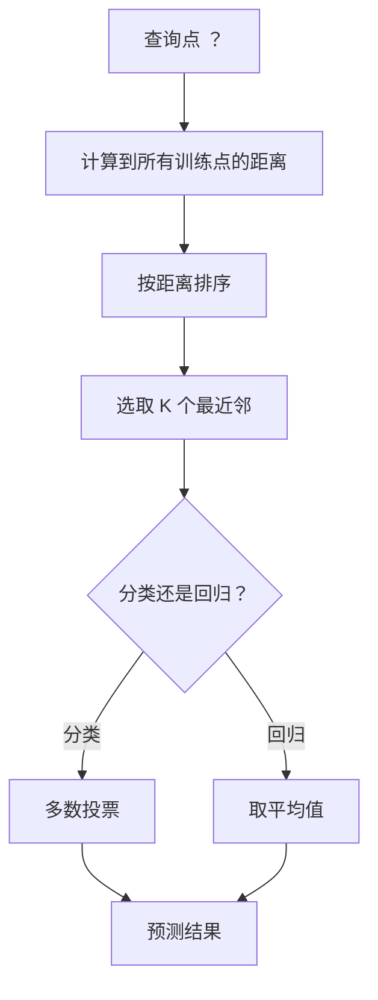
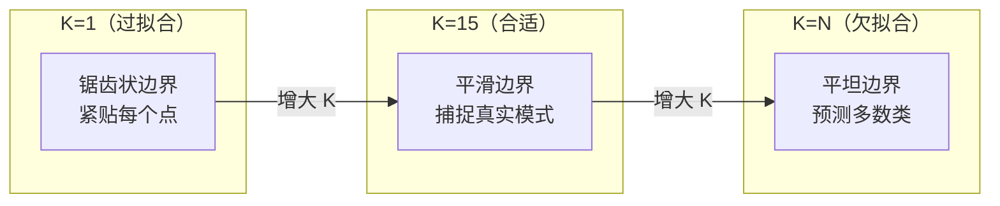
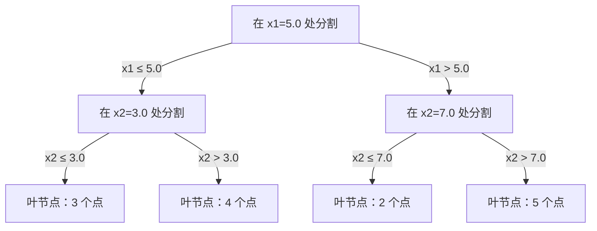

# KNN 与距离

> 不学习任何参数，只记住所有数据，然后问邻居们怎么想——这个"偷懒"的算法，却是现代向量搜索的祖先。

**类型：** 实现课
**语言：** Python
**前置知识：** 阶段 01 · 14（范数与距离）、阶段 02 · 01（什么是机器学习）
**预计时间：** ~90 分钟
**所处阶段：** Tier 1
**关联课程：** 阶段 01 · 14（范数与距离）— 距离度量是 KNN 的核心；阶段 11 · 02（向量数据库）— KNN 是向量检索的算法基础

---

## 🎯 学习目标

完成本课后，你能够：

- [ ] 从零实现 KNN 分类和回归，支持可配置的 K 值、距离度量和距离加权
- [ ] 比较 L1、L2、余弦和闵可夫斯基距离度量，根据数据类型选择合适的度量
- [ ] 解释维度灾难的数学原理，并通过实验验证 KNN 在高维空间中的退化
- [ ] 从零实现 KD 树，分析其何时优于暴力搜索、何时退化为线性扫描
- [ ] 使用交叉验证选择最优 K 值，理解 K 如何控制偏差-方差权衡

---

## 1. 问题

你有一个数据集。一个新的数据点到达。你需要判断它的类别或预测它的值。

大多数机器学习算法的做法是：从数据中学习一套参数（比如线性回归的权重、SVM 的支持向量），然后用这些参数做预测。但 KNN 走了一条完全不同的路——它根本不学习任何参数。它只是把全部训练数据存储下来，预测时找到离新数据点最近的 K 个邻居，让它们投票。

没有训练阶段。没有损失函数。没有梯度下降。预测时遍历所有训练点，计算距离，排序，取前 K 个。

听起来简单到不太靠谱。但 KNN 在许多问题上表现出奇地好——尤其是中小规模数据集。更重要的是，理解 KNN 揭示了一系列核心概念：距离度量的选择（与阶段 01 · 14 直接相关）、维度灾难的数学本质、惰性学习与急迫学习的区别。

KNN 也是现代 AI 基础设施的算法祖先。向量数据库在嵌入向量上做 KNN 搜索。RAG（检索增强生成）找到最近的 K 个文档片段。推荐系统找相似用户或相似商品。算法一模一样，变的只是规模和数据结构。

---

## 2. 概念

### 2.1 KNN 的工作原理

给定一组带标签的训练点和一个新的查询点：

1. 计算查询点到数据集中每个点的距离
2. 按距离排序
3. 取距离最近的 K 个点
4. 分类任务：K 个邻居多数投票
5. 回归任务：K 个邻居取平均（或加权平均）



这就是全部算法。没有拟合，没有梯度下降，没有迭代。

### 2.2 K 值的选择

K 是唯一的超参数，它控制着偏差-方差权衡：

| K 值 | 行为 |
|---|---|
| K = 1 | 决策边界紧贴每个训练点。训练误差为零，方差极高，严重过拟合 |
| 小 K（3-5） | 对局部结构敏感，能捕捉复杂边界 |
| 大 K | 边界更平滑，对噪声更鲁棒，但可能欠拟合 |
| K = N | 对所有查询都预测多数类，偏差最大 |

常用起点：K = √N（N 为样本数）。二分类问题使用奇数 K 避免平票。



### 2.3 距离度量

距离函数定义了"近"的含义。不同的度量产生不同的邻居、不同的预测。

**L2（欧几里得距离）** 是默认选择。两点之间的直线距离。

$$
d(a, b) = \sqrt{\sum_i (a_i - b_i)^2}
$$

对特征尺度极其敏感。使用 L2 前必须标准化特征。

**L1（曼哈顿距离）** 对各维度绝对差求和。因为不做平方，对异常值更鲁棒。

$$
d(a, b) = \sum_i |a_i - b_i|
$$

**余弦距离** 衡量向量之间的夹角，忽略大小。文本和嵌入数据的必备选择。

$$
d(a, b) = 1 - \frac{a \cdot b}{\|a\| \cdot \|b\|}
$$

**闵可夫斯基距离** 是 L1 和 L2 的推广，由参数 p 控制。

$$
d(a, b) = \left(\sum_i |a_i - b_i|^p\right)^{1/p}
$$

- p = 1：曼哈顿距离
- p = 2：欧几里得距离
- p → ∞：切比雪夫距离（最大分量差）

| 数据类型 | 推荐度量 | 原因 |
|---|---|---|
| 数值特征，尺度相近 | L2（欧几里得） | 默认选择，适合空间数据 |
| 数值特征，有异常值 | L1（曼哈顿） | 鲁棒，不会放大大的偏差 |
| 文本嵌入 | 余弦距离 | 大小是噪声，方向才是语义 |
| 高维稀疏数据 | 余弦或 L1 | L2 在高维空间受维度灾难影响 |
| 混合型特征 | 自定义距离 | 按特征类型分别计算再组合 |

### 2.4 加权 KNN

标准 KNN 给所有 K 个邻居同等权重。但距离 0.1 的邻居理应在比距离 5.0 的邻居更有发言权。

**距离加权 KNN** 按距离的倒数赋权：

$$
w_i = \frac{1}{d_i + \epsilon}
$$

分类时做加权投票，回归时做加权平均。ε 防止距离为零时除零错误。

加权 KNN 对 K 值的敏感度更低——远距离邻居贡献极小，增大 K 不会显著影响结果。

### 2.5 维度灾难

KNN 在高维空间中性能急剧退化。这不是模糊的担忧，是数学事实。

**问题 1：距离收敛。** 随着维度增加，最大距离与最小距离的比值趋近于 1。所有点到查询点的距离几乎相等。

```
d 维空间中均匀随机点：
d=2:    最大/最小距离比值变化很大
d=100:  比值约 1.01
d=1000: 比值约 1.001

当所有距离几乎相等时，"最近"失去意义。
```

**问题 2：体积爆炸。** 在 d 维单位超立方体中，要覆盖固定比例的体积，需要延伸到超立方体的大部分空间。高维空间中的"邻域"实际上包含了整个空间。

**问题 3：角落主导。** 高维超立方体的体积集中在角落而非中心。内切球体包含的体积比例随维度增长趋近于零。

实际后果：KNN 在约 20-50 个特征以内表现良好。超过这个范围，需要先做降维（PCA、UMAP、t-SNE），或使用能利用数据内在低维结构的树形搜索。

### 2.6 KD 树：加速最近邻搜索

暴力搜索计算查询点到每个训练点的距离，每次查询 O(n·d)。数据量大时太慢。

KD 树递归地沿坐标轴划分空间。每一层按一个维度的中位数分割。



搜索时先遍历到查询点所在的叶节点，然后回溯——仅当另一侧分区可能包含更近点时才搜索。

低维空间平均查询复杂度：O(log n)。但高维空间（d > 20）中退化为 O(n)，因为剪枝效率急剧下降。

### 2.7 球树：中等维度的更好选择

球树将数据划分为嵌套的超球体，而不是坐标轴的对齐盒子。每个节点定义一个球（中心 + 半径），包含该子树的所有点。

相比 KD 树的优势：
- 在中等维度（约 50 维以内）表现更好
- 能处理非坐标轴对齐的结构
- 更紧的包围体积意味着搜索时剪掉更多分支

KD 树和球树都是精确算法。对于真正的大规模搜索（数百万点、数百维），需要使用近似最近邻方法（HNSW、IVF、乘积量化）。这些内容在阶段 11（LLM 工程）的向量数据库课程中详细讨论。

### 2.8 惰性学习 vs 急迫学习

KNN 是惰性学习的代表：训练时不做任何工作，预测时完成所有计算。大多数其他算法（线性回归、SVM、神经网络）是急迫学习：训练时大量计算构建紧凑模型，预测时快速。

| 方面 | 惰性（KNN） | 急迫（SVM、神经网络） |
|---|---|---|
| 训练时间 | O(1)，仅存储数据 | O(n × 轮次) |
| 预测时间 | 每次查询 O(n·d) | O(d) 或 O(参数) |
| 预测时内存 | 存储整个训练集 | 仅存储模型参数 |
| 适应新数据 | 直接添加点即可 | 需要重新训练 |
| 决策边界 | 隐式，实时计算 | 显式，训练后固定 |

惰性学习适合的场景：
- 数据集频繁变化（增删点无需重训练）
- 预测请求很少
- 需要零训练时间
- 数据集足够小，暴力搜索够快

### 2.9 KNN 回归

分类用投票，回归用平均。KNN 回归取 K 个邻居目标值的平均（或加权平均）：

$$
\hat{y} = \frac{1}{K} \sum_{i \in \text{K近邻}} y_i
$$

加权版本：

$$
\hat{y} = \frac{\sum_i w_i y_i}{\sum_i w_i}, \quad w_i = \frac{1}{d_i}
$$

KNN 回归产生分段常数（或分段平滑）的预测。它无法外推——如果训练目标都在 0 到 100 之间，KNN 永远不会预测 200。

---

## 3. 从零实现

### 第 1 步：距离函数

实现 L1、L2、余弦和闵可夫斯基距离。这些与阶段 01 · 14（范数与距离）直接对应。

```python
import math

def l2_distance(a, b):
    """欧几里得距离（L2）——直线距离。"""
    return math.sqrt(sum((ai - bi) ** 2 for ai, bi in zip(a, b)))

def l1_distance(a, b):
    """曼哈顿距离（L1）——各维度绝对差之和。"""
    return sum(abs(ai - bi) for ai, bi in zip(a, b))

def cosine_distance(a, b):
    """余弦距离——衡量方向差异，忽略大小。"""
    dot_val = sum(ai * bi for ai, bi in zip(a, b))
    norm_a = math.sqrt(sum(ai ** 2 for ai in a))
    norm_b = math.sqrt(sum(bi ** 2 for bi in b))
    if norm_a == 0 or norm_b == 0:
        return 1.0
    return 1.0 - dot_val / (norm_a * norm_b)

def minkowski_distance(a, b, p=2):
    """闵可夫斯基距离——L1 和 L2 的推广。p→∞ 时为切比雪夫距离。"""
    if p == float("inf"):
        return max(abs(ai - bi) for ai, bi in zip(a, b))
    return sum(abs(ai - bi) ** p for ai, bi in zip(a, b)) ** (1 / p)
```

为什么余弦距离要检查零范数？零向量没有方向定义，余弦相似度无意义。返回 1.0（最大距离）是合理的默认行为。

### 第 2 步：KNN 分类器与回归器

```python
class KNN:
    def __init__(self, k=5, distance_fn=l2_distance, weighted=False,
                 task="classification"):
        self.k = k
        self.distance_fn = distance_fn
        self.weighted = weighted
        self.task = task
        self.X_train = None
        self.y_train = None

    def fit(self, X, y):
        """训练阶段：仅存储数据（惰性学习的核心体现）。"""
        self.X_train = list(X)
        self.y_train = list(y)

    def predict(self, X):
        return [self._predict_one(x) for x in X]

    def _predict_one(self, x):
        distances = []
        for i in range(len(self.X_train)):
            d = self.distance_fn(x, self.X_train[i])
            distances.append((d, self.y_train[i]))
        distances.sort(key=lambda pair: pair[0])
        neighbors = distances[: self.k]

        if self.task == "classification":
            return self._classify(neighbors)
        return self._regress(neighbors)

    def _classify(self, neighbors):
        if self.weighted:
            votes = {}
            for dist, label in neighbors:
                w = 1.0 / (dist + 1e-10)  # 防止距离为 0
                votes[label] = votes.get(label, 0) + w
            return max(votes, key=votes.get)
        else:
            votes = {}
            for _, label in neighbors:
                votes[label] = votes.get(label, 0) + 1
            return max(votes, key=votes.get)

    def _regress(self, neighbors):
        if self.weighted:
            w_sum = 0.0
            val_sum = 0.0
            for dist, val in neighbors:
                w = 1.0 / (dist + 1e-10)
                val_sum += w * val
                w_sum += w
            return val_sum / w_sum if w_sum > 0 else 0.0
        return sum(val for _, val in neighbors) / len(neighbors)
```

为什么加权投票用 `1/d` 而不是 `1/d²`？`1/d` 是最常用的选择，衰减速度适中。`1/d²` 衰减更快，使模型更依赖极近邻。具体选择可通过交叉验证确定。

### 第 3 步：KD 树

```python
class KDNode:
    def __init__(self, point, index, axis, left=None, right=None):
        self.point = point
        self.index = index
        self.axis = axis
        self.left = left
        self.right = right

class KDTree:
    def __init__(self, X):
        self.dim = len(X[0])
        indexed = [(X[i], i) for i in range(len(X))]
        self.root = self._build(indexed, depth=0)

    def _build(self, points, depth):
        """递归构建：在当前维度上取中位数分割。"""
        if not points:
            return None
        axis = depth % self.dim
        points.sort(key=lambda p: p[0][axis])
        mid = len(points) // 2
        return KDNode(
            point=points[mid][0],
            index=points[mid][1],
            axis=axis,
            left=self._build(points[:mid], depth + 1),
            right=self._build(points[mid + 1 :], depth + 1),
        )

    def query(self, point, k=1):
        """查找 k 个最近邻。"""
        best = []
        self._search(self.root, point, k, best)
        best.sort(key=lambda x: x[0])
        return best

    def _search(self, node, point, k, best):
        """递归搜索 + 回溯剪枝。"""
        if node is None:
            return

        dist = l2_distance(point, node.point)

        # 维护当前最优的 k 个邻居
        if len(best) < k:
            best.append((dist, node.index, node.point))
            best.sort(key=lambda x: x[0])
        elif dist < best[-1][0]:
            best[-1] = (dist, node.index, node.point)
            best.sort(key=lambda x: x[0])

        # 决定先搜索哪一侧
        axis = node.axis
        diff = point[axis] - node.point[axis]
        if diff <= 0:
            first, second = node.left, node.right
        else:
            first, second = node.right, node.left

        self._search(first, point, k, best)

        # 剪枝：仅当另一侧可能包含更近点时才搜索
        if len(best) < k or abs(diff) < best[-1][0]:
            self._search(second, point, k, best)
```

为什么剪枝条件是 `abs(diff) < best[-1][0]`？`diff` 是查询点到分割超平面的距离。如果这个距离已经大于当前第 k 近的邻居距离，另一侧不可能有更近的点，直接跳过。

### 第 4 步：特征标准化

```python
def standardize(X):
    """Z-score 标准化：减去均值、除以标准差。"""
    n = len(X)
    d = len(X[0])
    means = [sum(X[i][j] for i in range(n)) / n for j in range(d)]
    stds = [
        max(1e-10, (sum((X[i][j] - means[j]) ** 2 for i in range(n)) / n) ** 0.5)
        for j in range(d)
    ]
    X_scaled = [
        [(X[i][j] - means[j]) / stds[j] for j in range(d)] for i in range(n)
    ]
    return X_scaled, means, stds
```

为什么标准差要加 `max(1e-10, ...)`？如果某个特征在所有样本中取值相同（标准差为零），除以零会产生无穷大。加一个极小值防止除零错误——这种特征对距离没有贡献，标准化后全部变为 0。

### 第 5 步：交叉验证选择 K

```python
def select_k_cv(X, y, k_values, n_folds=5, seed=42):
    """使用交叉验证选择最优 K 值。"""
    n = len(X)
    random.seed(seed)
    indices = list(range(n))
    random.shuffle(indices)
    fold_size = n // n_folds

    best_k = k_values[0]
    best_mean = 0.0

    for k in k_values:
        fold_accs = []
        for fold in range(n_folds):
            val_start = fold * fold_size
            val_end = val_start + fold_size
            val_idx = indices[val_start:val_end]
            train_idx = indices[:val_start] + indices[val_end:]

            X_tr = [X[i] for i in train_idx]
            y_tr = [y[i] for i in train_idx]
            X_val = [X[i] for i in val_idx]
            y_val = [y[i] for i in val_idx]

            knn = KNN(k=k, task="classification")
            knn.fit(X_tr, y_tr)
            acc_val = accuracy(y_val, knn.predict(X_val))
            fold_accs.append(acc_val)

        mean_acc = sum(fold_accs) / len(fold_accs)
        if mean_acc > best_mean:
            best_mean = mean_acc
            best_k = k

    return best_k, best_mean
```

完整代码（含所有演示函数）见 `code/main.py`。

---

## 4. 工业工具

### 4.1 scikit-learn 实现

```python
from sklearn.neighbors import KNeighborsClassifier, KNeighborsRegressor
from sklearn.preprocessing import StandardScaler
from sklearn.pipeline import Pipeline
from sklearn.model_selection import cross_val_score
import numpy as np

# 构建流水线：先标准化，再 KNN
clf = Pipeline([
    ("scaler", StandardScaler()),
    ("knn", KNeighborsClassifier(n_neighbors=5, metric="euclidean")),
])

clf.fit(X_train, y_train)
print(f"准确率: {clf.score(X_test, y_test):.4f}")

# 交叉验证选择 K
k_values = [1, 3, 5, 7, 9, 11, 15, 21]
for k in k_values:
    clf.set_params(knn__n_neighbors=k)
    scores = cross_val_score(clf, X_train, y_train, cv=5)
    print(f"K={k:>2d} 平均准确率: {scores.mean():.4f} ± {scores.std():.4f}")
```

scikit-learn 会根据数据规模和维度自动选择 KD 树、球树或暴力搜索。可通过 `algorithm` 参数控制。

### 4.2 大规模向量搜索

对于百万级向量的最近邻搜索，使用 FAISS 或向量数据库：

```python
import faiss

dimension = 128
index = faiss.IndexFlatL2(dimension)  # L2 距离的暴力索引
index.add(embeddings)                  # 添加向量
distances, indices = index.search(query_vectors, k=5)  # 搜索 5 个最近邻
```

### 4.3 性能对比

| 实现方式 | 速度 | 适用场景 |
|---|---|---|
| 从零实现（纯 Python） | 慢 | 学习理解原理 |
| scikit-learn | 快 | 生产环境，中小规模数据 |
| FAISS（CPU） | 很快 | 百万级向量搜索 |
| FAISS（GPU） | 极快 | 十亿级向量搜索 |
| 向量数据库（Milvus、Pinecone） | 极快 | 生产环境，持久化存储 |

---

## 5. 知识连线

本课学习的 KNN 算法，在后续多个阶段中扮演关键角色：

- **阶段 01 · 14（范数与距离）**：距离度量是 KNN 的核心。本课直接建立在 L1、L2、余弦距离的理解之上
- **阶段 03（深度学习核心）**：嵌入向量的相似度计算本质上是 KNN 搜索——理解距离度量有助于设计更好的嵌入空间
- **阶段 11 · 02（向量数据库）**：RAG 系统的检索阶段就是在嵌入向量上做 KNN 搜索。KD 树、球树、HNSW 都是为大规模 KNN 设计的加速结构

---

## 6. 工程最佳实践

### 6.1 工业界常用方案

| 场景 | 推荐方案 | 备注 |
|---|---|---|
| 快速基线 | scikit-learn `KNeighborsClassifier` | 开箱即用，自动选择搜索算法 |
| 文本分类 | KNN + TF-IDF + 余弦距离 | 简单但出奇地有效 |
| 推荐系统 | FAISS / Annoy | 支持百万级向量实时检索 |
| 嵌入向量检索 | 向量数据库（Milvus、Weaviate） | 持久化 + 分布式 + 过滤 |
| 高维数据 | 先降维再 KNN | PCA 降到 20-50 维后再搜索 |

### 6.2 中文场景特别建议

- 中文文本分类时，先分词再提取 TF-IDF 特征，KNN + 余弦距离通常能达到不错的基线效果
- 中文短文本相似度计算优先使用余弦距离——文本长度差异大，欧几里得距离会被长度主导
- 中文搜索场景中，嵌入向量（如 BGE、M3E）+ KNN 是 RAG 系统的标准配置

### 6.3 踩坑经验

- 忘记标准化特征：KNN 对特征尺度极其敏感。一个取值范围 0-10000 的特征会完全主导距离计算
- 高维数据直接用 KNN：超过 50 维时距离失去区分能力，必须先降维
- 大数据集用暴力搜索：10K 以上样本时，务必使用 KD 树、球树或 FAISS 加速
- 回归任务使用偶数 K：回归不存在平票问题，但加权 KNN 通常比简单平均效果更好
- 在测试集上调 K：K 值应在验证集上选择，否则是数据泄露

---

## 7. 常见错误

### 错误 1：未标准化特征直接使用 KNN

**现象：** 模型准确率远低于预期，某些特征对预测结果几乎没有影响。

**原因：** KNN 依赖距离计算。一个取值范围 0-10000 的特征在距离计算中的贡献远大于取值范围 0-1 的特征，导致后者被完全忽略。

**修复：**

```python
# ❌ 错误：直接使用原始特征
knn.fit(X_train, y_train)

# ✓ 正确：先标准化再训练
scaler = StandardScaler()
X_train_scaled = scaler.fit_transform(X_train)  # 只在训练集上 fit
X_test_scaled = scaler.transform(X_test)         # 测试集只 transform
knn.fit(X_train_scaled, y_train)
```

### 错误 2：高维数据直接使用 KNN

**现象：** 模型在训练集上表现尚可，但在测试集上准确率接近随机猜测。

**原因：** 维度灾难。高维空间中所有点几乎等距，最近邻的概念失去意义。

**修复：**

```python
# ✓ 方案 1：先降维再 KNN
from sklearn.decomposition import PCA
pca = PCA(n_components=20)
X_reduced = pca.fit_transform(X_scaled)

# ✓ 方案 2：使用对高维更鲁棒的度量
knn = KNN(k=5, distance_fn=cosine_distance)  # 余弦距离在高维空间更稳定
```

### 错误 3：K 值选择不当

**现象：** K=1 时测试准确率明显低于训练准确率；K 很大时所有预测都偏向同一类。

**原因：** K 控制偏差-方差权衡。K 太小导致过拟合，K 太大导致欠拟合。

**修复：**

```python
# ✓ 使用交叉验证选择 K
k_values = [1, 3, 5, 7, 9, 11, 15, 21, 31]
best_k, best_score = select_k_cv(X_train, y_train, k_values, n_folds=5)
print(f"最优 K = {best_k}，交叉验证准确率 = {best_score:.4f}")
```

### 错误 4：对文本数据使用欧几里得距离

**现象：** 长文档和短文档关于同一主题却被判为不相似；KNN 分类效果差。

**原因：** 欧几里得距离受向量大小（文档长度）影响大。长文档的 TF-IDF 向量天然比短文档大，即使主题相同距离也远。

**修复：**

```python
# ❌ 错误：文本数据使用 L2
knn = KNN(k=5, distance_fn=l2_distance)

# ✓ 正确：文本数据使用余弦距离
knn = KNN(k=5, distance_fn=cosine_distance)
```

### 错误 5：大数据集使用暴力搜索

**现象：** 预测速度极慢，单次查询需要数秒甚至数分钟。

**原因：** 暴力搜索每次查询需要计算到所有训练点的距离，复杂度 O(n·d)。10 万样本 × 100 维 = 每次查询 1000 万次运算。

**修复：**

```python
# ✓ 方案 1：使用 scikit-learn 的自动算法选择
from sklearn.neighbors import KNeighborsClassifier
clf = KNeighborsClassifier(n_neighbors=5, algorithm="auto")
# 会根据数据规模和维度自动选择 KD 树、球树或暴力搜索

# ✓ 方案 2：使用 FAISS 加速
import faiss
index = faiss.IndexFlatL2(dimension)
index.add(embeddings)
distances, indices = index.search(query_vectors, k=5)
```

---

## 8. 面试考点

### Q1：KNN 为什么被称为"惰性学习"？与"急迫学习"有什么区别？（难度：⭐⭐）

**参考答案：**
惰性学习在训练阶段不做任何计算，仅存储数据；所有计算（距离计算、投票）在预测时进行。急迫学习（如线性回归、SVM、神经网络）在训练阶段进行大量计算学习模型参数，预测时只需使用学好的参数快速计算。惰性学习的优势是适应新数据无需重训练，劣势是预测速度慢且需要存储全部训练数据。

### Q2：为什么 KNN 必须进行特征标准化？（难度：⭐⭐）

**参考答案：**
KNN 基于距离计算。如果特征尺度差异大（如年龄 0-100 和薪资 0-100000），薪资在距离计算中会完全主导，年龄的影响被淹没。标准化（如 Z-score）将所有特征转换到相同尺度，使每个特征对距离的贡献相等。不标准化会导致模型被大尺度特征主导，准确率显著下降。

### Q3：什么是维度灾难？它对 KNN 有什么影响？（难度：⭐⭐⭐）

**参考答案：**
维度灾难指在高维空间中，数据变得极其稀疏，所有点对之间的距离趋于收敛。具体表现为：最大距离与最小距离的比值趋近于 1，所有点几乎等距。对 KNN 的影响是：当"最近"和"最远"的距离几乎相等时，最近邻的概念失去意义，KNN 退化为随机猜测。实际中 KNN 在超过 20-50 维后性能急剧下降，需要先降维或使用对高维更鲁棒的度量（如余弦距离）。

### Q4：手写 KNN 分类器的预测函数（难度：⭐⭐⭐）

**参考答案：**

```python
def knn_predict(X_train, y_train, query, k, distance_fn):
    # 1. 计算查询点到所有训练点的距离
    distances = [(distance_fn(query, x), y) for x, y in zip(X_train, y_train)]
    # 2. 按距离排序
    distances.sort(key=lambda pair: pair[0])
    # 3. 取前 K 个邻居
    neighbors = distances[:k]
    # 4. 多数投票
    votes = {}
    for _, label in neighbors:
        votes[label] = votes.get(label, 0) + 1
    return max(votes, key=votes.get)
```

### Q5：在推荐系统中，为什么通常使用余弦距离而不是欧几里得距离来衡量用户相似度？（难度：⭐⭐⭐）

**参考答案：**
用户评分数据中，不同用户的评分尺度不同——有的用户习惯打高分（4-5 分），有的偏严格（2-3 分）。欧几里得距离受这种评分偏置（大小）影响，会把两个口味相同但评分尺度不同的用户判为不相似。余弦距离只衡量方向（评分模式）的差异，忽略大小（评分尺度），因此能更准确地捕捉口味相似性。此外，用户-物品矩阵通常极其稀疏（95%+ 缺失值），余弦距离对稀疏数据更鲁棒。

---

## 🔑 关键术语

| 术语 | 人们怎么说 | 实际含义 |
|---|---|---|
| K 近邻（KNN） | "找最近的 K 个点投票" | 非参数算法，通过查找 K 个最近训练点进行预测，无训练阶段 |
| 惰性学习 | "不训练的学习" | 训练阶段仅存储数据，所有计算在预测时进行 |
| 急迫学习 | "正常的学习" | 训练阶段大量计算构建紧凑模型，预测时快速 |
| 维度灾难 | "高维数据不好" | 高维空间中距离收敛、邻域膨胀，使 KNN 等距离方法失效 |
| KD 树 | "加速 KNN 的数据结构" | 递归沿坐标轴划分空间的二叉树，低维空间查询约 O(log n) |
| 球树 | "KD 树的改进版" | 用嵌套超球体划分数据，中等维度（~50 维）内优于 KD 树 |
| 加权 KNN | "近的邻居更重要" | 按距离倒数赋权，近距离邻居对预测影响更大 |
| 特征标准化 | "让数据在同一个尺度上" | 将特征归一化到可比的范围，距离方法的必要前置步骤 |
| 多数投票 | "少数服从多数" | 分类时选择 K 个邻居中出现最多的类别 |
| 暴力搜索 | "一个个算距离" | 计算到所有训练点的距离，O(n·d) 每次查询，精确但慢 |
| 近似最近邻 | "差不多近的邻居就行" | HNSW、IVF 等算法，牺牲少量精度换取大幅速度提升 |

---

## 📚 小结

KNN 用"问邻居"的方式绕过了参数学习，揭示了惰性学习的核心思想。你从零实现了 KNN 分类和回归、四种距离度量、KD 树加速搜索，并通过实验验证了维度灾难的存在。

下一课我们将学习决策树——另一种非参数算法，但它用树形结构组织决策规则，在可解释性和效率之间取得了更好的平衡。

---

## ✏️ 练习

1. 【理解】用自己的话解释：为什么 K=1 时 KNN 的训练准确率总是 100%（假设无重复点且标签一致）？为什么这不意味着模型很好？写 200 字以内的说明。

2. 【实现】修改 `KNN` 类，支持闵可夫斯基距离的参数 p 可配置。当 p=1 时退化为曼哈顿距离，p=2 时为欧几里得距离，p→∞ 时为切比雪夫距离。

3. 【实验】生成 1000 个样本分别在 2、5、10、50、100、500 维空间中。对每个维度，计算最大距离与最小距离的比值，绘制比值随维度变化的曲线，验证维度灾难。

4. 【思考】在 RAG 系统中，检索阶段使用 KNN 在嵌入向量上查找最相关的文档片段。如果嵌入维度是 768（如 BERT），直接使用 KNN 会遇到什么问题？你会如何解决？

---

## 🚀 产出

本课产出以下可复用内容：

| 产出 | 文件 | 说明 |
|---|---|---|
| KNN 完整实现 | `code/main.py` | 从零实现的 KNN 分类/回归、KD 树、距离度量、标准化、交叉验证选 K |
| KNN 顾问提示词 | `outputs/prompt-knn-tutor.md` | 根据数据集特征推荐距离度量、K 值和预处理方法 |

---

## 📖 参考资料

1. [论文] Cover, Hart. "Nearest Neighbor Pattern Classification". IEEE Transactions on Information Theory, 1967. https://ieeexplore.ieee.org/document/1053964
2. [论文] Friedman, Bentley, Finkel. "An Algorithm for Finding Best Matches in Logarithmic Expected Time". ACM Transactions on Mathematical Software, 1977. https://dl.acm.org/doi/10.1145/355744.355745
3. [论文] Beyer et al. "When Is 'Nearest Neighbor' Meaningful?". ICDT, 1999. https://link.springer.com/chapter/10.1007/3-540-49257-7_15
4. [官方文档] scikit-learn. "Nearest Neighbors". https://scikit-learn.org/stable/modules/neighbors.html
5. [GitHub] Facebook Research. "faiss". https://github.com/facebookresearch/faiss
6. [书籍] 李航. 《统计学习方法（第3版）》. 清华大学出版社, 2019.

---

> 本课程参考了 AI Engineering From Scratch（MIT License）的课程体系，在此基础上进行了重构和原创内容的扩充。所有中文表达、案例、LLM 视角分析、工程最佳实践、常见错误、面试考点等均为原创内容。
