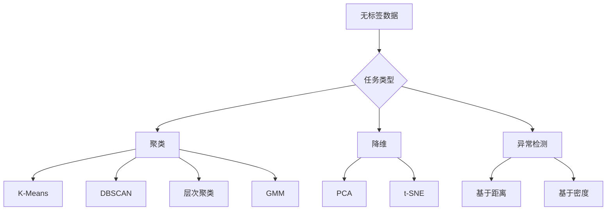

# 无监督学习

> 没有标准答案，没有老师批改——算法自己从数据的荒野里寻找秩序，找到的模式可能连数据采集者都没意识到。

**类型：** 实现课
**语言：** Python
**前置知识：** 阶段 01 · 14（范数与距离）、阶段 02 · 01（什么是机器学习）
**预计时间：** ~90 分钟
**所处阶段：** Tier 1
**关联课程：** 阶段 01 · 14（范数与距离）— 距离度量是聚类算法的核心；阶段 03 · 02（降维）— PCA 是高维数据预处理的标配

---

## 🎯 学习目标

完成本课后，你能够：

- [ ] 从零实现 K-Means、DBSCAN 和层次聚类，比较不同算法在相同数据上的聚类行为
- [ ] 使用肘部法和轮廓系数选择最优的 K 值，评估聚类质量
- [ ] 解释 DBSCAN 为何能发现任意形状的簇，而 K-Means 在非球形数据上失败
- [ ] 从零实现 PCA 降维，理解主成分分析如何保留数据的最大方差方向
- [ ] 构建基于聚类的异常检测流水线，识别偏离正常模式的数据点

---

## 1. 问题

你有一百万条用户行为记录。没有标签，没有分类，没有"正确答案"。

监督学习的教科书告诉你：给每个样本一个标签，训练模型学习输入到输出的映射。但现实是——标签太贵了。医院有千万份电子病历，但没有医生逐份标注了疾病亚型。电商平台有数十亿条用户行为日志，但没人手动标记了"高价值客户"和"流失风险客户"。安全团队有海量网络流量，但攻击模式在不断变化，没有固定的标签体系。

无监督学习面对的就是这种场景：数据在那里，结构也在那里，但没有人告诉你结构长什么样。

无监督学习算法自己发现数据中的模式——哪些用户行为相似，哪些交易异常，哪些文档讲的是同一件事。它不依赖标签，不需要"正确答案"，直接从数据本身挖掘秩序。

但代价是：没有标签，就没有明确的"对错"标准。K-Means 把数据分成 3 组，你凭什么说这比分成 5 组更好？DBSCAN 标记了 47 个异常点，你怎么知道这不是参数调错了？无监督学习的真正难点不是算法本身，而是评估——如何判断算法发现的结构是真实的模式，还是噪声的假象。

---

## 2. 概念

### 2.1 什么是无监督学习

无监督学习从无标签数据中发现隐藏的结构。主要任务包括：



### 2.2 聚类：将相似的东西分到一组

聚类的核心思想：同一组内的点彼此相似，不同组的点不相似。但"相似"由距离函数定义——不同的距离度量产生不同的聚类结果。

聚类算法的选择取决于：
- 数据规模（100 个点 vs 1000 万个点）
- 簇的形状（球形 vs 任意形状）
- 是否需要自动确定簇数量
- 是否需要识别异常点

### 2.3 K-Means：最经典的划分方法

K-Means 将数据划分为 K 个簇，每个簇由其质心（所有点的均值）表示。

**劳埃德算法（Lloyd's Algorithm）：**

1. 随机选择 K 个点作为初始质心
2. 将每个点分配到最近的质心，形成 K 个簇
3. 重新计算每个簇的质心（取均值）
4. 重复步骤 2-3，直到分配不再变化

```
迭代过程示意：

初始状态：                    第 1 次分配后：
  · · · · ·                    · · · · ·
  · ★ · · ·                    · ★ · · ·    ★ = 质心
  · · · · ·                    · · ● · ·    ● = 被分配到该质心的点
  · · ★ · ·                    · · ★ · ·
  · · · · ·                    · · · · ·

第 1 次更新质心后：            收敛状态：
  · · · · ·                    · · · · ·
  · · ★ · ·                    · · ★ · ·    质心不再移动
  · · · · ·                    · · · · ·    分配不再变化
  · · · ★ ·                    · · · ★ ·
  · · · · ·                    · · · · ·
```

**惯性（Inertia）** 衡量簇的紧密程度：

$$
\text{Inertia} = \sum_{i=1}^{n} \|x_i - \mu_{c_i}\|^2
$$

其中 $\mu_{c_i}$ 是点 $x_i$ 所属簇的质心。惯性越小，簇越紧密。

K-Means 的致命局限：假设簇是球形的。对于月牙形、环形等复杂结构，K-Means 会强制用球形切割，产生错误结果。

### 2.4 如何选择 K

**肘部法（Elbow Method）：** 运行 K-Means 多次（K=1, 2, 3, ...），绘制惯性随 K 变化的曲线。在某个 K 值处，惯性下降速率突然变缓，形成"手肘"形状——这个 K 就是最优值。

```
惯性
  |\
  | \
  |  \
  |   \___<- 肘部（最优 K=3）
  |       \___
  |___________\___ K
  1  2  3  4  5  6
```

**轮廓系数（Silhouette Score）：** 对每个点，计算：
- $a$ = 到同簇其他点的平均距离（内聚度）
- $b$ = 到最近异簇的平均距离（分离度）
- $s = (b - a) / \max(a, b)$

轮廓系数取值 [-1, 1]：
- 接近 1：点被很好地分配到簇中
- 接近 0：点在两个簇的边界上
- 接近 -1：点可能被分错了簇

### 2.5 DBSCAN：基于密度的聚类

K-Means 假设簇是球形的，需要预先指定 K。DBSCAN 不做这些假设——它通过"密度"发现簇。

两个核心参数：
- **eps（ε）**：邻域半径
- **min_samples**：成为核心点所需的最少邻居数

三种点类型：
- **核心点**：在 eps 半径内有至少 min_samples 个邻居
- **边界点**：在核心点的 eps 半径内，但自身不是核心点
- **噪声点**：既不是核心点也不是边界点——这就是异常点

```
DBSCAN 簇扩展过程：

核心点 A 发现邻居 B、C、D
  → B 也是核心点，发现邻居 E、F
    → E 是边界点，不再扩展
    → F 是核心点，发现邻居 G
      → G 是边界点

最终簇：{A, B, C, D, E, F, G}
噪声点：H（没有足够邻居，也不在任何核心点的邻域内）
```

DBSCAN 的优势：
- 能发现任意形状的簇
- 自动确定簇的数量
- 天然识别异常点（噪声点）

DBSCAN 的局限：
- 对 eps 和 min_samples 敏感
- 当簇密度差异大时效果差
- 高维空间中距离度量退化

### 2.6 层次聚类：构建树状结构

层次聚类构建一个树状图（树状图/dendrogram），展示数据从细到粗的多层次分组。

**凝聚法（自底向上）：**
1. 每个点开始作为独立的簇
2. 合并最近的两个簇
3. 重复直到只剩一个簇
4. 在树状图的某个高度切割，得到 K 个簇

四种连接方式：

| 连接方式 | 定义 | 特点 |
|---|---|---|
| 单连接 | 两簇最近两点的距离 | 能发现细长簇，但对噪声敏感（链式效应） |
| 全连接 | 两簇最远两点的距离 | 产生紧凑簇，但可能分裂大簇 |
| 平均连接 | 所有点对距离的平均 | 平衡选择，对噪声较鲁棒 |
| Ward 方法 | 合并后方差增加最小 | 产生大小均匀的簇，最常用 |

```
树状图（Dendrogram）：

高度
  |     ┌───┐
  |     │   │  ┌───┐
  | ┌───┤   │  │   │
  | │   │   ├──┤   │
  | │   │   │  │   │
  | │   │   │  │   │
  └─┴───┴───┴──┴───┴──
    A   B   C  D   E

在高度 2.0 处切割 → 得到 2 个簇：{A,B,C} 和 {D,E}
在高度 1.0 处切割 → 得到 3 个簇：{A,B}、{C}、{D,E}
```

### 2.7 PCA：主成分分析

PCA 是最经典的线性降维方法。核心思想：找到数据中方差最大的方向（主成分），将数据投影到这些方向上。

**算法步骤：**
1. 中心化：每个特征减去均值
2. 计算协方差矩阵
3. 求协方差矩阵的特征值和特征向量
4. 取前 k 个最大特征值对应的特征向量作为主成分
5. 将数据投影到主成分方向

PCA 的直觉：如果数据在某个方向上变化大（方差大），这个方向就包含了更多信息。PCA 保留高方差方向，丢弃低方差方向（通常是噪声）。

```
原始数据（3 维）          降维后（2 维）
     z                     PC2
     |                    /
     ·  ·                ·  ·
    · ·  ·              · ·  ·
   ·  ·  ·    → PC1    ·  ·  ·
  ·   ·   ·
```

### 2.8 异常检测

聚类天然支持异常检测——异常点就是那些不属于任何正常簇的点：

| 方法 | 异常定义 | 适用场景 |
|---|---|---|
| DBSCAN | 噪声点（标签为 -1） | 未知异常类型，任意形状 |
| K-Means | 距离质心最远的点 | 球形簇，需要快速检测 |
| PCA | 重构误差大的点 | 高维数据，线性结构 |

### 2.9 算法选择指南

| 场景 | 推荐算法 | 原因 |
|---|---|---|
| 已知簇数量，数据量大 | K-Means | 简单快速，O(n·K·迭代) |
| 未知簇数量，任意形状 | DBSCAN | 自动发现簇，识别噪声 |
| 需要层次结构，数据量小 | 层次聚类 | 可视化树状图，多粒度分析 |
| 需要软分配（概率） | GMM | 每个点有属于各簇的概率 |
| 高维数据预处理 | PCA | 降维去噪，保留主要信息 |

---

## 3. 从零实现

### 第 1 步：基础工具函数

```python
import math

def euclidean_distance(a, b):
    """欧几里得距离——两点之间的直线距离。"""
    return math.sqrt(sum((ai - bi) ** 2 for ai, bi in zip(a, b)))
```

### 第 2 步：K-Means 聚类

```python
def kmeans(data, k, max_iterations=100, seed=42):
    """K-Means 聚类算法。

    核心思想：将数据划分为 K 个簇，每个簇由其质心表示。
    算法交替执行分配步骤和更新步骤，直到收敛。
    """
    random.seed(seed)
    n_features = len(data[0])

    # 随机选择 K 个初始质心
    centroids = random.sample(data, k)

    for iteration in range(max_iterations):
        # 分配步骤：将每个点分配到最近的质心
        clusters = [[] for _ in range(k)]
        assignments = []

        for point in data:
            distances = [euclidean_distance(point, c) for c in centroids]
            nearest = distances.index(min(distances))
            clusters[nearest].append(point)
            assignments.append(nearest)

        # 更新步骤：重新计算质心
        new_centroids = []
        for cluster in clusters:
            if len(cluster) == 0:
                new_centroids.append(random.choice(data))
                continue
            centroid = [
                sum(point[j] for point in cluster) / len(cluster)
                for j in range(n_features)
            ]
            new_centroids.append(centroid)

        # 检查收敛
        if all(
            euclidean_distance(old, new) < 1e-6
            for old, new in zip(centroids, new_centroids)
        ):
            break

        centroids = new_centroids

    return assignments, centroids
```

为什么需要处理空簇？如果某个质心初始位置不好，可能没有任何点被分配到它。此时随机选择一个点作为新质心，避免算法崩溃。

### 第 3 步：轮廓系数

```python
def silhouette_score(data, assignments):
    """计算轮廓系数。

    对每个点：
    - a = 到同簇其他点的平均距离（内聚度）
    - b = 到最近异簇点的平均距离（分离度）
    - silhouette = (b - a) / max(a, b)
    """
    n = len(data)
    clusters = {}
    for i, c in enumerate(assignments):
        clusters.setdefault(c, []).append(i)

    scores = []
    for i in range(n):
        own_cluster = assignments[i]
        own_members = [j for j in clusters[own_cluster] if j != i]

        if len(own_members) == 0:
            scores.append(0.0)
            continue

        a = sum(euclidean_distance(data[i], data[j]) for j in own_members) / len(own_members)

        b = float("inf")
        for cluster_id, members in clusters.items():
            if cluster_id == own_cluster:
                continue
            avg_dist = sum(euclidean_distance(data[i], data[j]) for j in members) / len(members)
            b = min(b, avg_dist)

        scores.append((b - a) / max(a, b))

    return sum(scores) / len(scores)
```

### 第 4 步：DBSCAN 密度聚类

```python
def dbscan(data, eps, min_samples):
    """DBSCAN 密度聚类算法。

    核心思想：簇是数据空间中密集的区域，被稀疏区域分隔。
    不需要预先指定簇的数量，能发现任意形状的簇。
    """
    n = len(data)
    labels = [-1] * n  # -1 表示噪声
    cluster_id = 0

    def region_query(point_idx):
        """找到在 eps 半径内的所有邻居。"""
        neighbors = []
        for i in range(n):
            if euclidean_distance(data[point_idx], data[i]) <= eps:
                neighbors.append(i)
        return neighbors

    visited = [False] * n

    for i in range(n):
        if visited[i]:
            continue
        visited[i] = True

        neighbors = region_query(i)

        if len(neighbors) < min_samples:
            labels[i] = -1  # 暂时标记为噪声
            continue

        # 开始新簇
        labels[i] = cluster_id
        seed_set = list(neighbors)
        seed_set.remove(i)

        # 扩展簇
        j = 0
        while j < len(seed_set):
            q = seed_set[j]

            if not visited[q]:
                visited[q] = True
                q_neighbors = region_query(q)
                if len(q_neighbors) >= min_samples:
                    for nb in q_neighbors:
                        if nb not in seed_set:
                            seed_set.append(nb)

            if labels[q] == -1:
                labels[q] = cluster_id

            j += 1

        cluster_id += 1

    return labels
```

为什么 DBSCAN 能发现任意形状？因为它通过"密度可达性"扩展簇——只要点之间通过一连串密集区域相连，就属于同一个簇。这不像 K-Means 那样用距离质心的远近来划分。

### 第 5 步：层次聚类

```python
def agglomerative_labels(data, n_clusters=3, linkage="ward"):
    """层次凝聚聚类算法。

    从每个点开始作为独立的簇，逐步合并最近的簇，
    直到达到目标簇数量。
    """
    n = len(data)
    cluster_map = {i: [i] for i in range(n)}
    active_clusters = list(range(n))

    def cluster_distance(c1_indices, c2_indices):
        """根据连接方式计算两个簇之间的距离。"""
        if linkage == "single":
            return min(
                euclidean_distance(data[i], data[j])
                for i in c1_indices for j in c2_indices
            )
        elif linkage == "complete":
            return max(
                euclidean_distance(data[i], data[j])
                for i in c1_indices for j in c2_indices
            )
        elif linkage == "average":
            total = sum(
                euclidean_distance(data[i], data[j])
                for i in c1_indices for j in c2_indices
            )
            return total / (len(c1_indices) * len(c2_indices))
        elif linkage == "ward":
            merged = c1_indices + c2_indices
            centroid_m = [sum(data[i][d] for i in merged) / len(merged) for d in range(len(data[0]))]
            centroid_1 = [sum(data[i][d] for i in c1_indices) / len(c1_indices) for d in range(len(data[0]))]
            centroid_2 = [sum(data[i][d] for i in c2_indices) / len(c2_indices) for d in range(len(data[0]))]
            var_m = sum(euclidean_distance(data[i], centroid_m) ** 2 for i in merged)
            var_1 = sum(euclidean_distance(data[i], centroid_1) ** 2 for i in c1_indices)
            var_2 = sum(euclidean_distance(data[i], centroid_2) ** 2 for i in c2_indices)
            return var_m - var_1 - var_2

    next_id = n
    while len(active_clusters) > n_clusters:
        best_dist = float("inf")
        best_pair = None

        for idx_a in range(len(active_clusters)):
            for idx_b in range(idx_a + 1, len(active_clusters)):
                c_a = active_clusters[idx_a]
                c_b = active_clusters[idx_b]
                dist = cluster_distance(cluster_map[c_a], cluster_map[c_b])
                if dist < best_dist:
                    best_dist = dist
                    best_pair = (c_a, c_b)

        c_a, c_b = best_pair
        cluster_map[next_id] = cluster_map[c_a] + cluster_map[c_b]
        active_clusters.remove(c_a)
        active_clusters.remove(c_b)
        active_clusters.append(next_id)
        next_id += 1

    labels = [0] * n
    for cluster_label, cluster_id in enumerate(active_clusters):
        for point_idx in cluster_map[cluster_id]:
            labels[point_idx] = cluster_label

    return labels
```

### 第 6 步：PCA 降维

```python
def pca(data, n_components=2):
    """主成分分析（PCA）——线性降维算法。

    核心思想：找到数据中方差最大的方向（主成分），
    将数据投影到这些方向上，实现降维。
    """
    n = len(data)
    d = len(data[0])

    # 1. 中心化
    means = [sum(data[i][j] for i in range(n)) / n for j in range(d)]
    centered = [[data[i][j] - means[j] for j in range(d)] for i in range(n)]

    # 2. 计算协方差矩阵
    cov = [[0.0] * d for _ in range(d)]
    for i in range(d):
        for j in range(d):
            cov[i][j] = sum(centered[k][i] * centered[k][j] for k in range(n)) / (n - 1)

    # 3. 幂迭代法求主特征向量
    def mat_vec_mult(matrix, vector):
        size = len(matrix)
        return [sum(matrix[i][j] * vector[j] for j in range(size)) for i in range(size)]

    def normalize(vector):
        norm = math.sqrt(sum(v ** 2 for v in vector))
        return [v / norm for v in vector] if norm > 1e-10 else vector

    def power_iteration(matrix, n_iter=50):
        size = len(matrix)
        vector = [random.random() for _ in range(size)]
        for _ in range(n_iter):
            vector = mat_vec_mult(matrix, vector)
            vector = normalize(vector)
        mv = mat_vec_mult(matrix, vector)
        eigenvalue = sum(vector[i] * mv[i] for i in range(size))
        return eigenvalue, vector

    # 4. 求前 n_components 个主成分
    components = []
    variances = []
    remaining_cov = [row[:] for row in cov]

    for _ in range(n_components):
        eigenvalue, eigenvector = power_iteration(remaining_cov)
        if eigenvalue < 1e-10:
            break
        components.append(eigenvector)
        variances.append(eigenvalue)
        # 移除该成分的影响
        for i in range(d):
            for j in range(d):
                remaining_cov[i][j] -= eigenvalue * eigenvector[i] * eigenvector[j]

    # 5. 投影数据
    projected = []
    for i in range(n):
        point = [sum(centered[i][j] * comp[j] for j in range(d)) for comp in components]
        projected.append(point)

    return projected, variances
```

### 第 7 步：异常检测

```python
def detect_anomalies_dbscan(data, eps, min_samples):
    """基于 DBSCAN 的异常检测。

    DBSCAN 中的噪声点（标签为 -1）即为异常点。
    """
    labels = dbscan(data, eps, min_samples)
    anomalies = [data[i] for i in range(len(labels)) if labels[i] == -1]
    return anomalies, labels


def detect_anomalies_kmeans(data, k, threshold_percentile=95):
    """基于 K-Means 的异常检测。

    距离质心最远的点被视为异常点。
    """
    assignments, centroids = kmeans(data, k)
    distances = [
        euclidean_distance(point, centroids[cluster_id])
        for point, cluster_id in zip(data, assignments)
    ]
    sorted_dists = sorted(distances)
    threshold_index = int(len(sorted_dists) * threshold_percentile / 100)
    threshold = sorted_dists[min(threshold_index, len(sorted_dists) - 1)]
    anomalies = [data[i] for i in range(len(distances)) if distances[i] > threshold]
    return anomalies, distances
```

完整代码（含所有演示函数）见 `code/main.py`。

---

## 4. 工业工具

### 4.1 scikit-learn 实现

```python
from sklearn.cluster import KMeans, DBSCAN, AgglomerativeClustering
from sklearn.mixture import GaussianMixture
from sklearn.decomposition import PCA
from sklearn.metrics import silhouette_score
from sklearn.preprocessing import StandardScaler
import numpy as np

# K-Means
km = KMeans(n_clusters=3, random_state=42, n_init=10)
km_labels = km.fit_predict(data)
print(f"惯性: {km.inertia_:.2f}")
print(f"轮廓系数: {silhouette_score(data, km_labels):.4f}")

# DBSCAN
db = DBSCAN(eps=1.5, min_samples=5)
db_labels = db.fit_predict(data)
n_clusters = len(set(db_labels) - {-1})
n_noise = list(db_labels).count(-1)
print(f"发现 {n_clusters} 个簇，{n_noise} 个噪声点")

# 层次聚类
agg = AgglomerativeClustering(n_clusters=3, linkage="ward")
agg_labels = agg.fit_predict(data)

# GMM（高斯混合模型）
gmm = GaussianMixture(n_components=3, random_state=42)
gmm_labels = gmm.fit_predict(data)
proba = gmm.predict_proba(data)  # 软分配概率

# PCA 降维
pca = PCA(n_components=2)
reduced = pca.fit_transform(data)
print(f"解释方差比例: {pca.explained_variance_ratio_}")
```

### 4.2 大规模聚类

对于百万级数据，使用 Mini-Batch K-Means 或 BIRCH：

```python
from sklearn.cluster import MiniBatchKMeans, Birch

# Mini-Batch K-Means：每次只用一个子集更新质心
mbk = MiniBatchKMeans(n_clusters=100, batch_size=1000, random_state=42)
mbk_labels = mbk.fit_predict(large_data)

# BIRCH：构建 CF 树，适合超大规模数据
birch = Birch(n_clusters=100, threshold=0.5)
birch_labels = birch.fit_predict(large_data)
```

### 4.3 性能对比

| 实现方式 | 速度 | 适用场景 |
|---|---|---|
| 从零实现（纯 Python） | 慢 | 学习理解原理 |
| scikit-learn | 快 | 生产环境，中小规模数据 |
| Mini-Batch K-Means | 很快 | 百万级数据 |
| HDBSCAN | 快 | 任意形状，自动确定簇数 |
| FAISS（GPU） | 极快 | 十亿级向量聚类 |

---

## 5. 知识连线

本课学习的无监督学习算法，在后续多个阶段中扮演关键角色：

- **阶段 01 · 14（范数与距离）**：距离度量是聚类算法的核心。本课直接建立在欧几里得距离、曼哈顿距离的理解之上
- **阶段 03 · 02（降维）**：PCA 是高维数据预处理的标配。理解特征值和主成分有助于理解更复杂的降维方法（t-SNE、UMAP）
- **阶段 11 · 02（向量数据库）**：RAG 系统的检索阶段依赖相似度搜索，而聚类算法用于向量索引构建（如 IVF-PQ）

---

## 6. 工程最佳实践

### 6.1 工业界常用方案

| 场景 | 推荐方案 | 备注 |
|---|---|---|
| 客户分群 | K-Means + RFM 特征 | 简单快速，业务可解释性强 |
| 异常检测 | DBSCAN 或孤立森林 | DBSCAN 适合基于密度的异常，孤立森林适合高维 |
| 文档聚类 | K-Means + TF-IDF / 嵌入向量 | 先降维再聚类效果更好 |
| 图像分割 | K-Means（像素级） | 将像素颜色聚类实现分割 |
| 高维数据 | 先 PCA 再聚类 | 降到 20-50 维后再用 K-Means |

### 6.2 中文场景特别建议

- 中文文本聚类时，先分词再提取 TF-IDF 特征，或使用预训练嵌入向量（如 BGE、M3E）
- 中文短文本聚类优先使用余弦距离——文本长度差异大，欧几里得距离会被长度主导
- 中文电商评论聚类时，注意去除停用词和标点，否则聚类结果会被高频无意义词主导

### 6.3 踩坑经验

- 忘记标准化特征：K-Means 对特征尺度极其敏感。一个取值范围 0-10000 的特征会完全主导距离计算
- 高维数据直接聚类：超过 50 维时距离失去区分能力，必须先降维
- DBSCAN 的 eps 参数选择：使用 k-距离图（k-distance plot）辅助选择——计算每个点到第 k 近邻的距离，排序后画曲线，拐点处即为合适的 eps
- K-Means 的随机初始化问题：使用 K-Means++ 初始化（scikit-learn 默认已启用），或多次运行取最优结果
- 将聚类标签当作真实标签：聚类是探索性分析，结果需要结合业务知识验证，不能直接作为监督学习的标签

---

## 7. 常见错误

### 错误 1：未标准化特征直接使用 K-Means

**现象：** 聚类结果完全由某个特征决定，其他特征几乎不起作用。

**原因：** K-Means 依赖距离计算。一个取值范围 0-10000 的特征在距离计算中的贡献远大于取值范围 0-1 的特征。

**修复：**

```python
# ❌ 错误：直接使用原始特征
km = KMeans(n_clusters=3).fit(data)

# ✓ 正确：先标准化再聚类
scaler = StandardScaler()
data_scaled = scaler.fit_transform(data)
km = KMeans(n_clusters=3).fit(data_scaled)
```

### 错误 2：对非球形数据使用 K-Means

**现象：** 轮廓系数很低，聚类结果与直觉不符。

**原因：** K-Means 假设簇是球形的。对于月牙形、环形等复杂结构，K-Means 会强制用球形切割。

**修复：**

```python
# ✓ 方案 1：使用 DBSCAN
db = DBSCAN(eps=0.3, min_samples=5).fit(data)

# ✓ 方案 2：使用 HDBSCAN（更鲁棒的密度聚类）
import hdbscan
hdb = hdbscan.HDBSCAN(min_cluster_size=10).fit(data)
```

### 错误 3：DBSCAN 的 eps 参数选择不当

**现象：** eps 太大时所有点被分到同一个簇；eps 太小时所有点都是噪声。

**原因：** eps 决定了"邻域"的大小。不合适的 eps 使算法无法发现有意义的密度结构。

**修复：**

```python
# ✓ 使用 k-距离图选择 eps
from sklearn.neighbors import NearestNeighbors
import numpy as np

neighbors = NearestNeighbors(n_neighbors=5)
neighbors.fit(data)
distances, _ = neighbors.kneighbors(data)
k_distances = np.sort(distances[:, -1])  # 第 5 近邻的距离

# 绘制 k-距离图，拐点处即为合适的 eps
# import matplotlib.pyplot as plt
# plt.plot(k_distances)
# plt.xlabel("Points")
# plt.ylabel("5-NN distance")
```

### 错误 4：盲目选择 K 值

**现象：** K-Means 运行了，但不知道 K 是否合理。

**原因：** K 值的选择不是任意的，需要数据驱动的方法。

**修复：**

```python
# ✓ 方案 1：肘部法
inertias = []
for k in range(1, 11):
    km = KMeans(n_clusters=k, n_init=10).fit(data)
    inertias.append(km.inertia_)
# 绘制惯性曲线，选择拐点

# ✓ 方案 2：轮廓系数
from sklearn.metrics import silhouette_score
for k in range(2, 11):
    km = KMeans(n_clusters=k, n_init=10).fit(data)
    score = silhouette_score(data, km.labels_)
    print(f"K={k}: 轮廓系数={score:.4f}")
```

### 错误 5：高维数据直接聚类

**现象：** 聚类结果不稳定，每次运行结果差异大，轮廓系数接近 0。

**原因：** 高维空间中距离收敛（维度灾难），所有点几乎等距，聚类失去意义。

**修复：**

```python
# ✓ 先降维再聚类
from sklearn.decomposition import PCA

pca = PCA(n_components=20)  # 降到 20 维
data_reduced = pca.fit_transform(data)
km = KMeans(n_clusters=5).fit(data_reduced)
```

---

## 8. 面试考点

### Q1：K-Means 和 DBSCAN 的核心区别是什么？（难度：⭐⭐）

**参考答案：**
K-Means 是基于划分的聚类，假设簇是球形的，需要预先指定 K 值，每个点属于且仅属于一个簇（硬分配）。DBSCAN 是基于密度的聚类，不需要预先指定 K 值，能发现任意形状的簇，自动识别噪声点。K-Means 对异常值敏感（异常值会拉偏质心），DBSCAN 对异常值鲁棒（异常值被标记为噪声）。

### Q2：轮廓系数为 0.15 意味着什么？这个聚类结果能用吗？（难度：⭐⭐）

**参考答案：**
轮廓系数为 0.15 意味着聚类结构较弱——点的内聚度和分离度差别不大，簇与簇之间重叠严重。通常认为轮廓系数 > 0.5 表示合理的聚类结构，> 0.7 表示强聚类结构。0.15 的结果可能意味着：数据本身没有明显的簇结构、选择的 K 值不合适、或者当前特征不能有效区分簇。需要结合业务场景判断——如果只是做探索性分析，可以接受；如果要做决策支持，需要改进特征或换算法。

### Q3：如何为 DBSCAN 选择合适的 eps 参数？（难度：⭐⭐⭐）

**参考答案：**
使用 k-距离图（k-distance plot）：
1. 对每个点，计算它到第 k 近邻的距离（k 通常取 min_samples-1）
2. 将所有点的 k-距离排序
3. 绘制排序后的 k-距离曲线
4. 曲线中的"拐点"（急剧上升前的平坦区域结束处）对应的距离就是合适的 eps

原理：在拐点处，距离从"簇内距离"跳变到"簇间距离"。选择拐点作为 eps 可以确保簇内点被正确连接，同时不将不同簇的点混在一起。

### Q4：手写 K-Means 算法的伪代码（难度：⭐⭐⭐）

**参考答案：**

```python
def kmeans(data, k, max_iter=100):
    # 1. 初始化：随机选择 K 个质心
    centroids = random_sample(data, k)

    for _ in range(max_iter):
        # 2. 分配：每个点分配到最近的质心
        for point in data:
            distances = [distance(point, c) for c in centroids]
            assignment[point] = argmin(distances)

        # 3. 更新：重新计算质心
        new_centroids = []
        for cluster_id in range(k):
            members = [p for p in data if assignment[p] == cluster_id]
            new_centroid = mean(members)  # 各维度取均值
            new_centroids.append(new_centroid)

        # 4. 检查收敛
        if centroids == new_centroids:
            break
        centroids = new_centroids

    return assignment, centroids
```

### Q5：PCA 和 t-SNE 的区别是什么？各自适用场景？（难度：⭐⭐⭐）

**参考答案：**
PCA 是线性降维，保留数据的全局结构（最大方差方向），可逆（可以从降维结果重构原始数据），适合预处理和特征提取。t-SNE 是非线性降维，保留局部结构（相似点在低维空间也靠近），不可逆，主要用于可视化（降到 2-3 维）。PCA 适合：特征压缩、去噪、加速后续算法。t-SNE 适合：高维数据可视化、探索性数据分析。注意：t-SNE 的结果受 perplexity 参数影响大，不同运行可能产生不同结果，不适合用于后续机器学习任务。

---

## 🔑 关键术语

| 术语 | 人们怎么说 | 实际含义 |
|---|---|---|
| 聚类 | "把相似的东西分到一组" | 将数据划分为子集，使子集内相似度高于子集间相似度，由距离度量定义 |
| 质心 | "簇的中心点" | 簇内所有点的均值坐标，K-Means 用它代表整个簇 |
| 惯性 | "簇有多紧" | 每个点到其质心的距离平方和，越小越紧密 |
| 轮廓系数 | "聚类质量分数" | 对每个点计算 (b-a)/max(a,b)，衡量内聚度与分离度的比值 |
| 核心点 | "密集区域的点" | DBSCAN 中在 eps 半径内有至少 min_samples 个邻居的点 |
| 噪声点 | "异常值" | DBSCAN 中不属于任何簇的点，即异常点 |
| 树状图 | "聚类树" | 层次聚类中展示合并顺序和距离的树形图 |
| 主成分 | "数据变化最大的方向" | 协方差矩阵的特征向量，按特征值从大到小排列 |
| 解释方差 | "这个方向有多重要" | 主成分对应的特征值，反映该方向的数据变异程度 |
| 密度可达 | "通过密集区域相连" | DBSCAN 中两个点通过一连串核心点相连的关系 |

---

## 📚 小结

无监督学习从无标签数据中发现隐藏结构——聚类将相似点分组，降维压缩信息密度，异常检测识别偏离模式的数据点。你从零实现了 K-Means、DBSCAN、层次聚类和 PCA，理解了每种算法的适用场景和局限性。

下一课我们将学习集成学习——通过组合多个弱学习器构建强学习器，这是实际工程中最常用的提升模型性能的技术。

---

## ✏️ 练习

1. 【理解】用自己的话解释：为什么 K-Means 不能发现月牙形的簇？DBSCAN 为什么可以？写 200 字以内的说明，让一个没有 ML 背景的程序员也能听懂。

2. 【实现】修改 `kmeans` 函数，实现 K-Means++ 初始化：第一个质心随机选择，后续每个质心以概率正比于到最近已有质心的距离平方来选择。比较 K-Means++ 与普通随机初始化的收敛速度。

3. 【实验】生成两个月牙形数据集（`make_moons`），分别用 K-Means 和 DBSCAN 聚类。计算两种算法的轮廓系数，可视化聚类结果，解释为什么 DBSCAN 在轮廓系数上优于 K-Means。

4. 【思考】在 RAG 系统中，文档嵌入向量通常是 768 维或 1536 维。如果要在百万级文档上做聚类，你会选择哪种算法？需要考虑哪些因素？（提示：从数据规模、簇形状、计算复杂度三个角度分析）

---

## 🚀 产出

本课产出以下可复用内容：

| 产出 | 文件 | 说明 |
|---|---|---|
| 无监督学习完整实现 | `code/main.py` | 从零实现的 K-Means、DBSCAN、层次聚类、PCA、异常检测 |
| 聚类算法选择指南 | `outputs/prompt-clustering-guide.md` | 根据数据特征推荐聚类算法的提示词 |

---

## 📖 参考资料

1. [论文] Lloyd. "Least Squares Quantization in PCM". IEEE Transactions on Information Theory, 1982. https://ieeexplore.ieee.org/document/1056540
2. [论文] Ester et al. "A Density-Based Algorithm for Discovering Clusters in Large Spatial Databases with Noise". KDD, 1996. https://www.aaai.org/Papers/KDD/1996/KDD96-037.pdf
3. [论文] Jolliffe, Cadima. "Principal component analysis: a review and recent developments". Philosophical Transactions of the Royal Society A, 2016. https://doi.org/10.1098/rsta.2015.0202
4. [论文] van der Maaten, Hinton. "Visualizing Data using t-SNE". Journal of Machine Learning Research, 2008. https://jmlr.org/papers/v9/vandermaaten08a.html
5. [官方文档] scikit-learn. "Clustering". https://scikit-learn.org/stable/modules/clustering.html
6. [官方文档] scikit-learn. "PCA". https://scikit-learn.org/stable/modules/decomposition.html#pca
7. [书籍] 李航. 《统计学习方法（第3版）》. 清华大学出版社, 2019.

---

> 本课程参考了 AI Engineering From Scratch（MIT License）的课程体系，在此基础上进行了重构和原创内容的扩充。所有中文表达、案例、LLM 视角分析、工程最佳实践、常见错误、面试考点等均为原创内容。
