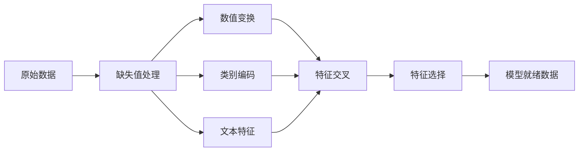

# 特征工程与特征选择

> 好的特征值一千条数据。数据不够，特征来凑——前提是赌对了哪些特征值得赌。

**类型：** 实现课
**语言：** Python
**前置知识：** 阶段 01（数学基础）、阶段 02 第 1-7 节
**预计时间：** ~90 分钟
**所处阶段：** Tier 1
**关联课程：** 阶段 03 · 02（数据流水线）— 将本课的特征变换整合为训练流水线

## 🎯 学习目标

完成本课后，你能够：

- [ ] 从零实现数值缩放、对数变换、分箱和特征交叉，并解释每种变换的适用场景
- [ ] 从零实现独热编码、标签编码和目标编码，识别目标编码中的数据泄露风险
- [ ] 从零构建 TF-IDF 向量化器，解释为什么 TF-IDF 优于原始词频用于文本分类
- [ ] 应用基于过滤器的特征选择（方差阈值、相关系数、互信息）降低维度
- [ ] 使用 scikit-learn 的 `ColumnTransformer` 和 `Pipeline` 构建可复用的特征工程流水线

## 1. 问题

你手头有一个数据集。你选了一个算法，训练了模型——效果平平。你换了一个更复杂的算法——还是平平。你花了一周调超参数——有了一点点提升。

然后有人对原始数据做了一番变换，一个简单的逻辑回归就打败了你精心调参的梯度提升集成模型。

这种事在经典机器学习中反复出现：**数据的表示方式比算法选择更重要**。一个房价模型，如果输入是"面积"和"卧室数量"，它的表现大概率会好过用"原始地址字符串"作为输入的模型，无论后者用了多高级的学习器。算法只能利用你喂给它的东西——垃圾进，垃圾出永远不会缺席。

特征工程就是把原始数据变换成更容易被模型识别的模式的过程。特征选择则是抛弃那些只添加噪声而没有信号的特征。两者合在一起，是经典机器学习中投入产出比最高的环节。

现实中的数据集从来不是干净的。你拿到的数据可能有缺失值（用户没有填写收入）、可能有偏态分布（少数城市房价比平均值高 10 倍）、可能有非数值字段（城市名、商品类别），也可能有大量重复或无关的列。不做特征工程，直接把原始数据丢给模型——模型不会自己"发现"应该取对数、应该分箱、应该做交叉。这些先验知识是人类独有的武器，也是特征工程的核心价值。

## 2. 概念

### 2.1 特征流水线

特征工程不是一个单一操作，而是一个从原始数据到模型就绪数据的完整流水线：



每一步的输出直接作为下一步的输入，任何一步的决策都会影响最终送入模型的数据形态。

### 2.2 数值特征

原始数字几乎不会直接适配模型。常见的变换方式包括：

**缩放（Scaling）**：让所有特征处于同一数量级。基于距离的算法（K-均值、KNN、SVM）对特征尺度极为敏感——如果不缩放，数值范围大的特征会主导距离计算，而数值范围小的特征几乎被忽略。最小-最大缩放映射到 [0, 1]，标准化（Z-Score）映射到均值=0、标准差=1。

> 未缩放 vs 缩放后的影响：
>
> | 特征 | 原始范围 | KNN 中的影响 |
> |---|---|---|
> | 年收入 | 0 ~ 500,000 元 | 主导距离计算 |
> | 年龄 | 0 ~ 100 岁 | 几乎不影响 |

**对数变换**：压缩右偏分布——房价、收入、用户活跃度这类特征通常右偏：少数极端值"拉尾巴"。对数变换把这些极端值压缩到合理范围，还把乘法关系转为加法关系，更适合线性模型。

**分箱（Binning）**：把连续值离散化为几个区间。当特征与目标的关系不是线性而是阶梯状时（如年龄与保险费用），分箱比原始连续值更有效。

**特征交叉**：通过乘法组合多维特征——单独"身高"和"体重"不如 BMI = 体重/身高²。让线性模型能捕获非线性关系，代价是特征数量增加。

### 2.3 类别特征

模型只能吃数字。类别必须被编码成数值，但不同的编码方式会引入不同的"假设陷阱"——

**独热编码（One-Hot Encoding）**：为每个类别创建一列，每行只有一个为 1，其余为 0。这是最"安全"的编码方式——不引入任何虚假顺序关系。但当类别数量很大时（如城市的邮政编码有几万个），会产生大量稀疏列，带来维度灾难。

```
原始类别列:       独热编码后:
["北京",           [1, 0, 0],
 "上海",    →      [0, 1, 0],
 "广州"]           [0, 0, 1]
```

**标签编码（Label Encoding）**：把每个类别映射到一个整数——北京=0，上海=1，广州=2。问题是这会引入虚假的大小关系：模型可能认为"广州 2"大于"北京 0"，在 0 和 1 之间的"上海"是北京和广州的平均值？这在数学上毫无意义。仅适用于树模型（它们基于阈值分裂，不依赖数值大小）。

**目标编码（Target Encoding）**：用每个类别下目标变量的均值替代类别值。例如，"北京"房价均值为 600 万，就用 600 万代替"北京"这个词。这种方法非常强大——它直接让特征与目标关联——但也极其危险。

```
⚠️ 数据泄露警告：
目标编码如果用全局数据（包括测试集）计算均值，
等于让模型提前"看到"了测试集的答案。
必须在训练集上计算映射，在测试集上直接采用。
```

### 2.4 文本特征

文本不能直接输入模型，需要数值化。

**词袋（Bag of Words）**：统计每个词在每篇文档中出现的次数，构建文档-词矩阵。丢弃语法和词序，只保留频率。

**TF-IDF（词频-逆文档频率）**：在词频基础上引入惩罚项——如果一个词在几乎所有文档中都出现（如"的"、"是"），那它对区分文档没有帮助，应该降低权重。稀有词获得更高权重。

$$
\text{TF}(w, d) = \frac{词 w 在文档 d 中出现次数}{文档 d 总词数}
$$

$$
\text{IDF}(w) = \log\frac{总文档数}{包含词 w 的文档数}
$$

$$
\text{TF-IDF}(w, d) = \text{TF}(w, d) \times \text{IDF}(w)
$$

> TF-IDF 效果示意：
>
> 文档："这只猫坐在垫子上"
>
> | 词 | 词频 TF | 逆文档频率 IDF | TF-IDF |
> |---|---|---|---|
> | 这 | 1/6 | log(1000/999) ≈ 0.001 | ≈ 0 |
> | 猫 | 1/6 | log(1000/50) ≈ 3.0 | ≈ 0.50 |
> | 垫子 | 1/6 | log(1000/20) ≈ 3.9 | ≈ 0.65 |
>
> "这"几乎没有区分度，"垫子"获得最高权重——因为它更独特。

### 2.5 缺失值处理

真实数据总是有空洞。处理策略因情况而异：

| 策略 | 适用场景 | 注意事项 |
|---|---|---|
| 删除样本 | 缺失率低（<5%）且随机缺失 | 如果缺失不是随机的，删除会引入偏差 |
| 均值/中位数填充 | 数值特征 | 中位数对异常值更鲁棒 |
| 众数填充 | 类别特征 | 最简单的类别填充策略 |
| 添加缺失指示器 | 缺失本身可能含信息 | "用户未填写收入"本身可能是高风险的信号 |
| 前向/后向填充 | 时间序列 | 用相邻时间点的值填充 |

### 2.6 特征选择

特征越多未必越好。无关特征增加噪声、延长训练时间，还可能引发过拟合。

**过滤器方法（预模型）：**
- **方差阈值**：移除方差几乎为零的特征——几乎不变的特征不含信息
- **相关系数**：移除高度相关的冗余特征——两个特征相关系数 0.98，说明几乎在说同一件事
- **互信息**：衡量知道特征 X 后，对目标 Y 的不确定性减少了多少

**包装方法（模型相关）：**
- L1 正则化（Lasso）：将无关特征的权重推向零
- 递归特征消除：训练→移除最弱的特征→重复

关键洞察：一个有 10 个好特征的模型，几乎总是好过一个有 10 个好特征和 90 个噪声特征的模型。

## 3. 从零实现

### 第 1 步：数值变换

```python
import math


def min_max_scale(values):
    """最小-最大缩放：将特征映射到 [0, 1] 区间。"""
    min_val = min(values)
    max_val = max(values)
    if max_val == min_val:
        return [0.0] * len(values)
    return [(v - min_val) / (max_val - min_val) for v in values]


def standardize(values):
    """标准化（Z-Score）：转换为均值=0、标准差=1 的分布。"""
    n = len(values)
    mean = sum(values) / n
    variance = sum((v - mean) ** 2 for v in values) / n
    std = math.sqrt(variance) if variance > 0 else 1.0
    return [(v - mean) / std for v in values]


def log_transform(values):
    """对数变换：压缩右偏分布，将乘法关系转为加法关系。"""
    return [math.log(v + 1) for v in values]


def bin_values(values, n_bins=5):
    """分箱：将连续值离散化为指定数量的区间。"""
    min_val = min(values)
    max_val = max(values)
    bin_width = (max_val - min_val) / n_bins
    if bin_width == 0:
        return [0] * len(values)
    result = []
    for v in values:
        bin_idx = int((v - min_val) / bin_width)
        bin_idx = min(bin_idx, n_bins - 1)  # 边界安全处理
        result.append(bin_idx)
    return result


def polynomial_features(row, degree=2):
    """特征交叉：生成平方项和交互项。"""
    n = len(row)
    result = list(row)
    if degree >= 2:
        for i in range(n):
            result.append(row[i] ** 2)
        for i in range(n):
            for j in range(i + 1, n):
                result.append(row[i] * row[j])
    return result
```

### 第 2 步：类别编码

```python
def one_hot_encode(values):
    """独热编码：为每个类别生成一列二值特征。"""
    categories = sorted(set(values))
    cat_to_idx = {cat: i for i, cat in enumerate(categories)}
    n_cats = len(categories)

    encoded = []
    for v in values:
        row = [0] * n_cats
        row[cat_to_idx[v]] = 1
        encoded.append(row)

    return encoded, categories


def label_encode(values):
    """标签编码：将每个类别映射到一个整数（仅适用于树模型）。"""
    categories = sorted(set(values))
    cat_to_int = {cat: i for i, cat in enumerate(categories)}
    return [cat_to_int[v] for v in values], cat_to_int


def target_encode(feature_values, target_values, smoothing=10):
    """目标编码：用每个类别下目标的均值替换值，带平滑防止过拟合。"""
    global_mean = sum(target_values) / len(target_values)

    category_stats = {}
    for feat, target in zip(feature_values, target_values):
        if feat not in category_stats:
            category_stats[feat] = {"sum": 0.0, "count": 0}
        category_stats[feat]["sum"] += target
        category_stats[feat]["count"] += 1

    # 平滑：样本少的类别更接近全局均值
    encoding = {}
    for cat, stats in category_stats.items():
        cat_mean = stats["sum"] / stats["count"]
        weight = stats["count"] / (stats["count"] + smoothing)
        encoding[cat] = weight * cat_mean + (1 - weight) * global_mean

    return [encoding[v] for v in feature_values], encoding
```

### 第 3 步：文本特征

```python
def count_vectorize(documents):
    """词袋模型：统计每个词在每篇文档中出现的次数。"""
    vocab = {}
    idx = 0
    for doc in documents:
        for word in doc.lower().split():
            if word not in vocab:
                vocab[word] = idx
                idx += 1

    vectors = []
    for doc in documents:
        vec = [0] * len(vocab)
        for word in doc.lower().split():
            vec[vocab[word]] += 1
        vectors.append(vec)

    return vectors, vocab


def tfidf(documents):
    """TF-IDF：词频-逆文档频率。"""
    n_docs = len(documents)

    # 构建词表
    vocab = {}
    idx = 0
    for doc in documents:
        for word in doc.lower().split():
            if word not in vocab:
                vocab[word] = idx
                idx += 1

    # 计算文档频率（每个词出现在多少篇文档中）
    doc_freq = {}
    for doc in documents:
        seen = set()
        for word in doc.lower().split():
            if word not in seen:
                doc_freq[word] = doc_freq.get(word, 0) + 1
                seen.add(word)

    # 计算每篇文档的 TF-IDF 向量
    vectors = []
    for doc in documents:
        words = doc.lower().split()
        word_count = len(words)
        tf_map = {}
        for word in words:
            tf_map[word] = tf_map.get(word, 0) + 1

        vec = [0.0] * len(vocab)
        for word, count in tf_map.items():
            tf = count / word_count
            idf = math.log(n_docs / doc_freq[word])
            vec[vocab[word]] = tf * idf
        vectors.append(vec)

    return vectors, vocab
```

### 第 4 步：缺失值处理

```python
def impute_mean(values):
    """均值填充。"""
    present = [v for v in values if v is not None]
    if not present:
        return [0.0] * len(values), 0.0
    mean = sum(present) / len(present)
    return [v if v is not None else mean for v in values], mean


def impute_median(values):
    """中位数填充：对异常值更鲁棒。"""
    present = sorted(v for v in values if v is not None)
    if not present:
        return [0.0] * len(values), 0.0
    n = len(present)
    if n % 2 == 0:
        median = (present[n // 2 - 1] + present[n // 2]) / 2
    else:
        median = present[n // 2]
    return [v if v is not None else median for v in values], median


def impute_mode(values):
    """众数填充：适用于类别特征。"""
    present = [v for v in values if v is not None]
    if not present:
        return values, None
    counts = {}
    for v in present:
        counts[v] = counts.get(v, 0) + 1
    mode = max(counts, key=counts.get)
    return [v if v is not None else mode for v in values], mode


def add_missing_indicator(values):
    """缺失指示器：标记缺失位置（缺失本身可能有信息）。"""
    return [0 if v is not None else 1 for v in values]
```

### 第 5 步：特征选择

```python
def correlation(x, y):
    """皮尔逊相关系数。"""
    n = len(x)
    mean_x = sum(x) / n
    mean_y = sum(y) / n
    cov = sum((xi - mean_x) * (yi - mean_y) for xi, yi in zip(x, y)) / n
    std_x = math.sqrt(sum((xi - mean_x) ** 2 for xi in x) / n)
    std_y = math.sqrt(sum((yi - mean_y) ** 2 for yi in y) / n)
    if std_x == 0 or std_y == 0:
        return 0.0
    return cov / (std_x * std_y)


def mutual_information(feature, target, n_bins=10):
    """互信息：衡量 X 对 Y 的不确定性的减少程度。"""
    feat_min = min(feature)
    feat_max = max(feature)
    bin_width = (feat_max - feat_min) / n_bins if feat_max != feat_min else 1.0
    feat_binned = [
        min(int((f - feat_min) / bin_width), n_bins - 1) for f in feature
    ]

    n = len(feature)
    target_classes = sorted(set(target))

    feat_bins = sorted(set(feat_binned))
    p_feat = {b: feat_binned.count(b) / n for b in feat_bins}
    p_target = {t: target.count(t) / n for t in target_classes}

    mi = 0.0
    for b in feat_bins:
        for t in target_classes:
            joint_count = sum(
                1 for fb, tv in zip(feat_binned, target) if fb == b and tv == t
            )
            p_joint = joint_count / n
            if p_joint > 0:
                mi += p_joint * math.log(p_joint / (p_feat[b] * p_target[t]))

    return mi


def variance_threshold(features, threshold=0.01):
    """方差阈值：移除方差过低的特征。"""
    n_features = len(features[0])
    n_samples = len(features)
    selected = []

    for j in range(n_features):
        col = [features[i][j] for i in range(n_samples)]
        mean = sum(col) / n_samples
        var = sum((v - mean) ** 2 for v in col) / n_samples
        if var >= threshold:
            selected.append(j)

    return selected


def remove_correlated(features, threshold=0.9):
    """移除高相关特征。"""
    n_features = len(features[0])
    n_samples = len(features)
    to_remove = set()

    for i in range(n_features):
        if i in to_remove:
            continue
        col_i = [features[r][i] for r in range(n_samples)]
        for j in range(i + 1, n_features):
            if j in to_remove:
                continue
            col_j = [features[r][j] for r in range(n_samples)]
            if abs(correlation(col_i, col_j)) >= threshold:
                to_remove.add(j)

    return [i for i in range(n_features) if i not in to_remove]
```

### 第 6 步：完整流水线演示

完整代码见 `code/main.py`，运行后将展示从原始数据到模型就绪数据的完整变换过程：

```
=== 缺失值处理 ===
  sqft 缺失: 11/200
  age 缺失: 17/200
  sqft 中位数填充: 2731
  age 均值填充: 25.3

=== 数值变换 ===
  sqft 标准化: 均值=-0.0000, 标准差=1.0000
  age 最小-最大缩放: [0.00, 1.00]
  age 分箱结果: [0, 1, 2, 3, 4]

=== 类别编码 ===
  独热编码类别: ['downtown', 'rural', 'suburbs']
  示例编码: downtown -> [1, 0, 0]
  标签编码映射: {'downtown': 0, 'rural': 1, 'suburbs': 2}
  目标编码: {'downtown': 399854, 'rural': 169641, 'suburbs': 270134}

=== 文本特征 ===
  词表大小: 23
  文档 0 非零特征数: 6
  TF-IDF 词表大小: 23
  文档 0 最高 TF-IDF 词: ['pool', 'house', 'modern']

=== 特征选择 ===
  总特征数: 7
  方差阈值筛选后 (0.01): 保留 7 个特征
  相关系数筛选后 (0.9): 保留 7 个特征
```

## 4. 工业工具

从零实现帮助我们理解每一步背后的数学原理。但工业界会用 scikit-learn 的流水线——它自动处理训练集/测试集的一致性，支持可复用的封装。

```python
from sklearn.preprocessing import StandardScaler, OneHotEncoder, PolynomialFeatures
from sklearn.impute import SimpleImputer
from sklearn.feature_extraction.text import TfidfVectorizer
from sklearn.feature_selection import mutual_info_classif, VarianceThreshold
from sklearn.compose import ColumnTransformer
from sklearn.pipeline import Pipeline

# 数值流水线：先填充缺失值，再标准化
numeric_pipe = Pipeline([
    ("imputer", SimpleImputer(strategy="median")),
    ("scaler", StandardScaler()),
])

# 类别流水线：直接独热编码
categorical_pipe = PolygonFeatures([
    ("encoder", OneHotEncoder(sparse_output=False, handle_unknown="ignore")),
])

# 列变换器：对不同的列应用不同的流水线
preprocessor = ColumnTransformer([
    ("num", numeric_pipe, ["sqft", "age"]),
    ("cat", categorical_pipe, ["neighborhood"]),
])

# 文本流水线：直接调用 TF-IDF
text_pipe = Pipeline([
    ("tfidf", TfidfVectorizer(max_features=5000, ngram_range=(1, 2))),
])

# 完整流水线：预处理 + 模型
from sklearn.linear_model import Ridge

full_pipeline = Pipeline([
    ("prep", preprocessor),
    ("model", Ridge(alpha=1.0)),
])

# 训练
full_pipeline.fit(X_train, y_train)
# 预测
predictions = full_pipeline.predict(X_test)
```

scikit-learn 的 `Pipeline` 最关键的特性：**在 `fit()` 时学习参数（如填充值、缩放系数），在 `predict()` 时直接应用，永不泄露测试集信息**。

| 场景 | 推荐工具 | 备注 |
|---|---|---|
| 学习/实验 | 本文的从零实现 | 理解每一行计算 |
| 生产环境（结构化数据） | scikit-learn `Pipeline` + `ColumnTransformer` | 可复用、防泄露 |
| 文本特征 | scikit-learn `TfidfVectorizer` | 内置停用词、N-gram |
| 高基数类别 | `category_encoders.TargetEncoder` | 自带平滑、防过拟合 |
| 特征交互 | `PolynomialFeatures` | 自动生成平方和交互项 |

## 5. 知识连线

本课学习的特征工程方法是后续所有机器学习课程的基石：

- **阶段 02 · 09（模型选择）**：不同模型对特征变换的敏感度不同——线性模型需要精细的特征工程，树模型对缩放不敏感但受益于目标编码
- **阶段 03 · 02（数据流水线）**：你会把本课的变换封装为端到端的训练流水线，确保预处理参数与模型一起持久化和部署
- **阶段 05 · 05（NLP 特征提取）**：TF-IDF 是 NLP 流水线的基础特征提取方法，直到嵌入模型出现之前一直是文本分类的标准输入

## 6. 工程最佳实践

### 6.1 工业界常用方案

| 场景 | 推荐方案 | 备注 |
|---|---|---|
| 竞赛/快速原型 | pandas `fillna` + scikit-learn | 灵活，但要注意数据泄露 |
| 生产环境（结构化数据） | scikit-learn `Pipeline` | 保证训练/推理一致性 |
| 大规模数据 | Spark MLlib 的 `Pipeline` | 分布式处理，API 类似 scikit-learn |
| LLM 特征提取 | 嵌入模型（如 `text-embedding-3`） | 用模型生成特征向量 |

### 6.2 中文场景特别建议

- 文本分词在中文中必不可少——TF-IDF 之前先用 `jieba` 做中文分词，否则"的"和"是"的统计会把常用标点当噪音
- 高基数类别（如中国城市有 600+ 个城市）建议用目标编码（带平滑）或频率编码，而非独热编码
- 处理中文缺失值时注意区分 `NaN`、"未填写"、空字符串三种形态——`pandas.isna()` 只能识别 `NaN`

### 6.3 踩坑经验

- **数据泄露**：在完整数据集上做标准化 / 填充，再拆分训练/测试——测试集的信息会"污染"预处理参数，永远先拆分再做变换
- **目标编码泄漏到测试集**：目标编码必须仅在训练集上计算映射，测试集直接采用训练集的映射值
- **训练/推理不一致**：用 `Pipeline` 封装所有变换，确保部署时执行与训练时完全相同的变换逻辑
- **新类别未处理**：生产数据中可能出现训练时未见过的类别，独热编码需设置 `handle_unknown="ignore"`
- **稀疏矩阵与密密矩阵混用**：`scikit-learn` 返回稀疏矩阵时，不要直接转密集矩阵——大词表下会爆内存

## 7. 常见错误

### 错误 1：全局做标准化，再拆分训练/测试

**现象：** 模型在训练集上表现很好，上线后效果明显变差。

**原因：** 计算均值和标准差时使用了整个数据集（包括测试集），等于让缩放参数"偷看了"测试集的分布信息。模型训练时收到了一个微妙的"提示"：我已经知道数据的整体分布了。

**修复：**
```python
# ❌ 错误：全局标准化
scaler = StandardScaler().fit(X_all)
X_all_scaled = scaler.transform(X_all)
X_train, X_test = split(X_all_scaled)

# ✓ 正确：仅在训练集上拟合
scaler = StandardScaler().fit(X_train)
X_train_scaled = scaler.transform(X_train)
X_test_scaled = scaler.transform(X_test)  # 用训练集的参数
```

### 错误 2：标签编码 + 线性模型

**现象：** 模型类别特征上的系数与预期严重不符，某些类别被赋予虚假的"大小"含义。

**原因：** 标签编码将"北京=0，上海=1，广州=2"后，线性模型会学习到"广州 > 上海 > 北京"的虚假顺序，将类别间的差异错误地解释为数值差异。

**修复：**
```python
# 类别无顺序时应使用独热编码，而非标签编码
# ✅ 正确做法
encoder = OneHotEncoder(sparse_output=False)
encoded = encoder.fit_transform(df[["city"]])
```

### 错误 3：目标编码时在测试集上计算统计

**现象：** 训练集的交叉验证分数异常高（如 R² > 0.95），但在线上效果远差于预期。

**原因：** 目标编码如果在包含测试集的数据上计算均值，等于让特征携带了标签信息——测试集的标签通过编码"泄漏"到了特征中。

**修复：**
```python
# ✅ 正确做法：仅用训练集计算目标编码映射
from category_encoders import TargetEncoder

encoder = TargetEncoder(cols=["city"], smoothing=10)
encoder.fit(X_train, y_train)      # 只在训练集上拟合
X_train_encoded = encoder.transform(X_train)
X_test_encoded = encoder.transform(X_test)  # 测试集只转换，不重新计算
```

### 错误 4：特征选择后在测试集上重新做选择

**现象：** 特征选择步骤出现运行时错误，或选择的特征与模型训练时不同。

**原因：** 特征选择应该在训练集上完成，然后在测试集上应用完全相同的特征子集，而不是在测试集上重新选择。

## 8. 面试考点

### Q1：什么时候用标准化（Z-Score），什么时候用最小-最大缩放？（难度：⭐⭐）

**参考答案：**

标准化适用于数据分布近似正态、需要比较不同特征间的距离（如 KNN、SVM、神经网络）——它对极端值相对鲁棒，不压缩到固定区间。

最小-最大缩放适用于需要将特征限定在特定范围（如图像的像素值 [0, 1]）或使用对输入范围敏感的算法（如带 Sigmoid 激活的神经网络）。注意：最小-最大缩放对极端值非常敏感。

经验法则：当算法基于距离/梯度时，优先使用标准化；当需要固定范围且分布已知时，使用最小-最大缩放。

### Q2：目标编码为什么需要平滑（smoothing）？如何处理数据泄露？（难度：⭐⭐）

**参考答案：**

平滑解决的问题：当某个类别在训练集中样本量很小时（如某城市只出现 2 次），目标编码的估计极不稳定——两个高房价的样本会让该城市被编码为"极高"。平滑通过加权混合全局均值和类别均值，让样本少的类别更偏向全局均值，抑制噪声。

数据泄露防范：目标编码必须严格在训练集上计算映射，测试集只采用训练集学到的映射。更高级的做法是使用 K-Fold 目标编码：将训练集分为 K 份，用 K-1 份计算剩余 1 份的编码，避免同一样本的标签泄漏到自己的特征中。

### Q3：手写 TF-IDF 计算过程（难度：⭐⭐⭐）

**参考答案：**

给定 3 篇文档：
- doc1: "猫 坐在 垫子 上"
- doc2: "狗 坐在 草上"
- doc3: "猫 喜欢 狗"

计算"坐在"在这三篇文档中的 TF-IDF：
- TF("坐在", doc1) = 1/4 = 0.25
- IDF("坐在") = log(3/2) ≈ 0.405
- TF-IDF("坐在", doc1) = 0.25 × 0.405 ≈ 0.101

而"猫"的 IDF = log(3/2)，但"上"只出现在 doc1，IDF = log(3/1) ≈ 1.099，因此稀有词"上"获得了更高的 TF-IDF 权重——因为它在这三篇文档中更独特。

### Q4：特征选择时，为什么相关系数 0.98 的两个特征要移除一个？（难度：⭐⭐）

**参考答案：**

相关系数 0.98 意味着两个特征几乎线性相关——它们携带几乎相同的信息。保留两者不会为模型提供新的信号，但会增加维度、加剧多重共线性（导致线性模型系数估计不稳定），并给模型更多机会在冗余特征上过拟合训练噪声。移除其中一个后，模型的泛化能力未必下降，反而可能提升，因为噪声减少了。

## 🔑 关键术语

| 术语 | 人们怎么说 | 实际含义 |
|---|---|---|
| 特征工程 | "造一些新列" | 将原始数据变换成能让模型识别出模式的信息表示——包括缩放、编码、交叉等系统性操作 |
| 标准化 | "让它变正态" | 减去均值、除以标准差，使特征均值为 0、标准差为 1 |
| 独热编码 | "造哑变量" | 为每个类别创建一列二进制值，每行恰好一个为 1 |
| 目标编码 | "用答案来编码" | 用每个类别下目标变量的均值替换类别值，通过平滑系数平衡类别均值与全局均值 |
| TF-IDF | "带权重的词频" | 词频乘以逆文档频率——降低在所有文档中高频出现的词的权重，提高稀有区分词的权重 |
| 缺失填充 | "把空格补起来" | 用均值、中位数、众数或模型预测值替换缺失数据 |
| 特征交叉 | "两列乘一下" | 通过乘法组合原始特征，让线性模型能捕获非线性关系 |
| 互信息 | "一个变量告诉你多少关于另一个的事" | 衡量观察到 X 后，对 Y 的不确定性减少了多少——取值 [0, ∞) |
| 数据泄露 | "提前看到了答案" | 在训练阶段使用了预测时不可用的信息，导致评估结果虚高 |

## 📚 小结

特征工程是把原始数据变换成模型可理解的特征向量的系统性过程——覆盖数值缩放、类别编码、文本特征、缺失处理、特征选择和特征交叉六大核心环节。你从零实现了每个环节的基本原理，并使用 scikit-learn 构建了工业级流水线。

下一课我们将学习如何在各种候选模型中做出选择、评估模型性能、以及通过超参数调优榨取模型潜力。

## ✏️ 练习

1. 【理解】用自己的话解释：为什么标签编码 + 线性模型会导致错误的结论？请用"城市名称"作为一个具体例子，写 150 字以内的说明，让一个非技术同事也能理解。

2. 【实现】在 `target_encode` 函数的基础上，添加对"新类别"（在训练集中未出现的类别）的处理逻辑——遇到新类别时，返回全局均值而非抛出异常。修改后测试一个包含新类别的小数据集。

3. 【实验】取一段包含 5-10 句话的中文文本（如商品评论），先用非官方的字符级切分做 TF-IDF，再用 jieba 分词，对比两者生成的 TF-IDF 向量和最高权重的词有哪些差异。

4. 【思考】特征工程在 LLM 时代是否仍然必要？提示：对于长文本分类任务，直接使用大语言模型生成的嵌入作为特征，与传统 TF-IDF 相比有哪些本质区别？在什么情况下 TF-IDF 仍然是更好的选择？

## 🚀 产出

本课产出以下可复用内容：

| 产出 | 文件 | 说明 |
|---|---|---|
| 特征工程从零实现 | `code/main.py` | 完整的特征工程流水线演示，覆盖 6 大环节 |
| 特征工程提示词 | `outputs/prompt-feature-engineer.md` | 针对任意表格数据的系统化特征工程规划提示词 |

## 📖 参考资料

1. [书籍] Kuhn, Johnson. 《Feature Engineering and Selection: A Practical Approach for Predictive Models》. Chapman and Hall/CRC, 2019. http://www.feat.engineering/
2. [论文] Micci-Barreca. "A Preprocessing Scheme for High-Cardinality Categorical Attributes in Classification and Prediction Problems". ACM SIGKDD, 2001. https://doi.org/10.1145/507533.507538
3. [官方文档] scikit-learn Preprocessing: https://scikit-learn.org/stable/modules/preprocessing.html
4. [官方文档] scikit-learn Feature Extraction: https://scikit-learn.org/stable/modules/feature_extraction.html
5. [GitHub] scikit-learn: https://github.com/scikit-learn/scikit-learn
6. [官方文档] jieba 中文分词: https://github.com/fxsjy/jieba

---

> 本课程参考了 AI Engineering From Scratch（MIT License）的课程体系，在此基础上进行了重构和原创内容的扩充。所有中文表达、案例、LLM 视角分析、工程最佳实践、常见错误、面试考点等均为原创内容。
