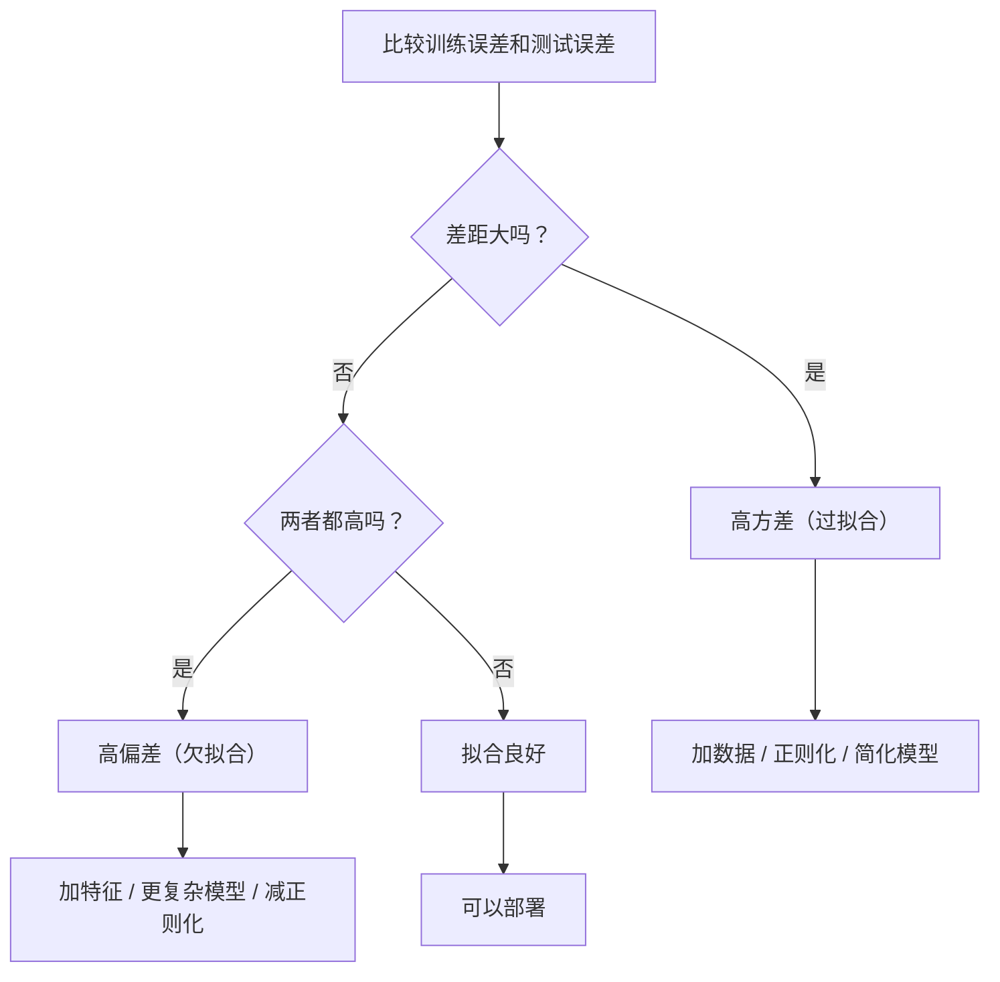

# 偏差-方差权衡——每个模型误差都能拆成三部分，你只能控制其中两个

> 每个模型误差都能拆成三部分：偏差、方差、噪声。噪声你碰不了，剩下两个是你唯一的杠杆。

**类型：** 实现课
**语言：** Python
**前置知识：** 第 02 阶段 · 01-09（机器学习基础、线性回归、逻辑回归、评估）
**预计时间：** ~75 分钟
**所处阶段：** Tier 1
**关联课程：** 第 03 阶段 · 01（感知器与多层网络）——理解偏差-方差权衡如何从线性模型延伸到神经网络

---

## 🎯 学习目标

完成本课后，你能够：

- [ ] 从第一性原理推导偏差-方差分解，解释不可约噪声为何无法被任何模型消除
- [ ] 通过训练误差和测试误差的模式（误差大小、两者差距）诊断模型当前是高偏差还是高方差
- [ ] 解释正则化（L1、L2、Dropout、早停）如何在偏差-方差曲线上移动，并选出一个大致最优的正则化强度
- [ ] 从零实现自助法（Bootstrap）实验，可视化偏差²、方差和总误差随模型复杂度的变化曲线
- [ ] 解释双重下降现象（Double Descent）的直觉，并说明为什么过参数化的神经网络仍然能泛化

---

## 1. 问题

你训练了一个模型。它在测试集上 MSE 是 0.47。这 0.47 从哪里来？

你可能凭直觉加数据、调参数、换算法，但如果你不知道这 0.47 的组成结构，你的每一次调整都可能南辕北辙。更数据也许毫无帮助。更复杂的模型可能让结果更差。

偏差-方差分解回答了这个问题：总误差被精确拆成三部分——偏差²（模型系统性偏离真实模式）、方差（模型对训练数据微小波动的敏感度）、不可约噪声（数据本身的随机性）。噪声是你无法控制的；剩下两个是你调节模型复杂度和正则化的唯一杠杆。

理解这个权衡，是机器学习中最有价值的诊断技能。它告诉你：该让模型更复杂还是更简单？该加数据还是加特征？该正则化还是减少约束？它把"调参靠运气"变成"诊断靠推理"。

---

## 2. 核心概念

### 2.1 偏差：系统性偏离

偏差衡量模型的平均预测与真实值之间的差距。想象你用同一个模型架构，从同一分布中重复采样 100 个不同的训练集，每个训练集上训练一个模型，然后把它们在同一测试点上的预测平均。如果这个平均预测仍然离真实值很远，偏差就高。

**高偏差意味着模型太刚性，捕捉不到数据中的真实模式。** 用一条直线拟合一个抛物线关系——无论你给它多少数据，直线始终是直线，永远穿不过弯曲的模式。这就是**欠拟合**。

```
高偏差模型的特征：
  训练误差：高
  测试误差：高
  两者差距：小（模型稳定地犯同样的错）
```

### 22 方差：对数据的敏感度

方差衡量你的预测对"碰巧抽到哪个训练集"有多敏感。同样的模型架构，换一批训练数据，预测值就天差地别——方差就高。

**高方差意味着模型在追逐训练数据中的噪声，而不是真实信号。** 用一个 20 次多项式拟合 15 个数据点——模型精确穿过每个训练点，但在点与点之间剧烈震荡，在新数据上表现得完全没有规律。这就是**过拟合**。

```
高方差模型的特征：
  训练误差：低
  测试误差：高
  两者差距：大（模型的表现在训练集和新数据之间分裂）
```

### 2.3 分解公式

对于任意测试点 $x$，在平方损失下的期望预测误差可以精确分解：

$$
\text{Expected Error} = \text{Bias}^2 + \text{Variance} + \text{Irreducible Noise}
$$

其中：

$$
\text{Bias}^2 = \left(\mathbb{E}[\hat{f}(x)] - f(x)\right)^2
$$

$$
\text{Variance} = \mathbb{E}\left[\left(\hat{f}(x) - \mathbb{E}[\hat{f}(x)]\right)^2\right]
$$

$$
\text{Noise} = \mathbb{E}\left[(y - f(x))^2\right] = \sigma^2
$$

含义说明：
- $f(x)$：真实的底层函数（你不知道）
- $\hat{f}(x)$：你的模型预测（每次训练都会不同）
- $\mathbb{E}[\cdot]$：对"不同训练集"取期望（多次重复实验的平均）
- $y$：观测到的标签（真实函数 + 噪声）
- $\sigma^2$：数据自身的噪声方差，不可约减

**关键洞察：** 你不可以减少 $\sigma^2$——这是数据本身的随机性，不是模型的问题。你的全部工作就是在偏差²和方差之间找到最优平衡点。

### 2.4 偏差-方差权衡曲线

```
总误差
  │╲
  │  ╲  偏差²
  │    ╲
  │      ╲         总误差
  │        ╲    ╱‾‾‾‾╲
  │          ╲╱        ╲ 方差
  │            ↑         ╲
  │        甜蜜点          ╲
  └──────────────────────────→ 模型复杂度
```

| 模型复杂度 | 偏差² | 方差 | 总误差 | 状态 |
|-----------|-------|------|--------|------|
| 太低（直线拟合曲线） | 高 | 低 | 高 | 欠拟合 |
| 适中 | 中 | 中 | 最低 | 良好泛化 |
| 太高（20 次拟合 15 个点） | 低 | 高 | 高 | 过拟合 |

随着复杂度增加：偏差²下降（模型能拟合更复杂的真模式），方差上升（模型也拟合了更多噪声）。两者之和呈 U 形曲线。

### 2.5 正则化：可控的偏差-方差调节器

正则化通过限制模型的灵活度，主动增加偏差来换取方差的降低。它约束模型，使其不能完全追逐训练数据中的噪声。

| 正则化方法 | 机制 | 偏差变化 | 方差变化 |
|-----------|------|---------|---------|
| L2（Ridge） | 惩罚大权重，使权重整体缩小 | 小量增加 | 降低 |
| L1（Lasso） | 惩罚使部分权重精确为 0 | 小量增加 | 降低 |
| Dropout | 训练时随机丢弃神经元，迫使冗余表示 | 小量增加 | 降低 |
| 早停 | 在模型完全拟合训练数据前停止训练 | 小量增加 | 降低 |

正则化强度（$\lambda$、Dropout 率、训练轮数）直接控制你在偏差-方差曲线上的位置：强度越大，偏差越高，方差越低。

### 2.6 双重下降：经典理论的裂缝

经典理论告诉你：过了甜蜜点之后，继续增加复杂度只会让总误差上升。但 2019 年以来的研究发现——在过参数化区域（参数量远超训练样本数），测试误差会再次下降。

```
测试误差
  │╲
  │  ╲___________        ← 经典 U 形曲线
  │              ╲
  │               ╲ 尖峰 ╲___  ← 双重下降
  │                ╲      ╲___╲
  │                 ╲          ╲___
  └────────────────────────────────→ 模型参数量
            ↑
        插值阈值（参数量 ≈ 样本数）
```

| 区域 | 参数量 vs 样本量 | 行为 |
|------|-----------------|------|
| 欠参数化 | $p \ll n$ | 经典权衡适用 |
| 插值阈值 | $p \approx n$ | 方差爆炸，测试误差尖锐峰值 |
| 过参数化 | $p \gg n$ | 隐式正则化生效，测试误差再次下降 |

为什么过参数化模型仍然泛化？在插值阈值处，模型刚好有足够容量拟合所有训练点，被迫选择了一个极度扭曲的解。过了这个阈值，它有了无限多组完美拟合训练数据的解，而梯度下降等优化算法倾向于选择其中最简单的那个（隐式正则化）。

**工程启示：** 如果你用神经网络或大型树集成，不要停在插值阈值附近。要么在阈值以下用显式正则化控制，要么远远越过它。最差的位置恰好是参数量 ≈ 样本量。

### 2.7 通过误差模式诊断模型



| 症状 | 诊断 | 修复方向 |
|------|------|---------|
| 训练误差高，测试误差高，差距小 | 高偏差（欠拟合） | 加特征、更复杂模型、减正则化 |
| 训练误差低，测试误差高，差距大 | 高方差（过拟合） | 加数据、加正则化、简化模型 |
| 训练误差低，测试误差低，差距小 | 良好拟合 | 可以部署 |
| 训练误差持续下降，测试误差开始上升 | 正在过拟合 | 早停 |

### 2.8 学习曲线：最实用的诊断工具

学习曲线画出训练误差和验证误差随训练集大小的变化轨迹。它回答了一个关键问题：**加更多数据有没有用？**

| 场景 | 训练误差 | 验证误差 | 差距 | 含义 | 策略 |
|------|---------|---------|------|------|------|
| 高偏差 | 高且平稳 | 高且平稳 | 小 | 加数据无用 | 换模型 / 加特征 |
| 高方差 | 低，随数据增加而上升 | 高，随数据增加而下降 | 大但在缩小 | 加数据有用 | 收集更多数据 |
| 良好拟合 | 中等 | 中等 | 小 | 可以放心部署 | - |

---

## 3. 从零实现

本节用 NumPy 从零实现偏差-方差分解的完整实验。核心思路：从同一分布重复采样多个训练集，在每个训练集上拟合模型，固定一组测试点，计算预测值的均值和方差，从而从定义出发估计偏差²和方差。

### 第 1 步：生成模拟数据

我们用一个已知函数 $f(x) = \sin(1.5x) + 0.5x$ 加高斯噪声来生成数据。知道真实函数是计算精确偏差²的前提。

```python
import numpy as np

def true_function(x):
    return np.sin(1.5 * x) + 0.5 * x

def generate_data(n_samples=30, noise_std=0.5, x_range=(-3, 3), seed=None):
    rng = np.random.RandomState(seed)
    x = rng.uniform(x_range[0], x_range[1], n_samples)
    y = true_function(x) + rng.normal(0, noise_std, n_samples)
    return x, y
```

### 第 2 步：多项式拟合与 L2 正则化

```python
def fit_polynomial(x_train, y_train, degree, lam=0.0):
    """拟合多项式，可选 L2 正则化（Ridge）。"""
    # 构建 Vandermonde 矩阵：每一列是 x 的 0 到 degree 次幂
    X = np.column_stack([x_train ** d for d in range(degree + 1)])
    if lam > 0:
        # Ridge：添加 λ||w||² 惩罚，但不惩罚偏置项（第 0 列）
        penalty = lam * np.eye(X.shape[1])
        penalty[0, 0] = 0
        w = np.linalg.solve(X.T @ X + penalty, X.T @ y_train)
    else:
        w = np.linalg.lstsq(X, y_train, rcond=None)[0]
    return w

def predict_polynomial(x, w):
    """用多项式系数预测。"""
    degree = len(w) - 1
    X = np.column_stack([x ** d for d in range(degree + 1)])
    return X @ w
```

### 第 3 步：Bootstrap 采样与分解计算

```python
def bias_variance_decomposition(degrees, n_bootstrap=200, n_train=30,
                                noise_std=0.5, n_test=100, lam=0.0):
    rng = np.random.RandomState(42)
    x_test = np.linspace(-2.5, 2.5, n_test)
    y_true = true_function(x_test)

    results = {}
    for degree in degrees:
        predictions = np.zeros((n_bootstrap, n_test))
        for b in range(n_bootstrap):
            x_train, y_train = generate_data(
                n_samples=n_train, noise_std=noise_std,
                seed=rng.randint(0, 100000)
            )
            w = fit_polynomial(x_train, y_train, degree, lam=lam)
            predictions[b] = predict_polynomial(x_test, w)

        mean_pred = predictions.mean(axis=0)
        bias_sq = np.mean((mean_pred - y_true) ** 2)
        variance = np.mean(predictions.var(axis=0))
        total_error = np.mean(np.mean((predictions - y_true) ** 2, axis=1))

        results[degree] = {
            "bias_sq": bias_sq,
            "variance": variance,
            "total_error": total_error,
            "noise": noise_std ** 2,
        }
    return results
```

每个 bootstrap 样本是从同一分布抽出的不同训练集。200 次重复后，在每个测试点上有 200 个预测值，可以直接计算均值和方差。

### 第 4 步：运行分解实验

```python
degrees = [1, 2, 3, 5, 7, 10, 15]
results = bias_variance_decomposition(degrees)

print(f"{'次数':>6}  {'偏差²':>10}  {'方差':>10}  {'噪声':>10}  {'总误差':>10}")
for degree, r in sorted(results.items()):
    print(f"{degree:>6d}  {r['bias_sq']:>10.4f}  {r['variance']:>10.4f}  "
          f"{r['noise']:>10.4f}  {r['total_error']:>10.4f}")
```

典型输出：

```text
    次数         偏差²          噪声         总误差
     1      0.4310      0.0434      0.2500      0.4744
     2      0.4124      0.0767      0.2500      0.4891
     3      0.0529      0.0397      0.2500      0.0926
     5      0.0012      0.0495      0.2500      0.0507
     7      0.0005      0.1470      0.2500      0.1475
    10      0.0005      0.8690      0.2500      0.8696
    15      2.6086    685.4216      0.2500    688.0303

最优次数: 5
  偏差²:   0.0012
  方差:    0.0495
  总误差:  0.0507
```

5 次多项式是最优点：偏差²几乎为 0，方差尚可控。过高次（15 次）时方差爆炸到 685，模型完全记住了训练噪声。

### 第 5 步：学习曲线

```python
def demo_learning_curves():
    rng = np.random.RandomState(42)
    x_test = np.linspace(-2.5, 2.5, 200)
    y_test = true_function(x_test)
    sizes = [10, 20, 30, 50, 75, 100, 150, 200, 300]

    for degree in [1, 5, 12]:
        for n in sizes:
            train_errors, test_errors = [], []
            for seed in range(50):
                x_train, y_train = generate_data(n_samples=n, seed=rng.randint(0, 100000))
                w = fit_polynomial(x_train, y_train, degree)
                train_mse = np.mean((predict_polynomial(x_train, w) - y_train) ** 2)
                test_mse = np.mean((predict_polynomial(x_test, w) - y_test) ** 2)
                train_errors.append(train_mse)
                test_errors.append(test_mse)
            print(f"次数={degree}, n={n}: 训练={np.mean(train_errors):.4f}, 测试={np.mean(test_errors):.4f}")
```

### 第 6 步：双重下降实验

```python
def demo_double_descent():
    rng = np.random.RandomState(42)
    n_train = 20
    x_train, y_train = generate_data(n_samples=n_train, seed=42)
    x_test = np.linspace(-2.5, 2.5, 200)
    y_test = true_function(x_test)

    for degree in range(1, 41):
        try:
            w = fit_polynomial(x_train, y_train, degree)
            test_mse = np.mean((predict_polynomial(x_test, w) - y_test) ** 2)
            region = "欠参数化" if degree < n_train - 2 else (
                "插值阈值" if abs(degree - n_train) <= 2 else "过参数化")
            print(f"次数={degree}: 测试 MSE={test_mse:.4f}, 区域={region}")
        except (np.linalg.LinAlgError, ValueError):
            print(f"次数={degree}: 数值不稳定")
```

观察：测试误差在次数 ≈ 样本数 = 20 附近出现尖锐峰值（方差爆炸），随后在过参数化区域不再单调——数值不稳定本身就是双重下降区域的特征，也是为什么过参数化模型需要正则化来稳定。

---

## 4. 工业工具

### 4.1 scikit-learn 验证曲线和学习曲线

scikit-learn 提供了开箱即用的工具，无需手写 Bootstrap 循环。

```python
from sklearn.model_selection import validation_curve, learning_curve
from sklearn.pipeline import make_pipeline
from sklearn.preprocessing import PolynomialFeatures
from sklearn.linear_model import Ridge
import numpy as np

# 生成数据
rng = np.random.RandomState(42)
x = rng.uniform(-3, 3, 200).reshape(-1, 1)
y = np.sin(1.5 * x.ravel()) + 0.5 * x.ravel() + rng.randn(200) * 0.5

# --- 验证曲线：扫描模型复杂度 ---
degrees = list(range(1, 16))
pipe = make_pipeline(PolynomialFeatures(), Ridge(alpha=0.01))
train_scores, val_scores = validation_curve(
    pipe, x, y,
    param_name="polynomialfeatures__degree",
    param_range=degrees, cv=5, scoring="neg_mean_squared_error"
)

# --- 学习曲线：扫描训练集大小 ---
pipe_fixed = make_pipeline(PolynomialFeatures(5), Ridge(alpha=0.01))
train_sizes, train_scores_lc, val_scores_lc = learning_curve(
    pipe_fixed, x, y,
    train_sizes=np.linspace(0.1, 1.0, 10),
    cv=5, scoring="neg_mean_squared_error"
)

print("验证曲线（偏差-方差权衡）:")
for d, ts, vs in zip(degrees, -train_scores.mean(axis=1), -val_scores.mean(axis=1)):
    print(f"  次数={d:>2d}: 训练 MSE={ts:.4f}, 验证 MSE={vs:.4f}")
```

### 4.2 交叉验证 + 正则化扫描

```python
from sklearn.model_selection import cross_val_score

alphas = [0.001, 0.01, 0.1, 1.0, 10.0, 100.0]
for alpha in alphas:
    pipe = make_pipeline(PolynomialFeatures(10), Ridge(alpha=alpha))
    scores = cross_val_score(pipe, x, y, cv=5, scoring="neg_mean_squared_error")
    print(f"α={alpha:>7.3f}: MSE={-scores.mean():.4f} ± {scores.std():.4f}")
```

小 α 时高方差（过拟合），大 α 时高偏差（欠拟合），最优 α 介于两者之间。

### 4.3 性能与适用场景对比

| 实现方式 | 速度 | 适用场景 | 备注 |
|---------|------|---------|------|
| 我们的 NumPy 版 | 慢（纯循环） | 教学理解 | 透明，可读 |
| scikit-learn | 快 | 实验 / 中小规模生产 | 内置交叉验证 |
| PyTorch + GPU | 极快 | 深度学习 | 可与神经网络结合 |
| Optuna 调参 | 慢（多次训练） | 自动选最优 λ | 超参数优化库 |

---

## 5. 知识连线

本节学习的偏差-方差分解，是理解后续深度学习与现代机器学习的关键：

- **第 03 阶段 · 01（感知器与多层网络）**：神经网络通过 Dropout、权重衰减（L2）、早停等手段在偏差-方差曲线上做权衡——你在这里学到的"正则化强度"概念直接对应深度学习的超参数调优
- **第 03 阶段 · 04（训练与调优）**：学习曲线和验证曲线是模型诊断的标准工具，你将在这里系统学习如何在真实项目中使用它们
- **第 07 阶段（Transformer 深入）**：大语言模型的双重下降现象——参数量从百万到千亿，测试困惑度持续下降——是偏差-方差权衡在过参数化区域的直接体现

---

## 6. 工程最佳实践

### 6.1 工业界常用诊断方案

| 场景 | 推荐方案 | 备注 |
|------|---------|------|
| 快速诊断过拟合/欠拟合 | 比较训练误差和测试误差的差距 | 1 分钟判断方向 |
| 确定是否需要更多数据 | 生成学习曲线 | 看验证误差是否仍在下降 |
| 确定最优模型复杂度 | 验证曲线（复杂度扫描） | 找到验证误差最低点 |
| 确定最优正则化强度 | 交叉验证 + 网格搜索 λ | 精细调节 |
| 大规模深度学习 | Optuna 贝叶斯调参 | 效率远高于网格搜索 |

### 6.2 中文场景特别建议

- 中文 NLP 任务中，预训练模型的强度远大于传统正则化——对于 BERT 等模型，通常用加 Dropout（0.1-0.3）和学习率衰减就够了，无需单独调 L2
- 处理中文金融风控数据时（样本少、噪声大），高方差风险极高：优先使用随机森林（Bagging）或 XGBoost（Boosting + 正则化），而非深度模型
- 中文文本分类在小数据集（< 1000 条）场景下，高概率遇到高方差问题——加入 L2 正则化和使用预训练词向量比增加模型复杂度更有效

### 6.3 踩坑经验

- 用测试集上的表现来选择正则化强度——测试集成了"第二次验证集"，最终泛化性能被高估。始终用验证集或交叉验证来选择超参数
- 看到训练准确率高就上线，没有对比测试准确率——80% 训练准确率 + 50% 测试准确率意味着严重过拟合
- 遇到欠拟合就疯狂加数据——高偏差问题加数据无效，需要的是更好的特征或更强的模型
- 在多重共线性特征上做多项式回归——特征矩阵接近奇异，方差极高。先做正则化或特征降次

---

## 7. 常见错误

### 错误 1：把测试集当验证集反复使用

**现象：** 模型在测试集上 AUC 0.92，上线后只有 0.78。

**原因：** 每次调参后都在测试集上评估，测试集的信息已经"泄露"到你选择的模型中了。你以为你在评估泛化能力，实际你在测试集上做过拟合。

```python
# ❌ 错误：反复看测试集选参数
for alpha in [0.01, 0.1, 1.0, 10.0]:
    model = Ridge(alpha=alpha).fit(X_train, y_train)
    print(f"alpha={alpha}, test_AUC={roc_auc_score(y_test, model.predict(X_test))}")

# ✓ 正确：用验证集或交叉验证选参数，最后只在测试集上评估一次
from sklearn.model_selection import cross_val_score
for alpha in [0.01, 0.1, 1.0, 10.0]:
    scores = cross_val_score(Ridge(alpha=alpha), X_train, y_train, cv=5)
    print(f"alpha={alpha}, cv_mean={scores.mean():.4f}")
# 选完 alpha 后，用测试集做最终无偏评估
```

### 错误 2：高偏差问题加数据

**现象：** 训练了 100 万条数据，线性回归的验证误差几乎没有下降。

**原因：** 如果模型太简单（高偏差），加数据不能降低偏差——它只影响方差。一条直线给你再多数据也拟合不了抛物线。

```python
# ❌ 诊断错误：高偏差时加数据
if val_error > threshold:
    collect_more_data()  # 对高偏差无效！

# ✓ 正确：先判断是高偏差还是高方差
if train_error > 0.3 and (val_error - train_error) < 0.05:
    # 高偏差——需要更复杂的模型
    model = RandomForestRegressor()  # 而非线性回归
```

### 错误 3：混淆偏差和方差的表现

**现象：** 训练准确率 55%、测试准确率 50%，你诊断为"过拟合"，开始加正则化——结果更差了。

**原因：** 差距小 + 两者都高 = 高偏差（欠拟合）。加正则化会进一步增加偏差，适得其反。

```python
# ✓ 正确诊断
train_err, test_err = 0.55, 0.50
gap = test_err - train_err

if gap > 0.1:                # 差距大
    diagnosis = "高方差，需要正则化或加数据"
elif train_err > 0.3 and gap < 0.1:  # 差距小但都高
    diagnosis = "高偏差，需要更复杂的模型"
else:
    diagnosis = "拟合良好"
```

### 错误 4：忽略数值不稳定导致假性高方差

**现象：** 15 次多项式的方差到了 685，你以为模型严重过拟合。

**原因：** 不只是过拟合——当多项式次数接近训练样本数时，Vandermonde 矩阵条件数爆炸，矩阵求逆本身已经数值不稳定。你看到的高方差部分来自计算不稳定，部分是真正的过拟合。

```python
# ✓ 正确：用正则化稳定高次多项式拟合
# 不加正则化：数值不稳定 + 高方差
w_bad = fit_polynomial(x_train, y_train, degree=15, lam=0.0)
# 加正则化：稳定求解 + 降低方差
w_good = fit_polynomial(x_train, y_train, degree=15, lam=0.1)
```

---

## 8. 面试考点

### Q1：推导偏差-方差分解公式。为什么噪声项不可约？（难度：⭐⭐⭐）

**参考答案：**

对于平方损失 $\mathbb{E}[(y - \hat{f}(x))^2]$，令 $\bar{f}(x) = \mathbb{E}[\hat{f}(x)]$：

$$
\begin{aligned}
\text{MSE} &= \mathbb{E}[(y - \hat{f})^2] \\
&= \mathbb{E}[(y - f + f - \bar{f} + \bar{f} - \hat{f})^2] \\
&= \mathbb{E}[(y - f)^2] + (f - \bar{f})^2 + \mathbb{E}[(\bar{f} - \hat{f})^2] \\
&= \text{Noise} + \text{Bias}^2 + \text{Variance}
\end{aligned}
$$

中间交叉项都为 0。噪声项 $\sigma^2$ 来自观测 $y = f(x) + \epsilon$ 中的随机噪声 $\epsilon$。它和数据无关——即使你知道真实函数 $f$，也无法预测 $\epsilon$。因此任何模型都不能减少它。

### Q2：模型的训练误差 5%、测试误差 30%，诊断问题并给出至少三种修复方案。（难度：⭐⭐）

**参考答案：**

训练误差低（5%）+ 测试误差高（30%）且差距大 → 高方差（过拟合）。模型记住了训练噪声。

修复方案：
1. 收集更多训练数据（最直接降低方差的方法）
2. 加入正则化：L2（权重衰减）、L1、或 ElasticNet
3. 使用更简单的模型（降低多项式次数、减小树的深度、减少网络层数）
4. 使用 Dropout（神经网络）或 Bagging（随机森林）
5. 特征选择：移除噪声特征，降低模型有效容量

### Q3：什么是双重下降现象？它对传统偏差-方差理论有什么修正？（难度：⭐⭐⭐）

**参考答案：**

双重下降指：当模型参数量远超训练样本数（过参数化区域）时，测试误差会再次下降。传统理论认为过了甜蜜点后测试误差单调上升，但实际观察到了"下降→上升→峰值→再下降"的曲线。

修正点：经典理论只在欠参数化区域成立（$p \ll n$）。现代深度学习处于过参数化区域，隐式正则化（梯度下降倾向于选择最简单解）使得模型在参数量极大时仍能泛化。工程上，这意味着不应该停在参数量 ≈ 样本量附近（插值阈值是误差峰值）。

### Q4：学习曲线和验证曲线有什么区别，分别回答什么问题？（难度：⭐⭐）

**参考答案：**

- **学习曲线**：固定模型，改变训练集大小，画出训练误差和验证误差。它回答"加更多数据有没有用？"——如果两条曲线收敛到高误差，加数据无用；如果差距大且在缩小，加数据有用。

- **验证曲线**：固定数据，改变模型复杂度（或正则化强度），画出训练误差和验证误差。它回答"当前模型是否合适？"——找到验证误差最低的复杂度/正则化参数。

两者互补，先回答"要不要换模型"（验证曲线），再回答"要不要加数据"（学习曲线）。

### Q5：Bagging 和 Boosting 分别降低偏差还是方差？数学直觉是什么？（难度：⭐⭐⭐）

**参考答案：**

**Bagging** 降方差：训练 $N$ 个独立模型，平均它们的预测。若每个模型方差 $\sigma^2$，独立时平均后方差 $\sigma^2/N$。模型不独立时降幅减小但仍显著。随机森林 = Bagging + 决策树。

**Boosting** 降偏差：串行训练，每个新模型专攻前面模型的残差。偏差是"系统性偏离真值"，Boosting 逐步修正偏差。数学上，Boosting 是在函数空间上的梯度下降，逐步逼近真实函数。

实用规则：高方差基模型（深树）用 Bagging；高偏差基模型（浅树、线性）用 Boosting。

---

## 🔑 关键术语

| 术语 | 人们怎么说 | 实际含义 |
|------|-----------|---------|
| 偏差 (Bias) | "模型太简单了" | 模型平均预测与真实值之间的系统性差距。高偏差→欠拟合。 |
| 方差 (Variance) | "模型过拟合了" | 模型预测对训练数据微小波动的敏感度。高方差→过拟合。 |
| 不可约噪声 (Irreducible Noise) | "数据太噪了" | 数据自身的随机性（$\sigma^2$）。任何模型都不能消除它。 |
| 偏差-方差分解 (Bias-Variance Decomposition) | "误差拆三部分" | 期望预测误差 = 偏差² + 方差 + 噪声的精确数学拆分。 |
| 正则化路径 (Regularization Path) | "慢慢加大 λ" | 模型从高方差→最优→高偏差的连续过渡轨迹。 |
| 学习曲线 (Learning Curve) | "看数据量曲线" | 训练/验证误差随训练集大小变化的曲线，回答"加数据有没有用"。 |
| 验证曲线 (Validation Curve) | "看复杂度曲线" | 训练/验证误差随模型复杂度变化的曲线，回答"模型是否合适"。 |
| 双重下降 (Double Descent) | "参数量大反而好" | 过参数化区域测试误差再次下降的现象，修正了经典 U 形曲线。 |
| 插值阈值 (Interpolation Threshold) | "刚好拟合那个点" | 参数量 ≈ 样本量时，方差爆炸、测试误差尖锐峰值的位置。 |
| 自助法 (Bootstrap) | "重复采样很多次" | 从同一分布中重复抽取多个训练集，用于估计统计量的分布。 |

---

## 📚 小结

偏差-方差分解将期望预测误差精确拆成偏差²、方差和不可约噪声三个可解释的部分。你通过从零实现 Bootstrap 实验，可视化了多项式次数如何驱动偏差²和方差此消彼长，并通过学习曲线和验证曲线建立了"诊断靠推理"的工作流。双重下降现象修正了经典理论，解释了为什么过参数化神经网络仍然能泛化。

下一课我们将学习集成方法——Bagging 和 Boosting 分别瞄准方差和偏差，将你在本节学到的理论工具组合成实际有效的模型。

---

## ✏️ 练习

1. 【理解】用自己的话解释"偏差"和"方差"的区别，以及为什么无法同时最小化两者。写 200 字以内，让一个没有 ML 背景的程序员也能听懂。

2. 【实现】修改 `bias_variance_decomposition` 函数，在每次 bootstrap 采样时同时计算训练集上的预测误差。这样可以从同一实验中同时获得偏差-方差分解和学习曲线数据。

3. 【实验】对同一个数据集，分别用 $\lambda=0$、$\lambda=1$、$\lambda=100$ 的 Ridge 回归训练。画出三条学习曲线。验证"正则化强度越大，方差越低，偏差越高"的结论。

4. 【思考】一个深度神经网络有数百万参数，但训练集只有 5 万张图片。根据经典偏差-方差理论，这应该严重过拟合。但实际上它泛化得很好。结合双重下降现象和隐式正则化，给出你的解释。

5. 【诊断】你的模型训练误差 2% 且测试误差 25%，加数据、加特征、减正则化三种操作中哪些有用？哪些有害？论证你的判断依据。

---

## 🚀 产出

本课产出以下可复用内容：

| 产出 | 文件 | 说明 |
|------|------|------|
| 偏差-方差分解实现 | `code/main.py` | 从零实现，包含 8 个演示：基础分解、复杂度权衡、正则化路径、数据量影响、诊断、学习曲线、正则化扫描、双重下降 |
| 模型诊断提示词 | `outputs/prompt-model-diagnostics.md` | 给定训练/测试指标，诊断高偏差/高方差/数据问题并推荐修复方案 |

---

## 📖 参考资料

1. [书籍] Hastie, Tibshirani, Friedman. 《The Elements of Statistical Learning（第2版）》. Springer, 2009. https://hastie.su.domains/ElemStatLearn/ （第 7 章：偏差-方差分解的权威参考）
2. [论文] Belkin et al. "Reconciling modern machine-learning practice and the bias-variance trade-off". PNAS, 2019. https://arxiv.org/abs/1812.11118 （双重下降现象的原始论文）
3. [论文] Nakkiran et al. "Deep Double Descent: Where More Models and Less Data Both Hurt". ICLR, 2020. https://arxiv.org/abs/1912.02292 （样本级和轮次级双重下降）
4. [官方文档] Scikit-learn. "Validation curves: plotting scores to evaluate models". https://scikit-learn.org/stable/modules/learning_curve.html
5. [官方文档] Scikit-learn. "Learning curves". https://scikit-learn.org/stable/auto_examples/model_selection/plot_learning_curve.html
6. [书籍] 周志华. 《机器学习》. 清华大学出版社, 2016. （第 2 章：模型评估与选择，涵盖偏差-方差直觉）

---

> 本课程参考了 AI Engineering From Scratch（MIT License）的课程体系，在此基础上进行了重构和原创内容的扩充。所有中文表达、案例、LLM 视角分析、工程最佳实践、常见错误、面试考点等均为原创内容。
