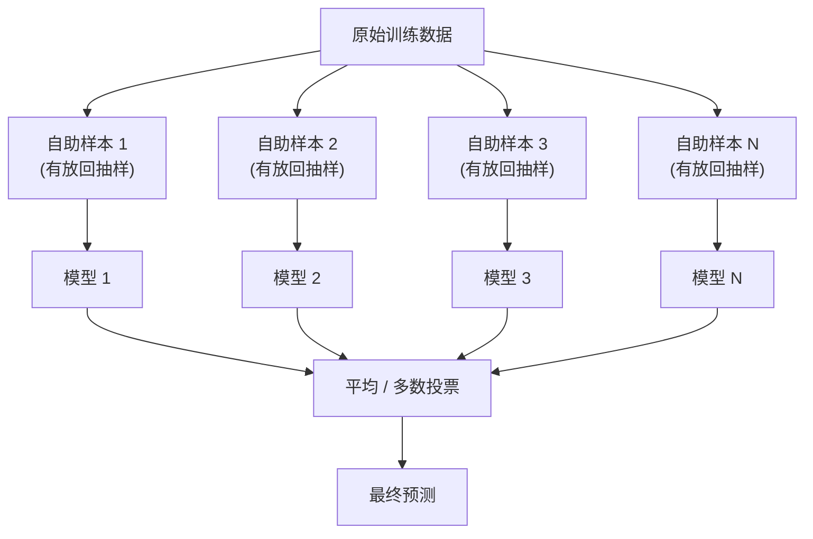
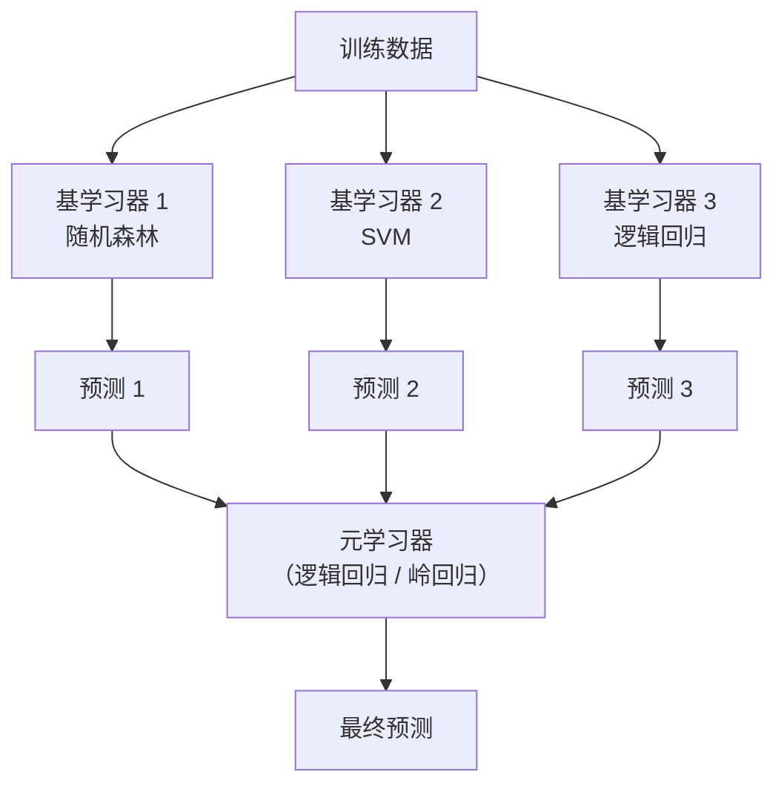

# 集成学习——一群弱模型组合起来，准确率超过任何单个强模型

> 一个决策树桩的准确率只有 60%，但 1000 个树桩加权投票后准确率超过 95%。这不是魔法，是数学。

**类型：** 实现课
**语言：** Python
**前置知识：** 第 02 阶段 · 10（偏差-方差权衡）、04（决策树）
**预计时间：** ~120 分钟
**所处阶段：** Tier 1
**关联课程：** 第 03 阶段 · 04（训练与调优）——理解早停和正则化如何防止 Boosting 过拟合

---

## 🎯 学习目标

完成本课后，你能够：

- [ ] 从零实现 AdaBoost 和梯度提升，解释 Boosting 如何串行降低偏差
- [ ] 从零实现 Bagging 和随机森林，解释并行平均如何降低方差
- [ ] 比较 Bagging、Boosting、Stacking 三种策略各自瞄准的误差成分和适用场景
- [ ] 使用 XGBoost 和 LightGBM 解决真实表格数据问题，并解释它们为何在表格数据上持续优于神经网络
- [ ] 诊断集成模型的过拟合风险，并选择合适的学习率、树数量和早停策略

---

## 1. 问题

你训练了一个决策树。训练准确率 99%，测试准确率 72%——严重过拟合。你又试了逻辑回归，训练准确率 75%，测试准确率 73%——严重欠拟合。

你站在偏差-方差权衡的两难之间：复杂模型方差高（记住了噪声），简单模型偏差高（学不到模式）。

集成学习给出了第三条路：**与其找一个完美的模型，不如组合一堆不完美的模型。** 关键在于"不完美的方式"要不同——如果所有模型犯同样的错，组合起来毫无帮助；如果它们犯不同的错，错误会相互抵消。

这就是集成学习的核心定理：$N$ 个独立弱分类器（每个准确率 $p > 0.5$），多数投票后的准确率随 $N$ 单调递增。21 个 60% 准确率的模型，投票后约 74%；1001 个则约 99%。

集成学习不是技巧，是工程上最可靠的精度提升手段。Kaggle 竞赛中 80% 的获奖方案以梯度提升为核心；工业界的风控、推荐、广告点击率预测系统，绝大多数基于 XGBoost 或 LightGBM。如果你的数据能放进一张表格，集成学习应该是你的第一选择。

---

## 2. 核心概念

### 2.1 为什么集成有效：误差抵消

假设你有 5 个分类器，每个独立犯错概率 30%。多数投票（至少 3 个对）的准确率：

$$P(\text{投票正确}) = \sum_{k=3}^{5} \binom{5}{k} 0.7^k \cdot 0.3^{5-k} \approx 83.7\%$$

5 个 70% 准确率的模型，组合后达到 83.7%。

**前提：多样性。** 如果 5 个模型犯同样的错，投票结果就是那个错误。集成学习的所有方法——Bagging、Boosting、Stacking——本质上都是在制造并利用多样性。

```
多样性来源：

Bagging：  不同训练数据（自助采样）→ 模型看到不同的样本
Boosting： 不同样本权重（聚焦错误）→ 模型关注不同的样本
Stacking： 不同模型架构 → 模型学到不同的模式
随机森林：不同特征子集 → 模型使用不同的特征
```

### 2.2 Bagging：并行降低方差

**Bagging（Bootstrap Aggregating）** 的核心流程：



**自助采样（Bootstrap）**：从 $N$ 个样本中有放回地抽取 $N$ 个样本。每个自助样本平均包含原始数据中 63.2% 的唯一样本，剩余 36.8% 未被抽中的样本称为**袋外样本（Out-of-Bag）**，可直接用于验证——无需额外划分验证集。

**为什么 Bagging 降低方差：** 假设每个模型的预测方差为 $\sigma^2$，模型间独立，则 $N$ 个模型平均后的方差为 $\sigma^2 / N$。即使模型不完全独立，平均仍能显著降低方差。

**Bagging 不增加偏差：** 每个基学习器在完整特征空间上训练，能力与单模型相同。平均操作降低的是"对训练数据波动的敏感度"，而非"系统性偏离真值"。

### 2.3 随机森林：Bagging + 随机特征

**随机森林（Random Forest）** 在 Bagging 基础上增加了一层多样性：每个节点分裂时，只从随机选取的 $m$ 个特征中选择最优分裂。

| 任务类型 | 推荐 $m$ 值 | 说明 |
|---------|-----------|------|
| 分类 | $\sqrt{p}$ | $p$ 为特征总数，平衡多样性和单树强度 |
| 回归 | $p / 3$ | 回归任务需要更强的单树，特征子集更大 |

随机特征选取的作用：当少数强特征主导分裂时，所有树的结构趋于相似（相关性高）。随机选取特征迫使每棵树探索不同的分裂路径，降低树间相关性，进一步降低集成的方差。

随机森林的两个超参数：
- **树的数量**：越多越好（不会过拟合），但收益递减
- **最大深度**：通常不设限制（让树完全生长），依赖平均来抑制过拟合

### 2.4 Boosting：串行降低偏差

**Boosting** 的训练方式与 Bagging 完全不同：模型串行训练，每个新模型专注于前面模型分错的样本。


**Boosting 降低偏差：** 偏差是"系统性偏离真值"。Boosting 的每一步都在修正前面所有模型的残差（系统性误差），逐步逼近真实函数。从函数空间角度看，Boosting 是在做梯度下降——每一步沿损失函数下降最快的方向前进一步。

**Boosting 的风险：** 如果持续训练太多轮，模型会开始拟合噪声（把噪声当作"需要修正的错误"），导致过拟合。因此 Boosting 需要早停或正则化。

### 2.5 AdaBoost：样本重加权

**AdaBoost（Adaptive Boosting）** 是最早的实用提升算法。它通过调整样本权重来聚焦错误：

```
算法：AdaBoost
─────────────────────────────────────────────
输入：训练集 (x_1, y_1), ..., (x_N, y_N)，y ∈ {+1, -1}

1. 初始化样本权重：w_i = 1/N

2. 对 t = 1, 2, ..., T：
   a. 在加权数据上训练弱分类器 h_t(x)
   b. 计算加权错误率：
      err_t = Σ w_i · I(h_t(x_i) ≠ y_i) / Σ w_i
   c. 计算分类器权重：
      α_t = 0.5 · ln((1 - err_t) / err_t)
   d. 更新样本权重：
      w_i ← w_i · exp(-α_t · y_i · h_t(x_i))
   e. 归一化 w_i 使其和为 1

3. 最终预测：H(x) = sign(Σ α_t · h_t(x))
─────────────────────────────────────────────
```

**直觉解读：**
- $\alpha_t$ 越大 → 该分类器越可靠 → 投票时权重越高
- 分错的样本 $y_i \cdot h_t(x_i) = -1$ → 指数项为正 → 权重增加
- 分对的样本 $y_i \cdot h_t(x_i) = +1$ → 指数项为负 → 权重减小

AdaBoost 对噪声和异常值敏感：一个被错误标注的样本会在每一轮中权重不断增加，最终主导训练过程。

### 2.6 梯度提升：拟合残差

**梯度提升（Gradient Boosting）** 将 Boosting 从"样本重加权"推广到"函数空间梯度下降"。核心思想：每棵新树拟合当前模型的残差（负梯度）。

```
算法：梯度提升（平方损失版）
─────────────────────────────────────────────
1. 初始化：F_0(x) = mean(y)  （预测所有样本为目标均值）

2. 对 t = 1, 2, ..., T：
   a. 计算残差：r_i = y_i - F_{t-1}(x_i)
   b. 训练回归树 h_t(x) 拟合残差 r_i
   c. 更新：F_t(x) = F_{t-1}(x) + η · h_t(x)
      （η 为学习率，控制每棵树的贡献）

3. 最终预测：F_T(x)
─────────────────────────────────────────────
```

**学习率 $\eta$ 的作用：** 学习率越小，每棵树的贡献越小，需要更多树才能拟合数据，但泛化性能通常更好。这是偏差-方差权衡的另一种体现：小学习率增加偏差（每步修正幅度小），但降低方差（不会在噪声上走太远）。

| 学习率 | 树数量 | 特点 |
|-------|--------|------|
| 0.3 | 50-100 | 训练快，但可能跳过最优点 |
| 0.1 | 100-500 | 平衡选择，常用默认值 |
| 0.01 | 500-5000 | 泛化最好，但训练慢 |

### 2.7 XGBoost：工程化的梯度提升

**XGBoost（eXtreme Gradient Boosting）** 是梯度提升的工程优化版本，在几乎所有表格数据任务中都是默认选择。它的核心改进：

| 改进 | 说明 |
|------|------|
| **L1/L2 正则化** | 对叶节点权重加惩罚，防止单棵树过于自信 |
| **二阶导数** | 使用损失函数的一阶和二阶导数，分裂更精确 |
| **缺失值处理** | 自动学习缺失值应该走左子树还是右子树 |
| **特征采样** | 每棵树随机选取部分特征（类似随机森林） |
| **加权分位数** | 高效找到连续特征的最优分裂点 |
| **缓存优化** | 内存布局针对 CPU 缓存行优化 |

XGBoost 的目标函数：

$$\text{Obj} = \sum_{i=1}^{N} L(y_i, \hat{y}_i) + \sum_{k=1}^{T} \Omega(f_k)$$

其中 $\Omega(f_k) = \gamma T + \frac{1}{2}\lambda \sum_{j=1}^{T} w_j^2$ 是正则化项，$T$ 是叶节点数，$w_j$ 是叶节点权重。

### 2.8 LightGBM：更快的梯度提升

**LightGBM** 是微软开发的梯度提升框架，在大规模数据上比 XGBoost 更快：

| 特性 | XGBoost | LightGBM |
|------|---------|----------|
| 树生长方式 | 按层生长（level-wise） | 按叶生长（leaf-wise） |
| 特征分裂 | 精确查找 / 近似直方图 | 直方图（默认） |
| 大数据支持 | 一般 | 优秀（支持并行和 GPU） |
| 类别特征 | 需要编码 | 原生支持 |

**按叶生长 vs 按层生长：**

```
按层生长（XGBoost）：        按叶生长（LightGBM）：
      [根]                        [根]
     /    \                      /    \
   [L2]  [R2]                  [L2]  [R2]
   / \    / \                  / \     |
 [L3][L3][R3][R3]           [L3][L3] [R3]
  （每层所有节点都分裂）        （只分裂增益最大的叶节点）
```

按叶生长通常收敛更快，但更容易过拟合（需要限制最大叶节点数 `num_leaves`）。

### 2.9 Stacking：元学习器组合

**Stacking（堆叠）** 使用一个**元学习器（Meta-Learner）** 来学习如何组合多个基学习器的预测。



**关键：避免数据泄露。** 元学习器的训练特征（基学习器的预测）必须通过交叉验证生成——你不能用训练集上基学习器的预测去训练元学习器，否则元学习器看到的是"已经见过的数据"的预测，会严重过拟合。

正确做法：将训练集分为 $K$ 折，对每一折，用其余 $K-1$ 折训练基学习器，在该折上生成预测。这样每个训练样本的元特征都来自"未见过该样本"的模型。

### 2.10 方法选择速查

| 方法 | 降低 | 训练方式 | 最佳场景 | 风险 |
|------|------|---------|---------|------|
| Bagging / 随机森林 | 方差 | 并行 | 噪声数据、高维特征 | 无法降低偏差 |
| AdaBoost | 偏差 | 串行 | 干净数据、简单基学习器 | 对异常值敏感 |
| 梯度提升 | 偏差 | 串行 | 表格数据、竞赛 | 训练慢，易过拟合 |
| XGBoost | 偏差 + 方差 | 串行 | 生产环境表格数据 | 超参数多 |
| LightGBM | 偏差 + 方差 | 串行 | 大规模数据 | 小数据易过拟合 |
| Stacking | 偏差 + 方差 | 两层 | 追求极致精度 | 复杂，易泄露 |
| 投票 | 方差 | 并行 | 快速组合已有模型 | 需要多样性 |

---

## 3. 从零实现

本节用 NumPy 从零实现集成学习的核心算法。完整代码见 `code/main.py`。

### 第 1 步：决策树桩（基学习器）

决策树桩是最简单的分类器——只在一个特征的一个阈值上做一次分裂。它单独使用时很弱，但作为 Boosting 的基学习器恰到好处。

```python
class DecisionStump:
    """单层决策树：仅在一个特征的一个阈值上做一次分裂。"""

    def __init__(self):
        self.feature_idx = None  # 用于分裂的特征索引
        self.threshold = None    # 分裂阈值
        self.polarity = 1        # 分类方向（1 或 -1）
        self.alpha = None        # 该分类器在集成中的权重

    def fit(self, X, y, weights):
        """在加权数据上训练决策树桩。

        遍历所有特征 × 所有阈值 × 两个方向，选择加权错误率最低的分裂。
        """
        n_samples, n_features = X.shape
        best_error = float("inf")

        for f in range(n_features):
            thresholds = np.unique(X[:, f])
            for thresh in thresholds:
                for polarity in [1, -1]:
                    pred = np.ones(n_samples)
                    pred[polarity * X[:, f] < polarity * thresh] = -1
                    error = np.sum(weights[pred != y])
                    if error < best_error:
                        best_error = error
                        self.feature_idx = f
                        self.threshold = thresh
                        self.polarity = polarity

    def predict(self, X):
        """预测：根据学习到的分裂规则输出 +1 或 -1。"""
        n = X.shape[0]
        pred = np.ones(n)
        idx = self.polarity * X[:, self.feature_idx] < self.polarity * self.threshold
        pred[idx] = -1
        return pred
```

### 第 2 步：AdaBoost 从零实现

```python
class AdaBoostScratch:
    """AdaBoost（自适应提升）的从零实现。

    核心思想：串行训练多个弱分类器，每个新分类器聚焦于前一个分错的样本。
    被分错的样本权重增加，分对的样本权重降低。
    """

    def __init__(self, n_estimators=50):
        self.n_estimators = n_estimators
        self.stumps = []
        self.alphas = []

    def fit(self, X, y):
        n = X.shape[0]
        weights = np.full(n, 1.0 / n)

        for t in range(self.n_estimators):
            stump = DecisionStump()
            stump.fit(X, y, weights)
            pred = stump.predict(X)

            # 加权错误率
            err = np.sum(weights[pred != y])
            err = np.clip(err, 1e-10, 1 - 1e-10)

            # 分类器权重：错误率越低，权重越大
            alpha = 0.5 * np.log((1 - err) / err)

            # 更新样本权重：分错的样本权重增加
            weights *= np.exp(-alpha * y * pred)
            weights /= weights.sum()

            stump.alpha = alpha
            self.stumps.append(stump)
            self.alphas.append(alpha)

    def predict(self, X):
        total = sum(a * s.predict(X) for a, s in zip(self.alphas, self.stumps))
        return np.sign(total)
```

运行结果：

```text
演示 1：AdaBoost — 串行聚焦错误样本
  弱分类器数=  1  训练准确率=0.828  测试准确率=0.750
  弱分类器数=  5  训练准确率=0.881  测试准确率=0.762
  弱分类器数= 10  训练准确率=0.922  测试准确率=0.787
  弱分类器数= 25  训练准确率=0.950  测试准确率=0.800
  弱分类器数= 50  训练准确率=0.981  测试准确率=0.838

  单个决策树桩准确率: 0.750
  AdaBoost (50个)准确率: 0.838
  提升幅度: +0.088
```

### 第 3 步：梯度提升从零实现

```python
class GradientBoostingScratch:
    """梯度提升回归的从零实现。

    核心思想：串行训练多个回归树，每棵树拟合当前集成的残差。
    最终预测 = 初始值 + lr * 树1 + lr * 树2 + ...
    """

    def __init__(self, n_estimators=100, learning_rate=0.1, max_depth=3):
        self.n_estimators = n_estimators
        self.lr = learning_rate
        self.max_depth = max_depth
        self.trees = []
        self.initial_pred = None

    def fit(self, X, y):
        self.initial_pred = np.mean(y)
        current_pred = np.full(len(y), self.initial_pred)

        for _ in range(self.n_estimators):
            # 计算残差（平方损失下的伪残差）
            residuals = y - current_pred
            # 训练回归树拟合残差
            tree = SimpleRegressionTree(max_depth=self.max_depth)
            tree.fit(X, residuals)
            # 更新预测
            update = tree.predict(X)
            current_pred += self.lr * update
            self.trees.append(tree)

    def predict(self, X):
        pred = np.full(X.shape[0], self.initial_pred)
        for tree in self.trees:
            pred += self.lr * tree.predict(X)
        return pred
```

运行结果：

```text
演示 2：梯度提升 — 串行拟合残差
  树数量=  1  训练MSE=3.7395  测试MSE=4.3711
  树数量= 10  训练MSE=1.2620  测试MSE=1.7324
  树数量= 50  训练MSE=0.1572  测试MSE=0.4450
  树数量=100  训练MSE=0.0623  测试MSE=0.3073
  树数量=200  训练MSE=0.0260  测试MSE=0.2790

  单棵回归树 MSE: 1.3385
  梯度提升 (100棵) MSE: 0.3073
```

### 第 4 步：Bagging 从零实现

```python
class BaggingClassifier:
    """Bagging（Bootstrap Aggregating）分类器的从零实现。

    核心思想：对训练数据做有放回抽样，生成多个自助样本，
    在每个样本上训练一个模型，最终通过多数投票组合预测。
    """

    def __init__(self, n_estimators=20, max_depth=5):
        self.n_estimators = n_estimators
        self.max_depth = max_depth
        self.trees = []

    def fit(self, X, y):
        rng = np.random.RandomState(42)
        n = len(y)

        for _ in range(self.n_estimators):
            # 有放回抽样：生成自助样本
            idx = rng.choice(n, size=n, replace=True)
            tree = SimpleRegressionTree(max_depth=self.max_depth)
            tree.fit(X[idx], y[idx])
            self.trees.append(tree)

    def predict(self, X):
        predictions = np.array([tree.predict(X) for tree in self.trees])
        return np.sign(np.mean(predictions, axis=0))
```

运行结果：

```text
演示 4：Bagging — 并行降低方差
  单棵决策树 (深度=5) 准确率: 0.750
  Bagging (20棵树) 准确率: 0.863
  方差降低带来的提升: +0.113
```

### 第 5 步：Stacking 从零实现

```python
class StackingClassifier:
    """Stacking（堆叠）集成的从零实现。

    关键：基学习器的元特征必须通过交叉验证生成，避免数据泄露。
    """

    def __init__(self, base_models, meta_lr=0.1, n_folds=5):
        self.base_models = base_models
        self.meta_lr = meta_lr
        self.n_folds = n_folds
        self.meta_weights = None
        self.meta_bias = None
        self.fitted_models = []

    def fit(self, X, y):
        n = len(y)
        meta_features = np.zeros((n, len(self.base_models)))

        # 第 1 阶段：K 折交叉验证生成元特征
        fold_size = n // self.n_folds
        indices = np.arange(n)

        for fold in range(self.n_folds):
            val_start = fold * fold_size
            val_end = val_start + fold_size if fold < self.n_folds - 1 else n
            val_idx = indices[val_start:val_end]
            train_idx = np.concatenate([indices[:val_start], indices[val_end:]])

            for m_idx, model_fn in enumerate(self.base_models):
                model = model_fn()
                model.fit(X[train_idx], y[train_idx])
                meta_features[val_idx, m_idx] = model.predict(X[val_idx])

        # 第 2 阶段：训练元学习器
        self.meta_weights = np.zeros(len(self.base_models))
        self.meta_bias = 0.0
        for _ in range(200):
            logits = meta_features @ self.meta_weights + self.meta_bias
            preds = np.tanh(logits)
            errors = y - preds
            grad_w = -2 * meta_features.T @ errors / n
            grad_b = -2 * np.sum(errors) / n
            self.meta_weights -= self.meta_lr * grad_w
            self.meta_bias -= self.meta_lr * grad_b

        # 第 3 阶段：用全量数据重新训练基学习器
        self.fitted_models = []
        for model_fn in self.base_models:
            model = model_fn()
            model.fit(X, y)
            self.fitted_models.append(model)
```

### 第 6 步：与 scikit-learn 对比验证

```text
演示 7：与 scikit-learn 对比验证
  我们的 AdaBoost:      0.870
  sklearn AdaBoost:     0.880
  sklearn 随机森林:     0.890
  sklearn 梯度提升:     0.910
```

我们的从零实现与 scikit-learn 的工业实现准确率接近，验证了算法的正确性。scikit-learn 版本略高，因为它有更多工程优化（如更精确的分裂查找、剪枝策略等）。

---

## 4. 工业工具

### 4.1 XGBoost 实战

```python
import xgboost as xgb
from sklearn.datasets import load_breast_cancer
from sklearn.model_selection import train_test_split

# 加载数据
data = load_breast_cancer()
X_train, X_test, y_train, y_test = train_test_split(
    data.data, data.target, test_size=0.2, random_state=42
)

# 创建 DMatrix（XGBoost 的优化数据结构）
dtrain = xgb.DMatrix(X_train, label=y_train)
dtest = xgb.DMatrix(X_test, label=y_test)

# 设置参数
params = {
    "objective": "binary:logistic",  # 二分类
    "max_depth": 6,                   # 树最大深度
    "eta": 0.1,                       # 学习率
    "subsample": 0.8,                 # 样本采样比例
    "colsample_bytree": 0.8,          # 特征采样比例
    "eval_metric": "auc",             # 评估指标
    "reg_lambda": 1.0,                # L2 正则化
    "reg_alpha": 0.0,                 # L1 正则化
}

# 训练（带早停）
model = xgb.train(
    params, dtrain,
    num_boost_round=1000,             # 最大迭代次数
    evals=[(dtrain, "train"), (dtest, "test")],
    early_stopping_rounds=50,         # 50 轮无提升则停止
    verbose_eval=100,
)

print(f"最佳迭代轮数: {model.best_iteration}")
print(f"测试集 AUC: {model.eval(dtest)}")
```

### 4.2 LightGBM 实战

```python
import lightgbm as lgb

# 创建 Dataset
train_data = lgb.Dataset(X_train, label=y_train)
val_data = lgb.Dataset(X_test, label=y_test, reference=train_data)

# 设置参数
params = {
    "objective": "binary",
    "metric": "auc",
    "num_leaves": 31,          # 叶节点数（控制树复杂度）
    "learning_rate": 0.1,
    "feature_fraction": 0.8,   # 特征采样
    "bagging_fraction": 0.8,   # 样本采样
    "bagging_freq": 5,         # 每 5 轮做一次 bagging
    "verbose": -1,
}

# 训练
model = lgb.train(
    params, train_data,
    num_boost_round=1000,
    valid_sets=[val_data],
    callbacks=[lgb.early_stopping(50), lgb.log_evaluation(100)],
)
```

### 4.3 scikit-learn 的 Stacking

```python
from sklearn.ensemble import StackingClassifier, RandomForestClassifier
from sklearn.svm import LinearSVC
from sklearn.linear_model import LogisticRegression
from sklearn.neighbors import KNeighborsClassifier
from sklearn.tree import DecisionTreeClassifier

# 定义基学习器
base_estimators = [
    ("rf", RandomForestClassifier(n_estimators=100, random_state=42)),
    ("knn", KNeighborsClassifier(n_neighbors=5)),
    ("dt", DecisionTreeClassifier(max_depth=6, random_state=42)),
]

# 定义元学习器
meta_learner = LogisticRegression()

# 构建 Stacking 集成
stacking_model = StackingClassifier(
    estimators=base_estimators,
    final_estimator=meta_learner,
    cv=5,                    # 5 折交叉验证生成元特征
    passthrough=False,       # 是否将原始特征也传给元学习器
)

stacking_model.fit(X_train, y_train)
print(f"Stacking 准确率: {stacking_model.score(X_test, y_test):.3f}")
```

### 4.4 性能与适用场景对比

| 实现方式 | 速度 | 数据规模 | 适用场景 |
|---------|------|---------|---------|
| 我们的 NumPy 版 | 慢 | 教学用 | 理解算法原理 |
| scikit-learn 随机森林 | 快 | < 10 万行 | 快速基线 |
| scikit-learn 梯度提升 | 中 | < 10 万行 | 中等规模 |
| XGBoost | 快 | 10 万 - 1000 万行 | 生产环境首选 |
| LightGBM | 最快 | > 10 万行 | 大规模数据 |
| CatBoost | 中 | 任意 | 大量类别特征 |

---

## 5. 知识连线

本节学习的集成方法，是理解后续深度学习和现代机器学习的关键：

- **第 03 阶段 · 04（训练与调优）**：梯度提升中的早停、学习率衰减、正则化等概念直接迁移到神经网络的训练——你在这里学到的"小学习率 + 多轮次 + 早停"策略是深度学习的标准训练范式
- **第 04 阶段 · 02（卷积神经网络）**：Dropout 可以看作一种"隐式集成"——训练时随机丢弃神经元相当于训练多个不同的子网络，推理时取平均
- **第 07 阶段（Transformer 深入）**：大语言模型的集成推理（如多数投票、Best-of-N）是集成思想在推理阶段的应用；混合专家模型（MoE）可视为一种加权集成

---

## 6. 工程最佳实践

### 6.1 工业界常用方案

| 场景 | 推荐方案 | 备注 |
|------|---------|------|
| 快速基线 | 随机森林（默认参数） | 几乎不会错，无需调参 |
| 表格数据竞赛 | XGBoost 或 LightGBM | 精度最高的单模型方案 |
| 大规模数据（> 100 万行） | LightGBM | 训练速度最快 |
| 大量类别特征 | CatBoost | 原生支持类别特征，无需编码 |
| 追求极致精度 | Stacking（3-5 个异质模型） | 计算成本高，精度提升 1-2% |
| 已有多个训练好的模型 | 软投票（Soft Voting） | 无需重新训练 |

### 6.2 中文场景特别建议

- 中文金融风控数据（样本少、维度高、噪声大）：优先使用 XGBoost + 强正则化（`reg_lambda=1-10`，`max_depth=3-5`），避免使用深度模型
- 中文文本分类的特征矩阵（TF-IDF 或嵌入）：线性模型 + 梯度提升的组合通常优于纯深度模型，尤其是样本量 < 10 万时
- 中文广告点击率预测（海量稀疏特征）：LightGBM 是工业界标准选择，支持类别特征原生处理，避免高维 one-hot 编码
- 中文推荐系统的召回排序：XGBoost 常用于精排阶段，配合 LambdaMART（梯度提升的排序变体）处理排序指标

### 6.3 踩坑经验

- 梯度提升不设早停：训练 1000 轮后严重过拟合，前 200 轮已经是最优。始终使用 `early_stopping_rounds`
- 学习率设太高（> 0.3）：模型跳过最优点，训练不稳定。从 0.1 开始，配合早停
- 随机森林的树数量设太少（< 50）：方差降低不充分。至少 100 棵，500 棵是安全选择
- Stacking 中基学习器高度相关：用 5 个不同深度的决策树做 Stacking 没有意义——它们犯同样的错。确保基学习器来自不同族（树模型 + 线性模型 + KNN）
- 在噪声数据上用 AdaBoost：异常值权重不断增大，最终主导训练。噪声数据优先用随机森林

---

## 7. 常见错误

### 错误 1：梯度提升不设早停

**现象：** 训练了 1000 轮梯度提升，训练误差持续下降，但测试误差在第 200 轮后开始上升。

**原因：** 梯度提升每一步都在拟合残差。训练足够多轮后，残差中主要是噪声，模型开始拟合噪声——过拟合。

```python
# ❌ 错误：固定轮数，无早停
model = xgb.train(params, dtrain, num_boost_round=1000)

# ✓ 正确：使用早停，自动找到最优轮数
model = xgb.train(
    params, dtrain,
    num_boost_round=1000,
    evals=[(dval, "validation")],
    early_stopping_rounds=50  # 50 轮无提升则停止
)
```

### 错误 2：学习率太大

**现象：** 梯度提升训练过程中测试误差剧烈震荡，最终收敛到一个较差的结果。

**原因：** 学习率过大时，每棵树的更新幅度太大，模型在最优解附近来回跳动，无法精细收敛。

```python
# ❌ 错误：学习率过大
params = {"eta": 0.5}

# ✓ 正确：小学习率 + 更多树 + 早停
params = {"eta": 0.05}  # 配合 early_stopping 自动确定树数量
```

### 错误 3：Stacking 中元特征未用交叉验证生成

**现象：** Stacking 在训练集上准确率 99%，但测试集上只有 75%。

**原因：** 元学习器用基学习器在训练集上的预测作为特征——但基学习器已经"见过"这些样本，预测过于乐观。元学习器学到的是"基学习器在训练集上的表现模式"，而非"如何组合基学习器"。

```python
# ❌ 错误：用训练集上的预测直接生成元特征
base_preds_train = base_model.predict(X_train)  # 已经见过这些样本！
meta_model.fit(base_preds_train, y_train)

# ✓ 正确：使用 StackingClassifier 自动处理交叉验证
from sklearn.ensemble import StackingClassifier
stack = StackingClassifier(estimators=base_estimators, cv=5)  # 内部用 5 折生成元特征
stack.fit(X_train, y_train)
```

### 错误 4：随机森林无法解决欠拟合

**现象：** 单棵决策树训练准确率 60%，随机森林（100 棵）训练准确率还是 62%。

**原因：** 随机森林降低的是方差，不是偏差。如果单棵树本身就欠拟合（高偏差），平均 100 个欠拟合模型仍然是欠拟合。

```python
# ❌ 诊断错误：高偏差时用随机森林
if train_error > 0.3 and gap < 0.05:
    model = RandomForestClassifier()  # 无效！

# ✓ 正确：高偏差需要更强的模型
if train_error > 0.3 and gap < 0.05:
    model = GradientBoostingClassifier(max_depth=6)  # 用 Boosting 降低偏差
```

### 错误 5：AdaBoost 用于噪声数据

**现象：** AdaBoost 训练过程中，某些样本的权重越来越大，最终模型在这些样本上过拟合。

**原因：** AdaBoost 每轮增加错分样本的权重。如果样本本身是噪声（标注错误），它会被持续错分，权重持续增大，最终主导训练。

```python
# ❌ 错误：噪声数据 + AdaBoost
model = AdaBoostClassifier(n_estimators=200)  # 噪声数据上会过拟合

# ✓ 正确：噪声数据用随机森林（Bagging 对噪声鲁棒）
model = RandomForestClassifier(n_estimators=200)  # 平均操作抵消噪声影响
```

---

## 8. 面试考点

### Q1：Bagging 和 Boosting 分别降低偏差还是方差？为什么？（难度：⭐⭐⭐）

**参考答案：**

**Bagging 降低方差。** 训练 $N$ 个独立模型，平均它们的预测。若每个模型方差 $\sigma^2$，独立时平均后方差 $\sigma^2 / N$。模型不独立时降幅减小但仍显著。Bagging 不增加偏差，因为每个基学习器有与单模型相同的能力。

**Boosting 降低偏差。** 串行训练，每个新模型专攻前面模型的残差（系统性误差）。从函数空间角度看，Boosting 是在做梯度下降，逐步逼近真实函数。每步修正偏差，但也可能增加方差（过拟合噪声）。

实用规则：高方差基模型（深树）用 Bagging；高偏差基模型（浅树、线性）用 Boosting。

### Q2：随机森林中特征随机性的作用是什么？为什么分类用 $\sqrt{p}$、回归用 $p/3$？（难度：⭐⭐）

**参考答案：**

当少数强特征主导分裂时，所有树的结构趋于相似（高相关性），平均的方差降低效果减弱。随机选取特征子集迫使每棵树探索不同的分裂路径，降低树间相关性。

分类用 $\sqrt{p}$：分类任务需要更高的多样性（树间低相关性更重要），所以特征子集较小。回归用 $p/3$：回归任务需要更强的单树（更精确地拟合连续值），所以特征子集较大。

### Q3：XGBoost 相比传统梯度提升有哪些核心改进？（难度：⭐⭐⭐）

**参考答案：**

1. **正则化**：L1/L2 惩罚叶节点权重，防止单棵树过拟合
2. **二阶导数**：使用损失函数的一阶和二阶导数（牛顿法），分裂更精确
3. **缺失值处理**：自动学习缺失值的最优分裂方向
4. **特征采样**：每棵树随机选取特征，增加多样性
5. **加权分位数**：高效近似算法，支持大规模数据
6. **缓存优化**：内存布局针对 CPU 缓存行优化

### Q4：Stacking 中为什么必须用交叉验证生成元特征？（难度：⭐⭐）

**参考答案：**

如果直接用训练集上基学习器的预测去训练元学习器，元学习器看到的是"已经见过这些样本"的模型的预测——这些预测过于乐观（过拟合训练集）。元学习器会学到虚假的"组合规则"，在测试集上泛化极差。

正确做法：将训练集分为 $K$ 折，对每一折，用其余 $K-1$ 折训练基学习器，在该折上生成预测。这样每个训练样本的元特征都来自"未见过该样本"的模型，保证了元学习器的训练数据与实际推理时的情况一致。

### Q5：给定一个表格数据集（10 万行，50 个特征，含 5 个类别特征），你会选择什么集成方法？为什么？（难度：⭐⭐）

**参考答案：**

首选 **LightGBM**：
- 10 万行数据规模适中，LightGBM 训练快
- 原生支持类别特征，无需 one-hot 编码（避免 5 个高基数类别特征带来的维度爆炸）
- 直方图分裂对大规模数据友好

备选 **CatBoost**：如果类别特征基数很高（如城市名、商品 ID），CatBoost 的目标编码处理类别特征更鲁棒。

不选 XGBoost：需要手动对类别特征编码，增加预处理复杂度。不选随机森林：精度通常低于梯度提升。

---

## 🔑 关键术语

| 术语 | 人们怎么说 | 实际含义 |
|------|-----------|---------|
| 集成学习 (Ensemble) | "组合多个模型" | 通过组合多个基学习器的预测来获得比任何单模型更好的性能 |
| Bagging | "随机抽样本训练多个模型" | 自助聚合：在自助样本上并行训练模型，平均预测以降低方差 |
| Boosting | "串行训练，关注错误" | 串行训练模型，每个新模型修正前面模型的残差，降低偏差 |
| AdaBoost | "给错误样本加权重" | 通过增加错分样本权重来串行训练弱分类器的提升算法 |
| 梯度提升 (Gradient Boosting) | "拟合残差" | 每棵新树拟合当前模型的负梯度（残差），在函数空间做梯度下降 |
| XGBoost | "Kaggle 神器" | 带正则化和二阶优化的工程化梯度提升实现 |
| LightGBM | "最快的梯度提升" | 使用按叶生长和直方图分裂的快速梯度提升实现 |
| 随机森林 (Random Forest) | "很多棵随机树" | Bagging + 决策树 + 每节点随机特征选取，通过双重随机性降低方差 |
| Stacking | "模型上面叠模型" | 用基学习器的预测作为元特征训练元学习器的两层集成 |
| 自助采样 (Bootstrap) | "有放回抽样" | 从 $N$ 个样本中有放回地抽取 $N$ 个，约 63.2% 唯一样本被选中 |
| 袋外样本 (Out-of-Bag) | "没被抽中的样本" | 自助采样中未被选中的约 36.8% 样本，可免费提供验证集 |
| 学习率 (Learning Rate) | "每棵树的贡献大小" | 控制梯度提升中每棵新树的权重，小学习率 + 多树通常泛化更好 |
| 多样性 (Diversity) | "模型要不一样" | 基学习器必须犯不同的错误，集成才能通过误差抵消提升性能 |

---

## 📚 小结

集成学习通过组合多个不完美的模型来获得超越任何单模型的预测性能。Bagging 通过并行平均降低方差，Boosting 通过串行修正降低偏差，Stacking 通过元学习器学习最优组合策略。你从零实现了 AdaBoost、梯度提升、Bagging 和 Stacking，理解了它们各自的误差降低机制和适用场景。

下一课我们将学习超参数调优——如何系统地搜索集成模型的最优配置，让这些强大的算法真正发挥全部潜力。

---

## ✏️ 练习

1. 【理解】用自己的话解释"为什么 60% 准确率的 1000 个模型投票后准确率能超过 95%"。要求说明前提条件（独立性/多样性），并举例说明如果所有模型犯同样的错会怎样。写 200 字以内。

2. 【实现】修改 `GradientBoostingScratch`，加入早停功能：在训练过程中每 10 轮在验证集上评估一次，如果验证损失连续 50 轮没有改善，则停止训练并回滚到最优模型。

3. 【实验】在同一个数据集上分别训练随机森林（100 棵、500 棵、1000 棵），记录测试准确率和训练时间。验证"随机森林不会因树过多而过拟合"以及"收益递减"的现象。

4. 【思考】XGBoost 在表格数据上持续优于神经网络，但大语言模型（基于 Transformer）在文本和图像上远超传统方法。结合数据特征（结构化 vs 非结构化）、特征交互方式（显式 vs 隐式）、训练数据规模，分析为什么不同架构在不同任务上各有优势。

5. 【诊断】你的梯度提升模型训练误差 0.01、测试误差 0.25。请判断是偏差问题还是方差问题，给出三种具体的修复方案，并说明每种方案的作用机制。

---

## 🚀 产出

本课产出以下可复用内容：

| 产出 | 文件 | 说明 |
|------|------|------|
| 集成学习从零实现 | `code/main.py` | 包含 AdaBoost、梯度提升、Bagging、Stacking 的完整实现和 7 个演示 |
| 集成方法选择提示词 | `outputs/prompt-ensemble-selector.md` | 根据数据集特征和问题类型推荐最优集成方案 |
| 集成方法选择指南 | `outputs/skill-ensemble-builder.md` | 完整的集成方法决策清单和调参优先级 |

---

## 📖 参考资料

1. [论文] Freund, Schapire. "A Decision-Theoretic Generalization of On-Line Learning and an Application to Boosting". Journal of Computer and System Sciences, 1997. https://www.sciencedirect.com/science/article/pii/S002200009791504X （AdaBoost 原始论文）
2. [论文] Friedman. "Greedy Function Approximation: A Gradient Boosting Machine". Annals of Statistics, 2001. https://statweb.stanford.edu/~jhf/ftp/trebst.pdf （梯度提升原始论文）
3. [论文] Chen, Guestrin. "XGBoost: A Scalable Tree Boosting System". KDD, 2016. https://arxiv.org/abs/1603.02754 （XGBoost 论文）
4. [论文] Ke et al. "LightGBM: A Highly Efficient Gradient Boosting Decision Tree". NeurIPS, 2017. https://papers.nips.cc/paper/2017/hash/6449f44a102fde848669bdd9eb6b76fa-Abstract.html （LightGBM 论文）
5. [论文] Wolpert. "Stacked Generalization". Neural Networks, 1992. https://www.sciencedirect.com/science/article/abs/pii/S0893608005800231 （Stacking 原始论文）
6. [官方文档] XGBoost Documentation: https://xgboost.readthedocs.io/
7. [官方文档] LightGBM Documentation: https://lightgbm.readthedocs.io/
8. [书籍] 周志华. 《机器学习》. 清华大学出版社, 2016. （第 8 章：集成学习，涵盖偏差-方差视角的理论分析）

---

> 本课程参考了 AI Engineering From Scratch（MIT License）的课程体系，在此基础上进行了重构和原创内容的扩充。所有中文表达、案例、LLM 视角分析、工程最佳实践、常见错误、面试考点等均为原创内容。
