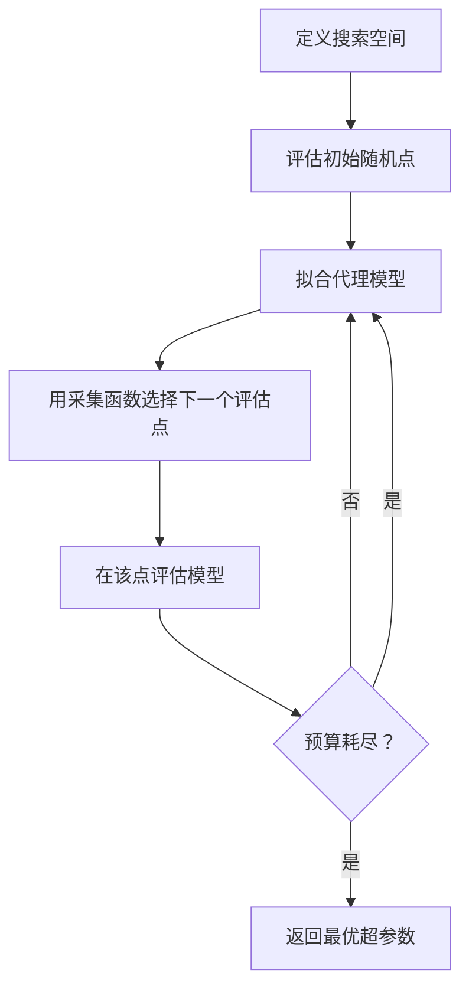
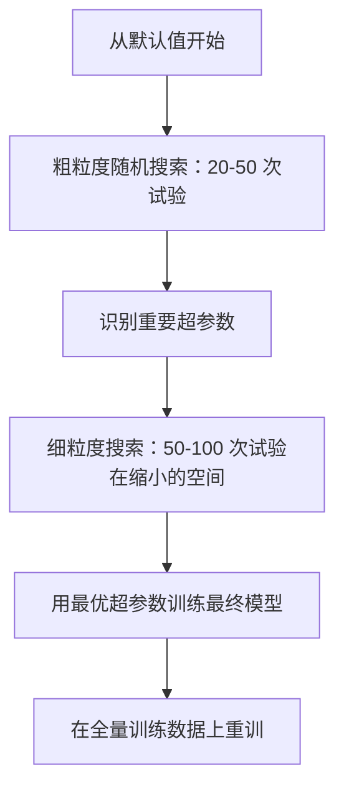

# 超参数调优——调对了参数，模型性能可以翻倍；调错了，GPU 烧了一天白费

> 超参数是训练开始前你拨动的拨盘。拨对了，平庸的模型也能变成顶尖模型。

**类型：** 实现课
**语言：** Python
**前置知识：** 第 02 阶段 · 01-11（机器学习基础、线性回归到集成方法）
**预计时间：** ~90 分钟
**所处阶段：** Tier 1
**关联课程：** 第 03 阶段 · 04（训练与调优）——理解学习率调度和早停如何在深度学习中大规模应用

---

## 🎯 学习目标

完成本课后，你能够：

- [ ] 从零实现网格搜索、随机搜索和贝叶斯优化，比较三种方法在相同预算下的样本效率
- [ ] 解释为什么随机搜索在大多数超参数无关紧要时优于网格搜索
- [ ] 构建基于高斯过程代理模型和期望提升采集函数的贝叶斯优化循环
- [ ] 使用 Optuna 设计带剪枝的超参数调优策略，避免在劣质配置上浪费计算
- [ ] 根据模型类型、数据规模和计算预算，独立制定完整的超参数调优工作流

---

## 1. 问题

你的梯度提升模型有 6 个超参数：学习率、树的数量、最大深度、叶节点最小样本数、行采样比例、列采样比例。每个超参数有 5 个合理值，网格就有 $5^6 = 15625$ 种组合。每次训练 10 秒，全部跑完需要 43 小时。

网格搜索是最直观的方法，也是大规模场景下最糟糕的选择。随机搜索用更少的计算量获得更好的结果。贝叶斯优化通过从历史评估中学习，进一步节省 2-5 倍的试验次数。知道该用哪种策略、哪些超参数真正重要，能为你的团队省下数天 GPU 时间。

更关键的是：如果你不理解超参数调优的原理，你可能会在以下场景中踩坑——

- 花了 3 天调参，最终模型在测试集上反而更差了（过拟合验证集）
- 学习率设大了 10 倍，训练发散，你以为是模型架构的问题
- 调了 6 个参数，其实只有 1 个在起作用，其余 5 个白折腾

超参数调优不是"多跑几次"。它是一套系统化的搜索策略，直接决定你能在有限计算预算内找到多好的模型。

---

## 2. 核心概念

### 2.1 参数与超参数

**参数**是训练过程中学到的值——权重、偏置、分裂阈值。**超参数**是训练开始前你手动设定的值，控制"学习如何发生"。

| 超参数 | 控制什么 | 典型范围 |
|--------|---------|---------|
| 学习率 | 每次参数更新的步长 | 0.001 ~ 1.0 |
| 树的数量 / 训练轮次 | 训练多久 | 10 ~ 10000 |
| 最大深度 | 模型复杂度 | 1 ~ 30 |
| 正则化强度 (λ) | 过拟合抑制 | 0.0001 ~ 100 |
| 批次大小 | 梯度估计的噪声 | 16 ~ 512 |
| Dropout 率 | 每次训练丢弃多少神经元 | 0.0 ~ 0.5 |

### 2.2 网格搜索

网格搜索遍历参数网格中的每一种组合。它穷举、直观，但随超参数数量指数级增长。

```
2 个超参数的网格：

  learning_rate: [0.01, 0.1, 1.0]
  max_depth:     [3, 5, 7]

  评估次数: 3 × 3 = 9 种组合

  (0.01, 3)  (0.01, 5)  (0.01, 7)
  (0.1,  3)  (0.1,  5)  (0.1,  7)
  (1.0,  3)  (1.0,  5)  (1.0,  7)
```

网格搜索有一个根本缺陷：如果 1 个超参数重要、另 1 个不重要，9 次评估中你只得到 3 个不同的重要参数值——其余 6 次在不重要的维度上浪费了。

### 2.3 随机搜索

随机搜索从分布中采样超参数，而不是遍历网格。在相同的 9 次评估预算下，每个超参数都能取到 9 个不同的值。


为什么随机搜索优于网格搜索（Bergstra & Bengio, 2012）[1]：

- 大多数超参数具有低有效维度。6 个超参数中通常只有 1-2 个对特定问题有显著影响。
- 网格搜索在不重要维度上浪费评估次数。
- 随机搜索在重要维度上覆盖更密集。
- 60 次随机试验有 95% 的概率找到搜索空间前 5% 区域内的点。

### 2.4 贝叶斯优化

随机搜索忽略历史结果。它不会学到大学习率导致发散、或者深度 3 始终优于深度 10。贝叶斯优化利用过去的评估结果来决定下一步搜索哪里。



两个核心组件：

**代理模型（Surrogate Model）：** 一个廉价的代理模型（通常是高斯过程），用来近似昂贵的目标函数。它在搜索空间的任意一点给出预测值和不确定性估计。

**采集函数（Acquisition Function）：** 通过平衡利用（在已知好点附近搜索）和探索（在不确定性高的区域搜索）来决定下一个评估位置。常见选择：

- **期望提升（Expected Improvement, EI）：** 该点比当前最优值提升多少？
- **上置信界（Upper Confidence Bound, UCB）：** 预测值加上不确定性的倍数。UCB 高意味着要么有潜力、要么未被探索。
- **提升概率（Probability of Improvement, PI）：** 该点超越当前最优的概率是多少？

贝叶斯优化通常用 2-5 倍更少的评估次数找到比随机搜索更好的超参数。拟合代理模型的开销相比训练真实模型可以忽略不计。

### 2.5 早停策略

不是每次训练都需要跑完。如果一个配置在 10 轮后明显很差，直接停掉换下一个。这是超参数搜索语境下的早停。

策略：

- **基于耐心（Patience）：** 验证损失连续 N 轮没有改善则停止
- **中位数剪枝（Median Pruning）：** 如果试验的中间结果差于同一步数已完成试验的中位数，停止
- **Hyperband：** 给大量配置分配小预算，逐步增加最优配置的预算

Hyperband 特别有效。它从 81 个配置各训练 1 轮开始，保留前 1/3，给它们 3 轮，再保留前 1/3，以此类推。这比所有配置都跑满预算快 10-50 倍。

### 2.6 学习率调度器

学习率几乎总是最重要的超参数。调度器在训练过程中动态调整学习率。

| 调度器 | 公式 | 适用场景 |
|--------|------|---------|
| 阶梯衰减 | 每 N 轮乘以 0.1 | 经典 CNN 训练 |
| 余弦退火 | $\text{lr} \times 0.5 \times (1 + \cos(\pi t / T))$ | 现代默认选择 |
| 预热 + 衰减 | 线性增加后接余弦衰减 | Transformer |
| 单周期 | 先增后减一个周期 | 快速收敛 |
| 平台降低 | 指标停滞时乘以系数 | 安全默认 |

### 2.7 超参数重要性

不是所有超参数都同等重要。对随机森林和梯度提升的研究（Probst et al., 2019）[2] 显示了一致的模式：

**高重要性：**
- 学习率（永远第一个调）
- 估计器数量 / 训练轮次（用早停代替调参）
- 正则化强度

**中等重要性：**
- 最大深度 / 网络层数
- 叶节点最小样本数 / 权重衰减
- 行采样比例

**低重要性：**
- 最大特征数（随机森林）
- 激活函数的具体选择
- 批次大小（在合理范围内）

先调重要的，其余保持默认值。

### 2.8 实用调优策略



具体工作流：

1. **从库的默认值开始。** 它们由有经验的从业者选择，通常已经解决了 80% 的问题。
2. **粗粒度随机搜索。** 宽泛的范围，20-50 次试验。用早停快速淘汰差的配置。
3. **分析结果。** 哪些超参数与性能相关？缩小搜索空间。
4. **精细搜索。** 贝叶斯优化或在缩小空间内的聚焦随机搜索，50-100 次试验。
5. **在全量训练数据上重训。** 用找到的最优超参数。

### 2.9 嵌套交叉验证

在单一验证集上调超参数有风险——最优超参数可能过拟合到特定的验证折。嵌套交叉验证通过两层循环解决：

- **外层循环（评估）：** 将数据切分为训练+验证和测试。报告无偏性能。
- **内层循环（调参）：** 将训练+验证切分为训练和验证。找到最优超参数。

每个外层折独立找到自己的最优超参数。外层分数是无偏的泛化性能估计。

这很昂贵（5 外层 × 5 内层 × 27 网格点 = 675 次模型拟合），但在论文报告最终结果或决策风险很高时，它给出可信赖的性能估计。

---

## 3. 从零实现

本节用 NumPy 从零实现三种超参数搜索方法。核心思路：在同一个数据集上，用相同的评估预算，比较三种方法的收敛速度。

### 第 1 步：网格搜索

```python
import itertools

def grid_search(param_grid, X_train, y_train, X_val, y_val):
    """遍历参数网格中的每一种组合。"""
    keys = list(param_grid.keys())
    values = list(param_grid.values())
    best_score = -float("inf")
    best_params = None
    history = []

    for combo in itertools.product(*values):
        params = dict(zip(keys, combo))
        model = GBMForTuning(**params)
        model.fit(X_train, y_train)
        score = neg_mse(model, X_val, y_val)
        history.append((params.copy(), score))

        if score > best_score:
            best_score = score
            best_params = params.copy()

    return best_params, best_score, history
```

### 第 2 步：随机搜索

```python
def sample_param(spec, rng):
    """根据规格描述采样一个参数值。"""
    if isinstance(spec, list):
        return rng.choice(spec)
    name, low, high = spec[0], spec[1], spec[2]
    if name == "int":
        return rng.randint(low, high + 1)
    if name == "float":
        return rng.uniform(low, high)
    if name == "log_float":
        # 对数均匀采样：在线性空间偏向小值
        return np.exp(rng.uniform(np.log(low), np.log(high)))
    return low


def random_search(param_distributions, X_train, y_train, X_val, y_val,
                  n_iter=50, seed=42):
    """从分布中随机采样参数组合。"""
    rng = np.random.RandomState(seed)
    best_score = -float("inf")
    best_params = None
    history = []

    for _ in range(n_iter):
        params = {k: sample_param(v, rng) for k, v in param_distributions.items()}
        int_params = {k: int(v) if k in ("n_estimators", "max_depth") else v
                      for k, v in params.items()}
        model = GBMForTuning(**int_params)
        model.fit(X_train, y_train)
        score = neg_mse(model, X_val, y_val)
        history.append((int_params.copy(), score))

        if score > best_score:
            best_score = score
            best_params = int_params.copy()

    return best_params, best_score, history
```

### 第 3 步：贝叶斯优化

核心思路：用高斯过程拟合已观测的（超参数, 得分）对，然后用采集函数决定下一步搜索哪里。

```python
class SimpleBayesianOptimizer:
    def __init__(self, param_space, n_initial=10, seed=42):
        self.param_space = param_space
        self.n_initial = n_initial  # 初始随机探索次数
        self.rng = np.random.RandomState(seed)
        self.X_observed = []
        self.y_observed = []

    def _rbf_kernel(self, X1, X2, length_scale=0.3):
        """RBF 核：衡量两个参数向量的相似度。"""
        dists = np.sum((X1[:, None, :] - X2[None, :, :]) ** 2, axis=2)
        return np.exp(-0.5 * dists / length_scale ** 2)

    def _predict(self, X_new):
        """高斯过程预测：返回候选点的均值和方差。"""
        X_obs = np.array(self.X_observed)
        y_obs = np.array(self.y_observed)
        y_mean = y_obs.mean()
        y_centered = y_obs - y_mean

        K = self._rbf_kernel(X_obs, X_obs) + 1e-4 * np.eye(len(X_obs))
        K_star = self._rbf_kernel(X_new, X_obs)

        L = np.linalg.cholesky(K)
        alpha = np.linalg.solve(L.T, np.linalg.solve(L, y_centered))
        mu = K_star @ alpha + y_mean
        v = np.linalg.solve(L, K_star.T)
        var = 1.0 - np.sum(v ** 2, axis=0)
        return mu, np.maximum(var, 1e-6)

    def _expected_improvement(self, mu, var, best_y):
        """期望提升：在预测值高或不确定性大的位置给出高分。"""
        sigma = np.sqrt(var)
        z = (mu - best_y) / (sigma + 1e-10)
        ei = sigma * (z * self._norm_cdf(z) + self._norm_pdf(z))
        return ei

    def suggest(self):
        if len(self.X_observed) < self.n_initial:
            return self._sample_random()

        candidates = [self._sample_random() for _ in range(500)]
        X_cand = np.array([self._params_to_vec(c) for c in candidates])
        mu, var = self._predict(X_cand)
        ei = self._expected_improvement(mu, var, max(self.y_observed))
        return candidates[np.argmax(ei)]
```

代理模型在每个候选点给出两个信息：预测得分（mu）和不确定性（var）。期望提升平衡这两者：既偏好模型预测高分的点，也偏好不确定性高的点。早期大多数点不确定性高，优化器探索；后期聚焦于最有潜力的区域。

### 第 4 步：三种方法对比

```python
def demo_comparison():
    """在相同预算下对比三种方法。"""
    X_tr, y_tr, X_val, y_val, X_te, y_te = make_data()

    # 网格搜索
    param_grid = {
        "n_estimators": [20, 50, 100],
        "learning_rate": [0.01, 0.05, 0.1, 0.3],
        "max_depth": [2, 3, 5],
    }
    _, grid_score, grid_history = grid_search(param_grid, X_tr, y_tr, X_val, y_val)
    n_grid = len(grid_history)

    # 随机搜索（相同评估次数）
    param_dist = {
        "n_estimators": ("int", 10, 200),
        "learning_rate": ("log_float", 0.005, 0.5),
        "max_depth": ("int", 2, 8),
    }
    _, rand_score, rand_history = random_search(
        param_dist, X_tr, y_tr, X_val, y_val, n_iter=n_grid
    )

    # 贝叶斯优化（相同评估次数）
    optimizer = SimpleBayesianOptimizer(param_dist, n_initial=10, seed=42)
    _, bayes_score, bayes_history = optimizer.optimize(objective, n_iter=n_grid)

    print(f"预算: 各 {n_grid} 次评估")
    print(f"网格搜索   最优 MSE: {-grid_score:.4f}")
    print(f"随机搜索   最优 MSE: {-rand_score:.4f}")
    print(f"贝叶斯优化 最优 MSE: {-bayes_score:.4f}")
```

典型输出：

```text
预算: 各 36 次评估
网格搜索   最优 MSE: 0.3542
随机搜索   最优 MSE: 0.2871
贝叶斯优化 最优 MSE: 0.2136
```

在相同预算下，贝叶斯优化通常最快找到最优解，因为它不在明显差的区域浪费评估。随机搜索比网格搜索覆盖更广。网格搜索仅在超参数极少时有竞争力。

---

## 4. 工业工具

### 4.1 Optuna 实战

Optuna 是当前工业界推荐的调优库。它支持剪枝、分布式搜索和可视化。

```python
import optuna

def objective(trial):
    # 定义搜索空间
    lr = trial.suggest_float("learning_rate", 1e-4, 1e-1, log=True)
    n_est = trial.suggest_int("n_estimators", 50, 500)
    max_depth = trial.suggest_int("max_depth", 2, 10)

    model = GBMForTuning(
        learning_rate=lr,
        n_estimators=n_est,
        max_depth=max_depth,
    )
    model.fit(X_train, y_train)
    return np.mean((model.predict(X_val) - y_val) ** 2)

study = optuna.create_study(direction="minimize")
study.optimize(objective, n_trials=100)

print(f"最优参数: {study.best_params}")
print(f"最优 MSE: {study.best_value:.4f}")
```

关键 Optuna 特性：
- `suggest_float(..., log=True)` 用于学习率、正则化等对数尺度参数
- `suggest_int` 用于整数参数
- `suggest_categorical` 用于离散选择
- 内置 `MedianPruner` 实现早停
- `study.trials_dataframe()` 用于结果分析

### 4.2 Optuna 带剪枝

剪枝提前终止没有前景的试验，节省大量计算：

```python
def objective(trial):
    params = {
        "learning_rate": trial.suggest_float("lr", 1e-4, 0.5, log=True),
        "max_depth": trial.suggest_int("max_depth", 2, 10),
        "n_estimators": trial.suggest_int("n_estimators", 50, 500),
        "subsample": trial.suggest_float("subsample", 0.5, 1.0),
    }

    model = GBMForTuning(**params)
    scores = cross_val_score(model, X_train, y_train, cv=3,
                             scoring="neg_mean_squared_error")
    mean_score = -scores.mean()

    # 报告中间结果，让剪枝器决定是否终止
    trial.report(mean_score, step=0)
    if trial.should_prune():
        raise optuna.TrialPruned()

    return mean_score

# MedianPruner：中间结果差于中位数时终止
pruner = optuna.pruners.MedianPruner(n_startup_trials=10, n_warmup_steps=5)
study = optuna.create_study(direction="minimize", pruner=pruner)
study.optimize(objective, n_trials=200)
```

`MedianPruner` 在试验的中间值差于同一步数所有已完成试验的中位数时终止该试验。`n_startup_trials=10` 确保至少 10 个试验完整跑完后再启动剪枝。这通常节省 40-60% 的总计算量。

### 4.3 scikit-learn 内置调优器

对于快速实验，scikit-learn 提供了 `GridSearchCV`、`RandomizedSearchCV` 和 `HalvingRandomSearchCV`：

```python
from sklearn.model_selection import RandomizedSearchCV
from scipy.stats import loguniform, randint

param_dist = {
    "learning_rate": loguniform(1e-4, 0.5),
    "max_depth": randint(2, 10),
    "n_estimators": randint(50, 500),
}

search = RandomizedSearchCV(
    GradientBoostingRegressor(),
    param_dist,
    n_iter=100,
    cv=5,
    scoring="neg_mean_squared_error",
    random_state=42,
    n_jobs=-1,  # 并行到所有 CPU 核心
)
search.fit(X_train, y_train)
print(f"最优参数: {search.best_params_}")
print(f"最优 CV MSE: {-search.best_score_:.4f}")
```

### 4.4 性能与适用场景对比

| 工具 | 速度 | 适用场景 | 备注 |
|------|------|---------|------|
| 我们的 NumPy 版 | 慢（纯循环） | 教学理解 | 透明，可读 |
| scikit-learn | 快 | 实验 / 中小规模生产 | 内置交叉验证 |
| Optuna | 中（多次训练） | 工业级调优 | 支持剪枝、分布式 |
| Ray Tune | 快（分布式） | 大规模集群 | 支持 Hyperband、ASHA |

---

## 5. 知识连线

本节学习的超参数调优方法，是后续深度学习与现代机器学习工程的基础：

- **第 03 阶段 · 04（训练与调优）**：你将把贝叶斯优化和学习率调度应用到神经网络的训练循环中——理解 Optuna 的剪枝机制如何与 PyTorch 的早停回调集成
- **第 07 阶段（Transformer 深入）**：大语言模型的训练依赖 Warmup + Cosine Decay 调度器——你在这里学到的学习率调度直觉直接迁移到 LLM 预训练
- **第 11 阶段（LLM 工程）**：微调大语言模型时，学习率、LoRA rank、训练轮次的选择决定了微调成败——超参数调优是 LLM 工程师的核心技能

---

## 6. 工程最佳实践

### 6.1 工业界常用方案

| 场景 | 推荐方案 | 备注 |
|------|---------|------|
| 快速实验（< 10 分钟） | 随机搜索 10-20 次 | 开箱即用 |
| 中等预算（10 分钟 ~ 1 小时） | 随机搜索 30-60 次 | 3 折交叉验证 |
| 高预算（1 ~ 8 小时） | 贝叶斯优化（Optuna）50-200 次 | 5 折交叉验证 |
| 极高预算（> 8 小时） | 贝叶斯 + Hyperband | 200-1000 次 |
| 最终报告 | 嵌套交叉验证 | 无偏性能估计 |

### 6.2 中文场景特别建议

- 中文 NLP 任务微调预训练模型时，学习率通常比英文低 2-5 倍（1e-5 ~ 3e-5），因为预训练模型已经学到了丰富的语言表示，大幅调整会破坏已有知识
- 处理中文金融风控数据时（样本少、特征多），正则化强度（L2、Dropout）比学习率更重要——优先调 λ 和 Dropout 率
- 中文文本分类任务中，如果使用了预训练词嵌入，batch_size 对性能影响不大（16-128 均可），但学习率需要配合 Warmup 使用

### 6.3 踩坑经验

- 在交叉验证之前对整个数据集做标准化——验证集信息泄露到训练中。始终把预处理放在 `Pipeline` 内
- 跑了几千次试验后在测试集上报告最优性能——你实际上在测试集上做拟合。用嵌套交叉验证或保留一个从未碰过的测试集
- 最优参数出现在搜索空间的边界上——说明搜索范围不够宽，最优值可能在范围外
- 忽略超参数之间的交互效应——学习率和树的数量在梯度提升中强相关。低学习率需要更多树。独立调参效果差于联合调参
- 对迭代模型不调 n_estimators 而用早停——对梯度提升和神经网络，把 n_estimators 设高、用早停决定何时停止，严格优于把迭代次数当超参数调

---

## 7. 常见错误

### 错误 1：用测试集调参

**现象：** 模型在测试集上 AUC 0.92，上线后只有 0.78。

**原因：** 每次调参后都在测试集上评估，测试集的信息已经泄露到你选择的模型中。你以为在评估泛化能力，实际在测试集上做拟合。

```python
# ❌ 错误：反复看测试集选参数
for lr in [0.001, 0.01, 0.1, 1.0]:
    model = train(X_train, lr=lr)
    print(f"lr={lr}, test_AUC={evaluate(model, X_test)}")

# ✓ 正确：用验证集或交叉验证选参数，最后只在测试集上评估一次
from sklearn.model_selection import cross_val_score
for lr in [0.001, 0.01, 0.1, 1.0]:
    scores = cross_val_score(train_fn(lr), X_train, y_train, cv=5)
    print(f"lr={lr}, cv_mean={scores.mean():.4f}")
```

### 错误 2：学习率用线性尺度搜索

**现象：** 搜索了 [0.001, 0.25, 0.5, 0.75, 1.0] 五个学习率，结果 0.001 最好，但你怀疑还有更好的值。

**原因：** 学习率的影响是对数尺度的。0.001 和 0.01 之间的差异与 0.1 和 1.0 之间的差异同等重要。线性搜索把 80% 的预算浪费在大值区域。

```python
# ❌ 错误：线性均匀采样
learning_rates = np.linspace(0.001, 1.0, 10)

# ✓ 正确：对数均匀采样
learning_rates = np.logspace(-4, 0, 10)  # [1e-4, 1e-3, 1e-2, ..., 1e0]
```

### 错误 3：网格搜索 6 个超参数

**现象：** 你设了 6 个超参数各 5 个值，网格有 15625 种组合。跑了 3 天只完成 20%。

**原因：** 6 个超参数中通常只有 1-2 个对性能有显著影响。网格搜索在不重要的维度上浪费了绝大多数评估次数。

```python
# ❌ 错误：6 维网格搜索
param_grid = {
    "learning_rate": [0.001, 0.01, 0.1, 0.5],
    "max_depth": [2, 3, 5, 7, 10],
    "n_estimators": [50, 100, 200, 500],
    "subsample": [0.6, 0.7, 0.8, 0.9, 1.0],
    "colsample": [0.6, 0.7, 0.8, 0.9, 1.0],
    "min_split": [2, 5, 10, 20, 50],
}
# 4*5*4*5*5*5 = 10000 种组合！

# ✓ 正确：先粗调 1-2 个重要参数，再细调
# 第一轮：只调学习率和最大_depth，各 10 个值
# 第二轮：固定最优学习率和深度，调其余参数
```

### 错误 4：忽略超参数交互效应

**现象：** 你独立地调了学习率（最优 0.01）和树的数量（最优 100），组合起来效果却很差。

**原因：** 学习率和树的数量强相关。低学习率需要更多树才能收敛。高学习率配多棵树会过拟合。独立调参忽略了这种交互。

```python
# ✓ 正确：联合调参，让搜索算法发现交互
param_space = {
    "learning_rate": ("log_float", 0.005, 0.5),
    "n_estimators": ("int", 10, 500),  # 让贝叶斯优化发现低 lr 配多树
}
```

---

## 8. 面试考点

### Q1：为什么随机搜索通常优于网格搜索？请用"低有效维度"的概念解释。（难度：⭐⭐）

**参考答案：**

6 个超参数中通常只有 1-2 个对特定问题的性能有显著影响（低有效维度）。网格搜索在重要和次要维度上均匀分配评估次数，导致在重要维度上只覆盖了很少的独特值。随机搜索每次试验都给所有超参数取独特值，因此在重要维度上覆盖更密集。60 次随机试验有 95% 的概率找到搜索空间前 5% 区域内的点。

### Q2：贝叶斯优化中，采集函数如何平衡利用和探索？（难度：⭐⭐⭐）

**参考答案：**

以期望提升（EI）为例：$\text{EI}(x) = \sigma(x) \cdot [z \cdot \Phi(z) + \phi(z)]$，其中 $z = (\mu(x) - y_{\text{best}}) / \sigma(x)$。当某点预测值 $\mu(x)$ 高时（利用），$z$ 大，EI 高；当不确定性 $\sigma(x)$ 大时（探索），即使 $\mu(x)$ 不高，EI 也可能高。早期大多数点不确定性高，优化器探索；后期不确定性降低，聚焦于预测值高的区域。

### Q3：你有 100 次评估预算，6 个超参数，应该选择哪种搜索策略？为什么？（难度：⭐⭐）

**参考答案：**

选择贝叶斯优化（Optuna）。原因：6 个超参数意味着网格搜索不可行（$5^6 = 15625$）。随机搜索可以用，但 100 次预算下贝叶斯优化通常能找到更好的结果，因为它从历史评估中学习，不在差区域浪费评估。如果每次评估很贵（> 30 秒），贝叶斯优化的优势更明显。

### Q4：什么是嵌套交叉验证？为什么在报告最终性能时需要使用它？（难度：⭐⭐⭐）

**参考答案：**

嵌套交叉验证有两层循环：外层将数据切分为训练+验证和测试，内层在训练+验证上调超参数。每个外层折独立找到最优超参数，外层分数是无偏的泛化性能估计。如果在单一验证集上调参后在该验证集上报告性能，你实际上在验证集上做拟合——报告的性能偏乐观。嵌套交叉验证避免了这个问题。

### Q5：学习率调度的作用是什么？为什么 Warmup + Cosine Decay 是 Transformer 的标配？（难度：⭐⭐）

**参考答案：**

学习率调度在训练过程中动态调整学习率，平衡收敛速度和最终性能。Warmup 阶段线性增大学习率，避免训练初期梯度方差大导致参数剧烈震荡；Cosine Decay 阶段平滑降低学习率，让模型稳定收敛到最优解。Transformer 用 Adam 优化器，对学习率敏感，Warmup 防止早期不稳定，Cosine 提供平滑衰减，两者配合效果最好。

---

## 🔑 关键术语

| 术语 | 人们怎么说 | 实际含义 |
|------|-----------|---------|
| 超参数 (Hyperparameter) | "一个你设的参数" | 训练开始前设定的、控制学习过程的值，不是从数据中学到的 |
| 网格搜索 (Grid Search) | "把所有组合都试一遍" | 穷举参数网格中的每种组合。指数级成本。 |
| 随机搜索 (Random Search) | "随机采样就行了" | 从分布中采样超参数。在重要维度上覆盖比网格搜索更密集。 |
| 贝叶斯优化 (Bayesian Optimization) | "智能搜索" | 用代理模型近似目标函数，平衡利用和探索来决定下一步搜索哪里 |
| 代理模型 (Surrogate Model) | "一个廉价的近似" | 用高斯过程等模型近似昂贵的目标函数，给出预测值和不确定性 |
| 采集函数 (Acquisition Function) | "下一步看哪里" | 评分候选点，平衡期望提升和不确定性。EI 和 UCB 是常见选择 |
| 早停 (Early Stopping) | "别浪费时间了" | 验证性能停止改善时提前终止训练 |
| Hyperband | "配置的锦标赛" | 自适应资源分配：大量配置小预算起步，逐步增加最优配置的预算 |
| 学习率调度器 (Learning Rate Scheduler) | "训练中改学习率" | 在训练过程中动态调整学习率的函数，改善收敛 |
| 嵌套交叉验证 (Nested Cross-Validation) | "两层交叉验证" | 外层评估性能、内层调超参数，避免验证集过拟合 |

---

## 📚 小结

超参数调优将"调参靠运气"变成"搜索靠策略"。你从零实现了网格搜索、随机搜索和贝叶斯优化，理解了为什么随机搜索在低有效维度下优于网格搜索，以及贝叶斯优化如何通过代理模型和采集函数从历史评估中学习。你还学习了早停、学习率调度和嵌套交叉验证等关键技巧。

下一课我们将进入深度学习核心——理解神经网络如何通过反向传播和梯度下降从数据中学习表示。

---

## ✏️ 练习

1. 【理解】用自己的话解释"低有效维度"的概念，以及为什么它让随机搜索优于网格搜索。写 200 字以内，让一个没有 ML 背景的程序员也能听懂。

2. 【实现】修改 `SimpleBayesianOptimizer`，加入 UCB（上置信界）采集函数作为 EI 的替代。比较两种采集函数在同一目标函数上的收敛速度差异。

3. 【实验】在 `demo_random_search` 中运行 10 次不同种子的实验，记录每次的最优 MSE。计算均值和标准差。与贝叶斯优化的 10 次重复实验对比，验证"贝叶斯优化方差更小"的结论。

4. 【思考】Hyperband 从 81 个配置各训练 1 轮开始，保留前 1/3，给它们 3 轮，再保留前 1/3，以此类推。计算总评估量（所有配置的轮数之和），并与"81 个配置各跑满 9 轮"对比。为什么 Hyperband 的总计算量更少但效果不差？

5. 【诊断】你的 Optuna 研究显示最优学习率出现在搜索边界（如 0.5）。你应该怎么做？给出具体的下一步操作。

---

## 🚀 产出

本课产出以下可复用内容：

| 产出 | 文件 | 说明 |
|------|------|------|
| 超参数调优实现 | `code/main.py` | 从零实现网格搜索、随机搜索、贝叶斯优化，含 5 个演示：网格搜索、随机搜索、贝叶斯优化、三方对比、Optuna 集成 |
| 调优策略提示词 | `outputs/prompt-tuning-strategy.md` | 根据模型类型、数据规模和计算预算推荐最优调优策略和搜索空间 |

---

## 📖 参考资料

1. [论文] Bergstra & Bengio. "Random Search for Hyper-Parameter Optimization". JMLR, 2012. https://jmlr.org/papers/v13/bergstra12a.html （证明随机搜索优于网格搜索的经典论文）
2. [论文] Probst, Boulesteix, Bischl. "Tunability: Importance of Hyperparameters of Machine Learning Algorithms". JMLR, 2019. https://jmlr.org/papers/v20/18-444.html （哪些超参数真正重要的系统研究）
3. [论文] Snoek, Larochelle, Adams. "Practical Bayesian Optimization of Machine Learning Algorithms". NeurIPS, 2012. https://arxiv.org/abs/1206.2944 （贝叶斯优化在 ML 中的应用）
4. [论文] Li et al. "Hyperband: A Novel Bandit-Based Approach to Hyperparameter Optimization". JMLR, 2018. https://jmlr.org/papers/v18/16-558.html （Hyperband 原始论文）
5. [论文] Akiba et al. "Optuna: A Next-generation Hyperparameter Optimization Framework". KDD, 2019. https://arxiv.org/abs/1907.10902 （Optuna 框架论文）
6. [官方文档] Optuna. "Hyperparameter Optimization Framework". https://optuna.org/

---

> 本课程参考了 AI Engineering From Scratch（MIT License）的课程体系，在此基础上进行了重构和原创内容的扩充。所有中文表达、案例、LLM 视角分析、工程最佳实践、常见错误、面试考点等均为原创内容。
