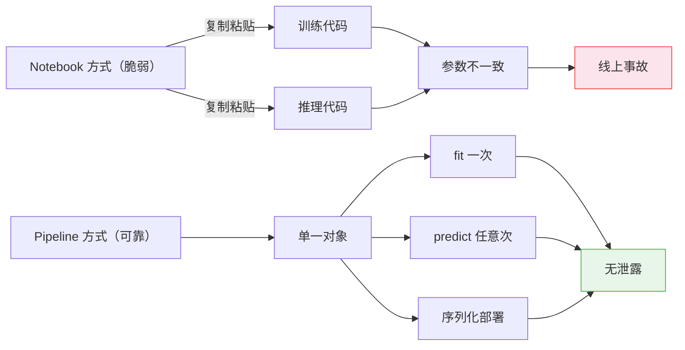

# ML 流水线

> 模型不是产品，流水线才是。从原始数据到线上预测的每一步，都必须可复现、可部署、可追溯。

**类型：** 实现课
**语言：** Python
**前置知识：** 阶段 02 · 08（特征工程）、阶段 02 · 09（模型评估）
**预计时间：** ~120 分钟
**所处阶段：** Tier 1
**关联课程：** 阶段 03 · 01（反向传播）——理解梯度如何在流水线各阶段传递

---

## 🎯 学习目标

完成本课后，你能够：

- [ ] 从零实现一个 ML 流水线，将缺失值填充、标准化、编码和模型训练封装为单一可复现对象
- [ ] 识别数据泄露的常见场景，并解释流水线如何通过"只在训练集上拟合"来防止泄露
- [ ] 使用 `ColumnTransformer` 对数值列和类别列应用不同的预处理策略
- [ ] 使用 joblib 序列化完整流水线，验证训练环境和生产环境产生完全一致的预测
- [ ] 使用 MLflow 记录实验参数、指标和模型版本，实现实验可追溯

---

## 1. 问题

你有一个 Jupyter Notebook：加载数据、用中位数填充缺失值、标准化特征、训练模型、打印准确率。它跑通了。你把它部署上线。

一个月后，有人重新训练模型，得到了不同的结果。原因是：中位数是在全量数据（包括测试集）上计算的——数据泄露。标准化参数没有保存，推理时用了不同的统计量。特征工程代码在训练和推理两份拷贝之间出现了分歧。生产环境出现了一个训练时从未见过的城市名，编码器直接崩溃。

这些不是假设场景。它们是 ML 系统在生产中失败的最常见原因。流水线（Pipeline）将所有变换步骤打包成一个有序、可序列化、可复现的对象，一次性解决上述所有问题。



---

## 2. 概念

### 2.1 什么是流水线

流水线是一个有序的数据变换序列，最后接一个模型。每一步的输出是下一步的输入。整个流水线在训练数据上拟合一次，推理时用同一个拟合好的流水线处理新数据并产生预测。


流水线保证四件事：

- **变换只在训练数据上拟合**——无泄露
- **推理时使用相同的变换**——训练/推理一致
- **整个对象可序列化为单一产物**——部署简单
- **交叉验证按折应用流水线**——防止细微泄露

### 2.2 数据泄露：沉默的杀手

数据泄露是指测试集或未来数据的信息"污染"了训练过程。它会让你的准确率看起来很好，但上线后一塌糊涂。

**泄露做法（错误）：**

```python
# ❌ scaler 在全量数据上拟合——测试集信息泄露到训练中
scaler = StandardScaler()
X_scaled = scaler.fit_transform(X)          # 此时 scaler 已经"看到"了测试集
X_train, X_test = X_scaled[:800], X_scaled[800:]
```

**正确做法：**

```python
# ✓ scaler 只在训练集上拟合
X_train, X_test = X[:800], X[800:]
scaler = StandardScaler()
X_train_scaled = scaler.fit_transform(X_train)  # 只在训练集上学习均值和标准差
X_test_scaled = scaler.transform(X_test)         # 用训练集的参数变换测试集
```

使用流水线时，你不需要手动记住这些规则——流水线自动处理。

### 2.3 训练/推理偏差

训练/推理偏差（Training/Serving Skew）是指模型在训练时看到的特征和推理时看到的特征不一致。这是 ML 系统上线后性能下降的头号原因。

| 偏差来源 | 典型表现 |
|---|---|
| 预处理代码不一致 | 训练用 Python 实现，推理用 Java 重写，细节不同 |
| 参数未保存 | 训练时计算的均值/标准差没有随模型一起部署 |
| 特征工程遗漏 | 训练时做了对数变换，推理时忘了做 |
| 数据分布漂移 | 生产数据分布随时间变化，但预处理参数没有更新 |

流水线的解法：**训练和推理使用同一个序列化对象**，从根本上消除偏差。

---

## 3. 从零实现

### 第 1 步：自定义变换器

每个变换器只需要实现三个方法：`fit`（学习参数）、`transform`（应用参数）、`fit_transform`（前两者合并）。

```python
class MedianImputer:
    """中位数填充器——在 fit 阶段只记录训练集的中位数。"""

    def __init__(self):
        self.medians = None

    def fit(self, X):
        self.medians = np.nanmedian(X, axis=0)  # 按列计算中位数
        return self

    def transform(self, X):
        X_out = X.copy()
        for col in range(X.shape[1]):
            mask = np.isnan(X_out[:, col])
            X_out[mask, col] = self.medians[col]
        return X_out

    def fit_transform(self, X):
        return self.fit(X).transform(X)
```

```python
class SimpleScaler:
    """标准化缩放器——零均值单位方差。"""

    def __init__(self):
        self.means = None
        self.stds = None

    def fit(self, X):
        self.means = np.nanmean(X, axis=0)
        self.stds = np.nanstd(X, axis=0)
        self.stds[self.stds == 0] = 1.0  # 防止除以零
        return self

    def transform(self, X):
        return (X - self.means) / self.stds

    def fit_transform(self, X):
        return self.fit(X).transform(X)
```

### 第 2 步：流水线骨架

```python
class PipelineFromScratch:
    """将多个变换器和一个模型串联成单一对象。"""

    def __init__(self, steps):
        # steps: [(name, transformer), ..., (name, model)]
        self.steps = steps

    def fit(self, X, y=None):
        X_current = X.copy()
        # 除最后一步（模型）外，全部 fit_transform
        for name, step in self.steps[:-1]:
            X_current = step.fit_transform(X_current)
        # 最后一步是模型
        _, model = self.steps[-1]
        model.fit(X_current, y)
        return self

    def predict(self, X):
        X_current = X.copy()
        for name, step in self.steps[:-1]:
            X_current = step.transform(X_current)  # 只 transform，不重新学习
        _, model = self.steps[-1]
        return model.predict(X_current)
```

### 第 3 步：在真实数据上运行

```python
# 生成模拟数据（含缺失值和类别列）
data = make_mixed_data(n_samples=500)
train, test = train_test_split_dict(data)

# 构建完整流水线
pipe = FullPipeline(
    model=LogisticRegressionSimple(lr=0.05, n_iter=1000),
    numeric_cols=["age", "income", "score"],
    categorical_cols=["city", "plan"],
)

pipe.fit(train)
print(f"训练集准确率: {pipe.score(train):.3f}")  # 训练集准确率: 0.777
print(f"测试集准确率: {pipe.score(test):.3f}")    # 测试集准确率: 0.770
```

### 第 4 步：交叉验证防泄露

```python
def make_pipeline():
    return FullPipeline(
        model=LogisticRegressionSimple(lr=0.05, n_iter=1000),
        numeric_cols=["age", "income", "score"],
        categorical_cols=["city", "plan"],
    )

scores = cross_validate(make_pipeline, data, n_folds=5)
print(f"5 折交叉验证: {np.mean(scores):.3f} ± {np.std(scores):.3f}")
# 5 折交叉验证: 0.756 ± 0.017
```

每一折的预处理器只在训练折上拟合，验证折绝不参与参数学习。

---

## 4. 工业工具

### 4.1 sklearn Pipeline

sklearn 的 `Pipeline` 将变换器和估计器链式组合，暴露统一的 `fit`、`predict`、`score` 接口。

```python
from sklearn.pipeline import Pipeline
from sklearn.preprocessing import StandardScaler
from sklearn.linear_model import LogisticRegression

pipe = Pipeline([
    ("scaler", StandardScaler()),           # 第 1 步：标准化
    ("model", LogisticRegression()),         # 第 2 步：逻辑回归
])

pipe.fit(X_train, y_train)
predictions = pipe.predict(X_test)
```

调用 `pipe.fit()` 时：scaler 对训练集执行 `fit_transform`，模型对标准化后的数据执行 `fit`。

调用 `pipe.predict()` 时：scaler 对测试集执行 `transform`（不重新学习参数），模型执行 `predict`。

### 4.2 ColumnTransformer：不同列走不同流水线

真实数据集同时包含数值列和类别列，需要不同预处理。`ColumnTransformer` 将不同列路由到不同的子流水线。

```python
from sklearn.compose import ColumnTransformer
from sklearn.preprocessing import StandardScaler, OneHotEncoder
from sklearn.impute import SimpleImputer
from sklearn.ensemble import GradientBoostingClassifier

# 数值列流水线：中位数填充 + 标准化
numeric_pipe = Pipeline([
    ("impute", SimpleImputer(strategy="median")),
    ("scale", StandardScaler()),
])

# 类别列流水线：众数填充 + 独热编码
cat_pipe = Pipeline([
    ("impute", SimpleImputer(strategy="most_frequent")),
    ("encode", OneHotEncoder(handle_unknown="ignore")),  # 关键：忽略未知类别
])

# 将不同列路由到不同流水线
preprocessor = ColumnTransformer([
    ("num", numeric_pipe, ["age", "income", "score"]),
    ("cat", cat_pipe, ["city", "plan"]),
])

# 完整流水线
full_pipe = Pipeline([
    ("preprocess", preprocessor),
    ("model", GradientBoostingClassifier(n_estimators=100, max_depth=3)),
])

# 5 折交叉验证——整个流水线在每个折上独立拟合
from sklearn.model_selection import cross_val_score
scores = cross_val_score(full_pipe, df, y, cv=5, scoring="accuracy")
print(f"准确率: {scores.mean():.3f} ± {scores.std():.3f}")
# 准确率: 0.740 ± 0.013
```

`handle_unknown="ignore"` 是生产环境的关键配置。当新类别出现时（如训练时没有"成都"），它返回全零向量而不是报错。

### 4.3 模型持久化（joblib）

部署时，你需要将整个流水线（包括所有预处理参数和模型权重）序列化为单一文件。

```python
import joblib

# 保存完整流水线
joblib.dump(full_pipe, "pipeline.joblib")

# 在生产环境加载
loaded_pipe = joblib.load("pipeline.joblib")
predictions = loaded_pipe.predict(new_data)  # 使用训练时的参数
```

**为什么用 joblib 而不是 pickle？** joblib 对 numpy 数组做了优化，序列化大模型时更快、更小。sklearn 官方推荐使用 joblib。

### 4.4 实验追踪（MLflow）

流水线让训练可复现，但还需要记录每次实验的参数、指标和产物。MLflow 是最常用的开源方案。

```python
import mlflow

with mlflow.start_run():
    # 记录超参数
    mlflow.log_param("max_depth", 5)
    mlflow.log_param("n_estimators", 100)
    mlflow.log_param("learning_rate", 0.1)

    # 训练
    pipe.fit(X_train, y_train)
    accuracy = pipe.score(X_test, y_test)

    # 记录指标
    mlflow.log_metric("accuracy", accuracy)

    # 记录完整流水线（包括预处理和模型）
    mlflow.sklearn.log_model(pipe, "model")
```

运行 `mlflow ui` 后可以在浏览器中比较所有实验，选择最佳模型并直接部署。

### 4.5 数据版本控制（DVC）

代码用 git 管理，但 git 无法处理大文件。DVC（Data Version Control）将数据存储在远程仓库（S3、GCS），在 git 中只保留一个记录哈希的小文件。

```bash
dvc init
dvc add data/training.csv
git add data/training.csv.dvc data/.gitignore
git commit -m "Track training data v1"
dvc push
```

每次 git 提交同时锁定了代码版本和数据版本，实现完全可复现。

---

## 5. 知识连线

本课学习的 ML 流水线，是后续所有工程实践的基础：

- **阶段 03（深度学习核心）**：你会看到 PyTorch 的 `DataLoader` 如何承担流水线的角色，将数据增强、批处理、打乱封装为可迭代对象
- **阶段 07（Transformer 深入）**：HuggingFace 的 `Trainer` 内部就是一个完整的流水线——分词、批处理、梯度累积、混合精度训练全部封装在一起
- **阶段 11（LLM 工程）**：你会看到 MLflow 的实验追踪能力如何扩展到 LLM 的 prompt 版本管理和评估流水线

---

## 6. 工程最佳实践

### 6.1 工业界常用方案

| 场景 | 推荐方案 | 备注 |
|---|---|---|
| 学习/实验 | sklearn `Pipeline` + `ColumnTransformer` | 开箱即用，防泄露 |
| 生产部署（sklearn 模型） | `joblib.dump` 序列化完整流水线 | 包含预处理参数 |
| 生产部署（深度学习） | ONNX / TorchScript / TensorRT | 跨语言、高性能 |
| 实验追踪 | MLflow（自托管）或 W&B（托管） | 记录参数、指标、产物 |
| 数据版本控制 | DVC + S3/GCS | 大文件版本管理 |
| 流水线编排 | Airflow / Prefect / Dagster | 定时调度、依赖管理 |

### 6.2 中文场景特别建议

- 中文类别特征（如城市名、商品类目）在训练时可能覆盖不全，务必设置 `handle_unknown="ignore"`
- 中文文本特征需要额外的分词步骤，应在流水线中加入 `TfidfVectorizer` 或自定义分词变换器
- 处理中文日期/地址等非结构化字段时，建议封装为自定义 sklearn 变换器（继承 `BaseEstimator` 和 `TransformerMixin`）

### 6.3 踩坑经验

- 在流水线外部做特征选择（如基于相关系数筛选列），导致训练时选了不同列——特征选择必须放在流水线内部
- 用 `fit_transform` 处理测试集——测试集只能用 `transform`，否则就是泄露
- 序列化时只保存模型权重，没保存预处理参数——部署时用了不同的均值/标准差
- 流水线中使用了随机操作但未设置 `random_state`——每次训练结果不同
- 生产环境出现新类别导致 `OneHotEncoder` 报错——训练时未设置 `handle_unknown="ignore"`

---

## 7. 常见错误

### 错误 1：在全量数据上拟合预处理器

**现象：** 交叉验证准确率远高于独立测试集准确率。

**原因：** scaler/encoder 在拆分前看到了测试集信息，模型间接"作弊"。

**修复：**

```python
# ❌ 泄露做法
scaler = StandardScaler()
X_scaled = scaler.fit_transform(X)
X_train, X_test = X_scaled[:800], X_scaled[800:]

# ✓ 正确做法：预处理器在流水线内部，只在训练集上拟合
pipe = Pipeline([
    ("scaler", StandardScaler()),
    ("model", LogisticRegression()),
])
# cross_val_score(pipe, X, y, cv=5)  # 每个折独立拟合
```

### 错误 2：训练和推理使用不同预处理代码

**现象：** 模型在 Notebook 里效果很好，部署后准确率骤降。

**原因：** 训练时用 Python 做了对数变换，推理服务用 Java 重写时遗漏了这一步。

**修复：** 将预处理和模型打包为一个流水线对象，训练和推理使用同一个序列化文件。

### 错误 3：未知类别导致生产崩溃

**现象：** 线上服务遇到新城市名，返回 500 错误。

**原因：** `OneHotEncoder` 默认 `handle_unknown="error"`，遇到未见过的类别直接抛异常。

**修复：**

```python
# ❌ 默认行为：遇到未知类别报错
OneHotEncoder()

# ✓ 生产配置：未知类别返回全零向量
OneHotEncoder(handle_unknown="ignore")
```

### 错误 4：交叉验证时预处理在折外拟合

**现象：** 交叉验证分数虚高，但 holdout 测试集表现差。

**原因：** 先在全量数据上做特征选择或目标编码，再做交叉验证。

**修复：** 将所有预处理步骤放入 Pipeline，让 `cross_val_score` 在每个折的训练部分独立拟合。

---

## 8. 面试考点

### Q1：什么是数据泄露？举一个预处理阶段的泄露例子。（难度：⭐⭐）

**参考答案：**

数据泄露是指训练过程中使用了推理时不可用的信息，导致评估指标虚高。

预处理阶段的典型例子：在全量数据（含测试集）上拟合 `StandardScaler`，然后用同一参数变换训练集和测试集。此时 scaler 的均值和标准差包含了测试集信息，模型间接"看到了"测试集。修复方法是将 scaler 放入 Pipeline，确保只在训练折上拟合。

### Q2：sklearn 的 `Pipeline` 和 `ColumnTransformer` 分别解决什么问题？（难度：⭐⭐）

**参考答案：**

`Pipeline` 解决的是**步骤串联**问题——将多个变换器和一个模型按顺序组合，保证 fit 时按序拟合、predict 时按序变换，防止数据泄露。

`ColumnTransformer` 解决的是**列路由**问题——将不同列应用不同的预处理流水线（如数值列标准化、类别列编码），然后将结果水平拼接。两者通常组合使用：外层 Pipeline 包含一个 ColumnTransformer 步骤和一个模型步骤。

### Q3：为什么生产部署时要序列化整个流水线，而不是只保存模型权重？（难度：⭐⭐⭐）

**参考答案：**

因为模型推理需要经过与训练完全相同的预处理。如果只保存模型权重，部署时需要手动重现所有预处理步骤（填充、缩放、编码），容易出错且难以保证一致性。序列化整个流水线（包括预处理参数和模型权重）可以确保：

1. 训练和推理使用完全相同的变换参数
2. 部署时不需要重预处理代码
3. 流水线版本和模型版本一一对应，便于回滚

### Q4：`handle_unknown="ignore"` 在什么场景下必须设置？不设会怎样？（难度：⭐⭐）

**参考答案：**

当类别特征在训练时无法覆盖所有可能取值时必须设置。生产环境随时可能出现新城市、新用户、新商品等训练时未见过的类别。

不设的话，`OneHotEncoder` 默认 `handle_unknown="error"`，遇到未知类别会直接抛出 `ValueError`，导致线上服务 500 错误。设置后，未知类别会被编码为全零向量，模型不会崩溃，只是没有该类别的先验信息。

---

## 🔑 关键术语

| 术语 | 人们怎么说 | 实际含义 |
|---|---|---|
| 流水线（Pipeline） | "把变换和模型串起来" | 有序的变换器序列加一个模型，作为单一对象拟合和预测，防止数据泄露 |
| 数据泄露（Data Leakage） | "测试集信息泄露到训练中" | 训练时使用了推理时不可用的信息，导致评估指标虚高 |
| 列变换器（ColumnTransformer） | "不同列做不同处理" | 将不同列子集路由到不同子流水线，结果水平拼接 |
| 训练/推理偏差（Training/Serving Skew） | "Notebook 里跑得好好的" | 训练和推理时数据预处理不一致，导致线上性能下降 |
| 模型持久化 | "把模型存下来" | 将完整流水线（含参数）序列化为文件，供部署时加载 |
| 实验追踪（Experiment Tracking） | "记录每次实验" | 记录每次训练的参数、指标、产物和代码版本，支持复现和比较 |
| MLflow | "ML 的实验管理工具" | 开源的实验追踪、模型注册和部署平台 |
| DVC | "数据版的 git" | 数据版本控制系统——哈希存在 git，实际数据在远程存储 |
| 可复现性（Reproducibility） | "再跑一遍结果一样" | 相同代码、相同数据、相同配置产生完全相同结果的能力 |
| 模型注册表（Model Registry） | "模型版本管理" | 跟踪模型版本、管理阶段（staging/production/archived）的系统 |

---

## 📚 小结

ML 流水线将数据预处理和模型训练封装为单一可复现对象，从根本上防止数据泄露和训练/推理偏差。你从零实现了一个完整的流水线，并使用 sklearn 的 `Pipeline` + `ColumnTransformer` 构建了工业级方案。

下一课我们将学习超参数调优——在流水线的基础上，如何系统性地搜索最优参数组合。

---

## ✏️ 练习

1. 【理解】用自己的话解释：为什么把 `StandardScaler` 放在 `Pipeline` 内部可以防止数据泄露？如果放在外部、在 `cross_val_score` 之前对全量数据调用 `fit_transform`，会发生什么？写 150 字以内。

2. 【实现】修改 `FullPipeline`，加入一个"对数变换"步骤——对 `income` 列在标准化之前先取 `log1p`。验证流水线仍然可以正常运行。

3. 【实验】故意制造数据泄露：在全量数据上拟合 scaler 后做交叉验证，与流水线内嵌 scaler 的交叉验证结果对比。在 `make_mixed_data(n_samples=2000)` 上重复实验，观察差异是否变大。

4. 【思考】一个模型在训练集上准确率 95%、交叉验证平均 75%、独立测试集 72%。请诊断可能的原因，并说明你会如何修改流水线来验证你的假设。

---

## 🚀 产出

本课产出以下可复用内容：

| 产出 | 文件 | 说明 |
|---|---|---|
| 完整流水线实现 | `code/main.py` | 从零实现 + sklearn 工业方案，8 个演示场景 |
| 流水线调试提示词 | `outputs/prompt-ml-pipeline-debugger.md` | 排查数据泄露和训练/推理偏差的对话提示词 |

---

## 📖 参考资料

1. [官方文档] scikit-learn. "Pipeline and ColumnTransformer". https://scikit-learn.org/stable/modules/compose.html
2. [官方文档] MLflow. "MLflow Tracking". https://mlflow.org/docs/latest/tracking.html
3. [官方文档] DVC. "Get Started". https://dvc.org/doc/start
4. [论文] Sculley et al. "Hidden Technical Debt in Machine Learning Systems". NeurIPS, 2015. https://papers.nips.cc/paper/2015/hash/86df7dcfd896fcaf2674f757a2463eba-Abstract.html
5. [官方文档] Google. "Rules of Machine Learning". https://developers.google.com/machine-learning/guides/rules-of-ml

---

> 本课程参考了 AI Engineering From Scratch（MIT License）的课程体系，在此基础上进行了重构和原创内容的扩充。所有中文表达、案例、LLM 视角分析、工程最佳实践、常见错误、面试考点等均为原创内容。
