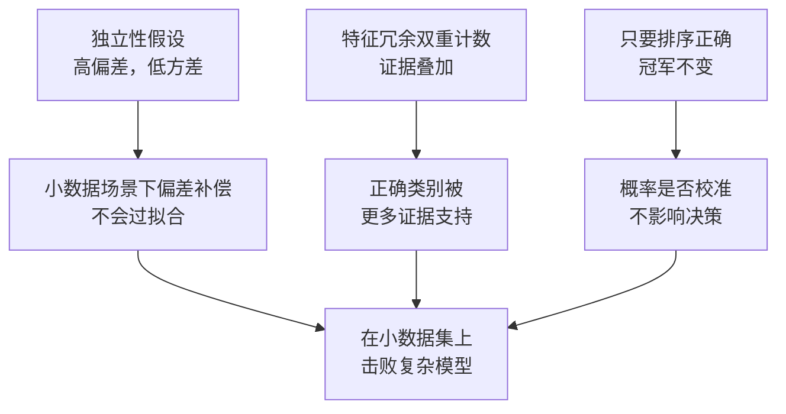

# 朴素贝叶斯

> 一个数学上错误的假设，照样能做出正确的分类。这就是朴素贝叶斯的魅力。

**类型：** 实现课
**语言：** Python
**前置知识：** 阶段 02 第 04 节（概率与分布）、第 05 节（贝叶斯定理）
**预计时间：** ~75 分钟
**所处阶段：** Tier 1
**关联课程：** 阶段 05 · 01（文本分类流水线）— NB 是文本分类最古老的基线模型；阶段 07 · 02（词嵌入）— 理解为什么 NB 的独立性假设在词嵌入面前不攻自破

---

## 🎯 学习目标

完成本课后，你能够：

- [ ] 从零实现多项式朴素贝叶斯，理解拉普拉斯平滑如何避免零概率问题
- [ ] 解释"朴素"独立性假设为什么数学上错误，但在文本分类中依然有效
- [ ] 比较多项式、高斯、伯努利三种 NB 变体的适用场景，为具体任务选择正确变体
- [ ] 使用 scikit-learn 构建完整的文本分类流水线，并评估其性能
- [ ] 诊断 NB 的概率输出为什么不可靠，并解释何时需要校准

---

## 1. 问题

你需要对文本进行分类。邮件是垃圾邮件还是正常邮件？用户评论是好评还是差评？客服工单应该分配给哪个部门？

这类问题有两个棘手特征：**特征维度极高（词表可能有几万个词）**、**训练数据相对有限**。大多数分类器在这里陷入困境——逻辑回归需要足够样本才能可靠地估计上万个权重；决策树在每个节点只看到一个词，过拟合得一塌糊涂；KNN 在几万维空间里，每个点到其他点的距离都差不多，"最近邻"毫无意义。

朴素贝叶斯（Naive Bayes，简称 NB）偏偏在这种场景下如鱼得水。它做了一个数学上明显错误的假设：给定类别的前提下，所有特征相互独立。"machine" 和 "learning" 在任何文档里都不独立——但这个假设错了没关系。NB 不需要正确估计概率，只需要正确排出类别的高低。它只用一遍扫描数据做计数就能完成训练，上百万文档几秒搞定，在小数据集上比"更聪明"的模型表现更好。

理解一个错误的假设如何导出正确的预测，会让你对机器学习有更深的认识：**最好的模型不是最正确的模型，而是偏差-方差权衡最契合你数据量的模型**。

---

## 2. 概念

### 2.1 贝叶斯定理的直觉

贝叶斯定理翻转了条件概率的方向：

```
P(类别 | 特征) = P(特征 | 类别) × P(类别) / P(特征)
```

我们想知道的是 **后验概率** `P(类别 | 特征)`：在观察到这些词的前提下，文档属于某个类别的概率。这个概率可以从三部分算出来：

- **先验概率** `P(类别)`：垃圾邮件在所有邮件中占多大比例——看就能猜
- **似然** `P(特征 | 类别)`：垃圾邮件里出现"免费"这个词的概率有多大
- **证据** `P(特征)`：所有类别下看到这些词的总概率——对所有类别相同，比较时可以约掉

哪一类的后验概率最大，文档就属于哪一类。

### 2.2 "朴素"在哪里

真正困难的是计算 `P(特征 | 类别)`。一个 10,000 词的词表意味着要估计 2¹⁰⁰⁰⁰ 种组合的联合概率——天文数字，不可能完成。

NB 的解决办法：**假设所有特征在给定类别下条件独立**：

```
P(w1, w2, ..., wn | 类别) = P(w1 | 类别) × P(w2 | 类别) × ... × P(wn | 类别)
```

从一个不可能的联合分布，变成 n 个简单的一维分布。每个分布只需要数一数频率。

这个假设显然与事实不符。"machine" 和 "learning" 在技术文档中高度相关，在任何真实文档中都不独立。但 NB 犯了一个巧妙的错误——**它不需要正确估计概率，只需要正确排序**。即使算出来的 P(垃圾邮件) = 0.99999 而真实概率只有 0.7，它仍然正确地把文档判为垃圾邮件。分类器要的是冠军，不是准确的分数。

### 2.3 为什么它仍然有效



三个原因让 NB 的"错误"变成了优势：

1. **排序优先于校准**。分类只需要概率最大的类别正确。独立性假设带来的系统性误差对所有类别影响类似，排序不变。

2. **高偏差、低方差**。独立性假设是一个强先验——它大幅限制了模型空间，从而防止过拟合。训练数据少时，一个"略错但稳定"的模型，完胜一个"理论正确但波动剧烈"的模型。

3. **特征冗余的"对称性错误"**。"machine" 和 "learning" 高度相关，NB 会双重计数它们提供的证据——但对正确类别来说，两份证据叠加强化的就是正确的方向。

### 2.4 具体数字演示

假设二分类问题：垃圾邮件 vs 正常邮件。词表三个词："免费"、"赚钱"、"会议"。

训练数据：
- 垃圾邮件中"免费"出现 80 次、"赚钱"60 次、"会议"10 次（总计 150 词）
- 正常邮件中"免费"出现 5 次、"赚钱"10 次、"会议"100 次（总计 115 词）
- 40% 的邮件是垃圾邮件

**拉普拉斯平滑后**（alpha=1）：

```
P(免费 | 垃圾)   = (80+1) / (150+3) = 0.529
P(赚钱 | 垃圾)   = (60+1) / (150+3) = 0.399
P(会议 | 垃圾)   = (10+1) / (150+3) = 0.072

P(免费 | 正常)   = (5+1) / (115+3) = 0.051
P(赚钱 | 正常)   = (10+1) / (115+3) = 0.093
P(会议 | 正常)   = (100+1) / (115+3) = 0.856
```

新邮件包含"免费"2 次、"赚钱"1 次、"会议"0 次：

```
log P(垃圾 | 邮件) = log(0.4) + 2×log(0.529) + 1×log(0.399)
                   = -0.916 + 2×(-0.637) + (-0.919) = -3.109

log P(正常 | 邮件) = log(0.6) + 2×log(0.051) + 1×log(0.093)
                   = -0.511 + 2×(-2.976) + (-2.375) = -8.838
```

垃圾邮件以较大优势胜出。"免费"出现两次是强有力的证据。注意"会议"没出现贡献为 0——多项式 NB 中，没出现的词不影响判断。而伯努利 NB 会显式惩罚"会议"的缺失，这一点我们在 2.6 节说明。

### 2.5 三种变体

NB 有三种变体，区别在于对 `P(特征 | 类别)` 的建模方式不同：

| 变体 | 特征类型 | 适用场景 | 典型案例 |
|---|---|---|---|
| **多项式 NB** | 计数或频率 | 文本分类、词袋模型 | 邮件垃圾过滤、主题分类 |
| **高斯 NB** | 连续数值 | 表格数据、正态分布特征 | 鸢尾花分类、传感器数据 |
| **伯努利 NB** | 二元（0/1） | 短文本、二元特征向量 | SMS 垃圾过滤、词出现特征 |

#### 多项式 NB

把每个特征建模为计数，适用于词频或 TF-IDF 值。

$$P(w_i | c) = \frac{\text{count}(w_i, c) + \alpha}{\text{total}_c + \alpha \times |V|}$$

其中 $\alpha$ 是拉普拉斯平滑系数，$|V|$ 是词表大小。这是文本分类的主力变体。

#### 高斯 NB

把每个特征建模为正态分布，适用于连续特征。

$$P(x_i | c) = \frac{1}{\sqrt{2\pi\sigma_c^2}} \exp\left(-\frac{(x_i - \mu_c)^2}{2\sigma_c^2}\right)$$

每个类别的每个特征有自己的均值 $\mu_c$ 和方差 $\sigma_c^2$。

#### 伯努利 NB

把每个特征建模为二元变量（出现/不出现），适用于短文本。

$$P(w_i | c) = \frac{\text{包含} w_i \text{的文档数} + \alpha}{\text{类别} c \text{的总文档数} + 2\alpha}$$

与多项式 NB 的关键区别：伯努利 NB 显式建模**特征的不出现**。如果"免费"通常出现在垃圾邮件中，但当前邮件没有出现，伯努利 NB 会将其视为反对垃圾邮件的证据。

### 2.6 拉普拉斯平滑

测试集中出现了训练时从未见过的词怎么办？

**没有平滑时**：`P(新词 | 类别) = 0/N = 0`。一个零乘穿整个乘积，`P(类别 | 特征) = 0`，不管其他证据多强。一个生僻词就能毁掉整个预测。

**拉普拉斯平滑**给每个特征计数加上一个小常数 $\alpha$（通常取 1）：

$$P(w_i | c) = \frac{\text{count}(w_i, c) + \alpha}{\text{total}_c + \alpha \times |V|}$$

每个词至少有一个微小的概率。"discombobulate" 出现在测试邮件中，不再让垃圾邮件概率归零。

$\alpha$ 越大，分布越均匀（越"平滑"）；$\alpha$ 越小，模型越信任数据。$\alpha$ 是需要调节的超参数。

| Alpha | 效果 | 适用场景 |
|---|---|---|
| 0.001 | 几乎不平滑，完全信任数据 | 训练集极大，几乎不会有未登录词 |
| 0.1 | 轻度平滑 | 训练集较大 |
| 1.0 | 标准拉普拉斯平滑 | 默认起点 |
| 10.0 | 重度平滑，压平分布 | 训练集极小，预期大量未登录词 |

### 2.7 对数空间计算

几百个小于 1 的概率相乘，浮点数会下溢（underflow）成 0。即使真实值是一个极小的正数，计算机也表示不了。

解决办法：**在对数空间运算**。乘法变加法：

$$\log P(c | \mathbf{x}) = \log P(c) + \sum_i \log P(x_i | c)$$

预测变成了矩阵乘法：

```python
log_scores = X @ feature_log_probs.T + log_class_priors
prediction = argmax(log_scores)
```

这就是 NB 预测极快的原因——它和单层线性模型做的是同样的矩阵乘法。

### 2.8 NB vs 逻辑回归

两者都是文本分类的线性模型，但建模对象不同：

| 维度 | 朴素贝叶斯 | 逻辑回归 |
|---|---|---|
| 类型 | 生成式（建模 P(X\|Y)） | 判别式（直接建模 P(Y\|X)） |
| 训练方式 | 计数频率 | 优化损失函数 |
| 小数据表现 | 更好（强先验防过拟合） | 更差（样本不够估计权重） |
| 大数据表现 | 更差（错误假设拖累） | 更好（灵活边界） |
| 特征相关性 | 假设独立 | 能处理相关特征 |
| 训练速度 | 单遍扫描，极快 | 迭代优化 |
| 概率校准 | 较差 | 较好 |

经验法则：先用 NB 做基线。如果数据量足够大、NB 准确率不再提升，切换到逻辑回归。

---

## 3. 从零实现

`code/main.py` 包含三种 NB 变体的完整实现。下面逐步讲解核心逻辑。

### 第 1 步：多项式 NB

```python
class MultinomialNB:
    def __init__(self, alpha=1.0):
        self.alpha = alpha

    def fit(self, X, y):
        self.classes_ = np.unique(y)
        n_classes = len(self.classes_)
        n_features = X.shape[1]

        self.class_log_prior_ = np.zeros(n_classes)
        self.feature_log_prob_ = np.zeros((n_classes, n_features))

        for i, c in enumerate(self.classes_):
            X_c = X[y == c]
            # 类别先验的对数
            self.class_log_prior_[i] = np.log(X_c.shape[0] / X.shape[0])
            # 拉普拉斯平滑后的条件概率对数
            counts = X_c.sum(axis=0) + self.alpha
            self.feature_log_prob_[i] = np.log(counts / counts.sum())

        return self

    def predict_log_proba(self, X):
        # 矩阵乘法：X @ log_probs.T + log_priors
        return X @ self.feature_log_prob_.T + self.class_log_prior_

    def predict(self, X):
        log_proba = self.predict_log_proba(X)
        return self.classes_[np.argmax(log_proba, axis=1)]
```

关键洞察：训练完成后，预测就是一次矩阵乘法加偏置。这就是 NB 极快的原因。

### 第 2 步：高斯 NB

```python
class GaussianNB:
    def fit(self, X, y):
        self.classes_ = np.unique(y)
        n_classes = len(self.classes_)
        n_features = X.shape[1]

        self.means_ = np.zeros((n_classes, n_features))
        self.vars_ = np.zeros((n_classes, n_features))
        self.priors_ = np.zeros(n_classes)

        for i, c in enumerate(self.classes_):
            X_c = X[y == c]
            self.means_[i] = X_c.mean(axis=0)
            # 方差加平滑项，防止零方差导致除零
            self.vars_[i] = X_c.var(axis=0) + 1e-9
            self.priors_[i] = X_c.shape[0] / X.shape[0]

        return self
```

高斯 NB 对每个类别的每个特征估计均值和方差，然后用高斯概率密度函数计算似然。

### 第 3 步：伯努利 NB

```python
class BernoulliNB:
    def fit(self, X, y):
        # 二值化：非零即 1
        X_binary = (X > 0).astype(float)
        self.classes_ = np.unique(y)
        n_classes = len(self.classes_)
        n_features = X.shape[1]

        self.class_log_prior_ = np.zeros(n_classes)
        self.feature_log_prob_ = np.zeros((n_classes, n_features))

        for i, c in enumerate(self.classes_):
            X_c = X_binary[y == c]
            self.class_log_prior_[i] = np.log(X_c.shape[0] / X_binary.shape[0])
            # 特征出现的文档频率
            feature_count = X_c.sum(axis=0) + self.alpha
            total_docs = X_c.shape[0] + 2 * self.alpha
            self.feature_log_prob_[i] = np.log(feature_count / total_docs)

        return self
```

伯努利 NB 的关键区别：预测时同时考虑特征出现和不出现的贡献。

### 第 4 步：运行演示

```bash
python code/main.py
```

输出包括：
- 多项式 NB 在模拟文本数据上的分类效果
- 不同平滑系数（alpha）对准确率的影响
- 高斯 NB 在连续特征数据上的参数学习
- 伯努利 NB 与多项式 NB 的对比
- 与 scikit-learn 的对比验证
- 训练集大小对准确率的影响

---

## 4. 工业工具

### 4.1 scikit-learn 三种变体

```python
from sklearn.naive_bayes import MultinomialNB, GaussianNB, BernoulliNB
from sklearn.feature_extraction.text import CountVectorizer, TfidfVectorizer
from sklearn.pipeline import Pipeline

# 多项式 NB + 词袋
text_clf = Pipeline([
    ("vectorizer", CountVectorizer()),
    ("classifier", MultinomialNB(alpha=1.0)),
])
text_clf.fit(train_texts, train_labels)
accuracy = text_clf.score(test_texts, test_labels)

# 多项式 NB + TF-IDF（更强的基线）
text_clf_tfidf = Pipeline([
    ("tfidf", TfidfVectorizer()),
    ("classifier", MultinomialNB(alpha=0.1)),
])

# 伯努利 NB（短文本场景）
text_clf_bernoulli = Pipeline([
    ("vectorizer", CountVectorizer(binary=True)),
    ("classifier", BernoulliNB(alpha=1.0)),
])

# 高斯 NB（连续特征）
gnb = GaussianNB()
gnb.fit(X_train, y_train)
```

### 4.2 概率校准

NB 的概率输出通常不可靠——当 NB 说 P(垃圾邮件) = 0.95 时，真实概率可能只有 0.7。如果需要可靠的概率估计（比如设定阈值或与其他模型组合），使用 `CalibratedClassifierCV`：

```python
from sklearn.calibration import CalibratedClassifierCV

calibrated_nb = CalibratedClassifierCV(
    MultinomialNB(), cv=5, method="sigmoid"
)
calibrated_nb.fit(X_train, y_train)
proba = calibrated_nb.predict_proba(X_test)
```

这在校准曲线上拟合一个逻辑回归，输出的概率更接近真实频率。

### 4.3 性能对比

| 实现方式 | 训练速度 | 预测速度 | 适用场景 |
|---|---|---|---|
| 我们的 NumPy 版 | 快 | 快 | 学习理解 |
| scikit-learn | 极快 | 极快 | 生产环境 |
| 在线学习（partial_fit） | 极快 | 极快 | 流式数据 |

---

## 5. 知识连线

本课学习的朴素贝叶斯，是后续多个阶段的基础模型：

- **阶段 05（NLP 基础）**：NB 是文本分类最古老的基线，理解它才能理解为什么词嵌入和深度学习能带来质的飞跃
- **阶段 07（Transformer 深入）**：NB 的独立性假设在词嵌入面前彻底瓦解——词嵌入显式建模词与词的共现关系，这正是 NB 忽略的东西
- **阶段 11（LLM 工程）**：在构建 RAG 系统的检索器时，NB 仍被用作轻量级的第一阶段筛选器（召回率高、延迟极低）

---

## 6. 工程最佳实践

### 6.1 工业界常用方案

| 场景 | 推荐方案 | 备注 |
|---|---|---|
| 快速基线 | MultinomialNB + TF-IDF | 10 分钟内跑通，作为性能下界 |
| 短文本（SMS、评论） | BernoulliNB + binary CountVectorizer | 词频噪声大，二元特征更稳定 |
| 连续特征表格数据 | GaussianNB | 检查特征是否近似正态分布 |
| 需要概率输出 | CalibratedClassifierCV 包装 NB | 原始 NB 概率不可靠 |
| 超大规模数据 | sklearn 的 `partial_fit` 接口 | 支持在线学习，不需要全量加载 |

### 6.2 中文场景特别建议

- 中文文本分类时，先做分词（jieba / pkuseg），再用 `CountVectorizer` 的 `tokenizer` 参数传入自定义分词函数
- 中文停用词表需要单独准备——sklearn 的 `stop_words` 只支持英文
- 对于中英混合文本，考虑使用字符级（char-level）特征而非词级特征，避免分词错误传播
- 中文短文本（如微博、评论）上，BernoulliNB 往往优于 MultinomialNB

### 6.3 踩坑经验

- 使用 `TfidfVectorizer` 时注意：某些设置会产生负值，MultinomialNB 不接受负特征。确保 `use_idf=True` 时所有值非负，或改用 GaussianNB
- 高斯 NB 遇到零方差特征（某类别下某特征值全部相同）会除零崩溃。sklearn 内部加了 `var_smoothing`，但自己实现时别忘了
- 类别极度不平衡时（如 99% 正常 vs 1% 垃圾），先验概率会淹没似然证据。手动设置 `class_prior` 参数或对少数类上采样
- NB 不需要特征缩放（它基于计数或估计独立统计量），这是它比 SVM、逻辑回归方便的地方

---

## 7. 常见错误

### 错误 1：忘记拉普拉斯平滑

**现象：** 测试集中出现训练时未见过的词，模型直接输出 P = 0，所有类别概率都是 0，预测结果随机。

**原因：** 一个零概率乘穿整个乘积，不管其他证据多强。

**修复：**
```python
# ❌ 没有平滑
counts = X_c.sum(axis=0)
probs = counts / counts.sum()  # 未登录词对应 0

# ✓ 拉普拉斯平滑
alpha = 1.0
counts = X_c.sum(axis=0) + alpha
probs = counts / counts.sum()  # 每个词至少有 alpha/total 的概率
```

### 错误 2：对文本数据使用高斯 NB

**现象：** 词频数据上 GaussianNB 准确率明显低于 MultinomialNB。

**原因：** 词频是计数数据，不是连续值，不服从正态分布。高斯 NB 的假设完全不成立。

**修复：**
```python
# ❌ 对词频计数用高斯 NB
gnb = GaussianNB()
gnb.fit(X_bow_counts, y)  # 效果差

# ✓ 对词频计数用多项式 NB
mnb = MultinomialNB(alpha=1.0)
mnb.fit(X_bow_counts, y)  # 效果好
```

### 错误 3：把 NB 的概率输出当置信度

**现象：** NB 输出 P(垃圾邮件) = 0.99，但实际精确率只有 0.7。

**原因：** 独立性假设导致概率估计严重偏向 0 或 1，校准性差。

**修复：**
```python
# ❌ 直接用 NB 概率做阈值判断
proba = mnb.predict_proba(X_test)[:, 1]
predictions = proba > 0.9  # 不可靠

# ✓ 使用校准后的概率
from sklearn.calibration import CalibratedClassifierCV
calibrated = CalibratedClassifierCV(MultinomialNB(), cv=5)
calibrated.fit(X_train, y_train)
proba = calibrated.predict_proba(X_test)[:, 1]
predictions = proba > 0.9  # 更可靠
```

### 错误 4：伯努利 NB 没有二值化特征

**现象：** 伯努利 NB 在词频数据上表现不如预期。

**原因：** 伯努利 NB 假设输入是二元特征（0/1）。传入词频计数相当于把 NB 没设计过的信息塞进去。

**修复：**
```python
# ❌ 直接传入词频
bnb = BernoulliNB()
bnb.fit(X_bow_counts, y)  # 效果差

# ✓ 先二值化
from sklearn.feature_extraction.text import CountVectorizer
vectorizer = CountVectorizer(binary=True)  # 关键参数
X_binary = vectorizer.fit_transform(train_texts)
bnb.fit(X_binary, y)  # 效果好
```

### 错误 5：忽略类别不平衡

**现象：** 99% 正常邮件 + 1% 垃圾邮件的数据集上，模型把所有邮件都判为正常，准确率 99% 但召回率为 0。

**原因：** 先验概率 P(正常) = 0.99 太强，淹没了似然证据。

**修复：**
```python
# ✓ 手动设置均匀先验
mnb = MultinomialNB(alpha=1.0, class_prior=[0.5, 0.5])
# ✓ 或使用 fit_prior=False（某些版本支持）
# ✓ 或对少数类上采样
```

---

## 8. 面试考点

### Q1：朴素贝叶斯的"朴素"假设是什么？为什么这个假设在文本分类中仍然有效？（难度：⭐⭐）

**参考答案：**
"朴素"假设是指给定类别的前提下，所有特征条件独立。即 `P(w1, w2, ..., wn | c) = ∏ P(wi | c)`。这个假设在文本中显然不成立——"machine" 和 "learning" 高度相关。

但它仍然有效的原因有三：
1. 分类只需要正确的排序，不需要正确的概率。独立性假设带来的系统性误差对所有类别影响类似，排序不变。
2. 高偏差、低方差。强先验在小数据集上防止过拟合。
3. 相关特征的双重计数对正确类别也是强化——两份证据叠加强化的是正确方向。

### Q2：拉普拉斯平滑的作用是什么？alpha 参数如何影响模型？（难度：⭐⭐）

**参考答案：**
拉普拉斯平滑解决零概率问题：测试时出现的未登录词会导致 `P(词 | 类别) = 0`，一个零乘穿整个乘积。加上 alpha 后每个词至少有极小概率。

alpha 控制平滑强度：alpha 越大，分布越均匀（越接近均匀先验），模型越保守；alpha 越小，模型越信任训练数据。alpha=1 是标准拉普拉斯平滑，也是默认起点。

### Q3：多项式 NB、高斯 NB、伯努利 NB 分别适用于什么场景？（难度：⭐⭐）

**参考答案：**
- 多项式 NB：特征是计数或频率（词频、TF-IDF），适用于文本分类
- 高斯 NB：特征是连续值且近似正态分布（测量数据、传感器读数），适用于表格数据
- 伯努利 NB：特征是二元值（出现/不出现），适用于短文本或二元特征向量

### Q4：为什么 NB 的概率输出通常不可靠？如何校准？（难度：⭐⭐⭐）

**参考答案：**
独立性假设导致概率估计极端化——后验概率被推到接近 0 或 1 的位置，与真实频率不一致。NB 是生成式模型，它建模的是 P(X|Y) 而非直接建模 P(Y|X)，这个间接路径放大了假设偏差。

校准方法：使用 `CalibratedClassifierCV`，在校准集上拟合一个逻辑回归（sigmoid 方法）或等渗回归（isotonic 方法），将 NB 的原始分数映射到更接近真实概率的值。

### Q5：手写多项式 NB 的 fit 和 predict 方法（难度：⭐⭐⭐）

**参考答案：**
```python
class MultinomialNB:
    def __init__(self, alpha=1.0):
        self.alpha = alpha

    def fit(self, X, y):
        self.classes_ = np.unique(y)
        n_classes = len(self.classes_)
        n_features = X.shape[1]
        self.class_log_prior_ = np.zeros(n_classes)
        self.feature_log_prob_ = np.zeros((n_classes, n_features))
        for i, c in enumerate(self.classes_):
            X_c = X[y == c]
            self.class_log_prior_[i] = np.log(len(X_c) / len(X))
            counts = X_c.sum(axis=0) + self.alpha
            self.feature_log_prob_[i] = np.log(counts / counts.sum())
        return self

    def predict(self, X):
        log_proba = X @ self.feature_log_prob_.T + self.class_log_prior_
        return self.classes_[np.argmax(log_proba, axis=1)]
```

---

## 🔑 关键术语

| 术语 | 人们怎么说 | 实际含义 |
|---|---|---|
| 朴素贝叶斯 | "简单的概率分类器" | 基于贝叶斯定理，假设特征在给定类别下条件独立的分类器 |
| 条件独立 | "特征之间互不影响" | P(A, B \| C) = P(A \| C) × P(B \| C)——已知 C 后，B 不再提供关于 A 的新信息 |
| 拉普拉斯平滑 | "加一平滑" | 给每个特征计数加上一个小常数，防止零概率主导预测结果 |
| 先验概率 | "看到数据之前的信念" | P(类别)——在观察任何特征之前，每个类别出现的概率 |
| 似然 | "数据有多符合这个类别" | P(特征 \| 类别)——如果文档属于这个类别，观察到这些特征的概率 |
| 后验概率 | "看到数据之后的信念" | P(类别 \| 特征)——观察到特征后，更新得到的类别概率 |
| 生成式模型 | "学习数据是怎么生成的" | 建模 P(X\|Y) 和 P(Y)，再用贝叶斯定理推出 P(Y\|X) |
| 判别式模型 | "直接学习决策边界" | 直接建模 P(Y\|X)，不关心 X 的生成过程 |
| 对数概率 | "防止浮点数下溢" | 用 log P 代替 P 运算，避免多个小数相乘在浮点数中变成 0 |
| 伯努利 NB | "二值版 NB" | 显式建模特征出现和不出现的 NB 变体，适用于二元特征 |

---

## 📚 小结

朴素贝叶斯用数学上错误的独立性假设，换来了小数据集上的稳健表现和极快的训练速度。你从零实现了多项式、高斯、伯努利三种变体，理解了拉普拉斯平滑如何避免零概率问题，以及为什么 NB 的概率输出需要校准。

下一课我们将学习支持向量机——一种与 NB 思路完全不同的分类器，它通过最大化决策边界的间隔来获得强泛化能力。

---

## ✏️ 练习

1. 【理解】用自己的话解释：为什么朴素贝叶斯的独立性假设在数学上错误，但在文本分类中仍然有效？写 200 字以内的说明，让一个没有 ML 背景的程序员也能听懂。

2. 【实现】修改 `MultinomialNB` 的 `fit` 方法，支持 `class_prior` 参数——允许用户手动指定类别先验概率，而不是从数据中估计。

3. 【实验】取一段中文新闻数据集（如清华新闻分类数据集），分别用 MultinomialNB + TF-IDF 和 BernoulliNB + binary 特征训练分类器。比较两者的准确率差异，分析为什么会有这种差异。

4. 【思考】NB 是生成式模型，逻辑回归是判别式模型。Ng 和 Jordan (2001) 的证明表明：当训练数据趋于无穷时，逻辑回归的渐近误差小于 NB。但在有限数据下，NB 收敛更快。用自己的话解释这个现象。

---

## 🚀 产出

本课产出以下可复用内容：

| 产出 | 文件 | 说明 |
|---|---|---|
| 三种 NB 变体实现 | `code/main.py` | 从零实现的多项式、高斯、伯努利 NB，含 sklearn 对比 |
| NB 变体选择指南 | `outputs/prompt-naive-bayes-chooser.md` | 根据特征类型和数据量选择正确 NB 变体的决策流程 |

---

## 📖 参考资料

1. [论文] McCallum, Nigam. "A Comparison of Event Models for Naive Bayes Text Classification". AAAI Workshop, 1998. https://www.cs.cmu.edu/~knigam/papers/multinomial-aaaiws98.pdf
2. [论文] Rennie et al. "Tackling the Poor Assumptions of Naive Bayes Text Classifiers". ICML, 2003. https://people.csail.mit.edu/jrennie/papers/icml03-nb.pdf
3. [论文] Ng, Jordan. "On Discriminative vs. Generative Classifiers". NeurIPS, 2001. https://ai.stanford.edu/~ang/papers/nips01-discriminativegenerative.pdf
4. [官方文档] scikit-learn. "Naive Bayes". https://scikit-learn.org/stable/modules/naive_bayes.html
5. [书籍] 李航. 《统计学习方法（第2版）》. 清华大学出版社, 2019.

---

> 本课程参考了 AI Engineering From Scratch（MIT License）的课程体系，在此基础上进行了重构和原创内容的扩充。所有中文表达、案例、LLM 视角分析、工程最佳实践、常见错误、面试考点等均为原创内容。
