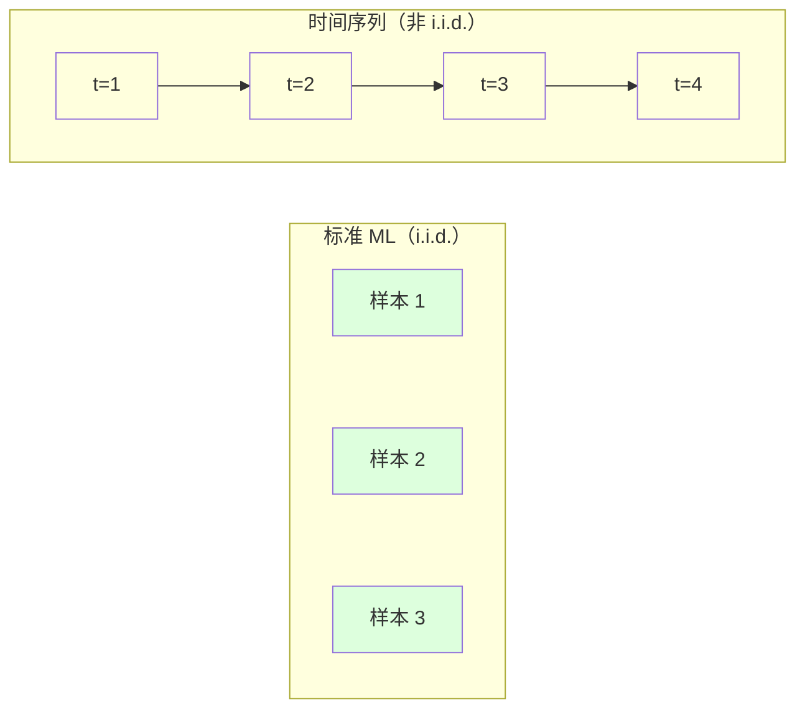
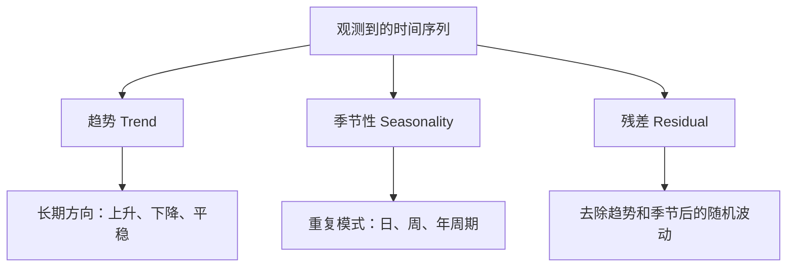
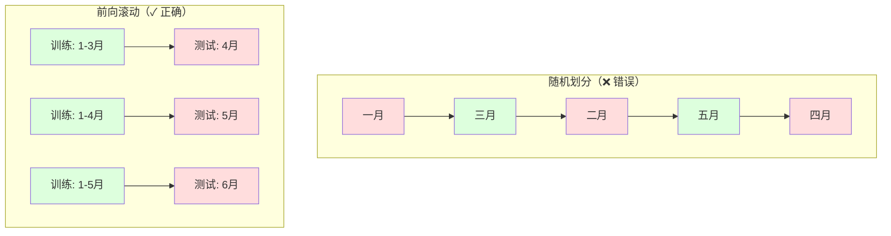

# 时间序列——数据的顺序不是装饰，是信号本身

> 随机划分训练集和测试集对时间序列来说不是方法问题，是数据泄漏。

**类型：** 实现课
**语言：** Python
**前置知识：** 第 01 阶段（数学基础）、第 02 阶段 · 09（模型评估）
**预计时间：** ~90 分钟
**所处阶段：** Tier 1
**关联课程：** 第 03 阶段（深度学习核心）—— 理解为什么 LSTM 和 Transformer 能处理序列数据；第 02 阶段 · 06（无监督学习）—— 时间序列聚类与异常检测

---

## 🎯 学习目标

完成本课后，你能够：

- [ ] 将时间序列分解为趋势、季节性和残差三个分量，并使用滚动统计量检测平稳性
- [ ] 构造滞后特征和滚动统计量，将时间序列转化为监督学习问题
- [ ] 实现前向滚动验证框架，防止未来数据泄漏到训练过程
- [ ] 从零实现指数平滑（SES、Holt 双参数）和简单自回归模型
- [ ] 使用 MASE 和 sMAPE 评估预测性能，并与朴素基线对比

---

## 1. 问题

你有一组按时间排序的数据——每日订单量、每小时气温、每分钟 CPU 使用率、每周股价。你想预测下一个值、下一周、下一季度。

你拿出标准的机器学习工具箱：随机训练/测试划分、K 折交叉验证、特征矩阵输入、预测输出。每一步都是错的。

时间序列打破了标准机器学习依赖的假设。样本不是独立的——今天的温度依赖于昨天的。随机划分会把未来信息泄漏到过去。在回测中表现优秀的特征，到了生产环境却一塌糊涂，因为它们依赖的规律随时间发生了漂移。

一个模型用随机交叉验证能达到 95% 的准确率，但用正确的时间评估可能只有 55%。这之间的差距不是技术细节，是模型在纸上好用和真正能用的区别。

本课涵盖时间序列预测的基础：时间数据的独特之处、如何诚实地评估模型、以及如何把时间序列转化为标准 ML 模型可以消费的特征。

---

## 2. 核心概念

### 2.1 时间序列的特殊性

标准机器学习假设 **独立同分布（i.i.d.）**——每个样本从同一分布中独立抽取。时间序列同时违反了这两个假设：

- **不独立。** 今天的股价依赖昨天的。本周的销量与上周相关。
- **不同分布。** 分布随时间漂移。12 月的销量和 3 月的完全不同。

这些违反不是细枝末节，它们改变了你构造特征、评估模型、选择算法的每一个环节。



在标准 ML 中，样本可以互换，打乱它们不改变任何东西。在时间序列中，顺序就是一切。打乱顺序等于销毁信号。

### 2.2 时间序列的组成

每个时间序列都可以分解为三个分量：



- **趋势：** 长期方向。年收入增长 10%。全球气温持续上升。
- **季节性：** 固定间隔的重复模式。零售业 12 月冲刺。空调使用 7 月达峰。
- **残差：** 去除趋势和季节性后剩下的部分。如果残差接近白噪声，说明分解已经捕获了信号。

### 2.3 平稳性

一个时间序列是**平稳的**，如果它的统计特性（均值、方差、自相关结构）不随时间变化。大多数预测方法假设平稳性。

**为什么重要：** 非平稳序列的均值会漂移。用 1 月数据训练的模型学到的均值，在 2 月面前会系统性地出错。

**如何检查：** 计算滚动均值和滚动标准差。如果它们明显漂移，序列就是非平稳的。

**如何修复：** 差分。不对原始值建模，而是对相邻值的变化建模：

```
diff[t] = value[t] - value[t-1]
```

一次差分不够就做二次差分。现实中的序列最多只需要二阶差分。

**示例：**

原始序列：   [100, 102, 106, 112, 120]
一阶差分：   [2, 4, 6, 8]（仍在上升）
二阶差分：   [2, 2, 2]（常数 —— 平稳）

原始序列有二次趋势。一阶差分把它变成线性趋势。二阶差分使其平坦。实际中很少需要超过两阶。

**形式化检验：** 增强迪基-富勒检验（ADF）是平稳性的标准统计检验。零假设是"序列非平稳"，p 值低于 0.05 意味着可以拒绝零假设，认为序列平稳。ADF 检验需要渐近分布表，我们在代码中用滚动统计量做实用的可视化检查。

### 2.4 自相关函数

**自相关（ACF）** 度量时刻 t 的值与时刻 t-k 的值之间的相关性。ACF 图展示每个滞后阶数 k 对应的相关系数。

**ACF 告诉你：**
- 序列的记忆有多远。如果 ACF 在滞后 5 后降到 0，超过 5 步的历史值与当前值无关。
- 季节性是否存在。如果月度数据的 ACF 在滞后 12 处突增，说明有年度季节性。
- 应构造多少滞后特征。使用到 ACF 变得可忽略的阶数。

**偏自相关（PACF）** 去除间接相关性。如果今天与三天前的相关性完全来自昨天的桥接，PACF 在滞后 3 处为 0，而 ACF 不是。

### 2.5 滞后特征：时间序列 → 监督学习

标准 ML 模型需要特征矩阵 X 和标签 y。时间序列只有一列值。桥梁就是滞后特征。

取序列 [10, 12, 14, 13, 15]，构造滞后 1 和滞后 2 特征：

| 滞后 2 | 滞后 1 | 标签 |
|--------|--------|------|
| 10     | 12     | 14   |
| 12     | 14     | 13   |
| 14     | 13     | 15   |

现在有了一个标准的回归问题。任何 ML 模型（线性回归、随机森林、梯度提升）都可以从滞后值预测标签。

**可以额外构造的特征：**
- **滚动统计量：** 过去 k 个值的均值、标准差、最小值、最大值
- **日历特征：** 星期几、月份、是否节假日、是否周末
- **差分值：** 与上一时刻的变化量
- **扩展统计量：** 累计均值、累计计数
- **比率特征：** 当前值 / 滚动均值（偏离近期平均的程度）

**标签对齐陷阱。** 构造滞后特征时，标签必须是时刻 t 的值，所有特征必须使用时刻 t-1 或更早的值。如果不小心把时刻 t 的值包含在特征中，你就有了一个"完美预测器"——和一个完全无用的模型。这是时间序列特征工程中最常见的错误。

### 2.6 前向滚动验证

本课最重要的概念。标准 K 折交叉验证随机分配样本到训练和测试。对时间序列来说，这会泄漏未来信息。



前向滚动验证的步骤：
1. 用截至时刻 t 的数据训练
2. 预测时刻 t+1（或 t+1 到 t+k，多步预测）
3. 将窗口向前滑动
4. 重复

每个测试折只包含在所有训练数据之后的数据。没有未来泄漏。这给出了模型部署后性能的诚实估计。

**扩展窗口：** 使用所有历史数据做训练（窗口逐渐增长）。适用于你相信旧数据仍然相关的场景。

**滑动窗口：** 使用固定大小的训练窗口（窗口滑动）。适用于世界在变化、旧数据反而有害的场景。

### 2.7 指数平滑

指数平滑是一类通过加权平均进行预测的方法，近期观测值的权重更高。

**简单指数平滑（SES）：** 适用于无趋势、无季节性的序列。

$$s_t = \alpha \cdot y_t + (1 - \alpha) \cdot s_{t-1}$$

其中 $\alpha$（0-1）是平滑参数。$\alpha$ 越大，模型越关注近期；$\alpha$ 越小，模型越平滑。

**Holt 双指数平滑：** 在 SES 基础上增加趋势分量，适用于有趋势但无季节性的序列。维护水平（level）和趋势（trend）两个状态。

$$l_t = \alpha \cdot y_t + (1 - \alpha) \cdot (l_{t-1} + b_{t-1})$$
$$b_t = \beta \cdot (l_t - l_{t-1}) + (1 - \beta) \cdot b_{t-1}$$

### 2.8 ARIMA 直觉

ARIMA 是经典的时间序列模型，由三个组件构成：

- **AR（自回归）：** 用过去值预测。AR(p) 使用最近 p 个值。
- **I（差分）：** 通过差分实现平稳性。I(d) 做 d 阶差分。
- **MA（移动平均）：** 用过去预测误差预测。MA(q) 使用最近 q 个误差。

ARIMA(p, d, q) 组合三者。通过 ACF/PACF 分析或自动搜索（auto-ARIMA）选择 p、d、q。

ARIMA 需要数值优化求解，本课不从零实现。核心目标是理解每个组件的作用、能解读 ARIMA 结果、知道什么时候该用它。

### 2.9 预测评估指标

| 指标 | 公式含义 | 适用场景 | 局限 |
|------|---------|---------|------|
| MAE | 绝对误差的平均 | 原始单位可解释 | 不区分误差方向 |
| RMSE | 均方根误差 | 大误差惩罚更重 | 量纲与原数据相同 |
| MAPE | 百分比误差平均 | 跨量级比较 | 真实值接近 0 时无定义 |
| sMAPE | 对称百分比误差 | 解决了 MAPE 在 0 附近发散 | 仍有偏差，但更稳健 |
| MASE | 相对朴素基线的误差 | 跨序列比较，< 1 表示优于基线 | 需要定义朴素策略 |

**MASE（平均绝对标度误差）** 是最重要的预测评估指标之一。

$$\text{MASE} = \frac{\text{MAE}_{\text{model}}}{\text{MAE}_{\text{naive}}}$$

MASE < 1 表示模型优于朴素基线。它解决了 MAE / RMSE 无法跨序列比较的问题——因为它是无量纲的。

**sMAPE（对称 MAPE）** 解决了 MAPE 的两个问题：分母用 (|预测| + |真实|) / 2，在真实值或预测值为 0 时不会无穷大；同时对称处理预测值和真实值。

$$\text{sMAPE} = \frac{2 \times |\hat{y} - y|}{|\hat{y}| + |y|} \times 100\%$$

### 2.10 方法选择指南

| 方法 | 最佳场景 | 处理季节性 | 支持外部特征 |
|------|---------|-----------|------------|
| 滞后特征 + ML | 有外部特征的表格数据 | 通过日历特征 | 是 |
| ARIMA | 单变量、短期预测 | SARIMA 变体 | 否（ARIMAX 有限） |
| 指数平滑 | 简单趋势 + 季节性 | 支持（Holt-Winters） | 否 |
| Prophet | 业务预测、节假日效应 | 支持（傅里叶级数） | 有限 |
| LSTM / Transformer | 长序列、多序列 | 自动学习 | 是 |

对于大多数实际场景，滞后特征 + 梯度提升是最强的起点。它自然处理外部特征，不要求平稳性，容易调试。

---

## 3. 从零实现

本节用 NumPy 从零实现核心算法。完整代码位于 `code/main.py`。

### 第 1 步：差分与平稳性检查

```python
def difference(series, order=1):
    """差分操作：用相邻值的差替换原始值。"""
    result = series.copy()
    for _ in range(order):
        result = result[1:] - result[:-1]
    return result


def check_stationarity(series, window=50):
    """通过滚动统计量和前后半段对比检查平稳性。"""
    n = len(series)
    rolling_mean = np.zeros(n)
    rolling_std = np.zeros(n)

    for i in range(n):
        start = max(0, i - window + 1)
        segment = series[start:i + 1]
        rolling_mean[i] = segment.mean()
        rolling_std[i] = segment.std() if len(segment) > 1 else 0.0

    first_half_mean = series[:n // 2].mean()
    second_half_mean = series[n // 2:].mean()
    first_half_var = series[:n // 2].var()
    second_half_var = series[n // 2:].var()

    mean_shift = abs(first_half_mean - second_half_mean)
    var_ratio = max(first_half_var, second_half_var) / max(min(first_half_var, 1e-10))

    is_stationary = mean_shift < 0.5 * series.std() and var_ratio < 2.0
    return rolling_mean, rolling_std, is_stationary
```

核心直觉：如果滚动均值漂移或滚动标准差变化，序列就是非平稳的。做差分后重新检查。

### 第 2 步：自相关函数

```python
def autocorrelation(series, max_lag=20):
    """计算自相关函数 ACF。"""
    n = len(series)
    mean = series.mean()
    var = series.var()
    acf = np.zeros(max_lag + 1)

    for k in range(max_lag + 1):
        if k >= n:
            break
        cov = np.mean((series[:n - k] - mean) * (series[k:] - mean))
        acf[k] = cov / var if var > 0 else 0.0

    return acf
```

ACF 决定你应该用多少滞后阶数。在峰值处保留滞后特征，在 ACF 降到阈值以下的阶数处截断。

### 第 3 步：时间序列分解

```python
def decompose_series(series, period):
    """将序列分解为趋势、季节性和残差。"""
    n = len(series)

    # 趋势：周期长度的中心移动平均
    trend = np.zeros(n)
    half = period // 2
    for i in range(n):
        start, end = max(0, i - half), min(n, i + half + 1)
        trend[i] = series[start:end].mean()

    # 季节性：每个周期位置的平均值
    detrended = series - trend
    seasonal_means = np.zeros(period)
    for p in range(period):
        indices = list(range(p, n, period))
        if indices:
            seasonal_means[p] = np.mean(detrended[indices])
    seasonal_means -= seasonal_means.mean()
    seasonal = np.array([seasonal_means[i % period] for i in range(n)])

    # 残差
    residual = series - trend - seasonal
    return trend, seasonal, residual
```

### 第 4 步：滞后特征与 AR 模型

```python
def make_lag_features(series, n_lags):
    """将一维序列转为监督学习特征矩阵。"""
    n = len(series)
    X = np.full((n, n_lags), np.nan)
    for lag in range(1, n_lags + 1):
        X[lag:, lag - 1] = series[:-lag]
    valid = ~np.isnan(X).any(axis=1)
    return X[valid], series[valid]


class SimpleAR:
    """AR(p) 模型：对滞后特征做线性回归。"""
    def __init__(self, n_lags=5):
        self.n_lags = n_lags
        self.weights = None
        self.bias = None

    def fit(self, X, y):
        X_b = np.column_stack([np.ones(len(X)), X])
        theta = np.linalg.lstsq(X_b, y, rcond=None)[0]
        self.bias = theta[0]
        self.weights = theta[1:]
        return self

    def predict(self, X):
        return X @ self.weights + self.bias

    def forecast(self, last_values, n_steps):
        """递归多步预测，每一步的预测作为下一步的输入。"""
        history = list(last_values[-self.n_lags:])
        predictions = []
        for _ in range(n_steps):
            features = np.array(history[-self.n_lags:]).reshape(1, -1)
            pred = self.predict(features)[0]
            predictions.append(pred)
            history.append(pred)
        return np.array(predictions)
```

AR 模型在概念上等价于线性回归，区别仅在于特征是自身的滞后版本。

### 第 5 步：指数平滑

```python
class SimpleExponentialSmoothing:
    """简单指数平滑 —— 无趋势无季节性的水平预测。"""
    def __init__(self, alpha=0.3):
        self.alpha = alpha
        self.level = None

    def fit(self, series):
        n = len(series)
        self.level = np.zeros(n + 1)
        self.level[0] = series[0]
        for t in range(n):
            self.level[t + 1] = (
                self.alpha * series[t]
                + (1 - self.alpha) * self.level[t]
            )
        return self

    def forecast(self, n_steps):
        return np.full(n_steps, self.level[-1])


class HoltWintersSmoothing:
    """Holt 双指数平滑 —— 带趋势的线性外推。"""
    def __init__(self, alpha=0.3, beta=0.1):
        self.alpha = alpha
        self.beta = beta
        self.level = None
        self.trend = None

    def fit(self, series):
        n = len(series)
        self.level = np.zeros(n + 1)
        self.trend = np.zeros(n + 1)
        self.level[0] = series[0]
        self.trend[0] = series[1] - series[0] if n > 1 else 0
        for t in range(n):
            self.level[t + 1] = (
                self.alpha * series[t]
                + (1 - self.alpha) * (self.level[t] + self.trend[t])
            )
            self.trend[t + 1] = (
                self.beta * (self.level[t + 1] - self.level[t])
                + (1 - self.beta) * self.trend[t]
            )
        return self

    def forecast(self, n_steps):
        last_level = self.level[-1]
        last_trend = self.trend[-1]
        return np.array([
            last_level + h * last_trend for h in range(1, n_steps + 1)
        ])
```

### 第 6 步：前向滚动验证

```python
def walk_forward_split(n_samples, n_splits=5, min_train=50):
    """生成前向滚动的训练/测试折。"""
    if n_samples <= min_train:
        return
    step = max(1, (n_samples - min_train) // n_splits)
    for i in range(n_splits):
        train_end = min_train + i * step
        test_end = min(train_end + step, n_samples)
        if train_end >= n_samples:
            break
        yield slice(0, train_end), slice(train_end, test_end)
```

每折训练数据严格在测试数据之前。没有未来泄漏。

### 第 7 步：评估指标

```python
def mase(y_true, y_pred, y_train, seasonal_period=1):
    """平均绝对标度误差 —— 与朴素基线对比。"""
    model_mae = mae(y_true, y_pred)
    naive_errors = np.abs(
        y_train[seasonal_period:] - y_train[:-seasonal_period]
    )
    naive_mae = np.mean(naive_errors)
    return model_mae / naive_mae if naive_mae > 0 else float("inf")


def smape(y_true, y_pred):
    """对称 MAPE —— 解决 MAPE 在真实值接近 0 时发散的问题。"""
    denominator = np.abs(y_true) + np.abs(y_pred)
    mask = denominator > 0
    values = 2 * np.abs(y_true[mask] - y_pred[mask]) / denominator[mask]
    return np.mean(values) * 100
```

---

## 4. 工业工具

### 4.1 scikit-learn — 时间序列专用工具

```python
from sklearn.linear_model import Ridge
from sklearn.ensemble import GradientBoostingRegressor
from sklearn.model_selection import TimeSeriesSplit

# TimeSeriesSplit 等价于我们手写的 walk_forward_split
tscv = TimeSeriesSplit(n_splits=5)

for train_idx, test_idx in tscv.split(X):
    X_train, X_test = X[train_idx], X[test_idx]
    y_train, y_test = y[train_idx], y[test_idx]

    model = GradientBoostingRegressor(n_estimators=100, max_depth=3)
    model.fit(X_train, y_train)
    predictions = model.predict(X_test)
```

### 4.2 statsmodels — ARIMA 实现

```python
from statsmodels.tsa.arima.model import ARIMA

model = ARIMA(train_series, order=(5, 1, 2))
fitted = model.fit()
forecast = fitted.forecast(steps=30)

# 查看模型诊断
fitted.summary()
```

### 4.3 Prophet — Facebook 的自动化预测工具

```python
from prophet import Prophet
import pandas as pd

df = pd.DataFrame({
    "ds": pd.date_range("2023-01-01", periods=len(series), freq="D"),
    "y": series
})

model = Prophet(
    daily_seasonality=False,
    weekly_seasonality=True,
    yearly_seasonality=True,
)
model.fit(df)

future = model.make_future_dataframe(periods=30, freq="D")
forecast = model.predict(future)
```

Prophet 特别适合业务预测场景，自动处理节假日、周季节性和年季节性。

### 4.4 方法对比

| 实现方式 | 速度 | 灵活性 | 适用场景 |
|---------|------|--------|---------|
| 我们的 NumPy 版 | 慢 | 高（可定制） | 学习理解 |
| scikit-learn | 快 | 高 | 实验 / 生产 |
| statsmodels ARIMA | 快 | 中 | 统计建模 / 研究 |
| Prophet | 中 | 低（自动） | 业务预测 / 快速基线 |
| LightGBM + 滞后特征 | 快 | 高 | 有外部特征的生产场景 |

---

## 5. 知识连线

本课学习的滞后特征和前向滚动验证方法，是后续多门课程的直接基础：

- **第 03 阶段（深度学习核心）：** 你将学习 LSTM 和 GRU——它们本质上是能自动学习"用什么滞后"的序列模型，不需要手动构造滞后特征
- **第 07 阶段（Transformer 深入）：** Transformer 用自注意力替代了滞后特征，让模型自己决定关注多远的历史。前向滚动验证的思想在评估语言模型时同样适用
- **第 11 阶段（LLM 工程）：** 大语言模型中的 KV 缓存机制——每次只处理新词元而不重新计算完整序列——本质上是一种工程化的"滞后窗口"设计

---

## 6. 工程最佳实践

### 6.1 工业界常用方案

| 场景 | 推荐方案 | 备注 |
|------|---------|------|
| 学习 / 实验 | 滞后特征 + LightGBM | 快速迭代，可解释性好 |
| 统计建模 | SARIMA + auto-ARIMA | 自动选参，适合单变量 |
| 业务预测 | Prophet | 自动处理节假日和季节性 |
| 生产级预测 | LightGBM / XGBoost + 特征工程 | 支持外部特征，部署简单 |
| 多序列联合预测 | DeepAR / Temporal Fusion Transformer | 跨序列共享参数 |

### 6.2 中文场景特别建议

- 国内节假日（春节、国庆、双十一）对电商、零售、物流的影响巨大。使用 Prophet 时，需要自定义节假日表，不能依赖默认的西方日历
- 处理中文电商评论量的时间序列时，注意"618"和"双11"前的预热期效应——节日前 N 天就开始上升，不只节日当天
- 股市类序列注意处理停牌日——停牌日没有交易数据，直接删除会导致日期不连续，需要填充或标记
- 日报和周报的混频数据在工程上很常见，统一为日级（周报值向后填充 7 天）再做建模通常最方便

### 6.3 踩坑经验

- 构造滞后特征时不小心包含了当前时刻的值——这是最隐蔽的错误，模型在训练集上能做到 100% 准确，但在新数据上彻底失效
- 用目标列的滚动均值做特征但没有排除当前时刻——效果同上，信息泄漏
- 评估时用了随机划分，导致报告出的准确率是虚高。上线后发现预测结果还不如直接复制昨天的值
- 忽略了一个事实：生产环境中新数据是逐步到来的，但某些特征（如月度指标）可能无法实时更新
- 没有检查平稳性就直接上 ARIMA。非平稳序列会让 ARIMA 的参数估计不可靠

---

## 7. 常见错误

### 错误 1：用随机划分替代时间顺序划分

**现象：** 模型在验证集上 MAE = 2.3，但上线后 MAE = 15.7。

**原因：** 随机划分让模型在训练时"看到"了未来的数据特征。例如，某天的滚动均值特征实际上包含了未来几天的信息。

```python
# ❌ 错误：随机划分
from sklearn.model_selection import train_test_split
X_train, X_test, y_train, y_test = train_test_split(X, y, test_size=0.2)

# ✓ 正确：时间顺序划分
split_point = int(len(X) * 0.8)
X_train, X_test = X[:split_point], X[split_point:]
y_train, y_test = y[:split_point], y[split_point:]
```

### 错误 2：特征包含了未来信息

**现象：** 训练集 R² = 0.999，但新数据上 R² 为负。

**原因：** 滚动均值窗口是对称的（包含了当前时刻和之后的值），或者标签错位了一行。

```python
# ❌ 错误：滚动均值包含当前时刻
rolling_mean = series.rolling(window=7, center=True).mean()

# ✓ 正确：只使用过去的信息（左对齐）
rolling_mean = series.rolling(window=7).mean()
```

### 错误 3：MAPE 在真实值接近 0 时使用

**现象：** MAPE 报告为 3400% 或无穷大。

**原因：** MAPE = |误差 / 真实值| × 100%。当真实值接近 0 时，分母趋近于 0，指标发散。

```python
# ❌ 错误：对含零序列使用 MAPE
# 如果 series 中有 0 值，MAPE 爆炸

# ✓ 正确：换用 sMAPE 或 MAE
smape_value = smape(y_true, y_pred)  # 分母是 |预测| + |真实|，不会无穷大
mae_value = mae(y_true, y_pred)      # 绝对误差，不受零值影响
```

### 错误 4：未建立基线就开始优化复杂模型

**现象：** 花了一周调优的 LSTM，预测效果不如"复制昨天的值"。

**原因：** 在开始任何建模之前，必须先建立朴素基线。如果复杂模型不能显著优于"用周期前的值预测"的朴素策略，说明你还没找到真正的信号。

```python
# ✓ 正确：先建立基线
naive_pred = seasonal_naive_forecast(train, n_steps, period=7)
naive_mae = mae(test, naive_pred)
print(f"朴素基线 MAE: {naive_mae:.4f}")

# 再对比模型
model_mae = mae(test, model_pred)
print(f"模型 MAE: {model_mae:.4f}")
print(f"MASE: {model_mae / naive_mae:.4f}")  # 必须 < 1
```

### 错误 5：差分后忘记还原预测值

**现象：** 预测值在 -5 到 5 之间波动，但实际序列在 100 到 200 之间。

**原因：** 对序列做了差分建模和预测，但输出的是差分值，而不是原始值。

```python
# ❌ 错误：直接报告差分值
diff_pred = model.predict(X_test)  # 这是差分值！

# ✓ 正确：把差分值累积回原始尺度
last_original_value = train[-1]
predictions = last_original_value + np.cumsum(diff_pred)
```

---

## 8. 面试考点

### Q1：为什么时间序列不能使用随机训练/测试划分？请用具体例子说明。（难度：⭐⭐）

**参考答案：**
随机划分会让未来的数据点落入训练集，过去的数据点落入测试集。例如，用第 1-100 天的数据预测第 50-150 天的销量——模型在训练时已经"见过"第 120 天的信息。这会导致评估结果虚假乐观。正确做法是按时间顺序划分：用 1-100 天训练，101-120 天测试。更严格的做法使用前向滚动验证，逐步扩展训练窗口。

### Q2：什么是平稳性？为什么它对时间序列建模如此重要？（难度：⭐⭐）

**参考答案：**
平稳性指时间序列的统计特性（均值、方差、自相关）不随时间变化。重要性在于：大多数时间序列模型假设数据来自固定分布。如果均值随漂移（如持续增长趋势），模型学到的参数会随时间失效——用过去数据学到的均值无法描述未来。非平稳序列通常通过差分去除趋势，使序列满足平稳性假设。

### Q3：解释滞后特征在时间序列预测中的作用。如何确定需要多少滞后阶数？（难度：⭐⭐）

**参考答案：**
滞后特征将时间序列转化为监督学习问题——用 y[t-1], y[t-2], ... 作为输入预测 y[t]。确定滞后阶数的方法：(1) 看 ACF 图，保留 ACF 显著的滞后阶；(2) 有明显季节性的序列，加入周期对应的滞后（如周季节性加滞后 7、14）；(3) 从较小阶数开始逐步增加，用验证集性能判断何时开始过拟合。

### Q4：手写 MASE 的计算公式。为什么它比 MAE 更适合跨序列比较？（难度：⭐⭐⭐）

**参考答案：**
MASE = MAE_model / MAE_naive，其中 MAE_naive 是用朴素策略（通常是用季节滞后值）预测的平均绝对误差。MASE 的优势在于它是无量纲的——MAE 的值依赖序列的量级（万元 vs 元级的量纲差异），而 MASE 是相对值，可以在不同量级、不同领域的序列间公平比较。MASE < 1 表示模型优于朴素基线。

### Q5：在电商大促场景中，你会如何设计时间序列预测的特征和评估方案？（难度：⭐⭐⭐）

**参考答案：**
特征设计：(1) 滞后特征（过去 1-7 天销量）；(2) 日历特征（是否大促、距离大促的天数、星期几）；(3) 滚动统计量（过去 7 天均值、标准差）；(4) 促销力度特征（折扣比例、广告投放量）。评估方案：(1) 必须用前向滚动验证；(2) 测试集必须包含至少一个完整的大促周期；(3) 使用 MASE 或 sMAPE 作为核心指标；(4) 与季节性朴素基线对比，确保 MASE < 1。

---

## 🔑 关键术语

| 术语 | 人们怎么说 | 实际含义 |
|------|-----------|---------|
| 平稳性 (Stationarity) | "统计量不随时间变" | 序列的均值、方差和自相关结构在时间上恒定不变 |
| 差分 (Differencing) | "相邻值相减" | 计算 y[t] - y[t-1] 去除趋势使序列平稳 |
| 自相关 (ACF) | "序列和自己的相关性" | 时刻 t 与时刻 t-k 的值之间的相关系数，随 k 变化的函数 |
| 偏自相关 (PACF) | "去除间接影响后的直接相关性" | 去除短阶滞后影响后，特定阶数的纯自相关 |
| 滞后特征 (Lag Features) | "用过去值做输入" | 将 y[t-1], y[t-2], ..., y[t-k] 作为预测 y[t] 的特征 |
| 前向滚动验证 (Walk-forward Validation) | "时间感知的交叉验证" | 训练数据始终在测试数据之前的时间序列评估方法 |
| ARIMA | "经典时间序列模型" | 自回归综合移动平均：结合过去值（AR）、差分（I）、过去误差（MA） |
| 指数平滑 | "加权平均预测" | 近期观测值权重更高的加权平均预测方法 |
| 季节性 (Seasonality) | "日历重复的模式" | 与日历周期（日、周、年）绑定的规律性波动 |
| 趋势 (Trend) | "长期的方向" | 序列水平随时间持续上升或下降的长期分量 |
| MASE | "比朴素基线好多少" | 模型 MAE 与朴素策略 MAE 的比值，< 1 表示优于基线 |

---

## 📚 小结

时间序列预测的核心挑战在于数据的顺序不可打破——随机划分会泄漏未来信息，让模型得到虚假的高性能。你从零实现了滞后特征构造、前向滚动验证、指数平滑和 AR 模型，掌握了用 MASE 和 sMAPE 诚实评估预测效果的方法，并理解了时间序列分解与平稳性检测的原理。

下一课我们将进入偏差-方差权衡——理解为什么有些模型在训练集上大放异彩，面对新数据时却一败涂地。

---

## ✏️ 练习

1. 【理解】用自己的话解释"平稳性"的概念，举一个现实生活中平稳序列和非平稳序列的例子。为什么对非平稳序列直接建模会导致预测偏差？

2. 【实现】修改 `SimpleAR` 模型，增加滚动均值特征（窗口大小为 7 和 14）。在合成序列上比较加入滚动特征前后的 MASE。

3. 【实验】生成一个带线性趋势的合成序列。检查平稳性后做一阶差分，再次检查。尝试二阶差分，观察变化。总结差分阶数与趋势多项式次数的关系。

4. 【对比】取一段 500 个点的合成序列，分别用随机划分（80/20）和前向滚动验证（5 折）评估 AR 模型。记录两者的 MSE 差距，解释为什么随机划分会给过于乐观的评估。

5. 【思考】在电商促销预测场景下，Prophet 和 LightGBM + 滞后特征各有什么优劣？你会如何选择？

---

## 🚀 产出

本课产出以下可复用内容：

| 产出 | 文件 | 说明 |
|------|------|------|
| 时间序列分析工具集 | `code/main.py` | 从零实现差分、平稳性检查、ACF、分解、AR 模型、指数平滑、评估指标 |
| 时间序列问题分析提示词 | `outputs/prompt-time-series-advisor.md` | 将时间序列预测问题结构化，推荐建模方法 |

---

## 📖 参考资料

1. [书籍] Hyndman, Athanasopoulos. 《Forecasting: Principles and Practice (3rd ed.)》. OTexts, 2018. https://otexts.com/fpp3/
2. [论文] Makridakis et al. "The M4 Competition: 100,000 time series and 61 forecasting methods". International Journal of Forecasting, 2020. https://doi.org/10.1016/j.ijforecast.2019.04.014
3. [论文] Box, Jenkins, Reinsel, Ljung. 《Time Series Analysis: Forecasting and Control (5th ed.)》. Wiley, 2016.
4. [论文] Hyndman, Khandakar. "Automatic Time Series Forecasting: The forecast Package for R". Journal of Statistical Software, 2008.
5. [官方文档] scikit-learn TimeSeriesSplit: https://scikit-learn.org/stable/modules/generated/sklearn.model_selection.TimeSeriesSplit.html
6. [官方文档] statsmodels ARIMA: https://www.statsmodels.org/stable/generated/statsmodels.tsa.arima.model.ARIMA.html
7. [GitHub] Facebook Prophet: https://github.com/facebook/prophet

---

> 本课程参考了 AI Engineering From Scratch（MIT License）的课程体系，在此基础上进行了重构和原创内容的扩充。所有中文表达、案例、LLM 视角分析、工程最佳实践、常见错误、面试考点等均为原创内容。
