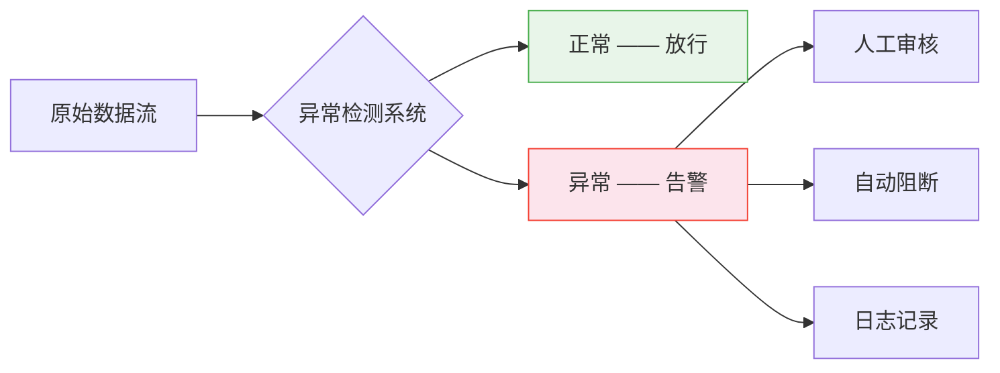

# 异常检测：在数据的海洋中找到那根刺

> 异常不是 bug，是信号。真正的失败不是漏掉了异常，而是你的系统从未想过要去找它。

**类型：** 实现课
**语言：** Python
**前置知识：** 阶段 01（数学基础）—— 概率与分布、统计量
**预计时间：** ~90 分钟
**所处阶段：** Tier 1
**关联课程：** 阶段 03（深度学习核心）—— 自编码器在异常检测中的扩展应用

---

## 🎯 学习目标

完成本课后，你能够：

- [ ] 区分点异常、上下文异常和集合异常，并为每种类型选择合适的检测方法
- [ ] 从零实现 Z-score、IQR、孤立森林和 LOF 四种异常检测算法
- [ ] 解释为什么 Z-score 在多簇数据上失效，以及孤立森林如何解决这个问题
- [ ] 使用自编码器通过重构误差检测异常，理解"仅用正常数据训练"的半监督范式
- [ ] 在真实场景中选择合适的评估指标（Precision@k、AUPRC），避免准确率陷阱

---

## 1. 问题

你的信用卡在凌晨 3 点于另一个城市被刷了 5 万元。银行的风控系统没有报警——因为单看这一笔交易，金额不算特别大，商户类型也"正常"。

问题在于：**正常的数据会淹没异常的信号**。

在大多数实际场景中，异常占比不到 0.1%。如果你把每一笔交易、每一次网络请求、每一个传感器读数都当作"正常"来处理，你会得到一个看起来完美的系统——准确率 99.9%，但它对真正的威胁视而不见。

异常检测要解决的问题不是"分类"，而是**在几乎没有异常样本的情况下，找到那些不该出现的东西**。这带来三个核心挑战：

- **异常太少**：你无法收集足够的异常样本来训练一个分类器
- **异常会进化**：欺诈手段、攻击方式、设备故障模式都在不断变化
- **异常的定义因场景而异**：同样的 CPU 使用率，在部署期间是正常的，在凌晨则是可疑的



做好这件事，你的系统能在用户发现之前检测到服务器故障、在资金损失之前拦截欺诈交易、在设备停机之前预警机械故障。做不好，你的监控面板永远一片绿色，直到灾难发生。

---

## 2. 概念

### 2.1 异常的三种形态

异常不是一个单一的概念。理解异常的类型，是选择正确检测方法的前提。

| 类型 | 定义 | 示例 |
|------|------|------|
| **点异常** | 单个数据点相对于整体分布异常 | 一笔 5 万元的转账（平时都是几十元） |
| **上下文异常** | 在特定上下文中才显得异常 | 35°C 气温在夏季正常，在冬季异常 |
| **集合异常** | 单个数据点正常，但作为序列整体异常 | 心跳节律中单个波形正常，但节律模式异常 |

### 2.2 检测方法概览

异常检测方法按"是否需要标签"和"是否假设分布"可分为四大类：

```
                    是否需要标签？
                    /            \
                无标签           有标签
                /    \            |
        参数方法    非监督方法   有监督分类
        (假设分布)   (不假设)    (需要大量标签)
          |            |
        Z-score     孤立森林
        IQR         LOF
                  自编码器
                  One-Class SVM
```

### 2.3 核心直觉：什么是"异常"？

所有异常检测方法的底层逻辑可以归结为同一个问题：**这个样本与"正常"有多远？**

不同方法对"距离"的定义不同：

- **统计方法**：偏离均值多少个标准差？
- **密度方法**：周围有多"空旷"？
- **隔离方法**：需要多少次切分才能把它单独分开？
- **重构方法**：用学到的"正常模式"重构它，误差有多大？

---

## 3. 从零实现

### 第 1 步：统计方法 —— Z-score

Z-score 是最直观的异常检测方法。它假设数据服从正态分布，计算每个点偏离均值的标准差倍数。

```python
import numpy as np

def zscore_detect(X, threshold=3.0):
    """基于 Z-score 的异常检测。"""
    mean = X.mean(axis=0)
    std = X.std(axis=0)
    std[std == 0] = 1.0  # 防止除零
    z = np.abs((X - mean) / std)
    scores = z.max(axis=1)  # 取所有特征中最大 Z-score
    labels = scores > threshold
    return labels, scores
```

**直觉理解**：在正态分布中，99.7% 的数据落在均值 ±3 标准差范围内。超过这个范围的点，理论上每 1000 个样本中只有 3 个——如果出现了，很可能是异常。

**致命局限**：Z-score 假设数据是单峰正态分布。如果数据有多个簇（比如用户的消费行为分为"日常小额"和"偶尔大额"），Z-score 会把两个簇之间的正常点误判为异常。

### 第 2 步：统计方法 —— IQR

IQR（四分位距）不假设正态分布，使用四分位数定义"正常"范围。

```python
def iqr_detect(X, factor=1.5):
    """基于四分位距的异常检测。"""
    q1 = np.percentile(X, 25, axis=0)
    q3 = np.percentile(X, 75, axis=0)
    iqr = q3 - q1
    iqr[iqr == 0] = 1.0
    lower = q1 - factor * iqr
    upper = q3 + factor * iqr
    scores = np.maximum(-np.minimum((X - lower) / iqr, 0),
                        np.maximum((X - upper) / iqr, 0)).max(axis=1)
    labels = ((X < lower) | (X > upper)).any(axis=1)
    return labels, scores
```

**与 Z-score 的区别**：IQR 基于数据的实际分位数，不假设任何分布形状。对偏斜分布更鲁棒，但仍然无法处理多变量联合异常。

### 第 3 步：孤立森林

孤立森林（Isolation Forest）的核心洞察是：**异常点是"少且不同"的，因此更容易被孤立**。

```python
class IsolationTree:
    """单棵孤立树：随机切分，异常点更快到达叶子。"""

    def __init__(self, max_depth=10, rng=None):
        self.max_depth = max_depth
        self.rng = rng or np.random.RandomState()
        self.is_leaf = False
        self.size = 0
        self.feature = None
        self.threshold = None
        self.left = None
        self.right = None

    def fit(self, X, depth=0):
        n, p = X.shape
        if depth >= self.max_depth or n <= 1:
            self.is_leaf = True
            self.size = n
            return self

        # 随机选特征，随机选切分值
        self.feature = self.rng.randint(p)
        x_col = X[:, self.feature]
        x_min, x_max = x_col.min(), x_col.max()
        if x_min == x_max:
            self.is_leaf = True
            self.size = n
            return self

        self.threshold = self.rng.uniform(x_min, x_max)
        left_mask = x_col < self.threshold
        self.left = IsolationTree(self.max_depth, self.rng)
        self.left.fit(X[left_mask], depth + 1)
        self.right = IsolationTree(self.max_depth, self.rng)
        self.right.fit(X[~left_mask], depth + 1)
        return self

    def path_length(self, x, depth=0):
        if self.is_leaf:
            return depth + _c_factor(self.size)
        if x[self.feature] < self.threshold:
            return self.left.path_length(x, depth + 1)
        return self.right.path_length(x, depth + 1)
```

**为什么有效**：正常点聚集在密集区域，需要很多次切分才能把它们逐一孤立。异常点远离群体，几次随机切分就能把它们"切"出去。路径越短 = 越异常。

### 第 4 步：局部异常因子（LOF）

LOF 的核心思想是：**比较一个点的局部密度与其邻居的局部密度**。

```python
def lof_detect(X, k=20, threshold=1.5):
    """基于局部异常因子的异常检测。"""
    n = X.shape[0]
    # 计算所有样本对之间的距离
    dist_matrix = np.sqrt(((X[:, None] - X[None, :]) ** 2).sum(axis=2))

    # 找到 k 近邻
    neighbor_idx = np.argsort(dist_matrix, axis=1)[:, 1:k + 1]
    k_distances = np.partition(dist_matrix, k + 1, axis=1)[:, k + 1]

    # 计算局部可达密度
    lrd = np.zeros(n)
    for i in range(n):
        reach_dists = np.maximum(k_distances[neighbor_idx[i]],
                                 dist_matrix[i, neighbor_idx[i]])
        lrd[i] = 1.0 / (reach_dists.mean() + 1e-10)

    # LOF = 邻居平均密度 / 自身密度
    lof_scores = np.zeros(n)
    for i in range(n):
        lof_scores[i] = lrd[neighbor_idx[i]].mean() / (lrd[i] + 1e-10)

    return lof_scores > threshold, lof_scores
```

**LOF 的优势**：当数据包含多个不同密度的簇时，LOF 能正确处理。一个点在稀疏簇中可能是正常的（LOF ≈ 1），但在密集簇中可能是异常的（LOF >> 1）。

### 第 5 步：自编码器

自编码器通过"压缩-重构"学习正常数据的模式。异常数据因为不符合学到的模式，重构误差会显著增大。

```python
class SimpleAutoencoder:
    """全连接自编码器，用于异常检测。"""

    def __init__(self, input_dim, hidden_dim=8, lr=0.01, seed=42):
        rng = np.random.RandomState(seed)
        # Xavier 初始化
        self.W1 = rng.randn(input_dim, hidden_dim) * np.sqrt(2.0 / (input_dim + hidden_dim))
        self.b1 = np.zeros(hidden_dim)
        self.W2 = rng.randn(hidden_dim, input_dim) * np.sqrt(2.0 / (hidden_dim + input_dim))
        self.b2 = np.zeros(input_dim)
        self.lr = lr

    def encode(self, X):
        return np.maximum(0, X @ self.W1 + self.b1)  # ReLU

    def decode(self, H):
        return H @ self.W2 + self.b2

    def reconstruction_error(self, X):
        """重构误差作为异常分数。"""
        H = self.encode(X)
        X_hat = self.decode(H)
        return np.mean((X - X_hat) ** 2, axis=1)
```

**关键设计**：自编码器**仅用正常数据训练**。正常数据的重构误差小，异常数据的重构误差大。这是一种半监督范式——不需要异常标签，但需要保证训练数据是"干净"的。

### 第 6 步：运行与对比

```python
# 生成数据
X, y_true = make_anomaly_data(n_normal=500, n_anomaly=25, seed=42)

# 方法 1：Z-score
z_pred, z_scores = zscore_detect(X, threshold=3.0)

# 方法 2：IQR
iqr_pred, iqr_scores = iqr_detect(X, factor=1.5)

# 方法 3：孤立森林
iso = IsolationForest(n_estimators=100, max_samples=256, seed=42)
iso.fit(X)
iso_scores = iso.anomaly_score(X)

# 方法 4：LOF
lof_pred, lof_scores = lof_detect(X, k=20, threshold=1.5)

# 方法 5：自编码器（仅用正常数据训练）
ae = SimpleAutoencoder(input_dim=5, hidden_dim=8)
ae.train(X[y_true == 0], epochs=200)
ae_scores = ae.reconstruction_error(X)
```

运行 `code/main.py` 可看到各方法在不同阈值下的精确率、召回率和 F1 分数对比。

---

## 4. 工业工具

### 4.1 scikit-learn 实现

```python
from sklearn.ensemble import IsolationForest
from sklearn.neighbors import LocalOutlierFactor
from sklearn.svm import OneClassSVM
from sklearn.preprocessing import StandardScaler

# 数据标准化（大多数方法对尺度敏感）
scaler = StandardScaler()
X_scaled = scaler.fit_transform(X)

# 孤立森林
iso_model = IsolationForest(
    n_estimators=200,
    contamination=0.05,  # 预期的异常比例
    random_state=42
)
iso_model.fit(X_scaled)
anomaly_labels = iso_model.predict(X_scaled)  # 1=正常, -1=异常
anomaly_scores = iso_model.decision_function(X_scaled)

# LOF
lof_model = LocalOutlierFactor(
    n_neighbors=20,
    contamination=0.05
)
lof_labels = lof_model.fit_predict(X_scaled)

# One-Class SVM
svm_model = OneClassSVM(kernel="rbf", gamma="scale", nu=0.05)
svm_model.fit(X_scaled)
svm_labels = svm_model.predict(X_scaled)
```

### 4.2 PyOD：异常检测专用库

```python
from pyod.models.knn import KNN
from pyod.models.auto_encoder import AutoEncoder
from pyod.utils.data import evaluate_print

# KNN 异常检测
knn_model = KNN(n_neighbors=20, contamination=0.05)
knn_model.fit(X_scaled)
knn_labels = knn_model.labels_       # 0=正常, 1=异常
knn_scores = knn_model.decision_scores_

# 神经网络自编码器
ae_model = AutoEncoder(
    hidden_neurons=[32, 16, 16, 32],
    epochs=100,
    batch_size=64,
    dropout_rate=0.2
)
ae_model.fit(X_train_normal)  # 仅用正常数据训练
```

### 4.3 方法选型参考

| 方法 | 速度 | 可解释性 | 多变量 | 适用场景 |
|------|------|---------|--------|---------|
| Z-score | 极快 | 高 | 单特征 | 数据质量监控、阈值告警 |
| IQR | 极快 | 高 | 单特征 | 偏斜分布、箱线图异常 |
| 孤立森林 | 快 | 低 | 是 | 高维数据、实时检测 |
| LOF | 慢 | 中 | 是 | 多密度簇、局部异常 |
| 自编码器 | 中 | 低 | 是 | 复杂模式、图像/序列 |
| One-Class SVM | 中 | 低 | 是 | 小样本、非线性边界 |

---

## 5. 知识连线

本课学习的异常检测是后续多个阶段的基础工具：

- **阶段 03（深度学习核心）**：你将学习如何用卷积自编码器和 LSTM 自编码器处理图像和序列数据的异常检测
- **阶段 08（生成式 AI）**：生成对抗网络（GAN）的判别器本质上是一个异常检测器——判断输入是真实数据还是生成数据
- **阶段 17（基础设施与生产）**：异常检测是 AIOps 的核心组件——服务器指标异常检测、日志异常检测、调用链异常检测

---

## 6. 工程最佳实践

### 6.1 工业界常用方案

| 场景 | 推荐方案 | 备注 |
|------|---------|------|
| 数据质量监控 | Z-score / IQR | 单变量、实时、可解释 |
| 服务器指标告警 | 孤立森林 + 滑动窗口 | 多变量、自适应阈值 |
| 金融欺诈检测 | 孤立森林 + 有监督集成 | 无监督发现新模式，有监督精确分类已知模式 |
| 日志异常检测 | 自编码器（LSTM） | 序列模式、上下文相关 |
| 设备故障预警 | LOF + 时间特征 | 多密度工况、上下文异常 |

### 6.2 中文场景特别建议

- 中文文本的异常检测（如垃圾评论、异常舆情）需要先分词，再使用 TF-IDF 或嵌入向量作为特征输入
- 处理中文时间数据时注意节假日效应——春节期间的消费模式与平时完全不同，需要单独建模
- 金融场景中，中文商户名称的多样性（"美团"、"大众点评"、"美团点评"）可能导致特征稀疏，建议做商户名称归一化

### 6.3 踩坑经验

- **训练数据不干净**：如果训练集中混入了异常，模型会将其学习为"正常"。使用孤立森林时设置 `contamination` 参数，或先用简单方法预过滤
- **阈值固定不变**：数据分布会随时间漂移（季节变化、业务增长）。使用滚动窗口统计量，或定期重新训练模型
- **忽略特征尺度**：Z-score 和 LOF 对特征尺度敏感。务必先做标准化（StandardScaler），否则数值大的特征会主导距离计算
- **用准确率评估**：异常占比 0.1% 时，全部预测为"正常"也能获得 99.9% 准确率。始终使用 Precision@k 或 AUPRC
- **单变量检测多变量异常**：一个用户的单笔交易金额正常、交易频率正常，但"金额 × 频率"的组合异常。多变量方法（孤立森林、LOF）能捕获这类联合异常

---

## 7. 常见错误

### 错误 1：对多簇数据使用 Z-score

**现象：** 误报率极高，大量正常点被标记为异常。

**原因：** Z-score 假设数据服从单一正态分布。当数据有多个簇时，全局均值和标准差不能反映任何一簇的真实分布，簇间点被误判为异常。

**修复：**
```python
# ❌ 错误：对多簇数据直接使用全局 Z-score
labels, scores = zscore_detect(X, threshold=3.0)

# ✓ 正确：先聚类，再在每个簇内做 Z-score
from sklearn.cluster import KMeans
kmeans = KMeans(n_clusters=3).fit(X)
for cluster_id in range(3):
    mask = kmeans.labels_ == cluster_id
    labels[mask], _ = zscore_detect(X[mask], threshold=3.0)
```

### 错误 2：在受污染数据上训练自编码器

**现象：** 自编码器对异常数据的重构误差也很小，无法区分正常和异常。

**原因：** 训练数据中混入了异常，自编码器学会了"异常也是正常的"。

**修复：**
```python
# ❌ 错误：用全部数据训练
ae.train(X_all, epochs=200)

# ✓ 正确：仅用正常数据训练（或用孤立森林预过滤）
iso = IsolationForest(contamination=0.05).fit(X_all)
normal_mask = iso.predict(X_all) == 1
ae.train(X_all[normal_mask], epochs=200)
```

### 错误 3：使用固定阈值部署到生产环境

**现象：** 上线初期效果良好，几个月后误报率逐渐升高。

**原因：** 数据分布漂移（data drift）。用户行为模式变化、业务增长、季节性因素都会改变"正常"的定义。

**修复：**
```python
# ❌ 错误：固定阈值
THRESHOLD = 0.6
anomalies = scores > THRESHOLD

# ✓ 正确：基于近期数据的动态阈值
from collections import deque
recent_scores = deque(maxlen=10000)  # 滑动窗口
# 每次有新数据时更新阈值（如 P95）
threshold = np.percentile(recent_scores, 95)
```

### 错误 4：对高维数据使用 LOF

**现象：** 训练时间极长，且检测结果接近随机。

**原因：** LOF 需要计算所有样本对之间的距离。在高维空间中，距离度量失效（维度灾难），且时间复杂度为 O(n²)。

**修复：**
```python
# ❌ 错误：对 100 维数据直接使用 LOF
lof = LocalOutlierFactor(n_neighbors=20).fit(X_high_dim)

# ✓ 正确：先降维，再用 LOF
from sklearn.decomposition import PCA
X_reduced = PCA(n_components=10).fit_transform(X_high_dim)
lof = LocalOutlierFactor(n_neighbors=20).fit(X_reduced)
```

---

## 8. 面试考点

### Q1：异常检测为什么通常被建模为无监督问题而不是分类问题？（难度：⭐⭐）

**参考答案：**
异常样本通常占比极低（<0.1%），不足以训练一个有效的分类器。更重要的是，未来的异常可能是从未见过的新类型——有监督分类器只能识别训练中出现过的模式。无监督方法通过建模"正常"数据的分布，能发现任何偏离正常模式的样本，无论其具体类型如何。

### Q2：孤立森林为什么比随机森林更适合异常检测？（难度：⭐⭐）

**参考答案：**
随机森林用于分类/回归，需要标签来指导切分，目标是最大化类别纯度。孤立森林不需要标签，使用完全随机的切分。核心洞察是：异常点因为"少且不同"，在随机切分下会更快被孤立到叶子节点（路径更短）。孤立森林不需要知道什么是异常，只需要利用异常点的"稀有性"和"差异性"这两个结构特征。

### Q3：在异常检测中为什么不能使用准确率作为评估指标？（难度：⭐⭐）

**参考答案：**
当异常占比为 0.1% 时，一个全部预测为"正常"的模型也能获得 99.9% 的准确率，但它没有检测到任何异常。在极端不平衡的场景下，准确率失去了区分能力。应使用 Precision@k（最可疑的 k 个样本中真正异常的比例）或 AUPRC（精确率-召回率曲线下面积），这些指标关注的是模型在异常样本上的表现。

### Q4：手写孤立森林的异常分数计算公式（难度：⭐⭐⭐）

**参考答案：**
$$s(x, n) = 2^{-\frac{E(h(x))}{c(n)}}$$

其中 $h(x)$ 是样本 $x$ 在树中的路径长度，$E(h(x))$ 是所有树的平均路径长度，$c(n)$ 是样本量为 $n$ 时的平均路径长度修正因子：

$$c(n) = 2H(n-1) - \frac{2(n-1)}{n}$$

$H$ 是调和数，近似为 $\ln(n-1) + 0.5772$（欧拉-马歇罗尼常数）。分数越接近 1 表示越异常，越接近 0 表示越正常。

### Q5：如何为一个电商平台的交易欺诈检测系统选择异常检测方案？（难度：⭐⭐⭐）

**参考答案：**
需要分层设计：
1. **实时层**：孤立森林处理高维特征（金额、频率、设备、IP 等），毫秒级响应
2. **近实时层**：自编码器（LSTM）分析用户行为序列，捕获上下文异常（如突然改变购买品类）
3. **离线层**：有监督分类器（XGBoost）对已知欺诈模式做精确分类
4. **反馈回路**：人工审核结果回流，持续更新有监督模型

关键权衡：无监督方法发现新模式但误报高，有监督方法精确但只能识别已知模式。两者结合才能在低误报率下保持对新欺诈的覆盖。

---

## 🔑 关键术语

| 术语 | 人们怎么说 | 实际含义 |
|------|---------|---------|
| 异常检测 | "找 bug" | 识别与预期模式显著偏离的样本——在欺诈检测、设备故障预警、网络安全中广泛应用 |
| Z-score | "偏离均值多少" | 样本偏离均值的标准差倍数——假设正态分布，对多峰数据失效 |
| IQR | "箱线图法则" | 四分位距法——基于分位数定义正常范围，不假设分布形状 |
| 孤立森林 | "随机切分找异常" | 通过随机切分孤立样本，异常点因稀少且不同而被更快孤立 |
| LOF | "密度比较" | 局部异常因子——比较样本与其邻居的局部密度，适用于多密度簇 |
| 自编码器 | "压缩再重构" | 通过压缩-重构学习正常模式，异常数据重构误差大 |
| One-Class SVM | "画一个圈" | 在特征空间中学习一个包围正常数据的边界，边界外的点视为异常 |
| Precision@k | "前 k 个准不准" | 异常分数最高的 k 个样本中，真正异常的比例——不平衡数据的核心指标 |
| 上下文异常 | "看情况才异常" | 某个值在特定上下文（时间、地点）下才显得异常，脱离上下文无法判断 |
| 数据漂移 | "数据变了" | 生产环境的数据分布随时间变化，导致模型性能逐渐退化 |

---

## 📚 小结

异常检测是在"没有异常样本"的前提下找到不该出现的东西。你从零实现了五种核心方法——Z-score 和 IQR 基于统计假设，孤立森林利用异常的"稀有性"，LOF 比较局部密度，自编码器通过重构误差发现偏离。每种方法都有其适用场景和致命局限，选择的关键在于理解数据的分布特征和异常的形态。

下一课我们将进入深度学习核心阶段，学习如何用神经网络构建更强大的模式识别系统。

---

## ✏️ 练习

1. 【理解】用自己的话解释孤立森林为什么不需要标签就能检测异常。写 200 字以内的说明，让一个没有机器学习背景的程序员也能听懂。

2. 【实现】修改 `lof_detect` 函数，使其支持 `k` 值的自适应选择——当数据密度差异较大时，对不同区域使用不同的 `k` 值。

3. 【实验】使用 `make_multimodal_data` 生成三簇数据，分别用 Z-score、IQR 和孤立森林检测异常。记录各方法的 Precision@k 和 F1，解释为什么 Z-score 在多簇数据上表现差。

4. 【思考】在金融欺诈检测中，欺诈模式会不断进化（攻击者会适应你的检测系统）。讨论无监督方法和有监督方法各自的优劣，以及如何在实际系统中平衡两者。

---

## 🚀 产出

本课产出以下可复用内容：

| 产出 | 文件 | 说明 |
|------|------|------|
| 异常检测算法实现 | `code/main.py` | 从零实现 Z-score、IQR、孤立森林、LOF、自编码器五种方法 |
| 方法选择提示词 | `outputs/prompt-anomaly-detector.md` | 根据场景特征选择正确的异常检测方案 |

---

## 📖 参考资料

1. [论文] Liu, Ting, Fan. "Isolation Forest". ICDM, 2008. https://ieeexplore.ieee.org/document/4781136
2. [论文] Breunig et al. "LOF: Identifying Density-Based Local Outliers". ACM SIGMOD, 2000. https://dl.acm.org/doi/10.1145/335191.335388
3. [论文] Schölkopf et al. "Support Vector Method for Novelty Detection". NIPS, 1999. https://proceedings.neurips.cc/paper/1999/hash/8725fb777f25776ffa9076e44fcfd776-Abstract.html
4. [官方文档] scikit-learn. "Novelty and Outlier Detection". https://scikit-learn.org/stable/modules/outlier_detection.html
5. [GitHub] PyOD. "A Python Toolbox for Scalable Outlier Detection". https://github.com/yzhao062/pyod

---

> 本课程参考了 AI Engineering From Scratch（MIT License）的课程体系，在此基础上进行了重构和原创内容的扩充。所有中文表达、案例、LLM 视角分析、工程最佳实践、常见错误、面试考点等均为原创内容。
