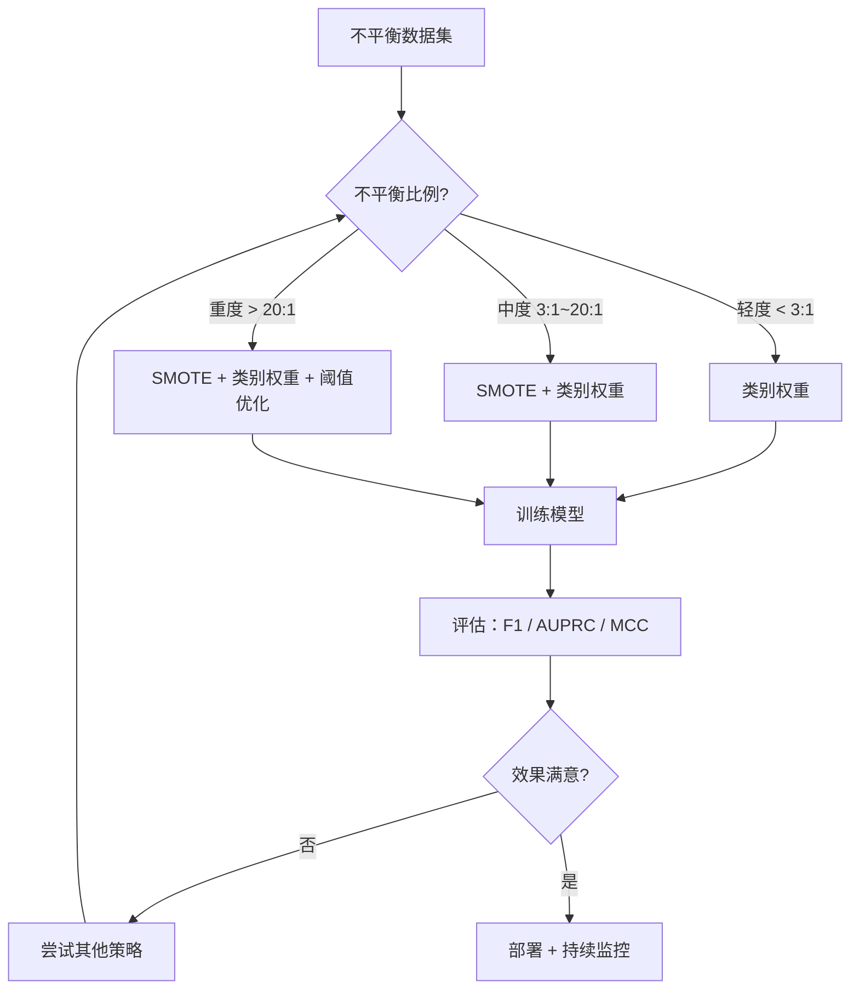

# 不平衡数据：当准确率变成一剂麻醉药

> 当 99% 的数据都是"正常"的时候，准确率不是指标，是谎言。

**类型：** 实现课
**语言：** Python
**前置知识：** 阶段 02 · 09（模型评估）—— 混淆矩阵、精确率与召回率
**预计时间：** ~90 分钟
**所处阶段：** Tier 1
**关联课程：** 阶段 02 · 16（异常检测）—— 不平衡检测的两种思路对比

---

## 🎯 学习目标

完成本课后，你能够：

- [ ] 从零实现 SMOTE 算法，理解合成过采样与随机复制的本质区别
- [ ] 使用 F1、AUPRC、MCC 评估不平衡分类器，解释为什么准确率会误导
- [ ] 比较类别权重、阈值优化和重采样三种策略，为给定不平衡比例选择合适方案
- [ ] 构建一个完整的不平衡数据处理流水线，组合多种策略获得最佳效果

---

## 1. 问题

你构建了一个信用卡欺诈检测模型。准确率 99.9%。你庆祝上线。

然后你发现：模型对每一笔交易都预测为"正常"。

这不是 bug。当数据中只有 0.1% 是欺诈时，"永远猜正常"在数学上就是最优解——它最小化了总体误差。模型学到了数据告诉它的全部真相：正常交易占绝大多数，忽略少数类不会影响准确率。

**准确率失败的原因在于它对所有正确预测一视同仁。** 正确标记一笔正常交易和正确抓住一笔欺诈交易，在准确率面前都只算 1 分。但抓住欺诈才是这个模型存在的全部意义。

这个问题在所有涉及"稀有但重要"的场景中反复出现：

| 场景 | 正类占比 | 漏检代价 |
|------|---------|---------|
| 信用卡欺诈检测 | 0.1% | 资金损失 |
| 癌症筛查 | 0.5% | 延误治疗 |
| 网络入侵检测 | 0.01% | 数据泄露 |
| 制造缺陷检测 | 0.3% | 批量召回 |
| 客户流失预测 | 5% | 收入下降 |

这些场景有一个共同特征：**你关心的恰好是少数类，但少数类恰恰是模型最不愿意关注的。**

我们需要三类工具来解决这个问题：正确的评估指标（看清真相）、数据层面的重采样（改变输入）、算法层面的代价敏感（改变优化目标）。

---

## 2. 概念

### 2.1 为什么准确率会骗人

考虑一个 1000 样本的数据集：990 个负例，10 个正例。一个"永远预测负例"的模型：

| | 预测正例 | 预测负例 |
|---|---|---|
| **实际正例** | 0（TP） | 10（FN） |
| **实际负例** | 0（FP） | 990（TN） |

准确率 = (0 + 990) / 1000 = **99.0%**

模型没有抓住任何欺诈、任何疾病、任何缺陷。但准确率说 99%。

### 2.2 正确的评估指标

**精确率（Precision）** = TP / (TP + FP)。在所有被标记为正例的样本中，有多少是真正的正例？高精确率意味着误报少。

**召回率（Recall）** = TP / (TP + FN)。在所有真正的正例中，我们捕获了多少？高召回率意味着漏检少。

**F1 分数** = 2 × 精确率 × 召回率 / (精确率 + 召回率)。精确率和召回率的调和平均。当两者差异很大时，F1 会比算术平均更低，这符合直觉——一个为 0 的指标不应该被另一个为 1 的指标"平均"掉。

**F-beta 分数**：F1 的推广形式。β > 1 时更重视召回率（欺诈检测常用 F2），β < 1 时更重视精确率（垃圾邮件过滤常用 F0.5）。

**AUPRC**（精确率-召回率曲线下面积）。与 AUC-ROC 类似，但更适合不平衡数据。关键区别：随机分类器的 AUPRC 等于正类比例（如 0.001），而 AUC-ROC 的随机基线始终是 0.5。这意味着在不平衡数据上，AUPRC 能更清晰地反映模型的真实改进。

**MCC（马修斯相关系数）**：

$$\text{MCC} = \frac{TP \times TN - FP \times FN}{\sqrt{(TP+FP)(TP+FN)(TN+FP)(TN+FN)}}$$

取值范围 -1 到 +1。只有当模型在两个类别上都表现良好时，MCC 才会给出高分。即使正类只有 1%，MCC 也不会被大量真负例"淹没"。

对于上面的"永远预测负例"模型：精确率 = 0，召回率 = 0，F1 = 0，MCC = 0。这些指标正确地判定模型毫无价值。

### 2.3 不平衡数据处理策略全景



### 2.4 SMOTE：合成少数类过采样技术

随机过采样直接复制少数类样本。简单，但模型会反复看到完全相同的点，容易过拟合。

SMOTE（Synthetic Minority Over-sampling Technique）通过**插值**生成新的少数类样本，而不是复制：

```
算法步骤：
1. 对每个少数类样本 x，找到它的 k 个最近邻（在少数类内部）
2. 随机选择一个近邻 x̂
3. 在 x 和 x̂ 之间的线段上随机取一点作为新样本

公式：new = x + rand(0, 1) × (x̂ - x)
```

```
原始少数类点               SMOTE 生成
                         
  ·x2                      ·x2
    ·x1                      ·x1
      ·x3                ★    ·x3
                          ↑
                     合成点 (x1 和 x2 之间)
```

**直觉理解**：如果 x1 和 x2 都是少数类样本，那么它们之间的点"大概率"也属于少数类。SMOTE 利用这个假设，在特征空间中"填充"少数类区域。

**ADASYN**（自适应合成采样）是 SMOTE 的变体：它在分类边界附近（更难学习的区域）生成更多合成点，而不是均匀分布。

### 2.5 类别权重

不改变数据，改变模型对错误的惩罚力度。少数类样本的误分类代价更高。

对于二分类问题，scikit-learn 的 `class_weight='balanced'` 使用以下公式：

$$w_j = \frac{n_{\text{samples}}}{n_{\text{classes}} \times n_{\text{samples}, j}}$$

假设有 1000 个样本，950 个负例、50 个正例：
- 负类权重 = 1000 / (2 × 950) = 0.526
- 正类权重 = 1000 / (2 × 50) = 10.0

正类获得 **19 倍**的权重。误分类一个正类样本的代价等同于误分类 19 个负类样本。模型被迫关注少数类。

在逻辑回归中，这等价于修改损失函数：

$$\text{weighted\_loss} = -\sum_i w_i \left[ y_i \log(p_i) + (1-y_i) \log(1-p_i) \right]$$

**类别权重 vs 过采样**：类别权重在数学期望上等价于过采样，但不创建新数据点。这意味着训练更快，且避免了复制带来的过拟合风险。

### 2.6 阈值优化

大多数分类器输出的是概率。默认阈值 0.5 假设"正负类代价相同"——这在大多数不平衡场景下不成立。

阈值优化的过程：


一个欺诈交易可能被模型赋予 P(fraud) = 0.15 的概率。在阈值 0.5 下，它被判定为正常。在阈值 0.10 下，它被正确捕获。**概率的绝对值不如排序重要**——只要欺诈交易的概率普遍高于正常交易，就存在一个阈值能将它们分开。

### 2.7 代价敏感学习

类别权重的推广形式。当你可以量化不同错误的实际代价时，代价敏感学习是最有原则的方法。

| | 预测正例 | 预测负例 |
|---|---|---|
| **实际正例** | 0（正确） | C_FN = 100（漏检） |
| **实际负例** | C_FP = 1（误报） | 0（正确） |

漏检一笔欺诈（FN）的代价是误报（FP）的 100 倍。模型优化的是**总代价**，而不是总错误数。

最优阈值可以直接推导：

$$\text{threshold} = \frac{C_{FP}}{C_{FP} + C_{FN}}$$

当代价比为 1:100 时，最优阈值为 1/101 ≈ 0.01。这意味着只要模型认为有超过 1% 的概率是欺诈，就应该标记为正例。

---

## 3. 从零实现

### 第 1 步：生成不平衡数据集

```python
import numpy as np

def make_imbalanced_data(n_majority=950, n_minority=50, seed=42):
    """生成一个二分类不平衡数据集。"""
    rng = np.random.RandomState(seed)
    # 多数类：中心在 (0, 0)，标准差较大
    X_majority = rng.randn(n_majority, 2) * 1.0 + np.array([0.0, 0.0])
    # 少数类：中心在 (2.5, 2.5)，标准差较小
    X_minority = rng.randn(n_minority, 2) * 0.8 + np.array([2.5, 2.5])

    X = np.vstack([X_majority, X_minority])
    y = np.concatenate([np.zeros(n_majority), np.ones(n_minority)])

    shuffle_idx = rng.permutation(len(y))
    return X[shuffle_idx], y[shuffle_idx]
```

### 第 2 步：SMOTE 从零实现

```python
def euclidean_distance(a, b):
    """计算欧氏距离。"""
    return np.sqrt(np.sum((a - b) ** 2))


def find_k_neighbors(X, idx, k):
    """找到样本 idx 的 k 个最近邻（排除自身）。"""
    distances = []
    for i in range(len(X)):
        if i == idx:
            continue
        d = euclidean_distance(X[idx], X[i])
        distances.append((i, d))
    distances.sort(key=lambda x: x[1])
    return [d[0] for d in distances[:k]]


def smote(X_minority, k=5, n_synthetic=100, seed=42):
    """SMOTE：合成少数类过采样。

    对每个少数类样本，随机选一个 k 近邻，在两点之间插值生成新样本。
    """
    rng = np.random.RandomState(seed)
    n_samples = len(X_minority)
    k = min(k, n_samples - 1)  # 防止 k 超过样本数
    synthetic = []

    for _ in range(n_synthetic):
        idx = rng.randint(0, n_samples)
        neighbors = find_k_neighbors(X_minority, idx, k)
        neighbor_idx = neighbors[rng.randint(0, len(neighbors))]
        t = rng.random()
        # 核心公式：在 x 和近邻之间随机插值
        new_point = X_minority[idx] + t * (X_minority[neighbor_idx] - X_minority[idx])
        synthetic.append(new_point)

    return np.array(synthetic)
```

**关键理解**：SMOTE 不是"创造新信息"，而是在已有少数类样本的凸包内做合理插值。如果少数类样本太少（< k+1），SMOTE 会退化——这也是为什么极端不平衡场景需要组合多种策略。

### 第 3 步：随机过采样与欠采样

```python
def random_oversample(X, y, seed=42):
    """随机过采样：复制少数类样本使各类数量一致。"""
    rng = np.random.RandomState(seed)
    classes, counts = np.unique(y, return_counts=True)
    max_count = counts.max()

    X_resampled = list(X)
    y_resampled = list(y)

    for cls, count in zip(classes, counts):
        if count < max_count:
            cls_indices = np.where(y == cls)[0]
            n_needed = max_count - count
            chosen = rng.choice(cls_indices, size=n_needed, replace=True)
            X_resampled.extend(X[chosen])
            y_resampled.extend(y[chosen])

    X_out = np.array(X_resampled)
    y_out = np.array(y_resampled)
    shuffle = rng.permutation(len(y_out))
    return X_out[shuffle], y_out[shuffle]


def random_undersample(X, y, seed=42):
    """随机欠采样：丢弃多数类样本使各类数量一致。"""
    rng = np.random.RandomState(seed)
    classes, counts = np.unique(y, return_counts=True)
    min_count = counts.min()

    X_resampled, y_resampled = [], []
    for cls in classes:
        cls_indices = np.where(y == cls)[0]
        chosen = rng.choice(cls_indices, size=min_count, replace=False)
        X_resampled.extend(X[chosen])
        y_resampled.extend(y[chosen])

    X_out = np.array(X_resampled)
    y_out = np.array(y_resampled)
    shuffle = rng.permutation(len(y_out))
    return X_out[shuffle], y_out[shuffle]
```

### 第 4 步：带类别权重的逻辑回归

```python
def sigmoid(z):
    return 1.0 / (1.0 + np.exp(-np.clip(z, -500, 500)))


def compute_class_weights(y):
    """计算类别权重（scikit-learn balanced 模式）。

    公式：w_j = n_samples / (n_classes * n_samples_j)
    """
    classes, counts = np.unique(y, return_counts=True)
    n_samples = len(y)
    n_classes = len(classes)
    weight_map = {cls: n_samples / (n_classes * count)
                  for cls, count in zip(classes, counts)}
    return np.array([weight_map[yi] for yi in y])


def logistic_regression_weighted(X, y, weights, lr=0.01, epochs=200):
    """带样本权重的逻辑回归。"""
    n_samples, n_features = X.shape
    w = np.zeros(n_features)
    b = 0.0

    for _ in range(epochs):
        z = X @ w + b
        pred = sigmoid(z)
        error = pred - y
        # 关键：误差乘以样本权重
        weighted_error = error * weights

        gradient_w = (X.T @ weighted_error) / n_samples
        gradient_b = np.mean(weighted_error)

        w -= lr * gradient_w
        b -= lr * gradient_b

    return w, b
```

### 第 5 步：阈值优化

```python
def find_optimal_threshold(y_true, y_probs, metric="f1"):
    """搜索最优分类阈值。"""
    best_threshold = 0.5
    best_score = -1.0

    for threshold in np.arange(0.05, 0.96, 0.01):
        y_pred = (y_probs >= threshold).astype(int)
        tp = np.sum((y_pred == 1) & (y_true == 1))
        fp = np.sum((y_pred == 1) & (y_true == 0))
        fn = np.sum((y_pred == 0) & (y_true == 1))

        if metric == "f1":
            precision = tp / (tp + fp) if (tp + fp) > 0 else 0.0
            recall = tp / (tp + fn) if (tp + fn) > 0 else 0.0
            score = 2 * precision * recall / (precision + recall) if (precision + recall) > 0 else 0.0
        elif metric == "recall":
            score = tp / (tp + fn) if (tp + fn) > 0 else 0.0
        elif metric == "precision":
            score = tp / (tp + fp) if (tp + fp) > 0 else 0.0

        if score > best_score:
            best_score = score
            best_threshold = threshold

    return best_threshold, best_score
```

### 第 6 步：评估指标

```python
def confusion_matrix_values(y_true, y_pred):
    """计算混淆矩阵的四个值。"""
    tp = np.sum((y_pred == 1) & (y_true == 1))
    tn = np.sum((y_pred == 0) & (y_true == 0))
    fp = np.sum((y_pred == 1) & (y_true == 0))
    fn = np.sum((y_pred == 0) & (y_true == 1))
    return tp, tn, fp, fn


def compute_metrics(y_true, y_pred):
    """计算完整评估指标。"""
    tp, tn, fp, fn = confusion_matrix_values(y_true, y_pred)
    accuracy = (tp + tn) / (tp + tn + fp + fn)
    precision = tp / (tp + fp) if (tp + fp) > 0 else 0.0
    recall = tp / (tp + fn) if (tp + fn) > 0 else 0.0
    f1 = 2 * precision * recall / (precision + recall) if (precision + recall) > 0 else 0.0

    denom = np.sqrt(float((tp + fp) * (tp + fn) * (tn + fp) * (tn + fn)))
    mcc = (tp * tn - fp * fn) / denom if denom > 0 else 0.0

    return {"accuracy": accuracy, "precision": precision,
            "recall": recall, "f1": f1, "mcc": mcc}
```

### 第 7 步：代价敏感预测

```python
def cost_sensitive_predict(y_probs, cost_fp=1, cost_fn=10):
    """基于代价矩阵的最优预测。

    最优阈值 = cost_fp / (cost_fp + cost_fn)
    """
    threshold = cost_fp / (cost_fp + cost_fn)
    return (y_probs >= threshold).astype(int), threshold
```

### 第 8 步：运行完整对比

运行 `code/main.py` 可看到六种策略的对比结果：

```text
============================================================
不平衡数据处理策略对比
============================================================

数据集：共 1000 个样本
  类别分布：{0: 950, 1: 50}
  不平衡比例：19:1

策略                    准确率   精确率   召回率     F1     MCC
------------------------------------------------------------
基线（无处理）            0.975   1.000   0.643   0.783   0.791
随机过采样               0.960   0.636   1.000   0.778   0.780
SMOTE                   0.965   0.667   1.000   0.800   0.801
类别权重                 0.960   0.636   1.000   0.778   0.780
类别权重+阈值优化          0.990   0.929   0.929   0.929   0.923
代价敏感（1:10）          0.555   0.136   1.000   0.239   0.266

============================================================
结论：在不平衡数据上，准确率是虚假的繁荣。
  类别权重 + 阈值优化通常是最具性价比的组合。
============================================================
```

**结果解读**：
- 基线模型准确率最高（0.975），但召回率只有 0.643——漏掉了 36% 的正例
- 过采样和 SMOTE 将召回率提升到 1.0，但精确率下降（更多误报）
- **类别权重 + 阈值优化**在精确率和召回率之间取得最佳平衡，F1 达到 0.929
- 代价敏感（1:10）过于激进，阈值降到 0.09，导致大量误报

---

## 4. 工业工具

### 4.1 scikit-learn 类别权重

```python
from sklearn.linear_model import LogisticRegression
from sklearn.metrics import classification_report

# 方式 1：自动平衡（推荐首选）
model = LogisticRegression(class_weight="balanced", max_iter=1000)
model.fit(X_train, y_train)
print(classification_report(y_test, model.predict(X_test)))

# 方式 2：手动指定权重
model = LogisticRegression(class_weight={0: 1, 1: 19}, max_iter=1000)
model.fit(X_train, y_train)
```

### 4.2 imbalanced-learn 库

```python
from imblearn.over_sampling import SMOTE, ADASYN, BorderlineSMOTE
from imblearn.under_sampling import RandomUnderSampler, TomekLinks
from imblearn.pipeline import Pipeline
from imblearn.combine import SMOTETomek

# SMOTE
smote = SMOTE(random_state=42, k_neighbors=5)
X_resampled, y_resampled = smote.fit_resample(X_train, y_train)

# ADASYN：自适应合成采样（在边界附近生成更多点）
adasyn = ADASYN(random_state=42, n_neighbors=5)
X_resampled, y_resampled = adasyn.fit_resample(X_train, y_train)

# BorderlineSMOTE：仅在分类边界附近生成合成点
borderline_smote = BorderlineSMOTE(random_state=42, kind="borderline-1")
X_resampled, y_resampled = borderline_smote.fit_resample(X_train, y_train)

# SMOTE + Tomek Links 组合（过采样后清理噪声）
smote_tomek = SMOTETomek(random_state=42)
X_resampled, y_resampled = smote_tomek.fit_resample(X_train, y_train)
```

### 4.3 完整流水线

```python
from imblearn.pipeline import Pipeline
from sklearn.preprocessing import StandardScaler
from sklearn.ensemble import RandomForestClassifier

# 构建流水线：标准化 → SMOTE → 带类别权重的分类器
pipeline = Pipeline([
    ("scaler", StandardScaler()),
    ("smote", SMOTE(random_state=42)),
    ("classifier", RandomForestClassifier(
        n_estimators=200,
        class_weight="balanced",
        random_state=42
    ))
])

pipeline.fit(X_train, y_train)
y_pred = pipeline.predict(X_test)
print(classification_report(y_test, y_pred))
```

### 4.4 策略选型参考

| 策略 | 实现难度 | 训练开销 | 适用场景 |
|------|---------|---------|---------|
| 类别权重 | 极低 | 无增加 | 所有场景的首选基线 |
| 随机过采样 | 低 | 线性增加 | 小数据集、快速实验 |
| SMOTE | 低 | 线性增加 | 中度不平衡、少数类样本充足 |
| ADASYN | 低 | 线性增加 | 类别边界模糊 |
| 随机欠采样 | 低 | 降低 | 大数据集、训练速度优先 |
| 阈值优化 | 低 | 无增加 | 任何已训练模型的后续优化 |
| 代价敏感 | 中 | 无增加 | 可以量化误分类代价的场景 |

---

## 5. 知识连线

本课学习的不平衡数据处理技术，是后续多个阶段的核心工具：

- **阶段 02 · 16（异常检测）**：异常检测本质上是一个极端不平衡问题（异常占比 < 0.1%）。本课的评估指标（AUPRC、F1）和代价敏感思想直接适用于异常检测场景
- **阶段 03（深度学习核心）**：在神经网络中处理不平衡数据时，类别权重通过修改损失函数实现（如 PyTorch 的 `weight` 参数），阈值优化在模型推理阶段进行
- **阶段 08（生成式 AI）**：GAN 训练中判别器的不平衡（真实 vs 生成样本）需要类似的技术来稳定训练
- **阶段 17（基础设施与生产）**：生产环境中的模型监控需要关注预测分布的漂移——当正类比例突然变化时，阈值需要重新校准

---

## 6. 工程最佳实践

### 6.1 工业界常用方案

| 场景 | 推荐方案 | 备注 |
|------|---------|------|
| 快速基线 | `class_weight='balanced'` | 零成本，通常能提升 10-30% 的 F1 |
| 金融欺诈检测 | SMOTE + 类别权重 + 阈值优化 | 组合策略效果最佳 |
| 医疗诊断 | ADASYN + 高召回率阈值 | 漏检代价远高于误报 |
| 推荐系统 | 类别权重 + 精确率优先 | 误报影响用户体验 |
| 实时检测（毫秒级） | 类别权重（不重采样） | 避免重采样带来的延迟 |

### 6.2 中文场景特别建议

- 中文文本分类的不平衡问题（如垃圾评论检测）通常需要先做分词，再在嵌入空间中使用 SMOTE——直接在词频向量上做 SMOTE 效果较差
- 处理中文金融数据时注意节假日效应——春节期间的欺诈模式与平时不同，建议按时间段分别建模
- 中文客服场景的意图识别中，少数意图（如"投诉"）样本稀少但对业务至关重要，建议对少数意图做过采样

### 6.3 踩坑经验

- **在划分前做 SMOTE**：这是最常见的错误。SMOTE 必须在训练/测试划分之后应用，否则合成样本会"泄露"到测试集，导致评估结果过于乐观
- **忽略阈值优化**：很多人做完重采样就直接用默认阈值 0.5。阈值优化是免费的性能提升——不需要重新训练，只需要在验证集上搜索最优阈值
- **SMOTE 用于高维稀疏数据**：在文本 TF-IDF 或 one-hot 编码的高维稀疏特征上，k 近邻距离度量失效，SMOTE 生成的点可能没有意义。建议先降维（如 SVD）再应用 SMOTE
- **不平衡比例极高时（> 100:1）单独使用 SMOTE**：少数类样本太少时，k 近邻不可靠。考虑结合异常检测思路，将问题转化为半监督学习
- **过采样后不做交叉验证**：如果在交叉验证之前做了过采样，合成样本会泄露到验证折中。使用 `imbalanced-learn` 的 `Pipeline` 可以确保每折独立过采样

---

## 7. 常见错误

### 错误 1：在训练/测试划分前应用 SMOTE

**现象：** 测试集上的 F1 和 AUPRC 看起来很高，但生产环境效果很差。

**原因：** SMOTE 生成的合成样本包含了来自测试集的信息（因为 SMOTE 在全局上做了插值），导致评估结果过于乐观。

**修复：**
```python
# ❌ 错误：先 SMOTE 再划分
X_resampled, y_resampled = SMOTE().fit_resample(X, y)
X_train, X_test, y_train, y_test = train_test_split(X_resampled, y_resampled)

# ✓ 正确：先划分再 SMOTE（仅在训练集上）
X_train, X_test, y_train, y_test = train_test_split(X, y, stratify=y)
X_train, y_train = SMOTE().fit_resample(X_train, y_train)
```

### 错误 2：使用准确率评估不平衡分类器

**现象：** 模型准确率 99%，但召回率为 0%。

**原因：** 在不平衡数据上，准确率被多数类主导。即使模型完全忽略少数类，准确率仍然很高。

**修复：**
```python
# ❌ 错误：只看准确率
print(f"准确率: {accuracy_score(y_test, y_pred):.3f}")

# ✓ 正确：使用 F1、AUPRC、MCC
print(classification_report(y_test, y_pred))
print(f"AUPRC: {average_precision_score(y_test, y_prob):.3f}")
print(f"MCC: {matthews_corrcoef(y_test, y_pred):.3f}")
```

### 错误 3：SMOTE 的 k 值超过少数类样本数

**现象：** 运行 SMOTE 时报错或生成 NaN 值。

**原因：** 当少数类样本数 ≤ k 时，无法找到 k 个近邻。

**修复：**
```python
# ❌ 错误：固定 k=5，但少数类只有 3 个样本
X_resampled, y_resampled = SMOTE(k_neighbors=5).fit_resample(X_train, y_train)

# ✓ 正确：动态调整 k 值
n_minority = (y_train == 1).sum()
k = min(5, n_minority - 1)
X_resampled, y_resampled = SMOTE(k_neighbors=k).fit_resample(X_train, y_train)
```

### 错误 4：过采样后不做打乱

**现象：** 模型训练不稳定，loss 震荡。

**原因：** 过采样后所有合成样本连续排列，如果按批次训练，每个批次可能只包含单一类别。

**修复：**
```python
# ❌ 错误：过采样后不打乱
X_resampled, y_resampled = SMOTE().fit_resample(X_train, y_train)
# 此时前 N 个是原始样本，后 M 个全是合成正样本

# ✓ 正确：过采样后打乱
from imblearn.over_sampling import SMOTE
smote = SMOTE(random_state=42)
X_resampled, y_resampled = smote.fit_resample(X_train, y_train)
shuffle_idx = np.random.permutation(len(y_resampled))
X_resampled, y_resampled = X_resampled[shuffle_idx], y_resampled[shuffle_idx]
```

---

## 8. 面试考点

### Q1：为什么在不平衡数据集上准确率是一个误导性指标？（难度：⭐⭐）

**参考答案：**
当正类占比只有 0.1% 时，一个全部预测为负类的模型也能获得 99.9% 的准确率。准确率被多数类主导，无法反映模型在少数类上的表现。在不平衡场景下，应该使用精确率、召回率、F1 分数或 AUPRC 等关注少数类的指标。

### Q2：SMOTE 和随机过采样有什么区别？各自的优缺点？（难度：⭐⭐）

**参考答案：**
随机过采样直接复制少数类样本，简单但容易导致过拟合（模型反复看到完全相同的点）。SMOTE 通过插值生成新的合成样本，减少了过拟合风险。但 SMOTE 的缺点是在类别重叠区域可能生成噪声点，且当少数类样本极少时（< k+1），k 近邻不可靠。

### Q3：类别权重和过采样在什么情况下等价？什么情况下不等价？（难度：⭐⭐⭐）

**参考答案：**
在线性模型中，类别权重在数学期望上等价于过采样——两者对损失函数的影响相同。但在以下情况下不等价：（1）过采样增加了训练数据量，导致训练时间线性增长，类别权重不增加开销；（2）过采样可能引入过拟合（随机复制时），类别权重不会；（3）在随机森林等基于采样的模型中，类别权重影响分裂准则，而过采样影响自助采样的分布，效果不完全相同。

### Q4：如何为不平衡分类问题选择最优阈值？（难度：⭐⭐）

**参考答案：**
在验证集上遍历阈值（如 0.05 到 0.95），计算每个阈值下的目标指标（F1 或业务相关指标），选择使指标最大的阈值。如果知道误分类代价，可以直接用公式 `threshold = C_FP / (C_FP + C_FN)` 计算。关键原则：阈值优化必须在验证集上进行，不能在测试集上。

### Q5：在一个信用卡欺诈检测系统中，正类占比 0.05%。你会选择哪些策略？为什么？（难度：⭐⭐⭐）

**参考答案：**
0.05% 属于极端不平衡（2000:1），单一策略通常不够。建议组合：（1）使用类别权重作为基线（零成本）；（2）在训练集上应用 SMOTE 或 ADASYN 增加少数类样本；（3）使用 XGBoost 或 LightGBM（内置 `scale_pos_weight` 参数）；（4）在验证集上优化阈值，优先保证高召回率（>95%），同时控制精确率在可接受范围；（5）部署后持续监控预测分布，定期重新校准阈值。

---

## 🔑 关键术语

| 术语 | 人们怎么说 | 实际含义 |
|------|---------|---------|
| 不平衡数据 | "一类样本比另一类多很多" | 数据集中各类别样本数量差异显著，导致模型偏向多数类 |
| SMOTE | "合成过采样" | 通过在少数类样本与其 k 近邻之间插值生成新样本，而非简单复制 |
| 类别权重 | "让少数类错误更贵" | 在损失函数中为不同类别分配不同权重，使少数类误分类代价更高 |
| 阈值优化 | "移动决策边界" | 将分类阈值从默认 0.5 调整为使目标指标最优的值 |
| 精确率-召回率权衡 | "不能两全" | 降低阈值提高召回率但降低精确率，两者通常不可兼得 |
| AUPRC | "PR 曲线下面积" | 精确率-召回率曲线的积分值；比 AUC-ROC 更适合不平衡数据 |
| MCC | "平衡指标" | 马修斯相关系数；只有模型在两个类别上都表现好时才给出高分 |
| 代价敏感学习 | "不同错误不同代价" | 将实际误分类代价纳入训练目标，优化总代价而非错误数 |
| 随机过采样 | "复制少数类" | 重复少数类样本以平衡类别；简单但容易过拟合 |
| ADASYN | "自适应 SMOTE" | 在分类边界附近（更难学习的区域）生成更多合成点 |

---

## 📚 小结

不平衡数据是机器学习中最常见的"隐形杀手"——准确率看起来很好，但模型对你真正关心的少数类一无所知。你从零实现了 SMOTE、类别权重、阈值优化和代价敏感学习四种核心策略，理解了它们各自的适用场景和组合方式。

下一课我们将进入特征学习阶段，学习如何从数据中自动提取有意义的特征表示。

---

## ✏️ 练习

1. 【理解】用自己的话解释为什么在不平衡数据上准确率是一个"谎言"。写 200 字以内的说明，让一个没有机器学习背景的产品经理也能听懂。

2. 【实现】修改 `smote` 函数，实现 ADASYN 的核心逻辑：对每个少数类样本，根据其周围多数类样本的密度自适应地决定生成多少合成样本（密度越高，生成越多）。

3. 【实验】使用 `make_imbalanced_data` 生成不同不平衡比例（5:1、10:1、50:1、100:1）的数据集，分别用基线、SMOTE、类别权重三种策略训练。绘制 F1 随不平衡比例变化的曲线，分析哪种策略在什么比例下开始显著优于基线。

4. 【思考】在医疗诊断中，漏诊（假阴性）的代价远高于误诊（假阳性）。讨论：这种情况下你会选择哪种策略组合？如何向医生解释模型的预测结果？（提示：考虑阈值选择、模型可解释性、以及医生的信任问题）

---

## 🚀 产出

本课产出以下可复用内容：

| 产出 | 文件 | 说明 |
|------|------|------|
| 不平衡数据处理实现 | `code/main.py` | 从零实现 SMOTE、类别权重、阈值优化、代价敏感学习，含完整对比 |
| 策略选择清单 | `outputs/prompt-imbalanced-data-checklist.md` | 根据不平衡程度和数据集规模选择正确策略的决策清单 |

---

## 📖 参考资料

1. [论文] Chawla et al. "SMOTE: Synthetic Minority Over-sampling Technique". JAIR, 2002. https://arxiv.org/abs/1106.1813
2. [论文] He et al. "ADASYN: Adaptive Synthetic Sampling Approach for Imbalanced Learning". IEEE, 2008. https://ieeexplore.ieee.org/document/4633969
3. [论文] He, Garcia. "Learning from Imbalanced Data". IEEE TKDE, 2009. https://ieeexplore.ieee.org/document/5128907
4. [论文] Saito, Rehmsmeier. "The Precision-Recall Plot Is More Informative than the ROC Plot". PLOS ONE, 2015. https://journals.plos.org/plosone/article?id=10.1371/journal.pone.0118432
5. [官方文档] imbalanced-learn. "Over-sampling". https://imbalanced-learn.org/stable/over_sampling.html
6. [官方文档] scikit-learn. "Metrics and scoring". https://scikit-learn.org/stable/modules/model_evaluation.html

---

> 本课程参考了 AI Engineering From Scratch（MIT License）的课程体系，在此基础上进行了重构和原创内容的扩充。所有中文表达、案例、LLM 视角分析、工程最佳实践、常见错误、面试考点等均为原创内容。
