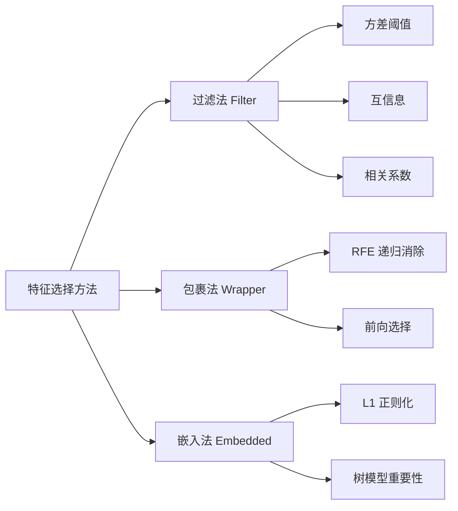

# 特征选择

> 数据不是越多越好。选错特征，你的模型只是在学习噪声。

**类型：** 实现课
**语言：** Python
**前置知识：** 阶段 02 · 15（ML 统计学）、01 · 02（向量矩阵运算）
**预计时间：** ~90 分钟
**所处阶段：** Tier 1
**关联课程：** 阶段 03（深度学习核心）— 特征选择会让更少的特征进入网络，直接影响参数规模和训练效率

---

## 🎯 学习目标

完成本课后，你能够：

- [ ] 解释特征选择的必要性——为什么更多特征不等于更好的模型
- [ ] 从零实现过滤法（方差阈值、互信息）、包裹法（RFE）和嵌入法（L1/树重要性）
- [ ] 对比三种方法族的优劣，并能根据场景选择合适的方法
- [ ] 识别特征选择中的常见陷阱——数据泄露、相关特征、过拟合选择
- [ ] 使用 scikit-learn 在真实数据集上构建特征选择流水线

---

## 1. 问题

你的数据集有 200 个特征。你一股脑全塞进模型，训练了 3 小时，准确率 87%。

然后你移除了 180 个"没用"的特征，只用 20 个重新训练：训练时间缩短到 15 分钟，准确率反而升到了 91%。

这不是魔法。这就是特征选择的力量。

冗余特征和噪声特征的危害是实实在在的。它们给模型提供了"走捷径"的机会——在训练集上记住噪声模式，然后在测试集上失败。它们让数据在高维空间中变得稀疏，使得距离计算失去意义——这就是"维度灾难"。它们还增加了推理延迟和内存占用，在生产环境中每一毫秒都直接影响成本。

在真实工程中，特征选择往往比换一个更复杂的模型更有效。Kaggle 比赛中，高手们花费在特征工程上的时间通常超过调参时间。一个有 50 个精心选择特征的模型，往往击败一个有 500 个原始特征的模型。

你从零构建的每一个特征，每一行进入推荐系统的用户数据，每一条金融风控的交易记录——并不是所有字段都平等。找到那些真正"承载信息"的特征，就是本课的核心任务。

---

## 2. 概念

### 2.1 为什么需要特征选择

特征选择的目标很简单：从原始特征集合中选出一个子集，使得模型在这个子集上达到最佳性能。

但它的价值远不止于此：

```
性能提升：减少过拟合，提高泛化能力
    │
速度提升：更少的特征 → 更短的训练和推理时间
    │
可解释性：更少的特征 → 更容易理解模型在做什么
    │
数据效率：更少的特征 → 需要更少的训练数据
```

### 2.2 三种方法族

特征选择方法分为三大类，它们的区别在于"如何评估特征是否有用"：



| 方法族 | 评估方式 | 速度 | 是否考虑特征交互 |
|---|---|---|---|
| 过滤法 | 统计量（与模型无关） | 快 | 否 |
| 包裹法 | 模型性能（反复训练） | 慢 | 是 |
| 嵌入法 | 训练过程中自动选择 | 中 | 部分 |

**过滤法**像筛子：用统计规则先过滤掉明显的"垃圾特征"，不碰模型。**包裹法**像试穿衣服：反复训练模型，看哪个子集效果最好。**嵌入法**像边做边选：特征选择是模型训练的自然副产品。

### 2.3 方法选择的直觉

```
你的数据集有多少特征？
    │
    ├── < 50 个 → 互信息排序，保留 Top-K
    │
    ├── 50 ~ 500 个 → 先方差过滤，再用 L1 或树重要性
    │
    └── > 500 个 → 链式策略：方差过滤 → 互信息筛选 → RFE 精挑
```

---

## 3. 从零实现

### 第 1 步：方差阈值——移除"几乎不变"的特征

最简单、最安全的特征选择：方差为零或极小的特征对任何模型都没有价值。

```python
import numpy as np

def variance_threshold(X, threshold=0.01):
    """移除方差低于阈值的特征。"""
    variances = np.var(X, axis=0)
    mask = variances > threshold
    return mask, variances
```

为什么它无害？因为一个常数特征不可能与标签有任何关联——任何模型都无法从中学习。移除它们不会丢失任何信息。

### 第 2 步：互信息——捕捉任意统计依赖

皮尔逊相关系数只能检测线性关系。如果一个特征与标签是二次关系 $y = x^2$，相关系数会接近零，但这个特征非常有用。

互信息（Mutual Information）没有这个限制。它衡量的是：知道特征 $X$ 之后，对标签 $Y$ 的不确定性减少了多少。

$$I(X; Y) = \sum_{x \in X} \sum_{y \in Y} p(x, y) \log \frac{p(x, y)}{p(x)p(y)}$$

```python
def discretize(x, n_bins=10):
    """将连续特征离散化为 n_bins 个区间。"""
    min_val, max_val = x.min(), x.max()
    if max_val == min_val:
        return np.zeros_like(x, dtype=int)
    bin_edges = np.linspace(min_val, max_val, n_bins + 1)
    binned = np.digitize(x, bin_edges[1:-1])
    return binned

def mutual_information(X, y, n_bins=10):
    """计算每个特征与标签之间的互信息。"""
    n_samples, n_features = X.shape
    mi_scores = np.zeros(n_features)

    y_vals, y_counts = np.unique(y, return_counts=True)
    p_y = y_counts / n_samples

    for f in range(n_features):
        x_binned = discretize(X[:, f], n_bins)
        x_vals, x_counts = np.unique(x_binned, return_counts=True)
        p_x = dict(zip(x_vals, x_counts / n_samples))

        mi = 0.0
        for xv in x_vals:
            for yi, yv in enumerate(y_vals):
                joint_mask = (x_binned == xv) & (y == yv)
                p_xy = np.sum(joint_mask) / n_samples
                if p_xy > 0:
                    mi += p_xy * np.log(p_xy / (p_x[xv] * p_y[yi]))
        mi_scores[f] = mi

    return mi_scores
```

### 第 3 步：递归特征消除（RFE）——迭代式精挑细选

RFE 的核心逻辑：训练整个模型，移除最不重要的特征，重复这个过程，直到剩余特征数达到目标。

**为什么不能一次性移除所有低重要性特征？** 因为特征重要性是相对的。假设有两个完全相关的特征 A 和 B，模型可能把 50% 的重要性分给 A、50% 给 B。如果一次性移除低于阈值的特征，可能两个都移除了——但实际上它们携带的信息是等价的，移除一个就够了。迭代移除让模型在每步重新评估。

```python
def simple_logistic_importance(X, y, lr=0.1, epochs=100):
    """训练简单逻辑回归，返回权重向量。"""
    n_samples, n_features = X.shape
    w = np.zeros(n_features)
    b = 0.0

    for _ in range(epochs):
        z = X @ w + b
        pred = 1.0 / (1.0 + np.exp(-np.clip(z, -500, 500)))
        error = pred - y
        w -= lr * (X.T @ error) / n_samples
        b -= lr * np.mean(error)

    return w, b

def rfe(X, y, n_features_to_select=5, lr=0.1, epochs=100):
    """递归特征消除。"""
    n_total = X.shape[1]
    remaining = list(range(n_total))
    rankings = np.ones(n_total, dtype=int)
    rank = n_total

    while len(remaining) > n_features_to_select:
        X_subset = X[:, remaining]
        w, _ = simple_logistic_importance(X_subset, y, lr, epochs)
        importances = np.abs(w)

        least_idx = np.argmin(importances)
        original_idx = remaining[least_idx]
        rankings[original_idx] = rank
        rank -= 1
        remaining.pop(least_idx)

    for idx in remaining:
        rankings[idx] = 1

    selected_mask = rankings == 1
    return selected_mask, rankings
```

### 第 4 步：L1 正则化——让模型自己选择

L1 正则化（Lasso）在损失函数中加入权重的绝对值之和：

$$\mathcal{L}_{\text{total}} = \mathcal{L}_{\text{data}} + \alpha \sum_{j=1}^{d} |w_j|$$

L1 的几何约束是一个菱形（高维是菱形多面体）。最优解容易落在菱形的顶点上——此时某些权重恰好为 0。这等价于自动完成了特征选择。

```python
def soft_threshold(w, alpha):
    """软阈值函数——L1 正则化的核心。"""
    return np.sign(w) * np.maximum(np.abs(w) - alpha, 0)

def l1_feature_selection(X, y, alpha=0.1, lr=0.01, epochs=500):
    """通过 L1 正则化进行特征选择。"""
    n_samples, n_features = X.shape
    w = np.zeros(n_features)
    b = 0.0

    for _ in range(epochs):
        z = X @ w + b
        pred = 1.0 / (1.0 + np.exp(-np.clip(z, -500, 500)))
        error = pred - y

        gradient_w = (X.T @ error) / n_samples
        gradient_b = np.mean(error)

        w -= lr * gradient_w
        w = soft_threshold(w, lr * alpha)  # 关键：软阈值让权重归零
        b -= lr * gradient_b

    selected_mask = np.abs(w) > 1e-6
    return selected_mask, w
```

### 第 5 步：树模型特征重要性——不纯度减少量

决策树在每个节点选择"最能区分样本"的特征进行分裂。一个特征带来的不纯度减少越多，它就越重要。

```python
def gini_impurity(y):
    """计算基尼不纯度。"""
    if len(y) == 0:
        return 0.0
    classes, counts = np.unique(y, return_counts=True)
    probs = counts / len(y)
    return 1.0 - np.sum(probs ** 2)

def best_split(X, y, feature_idx):
    """对单个特征寻找最佳分裂阈值。"""
    values = np.unique(X[:, feature_idx])
    if len(values) <= 1:
        return None, -1.0
    best_threshold, best_gain = None, -1.0
    parent_gini = gini_impurity(y)
    n = len(y)
    step = max(1, (len(values) - 1) // min(20, len(values) - 1))
    for i in range(0, len(values) - 1, step):
        threshold = (values[i] + values[i + 1]) / 2.0
        left_mask = X[:, feature_idx] <= threshold
        n_left, n_right = np.sum(left_mask), n - np.sum(left_mask)
        if n_left == 0 or n_right == 0:
            continue
        gain = parent_gini - (n_left / n) * gini_impurity(y[left_mask]) - (n_right / n) * gini_impurity(y[~left_mask])
        if gain > best_gain:
            best_gain, best_threshold = gain, threshold
    return best_threshold, best_gain
```

通过多棵树的平均（随机森林思想），可以得到更稳定的特征重要性排序。

---

## 4. 工业工具

### 4.1 scikit-learn 特征选择

```python
from sklearn.feature_selection import (
    VarianceThreshold,
    mutual_info_classif,
    SelectKBest,
    RFE,
    SelectFromModel,
)
from sklearn.linear_model import Lasso, LogisticRegression
from sklearn.ensemble import RandomForestClassifier
from sklearn.datasets import load_breast_cancer
from sklearn.model_selection import train_test_split
from sklearn.preprocessing import StandardScaler

# 加载真实数据集
data = load_breast_cancer()
X, y = data.data, data.target
feature_names = data.feature_names

X_train, X_test, y_train, y_test = train_test_split(
    X, y, test_size=0.2, random_state=42
)

# 标准化
scaler = StandardScaler()
X_train_scaled = scaler.fit_transform(X_train)
X_test_scaled = scaler.transform(X_test)

# 方法 1：方差阈值
selector_var = VarianceThreshold(threshold=0.1)
X_train_var = selector_var.fit_transform(X_train_scaled)
print(f"方差阈值后保留 {X_train_var.shape[1]} 个特征")

# 方法 2：互信息
mi_scores = mutual_info_classif(X_train_scaled, y_train, random_state=42)
mi_ranked = sorted(zip(feature_names, mi_scores), key=lambda x: x[1], reverse=True)
print("\n互信息 Top-5 特征：")
for name, score in mi_ranked[:5]:
    print(f"  {name:<30} {score:.4f}")

# 方法 3：L1 选择
lasso = Lasso(alpha=0.01)
selector_l1 = SelectFromModel(lasso)
X_train_l1 = selector_l1.fit_transform(X_train_scaled, y_train)
print(f"\nL1 选择后保留 {X_train_l1.shape[1]} 个特征")

# 方法 4：RFE
estimator = LogisticRegression(max_iter=1000)
selector_rfe = RFE(estimator, n_features_to_select=10, step=1)
X_train_rfe = selector_rfe.fit_transform(X_train_scaled, y_train)
print(f"RFE 选择后保留 {X_train_rfe.shape[1]} 个特征")

# 方法 5：树重要性
rf = RandomForestClassifier(n_estimators=100, random_state=42)
rf.fit(X_train_scaled, y_train)
importances = rf.feature_importances_
tree_ranked = sorted(zip(feature_names, importances), key=lambda x: x[1], reverse=True)
print("\n树重要性 Top-5 特征：")
for name, score in tree_ranked[:5]:
    print(f"  {name:<30} {score:.4f}")
```

### 4.2 流水线集成

```python
from sklearn.pipeline import Pipeline

# 将特征选择嵌入训练流水线，避免数据泄露
pipeline = Pipeline([
    ("scaler", StandardScaler()),
    ("selector", SelectFromModel(Lasso(alpha=0.01))),
    ("classifier", LogisticRegression(max_iter=1000)),
])

pipeline.fit(X_train, y_train)
print(f"测试准确率：{pipeline.score(X_test, y_test):.4f}")
```

### 4.3 方法对比

| 方法 | 适用场景 | 优点 | 缺点 |
|---|---|---|---|
| 方差阈值 | 所有场景的第一步 | 零成本、零风险 | 只能移除常数特征 |
| 互信息 | 快速筛选、非线性关系 | 捕捉任意关系 | 忽略特征交互 |
| RFE | 特征数 < 500 的精细选择 | 考虑特征交互 | 计算开销大 |
| L1 正则化 | 线性模型、需要稀疏解 | 训练时自动完成 | 对相关特征不稳定 |
| 树重要性 | 非线性问题、特征交互 | 鲁棒、易用 | 偏向高基数特征 |

---

## 5. 知识连线

本课学习的特征选择方法，是后续多个阶段的核心前置知识：

- **阶段 03（深度学习核心）**：特征选择让更少的特征进入网络，直接影响第一层的参数规模和训练效率。在嵌入层之前做特征选择，是工业界的常见做法。
- **阶段 05（NLP 基础）**：文本分类中的词特征选择（卡方检验、互信息选词）直接使用了本课的过滤法思想。
- **阶段 11（LLM 工程）**：检索增强生成（RAG）中的"分块策略"和"检索特征选择"，本质上是在高维嵌入空间中的特征选择问题。

---

## 6. 工程最佳实践

### 6.1 工业界常用方案

| 场景 | 推荐方案 | 备注 |
|---|---|---|
| 数据探索阶段 | 方差阈值 + 互信息排序 | 快速了解哪些特征有用 |
| 线性模型 | L1 正则化（Lasso） | 训练时自动完成，无需额外步骤 |
| 树模型 | 树重要性 + SelectFromModel | 开箱即用，sklearn 原生支持 |
| 高精度要求 | RFE + 交叉验证 | 计算成本高，但效果最好 |
| 生产流水线 | Pipeline 集成特征选择 | 防止数据泄露 |

### 6.2 中文场景特别建议

- 中文文本分类中，先用互信息筛选词特征，再送入 TF-IDF 或嵌入层，通常能提升 2-5% 的准确率
- 金融风控场景中，特征选择后务必做稳定性检验——某些特征在训练集上重要，但在时间维度上可能不稳定
- 推荐系统场景中，用户行为特征的方差往往差异巨大，建议先做对数变换再做方差阈值

### 6.3 踩坑经验

- 特征选择必须在训练集上拟合，然后统一应用到测试集。如果在全量数据上做选择再划分，就是数据泄露
- 交叉验证时，特征选择必须放在每个 fold 内部，而不是在交叉验证之前
- L1 正则化对特征尺度敏感——务必先标准化再使用
- 树模型重要性偏向高基数特征（如用户 ID），使用前先移除 ID 类特征
- RFE 的 `step` 参数控制每次移除的特征数。`step=1` 最精确但最慢，`step=5` 更快但可能跳过最优解

---

## 7. 常见错误

### 错误 1：在全量数据上做特征选择后划分训练/测试集

**现象：** 测试准确率异常高，但上线后效果远不如预期。

**原因：** 特征选择过程"看到"了测试集的信息。被选中的特征在测试集上表现好，是因为选择过程已经利用了测试集的统计特性。这是典型的数据泄露。

**修复：**
```python
# ❌ 错误：先选择再划分
selector.fit(X_all)
X_selected = selector.transform(X_all)
X_train, X_test = train_test_split(X_selected, ...)

# ✓ 正确：先划分，在训练集上拟合选择器
X_train, X_test = train_test_split(X_all, ...)
selector.fit(X_train)
X_train_selected = selector.transform(X_train)
X_test_selected = selector.transform(X_test)
```

### 错误 2：L1 正则化前未标准化

**现象：** L1 选择了量纲小的特征，移除了量纲大的特征，但量纲大的特征可能更有信息量。

**原因：** L1 惩罚对权重的绝对值敏感。量纲大的特征自然对应较小的权重，更容易被 L1 压缩到零。这不是"不重要"，而是尺度差异造成的假象。

**修复：**
```python
# ❌ 错误：直接对原始数据使用 Lasso
selector = SelectFromModel(Lasso(alpha=0.01))
selector.fit(X_train, y_train)

# ✓ 正确：先标准化
scaler = StandardScaler()
X_scaled = scaler.fit_transform(X_train)
selector = SelectFromModel(Lasso(alpha=0.01))
selector.fit(X_scaled, y_train)
```

### 错误 3：忽略相关特征的影响

**现象：** L1 选择后，某些明显重要的特征被移除了。

**原因：** 当多个特征高度相关时，L1 会"任意"保留其中一个，将其他特征的权重压缩为零。被移除的特征并非不重要——只是与保留的特征信息重叠。

**修复：**
```python
# 先计算相关矩阵，对相关特征组做人工决策
import numpy as np

corr_matrix = np.corrcoef(X_train.T)
# 对相关系数 > 0.9 的特征组，人工决定保留哪一个
# 或者使用树模型重要性（它在相关特征间分散重要性）
```

### 错误 4：RFE 迭代次数过多导致过拟合

**现象：** 训练集准确率很高，但验证集准确率下降。

**原因：** RFE 反复在训练集上评估特征重要性，迭代次数过多会让特征选择过程本身过拟合训练数据。

**修复：**
```python
# 使用带交叉验证的 RFECV，自动确定最优特征数
from sklearn.feature_selection import RFECV

rfecv = RFECV(
    estimator=LogisticRegression(max_iter=1000),
    step=1,
    cv=5,
    scoring="accuracy",
    min_features_to_select=5,
)
rfecv.fit(X_train, y_train)
print(f"最优特征数量：{rfecv.n_features_}")
```

---

## 8. 面试考点

### Q1：过滤法、包裹法、嵌入法的核心区别是什么？（难度：⭐⭐）

**参考答案：**
三者的区别在于"如何评估特征是否有用"。过滤法使用统计量（方差、互信息、相关系数），与模型无关，速度快但忽略特征交互。包裹法反复训练模型评估不同子集，效果好但计算成本高。嵌入法在训练过程中自动完成特征选择（如 L1 正则化、树分裂），是前两者的折中。

### Q2：为什么 L1 正则化能产生稀疏解，而 L2 不能？（难度：⭐⭐⭐）

**参考答案：**
从几何角度，L1 的约束区域是菱形（高维是菱形多面体），最优解容易落在顶点上——顶点处某些维度恰好为 0。L2 的约束区域是球形，最优解几乎不可能恰好落在坐标轴上。从数学角度，L1 的梯度是常数（不随权重减小而减小），所以软阈值操作可以直接将小权重"推"到零；L2 的梯度与权重成正比，权重越小推力越小，只能趋近零但不会等于零。

### Q3：互信息相比皮尔逊相关系数有什么优势？什么场景下两者结论会不同？（难度：⭐⭐）

**参考答案：**
互信息可以捕捉任意统计依赖（线性、非线性、周期性），而皮尔逊相关系数只能检测线性关系。典型场景：$y = x^2$（对称分布下），皮尔逊相关系数为 0，但互信息很高。另一个场景：$y = \sin(x) + \epsilon$，相关系数接近 0，但互信息显著大于 0。

### Q4：手写 RFE 算法的伪代码（难度：⭐⭐⭐）

**参考答案：**
```
输入：特征矩阵 X，标签 y，目标特征数 k
剩余特征 = 全部特征
当 剩余特征数 > k 时：
    在剩余特征上训练模型
    计算每个特征的重要性
    移除重要性最低的特征
返回 剩余特征
```

---

## 🔑 关键术语

| 术语 | 人们怎么说 | 实际含义 |
|---|---|---|
| 特征选择 (Feature Selection) | "删掉没用的列" | 从原始特征集中选出一个子集，使模型在该子集上达到最优性能 |
| 过滤法 (Filter) | "用统计方法筛一遍" | 使用与模型无关的统计量（方差、互信息、相关系数）评估特征 |
| 包裹法 (Wrapper) | "试各种组合看哪个效果好" | 反复训练模型，以模型性能为标准评估特征子集 |
| 嵌入法 (Embedded) | "训练时自动选" | 特征选择是模型训练过程的自然副产品 |
| 互信息 (Mutual Information) | "两个变量有多相关" | 知道一个变量后，对另一个变量不确定性的减少量——捕捉任意统计依赖 |
| 递归特征消除 (RFE) | "一个一个删" | 反复训练模型，每次移除最不重要的特征，直到达到目标数量 |
| L1 正则化 (Lasso) | "让权重变稀疏" | 在损失函数中加入权重绝对值之和，使不重要特征的权重恰好为 0 |
| 基尼不纯度 (Gini Impurity) | "节点有多乱" | 随机抽取两个样本，它们类别不一致的概率——用于衡量决策树节点的纯度 |
| 数据泄露 (Data Leakage) | "测试集信息泄露到训练中" | 训练过程中以任何方式使用了测试集信息，导致评估过于乐观 |
| 维度灾难 (Curse of Dimensionality) | "特征太多模型学不好" | 高维空间中数据变得稀疏，距离计算失去意义，模型需要指数级更多数据 |

---

## 📚 小结

特征选择是机器学习流水线中最具性价比的环节之一——它同时提升模型性能、加速训练、增强可解释性。你从零实现了过滤法（方差阈值、互信息）、包裹法（RFE）和嵌入法（L1 正则化、树重要性），理解了每种方法的核心假设和适用边界。

下一课我们将学习降维——与特征选择不同，降维通过线性变换将高维特征压缩到低维空间，而不是从原始特征中做选择。

---

## ✏️ 练习

1. 【理解】用自己的话解释为什么 L1 正则化能产生稀疏解而 L2 不能。写 200 字以内的说明，让一个没有 ML 背景的程序员也能听懂。

2. 【实现】修改 `rfe` 函数，支持 `step` 参数——每次迭代移除 `step` 个最不重要的特征，而不是只移除 1 个。分析 `step` 对运行时间和选择质量的影响。

3. 【实验】在 sklearn 的 `load_breast_cancer` 数据集上，分别用 5 种方法做特征选择，比较最终模型的准确率、训练时间和特征数量。记录你的发现。

4. 【思考】在推荐系统场景中，用户行为特征（点击次数、浏览时长、收藏数）往往高度相关。如果你只能保留其中一个，你会选哪个？为什么？特征选择方法在这个场景下有什么局限性？

---

## 🚀 产出

本课产出以下可复用内容：

| 产出 | 文件 | 说明 |
|---|---|---|
| 特征选择完整实现 | `code/main.py` | 从零实现 5 种特征选择方法，可运行 |
| 方法选择决策指南 | `outputs/prompt-feature-selection-guide.md` | 根据场景选择合适方法的决策树 |

---

## 📖 参考资料

1. [论文] Guyon, I., & Elisseeff, A. "An Introduction to Variable and Feature Selection". Journal of Machine Learning Research, 2003. https://www.jmlr.org/papers/v3/guyon03a.html
2. [论文] Kohavi, R., & John, G. H. "Wrappers for feature subset selection". Artificial Intelligence, 1997. https://doi.org/10.1016/S0004-3702(97)00043-X
3. [论文] Tibshirani, R. "Regression Shrinkage and Selection via the Lasso". Journal of the Royal Statistical Society, 1996. https://doi.org/10.1198/016214596000000735
4. [官方文档] scikit-learn. "Feature Selection". https://scikit-learn.org/stable/modules/feature_selection.html
5. [书籍] Goodfellow, Bengio, Courville. 《Deep Learning》. MIT Press, 2016. (第 7.3 节：正则化与特征选择)

---

> 本课程参考了 AI Engineering From Scratch（MIT License）的课程体系，在此基础上进行了重构和原创内容的扩充。所有中文表达、案例、LLM 视角分析、工程最佳实践、常见错误、面试考点等均为原创内容。
