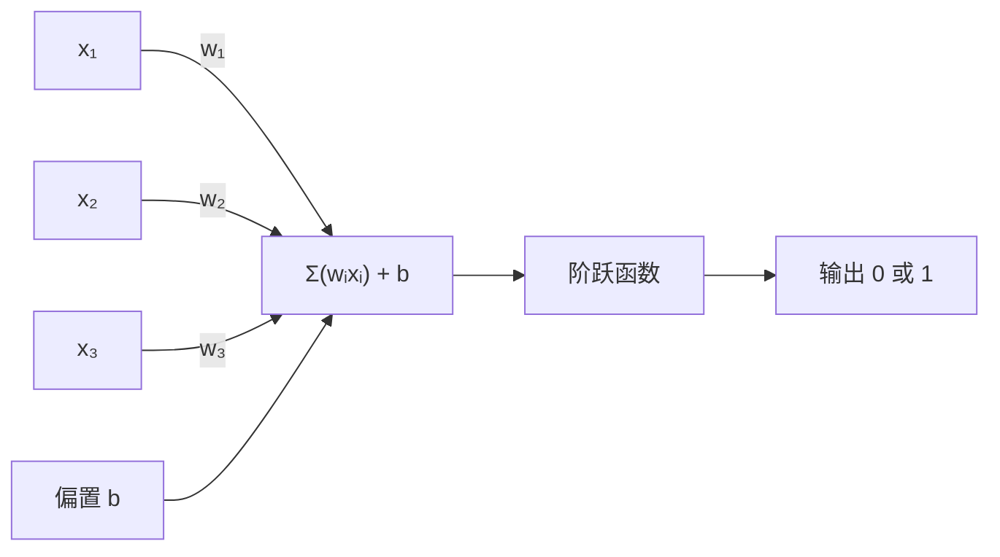
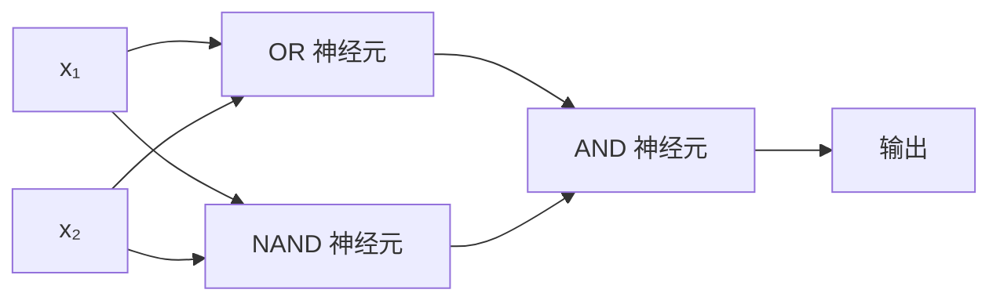

# 感知机

> 感知机是神经网络的细胞核。打开它，里面只有权重、偏置和一个决定。

**类型：** 实现课
**语言：** Python
**前置知识：** 阶段 01（线性代数直觉）
**预计时间：** ~75 分钟
**所处阶段：** Tier 1
**关联课程：** 阶段 03 · 02（反向传播）— 理解感知机的局限如何催生了反向传播算法

---

## 🎯 学习目标

完成本课后，你能够：

- [ ] 从零实现单层感知机，包括阶跃激活函数和权重更新规则
- [ ] 解释为什么单层感知机只能解决线性可分问题，并通过 XOR 问题演示其失败
- [ ] 构造多层感知机组合 OR、NAND、AND 三个神经元来解决 XOR 问题
- [ ] 用 Sigmoid 激活函数和反向传播训练双层网络，自动学习 XOR 的权重
- [ ] 解释激活函数从阶跃函数到 Sigmoid 的演变如何使梯度下降成为可能

---

## 1. 问题

你懂向量点积。你懂矩阵如何把输入变换成输出。但是机器如何*学习*该用哪个变换？

感知机回答了这个问题。它是最简单的学习机器：接收输入，乘以权重，加上偏置，做出二元决定。然后调整。就这么简单。之后所有的神经网络，本质上都是这个想法的分层堆叠。

理解感知机，就是理解"学习"在代码中到底意味着什么——不断调整数字，直到输出与现实一致。

感知机不只是历史。它是理解一切深度学习的入口：

- 单个神经元怎么做决定？
- 网络怎么从错误中学习？
- 为什么简单的神经元叠成层之后，能解决复杂问题？
- 为什么后来需要反向传播？

---

## 2. 概念

### 2.1 一个神经元，一个决定

感知机接收 $n$ 个输入，每个输入乘以对应权重，求和，加上偏置，通过激活函数输出 0 或 1。



计算公式：

$$z = \sum_{i=1}^{n} w_i x_i + b$$

$$\hat{y} = \text{step}(z) = \begin{cases} 1 & \text{if } z \geq 0 \\ 0 & \text{if } z < 0 \end{cases}$$

其中：
- $x_i$ 是第 $i$ 个输入
- $w_i$ 是第 $i$ 个权重，控制该输入对结果的影响程度
- $b$ 是偏置，允许决策边界不经过原点
- $z$ 是加权和的中间结果

### 2.2 决策边界

在二维输入空间中，感知机画出一条直线：

```
x₂
 ┤
 │  类别 0         /
 │    (0)         /
 │               /  w₁x₁ + w₂x₂ + b = 0
 │              /
 │             /     类别 1
 │            /       (1)
 ┼───────────/──────────── x₁
```

直线一侧输出 0，另一侧输出 1。训练的过程，就是移动这条直线，直到它正确分隔两类样本。

### 2.3 学习规则

感知机学习规则极其简洁：

```
对每个训练样本 (x, y_true):
    y_pred = predict(x)
    error = y_true - y_pred

    对每个权重:
        w_i = w_i + 学习率 × error × x_i
    偏置 = 偏置 + 学习率 × error
```

三种情况：
- **预测正确**：error = 0，权重不变
- **预测为 0 但应为 1**：error = +1，权重增大
- **预测为 1 但应为 0**：error = -1，权重减小

### 2.4 激活函数

激活函数决定神经元如何把加权和的中间结果映射为输出。感知机使用阶跃函数：

| 函数 | 公式 | 特点 |
|---|---|---|
| 阶跃函数 | $\text{step}(z) = 1 \text{ if } z \geq 0 \text{ else } 0$ | 不可导，只能输出 0 或 1 |
| Sigmoid | $\sigma(z) = \frac{1}{1 + e^{-z}}$ | 可导，输出 (0, 1) 连续值 |
| ReLU | $\text{ReLU}(z) = \max(0, z)$ | 可导（除 0 点），现代网络标配 |

阶跃函数的问题在于**不可导**。它的梯度要么是 0，要么不存在，这让"通过误差反传调整权重"成为不可能。Sigmoid 的平滑曲线让微小误差也能产生有意义的梯度，这是后续反向传播算法的前提。

### 2.5 线性可分性

**线性可分**：存在一条直线（或高维超平面）能完美分隔两类样本。

```
AND（可分）:          XOR（不可分）:

x₂                    x₂
1 ┤  0     1         1 ┤  1     0
  │     /               │
0 ┤  0 / 0            0 ┤  0     1
  ┼──/──────── x₁       ┼──────────── x₁
    直线有效！           没有单条直线能分隔！
```

AND 和 OR 都是线性可分的。XOR 不是：无论怎么画直线，都无法把 `[0,1]` 和 `[1,0]` 与 `[0,0]` 和 `[1,1]` 分开。

明斯基（Minsky）和帕佩特（Papert）在 1969 年证明了这一点，几乎让神经网络研究停滞了十年。

### 2.6 感知机收敛定理

**定理**（Rosenblatt, 1962）：如果训练数据是线性可分的，感知机学习算法必定在有限步内收敛。

直觉理解：每一轮错误的更新都让权重向量"更靠近"一个能正确分类的解。因为解空间有界，错误次数不可能无限。

**推论**：如果数据不是线性可分的，感知机*永远*不会收敛。这不是算法缺陷，而是模型本身的数学限制。

### 2.7 XOR 问题的突破

关键洞察：XOR = (x₁ OR x₂) AND NOT(x₁ AND x₂)。

用三个感知机组合：
- 隐藏层：OR 神经元 + NAND 神经元
- 输出层：AND 神经元



每一层做线性分割，层与层的组合产生**非线性**决策边界。这就是多层感知机（MLP）的核心思想。

---

## 3. 从零实现

### 第 1 步：感知机类

```python
class Perceptron:
    """单层感知机——最简单的神经网络单元。"""

    def __init__(self, n_inputs, learning_rate=0.1):
        # 权重初始化为 0，偏置初始化为 0
        self.weights = [0.0] * n_inputs
        self.bias = 0.0
        self.lr = learning_rate

    def predict(self, inputs):
        """前向计算：加权和 + 阶跃函数。"""
        total = sum(w * x for w, x in zip(self.weights, inputs))
        total += self.bias
        return 1 if total >= 0 else 0

    def train(self, training_data, epochs=100):
        """训练：对错误样本更新权重和偏置。"""
        for epoch in range(epochs):
            errors = 0
            for inputs, target in training_data:
                prediction = self.predict(inputs)
                error = target - prediction
                if error != 0:
                    errors += 1
                    for i in range(len(self.weights)):
                        self.weights[i] += self.lr * error * inputs[i]
                    self.bias += self.lr * error
            if errors == 0:
                print(f"第 {epoch + 1} 轮收敛")
                return
        print(f"{epochs} 轮后未收敛")
```

### 第 2 步：训练逻辑门

```python
and_data = [([0, 0], 0), ([0, 1], 0), ([1, 0], 0), ([1, 1], 1)]
or_data  = [([0, 0], 0), ([0, 1], 1), ([1, 0], 1), ([1, 1], 1)]
not_data = [([0], 1), ([1], 0)]

# 训练 AND 门
p_and = Perceptron(2)
p_and.train(and_data)
```

输出：

```
=== AND 门 ===
  第 4 轮收敛
  权重: ['0.20', '0.10'], 偏置: -0.20
  输入 [0, 0] -> 输出 0 (期望 0) 正确
  输入 [0, 1] -> 输出 0 (期望 0) 正确
  输入 [1, 0] -> 输出 0 (期望 0) 正确
  输入 [1, 1] -> 输出 1 (期望 1) 正确
```

### 第 3 步：观察 XOR 失败

```python
xor_data = [([0, 0], 0), ([0, 1], 1), ([1, 0], 1), ([1, 1], 0)]

p_xor = Perceptron(2)
p_xor.train(xor_data, epochs=1000)
```

输出：

```
=== XOR 门（单层感知机——注定失败）===
  1000 轮后未收敛
  输入 [0, 0] -> 输出 1 (期望 0) 错误
  输入 [0, 1] -> 输出 1 (期望 1) 正确
  输入 [1, 0] -> 输出 0 (期望 1) 错误
  输入 [1, 1] -> 输出 0 (期望 0) 正确
```

**这是硬证明**：单层感知机就是无法学习 XOR。

### 第 4 步：多层网络解决 XOR

```python
def xor_network(x1, x2):
    # OR 神经元：任一输入为 1 则激活
    or_neuron = Perceptron(2)
    or_neuron.weights = [1.0, 1.0]
    or_neuron.bias = -0.5

    # NAND 神经元：不同时全为 1 则激活
    nand_neuron = Perceptron(2)
    nand_neuron.weights = [-1.0, -1.0]
    nand_neuron.bias = 1.5

    # AND 神经元：两个隐藏输出都为 1 才激活
    and_neuron = Perceptron(2)
    and_neuron.weights = [1.0, 1.0]
    and_neuron.bias = -1.5

    hidden1 = or_neuron.predict([x1, x2])
    hidden2 = nand_neuron.predict([x1, x2])
    return and_neuron.predict([hidden1, hidden2])
```

输出：

```
=== XOR 门（多层网络——手工权重）===
  输入 [0, 0] -> 输出 0 (期望 0) 正确
  输入 [0, 1] -> 输出 1 (期望 1) 正确
  输入 [1, 0] -> 输出 1 (期望 1) 正确
  输入 [1, 1] -> 输出 0 (期望 0) 正确
```

四个样本全部正确。堆叠感知机产生了单个神经元无法做出的决策边界。

### 第 5 步：反向传播自动学习

第 4 步手工设置了权重，这对 XOR 可行，但对真实问题不适用。关键升级：用 Sigmoid 替代阶跃函数（使梯度存在），通过反向传播自动学习权重。

```python
class TwoLayerNetwork:
    """双层网络：2 输入 -> 2 隐藏 Sigmoid 神经元 -> 1 Sigmoid 输出。"""

    def __init__(self, learning_rate=2.0):
        random.seed(0)
        self.w_hidden = [[random.uniform(-1, 1), random.uniform(-1, 1)] for _ in range(2)]
        self.b_hidden = [random.uniform(-1, 1), random.uniform(-1, 1)]
        self.w_output = [random.uniform(-1, 1), random.uniform(-1, 1)]
        self.b_output = random.uniform(-1, 1)
        self.lr = learning_rate

    def sigmoid(self, x):
        """Sigmoid 激活函数：将实数映射到 (0, 1)。"""
        x = max(-500, min(500, x))  # 防止 exp 溢出
        return 1.0 / (1.0 + math.exp(-x))

    def forward(self, inputs):
        """前向传播：计算网络输出。"""
        self.inputs = inputs
        self.hidden_outputs = []
        for i in range(2):
            z = sum(w * x for w, x in zip(self.w_hidden[i], inputs)) + self.b_hidden[i]
            self.hidden_outputs.append(self.sigmoid(z))
        z_out = sum(w * h for w, h in zip(self.w_output, self.hidden_outputs)) + self.b_output
        self.output = self.sigmoid(z_out)
        return self.output

    def train(self, training_data, epochs=10000):
        """反向传播训练。"""
        for epoch in range(epochs):
            total_error = 0
            for inputs, target in training_data:
                output = self.forward(inputs)
                error = target - output
                total_error += error ** 2

                # 输出层梯度
                d_output = error * output * (1 - output)

                # 反向传播到隐藏层
                saved_w_output = self.w_output[:]
                hidden_deltas = []
                for i in range(2):
                    h = self.hidden_outputs[i]
                    hd = d_output * saved_w_output[i] * h * (1 - h)
                    hidden_deltas.append(hd)

                # 更新输出层权重
                for i in range(2):
                    self.w_output[i] += self.lr * d_output * self.hidden_outputs[i]
                self.b_output += self.lr * d_output

                # 更新隐藏层权重
                for i in range(2):
                    for j in range(len(inputs)):
                        self.w_hidden[i][j] += self.lr * hidden_deltas[i] * inputs[j]
                    self.b_hidden[i] += self.lr * hidden_deltas[i]
```

输出：

```
=== XOR 门（双层网络——反向传播自动学习）===
  第 0 轮，误差: 1.2164
  第 2000 轮，误差: 0.0017
  第 4000 轮，误差: 0.0007
  第 6000 轮，误差: 0.0005
  第 8000 轮，误差: 0.0003

  输入 [0, 0] -> 输出 0.0074 (四舍五入: 0, 期望 0) 正确
  输入 [0, 1] -> 输出 0.9923 (四舍五入: 1, 期望 1) 正确
  输入 [1, 0] -> 输出 0.9923 (四舍五入: 1, 期望 1) 正确
  输入 [1, 1] -> 输出 0.0094 (四舍五入: 0, 期望 0) 正确
```

误差从 1.22 降到 0.0003。网络自动学会了 XOR，无需手工设置任何权重。

---

## 4. 工业工具

### 4.1 scikit-learn 实现

```python
from sklearn.linear_model import Perceptron as SkPerceptron
import numpy as np

X = np.array([[0, 0], [0, 1], [1, 0], [1, 1]])
y = np.array([0, 0, 0, 1])

clf = SkPerceptron(max_iter=100, tol=1e-3)
clf.fit(X, y)
print([clf.predict([x])[0] for x in X])
```

五行代码。你的 30 行 `Perceptron` 类做的是同一件事。scikit-learn 版本增加了收敛检查、多种损失函数、稀疏输入支持——但核心循环完全相同：加权和、阶跃函数、错误时更新权重。

### 4.2 PyTorch 实现多层感知机

```python
import torch
import torch.nn as nn

class MLP(nn.Module):
    """多层感知机：工业级实现。"""

    def __init__(self, input_size, hidden_size, output_size):
        super().__init__()
        self.layers = nn.Sequential(
            nn.Linear(input_size, hidden_size),
            nn.ReLU(),  # 现代网络标配激活函数
            nn.Linear(hidden_size, output_size),
            nn.Sigmoid()
        )

    def forward(self, x):
        return self.layers(x)

# 训练 XOR
X = torch.tensor([[0, 0], [0, 1], [1, 0], [1, 1]], dtype=torch.float32)
y = torch.tensor([[0], [1], [1], [0]], dtype=torch.float32)

model = MLP(input_size=2, hidden_size=4, output_size=1)
criterion = nn.BCELoss()
optimizer = torch.optim.Adam(model.parameters(), lr=0.01)

for epoch in range(5000):
    output = model(X)
    loss = criterion(output, y)
    optimizer.zero_grad()
    loss.backward()
    optimizer.step()

    if epoch % 1000 == 0:
        print(f"Epoch {epoch}, Loss: {loss.item():.4f}")

# 预测
with torch.no_grad():
    predictions = (model(X) >= 0.5).float()
    print(f"预测: {predictions.flatten().tolist()}")
    print(f"期望: [0.0, 1.0, 1.0, 0.0]")
```

### 4.3 实现方式对比

| 实现方式 | 代码量 | 适用场景 | 学习价值 |
|---|---|---|---|
| 从零实现（本课） | ~100 行 | 理解原理 | 最高 |
| scikit-learn | 5 行 | 快速实验 | 低 |
| PyTorch | ~30 行 | 生产训练 | 中 |

---

## 5. 知识连线

本课学习的感知机，是后续所有深度学习课程的基石：

- **阶段 03 · 02（反向传播）**：你会看到本课中"手工设置权重"的局限如何催生了反向传播算法——自动计算每个权重对误差的贡献
- **阶段 03 · 03（卷积神经网络）**：卷积层本质上是一组共享权重的感知机，每个神经元只关注输入的一个局部区域
- **阶段 07 · 02（自注意力从零）**：注意力机制可以看作"动态权重的感知机"——每个查询与所有键计算相似度，自适应地决定关注哪里

---

## 6. 工程最佳实践

### 6.1 工业界常用方案

| 场景 | 推荐方案 | 备注 |
|---|---|---|
| 学习/实验 | 从零实现（本课） | 理解每个细节 |
| 快速原型 | scikit-learn `Perceptron` | 开箱即用 |
| 生产训练 | PyTorch `nn.Sequential` + `nn.Linear` | GPU 加速，自动微分 |
| 大规模训练 | PyTorch + 分布式训练 | 数据并行/模型并行 |

### 6.2 激活函数选择

| 激活函数 | 适用场景 | 注意事项 |
|---|---|---|
| Sigmoid | 二分类输出层 | 隐藏层慎用，容易梯度消失 |
| ReLU | 隐藏层默认选择 | 计算简单，缓解梯度消失 |
| GELU | Transformer 系列（BERT、GPT） | 平滑版 ReLU，大语言模型标配 |
| Softmax | 多分类输出层 | 输出概率分布 |

### 6.3 踩坑经验

- **学习率过大**：权重更新幅度太大，模型不收敛。从 0.01 开始尝试，观察损失曲线
- **忘记加偏置**：决策边界被迫经过原点，很多问题无法解决
- **阶跃函数用于多层网络**：梯度为 0，反向传播失效。多层网络必须用可导激活函数
- **权重初始化为全 0**：所有隐藏神经元学到相同的特征。使用随机初始化（如 Xavier、He 初始化）
- **输入未归一化**：特征尺度差异大时，梯度下降路径震荡。训练前做标准化（减均值除标准差）

---

## 7. 常见错误

### 错误 1：用单层感知机处理非线性问题

**现象**：训练 1000 轮后准确率仍只有 50%，损失不下降。

**原因**：单层感知机只能画直线。面对 XOR 这类非线性可分问题，无论怎么调整权重都无法收敛。

**修复**：

```python
# ❌ 单层感知机——无法解决 XOR
model = Perceptron(2)
model.train(xor_data, epochs=1000)  # 永远不会收敛

# ✅ 多层感知机——增加隐藏层
model = TwoLayerNetwork(learning_rate=2.0)
model.train(xor_data, epochs=10000)  # 误差降到接近 0
```

### 错误 2：阶跃函数用于多层网络

**现象**：反向传播时梯度全为 0，权重不更新。

**原因**：阶跃函数在 $z \neq 0$ 处导数为 0，在 $z = 0$ 处导数不存在。误差无法通过梯度回传。

**修复**：

```python
# ❌ 阶跃函数——不可导，无法反向传播
def step(z):
    return 1 if z >= 0 else 0

# ✅ Sigmoid——处处可导
def sigmoid(z):
    return 1.0 / (1.0 + math.exp(-z))
```

### 错误 3：学习率设置不当

**现象**：损失震荡不收敛（学习率过大），或收敛极慢（学习率过小）。

**原因**：学习率控制每步更新的幅度。太大则越过最优解，太小则需要极多轮次。

**修复**：

```python
# ❌ 学习率过大——震荡
model = TwoLayerNetwork(learning_rate=10.0)

# ✅ 合理学习率——稳定收敛
model = TwoLayerNetwork(learning_rate=0.5)

# ✅ 更优方案：学习率调度
# PyTorch 中可用 torch.optim.lr_scheduler.StepLR
```

### 错误 4：权重初始化为全 0

**现象**：所有隐藏神经元输出相同，学到的特征完全一样。

**原因**：全 0 初始化导致对称性——所有神经元收到相同的梯度更新，永远保持相同。

**修复**：

```python
# ❌ 全 0 初始化
self.w_hidden = [[0.0, 0.0], [0.0, 0.0]]

# ✅ 随机初始化
self.w_hidden = [[random.uniform(-1, 1), random.uniform(-1, 1)] for _ in range(2)]

# ✅ 工业级：Xavier 初始化
# torch.nn.init.xavier_uniform_(layer.weight)
```

---

## 8. 面试考点

### Q1：感知机中权重和偏置分别起什么作用？（难度：⭐⭐）

**参考答案：**

权重控制每个输入对输出的影响程度——权重越大，对应输入越重要。偏置允许决策边界不经过原点，相当于给神经元一个"基础激活水平"。

没有偏置的话，无论权重怎么调整，决策边界始终过原点，很多简单问题（如 NOT 门）都无法解决。偏置让模型有了平移自由度。

### Q2：为什么单层感知机无法解决 XOR 问题？（难度：⭐⭐）

**参考答案：**

XOR 的四个样本在二维平面上呈对角分布：`[0,1]` 和 `[1,0]` 输出 1，`[0,0]` 和 `[1,1]` 输出 0。没有任何一条直线能将这些样本完美分隔。

单层感知机只能产生线性决策边界（一条直线），因此无法解决 XOR。这是模型的数学局限，不是算法缺陷。

### Q3：激活函数从阶跃函数演变为 Sigmoid 的意义是什么？（难度：⭐⭐⭐）

**参考答案：**

阶跃函数有两个致命问题：(1) 输出只有 0 或 1，无法表达置信度；(2) 不可导，梯度为 0 或不存在，无法使用反向传播。

Sigmoid 将输出平滑映射到 (0, 1)，且处处可导，导数为 $\sigma'(z) = \sigma(z)(1 - \sigma(z))$。这让误差可以通过梯度回传，是多层网络训练的前提。

### Q4：手写感知机的权重更新规则（难度：⭐⭐）

**参考答案：**

$$w_i \leftarrow w_i + \eta \cdot (y_{\text{true}} - y_{\text{pred}}) \cdot x_i$$

$$b \leftarrow b + \eta \cdot (y_{\text{true}} - y_{\text{pred}})$$

其中 $\eta$ 是学习率。当预测正确时，误差为 0，权重不变；预测为 0 但应为 1 时，误差为 +1，权重增大；预测为 1 但应为 0 时，误差为 -1，权重减小。

### Q5：多层感知机如何解决 XOR？画出示意图（难度：⭐⭐⭐）

**参考答案：**

XOR = (x₁ OR x₂) AND NOT(x₁ AND x₂)。

- 隐藏层：OR 神经元（任一输入为 1 则激活）+ NAND 神经元（不同时全为 1 则激活）
- 输出层：AND 神经元（两个隐藏输出都为 1 才激活）

每一层做线性分割，层与层组合产生非线性决策边界。这证明了"线性分类器的非线性组合 = 非线性分类器"。

---

## 🔑 关键术语

| 术语 | 人们怎么说 | 实际含义 |
|---|---|---|
| 感知机 (Perceptron) | "一个假神经元" | 线性分类器：输入与权重的点积，加上偏置，通过阶跃函数输出 0 或 1 |
| 权重 (Weight) | "输入有多重要" | 缩放每个输入对决策贡献程度的乘数 |
| 偏置 (Bias) | "阈值" | 平移决策边界的常数项，允许神经元在零输入时也能激活 |
| 激活函数 (Activation Function) | "把值压一压的函数" | 加权和之后应用的函数——感知机用阶跃函数，现代网络用 Sigmoid、ReLU 等 |
| 线性可分 (Linearly Separable) | "能画一条线分开" | 存在一个超平面能完美分隔两类样本——AND 可分，XOR 不可分 |
| 决策边界 (Decision Boundary) | "分类器切换的地方" | 超平面 $\mathbf{w} \cdot \mathbf{x} + b = 0$，将输入空间分为两个类别区域 |
| 多层感知机 (MLP) | "真正的神经网络" | 感知机分层堆叠，每层输出作为下一层输入，能产生非线性决策边界 |
| 反向传播 (Backpropagation) | "误差倒着传" | 用链式法则从输出层到输入层逐层计算梯度，更新每个权重 |
| Sigmoid | "S 型曲线" | $\sigma(z) = 1/(1+e^{-z})$，将实数映射到 (0,1)，处处可导 |
| 收敛 (Convergence) | "训练好了" | 权重不再变化，所有样本被正确分类（仅对线性可分数据保证） |

---

## 📚 小结

感知机是最简单的学习机器——加权求和、阶跃函数、错误时更新权重。它只能解决线性可分问题，XOR 是其不可逾越的障碍。通过堆叠感知机形成多层网络，并用 Sigmoid 替代阶跃函数使反向传播成为可能，我们打开了深度学习的大门。

下一课我们将推导反向传播算法的数学原理，理解梯度如何从输出层逐层回传，自动调整网络中每一个权重。

---

## ✏️ 练习

1. 【理解】用自己的话解释：为什么单层感知机无法解决 XOR 问题？为什么增加一层就能解决？写 200 字以内的说明，让一个没有 ML 背景的程序员也能听懂。

2. 【实现】修改 `Perceptron` 类，在每一轮训练后记录决策边界方程（$w_1 x_1 + w_2 x_2 + b = 0$）。训练 AND 门时，打印每轮边界如何移动。

3. 【实验】构建一个 3 输入感知机，实现"多数表决"函数——当至少 2 个输入为 1 时输出 1。这是线性可分问题吗？为什么？

4. 【思考】Sigmoid 函数在 $z$ 很大或很小时梯度趋近于 0（"梯度消失"）。阅读 ReLU 激活函数的资料，解释它如何缓解这个问题，以及它引入的新问题是什么（提示：思考 $z < 0$ 时会发生什么）。

---

## 🚀 产出

本课产出以下可复用内容：

| 产出 | 文件 | 说明 |
|---|---|---|
| 感知机完整实现 | `code/main.py` | 从零实现单层感知机、多层 XOR 网络、反向传播双层网络 |
| 提示词：激活函数选择指南 | `outputs/prompt-activation-function-guide.md` | 帮助选择适合不同场景的激活函数 |
| 提示词：感知机 vs 多层网络 | `outputs/prompt-perceptron-vs-mlp.md` | 分析何时需要单层 vs 多层架构 |

---

## 📖 参考资料

1. [论文] Rosenblatt, F. "The Perceptron: A Probabilistic Model for Information Storage and Organization in the Brain". Psychological Review, 1958. https://doi.org/10.1037/h0042519
2. [论文] Minsky, M. & Papert, S. "Perceptrons: An Introduction to Computational Geometry". MIT Press, 1969.
3. [书籍] Goodfellow, I., Bengio, Y., Courville, A. 《Deep Learning》. MIT Press, 2016. http://www.deeplearningbook.org
4. [书籍] 李航. 《统计学习方法（第 2 版）》. 清华大学出版社, 2019.
5. [官方文档] PyTorch nn.Module: https://pytorch.org/docs/stable/generated/torch.nn.Module.html
6. [GitHub] scikit-learn Perceptron: https://github.com/scikit-learn/scikit-learn

---

> 本课程参考了 AI Engineering From Scratch（MIT License）的课程体系，在此基础上进行了重构和原创内容的扩充。所有中文表达、案例、LLM 视角分析、工程最佳实践、常见错误、面试考点等均为原创内容。
