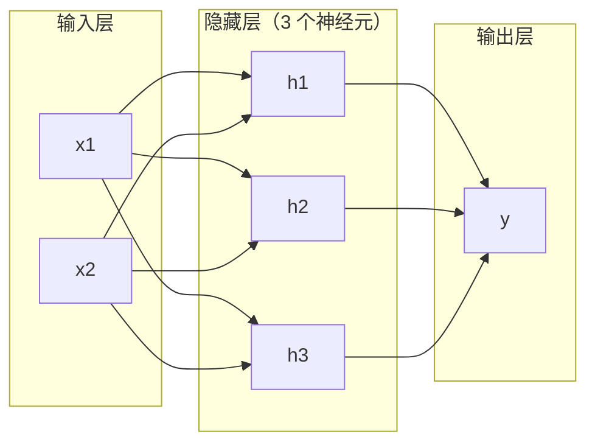
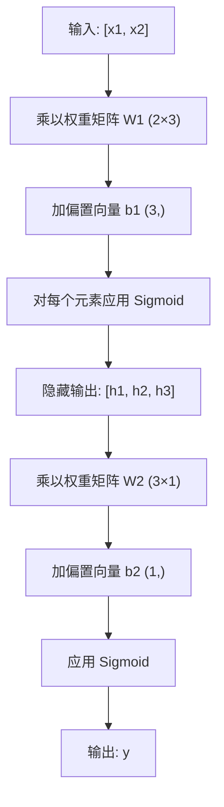

# 多层网络

> 一个神经元只能画一条直线。把它们叠起来，你就能画出任何东西。

**类型：** 实现课
**语言：** Python
**前置知识：** 阶段 01（数学基础）、阶段 03 · 01（感知机）
**预计时间：** ~90 分钟
**所处阶段：** Tier 1
**关联课程：** 阶段 03 · 03（反向传播）— 前向传播计算输出，反向传播学习权重

---

## 🎯 学习目标

完成本课后，你能够：

- [ ] 从零实现 `Layer` 和 `Network` 类，完成完整的前向传播
- [ ] 追踪矩阵维度在网络每一层的变化，定位形状不匹配的错误
- [ ] 解释为什么堆叠非线性激活函数能让网络学习弯曲的决策边界
- [ ] 用手工调参的 2-2-1 网络解决 XOR 问题
- [ ] 计算任意多层网络的可训练参数总数

---

## 1. 问题

一个神经元只能画一条直线。仅此而已。穿过数据的一条直线。人工智能中的每一个真实问题——图像识别、语言理解、下围棋——都需要曲线。

1969 年，明斯基和佩伯特证明了这个局限性是致命的：单层网络无法学习 XOR。不是"学起来困难"——是数学上不可能。XOR 真值表把 [0,1] 和 [1,0] 放在一侧，[0,0] 和 [1,1] 放在另一侧。没有任何一条直线能把它们分开。

这导致神经网络研究经费被砍了十年以上。事后看来，修复方案显而易见：别只用一层了。把神经元堆叠成层。让第一层把输入空间切割成新的特征，让第二层把这些特征组合成单条直线永远做不出的决策。

那个堆叠就是多层网络。它是今天生产中每一个深度学习模型的基石。前向传播——数据从输入流经隐藏层到达输出——是你让任何其他东西工作之前必须先构建的第一步。

---

## 2. 概念

### 2.1 直观理解

多层网络有三种层：

- **输入层**——不是真正的层。它只是存放你的原始数据。两个特征就是两个输入节点。这里不发生任何计算。
- **隐藏层**——真正干活的地方。每个神经元接收前一层的所有输出，应用权重和偏置，然后通过激活函数传递结果。"隐藏"是因为你在训练数据中永远看不到这些值。
- **输出层**——最终答案。二分类用一个 Sigmoid 神经元，多分类用 Softmax。



这是一个 2-3-1 网络：两个输入、三个隐藏神经元、一个输出。每条连接都有一个权重，每个神经元（除输入层外）都有一个偏置。

每一层产出一组数字，称为**隐藏状态**。对文本，隐藏状态升高维度——把一个词编码为 768 个数来捕获语义。对图像，它降低维度——把数百万像素压缩为可管理的表示。隐藏状态是学习发生的地方。

### 2.2 形式化定义

每个神经元做三件事：

1. 把每个输入乘以对应的权重
2. 把所有乘积求和，加上偏置
3. 把和送入激活函数

激活函数使用 Sigmoid：

$$\sigma(z) = \frac{1}{1 + e^{-z}}$$

Sigmoid 把任何数压到 (0, 1) 区间。大正数趋近 1，大负数趋近 0，零映射到 0.5。这条光滑曲线让学习成为可能——与感知机的硬阶跃不同，Sigmoid 处处有梯度。

### 2.3 前向传播：数据如何流动

前向传播把输入数据逐层推过网络，直到到达输出。前向传播中不发生学习。它是纯计算：乘、加、激活、重复。



每层依次发生三个操作：

$$
\begin{aligned}
z &= W \cdot x + b \quad \text{（线性变换）} \\
a &= \sigma(z) \quad \text{（激活）}
\end{aligned}
$$

一层的输出成为下一层的输入。这就是前向传播的全部。

### 2.4 矩阵维度追踪

追踪维度是深度学习中最重要的调试技能。以 2-3-1 网络为例：

| 步骤 | 运算 | 维度 | 结果形状 |
|---|---|---|---|
| 输入 | $x$ | -- | (2,) |
| 隐藏层线性 | $W_1 \cdot x + b_1$ | $W_1$: (3, 2), $b_1$: (3,) | (3,) |
| 隐藏层激活 | $\sigma(z_1)$ | -- | (3,) |
| 输出层线性 | $W_2 \cdot h + b_2$ | $W_2$: (1, 3), $b_2$: (1,) | (1,) |
| 输出层激活 | $\sigma(z_2)$ | -- | (1,) |

规则：第 $k$ 层的权重矩阵 $W$ 形状为 (当前层神经元数, 前一层神经元数)。行对应当前层，列对应前一层。如果形状对不上，你就有 bug。

### 2.5 万能近似定理

1989 年，乔治·赛本科证明了一个非凡的结论：一个具有单隐藏层和足够多神经元的神经网络，可以以任意精度逼近任何连续函数。

这并不意味着单隐藏层总是最好的。它意味着这种架构在理论上是可行的。实践中，更深的网络（更多层、每层更少神经元）能用比浅层宽网络少得多的总参数学习相同的函数。这就是深度学习有效的原因。

直觉：隐藏层中的每个神经元学习一个"凸起"或特征。足够多的凸起放在正确位置可以逼近任何光滑曲线。神经元越多，凸起越多，逼近越好。


### 2.6 参数数量计算

网络的可训练参数来自两部分：

- **权重**：连接相邻两层之间的所有边
- **偏置**：每个非输入层神经元一个

对于第 $k$ 层（$n_k$ 个神经元）到第 $k+1$ 层（$n_{k+1}$ 个神经元）：

$$
\text{参数数} = n_k \times n_{k+1} \quad \text{(权重)} + \quad n_{k+1} \quad \text{(偏置)}
$$

以 784-256-128-10（经典 MNIST 架构）为例：

| 层连接 | 权重 | 偏置 | 小计 |
|---|---|---|---|
| 784 → 256 | 200,704 | 256 | 200,960 |
| 256 → 128 | 32,768 | 128 | 32,896 |
| 128 → 10 | 1,280 | 10 | 1,290 |
| **合计** | | | **235,146** |

---

## 3. 从零实现

纯 Python，不依赖任何第三方库。每个矩阵运算都从零写起。

### 第 1 步：Sigmoid 激活函数

```python
import math

def sigmoid(x):
    """Sigmoid 激活函数，将任意实数压缩到 (0, 1)。"""
    # clamp 到 [-500, 500] 防止 math.exp 溢出
    x = max(-500.0, min(500.0, x))
    return 1.0 / (1.0 + math.exp(-x))
```

`math.exp(500)` 很大但有限，`math.exp(1000)` 就是无穷大了。

### 第 2 步：层（Layer）类

深度学习中最重要的运算是矩阵乘法。每一层、每个注意力头、每次前向传播——归根到底都是矩阵乘法。全连接层接收输入向量，乘以权重矩阵，加上偏置向量：$y = Wx + b$。这一个公式就是神经网络 90% 的计算量。

```python
class Layer:
    def __init__(self, n_inputs, n_neurons, weights=None, biases=None):
        if weights is not None:
            self.weights = weights  # 手动指定权重（用于演示）
        else:
            # 随机初始化：均匀分布 [-1, 1)
            self.weights = [
                [random.uniform(-1, 1) for _ in range(n_inputs)]
                for _ in range(n_neurons)
            ]
        if biases is not None:
            self.biases = biases
        else:
            self.biases = [0.0] * n_neurons

    def forward(self, inputs):
        """前向传播：z = W·x + b，然后 a = sigmoid(z)。"""
        self.last_input = inputs
        self.last_output = []
        for neuron_idx in range(len(self.weights)):
            # 加权求和
            z = sum(
                w * x for w, x in zip(self.weights[neuron_idx], inputs)
            )
            z += self.biases[neuron_idx]
            # 激活
            self.last_output.append(sigmoid(z))
        return self.last_output
```

权重矩阵形状为 `(n_neurons, n_inputs)`。每一行是一个神经元对所有输入的权重。`forward` 方法遍历神经元，计算加权加偏置，应用 Sigmoid，收集结果。

### 第 3 步：网络（Network）类

网络就是层的列表。前向传播把它们串联起来：第 $k$ 层的输出喂给第 $k+1$ 层。

```python
class Network:
    def __init__(self, layers):
        self.layers = layers

    def forward(self, inputs):
        """完整前向传播：数据从输入层流经所有隐藏层到达输出层。"""
        current = inputs
        for layer in self.layers:
            current = layer.forward(current)
        return current

    def count_parameters(self):
        """统计可训练参数总数（权重 + 偏置）。"""
        total = 0
        for layer in self.layers:
            for neuron_weights in layer.weights:
                total += len(neuron_weights)  # 权重数量
            total += len(layer.biases)          # 偏置数量
        return total
```

这就是完整的前向传播。四行逻辑。数据进去，流过每一层，从另一边出来。

### 第 4 步：XOR 问题（手工调参）

用 2-2-1 架构解决 XOR：两个输入、两个隐藏神经元、一个输出。

```python
hidden = Layer(
    n_inputs=2, n_neurons=2,
    weights=[[20.0, 20.0], [-20.0, -20.0]],
    biases=[-10.0, 30.0],
)
output = Layer(
    n_inputs=2, n_neurons=1,
    weights=[[20.0, 20.0]],
    biases=[-30.0],
)
xor_net = Network([hidden, output])

xor_data = [([0, 0], 0), ([0, 1], 1), ([1, 0], 1), ([1, 1], 0)]

for inputs, expected in xor_data:
    result = xor_net.forward(inputs)
    predicted = 1 if result[0] >= 0.5 else 0
    print(f"  {inputs} -> {result[0]:.6f} (预测: {predicted}, 期望: {expected})")
```

```text
[0, 0] -> 0.000045 (预测: 0, 期望: 0)
[0, 1] -> 0.999955 (预测: 1, 期望: 1)
[1, 0] -> 0.999955 (预测: 1, 期望: 1)
[1, 1] -> 0.000045 (预测: 0, 期望: 0)
```

大权重（20）让 Sigmoid 表现得像阶跃函数。第一个隐藏神经元近似 OR，第二个近似 NAND，输出层把两者组合为 AND，即 XOR。

### 第 5 步：圆形分类

更难的问题：把二维平面上的点分类为半径 0.5 圆内或圆外。这需要弯曲的决策边界——单个感知机不可能做到。

```python
random.seed(42)
data = []
for _ in range(200):
    x = random.uniform(-1, 1)
    y = random.uniform(-1, 1)
    label = 1 if (x * x + y * y) < 0.25 else 0
    data.append(([x, y], label))

random.seed(7)
circle_net = Network([
    Layer(n_inputs=2, n_neurons=8),
    Layer(n_inputs=8, n_neurons=1),
])

correct = 0
for inputs, expected in data:
    result = circle_net.forward(inputs)
    predicted = 1 if result[0] >= 0.5 else 0
    if predicted == expected:
        correct += 1

print(f"随机权重准确率: {correct}/{len(data)} ({100*correct/len(data):.1f}%)")
```

```text
随机权重准确率: 35/200 (17.5%)
```

随机权重给出很低的准确率——这恰恰说明前向传播只是计算。学习正确的权重是下一课反向传播的任务。

---

## 4. 工业工具

### 4.1 PyTorch 内置实现

PyTorch 用四行代码完成上面所有工作：

```python
import torch
import torch.nn as nn

model = nn.Sequential(
    nn.Linear(2, 8),      # 全连接层：权重 (8, 2)，偏置 (8,)
    nn.Sigmoid(),          # 逐元素 Sigmoid
    nn.Linear(8, 1),      # 全连接层：权重 (1, 8)，偏置 (1,)
    nn.Sigmoid(),          # 输出激活
)

x = torch.tensor([[0.0, 0.0], [0.0, 1.0], [1.0, 0.0], [1.0, 1.0]])
output = model(x)
print(output)
```

`nn.Linear(2, 8)` 就是你的 `Layer` 类，`nn.Sigmoid()` 就是你的 Sigmoid 函数，`nn.Sequential` 就是你的 `Network` 类。

区别在于速度和规模。PyTorch 在 GPU 上运行，处理百万级样本的批次，自动计算反向传播的梯度。但前向传播的逻辑和你从零构建的完全一致。

### 4.2 参数量统计

```python
# 统计 PyTorch 模型的参数量
total_params = sum(p.numel() for p in model.parameters())
print(f"总参数量: {total_params}")  # 总参数量: 33

# 逐层查看
for name, param in model.named_parameters():
    print(f"{name}: {param.shape}")
```

```text
总参数量: 33
0.weight: torch.Size([8, 2])
0.bias: torch.Size([8])
2.weight: torch.Size([1, 8])
2.bias: torch.Size([1])
```

### 4.3 性能对比

| 实现方式 | 速度 | 内存 | 适用场景 |
|---|---|---|---|
| 纯 Python（本课） | 慢 | 极低 | 学习理解 |
| PyTorch CPU | 快 | 中 | 小规模实验 |
| PyTorch GPU | 极快 | 中高 | 训练 / 生产 |
| 推理优化（ONNX Runtime） | 极快 | 低 | 部署上线 |

---

## 5. 知识连线

本课学习的前向传播和多层网络架构，是后续所有深度学习课程的核心基础：

- **阶段 03 · 03（反向传播）**：前向传播计算输出，反向传播计算梯度——两者合起来才是完整的训练循环
- **阶段 03 · 05（卷积神经网络）**：卷积层的前向传播和全连接层遵循相同的数据流模式，只是权重结构不同
- **阶段 07 · 01（Transformer 深入）**：Transformer 中的前馈网络（FFN）就是多层全连接网络，前向传播逻辑完全一致

---

## 6. 工程最佳实践

### 6.1 工业界常用方案

| 场景 | 推荐方案 | 备注 |
|---|---|---|
| 学习 / 实验 | 纯 Python / NumPy | 理解原理 |
| 原型开发 | PyTorch `nn.Sequential` | 快速搭建 |
| 生产训练 | PyTorch + Lightning | 工程化封装 |
| 部署推理 | ONNX Runtime / TensorRT | 低延迟推理 |

### 6.2 隐藏层设计经验

- **宽度选择**：隐藏层神经元数通常取 2 的幂次（32、64、128、256），因为 GPU 对 2 的幂次的矩阵运算有优化
- **深度优先**：同样参数量下，深而窄的网络（如 4 层 × 256）通常比浅而宽的网络（1 层 × 1024）表现更好
- **激活函数选择**：Sigmoid 在深层网络中容易梯度消失，工业界更常用 ReLU 或 GELU（下节课详细介绍）

### 6.3 踩坑经验

- 权重初始化全为零会导致所有神经元学到相同的东西——必须随机初始化
- 忘记在层之间加激活函数，多层网络退化为单层（线性组合的线性组合还是线性）
- 输入数据未归一化（如像素值 0-255 直接输入）导致 Sigmoid 饱和、梯度消失
- 权重矩阵形状写反（`(n_inputs, n_neurons)` 而非 `(n_neurons, n_inputs)`）是初学者最常见的维度错误

---

## 7. 常见错误

### 错误 1：层之间缺少激活函数

**现象：** 三层网络和一层网络输出完全相同，模型完全不学习非线性特征。

**原因：** 线性变换的复合还是线性变换。$W_2(W_1x + b_1) + b_2$ 可以合并为 $W'x + b'$。没有激活函数，多层网络等价于单层。

**修复：**
```python
# ❌ 错误：没有激活函数，多层退化为单层
model = nn.Sequential(
    nn.Linear(2, 8),
    nn.Linear(8, 1),
)

# ✓ 正确：每层后加激活函数
model = nn.Sequential(
    nn.Linear(2, 8),
    nn.ReLU(),            # 引入非线性
    nn.Linear(8, 1),
)
```

### 错误 2：权重矩阵形状写反

**现象：** 运行时抛出 `matmul` 维度不匹配错误，或结果形状与预期不符。

**原因：** PyTorch 的 `nn.Linear(in_features, out_features)` 内部权重形状是 `(out, in)`，但手动实现时容易混淆行列含义。

**修复：**
```python
# ❌ 错误：权重形状 (n_inputs, n_neurons)
self.weights = [
    [random.uniform(-1, 1) for _ in range(n_neurons)]
    for _ in range(n_inputs)
]

# ✓ 正确：权重形状 (n_neurons, n_inputs)
self.weights = [
    [random.uniform(-1, 1) for _ in range(n_inputs)]
    for _ in range(n_neurons)
]
```

### 错误 3：Sigmoid 输入未做数值保护

**现象：** 训练中出现 `nan` 或 `inf`，loss 突然变成 `nan`。

**原因：** 当 $z$ 是很大的负数时，$e^{-z}$ 溢出为 `inf`，导致 `1/inf = 0` 或 `inf/inf = nan`。

**修复：**
```python
# ❌ 错误：直接计算，可能溢出
return 1.0 / (1.0 + math.exp(-x))

# ✓ 正确：clamp 保护
x = max(-500.0, min(500.0, x))
return 1.0 / (1.0 + math.exp(-x))
```

### 错误 4：输入数据未归一化

**现象：** 模型训练几个轮次后 loss 不再下降，输出全部趋近 0 或 1。

**原因：** 输入值过大（如图像像素 0-255）导致 Sigmoid 进入饱和区，梯度接近零，权重无法更新。

**修复：**
```python
# ❌ 错误：原始像素值直接输入
x = torch.tensor([128.0, 255.0, 0.0, ...])

# ✓ 正确：归一化到 [0, 1] 或 [-1, 1]
x = x / 255.0
```

---

## 8. 面试考点

### Q1：为什么多层网络比单层网络强大？（难度：⭐⭐）

**参考答案：**
单层网络（感知机）只能产生线性决策边界，无法解决 XOR 等非线性可分问题。多层网络通过隐藏层对输入进行非线性变换，把原始输入空间映射到新的特征空间，使问题在新空间中线性可分。万能近似定理从数学上证明了这种能力的存在性。

### Q2：万能近似定理的实际含义是什么？（难度：⭐⭐）

**参考答案：**
定理说单隐藏层网络可以逼近任何连续函数，但"足够多神经元"可能意味着数十亿个——这在计算上不可行。实践中，深层网络用更少的总参数达到同样的表达能力，因为深层架构可以逐层组合简单特征为复杂特征。这就是为什么"深"比"宽"更有效。

### Q3：计算 784-256-128-10 网络的参数量。（难度：⭐⭐）

**参考答案：**
- 784 → 256：$784 \times 256 + 256 = 200{,}960$
- 256 → 128：$256 \times 128 + 128 = 32{,}896$
- 128 → 10：$128 \times 10 + 10 = 1{,}290$
- 合计：$200{,}960 + 32{,}896 + 1{,}290 = 235{,}146$ 个参数

### Q4：手写前向传播代码（难度：⭐⭐⭐）

**参考答案：**
```python
def forward(network, x):
    """多层网络前向传播。"""
    current = x
    for layer in network.layers:
        # 线性变换：z = W·x + b
        z = [sum(w * xi for w, xi in zip(weights, current))
             + b for weights, b in zip(layer.weights, layer.biases)]
        # 激活：a = sigmoid(z)
        current = [1.0 / (1.0 + math.exp(-zi)) for zi in z]
    return current
```

### Q5：为什么 Sigmoid 在深层网络中会被 ReLU 取代？（难度：⭐⭐⭐）

**参考答案：**
Sigmoid 的导数最大值为 0.25（在 $z=0$ 处），且当 $|z| > 3$ 时导数趋近于 0。在深层网络中，梯度需要逐层连乘——多个小于 1 的数相乘导致梯度指数级衰减（梯度消失）。ReLU 在正区间导数为 1，不产生衰减，使深层网络可训练。

---

## 🔑 关键术语

| 术语 | 人们怎么说 | 实际含义 |
|---|---|---|
| 前向传播（Forward Pass） | "跑一下模型" | 把输入逐层推过网络——乘权重、加偏置、激活——产出输出 |
| 隐藏层（Hidden Layer） | "中间那部分" | 输入和输出之间的层，其值在训练数据中不可直接观测 |
| 多层网络（Multi-layer Network） | "深度神经网络" | 神经元层按顺序堆叠，每层输出作为下一层输入 |
| 激活函数（Activation Function） | "非线性那个东西" | 线性变换后应用的函数，为决策边界引入曲线 |
| Sigmoid | "S 形曲线" | $\sigma(z) = 1/(1+e^{-z})$，把任意实数压到 (0,1)，光滑且处处可微 |
| 权重矩阵（Weight Matrix） | "参数" | 形状为 (当前层神经元数, 前一层神经元数) 的可学习连接强度矩阵 |
| 偏置向量（Bias Vector） | "偏移量" | 矩阵乘法后加上的向量，让神经元在所有输入为零时也能激活 |
| 万能近似定理（Universal Approximation） | "神经网络什么都能学" | 单隐藏层配合足够神经元可逼近任何连续函数——但"足够"可能意味着数十亿 |
| 线性变换（Linear Transformation） | "矩阵乘法那步" | $z = W \cdot x + b$，激活之前的计算，把输入映射到新空间 |
| 决策边界（Decision Boundary） | "分类器切换的地方" | 输入空间中网络输出跨越分类阈值的曲面 |

---

## 📚 小结

多层网络通过堆叠神经元层和非线性激活函数，获得了学习弯曲决策边界的能力——这是单层感知机数学上不可能做到的。你从零实现了完整的前向传播流程，理解了数据如何在层间流动、矩阵维度如何变化、以及参数量如何计算。

下一课我们将学习反向传播算法——它告诉网络如何从错误中学习，自动调整所有权重和偏置来解决前向传播无法解决的问题。

---

## ✏️ 练习

1. 【理解】用自己的话解释为什么多层网络没有激活函数就退化为单层网络。写 150 字以内，让一个只学过线性代数的程序员也能听懂。

2. 【实现】修改 `Layer` 类，支持 ReLU 激活函数（`relu(z) = max(0, z)`）。在 XOR 网络上测试，观察 ReLU 是否能用同样的手工权重解决 XOR。

3. 【实验】构建一个 784-256-128-10 网络（经典 MNIST 架构），用 `count_parameters` 方法计算参数量。然后计算：如果输入是 28×28 灰度图，这个网络的参数是输入像素数的多少倍？

4. 【思考】万能近似定理说单隐藏层就能逼近任何函数，但工业界普遍使用深层网络（几十到几百层）。为什么"理论可行"不等于"工程可行"？从参数量、训练难度、特征层次三个角度分析。

---

## 🚀 产出

本课产出以下可复用内容：

| 产出 | 文件 | 说明 |
|---|---|---|
| 多层网络实现 | `code/main.py` | 从零实现的 Layer 和 Network 类，含前向传播和参数统计 |
| 网络架构设计提示词 | `outputs/prompt-network-architect.md` | 根据任务需求设计网络架构的提示词 |

---

## 📖 参考资料

1. [论文] Cybenko. "Approximation by Superpositions of a Sigmoidal Function". Mathematics of Control, Signals, and Systems, 1989. https://link.springer.com/article/10.1007/BF02551274
2. [书籍] Goodfellow, Bengio, Courville. 《Deep Learning》. MIT Press, 2016. 第 6 章：深度前馈网络. https://www.deeplearningbook.org/
3. [书籍] Nielsen. 《Neural Networks and Deep Learning》. 2015. 第 1-2 章：前向传播与网络结构. http://neuralnetworksanddeeplearning.com/
4. [官方文档] PyTorch. "nn.Sequential". https://pytorch.org/docs/stable/generated/torch.nn.Sequential.html
5. [官方文档] PyTorch. "nn.Linear". https://pytorch.org/docs/stable/generated/torch.nn.Linear.html

---

> 本课程参考了 AI Engineering From Scratch（MIT License）的课程体系，在此基础上进行了重构和原创内容的扩充。所有中文表达、案例、LLM 视角分析、工程最佳实践、常见错误、面试考点等均为原创内容。
