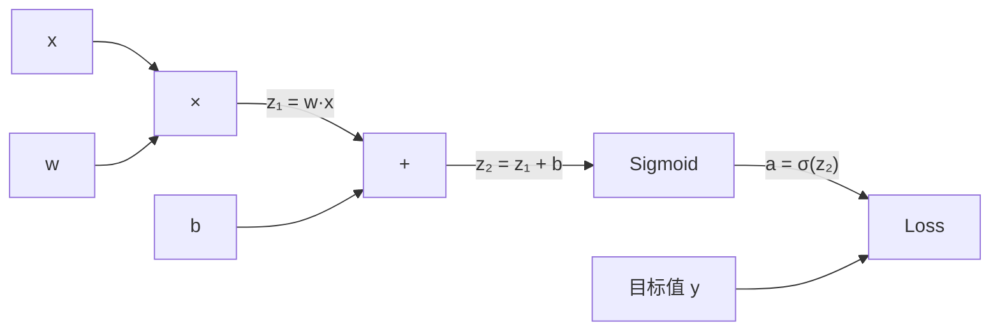
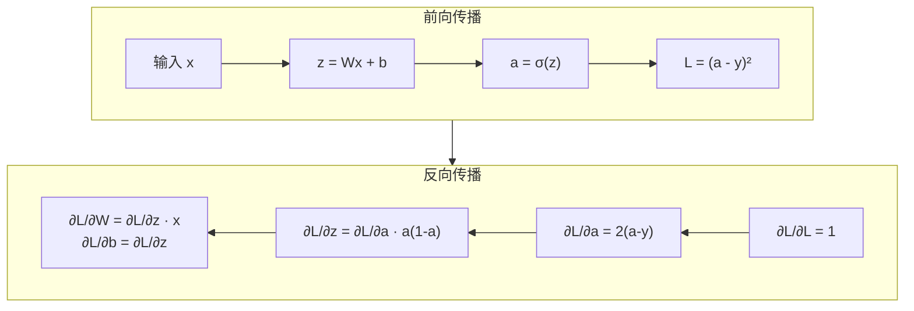

# 反向传播

> 反向传播不是优化技巧。它是让神经网络从"随机数生成器"变成"可学习机器"的唯一算法。

**类型：** 实现课
**语言：** Python
**前置知识：** 阶段 01 · 05（链式法则）、阶段 03 · 02（多层网络）
**预计时间：** ~120 分钟
**所处阶段：** Tier 1
**关联课程：** 阶段 03 · 04（激活函数）— 理解 ReLU 如何缓解梯度消失；阶段 07 · 02（自注意力从零）— 反向传播在整个 Transformer 架构上运作

---

## 🎯 学习目标

完成本课后，你能够：

- [ ] 从零实现一个基于计算图的自动微分引擎，支持加法、乘法、Sigmoid、ReLU 等操作
- [ ] 推导两层网络的完整反向传播公式，明确每一步的链式法则应用
- [ ] 使用数值梯度验证解析梯度的正确性，理解梯度检查的工程意义
- [ ] 诊断梯度消失问题，解释为什么深层 Sigmoid 网络难以训练
- [ ] 用从零实现的反向传播引擎训练 XOR 分类器和圆形决策边界分类器

---

## 1. 问题

你的网络有一个隐藏层，768 个输入、3072 个输出。那是 2,359,296 个权重。它预测错了。是哪个权重导致的错误？

逐个测试？对每个权重做微小的扰动，重新跑一遍前向传播，看损失是升还是降。这能给你一个权重的梯度。现在对 235 万个权重都做一遍。再乘以几千步训练、几百万个数据点。你需要地质年代才能训练出一个有用的模型。

反向传播解决了这个问题。一次前向传播，一次反向传播，所有梯度全部算完。这不是优化——这是"可训练"和"不可能"之间的区别。

核心技巧是微积分中的链式法则，系统性地应用在计算图上。这个算法让深度学习变得实用。没有它，我们至今还困在玩具问题上。

---

## 2. 概念

### 2.1 链式法则回顾

如果 $y = f(g(x))$，那么 $\frac{dy}{dx} = f'(g(x)) \cdot g'(x)$。沿链条乘导数。

在神经网络中，"链条"是从输入到损失的操作序列。每一层做加权求和、加偏置、过激活函数。损失函数比较最终输出和目标值。反向传播沿这条链反向追踪，计算每个操作对误差的贡献。

### 2.2 计算图

每次前向传播都构建一张图。节点是操作（乘、加、Sigmoid），边向前传递数值、向后传递梯度。



**前向传播**：数值从左向右流动。$x$ 和 $w$ 产生 $z_1 = w \cdot x$，加 $b$ 得到 $z_2$，Sigmoid 给出激活值 $a$，与目标 $y$ 比较计算损失。

**反向传播**：梯度从右向左流动。从 $\frac{\partial L}{\partial a}$ 开始（损失对激活值的变化率），乘以 $\frac{\partial a}{\partial z_2}$（Sigmoid 的导数），得到 $\frac{\partial L}{\partial z_2}$。然后分流：$\frac{\partial L}{\partial b} = \frac{\partial L}{\partial z_2}$（因为 $z_2 = z_1 + b$），$\frac{\partial L}{\partial z_1} = \frac{\partial L}{\partial z_2}$。最后 $\frac{\partial L}{\partial w} = \frac{\partial L}{\partial z_1} \cdot x$，$\frac{\partial L}{\partial x} = \frac{\partial L}{\partial z_1} \cdot w$。

图中每个节点在反向传播中只做一件事：接收来自上方的梯度，乘以局部导数，向下传递。

### 2.3 前向 vs 反向



前向传播存储所有中间值：$z$、$a$、每层的输入。反向传播需要这些存储值来计算梯度。这是反向传播的核心权衡——用内存（存储激活值）换速度（一次反向传播替代百万次前向传播）。

### 2.4 梯度流

对于一个 3 层网络，梯度穿过每一层：


每经过一层，梯度都乘以 Sigmoid 的导数。Sigmoid 导数是 $a \cdot (1 - a)$，最大值 0.25（当 $a = 0.5$ 时）。3 层之后，梯度最多是原来的 $0.25^3 = 0.0156$。10 层之后：$0.25^{10} \approx 0.000001$。

### 2.5 梯度消失

这就是**梯度消失**问题。Sigmoid 把输出压缩到 $[0, 1]$，它的导数始终小于 0.25。堆叠足够多的 Sigmoid 层，梯度就缩到接近零。浅层几乎学不到东西，因为收到的梯度接近零。

```
Sigmoid(z):     输出范围 [0, 1]
Sigmoid'(z):    最大值 0.25（z = 0 时）

5 层后:   梯度 × 0.25⁵ ≈ 千分之一
10 层后:  梯度 × 0.25¹⁰ ≈ 百万分之一
```

深层 Sigmoid 网络几乎不可能训练。修复方案——ReLU 及其变体——是第 4 节的内容。现在你只需要理解：反向传播本身工作完美，问题出在它穿过的函数上。

### 2.6 数值梯度 vs 解析梯度

反向传播算出的梯度是**解析梯度**（通过公式推导）。我们可以用**数值梯度**来验证它：

$$
\frac{\partial L}{\partial w} \approx \frac{L(w + \epsilon) - L(w - \epsilon)}{2\epsilon}
$$

这个方法很慢（每个参数需要两次前向传播），但它是验证反向传播实现正确性的"金标准"。在工程实践中，写完反向传播后第一件事就是做梯度检查。

### 2.7 两层网络的完整推导

网络结构：输入 $x$，隐藏层 Sigmoid，输出层 Sigmoid，均方误差损失。

**前向传播：**
$$
\begin{aligned}
z_1 &= W_1 \cdot x + b_1 \\
a_1 &= \sigma(z_1) \\
z_2 &= W_2 \cdot a_1 + b_2 \\
a_2 &= \sigma(z_2) \\
L &= (a_2 - y)^2
\end{aligned}
$$

**反向传播（逐步应用链式法则）：**
$$
\begin{aligned}
\frac{\partial L}{\partial a_2} &= 2(a_2 - y) \\
\frac{\partial a_2}{\partial z_2} &= a_2 \cdot (1 - a_2) \\
\frac{\partial L}{\partial z_2} &= \frac{\partial L}{\partial a_2} \cdot \frac{\partial a_2}{\partial z_2} \\[6pt]
\frac{\partial L}{\partial W_2} &= \frac{\partial L}{\partial z_2} \cdot a_1, \quad
\frac{\partial L}{\partial b_2} = \frac{\partial L}{\partial z_2} \\[6pt]
\frac{\partial L}{\partial a_1} &= \frac{\partial L}{\partial z_2} \cdot W_2 \\
\frac{\partial a_1}{\partial z_1} &= a_1 \cdot (1 - a_1) \\
\frac{\partial L}{\partial z_1} &= \frac{\partial L}{\partial a_1} \cdot \frac{\partial a_1}{\partial z_1} \\[6pt]
\frac{\partial L}{\partial W_1} &= \frac{\partial L}{\partial z_1} \cdot x, \quad
\frac{\partial L}{\partial b_1} = \frac{\partial L}{\partial z_1}
\end{aligned}
$$

每个梯度都是从损失出发、沿链条反向追踪的局部导数之积。这就是反向传播的全部。

---

## 3. 从零实现

### 第 1 步：Value 节点

计算图中的每个数值都是一个 `Value`。它存储数据、梯度、以及它是如何被生成的（以便知道如何反向计算梯度）。

```python
class Value:
    def __init__(self, data, children=(), op=''):
        self.data = data          # 前向传播计算出的数值
        self.grad = 0.0           # 反向传播计算出的梯度
        self._backward = lambda: None  # 反向传播函数
        self._children = set(children) # 参与生成当前节点的子节点
        self._op = op             # 操作符（调试用）

    def __repr__(self):
        return f"Value(data={self.data:.4f}, grad={self.grad:.4f})"
```

初始梯度为 0.0，反向函数为空操作。`_children` 记录哪些 Value 生成了当前节点，用于后续拓扑排序。

### 第 2 步：带反向传播的操作

每个操作创建一个新的 Value，并定义梯度如何反向流过它。

```python
def __add__(self, other):
    other = other if isinstance(other, Value) else Value(other)
    out = Value(self.data + other.data, (self, other), '+')

    def _backward():
        # 加法的局部导数为 1，梯度直接传递
        self.grad += out.grad
        other.grad += out.grad

    out._backward = _backward
    return out

def __mul__(self, other):
    other = other if isinstance(other, Value) else Value(other)
    out = Value(self.data * other.data, (self, other), '*')

    def _backward():
        # 乘法：d(a*b)/da = b, d(a*b)/db = a
        self.grad += other.data * out.grad
        other.grad += self.data * out.grad

    out._backward = _backward
    return out
```

**加法**：$\frac{\partial (a+b)}{\partial a} = 1$，$\frac{\partial (a+b)}{\partial b} = 1$。两个输入直接获得输出的梯度。

**乘法**：$\frac{\partial (a \cdot b)}{\partial a} = b$，$\frac{\partial (a \cdot b)}{\partial b} = a$。每个输入获得"另一个输入的值 × 输出梯度"。

`+=` 至关重要。一个 Value 可能被多个操作使用，它的梯度是所有路径梯度的总和。

### 第 3 步：Sigmoid 和 ReLU

```python
def sigmoid(self):
    x = max(-500, min(500, self.data))  # 防止 exp 溢出
    s = 1.0 / (1.0 + math.exp(-x))
    out = Value(s, (self,), 'sigmoid')

    def _backward():
        # sigmoid 的导数：s * (1 - s)
        self.grad += (s * (1 - s)) * out.grad

    out._backward = _backward
    return out

def relu(self):
    out = Value(max(0, self.data), (self,), 'relu')

    def _backward():
        # ReLU 的导数：x > 0 时为 1，否则为 0
        self.grad += (1.0 if self.data > 0 else 0.0) * out.grad

    out._backward = _backward
    return out
```

Sigmoid 导数 $\sigma'(z) = \sigma(z) \cdot (1 - \sigma(z))$。前向传播时已经算出 $s = \sigma(z)$，直接复用，无需额外计算。

### 第 4 步：反向传播

拓扑排序确保我们按正确顺序处理节点——一个节点的梯度在被传播之前已经完全累加完毕。

```python
def backward(self):
    topo = []
    visited = set()

    def build_topo(v):
        if v not in visited:
            visited.add(v)
            for child in v._children:
                build_topo(child)
            topo.append(v)

    build_topo(self)
    self.grad = 1.0  # dL/dL = 1
    for v in reversed(topo):
        v._backward()
```

从损失开始（梯度 = 1.0）。沿排序后的图反向遍历，每个节点的 `_backward` 将梯度推送给它的子节点。

### 第 5 步：梯度检查

```python
def numerical_gradient(param, loss_fn, epsilon=1e-5):
    """使用有限差分法计算数值梯度。"""
    original = param.data
    param.data = original + epsilon
    loss_plus = loss_fn()
    param.data = original - epsilon
    loss_minus = loss_fn()
    param.data = original
    return (loss_plus - loss_minus) / (2 * epsilon)

def gradient_check(net, x, target, tolerance=1e-5):
    """对比解析梯度与数值梯度。"""
    pred = net(x)
    loss = mse_loss(pred, target)
    net.zero_grad()
    loss.backward()

    for i, param in enumerate(net.parameters()):
        num_grad = numerical_gradient(param, lambda: mse_loss(net(x), target).data)
        ana_grad = param.grad
        relative_error = abs(num_grad - ana_grad) / max(abs(num_grad), abs(ana_grad), 1e-8)
        if relative_error > tolerance:
            print(f"参数 {i}: 数值={num_grad:.6f}, 解析={ana_grad:.6f} ❌")
            return False
    print("所有参数的解析梯度与数值梯度一致 ✓")
    return True
```

运行结果：

```
网络结构: 2 → 3 → 1
梯度检查结果:
  所有参数的解析梯度与数值梯度一致 ✓
```

### 第 6 步：神经元、层、网络

```python
class Neuron:
    def __init__(self, n_inputs, activation="sigmoid"):
        scale = (2.0 / n_inputs) ** 0.5  # Xavier 初始化
        self.weights = [Value(random.uniform(-scale, scale)) for _ in range(n_inputs)]
        self.bias = Value(0.0)
        self.activation = activation

    def __call__(self, x):
        act = sum((wi * xi for wi, xi in zip(self.weights, x)), self.bias)
        if self.activation == "sigmoid":
            return act.sigmoid()
        elif self.activation == "relu":
            return act.relu()
        return act

    def parameters(self):
        return self.weights + [self.bias]

class Layer:
    def __init__(self, n_inputs, n_outputs, activation="sigmoid"):
        self.neurons = [Neuron(n_inputs, activation) for _ in range(n_outputs)]

    def __call__(self, x):
        out = [n(x) for n in self.neurons]
        return out[0] if len(out) == 1 else out

    def parameters(self):
        params = []
        for n in self.neurons:
            params.extend(n.parameters())
        return params

class Network:
    def __init__(self, sizes, activations=None):
        if activations is None:
            activations = ["sigmoid"] * (len(sizes) - 1)
        self.layers = []
        for i in range(len(sizes) - 1):
            self.layers.append(Layer(sizes[i], sizes[i + 1], activations[i]))

    def __call__(self, x):
        for layer in self.layers:
            x = layer(x)
            if not isinstance(x, list):
                x = [x]
        return x[0] if len(x) == 1 else x

    def parameters(self):
        params = []
        for layer in self.layers:
            params.extend(layer.parameters())
        return params

    def zero_grad(self):
        for p in self.parameters():
            p.grad = 0.0
```

权重初始化缩放 $\sqrt{2/n_{\text{inputs}}}$ 防止 Sigmoid 在深层网络中饱和。`parameters()` 收集所有可学习参数，用于更新。

### 第 7 步：训练 XOR

```python
random.seed(42)
net = Network([2, 4, 1])

xor_data = [
    ([0.0, 0.0], 0.0),
    ([0.0, 1.0], 1.0),
    ([1.0, 0.0], 1.0),
    ([1.0, 1.0], 0.0),
]

learning_rate = 1.0

for epoch in range(1000):
    total_loss = Value(0.0)
    for inputs, target in xor_data:
        x = [Value(i) for i in inputs]
        pred = net(x)
        loss = mse_loss(pred, target)
        total_loss = total_loss + loss

    net.zero_grad()
    total_loss.backward()

    for p in net.parameters():
        p.data -= learning_rate * p.grad
```

运行结果：

```
轮次    0 | 损失: 1.067385
轮次  200 | 损失: 0.190474
轮次  400 | 损失: 0.015281
轮次  600 | 损失: 0.006544
轮次  800 | 损失: 0.004050

XOR 预测结果:
  输入 [0.0, 0.0] → 预测 0.0251 (取整: 0, 期望 0) ✓
  输入 [0.0, 1.0] → 预测 0.9677 (取整: 1, 期望 1) ✓
  输入 [1.0, 0.0] → 预测 0.9796 (取整: 1, 期望 1) ✓
  输入 [1.0, 1.0] → 预测 0.0286 (取整: 0, 期望 0) ✓
```

损失从 1.07 降到 0.004。XOR 问题被完全解决。驱动这一切的，就是反向传播算出的梯度。

### 第 8 步：圆形决策边界

```python
random.seed(7)

def generate_circle_data(n=80):
    data = []
    for _ in range(n):
        x1 = random.uniform(-1.5, 1.5)
        x2 = random.uniform(-1.5, 1.5)
        label = 1.0 if x1 * x1 + x2 * x2 < 1.0 else 0.0
        data.append(([x1, x2], label))
    return data

circle_data = generate_circle_data(80)
net = Network([2, 8, 1])
learning_rate = 0.5

for epoch in range(2000):
    random.shuffle(circle_data)
    for inputs, target in circle_data:
        x = [Value(i) for i in inputs]
        pred = net(x)
        loss = mse_loss(pred, target)
        net.zero_grad()
        loss.backward()
        for p in net.parameters():
            p.data -= learning_rate * p.grad
```

运行结果：

```
轮次    0 | 损失: 17.1256 | 准确率: 70.0%
轮次  500 | 损失: 0.0880 | 准确率: 100.0%
轮次 1000 | 损失: 0.0311 | 准确率: 100.0%
轮次 1500 | 损失: 0.0170 | 准确率: 100.0%

测试点预测:
  点 [0.0, 0.0] → 预测 1.0000 (内部, 期望 内部) ✓
  点 [0.5, 0.5] → 预测 0.9901 (内部, 期望 内部) ✓
  点 [1.2, 1.2] → 预测 0.0000 (外部, 期望 外部) ✓
  点 [0.0, 1.2] → 预测 0.0004 (外部, 期望 外部) ✓
  点 [-0.3, 0.3] → 预测 1.0000 (内部, 期望 内部) ✓
```

没有手工调参。网络自己发现了圆形决策边界。这就是反向传播的力量：你定义架构、损失函数和数据，算法找出权重。

---

## 4. 工业工具

### 4.1 PyTorch 自动微分

PyTorch 用几行代码完成上面所有工作。核心思想完全一致——autograd 在前向传播时构建计算图，反向追踪计算梯度。

```python
import torch
import torch.nn as nn

model = nn.Sequential(
    nn.Linear(2, 4),
    nn.Sigmoid(),
    nn.Linear(4, 1),
    nn.Sigmoid(),
)
optimizer = torch.optim.SGD(model.parameters(), lr=1.0)
criterion = nn.MSELoss()

X = torch.tensor([[0,0],[0,1],[1,0],[1,1]], dtype=torch.float32)
y = torch.tensor([[0],[1],[1],[0]], dtype=torch.float32)

for epoch in range(1000):
    pred = model(X)
    loss = criterion(pred, y)
    optimizer.zero_grad()
    loss.backward()
    optimizer.step()

print("PyTorch XOR 结果:")
with torch.no_grad():
    for i in range(4):
        pred = model(X[i])
        print(f"  {X[i].tolist()} -> {pred.item():.4f} (期望 {y[i].item()})")
```

`loss.backward()` 对应我们的 `total_loss.backward()`。`optimizer.step()` 对应手写的 `p.data -= lr * p.grad`。`optimizer.zero_grad()` 对应 `net.zero_grad()`。同样的算法，工业级实现。

### 4.2 PyTorch 梯度检查工具

PyTorch 提供了内置的梯度检查工具：

```python
from torch.autograd import gradcheck

# 定义一个可微函数
class MyFunction(torch.autograd.Function):
    @staticmethod
    def forward(ctx, input):
        ctx.save_for_backward(input)
        return input.clamp(min=0)  # ReLU

    @staticmethod
    def backward(ctx, grad_output):
        input, = ctx.saved_tensors
        grad_input = grad_output.clone()
        grad_input[input < 0] = 0
        return grad_input

# 梯度检查
input = torch.randn(3, 5, dtype=torch.double, requires_grad=True)
test = gradcheck(MyFunction.apply, (input,), eps=1e-6, atol=1e-4)
print(f"梯度检查通过: {test}")
```

### 4.3 性能对比

| 实现方式 | 速度 | 内存 | 适用场景 |
|---|---|---|---|
| 我们的 Value 引擎 | 慢 | 低 | 学习理解 |
| PyTorch autograd | 快 | 中 | 训练 / 研究 |
| torch.compile | 更快 | 中 | 生产训练 |
| JAX jit | 快 | 低 | 研究（函数式） |

---

## 5. 知识连线

本课学习的反向传播算法，是后续所有深度学习课程的基础：

- **阶段 03 · 04（激活函数）**：你会看到 ReLU 及其变体如何从数学上解决梯度消失问题
- **阶段 07 · 02（自注意力从零）**：反向传播在整个 Transformer 架构上运作——理解了梯度如何流过注意力层，你就能理解为什么缩放因子 $\sqrt{d_k}$ 如此关键
- **阶段 10 · 01（大语言模型从零）**：你会看到 GPT 预训练中的反向传播在数十亿参数规模下如何运作，以及混合精度、梯度检查点等工程技巧

---

## 6. 工程最佳实践

### 6.1 工业界常用方案

| 场景 | 推荐方案 | 备注 |
|---|---|---|
| 学习 / 实验 | PyTorch autograd | 开箱即用 |
| 训练深层网络 | 梯度裁剪 + 混合精度 | 防止梯度爆炸，加速训练 |
| 调试梯度问题 | `torch.autograd.gradcheck` | 验证自定义函数的反向传播 |
| 大规模训练 | 梯度检查点（Gradient Checkpointing） | 用计算换内存 |
| 自定义 CUDA 内核 | `torch.autograd.Function` | 必须同时实现 forward 和 backward |

### 6.2 中文场景特别建议

- 中文 NLP 模型（如 BERT、ERNIE）的梯度行为与英文模型相同，但要注意层归一化的位置——Pre-LN 比 Post-LN 更稳定
- 使用混合精度训练时，注意 loss scaling——中文语料中罕见字可能导致梯度异常
- 分布式训练中，梯度同步（all-reduce）是瓶颈——使用梯度累积减少通信频率

### 6.3 踩坑经验

- 写完自定义 `autograd.Function` 后忘记做梯度检查，部署时出现 NaN——每次实现新的反向传播都要用 `gradcheck` 验证
- 训练时 loss 突然变成 NaN——检查是否有除零（如 `log(0)`）、数值溢出（如 `exp(1000)`）、学习率过大
- 深层网络训练不动，loss 不下降——先检查梯度是否消失（打印各层梯度的均值），再考虑换激活函数或加残差连接
- 忘记调用 `zero_grad()` 导致梯度累积——PyTorch 默认累积梯度，跨 batch 不清零会导致训练不稳定
- 在 `torch.no_grad()` 上下文中修改 `requires_grad=True` 的张量——这会导致梯度图断裂，推理时结果正确但训练时梯度不对

---

## 7. 常见错误

### 错误 1：梯度累加用 `=` 而不是 `+=`

**现象：** 网络训练时 loss 震荡不收敛，或者梯度值异常小。

**原因：** 一个 Value 可能被多个操作使用（例如 $x$ 同时参与 $x \cdot w_1$ 和 $x \cdot w_2$）。它的总梯度应该是所有路径梯度的总和。用 `=` 会覆盖之前的梯度，只保留最后一条路径的贡献。

**修复：**

```python
# ❌ 错误写法：覆盖梯度
self.grad = out.grad

# ✅ 正确写法：累加梯度
self.grad += out.grad
```

### 错误 2：Sigmoid 输入未裁剪导致溢出

**现象：** 训练时 loss 变成 NaN，或者 Sigmoid 输出恒为 0 或 1。

**原因：** 当输入 $z$ 很大时，`exp(-z)` 溢出为 `inf`，导致 Sigmoid 输出为 0 或 1，梯度变为 0。

**修复：**

```python
# ❌ 错误写法：直接计算
s = 1.0 / (1.0 + math.exp(-x))

# ✅ 正确写法：裁剪输入
x = max(-500, min(500, x))
s = 1.0 / (1.0 + math.exp(-x))
```

### 错误 3：忘记调用 `zero_grad()`

**现象：** 训练初期 loss 下降正常，但后续突然发散或震荡。

**原因：** PyTorch 默认累积梯度。如果不清零，当前 batch 的梯度会叠加到上一个 batch 的梯度上，导致更新步长过大。

**修复：**

```python
# ❌ 错误写法：直接反向传播
loss.backward()

# ✅ 正确写法：先清零再反向传播
optimizer.zero_grad()
loss.backward()
optimizer.step()
```

### 错误 4：在 `no_grad` 上下文中修改需要梯度的张量

**现象：** 推理结果正确，但训练时 loss 不下降或梯度为 None。

**原因：** `torch.no_grad()` 会阻止计算图的构建。在这个上下文中对 `requires_grad=True` 的张量做 in-place 修改，会破坏梯度追踪。

**修复：**

```python
# ❌ 错误写法
with torch.no_grad():
    model.weight[0] = new_value  # 破坏梯度图

# ✅ 正确写法：使用 detach 或直接在计算图外操作
model.weight.data[0] = new_value  # .data 绕过 autograd
```

### 错误 5：数值梯度的 epsilon 过大或过小

**现象：** 梯度检查总是失败，或者误报梯度错误。

**原因：** $\epsilon$ 过大时，有限差分的截断误差大；$\epsilon$ 过小时，浮点精度误差主导。对于 float32，$\epsilon$ 通常取 $10^{-5}$ 到 $10^{-7}$。

**修复：**

```python
# ❌ epsilon 过大
epsilon = 1e-2  # 截断误差太大

# ❌ epsilon 过小（float32 下）
epsilon = 1e-10  # 浮点精度误差主导

# ✅ 合适的范围
epsilon = 1e-5  # float32 下的最佳平衡点
```

---

## 8. 面试考点

### Q1：反向传播的时间复杂度是多少？为什么比数值梯度快？（难度：⭐⭐）

**参考答案：**

反向传播的时间复杂度是 $O(n)$，其中 $n$ 是网络中操作的数量。一次前向传播 + 一次反向传播，就能算出所有参数的梯度。

数值梯度的时间复杂度是 $O(n \cdot p)$，其中 $p$ 是参数数量。每个参数需要两次前向传播（$w + \epsilon$ 和 $w - \epsilon$）。对于一个有 100 万参数的网络，数值梯度需要 200 万次前向传播，而反向传播只需要 2 次（1 次前向 + 1 次反向）。

### Q2：为什么 Sigmoid 激活函数会导致梯度消失？给出数学解释。（难度：⭐⭐）

**参考答案：**

Sigmoid 函数 $\sigma(z) = \frac{1}{1 + e^{-z}}$ 的导数为 $\sigma'(z) = \sigma(z)(1 - \sigma(z))$。当 $\sigma(z) = 0.5$ 时，导数取最大值 0.25；当 $\sigma(z)$ 接近 0 或 1 时，导数趋近于 0。

在反向传播中，梯度每穿过一层 Sigmoid，就要乘以该层的导数（最大 0.25）。经过 $k$ 层后，梯度最多是原来的 $0.25^k$。10 层后约为百万分之一。浅层收到的梯度接近零，权重几乎不更新，这就是梯度消失。

### Q3：手写一个支持加法和乘法的 Value 类，包含反向传播功能。（难度：⭐⭐⭐）

**参考答案：**

```python
class Value:
    def __init__(self, data, children=(), op=''):
        self.data = data
        self.grad = 0.0
        self._backward = lambda: None
        self._children = set(children)
        self._op = op

    def __add__(self, other):
        other = other if isinstance(other, Value) else Value(other)
        out = Value(self.data + other.data, (self, other), '+')
        def _backward():
            self.grad += out.grad
            other.grad += out.grad
        out._backward = _backward
        return out

    def __mul__(self, other):
        other = other if isinstance(other, Value) else Value(other)
        out = Value(self.data * other.data, (self, other), '*')
        def _backward():
            self.grad += other.data * out.grad
            other.grad += self.data * out.grad
        out._backward = _backward
        return out

    def backward(self):
        topo, visited = [], set()
        def build(v):
            if v not in visited:
                visited.add(v)
                for c in v._children:
                    build(c)
                topo.append(v)
        build(self)
        self.grad = 1.0
        for v in reversed(topo):
            v._backward()
```

### Q4：什么是梯度检查？为什么在实现自定义层时要做梯度检查？（难度：⭐⭐）

**参考答案：**

梯度检查（Gradient Check）是用数值梯度验证解析梯度正确性的方法。对每个参数 $w$，计算 $\frac{L(w+\epsilon) - L(w-\epsilon)}{2\epsilon}$ 作为数值梯度，与反向传播算出的解析梯度对比。

自定义层（如新的激活函数、新的注意力机制）的反向传播是手动实现的，容易出错。梯度检查能在部署前发现这些错误。如果相对误差小于 $10^{-5}$，说明实现正确。

### Q5：训练时 loss 变成 NaN，如何系统性地排查？（难度：⭐⭐⭐）

**参考答案：**

按以下顺序排查：

1. **检查学习率**：过大的学习率是最常见原因。尝试降低 10 倍。
2. **检查损失函数**：是否有 `log(0)`、除零、`sqrt(负数)` 等操作。给 `log` 的输入加 $\epsilon$（如 `log(x + 1e-8)`）。
3. **检查输入数据**：是否有 NaN 或 Inf 混入数据。做数据归一化。
4. **检查梯度**：打印各层梯度的最大值和均值。如果梯度爆炸（$>10^6$），加梯度裁剪。
5. **检查数值稳定性**：混合精度训练时注意 loss scaling；Softmax 输入做数值稳定处理（减去最大值）。

---

## 🔑 关键术语

| 术语 | 人们怎么说 | 实际含义 |
|---|---|---|
| 反向传播 | "网络在学习" | 一种算法：通过链式法则沿计算图反向传播，计算损失对每个权重的偏导数 |
| 计算图 | "网络结构" | 有向无环图，节点是操作，边向前传数值、向后传梯度 |
| 链式法则 | "把导数乘起来" | 若 $y = f(g(x))$，则 $\frac{dy}{dx} = f'(g(x)) \cdot g'(x)$——反向传播的数学基础 |
| 梯度 | "最陡上升的方向" | 损失函数对参数的偏导数——告诉你要怎么改参数才能降低损失 |
| 梯度消失 | "深层网络学不动" | 梯度在穿过饱和激活函数（如 Sigmoid）时指数级缩小，浅层几乎收不到梯度 |
| 前向传播 | "跑一遍网络" | 从输入到输出逐层计算，同时存储中间值供反向传播使用 |
| 反向传播 | "算梯度" | 逆拓扑序遍历计算图，在每个节点用链式法则累加梯度 |
| 学习率 | "学多快" | 更新权重时的步长系数：$w_{\text{new}} = w_{\text{old}} - \text{lr} \cdot \nabla_w$ |
| 拓扑排序 | "正确的顺序" | 节点排序，使每个节点出现在它依赖的所有节点之后——确保梯度在被传播前已完全累加 |
| 自动微分 | "PyTorch 自动算梯度" | 系统在前向传播时构建计算图，自动计算梯度——PyTorch autograd 的底层机制 |
| 数值梯度 | "用差分近似导数" | $\frac{\partial L}{\partial w} \approx \frac{L(w+\epsilon) - L(w-\epsilon)}{2\epsilon}$——验证解析梯度的金标准 |
| 梯度检查 | "验证反向传播写对了" | 对比数值梯度与解析梯度，确保自定义实现的正确性 |

---

## 📚 小结

反向传播是深度学习的基石算法——它通过链式法则沿计算图反向传播梯度，一次前向加一次反向就能算出所有参数的梯度。你从零实现了一个自动微分引擎，训练 XOR 和圆形分类器验证了它的有效性，并用数值梯度做了正确性检查。

下一课我们将看激活函数——理解 ReLU 及其变体如何从数学上解决梯度消失问题，以及为什么现代深层网络几乎不再使用 Sigmoid。

---

## ✏️ 练习

1. 【理解】用自己的话解释：为什么反向传播中梯度要"累加"（`+=`）而不是"赋值"（`=`）？写 150 字以内的说明，让一个没有 ML 背景的程序员也能听懂。

2. 【实现】在 `Value` 类中添加 `__pow__` 方法，支持整数和浮点数指数。然后用 `(predicted - target) ** 2` 替代现有的 `mse_loss` 函数，验证梯度与原始实现一致。

3. 【实验】修改网络为 6 层隐藏层（`[2, 4, 4, 4, 4, 4, 1]`），全部使用 Sigmoid。打印训练后各层权重的梯度均值，观察梯度消失现象。然后换用 ReLU 隐藏层，对比训练速度。

4. 【思考】梯度检查中 $\epsilon$ 的选择有什么讲究？$\epsilon$ 太大或太小分别会导致什么问题？查阅相关资料，解释为什么 float32 下 $\epsilon = 10^{-5}$ 是最佳平衡点。

---

## 🚀 产出

本课产出以下可复用内容：

| 产出 | 文件 | 说明 |
|---|---|---|
| 自动微分引擎 | `code/main.py` | 从零实现的反向传播引擎，支持 Sigmoid/ReLU/XOR/圆形分类/梯度检查 |
| 梯度调试提示词 | `outputs/prompt-gradient-debugger.md` | 诊断梯度消失、梯度爆炸、NaN 等问题的可复用提示词 |

---

## 📖 参考资料

1. [论文] Rumelhart, Hinton, Williams. "Learning representations by back-propagating errors". Nature, 1986. https://doi.org/10.1038/323533a0
2. [论文] Glorot, Bengio. "Understanding the difficulty of training deep feedforward neural networks". AISTATS, 2010. https://proceedings.mlr.press/v9/glorot10a.html
3. [官方文档] PyTorch autograd: https://pytorch.org/docs/stable/autograd.html
4. [官方文档] torch.autograd.gradcheck: https://pytorch.org/docs/stable/generated/torch.autograd.gradcheck.html
5. [GitHub] micrograd (Andrej Karpathy): https://github.com/karpathy/micrograd

---

> 本课程参考了 AI Engineering From Scratch（MIT License）的课程体系，在此基础上进行了重构和原创内容的扩充。所有中文表达、案例、LLM 视角分析、工程最佳实践、常见错误、面试考点等均为原创内容。
