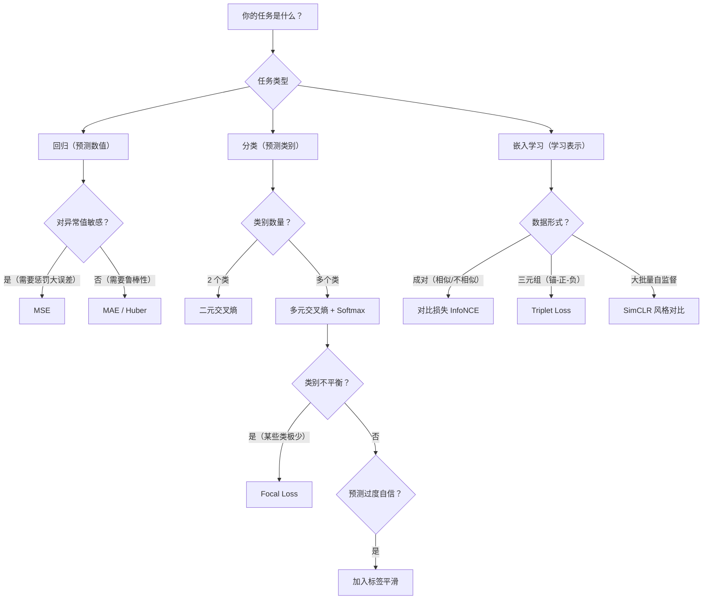

# 损失函数

> 模型优化的不是准确率，不是 F1 分数，而是损失函数。选错了损失函数，模型会精准地优化一个你根本不关心的东西。

**类型：** 实现课
**语言：** Python
**前置知识：** 阶段 03 · 03（反向传播）、阶段 03 · 04（激活函数）
**预计时间：** ~90 分钟
**所处阶段：** Tier 1
**关联课程：** 阶段 07 · 03（多头注意力）— 注意力权重的训练由损失函数驱动；阶段 10 · 02（从头构建大语言模型）— 语言模型的交叉熵损失

---

## 🎯 学习目标

完成本课后，你能够：

- [ ] 从零实现 MSE、MAE、Huber 损失及其梯度，解释各自对异常值的敏感度差异
- [ ] 实现二元交叉熵和多元交叉熵，解释 MSE 为什么不适合分类任务
- [ ] 实现 Focal Loss，解释其在类别不平衡场景下的工作机制
- [ ] 实现对比损失（InfoNCE）和 Triplet Loss，理解度量学习的训练范式
- [ ] 根据任务类型（回归/分类/嵌入学习）选择合适的损失函数和超参数

---

## 1. 问题

你训练了一个二分类模型。数据集两类各占 50%，你用均方误差（MSE）作为损失函数。训练结束后，模型的损失为 0.25，看起来"还行"。但你查看预测结果时发现——模型对每个样本都输出 0.5。

它什么都没学，但它确实最小化了损失函数。

这不是 bug，是数学。MSE 在平衡二分类问题上，当模型对所有样本预测 0.5 时达到最小值 0.25。没有学习任何有用模式，但损失函数已经"满意"了。换成交叉熵损失（BCE），同样的 0.5 预测对应的损失是 0.693——模型被迫向 0 或 1 推进，因为 BCE 会残酷地惩罚"自信的错误"。

问题比这更严重。在自监督学习中，根本没有标签。对比损失定义了整个学习信号：什么是相似、什么是不同、分开的力度有多大。如果对比损失的温度参数设得不好，所有输入会被映射到同一个向量——损失为零，嵌入空间完全坍缩，模型毫无用处。

损失函数是模型**唯一在优化的东西**。准确率、召回率、F1 分数——这些你汇报给老板的指标，模型完全不在乎。优化器只看损失函数的梯度。如果损失函数不能精确表达你真正想要的，模型就会找到在数学上满足损失、在工程上毫无价值的解。这不是模型的问题，是你给它定的目标有问题。

---

## 2. 概念

### 2.1 损失函数的三大家族

```
                    损失函数的"家谱"
                    
┌─────────────────────────────────────────────────────────┐
│                      你的任务是什么？                      │
└──────────────┬──────────────────┬───────────────────────┘
               │                  │
        ┌──────▼──────┐    ┌──────▼──────┐
        │   预测数值   │    │   预测类别   │
        │  (回归)     │    │  (分类)     │
        └──────┬──────┘    └──────┬──────┘
               │                  │
    ┌──────────▼──────────┐  ┌───▼─────────────────┐
    │ 异常值敏感？          │   │二分类？    多分类？  │
    │ · 是 → MSE          │   │ · 二元交叉熵  · 多元交叉熵 │
    │ · 否 → MAE / Huber  │   │ · 不平衡？→ Focal Loss   │
    └─────────────────────┘   │ · 过度自信？→ 标签平滑     │
                              └──────────────────────┘

            ┌─────────────────────────────┐
            │      学习表示 / 嵌入         │
            │ · 成对数据 → 对比损失 (InfoNCE) │
            │ · 三元组    → Triplet Loss    │
            │ · SVM 风格  → Hinge Loss      │
            └─────────────────────────────┘
```

### 2.2 回归损失：MSE / MAE / Huber

**均方误差（MSE）**：最经典的回归损失。

$$\text{MSE} = \frac{1}{n}\sum_{i=1}^{n}(y_i - \hat{y}_i)^2$$

误差越大，惩罚越重——误差为 10 时的惩罚是误差为 1 时的 100 倍。这是优点也是缺点：MSE 会让模型拼命修正大误差样本（异常值），可能损害整体性能。

**平均绝对误差（MAE）**：

$$\text{MAE} = \frac{1}{n}\sum_{i=1}^{n}|y_i - \hat{y}_i|$$

线性惩罚，对大误差不那么敏感，因此对异常值更鲁棒。但梯度大小恒为 1，不随误差减小而衰减。

**Huber 损失**：结合两者的优点。

$$
L_\delta(x) = \begin{cases} \frac{1}{2}x^2 & |x| \leq \delta \\ \delta(|x| - \frac{1}{2}\delta) & |x| > \delta \end{cases}
$$

小误差时表现如 MSE（平滑可导），大误差时表现如 MAE（梯度为常数，不被异常值主导）。$\delta$ 是两种行为的切换阈值，通常取 1.0。

### 2.3 分类损失：交叉熵

**二元交叉_entropy（BCE）**：

$$\text{BCE} = -\frac{1}{n}\sum_{i=1}^{n}\left[y_i\log(\hat{p}_i) + (1-y_i)\log(1-\hat{p}_i)\right]$$

其中 $y_i \in \{0, 1\}$ 是真实标签，$\hat{p}_i$ 是模型预测的概率。

对数的形状决定了 BCE 的核心特性：当真实标签为 1 而预测为 0.99 时，损失仅 0.01；预测为 0.01 时，损失达 4.6——**460 倍的差距**。这就是交叉熵能惩罚"自信的错误"的原因。

**多元交叉_entropy（CCE）**：

$$\text{CCE} = -\sum_{c=1}^{C}y_c\log(p_c)$$

因为 one-hot 标签中只有一个 $y_c = 1$，实际上只对真实类别的概率取对数。Softmax 负责将 logits 转为概率分布。

**Softmax + CCE 的梯度之美**：两者联合对 logits 的梯度简化为 $\hat{p}_c - y_c$ —— 预测概率减真实标签。真实类别的梯度是"概率 - 1"（负值，需要增大），其他类别的梯度是"概率 - 0"（正值，需要减小）。形式极其简洁，这不是巧合，是 Softmax 和 CCE 天然配对的原因。

### 2.4 为什么 MSE 不适合分类

```
预测值 p (真实标签 y = 1) 对应的损失和梯度：

    损失                        梯度 (绝对值)
    │                           │
4.6 ┤      · ╱ BCE              │      · ╱ BCE
    │     ·╱                    │     ╱·
2.3 ┤    ·╱                     │    ╱ ·  ← 梯度持续增大
    │   ·╱                      │   ╱ ·
0.7 ┤  ·╱                       │  ╱ ·     当预测错误时
    │ ·╱                        │ ╱ ·
0.25┤·╱ ← MSE 最小值           │╱  ·  ← MSE 梯度
0.1 ┤╱ ·                       ├─·──────  趋近于 0
0.01┤  · ← BCE 几乎为 0        │  ·
    └──┬──┬──┬──┬──→ p         └──┬──┬──┬──┬──→ p
      0.1 0.5 0.9 0.99            0.1 0.5 0.9 0.99
```

MSE 在 $p$ 接近 0 或 1 时梯度趋近于零（sigmoid 饱和区），导致学习停滞。交叉熵的梯度恰好补偿了 sigmoid 的饱和特性——预测越错，梯度越大，产生极强的修正信号。

### 2.5 标签平滑（Label Smoothing）

标准 one-hot 标签说"这是 100% 的第三类"。标签平滑把它软化为"这是 90% 的第三类，其他各类各占 1%"：

$$q(k) = (1 - \epsilon)\,\delta(k, y) + \frac{\epsilon}{K}$$

其中 $\epsilon$ 是平滑强度（通常 0.1），$K$ 是类别数。

为什么有效：追求概率恰好为 1.0 需要把 logit 推向无穷大。这会导致模型过度自信、泛化能力下降。标签平滑将目标从 1.0 降到 0.91（$\epsilon=0.1, K=10$ 时），让 logits 保持在合理范围内。GPT 系列和大语言模型普遍使用标签平滑或其变体。

### 2.6 Focal Loss：处理类别不平衡

标准交叉熵对所有样本一视同仁。在极端不平衡数据中（如目标检测中 99% 是背景），易分类的负样本贡献了绝大部分损失梯度，模型被"淹没"在简单样本中。

$$\text{FL}(p_t) = -\alpha_t(1 - p_t)^\gamma\log(p_t)$$

其中 $p_t$ 是模型对真实类别的预测概率，$\gamma$ 是聚焦参数（默认 2.0）。

$(1 - p_t)^\gamma$ 是核心创新：当样本已被正确分类（$p_t = 0.9$），权重为 $(0.1)^2 = 0.01$，几乎被忽略；当样本难以分类（$p_t = 0.1$），权重为 $(0.9)^2 = 0.81$，保留几乎全部梯度。模型被强制聚焦于"硬骨头"。

### 2.7 度量学习损失：对比学习与三元组学习

在没有类别标签的情况下，模型如何学习有意义的表示？度量学习通过定义"相似/不相似"来构造学习信号。

**对比损失（InfoNCE / NT-Xent）**——SimCLR、CLIP 的核心：

$$\mathcal{L} = -\log\frac{\exp(\text{sim}(z_i, z_j)/\tau)}{\sum_{k}\exp(\text{sim}(z_i, z_k)/\tau)}$$

将正样本对与所有负样本对对比，温度 $\tau$ 控制分布锐度。$\tau$ 越小，模型越需要把正样本对和负样本对清晰分开；$\tau$ 为可学习参数时（CLIP），模型自动调节。

**Triplet Loss**：给定锚点（anchor）、正样本、负样本：

$$\mathcal{L} = \max(0, d(a, p) - d(a, n) + \text{margin})$$

要求负样本比正样本至少远 margin。不足则产生梯度，满足则停止更新（浪费在简单三元组上）。实践中需要"困难三元组挖掘"来选择合适的负样本。

### 2.8 其他损失函数速览

| 损失函数 | 核心思想 | 典型场景 |
|---|---|---|
| **Hinge Loss** | 最大化类别间隔 | SVM、最大间隔分类 |
| **感知损失** | 在特征空间而非像素空间比较 | 图像生成、超分辨率 |
| **KL 散度** | 衡量两个概率分布的差异 | 知识蒸馏、VAE |

### 2.9 损失函数选择决策树



---

## 3. 从零实现

### 第 1 步：回归损失 MSE / MAE / Huber

```python
def mse(predictions, targets):
    """均方误差：大误差受到二次惩罚。"""
    n = len(predictions)
    total = 0.0
    for p, t in zip(predictions, targets):
        total += (p - t) ** 2
    return total / n

def mse_gradient(predictions, targets):
    """MSE 梯度 = 2 * (预测 - 真实) / n，线性于误差。"""
    n = len(predictions)
    return [2.0 * (p - t) / n for p, t in zip(predictions, targets)]

def huber_loss(predictions, targets, delta=1.0):
    """Huber 损失：小误差用 MSE，大误差用 MAE。"""
    n = len(predictions)
    total = 0.0
    for p, t in zip(predictions, targets):
        error = abs(p - t)
        if error <= delta:
            total += 0.5 * error ** 2      # MSE 区域：平滑
        else:
            total += delta * (error - 0.5 * delta)  # MAE 区域：线性
    return total / n
```

### 第 2 步：二元交叉熵（含数值稳定性）

```python
def binary_cross_entropy(predictions, targets, eps=1e-15):
    """二元交叉熵。

    eps 裁剪至关重要：如果模型对正样本预测恰好为 0，
    log(0) = -inf 会导致梯度爆炸。裁剪到 [eps, 1-eps] 避免此问题。
    """
    n = len(predictions)
    total = 0.0
    for p, t in zip(predictions, targets):
        p_clipped = max(eps, min(1 - eps, p))
        total += -(t * math.log(p_clipped) + (1 - t) * math.log(1 - p_clipped))
    return total / n
```

### 第 3 步：Softmax + 多元交叉熵

```python
def softmax(logits):
    """数值稳定的 Softmax：先减去最大值防止 exp 溢出。"""
    max_val = max(logits)
    exps = [math.exp(x - max_val) for x in logits]
    total = sum(exps)
    return [e / total for e in exps]

def cce_gradient(logits, target_index):
    """Softmax + CCE 的联合梯度：简洁优美。

    梯度 = 预测概率 - 真实标签（0 或 1）。
    这是 Softmax 和 CCE 天然配对的原因。
    """
    probs = softmax(logits)
    grads = list(probs)
    grads[target_index] -= 1.0
    return grads
```

### 第 4 步：标签平滑

```python
def label_smoothed_cce(logits, target_index, num_classes, alpha=0.1):
    """标签平滑的多元交叉熵。

    将 one-hot [0,0,1,0] 替换为 [0.025, 0.025, 0.925, 0.025]。
    alpha 越大，标签越平滑，模型越不容易过度自信。
    """
    probs = softmax(logits)
    loss = 0.0
    for i in range(num_classes):
        if i == target_index:
            smooth_target = 1.0 - alpha + alpha / num_classes
        else:
            smooth_target = alpha / num_classes
        p = max(1e-15, probs[i])
        loss += -smooth_target * math.log(p)
    return loss
```

### 第 5 步：Focal Loss

```python
def focal_loss_binary(predictions, targets, gamma=2.0, alpha=0.25):
    """Focal Loss：聚焦于难分类样本。

    (1 - p_t)^gamma 是权重衰减因子：
    - 易分类样本（p_t ≈ 0.9）：权重 ≈ 0.01，几乎被忽略
    - 难分类样本（p_t ≈ 0.1）：权重 ≈ 0.81，保留充分梯度
    """
    n = len(predictions)
    total = 0.0
    for p, t in zip(predictions, targets):
        p_clipped = max(1e-15, min(1 - 1e-15, p))
        if t == 1:
            p_t, weight = p_clipped, alpha
        else:
            p_t, weight = 1 - p_clipped, 1 - alpha
        total += -weight * ((1 - p_t) ** gamma) * math.log(p_t)
    return total / n
```

### 第 6 步：对比损失（InfoNCE）

```python
def cosine_similarity(a, b):
    """余弦相似度：衡量两个向量的方向一致性。"""
    dot = sum(x * y for x, y in zip(a, b))
    norm_a = math.sqrt(sum(x * x for x in a))
    norm_b = math.sqrt(sum(x * x for x in b))
    if norm_a < 1e-10 or norm_b < 1e-10:
        return 0.0
    return dot / (norm_a * norm_b)

def contrastive_loss(anchor, positive, negatives, temperature=0.07):
    """对比损失：拉近正样本，推远负样本。

    温度 tau 控制锐度：tau 越小，对不完美分离的惩罚越大。
    SimCLR 默认 tau=0.07。
    """
    sim_pos = cosine_similarity(anchor, positive) / temperature
    sim_negs = [cosine_similarity(anchor, neg) / temperature for neg in negatives]

    max_sim = max(sim_pos, max(sim_negs)) if sim_negs else sim_pos
    exp_pos = math.exp(sim_pos - max_sim)
    exp_negs = [math.exp(s - max_sim) for s in sim_negs]
    total_exp = exp_pos + sum(exp_negs)

    return -math.log(max(1e-15, exp_pos / total_exp))
```

### 第 7 步：MSE vs BCE 分类对比实验

```python
def sigmoid(x):
    x = max(-500, min(500, x))
    return 1.0 / (1.0 + math.exp(-x))

class LossComparisonNetwork:
    """两输入 → 8 隐藏单元 → 1 输出的对比网络。"""

    def __init__(self, loss_type="bce", hidden_size=8, lr=0.1):
        random.seed(0)
        self.loss_type = loss_type
        self.lr = lr
        # 初始化权重
        self.w1 = [[random.gauss(0, 0.5) for _ in range(2)]
                   for _ in range(hidden_size)]
        self.b1 = [0.0] * hidden_size
        self.w2 = [random.gauss(0, 0.5) for _ in range(hidden_size)]
        self.b2 = 0.0

    def forward(self, x):
        """前向传播，缓存中间值。"""
        self.h = []
        for i in range(self.hidden_size):
            z = self.w1[i][0] * x[0] + self.w1[i][1] * x[1] + self.b1[i]
            self.h.append(max(0.0, z))  # ReLU
        self.z2 = sum(self.w2[i] * self.h[i] for i in range(self.hidden_size)) + self.b2
        self.out = sigmoid(self.z2)
        return self.out

    def backward(self, target):
        """反向传播，根据损失类型调整梯度。"""
        if self.loss_type == "mse":
            d_loss = 2.0 * (self.out - target)
        else:  # BCE：-p 接近 0 时梯度爆炸
            eps = 1e-15
            p = max(eps, min(1 - eps, self.out))
            d_loss = -(target / p) + (1 - target) / (1 - p)
        # ... 后续反向传播省略（完整代码见 code/main.py）
```

运行结果展示：

```text
--- 使用 MSE 训练 ---
    Epoch   0: loss=0.1314, accuracy=92.0%
    Epoch  50: loss=0.0145, accuracy=98.0%
    Epoch 100: loss=0.0097, accuracy=99.0%
    Epoch 150: loss=0.0065, accuracy=100.0%
    Epoch 199: loss=0.0044, accuracy=100.0%

--- 使用 BCE 训练 ---
    Epoch   0: loss=0.3130, accuracy=92.0%
    Epoch  50: loss=0.0374, accuracy=98.0%
    Epoch 100: loss=0.0313, accuracy=99.0%
    Epoch 150: loss=0.0255, accuracy=99.0%
    Epoch 199: loss=0.0150, accuracy=99.0%
```

---

## 4. 工业工具

### 4.1 PyTorch 内置损失函数

```python
import torch
import torch.nn as nn
import torch.nn.functional as F

# ---- 回归损失 ----
predictions = torch.tensor([0.9, 0.1, 0.7], requires_grad=True)
targets = torch.tensor([1.0, 0.0, 1.0])

mse_loss = F.mse_loss(predictions, targets)
l1_loss = F.l1_loss(predictions, targets)      # MAE
huber = F.huber_loss(predictions, targets, delta=1.0)

# ---- 分类损失 ----
# BCE（输入是概率，不是 logit）
bce_loss = F.binary_cross_entropy(predictions, targets)
# BCE with Logits（输入是 logit，内部自动加 sigmoid——数值更稳定）
logits = torch.tensor([2.0, -1.0, 0.5])
bce_logits = F.binary_cross_entropy_with_logits(logits, targets)

# 多元交叉熵（输入 logit，内部自动 log_softmax）
logits_multi = torch.randn(4, 10)
labels = torch.tensor([3, 7, 1, 9])
ce_loss = F.cross_entropy(logits_multi, labels)
ce_smooth = F.cross_entropy(logits_multi, labels, label_smoothing=0.1)  # 标签平滑
```

### 4.2 Focal Loss 实现（PyTorch）

```python
class FocalLoss(nn.Module):
    """多分类 Focal Loss。

    适用于极端不平衡数据集，如目标检测、异常检测。
    """
    def __init__(self, gamma=2.0, alpha=None, reduction="mean"):
        super().__init__()
        self.gamma = gamma
        self.alpha = alpha        # 各类别权重
        self.reduction = reduction

    def forward(self, inputs, targets):
        # 计算交叉熵（不 reduction）
        ce = F.cross_entropy(inputs, targets, reduction="none")
        # p_t 是模型对真实类别的预测概率
        p_t = torch.exp(-ce)
        # Focal 权重：(1 - p_t)^gamma
        focal_weight = (1 - p_t) ** self.gamma
        loss = focal_weight * ce
        if self.alpha is not None:
            alpha_t = self.alpha[targets]
            loss = alpha_t * loss
        return loss.mean() if self.reduction == "mean" else loss.sum()
```

### 4.3 对比学习：使用 PyTorch Metric Learning

```python
# pip install pytorch-metric-learning
import torch
from pytorch_metric_learning.losses import NTXentLoss

# NT-Xent 损失（SimCLR / CLIP 风格）
# 输入：嵌入向量和对应的标签（标签指示正样本对）
ntxent_loss = NTXentLoss(temperature=0.07)

embeddings = torch.randn(32, 128)       # 批量 32，嵌入维度 128
labels = torch.randint(0, 8, (32,))     # 8 个类别

loss = ntxent_loss(embeddings, labels)
loss.backward()
```

### 4.4 性能与稳定性对比

| 场景 | 不推荐 | 推荐 | 原因 |
|---|---|---|---|
| 分类损失 | `softmax` + `log` + `nll_loss` | `F.cross_entropy` | 一步完成，数值更稳定 |
| 二分类损失 | `torch.sigmoid` + `F.mse_loss` | `F.binary_cross_entropy_with_logits` | 避免 log(0)，sigmoid+logit 一步完成 |
| 对比损失 | 手写 naive 实现 | `pytorch-metric-learning` | 包含困难样本挖掘、数值稳定处理 |
| 大模型训练 | 硬标签交叉熵 | 标签平滑或知识蒸馏 | 防止 logits 爆炸，提升校准度 |

---

## 5. 知识连线

本课学习的损失函数，是后续所有课程训练的"指挥棒"：

- **阶段 03 · 04（激活函数）**：Softmax（激活函数）和交叉熵（损失函数）在前两课分别学习，本课你理解了它们必须配对使用的数学原理。
- **阶段 07 · 03（多头注意力）**：注意力权重的训练完全由损失函数驱动——理解损失如何流动，才能理解注意力如何学习。
- **阶段 10 · 02（从头构建大语言模型）**：语言模型的核心损失是交叉熵——在整个词表上计算、海量样本上平均。本课的多元交叉熵实现是其基础。
- **阶段 12 · 多模态 AI**：CLIP 的图文对齐训练使用对比损失（InfoNCE），正是本课第 6 步的变体。

---

## 6. 工程最佳实践

### 6.1 工业界常用方案

| 场景 | 推荐损失函数 | 关键参数 | 备注 |
|---|---|---|---|
| 回归（无异常值） | MSE | — | 默认选择 |
| 回归（有异常值） | Huber Loss | delta=1.0 | 房价预测等场景 |
| 二分类 | BCE with Logits | — | 数值比 BCE 稳定 |
| 多分类 | 交叉熵 + 标签平滑 | alpha=0.1 | 大模型标配 |
| 极端不平衡 | Focal Loss | gamma=2.0, alpha=0.25 | 目标检测、异常检测 |
| 自监督学习 | NT-Xent / InfoNCE | temperature=0.07 | SimCLR / MoCo |
| 知识蒸馏 | KL 散度 | temperature=4-20 | 需要软目标 |

### 6.2 中文场景特别建议

- **目标检测中的中文场景**：数据集中小目标（如中文招牌上的小字）占比极低时，标准 BCE 会忽略小目标。推荐使用 Focal Loss 或 GIoU Loss 替代。
- **文本分类的类别不平衡**：中文情感数据集中"中性"类往往占大多数，使用 Focal Loss 或类别加权的交叉熵。
- **多标签中文分类**：一条新闻可同时属于多个类别（"科技"+"经济"），应使用 BCE（而非 Softmax + CCE），因为各类别不是互斥的。

### 6.3 踩坑经验

- **log(0) 导致 NaN**：任何涉及 `log(预测值)` 的损失函数，必须将预测值裁剪到 `[eps, 1-eps]`。使用 `F.cross_entropy` 和 `F.binary_cross_entropy_with_logits` 可自动避免此问题。
- **Softmax 被应用两次**：如果你传入了 logits，用 `F.cross_entropy`；如果你传入了概率，用 `F.nll_loss`。不能先 softmax 再传入 `F.cross_entropy`——会被 softmax 两次，梯度异常。
- **Sigmoid + MSE 用于分类**：这是初学者最常见的错误。在平衡数据集上会导致模型输出全部退化为 0.5。切记：分类任务用交叉熵，回归任务用 MSE。
- **对比损失温度参数过大**：温度过高时所有样本对的相似度趋于相同，损失退化为常数，模型无法学习。从 0.07（SimCLR）或 0.1（CLIP）开始尝试。
- **标签平滑系数过大**：alpha 超过 0.3 时模型难以收敛到合理精度——所有类别的概率被强制趋于均匀，模型失去判别力。

---

## 7. 常见错误

### 错误 1：分类任务使用 MSE 损失

**现象：** 训练准确率停滞在 50%（二分类）或等于随机猜测水平。

**原因：** MSE 配合 sigmoid 激活时，梯度在 $p$ 接近 0.5 附近虽然正常，但一旦 sigmoid 进入饱和区（预测接近 0 或 1），梯度趋近于 0，学习停滞。同时，MSE 不惩罚"不够自信的正确预测"——预测 0.6 和 0.9 的损失差异不足以推动模型趋向极化。

**修复：**
```python
# ❌ 错误：分类任务使用 MSE
loss = F.mse_loss(torch.sigmoid(logits), targets)

# ✅ 正确：分类任务使用交叉熵
loss = F.cross_entropy(logits, targets)  # 内部自动 log_softmax
```

### 错误 2：对比损失的温度参数失调

**现象：** 对比学习训练后，所有输入的嵌入向量都坍缩到同一个点（嵌入空间崩溃）。

**原因：** 温度 $\tau$ 设得太大时，所有负样本的相似度差异被抹平，模型无需学习有意义的特征就能"最小化"损失。另一种情况是：批次太小（< 64），负样本数量不足，模型无法学到区分性。

**修复：**
```python
# ❌ 错误：温度过大（负样本差异被抹平）
loss = contrastive_loss(anchor, positive, negatives, temperature=10.0)

# ✅ 正确：SimCLR 推荐值 0.07，CLIP 推荐值 0.1
loss = contrastive_loss(anchor, positive, negatives, temperature=0.07)

# 同时确保批次大小 ≥ 256 以获得足够负样本
```

### 错误 3：忘记 epsilon 裁剪

**现象：** 训练几个 epoch 后损失突变为 NaN，梯度变为无穷大。

**原因：** 当某个类别的预测概率由于数值误差恰好为 0 或 1 时，`log(0) = -inf` 或 `log(1-1) = -inf` 导致梯度爆炸。在训练后期模型置信度越来越高时更容易出现。

**修复：**
```python
# ❌ 错误：未做数值稳定性处理
total += -(t * math.log(p) + (1 - t) * math.log(1 - p))

# ✅ 正确：裁剪到 [eps, 1-eps]
p_clipped = max(1e-15, min(1 - 1e-15, p))
total += -(t * math.log(p_clipped) + (1 - t) * math.log(1 - p_clipped))
```

### 错误 4：Hinge Loss 使用了错误的标签格式

**现象：** 损失值不减少，或者分类准确率远低于预期。

**原因：** Hinge Loss 要求标签格式为 $\{+1, -1\}$（SVM 格式），而非 $\{0, 1\}$。使用 $\{0, 1\}$ 会导致梯度方向错误——当标签为 0 时 max(0, margin - 0 * pred) = max(0, margin) = margin，梯度为 0，模型不更新。

**修复：**
```python
# ❌ 错误：使用 {0, 1} 标签
targets = torch.tensor([0, 1, 1, 0])

# ✅ 正确：Hinge Loss 需要 {-1, +1} 标签
targets = torch.tensor([-1, 1, 1, -1])
```

### 错误 5：感知损失误用在像素空间

**现象：** 图像生成结果看起来"正确"但缺乏高频细节（边缘模糊）。

**原因：** 在像素空间计算 MSE 时，模型为了最小化平均误差，倾向于输出所有可能的纹理的平均值。这导致边缘模糊、细节丢失。感知损失应在预训练网络（如 VGG）的特征空间中计算。

**修复：**
```python
# ❌ 错误：像素空间 MSE
loss = F.mse_loss(generated_pixels, target_pixels)

# ✅ 正确：通过 VGG 提取特征后计算 MSE
vgg = torchvision.models.vgg16(pretrained=True).features[:16]  # 截取到 conv3
gen_features = vgg(generated_image)
tgt_features = vgg(target_image)
loss = F.mse_loss(gen_features, tgt_features)
```

---

## 8. 面试考点

### Q1：为什么分类任务通常不使用 MSE 损失？（难度：⭐⭐）

**参考答案：** 两个原因。第一，MSE 配合 sigmoid 时梯度会在饱和区（$p$ 接近 0 或 1）趋近于 0，导致学习停滞；第二，MSE 不充分惩罚"不够自信的正确预测"（预测 0.6 和 0.9 的差异太小），而交叉熵通过 $-\log(p)$ 在 $p$ 接近 1 时损失趋于 0、$p$ 接近 0 时损失爆炸，产生足够的梯度推动模型趋向极化。实践中，交叉熵在分类任务上收敛更快、最终精度更高。

### Q2：解释 Focal Loss 的原理及其适用场景。（难度：⭐⭐⭐）

**参考答案：** Focal Loss 在标准交叉熵基础上乘以调制因子 $(1-p_t)^\gamma$。当样本已被正确分类（$p_t$ 接近 1）时，权重趋近 0，该样本的贡献被大幅削减；当样本难以分类（$p_t$ 接近 0）时，权重接近 1，保留完整梯度。这使得模型聚焦于硬样本，不会被大量简单样本的梯度淹没。典型场景是目标检测：候选区域中 99% 是背景（简单负样本），如果不使用 Focal Loss，模型会被背景样本主导，无法学到检测物体的能力。RetinaNet 论文中 $\gamma=2$ 效果最佳。

### Q3：对比损失的温度参数 $\tau$ 有什么作用？为什么不能设太大？（难度：⭐⭐⭐）

**参考答案：** 温度 $\tau$ 除以相似度后再做 softmax，控制分布的锐度。$\tau$ 越小，softmax 分布越锐，正样本对的相似度需要显著高于所有负样本对才能获得低损失——模型被迫学习更有区分性的特征。$\tau$ 越大，分布越平，所有样本对的损失趋近相同，模型失去学习信号。极端情况：$\tau \to \infty$ 时损失退化为常数，梯度为零；$\tau \to 0$ 时模型只关注最难的负样本，可能不稳定。SimCLR 使用 $\tau=0.07$，CLIP 使用可学习的温度参数。

### Q4：从零推导 Softmax + CCE 对 logits 的梯度。（难度：⭐⭐）

**参考答案：** 设 logits 为 $z$，Softmax 输出为 $p_j = e^{z_j} / \sum_k e^{z_k}$，CCE 损失为 $L = -\log(p_y)$（$y$ 为真实类别）。对 $z_i$ 求导：
- 当 $i = y$：$\partial L / \partial z_i = p_i - 1$
- 当 $i \neq y$：$\partial L / \partial z_i = p_i$

统一表达为 $\partial L / \partial z_i = p_i - \mathbb{1}[i=y]$。形式极其简洁，这正是 Softmax 和交叉熵天然配对的原因。

### Q5：什么时候该用 Huber Loss 而不是 MSE？（难度：⭐）

**参考答案：** 当数据中存在不可忽视的异常值时。MSE 对大误差给予二次惩罚，会过度修正异常值，损害模型在正常数据上的表现。Huber Loss 在大误差时切换为线性惩罚（类似 MAE），对异常值更鲁棒，同时在小误差时保持 MSE 的平滑性（利于优化）。典型场景：房价预测中少数豪宅价格远超普通房屋；传感器数据中偶发的噪声干扰。

---

## 🔑 关键术语

| 术语 | 人们怎么说 | 实际含义 |
|---|---|---|
| 损失函数（Loss Function） | "模型有多错" | 将预测与目标的差异映射为可微标量的函数——优化器唯一在最小化的东西 |
| 均方误差（MSE） | "平方误差的平均" | 大误差受二次惩罚，对异常值敏感，适用于回归 |
| 交叉熵（Cross-Entropy） | "分类问题的损失" | 基于信息论衡量预测分布与真实分布的差异，$-\log(p)$ 惩罚自信的错误 |
| 标签平滑（Label Smoothing） | "让标签没那么绝对" | 将硬标签 [0,1] 替换为软标签如 [0.1,0.9]，防止模型过度自信 |
| Focal Loss | "处理类别不平衡的" | 在交叉熵上乘以 $(1-p_t)^\gamma$，降低易分类样本权重 |
| 对比损失（Contrastive Loss） | "拉近推远的损失" | 通过相似度对比学习表示：正样本对拉近，负样本对推远 |
| 温度参数（Temperature） | "锐度控制旋钮" | 除以温度后再做 softmax，低温度 = 锐分布 = 对难样本更敏感 |
| Huber Loss | "MSE 和 MAE 的结合" | 小误差用 MSE（平滑），大误差用 MAE（鲁棒） |
| Triplet Loss | "锚-正-负的损失" | 要求锚点到正样本的距离比到负样本至少近 margin |
| Hinge Loss（合页损失） | "SVM 的损失" | 最大化分类间隔，当正确类分数高出 margin 后损失为零 |

---

## 📚 小结

损失函数是模型优化的唯一目标——模型不在乎你汇报的准确率或 F1 分数，它只在乎梯度指向哪里。你从零实现了三大类 8 种损失函数，掌握了 MSE/Huber 对回归、交叉熵对分类、对比损失对嵌入学习的适用场景，以及 Focal Loss 如何解决标签平滑、类别不平衡等工程问题。

下一课我们将把损失函数与网络架构结合——从单层感知机扩展到多层神经网络，理解反向传播如何驱动深层网络的训练。

---

## ✏️ 练习

1. 【理解】用自己的话解释：为什么 MSE 在平衡二分类问题上会导致模型将所有预测退化为 0.5？说明 BCE 如何避免这个问题。200 字以内，让没有 ML 背景的程序员也能听懂。

2. 【实现】修改 `huber_loss` 函数，支持带 `delta` 可调参数的批量输入（列表的列表）。添加输入验证和类型提示。

3. 【实验】构建一个类别不平衡数据集（95% 负样本，5% 正样本）。分别用标准 BCE 和 Focal Loss（gamma=2）训练 `LossComparisonNetwork` 200 轮。对比两者的少数类召回率差异。

4. 【思考】在对比损失中，如果将批次大小从 256 降低到 16（负样本数从 255 降到 15），会对训练产生什么影响？除了增加批次大小，还有什么方法可以缓解？

5. 【设计】对比损失最初用于图像领域的自监督学习（SimCLR、MoCo）。如果你想用类似的方法训练一个"文档相似度模型"，应该如何设计正样本对的生成方式？

---

## 🚀 产出

本课产出以下可复用内容：

| 产出 | 文件 | 说明 |
|---|---|---|
| 损失函数完整实现 | `code/main.py` | 从零实现 8 种损失函数及其梯度，可直接运行 |
| 损失函数选择指南 | `outputs/prompt-loss-function-selector.md` | 根据任务类型推荐最佳损失函数和参数 |
| 损失曲线诊断工具 | `outputs/prompt-loss-debugger.md` | 给定训练异常现象，诊断原因并给出修复方案 |

---

## 📖 参考资料

1. [论文] Lin et al. "Focal Loss for Dense Object Detection". ICCV, 2017. https://arxiv.org/abs/1708.02002
2. [论文] Chen et al. "A Simple Framework for Contrastive Learning of Visual Representations" (SimCLR). ICML, 2020. https://arxiv.org/abs/2002.05709
3. [论文] Radford et al. "Learning Transferable Visual Models From Natural Language Supervision" (CLIP). ICML, 2021. https://arxiv.org/abs/2103.00020
4. [论文] Szegedy et al. "Rethinking the Inception Architecture for Computer Vision". CVPR, 2016. https://arxiv.org/abs/1512.00567
5. [论文] Hinton et al. "Distilling the Knowledge in a Neural Network". NeurIPS Workshop, 2015. https://arxiv.org/abs/1503.02531
6. [官方文档] PyTorch — `torch.nn.functional.cross_entropy`: https://pytorch.org/docs/stable/generated/torch.nn.functional.cross_entropy.html
7. [官方文档] PyTorch — `torch.nn.MultiLabelSoftMarginLoss`: https://pytorch.org/docs/stable/generated/torch.nn.MultiLabelSoftMarginLoss.html

---

> 本课程参考了 AI Engineering From Scratch（MIT License）的课程体系，在此基础上进行了重构和原创内容的扩充。所有中文表达、案例、LLM 视角分析、工程最佳实践、常见错误、面试考点等均为原创内容。
