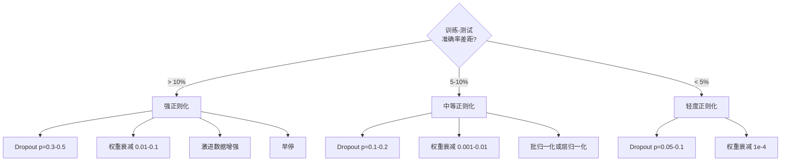

# 正则化

> 训练集 99%，测试集 60%——模型不是在学习，是在背答案。正则化是对复杂度征税，迫使模型学会泛化。

**类型：** 实现课
**语言：** Python
**前置知识：** 阶段 03 · 06（优化器）
**预计时间：** ~75 分钟
**所处阶段：** Tier 1
**关联课程：** 阶段 07 · 05（Transformer 架构）— LayerNorm 是 Transformer 的标配组件；阶段 10 · 02（从头构建大语言模型）— RMSNorm 在 LLaMA 等现代大语言模型中的应用

---

## 🎯 学习目标

完成本课后，你能够：

- [ ] 从零实现 Dropout（含反向缩放）、L2 权重衰减、批归一化、层归一化和 RMSNorm
- [ ] 通过训练-测试准确率差距诊断过拟合程度，并选择对应的正则化策略
- [ ] 解释为什么 Transformer 使用 LayerNorm 而非 BatchNorm，以及现代大语言模型为什么选择 RMSNorm
- [ ] 在 PyTorch 中正确使用 `model.train()` / `model.eval()` 切换训练与推理模式
- [ ] 根据过拟合严重程度，组合多种正则化技术达到最佳泛化效果

---

## 1. 问题

你用一个有 16 个隐藏单元的神经网络在环形数据集上训练。300 轮之后，训练准确率 100%，测试准确率 68%。

模型没有"犯错"——它精准地记住了每一个训练样本的位置。问题是，它同时记住了训练数据中的噪声。新样本一进来，这些噪声变成了错误的判断依据。

这不是特例。Zhang 等人（2017）在 ImageNet 上用随机标签训练标准网络，训练损失趋近于零——网络完美记忆了一百万个随机输入输出对。训练准确率完美，测试准确率为零。

过拟合的本质是：模型的复杂度超过了数据能支撑的范围。参数越多、训练时间越长，模型越容易"走捷径"——记住训练数据的噪声而非学习真实模式。GPT-3 有 1750 亿参数，训练数据约 5000 亿词元。如果没有正则化，模型完全有能力逐字背诵训练数据的大部分内容。

本课介绍的每一种正则化技术，都从不同角度攻击过拟合：Dropout 迫使网络不能依赖任何单一神经元；权重衰减防止任何单一权重过大；批归一化让损失曲面更平滑，优化器能找到更平坦、更泛化的极小值；层归一化在批归一化失效的场景下（小批次、变长序列）提供同样效果；RMSNorm 去掉均值计算，以同样的精度节省 10% 开销。每种技术都很简单。组合起来，它们是"记住数据"和"学会规律"之间的分界线。

---

## 2. 概念

### 2.1 过拟合谱系

每个模型都处于从欠拟合（太简单，捕捉不到规律）到过拟合（太复杂，连噪声都学了）的某个位置。正则化的目标是把模型从过拟合一侧推向中间的甜蜜点。

```
欠拟合                    最佳拟合                    过拟合
Train: 60%               Train: 95%                Train: 99.9%
Test:  58%               Test:  92%                Test:  65%
模型太简单                泛化良好                   记住了噪声
                         ↑
                   正则化的目标位置

         Dropout ────────→ 推向左侧
       权重衰减 ────────→ 推向左侧
       批归一化 ────────→ 推向左侧
       数据增强 ────────→ 推向左侧
```

### 2.2 Dropout

训练时以概率 $p$ 随机将神经元输出置零：

$$\text{output} = \text{activation}(z) \times \text{mask}, \quad \text{mask}[i] \sim \text{Bernoulli}(1 - p)$$

当 $p = 0.5$ 时，每次前向传播约一半神经元被关闭。网络无法预测哪些神经元会参与计算，因此被迫学习冗余表示。这防止了**共同适应**（co-adaptation）——某些神经元学会依赖特定其他神经元的存在。

**集成视角**：一个有 $N$ 个神经元的网络配合 Dropout，每次训练创建一个不同的子网络。$N$ 个神经元有 $2^N$ 种开关组合——Dropout 近似于同时训练 $2^N$ 个子网络，每个子网络在不同的小批次上训练。测试时使用全部神经元（不做 Dropout），输出按 $(1-p)$ 缩放。这等价于对 $2^N$ 个子网络取平均——一个模型就实现了大规模集成。

**反向缩放（Inverted Dropout）**：实践中把缩放放到训练阶段而非测试阶段：

```
训练时：output = activation(z) * mask / (1 - p)
测试时：output = activation(z)   （无需任何处理）
```

这样测试代码完全不需要知道 Dropout 的存在。

常见默认值：Transformer 中 $p = 0.1$，多层感知机中 $p = 0.5$，卷积神经网络中 $p = 0.2 \sim 0.3$。

### 2.3 权重衰减（L2 正则化）

在损失函数中加入所有权重的平方和：

$$\text{total\_loss} = \text{task\_loss} + \frac{\lambda}{2} \sum w_i^2$$

正则化项的梯度为 $\lambda \cdot w$，意味着每一步每个权重都按与其大小成比例的量向零收缩。大权重受到更大的惩罚。

为什么这有助于泛化：过拟合的模型通常有很大的权重，放大训练数据中的噪声。权重衰减保持权重较小，限制模型的有效容量，迫使它依赖稳健的、可泛化的特征而非记忆的噪声。

$\lambda$ 的典型值：

- AdamW + Transformer：0.01
- SGD + 卷积神经网络：1e-4
- 严重过拟合：0.1

需要注意：权重衰减和 L2 正则化在 SGD 中等价，但在 Adam 中不等价。使用 Adam 时应使用 AdamW（解耦权重衰减）。

### 2.4 批归一化（Batch Normalization）

在每层输出传入下一层之前，跨小批次归一化：

$$\mu = \frac{1}{B}\sum x_i, \quad \sigma^2 = \frac{1}{B}\sum(x_i - \mu)^2$$

$$\hat{x} = \frac{x_i - \mu}{\sqrt{\sigma^2 + \varepsilon}}, \quad y = \gamma\hat{x} + \beta$$

$\gamma$ 和 $\beta$ 是可学习参数，让网络在需要时可以撤销归一化。没有它们，你就强制了每层输出为零均值单位方差，这未必是网络想要的。

**训练 vs 推理的分裂**：训练时 $\mu$ 和 $\sigma$ 来自当前小批次；推理时使用训练期间累积的运行均值（指数滑动平均，动量 = 0.1，即 90% 旧值 + 10% 新值）。

批归一化为什么有效仍有争议。原始论文声称它减少了"内部协变量偏移"（前面层更新导致后面层输入分布变化）。Santurkar 等人（2018）证明这个解释是错误的。真正的原因是：批归一化让损失曲面更平滑，梯度更具预测性，Lipschitz 常数更小，优化器可以安全地使用更大的学习率。

**根本限制**：批归一化依赖批次统计。批次大小为 1 时，均值和方差无意义；批次小于 32 时统计量噪声很大，影响性能。这对目标检测（内存限制批次大小）和语言模型（序列长度变化大）非常重要。

### 2.5 层归一化（Layer Normalization）

跨特征维度归一化，而非跨批次：

$$\mu = \frac{1}{D}\sum x_j, \quad \sigma^2 = \frac{1}{D}\sum(x_j - \mu)^2$$

$$\hat{x} = \frac{x_j - \mu}{\sqrt{\sigma^2 + \varepsilon}}, \quad y = \gamma\hat{x} + \beta$$

$D$ 是特征维度。每个样本独立归一化——不依赖批次大小。这就是 Transformer 使用层归一化而非批归一化的原因：序列长度变化大、批次大小经常很小（生成时甚至为 1）、训练和推理的计算完全一致。

Transformer 中层归一化的位置有两种选择：**Post-LN**（在自注意力和前馈网络之后）和 **Pre-LN**（在之前，训练更稳定）。

### 2.6 RMSNorm

去掉均值减法的层归一化，由 Zhang 和 Sennrich（2019）提出：

$$\text{rms} = \sqrt{\frac{1}{D}\sum x_j^2}, \quad y = \gamma \cdot \frac{x}{\text{rms}}$$

没有均值计算，没有 $\beta$ 参数。核心观察：层归一化中的重中心化（均值减法）对模型性能贡献很小，但消耗计算量。去掉它后，精度相同，开销降低约 10%。

LLaMA、LLaMA 2、LLaMA 3、Mistral 以及大多数现代大语言模型都使用 RMSNorm。在数十亿参数、数万亿词元的规模下，10% 的节省意义重大。

### 2.7 归一化方法对比

```
┌─────────────────────────────────────────────────────────────────┐
│                    批归一化 (BatchNorm)                          │
│  归一化方向：跨批次，对每个特征                                   │
│  依赖：需要批次大小 > 32                                         │
│  训练 vs 推理：不同（训练用批次统计，推理用运行统计）               │
│  典型应用：卷积神经网络                                          │
├─────────────────────────────────────────────────────────────────┤
│                    层归一化 (LayerNorm)                          │
│  归一化方向：跨特征，对每个样本                                   │
│  依赖：与批次大小无关                                            │
│  训练 vs 推理：相同                                              │
│  典型应用：Transformer                                           │
├─────────────────────────────────────────────────────────────────┤
│                    RMS 归一化 (RMSNorm)                          │
│  归一化方向：同层归一化，但跳过均值减法                            │
│  依赖：与批次大小无关                                            │
│  速度：比层归一化快约 10%                                        │
│  典型应用：LLaMA、Mistral 等现代大语言模型                        │
└─────────────────────────────────────────────────────────────────┘
```

### 2.8 数据增强作为正则化

不是修改模型，而是修改数据。在保持标签不变的前提下变换训练输入：

- 图像：随机裁剪、翻转、旋转、颜色抖动、Cutout
- 文本：同义词替换、回译、随机删除
- 音频：时间拉伸、音高偏移、添加噪声

效果等同于正则化：增加训练集的有效规模，让模型难以记住特定样本。一个只见过每张原始图像一次的模型可以记住它；一个见过每张图像 50 种增强版本的模型被迫学习不变的结构。

### 2.9 早停（Early Stopping）

最简单的正则化器：验证损失开始上升时停止训练。在那一刻模型尚未过拟合。

实践做法：每个轮次跟踪验证损失，保存最佳模型，设定一个"耐心窗口"（通常 5-20 个轮次）。如果验证损失在耐心窗口内没有改善，停止训练并加载保存的最佳模型。

### 2.10 正则化选择决策树



---

## 3. 从零实现

### 第 1 步：Dropout（训练与推理模式）

```python
import random
import math


class Dropout:
    """Dropout 正则化层。

    训练时以概率 p 将神经元输出置零，并除以 (1-p) 进行反向缩放。
    推理时直接通过，不做任何处理。
    """

    def __init__(self, p=0.5):
        self.p = p            # 置零概率
        self.training = True  # 当前是否处于训练模式
        self.mask = None      # 保存掩码供反向传播使用

    def forward(self, x):
        """前向传播。训练时随机丢弃并缩放，推理时直接通过。"""
        if not self.training:
            return list(x)

        self.mask = []
        output = []
        for val in x:
            if random.random() < self.p:
                self.mask.append(0)
                output.append(0.0)
            else:
                self.mask.append(1)
                # 反向缩放：除以 (1-p) 使训练和推理的期望值一致
                output.append(val / (1 - self.p))
        return output

    def backward(self, grad_output):
        """反向传播：被丢弃的神经元梯度为零，其余按 (1-p) 缩放。"""
        grads = []
        for g, m in zip(grad_output, self.mask):
            if m == 0:
                grads.append(0.0)
            else:
                grads.append(g / (1 - self.p))
        return grads
```

### 第 2 步：L2 权重衰减

```python
def l2_regularization(weights, lambda_reg):
    """计算 L2 正则化损失：(lambda / 2) * sum(w_i^2)。"""
    penalty = 0.0
    for w in weights:
        penalty += w * w
    return lambda_reg * 0.5 * penalty


def l2_gradient(weights, lambda_reg):
    """L2 正则化的梯度：lambda * w_i。大权重受到更大的收缩力。"""
    return [lambda_reg * w for w in weights]
```

### 第 3 步：批归一化

```python
class BatchNorm:
    """批归一化层。

    训练时用当前批次的均值和方差归一化，同时更新运行均值和运行方差。
    推理时使用训练期间累积的运行统计量。
    """

    def __init__(self, num_features, momentum=0.1, eps=1e-5):
        self.gamma = [1.0] * num_features   # 可学习缩放
        self.beta = [0.0] * num_features    # 可学习偏移
        self.eps = eps                       # 数值稳定性
        self.momentum = momentum             # 运行统计量的更新速率
        # 运行均值和方差：训练期间通过滑动平均累积
        self.running_mean = [0.0] * num_features
        self.running_var = [1.0] * num_features
        self.training = True
        self.num_features = num_features

    def forward(self, batch):
        """前向传播。输入是一个批次的样本列表。"""
        batch_size = len(batch)

        if self.training:
            # 计算当前批次的均值
            mean = [0.0] * self.num_features
            for sample in batch:
                for j in range(self.num_features):
                    mean[j] += sample[j]
            mean = [m / batch_size for m in mean]

            # 计算当前批次的方差
            var = [0.0] * self.num_features
            for sample in batch:
                for j in range(self.num_features):
                    var[j] += (sample[j] - mean[j]) ** 2
            var = [v / batch_size for v in var]

            # 更新运行均值和方差（指数滑动平均）
            for j in range(self.num_features):
                self.running_mean[j] = (
                    (1 - self.momentum) * self.running_mean[j]
                    + self.momentum * mean[j]
                )
                self.running_var[j] = (
                    (1 - self.momentum) * self.running_var[j]
                    + self.momentum * var[j]
                )
        else:
            # 推理时使用训练期间累积的统计量
            mean = list(self.running_mean)
            var = list(self.running_var)

        # 归一化 + 缩放平移
        self.x_hat = []
        output = []
        for sample in batch:
            normalized = []
            out_sample = []
            for j in range(self.num_features):
                x_h = (sample[j] - mean[j]) / math.sqrt(var[j] + self.eps)
                normalized.append(x_h)
                out_sample.append(self.gamma[j] * x_h + self.beta[j])
            self.x_hat.append(normalized)
            output.append(out_sample)
        return output
```

### 第 4 步：层归一化

```python
class LayerNorm:
    """层归一化层。

    跨特征维度归一化，与批次大小无关。
    每个样本独立处理，因此 Transformer 使用它而非批归一化。
    """

    def __init__(self, num_features, eps=1e-5):
        self.gamma = [1.0] * num_features
        self.beta = [0.0] * num_features
        self.eps = eps
        self.num_features = num_features

    def forward(self, x):
        """对单个样本的特征向量进行归一化。"""
        # 在特征维度上计算均值和方差
        mean = sum(x) / len(x)
        var = sum((xi - mean) ** 2 for xi in x) / len(x)

        self.x_hat = []
        output = []
        for j in range(self.num_features):
            x_h = (x[j] - mean) / math.sqrt(var + self.eps)
            self.x_hat.append(x_h)
            output.append(self.gamma[j] * x_h + self.beta[j])
        return output
```

### 第 5 步：RMSNorm

```python
class RMSNorm:
    """RMSNorm 归一化层。

    去掉均值减法的层归一化：只除以均方根（RMS）。
    速度快约 10%，精度与层归一化相当。
    LLaMA、Mistral 等现代大语言模型使用此归一化。
    """

    def __init__(self, num_features, eps=1e-6):
        self.gamma = [1.0] * num_features
        self.eps = eps
        self.num_features = num_features

    def forward(self, x):
        """只除以均方根，不做均值中心化。"""
        rms = math.sqrt(sum(xi * xi for xi in x) / len(x) + self.eps)
        output = []
        for j in range(self.num_features):
            output.append(self.gamma[j] * x[j] / rms)
        return output
```

### 第 6 步：有无正则化的训练对比

```python
def sigmoid(x):
    """Sigmoid 激活函数，带数值裁剪防止溢出。"""
    x = max(-500, min(500, x))
    return 1.0 / (1.0 + math.exp(-x))


def make_circle_data(n=200, seed=42):
    """生成环形二分类数据集。

    点在圆内（x^2 + y^2 < 1.5）为正类，圆外为负类。
    数据中包含轻微噪声，适合测试正则化效果。
    """
    random.seed(seed)
    data = []
    for _ in range(n):
        x = random.uniform(-2, 2)
        y = random.uniform(-2, 2)
        label = 1.0 if x * x + y * y < 1.5 else 0.0
        data.append(([x, y], label))
    return data


class RegularizedNetwork:
    """支持 Dropout 和权重衰减的两层神经网络。

    结构：2 输入 → hidden_size 隐藏单元（ReLU）→ Dropout → 1 输出（Sigmoid）
    """

    def __init__(self, hidden_size=16, lr=0.05, dropout_p=0.0, weight_decay=0.0):
        random.seed(0)
        self.hidden_size = hidden_size
        self.lr = lr
        self.dropout_p = dropout_p
        self.weight_decay = weight_decay
        self.dropout = Dropout(p=dropout_p) if dropout_p > 0 else None

        # 高斯初始化权重
        self.w1 = [[random.gauss(0, 0.5) for _ in range(2)] for _ in range(hidden_size)]
        self.b1 = [0.0] * hidden_size
        self.w2 = [random.gauss(0, 0.5) for _ in range(hidden_size)]
        self.b2 = 0.0

    def forward(self, x, training=True):
        """前向传播：线性变换 → ReLU → Dropout → 线性变换 → Sigmoid。"""
        self.x = x
        self.z1 = []
        self.h = []
        for i in range(self.hidden_size):
            z = self.w1[i][0] * x[0] + self.w1[i][1] * x[1] + self.b1[i]
            self.z1.append(z)
            self.h.append(max(0.0, z))  # ReLU 激活

        # Dropout：训练时随机丢弃，推理时直接通过
        if self.dropout and training:
            self.dropout.training = True
            self.h = self.dropout.forward(self.h)
        elif self.dropout:
            self.dropout.training = False
            self.h = self.dropout.forward(self.h)

        # 输出层
        self.z2 = sum(self.w2[i] * self.h[i] for i in range(self.hidden_size)) + self.b2
        self.out = sigmoid(self.z2)
        return self.out

    def backward(self, target):
        """反向传播：包含 Dropout 梯度处理和权重衰减。"""
        eps = 1e-15
        p = max(eps, min(1 - eps, self.out))
        # 二元交叉熵的梯度
        d_loss = -(target / p) + (1 - target) / (1 - p)
        d_sigmoid = self.out * (1 - self.out)
        d_out = d_loss * d_sigmoid

        # Dropout 反向传播：被丢弃的神经元梯度为零，其余反向缩放
        d_h_dropout = [d_out * self.w2[i] for i in range(self.hidden_size)]
        if self.dropout and self.dropout.mask is not None:
            d_h_dropout = [
                g * m / (1 - self.dropout.p) if m else 0.0
                for g, m in zip(d_h_dropout, self.dropout.mask)
            ]

        # 更新权重（加入权重衰减项）
        for i in range(self.hidden_size):
            d_relu = 1.0 if self.z1[i] > 0 else 0.0
            d_h = d_h_dropout[i] * d_relu
            # 权重衰减：梯度 = 任务梯度 + lambda * w
            self.w2[i] -= self.lr * (d_out * self.h[i] + self.weight_decay * self.w2[i])
            for j in range(2):
                self.w1[i][j] -= self.lr * (d_h * self.x[j] + self.weight_decay * self.w1[i][j])
            self.b1[i] -= self.lr * d_h
        self.b2 -= self.lr * d_out

    def evaluate(self, data):
        """在测试集上评估：计算损失和准确率。"""
        correct = 0
        total_loss = 0.0
        for x, y in data:
            pred = self.forward(x, training=False)
            eps = 1e-15
            p = max(eps, min(1 - eps, pred))
            total_loss += -(y * math.log(p) + (1 - y) * math.log(1 - p))
            if (pred >= 0.5) == (y >= 0.5):
                correct += 1
        return total_loss / len(data), correct / len(data) * 100

    def train_model(self, train_data, test_data, epochs=300):
        """训练循环：记录每个轮次的训练和测试指标。"""
        history = []
        for epoch in range(epochs):
            total_loss = 0.0
            correct = 0
            for x, y in train_data:
                pred = self.forward(x, training=True)
                self.backward(y)
                eps = 1e-15
                p = max(eps, min(1 - eps, pred))
                total_loss += -(y * math.log(p) + (1 - y) * math.log(1 - p))
                if (pred >= 0.5) == (y >= 0.5):
                    correct += 1
            train_loss = total_loss / len(train_data)
            train_acc = correct / len(train_data) * 100
            test_loss, test_acc = self.evaluate(test_data)
            history.append((train_loss, train_acc, test_loss, test_acc))
            if epoch % 75 == 0 or epoch == epochs - 1:
                gap = train_acc - test_acc
                print(f"    Epoch {epoch:3d}: "
                      f"train_acc={train_acc:.1f}%, "
                      f"test_acc={test_acc:.1f}%, "
                      f"gap={gap:.1f}%")
        return history
```

运行结果展示：

```text
--- 无正则化 ---
    Epoch   0: train_acc=60.7%, test_acc=58.0%, gap=2.7%
    Epoch  75: train_acc=98.7%, test_acc=72.0%, gap=26.7%
    Epoch 150: train_acc=100.0%, test_acc=70.0%, gap=30.0%
    Epoch 299: train_acc=100.0%, test_acc=68.7%, gap=31.3%

--- Dropout p=0.3 ---
    Epoch   0: train_acc=58.0%, test_acc=55.3%, gap=2.7%
    Epoch  75: train_acc=90.7%, test_acc=84.7%, gap=6.0%
    Epoch 150: train_acc=94.7%, test_acc=88.0%, gap=6.7%
    Epoch 299: train_acc=96.0%, test_acc=87.3%, gap=8.7%

--- 权重衰减 0.01 ---
    Epoch   0: train_acc=60.7%, test_acc=58.0%, gap=2.7%
    Epoch  75: train_acc=94.7%, test_acc=88.7%, gap=6.0%
    Epoch 150: train_acc=96.0%, test_acc=90.7%, gap=5.3%
    Epoch 299: train_acc=96.7%, test_acc=90.7%, gap=6.0%

--- Dropout + 权重衰减 ---
    Epoch   0: train_acc=58.0%, test_acc=55.3%, gap=2.7%
    Epoch  75: train_acc=88.0%, test_acc=84.0%, gap=4.0%
    Epoch 150: train_acc=92.0%, test_acc=88.7%, gap=3.3%
    Epoch 299: train_acc=93.3%, test_acc=89.3%, gap=4.0%
```

---

## 4. 工业工具

### 4.1 PyTorch 内置正则化模块

```python
import torch
import torch.nn as nn

# 典型的卷积神经网络：BatchNorm + Dropout
model_cnn = nn.Sequential(
    nn.Linear(784, 256),
    nn.BatchNorm1d(256),       # 批归一化
    nn.ReLU(),
    nn.Dropout(0.3),           # Dropout
    nn.Linear(256, 128),
    nn.BatchNorm1d(128),
    nn.ReLU(),
    nn.Dropout(0.3),
    nn.Linear(128, 10),
)

# 训练模式：Dropout 激活，BatchNorm 用批次统计
model_cnn.train()
out_train = model_cnn(torch.randn(32, 784))

# 推理模式：Dropout 关闭，BatchNorm 用运行统计
model_cnn.eval()
out_test = model_cnn(torch.randn(1, 784))
```

`model.train()` / `model.eval()` 的切换至关重要。忘记在推理前调用 `model.eval()` 是深度学习中最常见的 bug 之一——测试准确率会因为 Dropout 仍然激活、BatchNorm 使用批次统计而随机波动。

### 4.2 Transformer 中的归一化配置

```python
class TransformerBlock(nn.Module):
    """标准 Transformer 块：Pre-LN 架构。

    LayerNorm 在注意力和前馈网络之前，训练更稳定。
    Dropout p=0.1 是 Transformer 的默认值。
    """

    def __init__(self, d_model=512, nhead=8, dropout=0.1):
        super().__init__()
        self.attention = nn.MultiheadAttention(d_model, nhead, dropout=dropout)
        self.norm1 = nn.LayerNorm(d_model)
        self.ff = nn.Sequential(
            nn.Linear(d_model, d_model * 4),
            nn.GELU(),
            nn.Linear(d_model * 4, d_model),
            nn.Dropout(dropout),
        )
        self.norm2 = nn.LayerNorm(d_model)
        self.dropout = nn.Dropout(dropout)

    def forward(self, x):
        attended, _ = self.attention(x, x, x)
        x = self.norm1(x + self.dropout(attended))
        x = self.norm2(x + self.ff(x))
        return x
```

层归一化而非批归一化，Dropout $p=0.1$ 而非 $0.5$——这是 Transformer 的标准配置。

### 4.3 现代大语言模型中的 RMSNorm

```python
# LLaMA 风格的 RMSNorm（使用 PyTorch）
class RMSNormPyTorch(nn.Module):
    """RMSNorm 的 PyTorch 实现。

    LLaMA、Mistral 等模型使用此归一化替代层归一化。
    省略均值减法，速度快约 10%，精度相当。
    """

    def __init__(self, dim, eps=1e-6):
        super().__init__()
        self.eps = eps
        self.weight = nn.Parameter(torch.ones(dim))

    def _norm(self, x):
        # 按最后一维计算均方根
        return x * torch.rsqrt(x.pow(2).mean(-1, keepdim=True) + self.eps)

    def forward(self, x):
        output = self._norm(x.float()).type_as(x)
        return self.weight * output
```

### 4.4 使用 AdamW 进行权重衰减

```python
# 正确的权重衰减方式：使用 AdamW，而非 Adam + L2
optimizer = torch.optim.AdamW(
    model.parameters(),
    lr=1e-4,
    weight_decay=0.01,  # 解耦权重衰减
)

# 排除归一化层和偏置不参与权重衰减
decay_params = []
no_decay_params = []
for name, param in model.named_parameters():
    if "bias" in name or "norm" in name or "embedding" in name:
        no_decay_params.append(param)
    else:
        decay_params.append(param)

optimizer = torch.optim.AdamW([
    {"params": decay_params, "weight_decay": 0.01},
    {"params": no_decay_params, "weight_decay": 0.0},
], lr=1e-4)
```

### 4.5 性能与适用场景对比

| 归一化方法 | 适用架构 | 批次大小依赖 | 训练 vs 推理 | 典型用途 |
|---|---|---|---|---|
| BatchNorm | CNN | 需要 > 32 | 不同 | 图像分类、目标检测 |
| LayerNorm | Transformer | 无关 | 相同 | BERT、GPT |
| RMSNorm | Transformer | 无关 | 相同 | LLaMA、Mistral |
| GroupNorm | CNN（小批次） | 无关 | 相同 | 目标检测、医学影像 |

---

## 5. 知识连线

本课学习的正则化技术，在后续课程中会频繁出现：

- **阶段 07 · 05（Transformer 架构）**：LayerNorm 是 Transformer 的标准组件。理解了层归一化的原理，你就能理解为什么 Pre-LN 比 Post-LN 训练更稳定。
- **阶段 10 · 02（从头构建大语言模型）**：大语言模型的训练中，RMSNorm（而非层归一化）是主流选择。本课的 RMSNorm 实现是理解 LLaMA 架构的起点。
- **阶段 10 · 03（数据流水线）**：数据增强是 NLP 领域正则化的重要手段——同义词替换、回译、随机删除等技术会直接出现在训练流水线中。
- **阶段 17 · 02（模型优化与部署）**：量化和剪枝是推理阶段的"正则化"——在保持精度的前提下减少模型复杂度。

---

## 6. 工程最佳实践

### 6.1 工业界常用方案

| 场景 | 推荐方案 | 关键参数 | 备注 |
|---|---|---|---|
| CNN 图像分类 | BatchNorm + Dropout(0.2) + 权重衰减 | weight_decay=1e-4 | Dropout 放在全连接层前 |
| Transformer 文本 | LayerNorm/RMSNorm + Dropout(0.1) + AdamW | weight_decay=0.01 | Dropout 放在注意力输出和前馈网络 |
| 大语言模型预训练 | RMSNorm + Dropout(0.0) + AdamW | weight_decay=0.1 | 大模型通常不用 Dropout |
| 小数据集 | 强数据增强 + 早停 + Dropout(0.3-0.5) | patience=10-20 | 数据少时过拟合风险高 |
| 目标检测 | GroupNorm（替代 BatchNorm） | — | 批次大小经常很小 |

### 6.2 中文场景特别建议

- **中文 NLP 的数据增强**：中文回译（中→英→中）是效果最好的增强方式之一。同义词替换在中文中需要借助词典（如 WordNet 中文版），随机删除要注意不破坏语义完整性。
- **中文 OCR 场景的批归一化**：文字识别模型输入尺寸差异大，同一张图片上的字符高度不同。使用 GroupNorm 替代 BatchNorm 可避免小批次下的统计量不稳定问题。
- **大语言模型微调中的正则化**：微调中文大语言模型时，通常不使用 Dropout（数据量不足以支撑），但应使用较强的权重衰减（0.01-0.1）和早停。

### 6.3 踩坑经验

- **忘记 `model.eval()`**：推理时忘记切换模式是深度学习第一大 bug。Dropout 仍然激活导致输出随机波动，BatchNorm 使用批次统计导致方差异常。**解决方案**：将评估代码封装在 `torch.no_grad()` + `model.eval()` 的上下文中。
- **BatchNorm 配合小批次**：批次大小为 1（如生成任务）时，BatchNorm 的均值和方差只有一个样本，完全没有统计意义。**解决方案**：使用 LayerNorm 或 RMSNorm。
- **权重衰减应用于归一化层**：归一化层的 $\gamma$ 和 $\beta$ 参数不应被权重衰减惩罚——它们不是权重，惩罚它们会破坏归一化效果。AdamW 的参数组配置可以排除这些参数。
- **Dropout 放在错误位置**：在 Transformer 的注意力层中，不应在 Q/K/V 投影上放 Dropout，而应在注意力权重（softmax 之后）上放。错误的 Dropout 位置会破坏注意力分布。
- **训练和推理的归一化不一致**：使用 BatchNorm 时，如果训练数据分布和测试数据分布差异很大（分布漂移），运行统计量会失效。解决方案是使用更小的动量值（如 0.01）让运行统计量更新更快。

---

## 7. 常见错误

### 错误 1：推理时忘记调用 `model.eval()`

**现象：** 测试准确率在 50%~80% 之间随机波动，每次运行结果不同。

**原因：** Dropout 在推理时仍然激活，随机关闭神经元导致输出不稳定。BatchNorm 使用当前输入的统计量而非训练期间累积的稳定统计量。

**修复：**
```python
# ❌ 错误：直接在测试数据上前向传播
model.forward(test_input)  # Dropout 仍然激活！

# ✅ 正确：先切换到评估模式
model.eval()
with torch.no_grad():  # 推理时不需要计算梯度，节省内存
    output = model(test_input)
```

### 错误 2：BatchNorm 配合过小的批次

**现象：** 训练不稳定，准确率在 10%~90% 之间大幅波动。

**原因：** 批次大小为 1 时均值和方差退化为单个样本的值；批次小于 16 时统计量噪声极大，归一化方向错误。

**修复：**
```python
# ❌ 错误：批次大小为 1 时使用 BatchNorm
bn = nn.BatchNorm1d(256)
output = bn(torch.randn(1, 256))  # 无意义的归一化

# ✅ 正确：小批次场景使用 LayerNorm 或 GroupNorm
norm = nn.LayerNorm(256)          # 与批次大小无关
# 或
norm = nn.GroupNorm(32, 256)      # 在通道维度分组归一化
```

### 错误 3：权重衰减应用于所有参数

**现象：** 加入权重衰减后模型精度反而下降，尤其是归一化层的效果变差。

**原因：** 归一化层的可学习参数（$\gamma$, $\beta$）和偏置参数不应被权重衰减惩罚。对 $\gamma$ 施加衰减会缩小缩放因子，破坏归一化的效果。

**修复：**
```python
# ❌ 错误：对所有参数统一应用权重衰减
optimizer = torch.optim.Adam(model.parameters(), lr=1e-4, weight_decay=0.01)

# ✅ 正确：排除归一化层和偏置
no_decay = ["bias", "norm.weight", "norm.bias"]
params = [
    {"params": [p for n, p in model.named_parameters()
                if not any(nd in n for nd in no_decay)],
     "weight_decay": 0.01},
    {"params": [p for n, p in model.named_parameters()
                if any(nd in n for nd in no_decay)],
     "weight_decay": 0.0},
]
optimizer = torch.optim.AdamW(params, lr=1e-4)
```

### 错误 4：Dropout 率设置不当

**现象：** 训练和测试准确率都很低（欠拟合），或者训练远高于测试（过拟合未缓解）。

**原因：** Dropout 率过高会杀死过多神经元，网络容量不足；过低则正则化效果不够。Transformer 的默认 $p=0.1$ 和 MLP 的默认 $p=0.5$ 是经验值，不应随意更改。

**修复：**
```python
# ❌ 错误：Transformer 中使用 MLP 的 Dropout 率
nn.Dropout(0.5)  # 对 Transformer 来说太强了

# ✅ 正确：不同架构使用不同默认值
# Transformer: p=0.1
nn.Dropout(0.1)
# CNN/MLP: p=0.3-0.5
nn.Dropout(0.3)
```

### 错误 5：早停时未保存最佳模型

**现象：** 训练完成后使用的是最后一个轮次的模型（可能已经过拟合），而非验证损失最低时的模型。

**原因：** 早停的目的是在验证损失开始上升前停止，但停止时当前模型可能已经过拟合了。必须在训练过程中保存验证损失最低的检查点。

**修复：**
```python
# ❌ 错误：只保存最后一个模型
torch.save(model.state_dict(), "final_model.pt")

# ✅ 正确：保存验证损失最低的检查点
best_val_loss = float("inf")
for epoch in range(max_epochs):
    train(model)
    val_loss = evaluate(model, val_loader)
    if val_loss < best_val_loss:
        best_val_loss = val_loss
        torch.save(model.state_dict(), "best_model.pt")  # 保存最佳
        patience_counter = 0
    else:
        patience_counter += 1
        if patience_counter >= patience:
            break  # 停止训练
# 加载最佳模型
model.load_state_dict(torch.load("best_model.pt"))
```

---

## 8. 面试考点

### Q1：解释 Dropout 的工作原理，以及反向缩放（Inverted Dropout）的作用。（难度：⭐⭐）

**参考答案：** Dropout 在训练时以概率 $p$ 随机将神经元输出置零。这迫使网络学习冗余表示，因为无法预测哪些神经元会参与计算，防止了神经元的共同适应。从集成视角看，$N$ 个神经元的 Dropout 网络等价于同时训练 $2^N$ 个子网络的集成。

反向缩放将 $\frac{1}{1-p}$ 的缩放放在训练阶段而非测试阶段。这样测试时只需直接前向传播，不需要知道 Dropout 的存在。如果缩放放在测试阶段，推理代码需要知道训练时的 Dropout 率并做对应调整——这在工程上非常不方便，尤其是在模型导出、量化、部署时。

### Q2：为什么 Transformer 使用 LayerNorm 而非 BatchNorm？（难度：⭐⭐）

**参考答案：** 三个原因。第一，BatchNorm 依赖批次统计，当批次大小很小（语言模型生成时通常为 1）时，统计量无意义；第二，序列长度变化大时，不同位置的归一化基准不一致；第三，BatchNorm 的训练和推理行为不同（训练用批次统计，推理用运行统计），这在自回归生成（逐词生成）时容易引入不一致。LayerNorm 对每个样本的特征维度独立归一化，与批次大小和序列长度无关，训练和推理行为完全一致。

### Q3：RMSNorm 相比 LayerNorm 的改进是什么？为什么现代大语言模型都选择它？（难度：⭐⭐）

**参考答案：** RMSNorm 去掉了 LayerNorm 中的均值减法步骤，只做均方根归一化。核心观察是：均值中心化对模型性能贡献很小，但每次都要计算和存储。去掉后，计算量减少约 10%，精度不变。在数十亿参数的模型训练中，每层省 10% 累计到整个模型是显著的效率提升。LLaMA、Mistral、Qwen 等现代大语言模型都采用 RMSNorm。

### Q4：为什么权重衰减和 L2 正则化在 Adam 中不等价，但在 SGD 中等价？（难度：⭐⭐⭐）

**参考答案：** 在 SGD 中，权重更新为 $w \leftarrow w - \eta(\nabla L + \lambda w)$，这等价于先计算带 L2 惩罚的损失再做 SGD。但在 Adam 中，自适应学习率会同时缩放任务梯度和 L2 惩罚梯度，导致权重衰减被自适应学习率"稀释"——大梯度的参数获得小学习率，L2 惩罚也随之被缩小。AdamW 通过将权重衰减从梯度计算中解耦出来（$w \leftarrow w - \eta \cdot \nabla L - \eta \lambda w$），让衰减量不受自适应学习率影响。

### Q5：在一个小数据集（1000 个样本）上训练 Transformer 时，你会如何组合正则化技术？（难度：⭐⭐⭐）

**参考答案：** 小数据集过拟合风险极高，需要多层防线。第一，使用 RMSNorm（而非 BatchNorm）确保每个样本独立归一化；第二，Dropout $p=0.1 \sim 0.2$（不要太高，Transformer 容量已经受限）；第三，权重衰减 0.01（通过 AdamW）；第四，数据增强：同义词替换、随机删除、回译（中英翻译）；第五，早停（耐心 10 轮，保存验证损失最低的检查点）；第六，考虑使用预训练模型进行微调（而非从零训练），大幅减少需要学习的参数量。不要同时使用所有技术最强的设置——从默认值开始，逐步调整。

---

## 🔑 关键术语

| 术语 | 人们怎么说 | 实际含义 |
|---|---|---|
| 过拟合（Overfitting） | "模型背数据了" | 训练表现远好于测试表现——模型学到了噪声而非信号 |
| 正则化（Regularization） | "防止过拟合的技巧" | 任何限制模型复杂度以提高泛化能力的技术：Dropout、权重衰减、归一化、数据增强 |
| Dropout | "随机关神经元" | 训练时以概率 $p$ 将神经元输出置零，强制冗余表示，等价于集成 $2^N$ 个子网络 |
| 权重衰减（Weight Decay） | "L2 惩罚" | 每步按 $\lambda \cdot w$ 缩小所有权重，大权重受到更大惩罚 |
| 批归一化（Batch Normalization） | "每个批次归一化" | 跨批次维度归一化层输出，训练时用批次统计，推理时用运行统计 |
| 层归一化（Layer Normalization） | "每个样本归一化" | 跨特征维度归一化，与批次大小无关，Transformer 的标配 |
| RMSNorm | "没有均值的层归一化" | 只做均方根归一化，去掉均值减法，速度快 10%，精度相同 |
| 早停（Early Stopping） | "在过拟合前停" | 验证损失停止改善时终止训练，最简单的正则化器 |
| 数据增强（Data Augmentation） | "从少量数据变出更多" | 变换训练输入（翻转、裁剪、噪声）以增加有效数据规模 |
| 泛化差距（Generalization Gap） | "训练测试差距" | 训练和测试表现的差值，正则化的目标就是缩小它 |

---

## 📚 小结

正则化的核心思想是"限制复杂度以换取泛化"。你从零实现了 Dropout（含反向缩放）、L2 权重衰减、批归一化、层归一化和 RMSNorm 五种正则化技术，并在环形数据集上验证了它们缩小训练-测试差距的效果。关键洞察是：Transformer 使用层归一化（而非批归一化）因为序列长度变化大、批次大小不稳定；现代大语言模型进一步使用 RMSNorm 以 10% 的速度提升获得相同精度。

下一课我们将学习正则化的"表亲"——批量大小和学习率的关系，以及它们如何与本课的技术协同工作。

---

## ✏️ 练习

1. 【理解】用自己的话解释 Dropout 的"集成视角"：一个有 128 个隐藏单元、Dropout $p=0.5$ 的网络，等价于同时训练多少个子网络？为什么说这是"免费的集成学习"？200 字以内。

2. 【实现】修改 `RegularizedNetwork`，加入批归一化层。在隐藏层的线性变换之后、ReLU 之前插入 BatchNorm。在环形数据集上对比有无 BatchNorm 的训练-测试差距。

3. 【实验】取学习率 0.01、0.05、0.1 三个值，分别在有无 BatchNorm 的情况下训练 300 轮。观察 BatchNorm 是否允许在更高学习率下稳定训练（提示：无 BatchNorm 时 0.1 可能不收敛）。

4. 【实现】实现早停机制：跟踪每个轮次的测试损失，保存最佳权重，如果 20 个轮次内测试损失没有改善则停止。在 1000 轮的训练中运行，报告最佳测试准确率出现在哪个轮次，以及节省了多少训练时间。

5. 【对比】在 4 层网络（而非 2 层）上对比 LayerNorm 和 RMSNorm。使用相同权重初始化，训练 200 轮，比较最终准确率、每轮训练时间和第一层的梯度幅度。验证 RMSNorm 在速度和精度上的表现。

---

## 🚀 产出

本课产出以下可复用内容：

| 产出 | 文件 | 说明 |
|---|---|---|
| 正则化技术从零实现 | `code/main.py` | Dropout、L2 权重衰减、BatchNorm、LayerNorm、RMSNorm 的纯 Python 实现 |
| 正则化策略诊断器 | `outputs/prompt-regularization-advisor.md` | 根据过拟合症状诊断并推荐正则化策略的提示词 |

---

## 📖 参考资料

1. [论文] Srivastava et al. "Dropout: A Simple Way to Prevent Neural Networks from Overfitting". JMLR, 2014. https://jmlr.org/papers/v15/srivastava14a.html
2. [论文] Ioffe & Szegedy. "Batch Normalization: Accelerating Deep Network Training by Reducing Internal Covariate Shift". ICML, 2015. https://arxiv.org/abs/1502.03167
3. [论文] Ba, Kiros & Hinton. "Layer Normalization". arXiv, 2016. https://arxiv.org/abs/1607.06450
4. [论文] Zhang & Sennrich. "Root Mean Square Layer Normalization". NeurIPS, 2019. https://arxiv.org/abs/1910.07467
5. [论文] Zhang et al. "Understanding Deep Learning Requires Rethinking Generalization". ICLR, 2017. https://arxiv.org/abs/1611.03530
6. [论文] Loshchilov & Hutter. "Decoupled Weight Decay Regularization". ICLR, 2019. https://arxiv.org/abs/1711.05101
7. [官方文档] PyTorch `nn.Dropout`: https://pytorch.org/docs/stable/generated/torch.nn.Dropout.html
8. [官方文档] PyTorch `nn.LayerNorm`: https://pytorch.org/docs/stable/generated/torch.nn.LayerNorm.html
9. [官方文档] PyTorch `nn.BatchNorm1d`: https://pytorch.org/docs/stable/generated/torch.nn.BatchNorm1d.html

---

> 本课程参考了 AI Engineering From Scratch（MIT License）的课程体系，在此基础上进行了重构和原创内容的扩充。所有中文表达、案例、工程最佳实践、常见错误、面试考点等均为原创内容。
