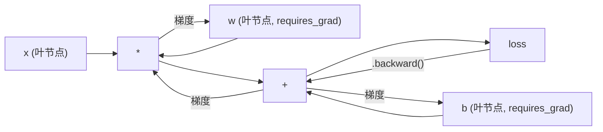
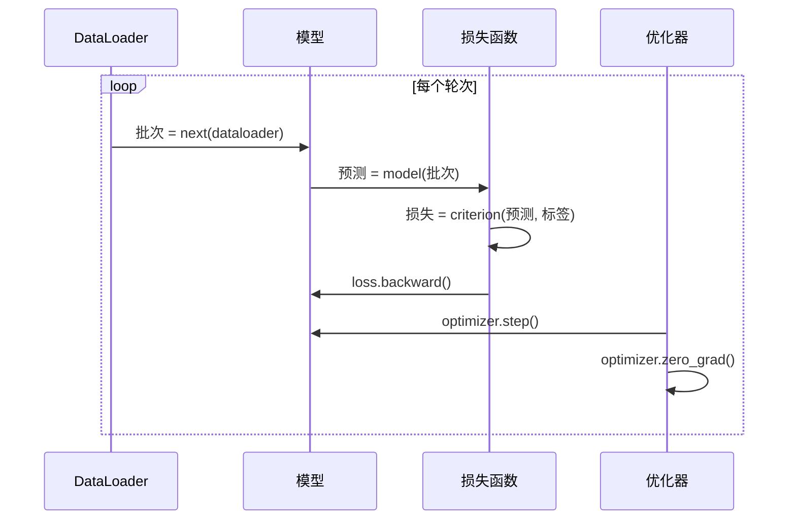

# PyTorch 入门

> 你亲手造出了引擎——活塞、曲轴、连杆。现在，学开那辆所有人都在开的车。

**类型：** 实现课
**语言：** Python
**前置知识：** 阶段 03 · 10（迷你框架）— 理解框架的核心抽象：Tensor、自动微分、Module、优化器
**预计时间：** ~90 分钟
**所处阶段：** Tier 1
**关联课程：** 阶段 07 · 01（Transformer 架构）— PyTorch 是实现所有现代模型的基础设施；阶段 10 · 01（大语言模型从零）— 所有 LLM 训练和推理都基于 PyTorch

---

## 🎯 学习目标

完成本课后，你能够：

- [ ] 熟练创建 PyTorch 张量并理解 shape、dtype、device 三个核心属性，在各种设备间迁移数据
- [ ] 用 autograd 自动微分引擎替代手工 backward()，解释计算图追踪的完整流程
- [ ] 使用 nn.Module、nn.Sequential 构建神经网络，理解参数注册和递归收集机制
- [ ] 实现完整的训练循环（zero_grad、forward、loss、backward、step），并在 GPU 上加速训练
- [ ] 使用 Dataset/DataLoader 搭建数据流水线，完成模型的保存、加载和 TensorBoard 可视化

---

## 1. 问题

你有一个能工作的"迷你框架"——Linear 层、ReLU、Dropout、Adam 优化器、DataLoader、完整的训练循环。它在纯 Python 中训练了四层网络，解决了 XOR 问题。

然后你发现了一件残酷的事：你从零搭建的框架和 PyTorch 跑同一个任务，**速度差 500 倍**。

你的迷你框架逐样本处理，每个操作都在 Python 解释器中逐条执行。PyTorch 把同样的矩阵运算下发给高度优化的 C++/CUDA 内核，在 GPU 的数千个核心上并行执行。在一个单张 A100 上，PyTorch 训练 ResNet-50（2560 万参数）在 ImageNet（128 万张图片）上只需约 6 小时。你的框架跑同样的任务需要大约 3000 小时——如果那时显存还没耗尽的话。

速度不是唯一的差距。你的框架没有 GPU 支持。没有自动微分——你手动为每个层写了 backward()。没有序列化。没有分布式训练。没有混合精度。没有检查梯度流向的工具。

PyTorch 填补了所有这些空白。令人惊讶的是，它使用的抽象模型和你亲手搭建的框架几乎一模一样：Module、forward()、parameters()、backward()、optimizer.step()。概念是一一对应的。语法几乎相同。区别在于，PyTorch 在同一个接口后面封装了十年系统工程的积累。

本课的任务是：**把你已知的所有概念映射到 PyTorch 的 API 上**，然后用 PyTorch 的方式写完第一个完整的训练流水线——从张量创建到 GPU 加速，从 Dataset 到 TensorBoard 可视化。

---

## 2. 概念

### 2.1 为什么 PyTorch 胜出了

2015 年，TensorFlow 要求你先定义一张静态计算图，然后编译它，最后喂数据进去执行。调试意味着盯着图可视化发呆。修改架构意味着从头重建计算图。

PyTorch 在 2017 年带着完全不同的哲学问世：**即时执行（Eager Execution）**。你写 Python，它立刻执行。`y = model(x)` 当场就算出 y，而不是"往一张图上加一个以后才计算的节点"。这意味着标准的 Python 调试工具全部有效。`print()` 能用。`pdb` 能用。`if/else` 在前向传播中直接写。

到 2022 年，PyTorch 在 ML 研究论文中的占比从 7%（2017）飙升至超过 75%。Meta、Google DeepMind、OpenAI、Anthropic、Hugging Face 都使用 PyTorch 作为主要框架。TensorFlow 2.x 反过来采纳了即时执行——相当于间接承认 PyTorch 的设计是对的。

教训：**开发者体验会指数级积累。** 一个慢 10% 但调试快 50% 的框架，最终会赢。

### 2.2 张量（Tensor）

张量是一个多维数组，有三个核心属性：**形状（shape）**、**数据类型（dtype）**、**设备（device）**。这是 PyTorch 最基本的抽象——你在框架篇中实现的 Tensor 类，就是它的简化版。

```python
import torch

x = torch.zeros(3, 4)           # shape: (3, 4), dtype: float32, device: cpu
x = torch.randn(2, 3, 224, 224) # 2 张 RGB 图片，224x224
x = torch.tensor([1, 2, 3])     # 从 Python 列表创建
```

**形状**决定维度结构。标量是 `()`，向量是 `(n,)`，矩阵是 `(m, n)`，一批图片是 `(批次, 通道, 高, 宽)`。

**数据类型**控制精度和内存占用。

| dtype | 字节数 | 精度 | 典型用途 |
|---|---|---|---|
| float32 | 4 | ~7 位十进制 | 默认训练精度 |
| float16 | 2 | ~3.3 位十进制 | 混合精度训练 |
| bfloat16 | 2 | 同 float32 量级，精度略低 | 大语言模型训练 |
| int8 | 1 | -128 到 127 | 量化推理 |

**设备**决定计算发生的位置。

```python
device = torch.device("cuda" if torch.cuda.is_available() else "cpu")
x = torch.randn(3, 4, device=device)
x = x.to("cuda")
x = x.cpu()
```

所有参与同一个运算的张量必须位于同一设备上。这是初学者遇到最多的问题之一——`RuntimeError: Expected all tensors to be on the same device`。解决方案是检查每个张量的 `.device` 属性，确保全部一致。

**形状操作**是常量时间操作——只改变元数据，不改变数据。

```python
x = torch.randn(2, 3, 4)
x.view(2, 12)      # 重塑为 (2, 12)——要求张量连续存储
x.reshape(6, 4)    # 重塑为 (6, 4)——更安全
x.permute(2, 0, 1) # 重新排列维度
x.unsqueeze(0)     # 新增维度: (1, 2, 3, 4)
x.squeeze()        # 移除大小为 1 的维度
```

### 2.3 Autograd 自动微分

在迷你框架中，你需要为每个 Module 手动实现 backward()。PyTorch 不需要。它在前向传播过程中记录每个张量上的操作，构建一张有向无环图（计算图），然后反向遍历这张图，**自动**计算所有梯度。



核心区别：迷你框架用的是符号微分——你手动推导了每条公式的导数。PyTorch 使用的是基于 Tape 的自动微分——前向传播时将每个操作追加到一张"磁带"上，调用 `.backward()` 时逆向回放磁带来计算梯度。

```python
x = torch.tensor([1.0, 2.0, 3.0], requires_grad=True)
y = x ** 2 + 3 * x
z = y.sum()
z.backward()
print(x.grad)  # dz/dx = 2x + 3
```

Autograd 三条铁律：

1. **只有 `requires_grad=True` 的叶张量才会累积梯度。** 非叶张量的梯度会在反向传播后自动释放。
2. **梯度默认累加。** 每次调用 .backward() 前必须调用 optimizer.zero_grad() 清零，否则梯度会跨批次叠加。
3. **`torch.no_grad()` 禁用梯度追踪。** 用这个上下文管理器包裹推理阶段的代码——不构建计算图，节省显存和计算。

### 2.4 nn.Module 与网络构建

`nn.Module` 是 PyTorch 中所有神经网络组件的基类。你已经在第 10 课实现了这个抽象。PyTorch 的版本额外提供了自动参数注册、递归模块发现、设备管理和 state_dict 序列化。

```python
import torch.nn as nn

class MLP(nn.Module):
    def __init__(self, input_dim, hidden_dim, output_dim):
        super().__init__()
        self.layer1 = nn.Linear(input_dim, hidden_dim)
        self.relu = nn.ReLU()
        self.layer2 = nn.Linear(hidden_dim, output_dim)

    def forward(self, x):
        x = self.layer1(x)
        x = self.relu(x)
        x = self.layer2(x)
        return x
```

当你把 `nn.Module` 或 `nn.Parameter` 设为 `__init__` 中的属性时，PyTorch 自动注册它们。`model.parameters()` 递归收集所有已注册的参数。这就是为什么你不需要像在迷你框架中那样手动收集权重。

核心层速查：

| 模块 | 功能 | 参数量 |
|---|---|---|
| nn.Linear(in, out) | 全连接层 Wx + b | in*out + out |
| nn.Conv2d(in_c, out_c, k) | 二维卷积 | in_c*out_c*k*k + out_c |
| nn.BatchNorm1d(features) | 批归一化 | 2 * features |
| nn.Dropout(p) | 随机置零 | 0 |
| nn.ReLU() | max(0, x) | 0 |
| nn.Embedding(vocab, dim) | 嵌入查找表 | vocab * dim |
| nn.LayerNorm(dim) | 层归一化 | 2 * dim |

`nn.Sequential` 提供了一种轻量的流水线式构建方式，适合串联的前馈网络：

```python
model = nn.Sequential(
    nn.Linear(784, 256),
    nn.ReLU(),
    nn.Linear(256, 10),
)
```

### 2.5 损失函数与优化器

PyTorch 提供了你已见过的所有损失函数的工业级实现。

| 损失函数 | 适用任务 | 输入要求 |
|---|---|---|
| nn.MSELoss() | 回归 | 任意形状 |
| nn.CrossEntropyLoss() | 多分类 | 原始 logits（不是 softmax 输出） |
| nn.BCEWithLogitsLoss() | 二分类 | 原始 logits（不是 sigmoid 输出） |
| nn.L1Loss() | 回归（鲁棒） | 任意形状 |

**重要：** `CrossEntropyLoss` 在内部融合了 `LogSoftmax` + `NLLLoss`。传入的是**原始 logits**——不是 softmax 后的概率分布。如果在传入之前自己再做一次 softmax，梯度计算就会出错。

优化器同样覆盖了经典方案：

| 优化器 | 适用场景 | 典型学习率 |
|---|---|---|
| SGD(lr, momentum) | CNN、成熟调参 | 0.01~0.1 |
| Adam(lr) | 默认起点 | 1e-3 |
| AdamW(lr, weight_decay) | Transformer、微调 | 1e-4~1e-3 |

### 2.6 训练循环：5 行核心代码

每一段 PyTorch 训练循环都遵循同一个五步模式。架构在变。数据在变。这五行的结构不变。



代码层面就是 5 行：

```python
for images, labels in train_loader:
    images, labels = images.to(device), labels.to(device)  # 移到 GPU
    optimizer.zero_grad()          # 清零梯度
    outputs = model(images)        # 前向传播
    loss = criterion(outputs, labels)  # 计算损失
    loss.backward()                # 反向传播——自动计算梯度
    optimizer.step()               # 更新参数
```

这五行代码训练了 GPT-4、Stable Diffusion、Llama 3。架构变了，数据变了，核心循环没有变。

### 2.7 Dataset 与 DataLoader

PyTorch 的 `Dataset` 是一个抽象类，只有两个方法：`__len__` 和 `__getitem__`。`DataLoader` 将其包装为可迭代的批次流，支持打乱、多进程并行加载。

```python
from torch.utils.data import Dataset, DataLoader

class MNISTDataset(Dataset):
    def __init__(self, images, labels):
        self.images = images
        self.labels = labels

    def __len__(self):
        return len(self.labels)

    def __getitem__(self, idx):
        return self.images[idx], self.labels[idx]

loader = DataLoader(dataset, batch_size=64, shuffle=True, num_workers=4)
```

`num_workers=4` 启动 4 个子进程并行加载数据。在磁盘密集型任务（大图片、音频）中，这项配置本身就能让训练速度翻倍。

### 2.8 GPU 训练

将模型和数据移动到 GPU 各需一行代码：

```python
device = torch.device("cuda" if torch.cuda.is_available() else "cpu")
model = model.to(device)                # 递归移动所有参数和缓存
images, labels = images.to(device), labels.to(device)  # 每批数据移动到 GPU
```

现代 GPU（A100、H100、RTX 4090）支持**混合精度训练**：前向/反向用 float16 计算，速度更快、显存减半，但主权重保留在 float32 以保证数值稳定。

```python
from torch.amp import autocast, GradScaler

scaler = GradScaler()
for images, labels in loader:
    with autocast(device_type="cuda"):
        outputs = model(images)
        loss = criterion(outputs, labels)
    scaler.scale(loss).backward()
    scaler.step(optimizer)
    scaler.update()
    optimizer.zero_grad()
```

在支持 float16 的硬件上，混合精度可以获得约 1.5~2 倍的速度提升和约 50% 的显存节省。

### 2.9 迷你框架 vs PyTorch vs JAX

| 特性 | 迷你框架（第 10 课） | PyTorch | JAX |
|---|---|---|---|
| 自动微分 | 手动 backward() | Tape 式 autograd | 函数式变换 |
| 执行模式 | 即时（Python 循环） | 即时（C++ 内核） | 追踪 + JIT 编译 |
| GPU 支持 | 无 | 有（CUDA、ROCm、MPS） | 有（CUDA、TPU） |
| 速度（MNIST MLP） | ~300 秒/轮次 | ~0.5 秒/轮次 | ~0.3 秒/轮次 |
| 模块系统 | 自定义 Module | nn.Module | 无状态函数（Flax） |
| 调试 | print() | print()、pdb、breakpoint() | 较难（JIT 追踪破坏 print） |
| 生态 | 无 | HuggingFace、Lightning | Flax、Optax |
| 生产使用 | 玩具问题 | Meta、OpenAI、Anthropic | Google DeepMind |

你从第 10 课带过来的知识，几乎全部可以直接映射到 PyTorch——语法类似，逻辑相同。差距不在于概念，在于 PyTorch 背后是十年工程积累：优化的 CUDA 内核、完善的生态、成熟的社区。

---

## 3. 从零实现

本节的"从零实现"比较特殊——你已经在第 10 课从零实现了框架的每个核心抽象。这里的任务是：**把你已知的每个概念映射到 PyTorch 的等价 API 上**，然后用 PyTorch 完成完整的 MNIST 训练。

### 第 1 步：加载 MNIST 数据

使用 PyTorch 的 torchvision 加载 MNIST——一行代码替代了你之前手动解析二进制文件的 30 行。

```python
from torchvision import datasets, transforms

transform = transforms.Compose([
    transforms.ToTensor(),                      # PIL -> Tensor，归一化到 [0,1]
    transforms.Lambda(lambda t: t.view(-1)),    # 展平为 784 维
])

train_dataset = datasets.MNIST("./data", train=True, download=True, transform=transform)
test_dataset = datasets.MNIST("./data", train=False, download=True, transform=transform)

train_loader = DataLoader(train_dataset, batch_size=64, shuffle=True)
test_loader = DataLoader(test_dataset, batch_size=256, shuffle=False)

images, labels = next(iter(train_loader))
print(f"批次形状: {images.shape}")  # torch.Size([64, 784])
print(f"标签形状: {labels.shape}")  # torch.Size([64])
```

和你的迷你框架对比：你的 DataLoader 逐样本 yield，手动实现 shuffle，不支持多进程。PyTorch 的 DataLoader 提供了 batch_size、shuffle、num_workers、pin_memory、drop_last 等参数，开箱即用。

### 第 2 步：定义网络（概念映射）

```python
import torch.nn as nn

class MNISTModel(nn.Module):
    def __init__(self):
        super().__init__()
        self.net = nn.Sequential(
            nn.Linear(784, 256),    # 等价于你的 Linear(784, 256)
            nn.ReLU(),               # 等价于你的 ReLU()
            nn.Dropout(0.2),         # 等价于你的 Dropout(0.2)
            nn.Linear(256, 128),
            nn.ReLU(),
            nn.Dropout(0.2),
            nn.Linear(128, 10),     # 输出 10 个数字的 logits
        )

    def forward(self, x):
        return self.net(x)
```

概念映射：

| 你的迷你框架 | PyTorch |
|---|---|
| `model = Sequential(Linear(784, 256), ReLU(), ...)` | `model = nn.Sequential(nn.Linear(784, 256), nn.ReLU(), ...)` |
| `pred = model.forward(x)` | `pred = model(x)` — `__call__` 包装了 forward |
| `optimizer.zero_grad()` | `optimizer.zero_grad()` |
| `grad = criterion.backward()` 然后 `model.backward(grad)` | `loss.backward()` — autograd 自动处理 |
| `optimizer.step()` | `optimizer.step()` |
| 无 GPU | `model.to("cuda")` |
| 每个模块手动 backward | autograd 处理一切 |

参数量：784*256 + 256 + 256*128 + 128 + 128*10 + 10 = 235,146。按现代标准来看极小——GPT-2 small 有 1.24 亿参数。

### 第 3 步：训练循环（概念映射）

```python
def train_one_epoch(model, loader, criterion, optimizer, device):
    model.train()
    total_loss = correct = total = 0

    for images, labels in loader:
        images, labels = images.to(device), labels.to(device)

        optimizer.zero_grad()
        outputs = model(images)                    # 前向
        loss = criterion(outputs, labels)           # 损失
        loss.backward()                             # 反向——自动求梯度
        optimizer.step()                            # 更新权重

        total_loss += loss.item() * images.size(0)
        _, predicted = outputs.max(1)
        correct += predicted.eq(labels).sum().item()
        total += labels.size(0)

    return total_loss / total, correct / total
```

关键区别：

1. **你不需要手动收集梯度。** `loss.backward()` 遍历整个计算图，自动为每个 `requires_grad=True` 的参数计算梯度。
2. **你不需要手动更新参数。** `optimizer.step()` 用优化器自身的规则（动量、自适应学习率等）更新所有参数。
3. **你不需要手动切换训练/评估模式。** `model.train()` 和 `model.eval()` 控制 Dropout、BatchNorm 等层的行为。

推理与训练同样结构清晰：

```python
def evaluate(model, loader, criterion, device):
    model.eval()
    total_loss = correct = total = 0
    with torch.no_grad():  # 禁用梯度追踪——节省显存
        for images, labels in loader:
            images, labels = images.to(device), labels.to(device)
            outputs = model(images)
            loss = criterion(outputs, labels)
            total_loss += loss.item() * images.size(0)
            _, predicted = outputs.max(1)
            correct += predicted.eq(labels).sum().item()
            total += labels.size(0)
    return total_loss / total, correct / total
```

### 第 4 步：整合训练

```python
def main():
    device = torch.device("cuda" if torch.cuda.is_available() else "cpu")

    # 数据
    train_loader, test_loader = create_mnist_loaders()

    # 模型、损失函数、优化器
    model = MNISTModel().to(device)
    criterion = nn.CrossEntropyLoss()
    optimizer = torch.optim.Adam(model.parameters(), lr=1e-3)

    # 训练
    for epoch in range(10):
        train_loss, train_acc = train_one_epoch(model, train_loader, criterion, optimizer, device)
        test_loss, test_acc = evaluate(model, test_loader, criterion, device)
        print(f"轮次 {epoch+1:2d} | 训练准确率: {train_acc:.4f} | 测试准确率: {test_acc:.4f}")

    # 保存
    torch.save(model.state_dict(), "mnist_mlp.pt")
```

10 轮训练后预期测试准确率约 97.8%。CPU 训练用时约 30 秒，GPU 约 5 秒。你之前的迷你框架跑同样的网络和任务需要约 45 分钟。

---

## 4. 工业工具

### 4.1 TensorBoard 可视化

TensorBoard 是 PyTorch 内置的可视化工具，用于记录损失曲线、模型结构、梯度分布和嵌入投影。

```python
from torch.utils.tensorboard import SummaryWriter

writer = SummaryWriter("runs/mnist_experiment")

# 记录每个轮次的损失和准确率
for epoch in range(10):
    train_loss, train_acc = train_one_epoch(...)
    test_loss, test_acc = evaluate(...)
    writer.add_scalar("Loss/train", train_loss, epoch)
    writer.add_scalar("Loss/test", test_loss, epoch)
    writer.add_scalar("Accuracy/train", train_acc, epoch)
    writer.add_scalar("Accuracy/test", test_acc, epoch)

writer.close()
```

启动方式：

```bash
tensorboard --logdir=runs
# 访问 http://localhost:6006
```

`add_scalar` 记录折线图。除此之外还有：

- `add_histogram`：记录参数/梯度分布
- `add_image`：记录输入图像
- `add_graph`：记录模型计算图
- `add_embedding`：记录嵌入投影

工业界通常使用 TensorBoard 配合权重和偏置（Weights & Biases）进行实验管理。小型团队常用 TensorBoard 做轻量级训练监控。

### 4.2 PyTorch Lightning 简化训练

PyTorch Lightning 对标准训练模式做了更高层次的封装，将训练循环、验证循环、保存逻辑等样板代码统一管理。

```python
import lightning as L

class LightningMNIST(L.LightningModule):
    def __init__(self):
        super().__init__()
        self.model = MNISTModel()
        self.criterion = nn.CrossEntropyLoss()

    def forward(self, x):
        return self.model(x)

    def training_step(self, batch, batch_idx):
        images, labels = batch
        outputs = self(images)
        loss = self.criterion(outputs, labels)
        self.log("train_loss", loss)
        return loss

    def configure_optimizers(self):
        return torch.optim.Adam(self.model.parameters(), lr=1e-3)

trainer = L.Trainer(max_epochs=10, accelerator="auto")
trainer.fit(LightningMNIST(), train_loader)
```

Lightning 在 Kaggle 竞赛、学术研究和小型团队中广泛使用。大团队通常直接使用原生 PyTorch——更多的控制权避免了框架抽象带来的调试困难。

### 4.3 HuggingFace Trainer

对于 NLP 和 Transformer 模型，HuggingFace Transformers 库提供了 `Trainer` API，封装了分布式训练、混合精度、断点续训等企业级功能。

```python
from transformers import Trainer, TrainingArguments

training_args = TrainingArguments(
    output_dir="./results",
    per_device_train_batch_size=64,
    num_train_epochs=10,
    fp16=True,  # 混合精度
    dataloader_num_workers=4,
)

trainer = Trainer(
    model=model,
    args=training_args,
    train_dataset=train_dataset,
)
trainer.train()
```

### 4.4 性能对比

| 实现方式 | 代码量 | 速度 | 可定制性 | 适用场景 |
|---|---|---|---|---|
| 原生 PyTorch | 中等 | 快 | 最高 | 研究、生产、控制密集场景 |
| PyTorch Lightning | 少 | 快 | 中 | 竞赛、小型团队、快速实验 |
| HuggingFace Trainer | 极少 | 快 | 低 | NLP 任务、预训练 + 微调 |

---

## 5. 知识连线

本课作为深度学习框架的基础课程，与后续阶段直接相连：

- **阶段 07（Transformer 深入）**：你将直接使用 PyTorch 的 `nn.MultiheadAttention` 和 `nn.Transformer` 搭建完整的 Transformer 架构
- **阶段 10（大语言模型从零）**：GPT 的预训练循环就是本课训练循环的扩展版——多了分布式数据并行（DDP）、混合精度（AMP）、梯度检查点
- **阶段 11（LLM 工程）**：vLLM、TensorRT-LLM 等推理框架底层都是 PyTorch——它们优化了注意力计算的调度方式，但 `model.forward()` 的接口不变
- **阶段 12（智能体工程）**：Agent 框架的 Tool Calling 和 Function Calling 中的向量嵌入，背后就是 PyTorch 的嵌入层和 nn.Module

---

## 6. 工程最佳实践

### 6.1 工业界常用方案

| 场景 | 推荐方案 | 备注 |
|---|---|---|
| 学习/实验 | 原生 PyTorch + TensorBoard | 最大控制权 |
| 竞赛/Kaggle | PyTorch Lightning | 减少样板代码 |
| NLP 微调 | HuggingFace Trainer | 开箱即用的分布式训练 |
| 大规模训练 | PyTorch DDP + DeepSpeed | ZeRO 优化、混合精度 |
| 生产推理 | torch.compile + TorchScript | 编译优化，加速推理 |

### 6.2 DataLoader 配置矩阵

```python
train_loader = DataLoader(
    dataset,
    batch_size=64,
    shuffle=True,
    num_workers=4,           # 多进程数据加载
    pin_memory=True,         # 锁页内存，加速 GPU 传输
    drop_last=True,          # 丢掉最后不完整批次（对 BatchNorm 重要）
    persistent_workers=True, # 各轮次之间保持工作进程存活
)
```

| 参数 | 作用 | 何时使用 |
|---|---|---|
| num_workers=4 | 并行加载数据 | 多核机器上始终设置 |
| pin_memory=True | 锁页 CPU 内存 | GPU 训练时必设 |
| drop_last=True | 丢弃最后不完整的批次 | 使用 BatchNorm 时必设 |
| persistent_workers=True | 各轮次间进程存活 | num_workers > 0 时推荐 |

### 6.3 训练过程监控最佳实践

- 每个轮次记录训练损失和验证损失——两条曲线同时变差说明欠拟合，背离说明过拟合
- 使用 `tensorboard --logdir runs` 实时查看训练状态
- 只在验证集上计算准确率——把大量时间花在训练集的准确率统计上并不值得
- 保留一份验证集在训练期间不变——不要在模型选择的标准上作弊

### 6.4 中文场景特别建议

- **MNIST 替换为中文手写体数据集**：CASIA-HWDB 数据集包含约 3755 个中文汉字的手写体，可用于训练中文手写识别模型
- **数据处理流水线中的中文编码**：使用 `transforms.Lambda` 定义中文特定的预处理逻辑，如中文字形到张量的转换
- **大语言模型中的 PyTorch**：BERT 的中文预训练模型（bert-base-chinese）的底层实现就是 PyTorch 的 Transformer 层

### 6.5 踩坑经验

1. **缺少 `zero_grad()`**：梯度默认累加。忘记 `zero_grad()` 会让梯度跨批次叠加，损失在几轮迭代后突然爆炸。
2. **验证时忘记 `model.eval()`**：Dropout 在训练模式和评估模式下行为不同。不切换到 eval 模式会导致验证准确率被低估（Dropout 仍在随机丢弃神经元）。
3. **张量设备不一致**：最常见的 RuntimeError。检查每个张量的 `.device`——模型参数、输入数据、标签、损失函数内部的缓存都要在同一设备上。
4. **除以批次大小但没除准确**：梯度累积时需要除以 `accumulation_steps`。如果忘记除，梯度值被放大，学习率突然失效。
5. **CrossEntropyLoss 前多做了 Softmax**：`CrossEntropyLoss` 内部已经包含了 LogSoftmax。如果在外面先做 Softmax 再传入，梯度方向就不对了。

---

## 7. 常见错误

### 错误 1：没有调用 optimizer.zero_grad()

**现象：** 前面的几个批次损失在下降，然后突然发散到 NaN。

**原因：** PyTorch 默认不覆盖梯度，而是累加。如果不在每个批次前清零，梯度跨批次叠加，最终梯度值过大导致数值溢出。你之前的迷你框架是逐样本更新，不会遇到这个问题，但 PyTorch 的批次训练中这是一个经典陷阱。

**修复：**

```python
# 每个批次的训练循环中，始终在 loss.backward() 之前调用 zero_grad()
for images, labels in loader:
    optimizer.zero_grad()  # ← 这一行不能省略
    outputs = model(images)
    loss = criterion(outputs, labels)
    loss.backward()
    optimizer.step()
```

### 错误 2：CrossEntropyLoss 传入 softmax 后的值

**现象：** 训练前几个批次损失看起来正常，但准确率几乎不提升，模型停滞。

**原因：** `nn.CrossEntropyLoss` 内部实现是 `LogSoftmax` + `NLLLoss`。如果在传入之前先做 softmax，相当于对概率分布做了两次 softmax——梯度的方向和大小都错了。

**修复：**

```python
# ❌ 错误：网络输出层做了 softmax，又传入 CrossEntropyLoss
class WrongModel(nn.Module):
    def forward(self, x):
        return F.softmax(self.net(x), dim=1)  # 不需要

criterion = nn.CrossEntropyLoss()
loss = criterion(model(images), labels)  # 梯度错误！

# ✓ 正确：输出层直接输出 logits
class CorrectModel(nn.Module):
    def forward(self, x):
        return self.net(x)  # 原始 logits，不经过 softmax

criterion = nn.CrossEntropyLoss()
loss = criterion(model(images), labels)  # 正确
```

### 错误 3：验证时忘记 model.eval() 和 torch.no_grad()

**现象：** 验证准确率异常低，甚至低于 50%。每次运行结果不稳定。

**原因：** Dropout 层在训练模式下会随机丢弃神经元。验证时如果没切换到 eval 模式，Dropout 仍在工作，网络的有效容量被大幅削弱。

**修复：**

```python
# ❌ 错误：验证时没做模式切换
def evaluate(model, loader):
    for images, labels in loader:
        outputs = model(images)  # Dropout 仍在丢神经元！

# ✓ 正确：两个关键步骤
def evaluate(model, loader, device):
    model.eval()  # 关闭 Dropout、冻结 BatchNorm
    with torch.no_grad():  # 不构建计算图，节省显存
        for images, labels in loader:
            images, labels = images.to(device), labels.to(device)
            outputs = model(images)
```

### 错误 4：张量形状不匹配

**现象：** `RuntimeError: mat1 and mat2 shapes cannot be multiplied`。

**原因：** 全连接层要求输入维度与 `in_features` 匹配。图像数据（尤其是从数据增强或自定义 Dataset 来的）很容易在展平时出差错。

**修复：**

```python
# ❌ 忘记展平：ConvNet 的输出是 (batch, channels, h, w)
feature_map = conv_layer(image)  # shape: (32, 64, 7, 7)
logits = linear_layer(feature_map)  # RuntimeError!

# ✓ 正确做法
feature_map = conv_layer(image)
feature_map = feature_map.view(feature_map.size(0), -1)  # 展平为 (32, 64*7*7)
logits = linear_layer(feature_map)

# 更安全的做法
feature_map = feature_map.flatten(1)  # 从第 1 维开始展平
```

### 错误 5：过早或过晚调用 scheduler.step()

**现象：** 学习率曲线和预期不一致——学习率在第一个轮次就降到接近零，或者根本没变化。

**原因：** 不同的学习率调度器对 `step()` 的调用时机有不同要求。`CosineAnnealingLR` 每个轮次调用一次，`OneCycleLR` 每个批次调用一次。

**修复：**

```python
# 按轮次调度的调度器
scheduler = torch.optim.lr_scheduler.CosineAnnealingLR(optimizer, T_max=10)
for epoch in range(10):
    train_one_epoch(...)
    scheduler.step()  # 一个轮次结束后调用

# 按批次调度的调度器
scheduler = torch.optim.lr_scheduler.OneCycleLR(optimizer, max_lr=1e-3, total_steps=total_batches)
for batch in loader:
    train_one_batch(...)
    scheduler.step()  # 每个批次后调用
```

---

## 8. 面试考点

### Q1：PyTorch 的 autograd 是如何工作的？和 TensorFlow 1.x 的静态图相比有什么优势？（难度：⭐⭐）

**参考答案：**
Autograd 的核心是一个 Tape 系统。前向传播时，它记录每个张量上的操作，构建一个有向无环图（DAG）。叶节点是输入张量或参数，边是操作，中间节点是结果张量。调用 `.backward()` 时，autograd 沿着 DAG 反向遍历，用链式法则计算每个叶张量的梯度。

相比 TensorFlow 1.x 的静态图：
- **调试体验**：PyTorch 即时执行，`print()` 和 `pdb` 直接在张量值上工作。TF 1.x 需要先构建图、编译、再执行，调试需要图可视化工具。
- **灵活性**：PyTorch 的前向传播可以包含 Python 的 `if/else`、`for` 循环，计算图结构可以动态变化。TF 1.x 的静态图编译后结构固定。
- **学习曲线**：PyTorch 更像 Python。TF 1.x 引入了 `tf.Graph`、`tf.Session`、`tf.placeholder` 等额外概念。

### Q2：`model.train()` 和 `model.eval()` 分别做了什么？不调用会有什么后果？（难度：⭐⭐）

**参考答案：**
`model.train()` 将模型设为训练模式，Dropout 会随机丢弃神经元，BatchNorm 使用当前批次的均值和方差进行归一化。`model.eval()` 切换到评估模式，Dropout 不会丢弃任何神经元，BatchNorm 使用训练时累积的运行均值和运行方差。

不调用的后果：
- 验证时忘记 `model.eval()`：Dropout 仍在生效，网络的有效容量降低，验证准确率被低估。BatchNorm 使用不稳定的单批统计量，验证 loss 震荡。
- 训练时忘记 `model.train()`：Dropout 不生效，模型失去正则化，可能过拟合。BatchNorm 不更新运行统计量，推理时 BatchNorm 的行为异常。

### Q3：手写一个完整的 PyTorch 训练循环——包含 DataLoader 配置、模型定义、训练和验证。（难度：⭐⭐⭐）

**参考答案：**

```python
import torch
import torch.nn as nn
from torch.utils.data import DataLoader, TensorDataset

# 数据
x = torch.randn(1000, 784)
y = torch.randint(0, 10, (1000,))
dataset = TensorDataset(x, y)
loader = DataLoader(dataset, batch_size=64, shuffle=True, num_workers=4, pin_memory=True)

# 模型
model = nn.Sequential(
    nn.Linear(784, 256), nn.ReLU(), nn.Dropout(0.2),
    nn.Linear(256, 128), nn.ReLU(), nn.Dropout(0.2),
    nn.Linear(128, 10),
)
device = torch.device("cuda" if torch.cuda.is_available() else "cpu")
model = model.to(device)
criterion = nn.CrossEntropyLoss()
optimizer = torch.optim.Adam(model.parameters(), lr=1e-3)

# 训练
for epoch in range(10):
    model.train()
    for xb, yb in loader:
        xb, yb = xb.to(device), yb.to(device)
        optimizer.zero_grad()
        loss = criterion(model(xb), yb)
        loss.backward()
        optimizer.step()

    # 验证
    model.eval()
    with torch.no_grad():
        total = correct = 0
        for xb, yb in loader:
            xb, yb = xb.to(device), yb.to(device)
            _, pred = model(xb).max(1)
            correct += pred.eq(yb).sum().item()
            total += yb.size(0)
    print(f"轮次 {epoch}: 准确率 {correct/total:.4f}")
```

### Q4：`state_dict()` 保存和加载模型时，为什么推荐保存 `model.state_dict()` 而不是整个 `model`？（难度：⭐）

**参考答案：**
保存整个模型对象使用 pickle 序列化，它绑定了模型的类定义。当你重构代码（改名、修改目录结构）后，pickle 可能无法反序列化模型。而 `state_dict()` 是一个 `OrderedDict`，只存储参数名称到张量的映射，与模型架构的定义解耦。只要在加载时创建一个相同结构的模型再调用 `load_state_dict()`，就永远不会出现序列化不兼容的问题。

### Q5：你在训练时遇到 loss 为 NaN。请逐步排查可能的原因和对应的修复方法。（难度：⭐⭐⭐）

**参考答案：**
Loss 为 NaN 是数值不稳定的典型信号，排查顺序：
1. **检查学习率**：学习率过高是 NaN 最常见的原因。尝试缩小到 1/10。
2. **检查数据**：数据中是否有 NaN 值或无穷值？用 `torch.isnan(data).any()` 和 `torch.isinf(data).any()` 检查。
3. **检查梯度**：用 `torch.nn.utils.clip_grad_norm_(model.parameters(), max_norm=1.0)` 做梯度裁剪，防止梯度爆炸。
4. **检查除零**：损失函数中是否有除以零的风险？在分母上加 `eps=1e-8` 保护。
5. **检查损失函数输入**：CrossEntropyLoss 是否传入了 softmax 后的值？（见常见错误 2）

---

## 🔑 关键术语

| 术语 | 人们怎么说 | 实际含义 |
|---|---|---|
| 张量（Tensor） | "就是一个多维数组" | 一个拥有形状、数据类型和设备属性的数组——PyTorch 中最基本的计算单元，每个操作都支持自动微分的追踪 |
| Autograd | "自动算梯度" | 一种基于 Tape 的系统——前向传播时记录操作序列，反向传播时逆向回放，用链式法则自动计算每个叶张量的精确梯度 |
| nn.Module | "就是一个层" | 所有可微分计算块的基类——自动注册参数、支持嵌套、管理 train/eval 模式、提供 state_dict 序列化 |
| state_dict | "模型的权重" | 一个 OrderedDict，键是参数名，值是张量——模型的可移植、可序列化表示，与模型架构定义解耦 |
| .backward() | "算梯度" | 反向遍历计算图，对每个 `requires_grad=True` 的叶张量计算并累积梯度 |
| .to(device) | "挪到 GPU 上" | 递归地将模型的所有参数和缓冲（buffers）转移到指定设备（CPU、CUDA、MPS） |
| DataLoader | "数据流水线" | 一个迭代器——将 Dataset 包装为带批次、打乱、多进程并行加载的数据流 |
| 混合精度 | "用 float16 快一点" | 前向/反向用 float16 计算获得速度优势，同时保留 float32 主权重保证数值稳定 |
| 即时执行（Eager Execution） | "当场算出来" | 操作在调用时立即执行，不延迟到编译阶段——PyTorch 区别于 TensorFlow 1.x 静态图的核心设计决策 |
| zero_grad | "清梯度" | 将所有参数的梯度置零——PyTorch 默认累加梯度，不清零会导致跨批次梯度叠加 |

---

## 📚 小结

PyTorch 的核心抽象——张量、autograd、nn.Module、DataLoader、训练循环——和你从第 10 课搭建的迷你框架基本一致。区别在于 PyTorch 将这些概念实现为高度优化的 C++/CUDA 内核，并封装了十年来深度学习工程的最佳实践。你现在已经掌握了 PyTorch 的完整训练流水线，可以处理真实的数据集，在 GPU 上加速训练，用 TensorBoard 监控训练过程。

下一课你将进入深度学习核心阶段的最后一站——完整训练流水线，将前面所有知识组装成一个可复用的 ML 训练项目。

---

## ✏️ 练习

1. 【理解】逐一比较你从第 10 课搭建的框架中每个组件（Tensor、autograd、Module、Sequential、Linear、ReLU、loss、optimizer、DataLoader）与 PyTorch 等价 API 的异同。写一段文字总结至少 3 个对你冲击最大的差异（从代码量、性能、易用性等角度）。

2. 【实现】给第 3 步的 MNIST 模型添加 BatchNorm1d 层（每个全连接层后、ReLU 之前），移除 Dropout。比较两种配置的收敛速度（多少个轮次达到 97% 测试准确率）和最终准确率。不使用 torchvision 的数据增强。

3. 【实验】用完整的 10 轮训练分别在 CPU 和 GPU（如果可用）上运行。使用 `time.perf_counter()` 测量每个轮次的耗时。计算 GPU / CPU 的加速比。如果 GPU 不可用，尝试调大 `num_workers`（从 0 到 2 到 4），观察加速效果。

4. 【实现】使用 `torch.amp.autocast` 和 `GradScaler` 对第 3 步的训练循环做混合精度改造。在 GPU 上对比吞吐量（每秒处理的样本数）——`样本数 / 总训练时间`。

5. 【思考】阅读 PyTorch 性能调优指南（参见参考资料），总结 3 条你认为对训练速度影响最大的优化策略。解释每条策略为什么有效——背后利用了硬件或计算原理的哪些特性。

---

## 🚀 产出

本课产出以下可复用内容：

| 产出 | 文件 | 说明 |
|---|---|---|
| PyTorch 完整训练流水线 | `code/main.py` | 从张量基础到 GPU 加速的完整示例，包含 TensorBoard 可视化 |
| PyTorch 训练诊断提示词 | `outputs/prompt-pytorch-guide.md` | 诊断 PyTorch 训练失败的工程师提示词，覆盖症状分类、排查流程和修复方案 |

---

## 📖 参考资料

1. [论文] Paszke et al. "PyTorch: An Imperative Style, High-Performance Deep Learning Library". NeurIPS, 2019. https://arxiv.org/abs/1912.01703
2. [官方文档] PyTorch. "Tutorials: Learning PyTorch with Examples". https://pytorch.org/tutorials/beginner/pytorch_with_examples.html
3. [官方文档] PyTorch. "Performance Tuning Guide". https://pytorch.org/tutorials/recipes/recipes/tuning_guide.html
4. [官方文档] PyTorch. "torch.nn.Module". https://pytorch.org/docs/stable/generated/torch.nn.Module.html
5. [官方文档] PyTorch. "DataLoader". https://pytorch.org/docs/stable/data.html
6. [GitHub] PyTorch Lightning. https://github.com/Lightning-AI/pytorch-lightning
7. [GitHub] HuggingFace Transformers. https://github.com/huggingface/transformers
8. [技术报告] Horace He. "Making Deep Learning Go Brrrr". https://horace.io/brrr_intro.html

---

> 本课程参考了 AI Engineering From Scratch（MIT License）的课程体系，在此基础上进行了重构和原创内容的扩充。所有中文表达、案例、LLM 视角分析、工程最佳实践、常见错误、面试考点等均为原创内容。
