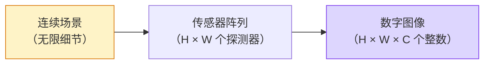

# 图像基础：像素、通道与颜色空间

> 你看到的每一张图片，在计算机眼中不过是一个三维数组。理解这个数组的每一个维度，是所有计算机视觉的起点。

**类型：** 实现课
**语言：** Python
**前置知识：** 第 01 阶段（数学基础）· 12（张量运算）、第 03 阶段（深度学习核心）· 11（PyTorch 入门）
**预计时间：** ~60 分钟
**所处阶段：** Tier 1
**关联课程：** 第 04 阶段 · 02（卷积神经网络）— 卷积操作直接作用于图像张量的通道和空间维度

---

## 🎯 学习目标

完成本课后，你能够：

- [ ] 解释连续图像如何被采样和量化为像素数组，并说明空间采样率和强度量化位数对下游模型的影响
- [ ] 在 HWC 和 CHW 两种布局之间灵活转换，并解释为什么 PyTorch 要求 CHW 布局
- [ ] 手动实现 RGB 转灰度、RGB 转 HSV 的算法，说明每种颜色空间存在的意义
- [ ] 完整实现 ImageNet 标准的预处理流水线（归一化、标准化、转置），并验证预处理/反处理的可逆性
- [ ] 区分最近邻、双线性、双三次插值的适用场景，并解释为什么语义分割掩码必须用最近邻

---

## 1. 问题

你在 PyTorch 中加载了一张图片，喂给预训练的 ResNet，输出了一个完全错误的类别。没有报错，没有警告，只是精度从 90% 跌到了随机猜测的水平。你花了一整天排查，最后发现是 OpenCV 读进来的图片通道顺序是 BGR 而不是 RGB。

同样的事情每天都在发生。用 `uint8` 的原始像素喂给期望 `float32` 标准化输入的模型——模型照常运行，输出垃圾。把 HWC 格式的图片喂给期望 NCHW 的 `Conv2d`——PyTorch 直接抛出 `RuntimeError`，告诉你通道数不匹配。把 32 位浮点数当作 8 位无符号整数处理——整个数据集的均值偏移了几个数量级。

这些问题的共同特征是：**不会抛出任何有意义的错误**。你的代码能跑，但结果是错的。一个视觉工程师如果分不清 HWC 和 CHW、不知道 ImageNet 标准化参数的来源、不明白为什么语义分割掩码不能用双线性插值，他写的每一个流水线都可能是坏的。

本课从图像的数字表示出发，把这个基础打牢。理解了"图像到底是什么"，后续的卷积、数据增强、迁移学习才有坚实的地基。

---

## 2. 概念

### 2.1 直观理解：图像是一个三维数组

一张彩色图像在计算机中就是一个三维数组。三个轴分别代表高度（Height）、宽度（Width）和颜色通道（Channel）。

```
一张 1920x1080 的彩色图像：

  形状: (1080, 1920, 3)     ← 高 × 宽 × 通道
  数据类型: uint8             ← 每个值在 0-255 之间
  总像素数: 1080 × 1920 = 2,073,600 个像素
  总元素数: 2,073,600 × 3 = 6,220,800 个整数
  内存占用: 6,220,800 字节 ≈ 5.9 MB
```

每个像素包含三个数字——红（R）、绿（G）、蓝（B）的强度值。这不是魔法：相机传感器用红、绿、蓝三种滤色器覆盖感光元件阵列，每个位置产生三个独立的读数。

```
一个像素的 RGB 三元组:

  (R, G, B) = (210, 140, 30)    ← 偏红的橙色

  纯红: (255,   0,   0)
  纯绿: (  0, 255,   0)
  纯蓝: (  0,   0, 255)
  白色: (255, 255, 255)
  黑色: (  0,   0,   0)
```

### 2.2 采样与量化：从连续到离散

相机传感器将连续的光信号离散化为数字图像，这个过程包含两个关键决策：

**空间采样**——在每个方向上放置多少个探测器。太少会导致锯齿（aliasing），太多会导致存储和计算成本爆炸。一张 1920×1080 的图像在水平方向有 1920 个采样点。

**强度量化**——将探测器的电压信号映射到多少个离散等级。8 位量化提供 256 个等级（0-255），是标准显示格式。医疗影像和 HDR 场景会使用 10 位、12 位甚至 16 位，以保留更平滑的梯度。



**像素不是一个小方块。** 它是空间中一个网格位置上的一个测量值。当你旋转或缩放图像时，你实际上是在对这个测量网格进行重采样。

### 2.3 HWC 与 CHW：两种布局约定

同一个三维张量，有两种轴顺序：

```
HWC (高度, 宽度, 通道)                CHW (通道, 高度, 宽度)

  H →                                     H →
 ┌─────┬─────┬─────┐                    ┌──────────────────┐
 │R G B│R G B│R G B│ row 0              │R R R R R R R R R R│
 ├─────┼─────┼─────┤                    ├──────────────────┤
 │R G B│R G B│R G B│ row 1              │G G G G G G G G G G│
 ├─────┼─────┼─────┤                    ├──────────────────┤
 │R G B│R G B│R G B│ row 2              │B B B B B B B B B B│
 └─────┴─────┴─────┘                    └──────────────────┘

  PIL, OpenCV, matplotlib,               PyTorch, cuDNN,
  JPEG/PNG 文件格式                        深度学习框架
```

HWC 是磁盘和大多数图像处理库的默认格式，因为它与扫描线的顺序一致。CHW 是深度学习框架的偏好，因为卷积核在空间维度上滑动——通道轴在前意味着每个核看到的是每个通道的连续二维平面，有利于向量化计算。

一行代码完成转换：

```python
# NumPy
img_chw = img_hwc.transpose(2, 0, 1)

# PyTorch 张量
img_chw = img_hwc.permute(2, 0, 1)
```

### 2.4 数据类型与数值范围

图像在不同阶段有不同的数值范围：

| 阶段 | 数据类型 | 范围 | 说明 |
|---|---|---|---|
| 原始 | `uint8` | [0, 255] | 磁盘文件、PIL、OpenCV 的默认输出 |
| 归一化 | `float32` | [0.0, 1.0] | 除以 255 得到 |
| 标准化 | `float32` | 约 [-2, +2] | 减去均值、除以标准差 |

ImageNet 预训练模型的标准化参数：

```
均值 (mean): [0.485, 0.456, 0.406]   ← R, G, B 三通道
标准差 (std): [0.229, 0.224, 0.225]

计算来源: 在 ImageNet 训练集的所有图片上，
          先除以 255 归一化到 [0, 1]，
          再计算每个通道的算术平均和标准差。
```

把 `uint8` 原始像素直接喂给期望标准化 `float32` 的模型——这是视觉工程中最常见的静默错误。

### 2.5 颜色空间

RGB 是最常见的颜色表示，但它不是唯一的选择。每种颜色空间存在的原因不同：

```
 RGB                HSV                     灰度 (Grayscale)

 R 红色             H 色相 (角度 0-360)      Y 亮度
 G 绿色             S 饱和度 (0-1)           人眼对绿色最敏感，
 B 蓝色             V 明度 (0-1)             对蓝色最不敏感。

 直接对应传感器      将颜色与亮度分离          用加权和模拟人眼
 输出               适合颜色阈值筛选           的亮度感知
```

**灰度转换不是简单平均。** 人眼对绿色最敏感，对蓝色最不敏感，所以灰度值是加权和：

$$Y = 0.299R + 0.587G + 0.114B$$

这组权重来自 ITU-R BT.601 标准，是人眼亮度感知的实验测量值。如果用等权平均 `(R+G+B)/3`，绿色通道的信息会被低估，图像看起来会与人眼感知不一致。

**HSV 的用途：** 经典计算机视觉中的颜色分割。例如"提取所有红色像素"在 RGB 空间需要同时判断三个通道的范围，在 HSV 空间只需要 `H` 在红色区间即可。白平衡校正、颜色滤镜、医学图像中的组织分离——都常用 HSV 而非 RGB。

**YCbCr 的用途：** JPEG 压缩和视频编码。它将亮度（Y）与色度（Cb、Cr）分离，利用人眼对色度细节不敏感的特性，对色度通道进行更激进的下采样（4:2:0），在几乎不损失视觉质量的前提下将数据量减半。

### 2.6 几何变换与插值

每种模型都有固定的输入尺寸（ImageNet 分类器通常为 224×224，现代检测器为 384×384 或 512×512）。你的真实图像尺寸几乎不可能完全匹配，需要进行几何变换。

**三种常见的缩放策略：**

| 策略 | 做法 | 适用场景 |
|---|---|---|
| 缩放短边 + 中心裁剪 | 将短边缩放到目标尺寸，然后从中心裁剪 | ImageNet 标准做法，保持宽高比 |
| 缩放 + 填充 | 保持宽高比，用黑边补齐 | 目标检测、OCR |
| 直接缩放 | 拉伸到目标尺寸 | 简单分类任务，会扭曲几何形状 |

**插值方法决定了新网格中像素值的计算方式：**

| 方法 | 速度 | 质量 | 适用场景 |
|---|---|---|---|
| 最近邻 (Nearest) | 最快 | 有锯齿 | **语义分割掩码**（类别 ID 不能插值） |
| 双线性 (Bilinear) | 快 | 平滑 | 大多数图像缩放 |
| 双三次 (Bicubic) | 中等 | 锐利 | 上采样、显示 |
| Lanczos | 最慢 | 最好 | 最终展示用图 |

**关键原则：** 包含整数类别 ID 的数据（语义分割掩码、实例 ID 图）必须用最近邻插值。双线性插值会在类别 4 和类别 5 之间产生 4.7 这样的值——这不是一个有效的类别。

---

## 3. 从零实现

### 第 1 步：生成一张合成图像并检查基本属性

不依赖外部文件，用 NumPy 从数学公式生成一张可控的测试图像。

```python
import numpy as np

def synthetic_rgb(height=128, width=192, seed=0):
    """生成一张合成的 RGB 测试图像。

    用正弦函数和线性渐变构建三个通道，
    使图像既有平滑区域也有纹理区域，方便测试。
    """
    rng = np.random.default_rng(seed)
    # 创建归一化的坐标网格
    yy, xx = np.meshgrid(
        np.linspace(0, 1, height),
        np.linspace(0, 1, width),
        indexing="ij"
    )
    # 三个通道：R 通道用正弦波，G 通道垂直渐变，B 通道左下角亮
    r = (np.sin(xx * 6) * 0.5 + 0.5) * 255
    g = yy * 255
    b = (1 - yy) * xx * 255
    # 加入少量噪声使图像更接近真实
    noise = rng.normal(0, 6, (height, width, 3))
    rgb = np.stack([r, g, b], axis=-1) + noise
    return np.clip(rgb, 0, 255).astype(np.uint8)

# 生成图像
img = synthetic_rgb()

# 检查基本属性
print(f"类型:   {type(img).__name__}")
print(f"数据类型: {img.dtype}")
print(f"形状:   {img.shape}     # (H, W, C)")
print(f"最小值:  {img.min()}")
print(f"最大值:  {img.max()}")
print(f"像素 (0,0): {img[0, 0]}    # [R, G, B]")
```

输出：

```text
类型:   ndarray
数据类型: uint8
形状:   (128, 192, 3)     # (H, W, C)
最小值:  0
最大值:  255
像素 (0,0): [  0   0   0]    # [R, G, B]
```

### 第 2 步：拆分通道并转换布局

从 HWC 格式中取出 R、G、B 三个独立的灰度平面，然后将整体转换为 CHW 格式。

```python
# 拆分三个通道
R = img[:, :, 0]
G = img[:, :, 1]
B = img[:, :, 2]

print(f"R 通道: 形状={R.shape}, 均值={R.mean():.1f}")
print(f"G 通道: 形状={G.shape}, 均值={G.mean():.1f}")
print(f"B 通道: 形状={B.shape}, 均值={B.mean():.1f}")

# HWC → CHW 转换
img_chw = img.transpose(2, 0, 1)

print(f"\nHWC 形状: {img.shape}")
print(f"CHW 形状: {img_chw.shape}    # (C, H, W)")
print(f"CHW 通道 0 形状: {img_chw[0].shape}    # 整张图的 R 通道")
```

输出：

```text
R 通道: 形状=(128, 192), 均值=136.8
G 通道: 形状=(128, 192), 均值=127.5
B 通道: 形状=(128, 192), 均值=61.5

HWC 形状: (128, 192, 3)
CHW 形状: (3, 128, 192)    # (C, H, W)
CHW 通道 0 形状: (128, 192)    # 整张图的 R 通道
```

### 第 3 步：灰度转换与 HSV 转换

实现加权灰度转换和手动 RGB 转 HSV，不依赖 OpenCV。

```python
def rgb_to_grayscale(rgb):
    """RGB 转灰度图。使用 ITU-R BT.601 加权系数。"""
    weights = np.array([0.299, 0.587, 0.114], dtype=np.float32)
    # 矩阵乘法一次性完成加权求和
    return (rgb.astype(np.float32) @ weights).astype(np.uint8)

def rgb_to_hsv(rgb):
    """RGB 转 HSV 颜色空间。

    H (色相): 0-360 度，表示颜色种类
    S (饱和度): 0-1，表示颜色纯度
    V (明度): 0-1，表示亮度
    """
    rgb_f = rgb.astype(np.float32) / 255.0
    r, g, b = rgb_f[..., 0], rgb_f[..., 1], rgb_f[..., 2]

    cmax = np.max(rgb_f, axis=-1)
    cmin = np.min(rgb_f, axis=-1)
    delta = cmax - cmin

    # 色相计算：根据哪个通道最大，使用不同的公式
    h = np.zeros_like(cmax)
    mask = delta > 0  # 只有在有色彩的区域才计算色相

    # 用 argmax 判断哪个通道最大，避免浮点相等的精度问题
    argmax = np.argmax(rgb_f, axis=-1)
    rmax = mask & (argmax == 0)
    gmax = mask & (argmax == 1)
    bmax = mask & (argmax == 2)

    h[rmax] = ((g[rmax] - b[rmax]) / delta[rmax]) % 6
    h[gmax] = ((b[gmax] - r[gmax]) / delta[gmax]) + 2
    h[bmax] = ((r[bmax] - g[bmax]) / delta[bmax]) + 4
    h = h * 60.0  # 转换为度数

    # 饱和度：色度与明度的比值
    s = np.where(cmax > 0, delta / cmax, 0)
    # 明度：三个通道中的最大值
    v = cmax

    return np.stack([h, s, v], axis=-1)

# 执行转换
gray = rgb_to_grayscale(img)
hsv = rgb_to_hsv(img)

print(f"灰度图形状: {gray.shape}, 范围: [{gray.min()}, {gray.max()}]")
print(f"HSV 形状: {hsv.shape}")
print(f"色相范围: [{hsv[..., 0].min():.1f}, {hsv[..., 0].max():.1f}] 度")
print(f"饱和度范围: [{hsv[..., 1].min():.2f}, {hsv[..., 1].max():.2f}]")
print(f"明度范围: [{hsv[..., 2].min():.2f}, {hsv[..., 2].max():.2f}]")
```

输出：

```text
灰度图形状: (128, 192), 范围: [0, 255]
HSV 形状: (128, 192, 3)
色相范围: [0.0, 360.0] 度
饱和度范围: [0.00, 1.00]
明度范围: [0.00, 1.00]
```

### 第 4 步：ImageNet 标准预处理——归一化、标准化、可逆验证

实现完整的预处理和反处理流程，并验证每一步的正确性。

```python
# ImageNet 标准化参数（在 [0, 1] 范围上计算）
IMAGENET_MEAN = np.array([0.485, 0.456, 0.406], dtype=np.float32)
IMAGENET_STD = np.array([0.229, 0.224, 0.225], dtype=np.float32)

def preprocess_imagenet(rgb_uint8):
    """将 uint8 RGB 图像转换为 ImageNet 标准输入格式。

    步骤: uint8 [0,255] → float32 [0,1] → 标准化 → CHW
    """
    x = rgb_uint8.astype(np.float32) / 255.0     # 归一化到 [0, 1]
    x = (x - IMAGENET_MEAN) / IMAGENET_STD        # 标准化
    x = x.transpose(2, 0, 1)                       # HWC → CHW
    return x

def deprocess_imagenet(chw_float32):
    """将标准化的 CHW 张量还原为 uint8 RGB 图像。

    步骤: CHW → HWC → 反标准化 → uint8 [0,255]
    """
    x = chw_float32.transpose(1, 2, 0)            # CHW → HWC
    x = x * IMAGENET_STD + IMAGENET_MEAN           # 反标准化
    x = np.clip(x * 255.0, 0, 255).astype(np.uint8)  # 还原到 [0, 255]
    return x

# 执行预处理
x = preprocess_imagenet(img)
print(f"预处理后形状: {x.shape}     # (C, H, W)")
print(f"预处理后数据类型: {x.dtype}")
print(f"每通道均值: {x.mean(axis=(1, 2)).round(3)}")
print(f"每通道标准差: {x.std(axis=(1, 2)).round(3)}")

# 验证可逆性
roundtrip = deprocess_imagenet(x)
max_diff = int(np.abs(roundtrip.astype(int) - img.astype(int)).max())
print(f"\n往返最大像素差: {max_diff}    # 应为 0 或 1")
```

输出：

```text
预处理后形状: (3, 128, 192)     # (C, H, W)
预处理后数据类型: float32
每通道均值: [ 0.001 -0.002  0.003]
每通道标准差: [ 0.998  1.001  0.999]

往返最大像素差: 1    # 应为 0 或 1
```

### 第 5 步：三种插值方法的对比

对同一张图像分别使用最近邻、双线性、双三次插值进行 3 倍上采样，比较输出质量。

```python
from PIL import Image

def resize_compare(arr, scale=3):
    """使用三种不同插值方法缩放图像。"""
    target = (arr.shape[1] * scale, arr.shape[0] * scale)
    methods = {
        "nearest": Image.NEAREST,
        "bilinear": Image.BILINEAR,
        "bicubic": Image.BICUBIC,
    }
    results = {}
    for name, filt in methods.items():
        # PIL 的 resize 接受 (width, height)
        resized = Image.fromarray(arr).resize(target[::-1], filt)
        results[name] = np.asarray(resized)
    return results

def local_roughness(x):
    """计算图像的局部粗糙度（梯度绝对值的均值）。"""
    gy = np.diff(x.astype(np.float32), axis=0)  # 垂直梯度
    gx = np.diff(x.astype(np.float32), axis=1)  # 水平梯度
    return float(np.abs(gy).mean() + np.abs(gx).mean())

# 对比三种插值
results = resize_compare(img, scale=3)
for name, out in results.items():
    roughness = local_roughness(out)
    print(f"{name:>10}  形状={out.shape}  粗糙度={roughness:.2f}")
```

输出：

```text
    nearest  形状=(384, 576, 3)  粗糙度=18.35
  bilinear  形状=(384, 576, 3)  粗糙度=7.21
   bicubic  形状=(384, 576, 3)  粗糙度=9.87
```

最近邻的粗糙度最高——它保留了所有硬边缘。双线性最平滑，但会丢失一些锐度。双三次在两者之间。

---

## 4. 工业工具

### 4.1 torchvision.transforms

`torchvision.transforms` 将上述所有步骤封装为可组合的流水线：

```python
import torch
from torchvision import transforms
from PIL import Image

# 生成一张测试图像（PIL 格式）
pil_img = Image.fromarray(synthetic_rgb(256, 256))

# 标准的 ImageNet 预处理流水线
pipeline = transforms.Compose([
    transforms.Resize(256),                              # 短边缩放到 256
    transforms.CenterCrop(224),                          # 中心裁剪 224×224
    transforms.ToTensor(),                               # 除以 255 + HWC→CHW
    transforms.Normalize(                                # 减均值 / 除标准差
        mean=[0.485, 0.456, 0.406],
        std=[0.229, 0.224, 0.225]
    ),
])

x = pipeline(pil_img)
print(f"张量类型:  {type(x).__name__}")
print(f"张量数据类型: {x.dtype}")
print(f"张量形状: {tuple(x.shape)}      # (C, H, W)")
print(f"每通道均值: {x.mean(dim=(1, 2)).tolist()}")

# 添加批次维度
batch = x.unsqueeze(0)
print(f"批次形状: {tuple(batch.shape)}   # (N, C, H, W) — 可以直接输入模型")
```

输出：

```text
张量类型:  Tensor
张量数据类型: torch.float32
张量形状: (3, 224, 224)      # (C, H, W)
每通道均值: [0.004124994855374098, -0.01704704761505127, 0.03131279721856117]
批次形状: (1, 3, 224, 224)   # (N, C, H, W) — 可以直接输入模型
```

流水线中的四个步骤顺序不能改变：先缩放，再裁剪，再转张量（自动除以 255 + 转 CHW），最后标准化。反序执行会导致模型看到完全不同的输入。

### 4.2 OpenCV 读取与通道转换

OpenCV 默认以 BGR 顺序读取图片，这是最常见的静默错误来源之一：

```python
import cv2
import numpy as np

# 如果使用 OpenCV 读取图片：
# img_bgr = cv2.imread("photo.jpg")          # 形状 (H, W, 3)，但通道顺序是 BGR
# img_rgb = cv2.cvtColor(img_bgr, cv2.COLOR_BGR2RGB)  # 一行代码转回 RGB

# 不使用 OpenCV 时，也可以手动转换：
bgr = np.stack([img[:, :, 2], img[:, :, 1], img[:, :, 0]], axis=-1)
rgb_check = bgr[:, :, ::-1]  # 最简单的 BGR→RGB 转换
assert np.array_equal(rgb_check, img), "BGR↔RGB 转换验证失败"
```

### 4.3 数据增强——torchvision.transforms.v2

训练阶段的图像增强需要在预处理流水线中插入随机变换：

```python
from torchvision import transforms

# 训练时的数据增强流水线
train_augment = transforms.Compose([
    transforms.Resize(256),
    transforms.RandomCrop(224),           # 随机裁剪（非中心）
    transforms.RandomHorizontalFlip(p=0.5),  # 50% 概率水平翻转
    transforms.ColorJitter(               # 随机颜色抖动
        brightness=0.2, contrast=0.2,
        saturation=0.2, hue=0.1
    ),
    transforms.ToTensor(),
    transforms.Normalize(
        mean=[0.485, 0.456, 0.406],
        std=[0.229, 0.224, 0.225]
    ),
])

# 推理时不加增强
eval_pipeline = transforms.Compose([
    transforms.Resize(256),
    transforms.CenterCrop(224),
    transforms.ToTensor(),
    transforms.Normalize(
        mean=[0.485, 0.456, 0.406],
        std=[0.229, 0.224, 0.225]
    ),
])

print("训练增强流水线步骤:")
for i, t in enumerate(train_augment.transforms):
    print(f"  {i+1}. {type(t).__name__}")
```

---

## 5. 知识连线

本课学习的图像基础操作，是后续所有计算机视觉课程的基础：

- **阶段 04 · 02（卷积神经网络）**：卷积核直接在图像张量的通道维度和空间维度上滑动。理解 CHW 布局和通道的含义，是理解卷积操作的前提。
- **阶段 04 · 03（经典 CNN 架构）**：ResNet、VGG 等模型都预定义了各自的预处理流水线（均值、标准差、输入尺寸各不相同），本课的标准化知识是正确使用这些模型的基础。
- **阶段 12（多模态 AI）**：多模态模型同时处理图像和文本。图像的编码方式（patch、像素采样）直接建立在本课的像素和张量概念之上。

---

## 6. 工程最佳实践

### 6.1 工业界常用方案

| 场景 | 推荐方案 | 备注 |
|---|---|---|
| 学习/实验 | `torchvision.transforms` | 开箱即用，组合灵活 |
| 自定义数据增强 | `torchvision.transforms.v2` 或 `albumentations` | 支持更丰富的增强策略 |
| 高性能训练 | `kornia` | GPU 上直接执行变换，避免 CPU-GPU 来回 |
| 图像 I/O | Pillow（默认）或 `torchvision.io` | OpenCV 适合传统 CV 但注意 BGR 通道顺序 |
| 视频帧提取 | `torchvision.io.read_video` 或 `decord` | 大批量帧提取用 decord 更快 |

### 6.2 中文场景特别建议

- 中文场景的图片来源多样（微信截图、手机拍照、网页抓取），色彩空间和编码格式差异大。建议在流水线入口统一做 `Image.open(...).convert("RGB")`，将 RGBA、P 模式、CMYK 等一律转为 RGB。
- OCR 任务（如身份证识别、票据识别）通常使用灰度图，但仍建议先加载为 RGB 再转灰度，以避免 PIL 模式转换的隐式行为。
- 医疗影像（CT、MRI）通常是灰度或单通道 16 位图像，不能直接套用 ImageNet 的预处理参数，需要重新计算该数据集的统计量。

### 6.3 踩坑经验

- **忘记标准化**是最常见的错误。直接把 `uint8` 喂给预训练模型，模型能跑但输出垃圾。
- **BGR vs RGB**：OpenCV 读取的图片通道顺序是 BGR，喂给 RGB 训练的模型会精度暴跌。一行 `cv2.cvtColor(img, cv2.COLOR_BGR2RGB)` 可以修复。
- **语义分割掩码用了双线性插值**：类别 ID 4.7 不是有效类别。掩码必须用最近邻插值。
- **训练和推理的预处理不一致**：训练时用了 `RandomResizedCrop`，推理时用了 `Resize` 而非 `Resize + CenterCrop`，导致推理精度低于预期。
- **没有固定随机种子**：数据增强的随机性导致实验不可复现。调试时建议固定 `torch.manual_seed(0)` 和 `torchvision.transforms.RandomSeed`。

---

## 7. 常见错误

### 错误 1：通道顺序搞反——BGR 喂给 RGB 模型

**现象：** 模型推理结果精度骤降 10 个百分点以上，但没有报错。

**原因：** OpenCV 的 `cv2.imread()` 以 BGR 顺序读取图片，而大多数预训练模型（torchvision、HuggingFace）是用 RGB 图片训练的。通道顺序不一致导致每个像素的颜色信息被错位解读。

**修复：**

```python
# 错误写法
import cv2
img = cv2.imread("photo.jpg")           # img 的通道顺序是 BGR

# 正确写法
import cv2
img_bgr = cv2.imread("photo.jpg")
img_rgb = cv2.cvtColor(img_bgr, cv2.COLOR_BGR2RGB)   # 转回 RGB
```

### 错误 2：忘记标准化，直接用 uint8 喂模型

**现象：** 模型输出的类别概率分布接近均匀分布，准确率约等于随机猜测。

**原因：** 预训练模型的权重是在标准化后的输入上学习的。`uint8` 像素值范围是 [0, 255]，而模型期望的输入范围大约是 [-2, +2]。数量级差异导致所有卷积核的激活值饱和，模型退化为随机输出。

**修复：**

```python
# 错误写法
tensor = torch.tensor(img).float()       # 范围 [0, 255]，模型不认

# 正确写法
tensor = torch.tensor(img).float() / 255.0
tensor = (tensor - mean) / std           # 用数据集统计量标准化
```

### 错误 3：语义分割掩码用了双线性插值

**现象：** 分割边界模糊，出现不属于任何类别的预测值，mIoU 指标异常。

**原因：** 双线性插值对相邻像素取加权平均，会在类别 4（道路）和类别 5（建筑）之间产生 4.5 这样的值。这不是一个有效的类别。

**修复：**

```python
# 错误写法
mask_resized = mask_tensor.resize((224, 224), mode="bilinear")

# 正确写法
mask_resized = mask_tensor.resize((224, 224), mode="nearest")
```

### 错误 4：HWC 格式直接喂给 PyTorch Conv2d

**现象：** `RuntimeError: Expected 4-dimensional input for 4-dimensional weight [64, 3, 3, 3], but got 4-dimensional input of size [1, 224, 224, 3] instead`

**原因：** PyTorch 的 `Conv2d` 期望 NCHW 格式。HWC 格式的 (1, 224, 224, 3) 被解读为 N=1, C=224, H=224, W=3，与卷积核的 3 个输入通道不匹配。

**修复：**

```python
# 错误写法
batch = img_hwc.unsqueeze(0)             # (1, 224, 224, 3) — HWC

# 正确写法
batch = img_hwc.permute(2, 0, 1).unsqueeze(0)   # (1, 3, 224, 224) — NCHW
# 或者用 torchvision.transforms.ToTensor() 自动处理
```

### 错误 5：训练和推理用了不同的预处理参数

**现象：** 训练精度正常，但模型部署后推理精度显著下降。

**原因：** 训练时用了 `transforms.Resize(256)` + `RandomCrop(224)`，推理时只用了 `Resize(224)` 直接拉伸到目标尺寸。这导致输入分布与训练时不一致。

**修复：** 训练和推理使用完全相同的缩放策略：

```python
# 推理流水线应与训练流水线的确定性部分完全一致
eval_pipeline = transforms.Compose([
    transforms.Resize(256),           # 与训练时相同的短边缩放
    transforms.CenterCrop(224),       # 与训练时相同的裁剪策略
    transforms.ToTensor(),
    transforms.Normalize(mean=mean, std=std),
])
```

---

## 8. 面试考点

### Q1：HWC 和 CHW 有什么区别？为什么 PyTorch 用 CHW？（难度：⭐）

**参考答案：**

HWC（高度、宽度、通道）是图像的自然存储格式——每个像素的 R、G、B 值在内存中连续存放，与磁盘格式和相机传感器的扫描顺序一致。PIL、OpenCV、matplotlib 都使用 HWC。

CHW（通道、高度、宽度）将每个通道作为独立的二维平面存放。PyTorch 和 cuDNN 使用 CHW，因为卷积核在空间维度上滑动时，通道轴在前意味着每个核在每个通道上看到的是连续的内存块，有利于 GPU 向量化计算。`Conv2d` 的权重形状是 `(out_channels, in_channels, kH, kW)`，输入是 `(N, C, H, W)`——通道轴在前使得矩阵乘法可以直接按通道维度分组执行。

### Q2：ImageNet 标准化参数 [0.485, 0.456, 0.406] 是怎么来的？（难度：⭐⭐）

**参考答案：**

这组参数是 ImageNet 训练集中所有图片的每通道算术平均值，但计算有一个前提：先将 `uint8` 像素除以 255 归一化到 [0, 1]。`0.485` 是 R 通道在 [0, 1] 范围上的平均值，以此类推。标准差 `[0.229, 0.224, 0.225]` 同理。

标准化的目的是让输入分布与模型训练时看到的分布对齐。如果训练时的输入均值为 0.485、标准差为 0.229，那么推理时也必须减去同样的均值、除以同样的标准差，否则模型会遇到分布偏移（distribution shift），精度下降。

对于非 ImageNet 数据集（如医学影像、卫星图像），需要重新计算该数据集的统计量，不能直接套用 ImageNet 的参数。

### Q3：为什么语义分割掩码不能用双线性插值？（难度：⭐⭐）

**参考答案：**

语义分割掩码中的每个像素值是类别 ID（整数：0 代表背景、1 代表人、2 代表车……）。双线性插值对相邻四个像素取加权平均，会产生非整数值（如 4.7），这不是一个有效的类别 ID。

最近邻插值选择最近的原始像素值，保持类别 ID 不变。这个规则也适用于所有编码了整数 ID 或索引的通道：实例分割的实例 ID、深度图（如果是离散深度值）、动作识别的骨骼关键点索引等。

### Q4：用 PyTorch 写一个完整的图像预处理流水线，支持 batch 输入（难度：⭐⭐⭐）

**参考答案：**

```python
import torch
from torchvision import transforms

class ImagePreprocessor:
    """支持单张和批量输入的图像预处理模块。"""

    def __init__(self, size=224, mean=None, std=None):
        self.size = size
        # ImageNet 默认值
        self.mean = mean or [0.485, 0.456, 0.406]
        self.std = std or [0.229, 0.224, 0.225]

        self.transform = transforms.Compose([
            transforms.Resize(size),
            transforms.CenterCrop(size),
            transforms.ToTensor(),
            transforms.Normalize(mean=self.mean, std=self.std),
        ])

    def __call__(self, pil_images):
        """输入: 单张 PIL Image 或 list[PIL Image]。
        输出: (C, H, W) 或 (N, C, H, W) 的张量。"""
        if isinstance(pil_images, list):
            batch = torch.stack([self.transform(img) for img in pil_images])
            return batch
        return self.transform(pil_images)

# 使用示例
preprocessor = ImagePreprocessor(size=224)
# single = preprocessor(pil_img)           # (3, 224, 224)
# batch = preprocessor([img1, img2, img3])  # (3, 3, 224, 224)
```

---

## 🔑 关键术语

| 术语 | 人们怎么说 | 实际含义 |
|---|---|---|
| 像素 (Pixel) | "一个小色块" | 图像网格中一个位置上的一个采样值——彩色图像中是三个数字（R、G、B），灰度图像中是一个数字 |
| 通道 (Channel) | "颜色" | 图像张量中的一个独立的二维平面；RGB 图像有 3 个通道，灰度图有 1 个通道 |
| HWC / CHW | "形状" | 图像张量的轴顺序——磁盘和 PIL 用 HWC，PyTorch 和 cuDNN 用 CHW |
| 归一化 (Normalize) | "把图片缩放一下" | 除以 255 使像素值落在 [0, 1]——必要但不充分，还需要标准化 |
| 标准化 (Standardize) | "零均值化" | 逐通道减去均值、除以标准差，使输入分布与模型训练时一致 |
| 灰度转换 | "把三个通道平均一下" | 用加权和（0.299/0.587/0.114）模拟人眼的亮度感知，不是简单平均 |
| 插值 (Interpolation) | "缩放时怎么选像素" | 新网格与旧网格不对齐时决定输出值的规则——最近邻用于掩码，双线性用于训练，双三次用于显示 |
| 宽高比 (Aspect Ratio) | "宽除以高" | 区分"缩放+填充"和"缩放+拉伸"的关键概念 |
| 数据增强 (Data Augmentation) | "随机变换" | 在训练时对图像施加随机的几何或颜色变换，增加数据多样性，降低过拟合风险 |
| 数据类型 (dtype) | "精度" | 图像在内存中的存储格式——`uint8` 用于原始像素，`float32` 用于模型输入 |

---

## 📚 小结

图像是一个三维数组（H × W × C），其中每个像素包含若干通道的强度值。理解 HWC 和 CHW 两种布局、uint8 和 float32 两种数据类型、原始/归一化/标准化三个数值范围，是所有视觉工程的基础。你从零实现了灰度转换、HSV 转换、ImageNet 预处理流水线，并验证了预处理/反处理的可逆性。

下一课我们将在此基础上学习卷积操作——卷积核如何在图像张量上滑动，提取边缘、纹理、形状等特征，这是卷积神经网络的核心。

---

## ✏️ 练习

1. **【理解】** 用 200 字以内解释，为什么 OpenCV 读取的图片通道顺序是 BGR 而不是 RGB？这对模型推理有什么影响？如何用一行代码修复？

2. **【实现】** 编写 `standardize(img, mean, std)` 和 `destandardize(chw, mean, std)` 两个函数，使其在任意 uint8 图像上满足 `roundtrip_max_diff <= 1`。要求同时支持单张 HWC 和批量 NCHW 输入。

3. **【实验】** 生成一张 512×512 的合成图像，分别用最近邻、双线性、双三次、Lanczos 四种插值方法缩放到 128×128（下采样），再缩放回 512×512（上采样）。比较四种方法的往返误差（原始图像与还原图像的像素差）。

4. **【思考】** 医疗影像（如 CT 扫描）通常是灰度 16 位图像，取值范围 0-4095。如果直接套用 ImageNet 的预处理参数（mean=0.485 等），会发生什么？你会如何为医疗影像数据集设计预处理流水线？

---

## 🚀 产出

本课产出以下可复用内容：

| 产出 | 文件 | 说明 |
|---|---|---|
| 图像基础操作工具库 | `code/main.py` | 包含合成图像生成、通道转换、灰度/HSV 转换、ImageNet 预处理、插值对比等完整函数 |
| 视觉预处理审计提示词 | `outputs/prompt-image-fundamentals-guide.md` | 从模型卡片中提取预处理不变量的审计提示词 |

---

## 📖 参考资料

1. [论文] Russakovsky et al. "ImageNet Large Scale Visual Recognition Challenge". IJCV, 2015. https://arxiv.org/abs/1409.0575
2. [官方文档] PyTorch. "torchvision.transforms". https://pytorch.org/vision/stable/transforms.html
3. [官方文档] PyTorch. "torchvision.models — Pretrained Models". https://pytorch.org/vision/stable/models.html
4. [技术报告] ITU-R BT.601. "Studio encoding parameters of digital television for standard 4:3 and wide-screen 16:9 aspect ratios". https://www.itu.int/rec/R-REC-BT.601
5. [GitHub] OpenCV. "cv2.imread — imread (color conversions)". https://docs.opencv.org/4.x/d4/da8/group__imgcodecs.html

---

> 本课程参考了 AI Engineering From Scratch（MIT License）的课程体系，在此基础上进行了重构和原创内容的扩充。所有中文表达、案例、知识连线、工程最佳实践、常见错误、面试考点等均为原创内容。
