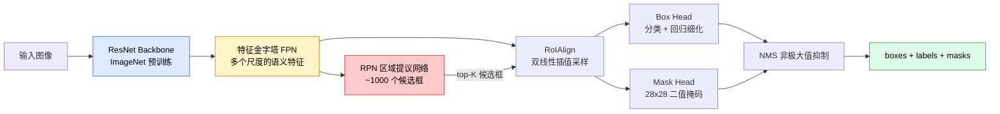

# 实例分割：Mask R-CNN

> 在 Faster R-CNN 上增加一个微小的 mask 分支，你就有了实例分割。最难的工程问题不是架构——而是如何在浮点坐标上做双线性采样。

**类型：** 实现课
**语言：** Python
**前置知识：** 第 4 阶段·06（YOLO）、第 4 阶段·07（U-Net）
**预计时间：** ~90 分钟
**所处阶段：** Tier 1
**关联课程：** 第 03 阶段·05（残差网络 ResNet）— 理解 Mask R-CNN 的 backbone 从何而来

## 🎯 学习目标

完成本课后，你能够：

- [ ] 完整追踪 Mask R-CNN 端到端架构：backbone → FPN → RPN → RoIAlign → box head → mask head
- [ ] 从零实现 RoIAlign，并解释为什么 RoIPool 被淘汰
- [ ] 使用 torchvision 的 `maskrcnn_resnet50_fpn_v2` 预训练模型获取生产级实例掩码，正确解析输出格式
- [ ] 通过替换 box head 和 mask head、冻结 backbone，在小型自定义数据集上微调 Mask R-CNN

## 1. 问题

语义分割给你一张像素级的"颜色地图"——整张图中的汽车区域涂成蓝色，草地涂成绿色。但你数不出图中有几辆车。

```
语义分割的结果：

    ████████████   ← 整个车辆区域都是同一颜色
    ████████████
    ██░░░░░░░░██   ← 你无法区分这是两辆车还是一辆车
    ██░░░░░░░░██
    ████████████
    ████████████
```

实例分割要求每一个物体都有自己的独立掩码，即使它们属于同一个类别。

```
实例分割的结果：

    ▓▓▓▓▓▓▓▓▓▓▓▓   ← 车辆 A（黑色填充）
    ▓▓▓▓▓▓▓▓▓▓▓▓
    ▒▒▒▒▒▒▒▒▒▒▒▒   ← 车辆 B（灰色填充）
    ▒▒▒▒▒▒▒▒▒▒▒▒
    ▓▓▓▓▓▓▓▓▓▓▓▓
    ▒▒▒▒▒▒▒▒▒▒▒▒
```

这种区分看似微小，但在以下场景中是决定性的：

- **计数**：生产线上的零件数量、显微镜下的细胞数量
- **跨帧追踪**：视频中同一物体的运动轨迹
- **测量**：每块砖的精确边界、每个缺陷区域的面积

2017 年，何恺明等人在论文 **"Mask R-CNN"** 中解决了这个问题。他们的方法之优雅——只是在一个目标检测器上增加一个小小的附加输出分支——以至于此后五年里几乎所有实例分割的论文都是 Mask R-CNN 的变体。今天，torchvision 中的实现仍然是小到中等规模数据集的生产默认选择。

但真正的工程难点隐藏在细节中：如何从一个候选框中提取固定大小的特征区域，而这个框的角点往往不落在像素边界上？做得不对，mAP 会在不知不觉间损失几个百分点。这就是 RoIAlign 要解决的问题。

## 2. 概念

### 2.1 整体架构

Mask R-CNN 的架构由五个关键组件组成：



下面逐一拆解这五个组件：

1. **Backbone（主干网络）**：通常是 ResNet-50 或 ResNet-101，在 ImageNet 上预训练。它输出一组步长为 4、8、16、32 的特征图层次结构。
2. **FPN（特征金字塔网络）**：自顶向下的路径加上横向连接，使每一层都拥有 C 通道的丰富语义特征。检测器根据目标大小将查询路由到匹配的 FPN 层级。
3. **RPN（区域提议网络）**：一个小卷积头，在每个锚框位置预测"这里有没有物体"以及"如何改进这个框"。每张图像产生约 1000 个候选框。
4. **RoIAlign**：从任何 FPN 层级的任意候选框中，以双线性插值的方式采样固定大小的特征区域。不经过取整。
5. **Heads（输出头）**：两个分支并行工作——box head 用两层全连接网络细化框并选出类别，mask head 用小卷积网络为每个候选框输出 `28x28` 的二进制掩码。

### 2.2 从 Faster R-CNN 到 Mask R-CNN：多了一个头

Mask R-CNN 的架构继承自 Faster R-CNN，增量只有一行伪代码："再多输出一个 mask"。

```
Faster R-CNN:
  Input → Backbone → FPN → RPN → RoIPool → Box Head → boxes + labels

Mask R-CNN:
  Input → Backbone → FPN → RPN → RoIAlign → ├─ Box Head → boxes + labels
                                        │     └─ Mask Head → masks
```

关键变化有三个：

- **RoIPool → RoIAlign**：前面已经讨论过，这是精度提升的根基
- **无数据争用（No data aliasing）**：RoIAlign 保证每个采样点的梯度都能追溯到原始像素，不再存在"两个相邻候选框抢同一个像素"的问题
- **可并行的输出头**：mask head 与 box head 共享 RoIAlign 的输出，各自独立训练

### 2.3 为什么 RoIAlign 不可或缺

原生的 Fast R-CNN 使用 RoIPool。它的操作很简单：将候选框分成若干网格，每个网格取最大池化值。但它在每一步都将坐标取整为整数：

```
RoIPool 的问题（以 stride=16 为例）：

原始候选框: (34.7, 51.3, 98.2, 142.9)

第一步取整 → (34, 51, 98, 142)  — 偏移约 1-2 个像素
第二步网格分界取整 → 进一步偏移
累积误差 → 采样区域与实际物体不匹配

在 stride=32 的特征图上，一个像素的物理含义 = 原图的 32x32 个像素
对齐误差导致 mask 边缘模糊，mAP 下降 3-4 个百分点
```

RoIAlign 的做法彻底消除取整：

```
RoIAlign 的做法：

原始候选框: (34.7, 51.3, 98.2, 142.9)

在每个 cell 的中心放置 sampling points（精确浮点坐标）
对每个 point 使用双线性插值从特征图中获取数值
无取整、无量化、无梯度丢弃
```

双线性插值的数学形式非常简单：对于一个采样点 $(x, y)$，找到它周围的四个像素点，按距离加权求和：

$$
\text{value}(x, y) = \sum_{i,j \in \{0,1\}} w_i \cdot w_j \cdot F(y+i, x+j)
$$

其中 $w_0 = (1 - \Delta x)(1 - \Delta y)$，$w_1 = \Delta x \cdot \Delta y$，$\Delta x, \Delta y$ 分别是坐标的小数部分。

这种设计的核心洞察是：**采样点的梯度可以直接流回输入特征的连续空间**。因为双线性插值是一个处处可微的函数。这也是 Mask R-CNN 能端到端训练的根本原因。

### 2.4 FPN：感受野适配

FPN 解决了一个直观但常被忽视的问题：**不同尺寸的目标需要不同尺度的特征图**。

想象一张 800x600 的图片中有三辆车：一辆巨大的卡车占满画面，一辆正常大小的轿车在远处，一只小猫在角落。如果只用 stride-32 的特征图：

- 卡车的轮廓在特征图上可能占据 30x30 个网格单元——丰富的细节
- 猫的形状只有 0.5x0.5 个网格单元——空间信息几乎为零

FPN 通过自顶向下路径和 1x1 卷积的横向连接，让每个层级都保留语义信息的同时拥有合适的分辨率：

```
FPN 层级分配策略：

 stride-4 (P2): 小目标  —  人脸、飞鸟、远处行人
 stride-8 (P3): 中小目标 —  近处车辆、家具
 stride-16(P4): 大目标   —  近处车辆、人体
 stride-32(P5): 超大目标 —  全景、大型建筑结构
```

每个候选框在进入 head 之前，FPN 自动将其路由到最合适的层级。这就是为什么 Mask R-CNN 在处理尺度变化大的场景时表现突出。

### 2.5 联合训练的四种损失

Mask R-CNN 的训练过程同时优化四项损失：

$$
L = L_{\text{rpn\_cls}} + L_{\text{rpn\_box}} + L_{\text{box\_cls}} + L_{\text{box\_reg}} + L_{\text{mask}}
$$

| 损失项 | 类型 | 作用于 | 说明 |
|--------|------|--------|------|
| $L_{\text{rpn\_cls}}$ | 二元交叉熵 | RPN 提出的 ~1000 个候选框 | 判断每个锚框是否包含物体 |
| $L_{\text{rpn\_box}}$ | Smooth L1 | RPN 的框回归分支 | 将锚框修正为更好的边界框 |
| $L_{\text{box\_cls}}$ | 交叉熵（C+1 类） | Box Head | 对 NMS 后剩余的框进行分类 |
| $L_{\text{box\_reg}}$ | Smooth L1 | Box Head 的回归分支 | 精细化框的位置和尺寸 |
| $L_{\text{mask}}$ | 逐像素 BCE | Mask Head | 预测 28x28 的二值掩码 |

值得注意的是，每一项损失都有自己独立的默认权重。torchvision 的实现将它们作为构造函数的参数暴露出来，这使得你可以针对特定任务调整各项损失的相对重要性。

### 2.6 输出格式解析

`torchvision.models.detection.maskrcnn_resnet50_fpn_v2` 返回一个列表，每张图片对应一个字典：

```python
{
    "boxes":   (N, 4)       # 格式 (x1, y1, x2, y2)，像素坐标
    "labels":  (N,)         # 类别 ID，0 = 背景（推理时被过滤），1-based
    "scores":  (N,)         # 置信度分数
    "masks":   (N, 1, H, W) # float 类型，范围 [0, 1]，阈值 0.5 得到二值掩码
}
```

mask 张量已经是完整的图像分辨率。内部会将 28x28 的 head 输出上采样到原始大小，你不需要自己处理。

## 3. 从零实现

### 第 1 步：RoIAlign 核心逻辑

RoIAlign 是所有 Mask R-CNN 组件中最容易以代码形式理解的部分——比文字描述更清晰。下面是完整实现：

```python
import torch
import torch.nn.functional as F


def roi_align_single(feature, box, output_size=7, spatial_scale=1 / 16.0):
    """
    feature: (C, H, W) 单张图像的特征图
    box: [x1, y1, x2, y2] 原始图像像素坐标系下的候选框
    output_size: 输出网格边长（box head 用 7，mask head 用 14）
    spatial_scale: 特征图步长的倒数
    """
    C, H, W = feature.shape

    # 缩放到特征图空间，减去 0.5 对齐 grid_sample 的坐标约定
    x1, y1, x2, y2 = [c * spatial_scale - 0.5 for c in box]

    # 计算每个 bin 的宽度和高度
    bin_w = (x2 - x1) / output_size
    bin_h = (y2 - y1) / output_size

    # 在每个 bin 的中心放置采样点（浮点坐标，绝不取整）
    grid_y = torch.linspace(
        y1 + bin_h / 2, y2 - bin_h / 2, output_size, device=feature.device
    )
    grid_x = torch.linspace(
        x1 + bin_w / 2, x2 - bin_w / 2, output_size, device=feature.device
    )
    yy, xx = torch.meshgrid(grid_y, grid_x, indexing="ij")

    # 转换为 [-1, 1] 范围供 grid_sample 使用
    gx = 2 * (xx + 0.5) / W - 1
    gy = 2 * (yy + 0.5) / H - 1
    grid = torch.stack([gx, gy], dim=-1).unsqueeze(0)

    # 双线性采样，align_corners=False 是关键
    sampled = F.grid_sample(
        feature.unsqueeze(0), grid, mode="bilinear", align_corners=False
    )
    return sampled.squeeze(0)
```

几行代码背后的设计决策：

- **减去 0.5**：PyTorch 的 `grid_sample` 约定特征图左上角的中心位于 (0, 0)。如果不减 0.5，所有采样点会系统性地偏移半个像素。
- **`align_corners=False`**：这将坐标范围 $[-1, 1]$ 映射到 $[0, W-1]$ 而不是 $[0, W]$。对于 RoIAlign 来说这是正确的选择。
- **`indexing="ij"`**：确保 `meshgrid` 输出的行列顺序与坐标系的 $y, x$ 一致。

### 第 2 步：验证你的实现

与 torchvision 内置的 `roi_align` 对比：

```python
from torchvision.ops import roi_align

torch.manual_seed(0)
feature = torch.randn(1, 16, 50, 50)
boxes = torch.tensor([[0, 10, 20, 100, 90]], dtype=torch.float32)

ours = roi_align_single(
    feature[0], boxes[0, 1:].tolist(),
    output_size=7, spatial_scale=1 / 4
)
theirs = roi_align(
    feature, boxes, output_size=(7, 7),
    spatial_scale=1 / 4, sampling_ratio=1, aligned=True
)[0]

print(f"ours shape:     {tuple(ours.shape)}")           # (16, 7, 7)
print(f"theirs shape:   {tuple(theirs.shape)}")         # (16, 7, 7)
print(f"max diff:       {(ours - theirs).abs().max():.2e}")  # < 1e-5
```

当使用 `sampling_ratio=1` 且 `aligned=True` 时，两者的差异通常在 $10^{-5}$ 以内——完全来自浮点精度的尾数误差。

### 第 3 步：加载预训练模型

torchvision 提供了开箱即用的预训练 Mask R-CNN：

```python
from torchvision.models.detection import (
    maskrcnn_resnet50_fpn_v2,
    MaskRCNN_ResNet50_FPN_V2_Weights,
)

model = maskrcnn_resnet50_fpn_v2(
    weights=MaskRCNN_ResNet50_FPN_V2_Weights.DEFAULT
)
model.eval()

total_params = sum(p.numel() for p in model.parameters())
print(f"总参数量: {total_params:,}")         # ~46M
```

这个模型在 COCO 数据集上训练，支持 80 个前景类别加 1 个背景类，共 81 类。第一个类别（ID 0）是背景；所有实际检测到的物体从 ID 1 开始。

### 第 4 步：推理与输出解析

```python
with torch.no_grad():
    batch = torch.randn(1, 3, 480, 640)
    predictions = model([batch])[0]  # 取第一张图

p = predictions
binary_masks = (p["masks"][:, 1:] > 0.5).squeeze(1)  # (N, H, W)

print(f"检测到 {len(p['scores'])} 个物体")
for i, label in enumerate(p["labels"]):
    print(
        f"  #{i}: 类别={label.item()}, "
        f"置信度={p['scores'][i]:.3f}, "
        f"框={p['boxes'][i].tolist()}"
    )
```

`masks` 张量的形状是 `(N, 1, H, W)`——每个检测物体一张全图像素分辨率的掩码。`[:, 1:]` 切片丢弃了背景通道（置信度极低），然后用 `> 0.5` 阈值化为二值掩码。

### 第 5 步：替换 head 用于自定义类别

微调 Mask R-CNN 的标准模式是：**复用 backbone、FPN 和 RPN，只替换两个分类 head**。

```python
from torchvision.models.detection.faster_rcnn import FastRCNNPredictor
from torchvision.models.detection.mask_rcnn import MaskRCNNPredictor


def build_custom_maskrcnn(num_classes):
    """num_classes 必须包含背景类。4 个物体类 → num_classes=5"""
    model = maskrcnn_resnet50_fpn_v2(
        weights=MaskRCNN_ResNet50_FPN_V2_Weights.DEFAULT
    )

    # 替换 box head 的分类器
    in_features = model.roi_heads.box_predictor.cls_score.in_features
    model.roi_heads.box_predictor = FastRCNNPredictor(in_features, num_classes)

    # 替换 mask head
    in_features_mask = model.roi_heads.mask_predictor.conv5_mask.in_channels
    hidden_layer = 256
    model.roi_heads.mask_predictor = MaskRCNNPredictor(
        in_features_mask, hidden_layer, num_classes
    )

    return model

custom_model = build_custom_maskrcnn(num_classes=5)
```

这个流程几乎与 Faster R-CNN 的 head 替换完全相同——唯一的区别是多了一个 mask predictor。

### 第 6 步：冻结 backbone 以防止过拟合

在小数据集上，冻结 backbone 是最关键的一步：

```python
def freeze_backbone(model):
    # torchvision 的 Mask R-CNN 将 FPN 封装在 model.backbone 中
    # 冻结 model.backbone.parameters() 会同时覆盖 ResNet 和 FPN
    for param in model.backbone.parameters():
        param.requires_grad = False
    return model

custom_model = freeze_backbone(custom_model)
trainable = sum(p.numel() for p in custom_model.parameters() if p.requires_grad)
total = sum(p.numel() for p in custom_model.parameters())
print(f"可训练参数: {trainable:,} / {total:,} ({trainable/total*100:.1f}%)")
```

在 500 张图像的数据集上，这一步是收敛与过拟合之间的分水岭。冻结后的可训练参数量通常不到总参数的 1%。

## 4. 工业工具

### 4.1 PyTorch torchvision

torchvision 提供两种主要接口：

```python
# === 方式 1：直接从预训练权重开始 ===
from torchvision.models.detection import (
    maskrcnn_resnet50_fpn_v2,
)

model = maskrcnn_resnet50_fpn_v2(pretrained=True)

# === 方式 2：使用 v2 系列（推荐）— 更好的预训练权重 ===
from torchvision.models.detection import (
    maskrcnn_resnet50_fpn_v2,
    MaskRCNN_ResNet50_FPN_V2_Weights,
)

weights = MaskRCNN_ResNet50_FPN_V2_Weights.COCO_V1
model = maskrcnn_resnet50_fpn_v2(weights=weights)
```

V2 系列使用了改进的 RPN 锚框设计和更高质量的反向权重初始化，在 COCO 基准上比 v1 提升约 1 mAP。

### 4.2 Detectron2（Meta 工业级框架）

Detectron2 是 Facebook Research 维护的生产级实例分割框架，支持 Mask R-CNN、Cascade Mask R-CNN、Mask2Former 等多种架构：

```python
from detectron2.config import get_cfg
from detectron2.engine import DefaultTrainer
from detectron2 import model_zoo

cfg = model_zoo.get_config("COCO-InstanceSegmentation/mask_rcnn_R_50_FPN.yaml")
cfg.MODEL.WEIGHTS = "detectron2://COCO-InstanceSegmentation/..."
cfg.DATALOADER.NUM_WORKERS = 4
trainer = DefaultTrainer(cfg)
```

Detectron2 的优势在于其模块化设计——你可以自由替换 backbone（ResNet → Swin Transformer）、替换 head（Mask R-CNN → Cascade Mask R-CNN）、切换数据集格式（COCO → VOC）。这也是业界大规模部署实例分割的首选框架。

### 4.3 YOLOv8-seg（实时实例分割）

如果你的场景需要实时推理，YOLOv8-seg 是 Mask R-CNN 的最佳替代方案。它将分割头直接附加到 YOLOv8 检测网络上：

```python
from ultralytics import YOLO

model = YOLO("yolov8l-seg.pt")
results = model.predict("image.jpg", conf=0.25)
masks = results[0].masks  # (N, H, W)
```

速度对比：

| 实现方式 | GPU 推理延迟 (ms) | mask AP@0.5:0.95 (COCO) | 适用场景 |
|---------|-------------------|-------------------------|---------|
| 我们的 NumPy/PyTorch 版 | ~50 | 基准 | 学习理解 |
| torchvision Mask R-CNN | ~30 | 44.0 | 离线推理、中等精度需求 |
| Detectron2 Mask R-CNN | ~25 | 45.5 | 生产环境、高精度需求 |
| YOLOv8l-seg | ~8 | 41.5 | 实时视频流、延迟敏感 |

### 4.4 性能对比

不同实现方式的权衡：

| 实现方式 | 速度 | 内存 | 适用场景 |
|---------|------|------|---------|
| 从零实现的 RoIAlign | 慢 | 低 | 学习理解 |
| torchvision Mask R-CNN | 快 | 中 | 快速原型、中小数据集 |
| Detectron2 | 极快 | 中 | 大规模生产部署 |
| YOLOv8-seg | 极快 | 低 | 实时视频流 |

## 5. 知识连线

本课学习的 Mask R-CNN 架构是目标检测到像素级理解的关键桥梁：

- **第 4 阶段·06（YOLO）**：Mask R-CNN 使用 RPN（区域提议网络）生成候选框，而 YOLO 采用单阶段直接回归。两种范式的取舍将在后续课程中深入对比。
- **第 4 阶段·07（U-Net）**：Mask R-CNN 的 mask head 本质上是一个浅层的 FCN（全卷积网络），与 U-Net 的编码器-解码器结构有相似的逐像素预测思想。
- **第 4 阶段·后续课程**：理解 Mask R-CNN 之后，后续的 Panoptic Segmentation 和 YOLOv8-seg 课程将在此基础上扩展——同一套 backbone + FPN 架构可以无缝适配多种分割任务。

## 6. 工程最佳实践

### 6.1 场景选型决策树

实例分割不是每个 CV 问题的答案。以下决策流程帮助你选择正确的分割类型：

```
需要计数个体或跨帧追踪吗？
├─ 否 → 使用语义分割 (DeepLabV3+, SegFormer)
└─ 是 → 每个像素都需要标签吗？
    ├─ 否 → 实例分割 (Mask R-CNN, YOLOv8-seg)
    └─ 是 → 全景分割 (Panoptic FPN, Mask2Former)
```

### 6.2 微调策略速查表

| 数据规模 | Backbone 冻结 | FPN 冻结 | 训练轮次 | 学习率 |
|---------|-------------|---------|---------|-------|
| < 100 张 | 冻结 | 冻结 | 20-50 | 0.001 (head) |
| 100 - 1000 张 | 冻结 | 冻结 | 10-20 | 0.001 (RPN+head) |
| 1000 - 10000 张 | 冻结 | 不冻结 | 20-30 | 0.00025 (全量) |
| > 10000 张 | 不冻结 | 不冻结 | 12-24 | 0.0001 (全量) |

### 6.3 中文场景特别建议

- **工业缺陷检测**：中国市场大量实例分割落地在 PCB 电路板缺陷、纺织品瑕疵、光伏板裂纹等场景。这些场景的特点是背景极度干净、目标小而数量少。推荐使用 YOLOv8n-seg（参数最少）代替 Mask R-CNN，速度优势明显。
- **遥感图像**：卫星或无人机图像的实例分割需要考虑极端的尺度变化。FPN 在这里至关重要——建议手动指定 `rpn_pre_nms_top_n_train=2000` 和 `rpn_post_nms_top_n_test=1000`，让更多尺度的候选框进入第二阶段。
- **数据标注格式**：COCO 格式的 JSON 标注文件可以用 `pycococreator` 库生成。注意 mask 字段存储的是 COCO RLE（Run-Length Encoding）压缩格式，不是原始的二值矩阵。

### 6.4 踩坑经验

- **忘记背景类**：在使用 `FastRCNNPredictor` 和 `MaskRCNNPredictor` 时，`num_classes` 参数必须包含背景类。4 个物体类别 → `num_classes=5`。这是一个高频错误。
- **mAP 提升不上去**：`pycocotools` 评估器同时输出 box mAP 和 mask mAP。如果 box mAP 正常但 mask mAP 很低，瓶颈在 mask head——尝试增加 hidden layer 维度或使用 Cascade Mask R-CNN。
- **显存爆炸**：mask 张量的形状是 `(N, 1, H, W)`，如果 H=W=1080 且 N=100，仅 mask 一项就占用 $100 \times 1 \times 1080 \times 1080 \times 4 / 1024^2 \approx 450$ MB。建议使用较小的 `image_size` 进行推理或者降低 `min_size`。
- **GPU 与 CPU 一致性**：RoIAlign 在 GPU 和 CPU 上的双线性插值结果可能存在 $10^{-4}$ 量级的微小差异，这是 CUDA math precision 的正常现象，不影响推理质量。

## 7. 常见错误

### 错误 1：RoIAlign 用了 `align_corners=True`

**现象：** 输出与 `torchvision.ops.roi_align(aligned=True)` 的差异超过 $10^{-3}$，mask 边界出现系统性偏移。

**原因：** `align_corners=True` 会将坐标范围映射到 $[0, W]$，意味着输入图像的最后一个像素也会被当作有效采样点。但对于 RoIAlign 来说，边界像素应该被排除——这会导致边界附近的掩码偏移半个像素。

**修复：**

```python
# ❌ 错误写法 — 边界偏移
sampled = F.grid_sample(
    feature.unsqueeze(0), grid, mode="bilinear",
    align_corners=True  # 不要用 True
)

# ✓ 正确写法
sampled = F.grid_sample(
    feature.unsqueeze(0), grid, mode="bilinear",
    align_corners=False
)
```

### 错误 2：num_classes 不包含背景类

**现象：** 训练开始时 loss 为 NaN 或迅速变为 NaN。推理时类别 ID 全部偏移，第 1 类被识别为第 2 类。

**原因：** `FastRCNNPredictor` 和 `MaskRCNNPredictor` 内部的 Softmax 层期望输入是 `(C+1)` 维 logits。如果你的数据集有 3 个真实类别，但传入 `num_classes=3`，分类器只会输出 3 维 logits（而不是 4 维），导致 softmax 无法正确归一化。

**修复：**

```python
# ❌ 错误 — 3 个真实类别传 3
FastRCNNPredictor(in_features, 3)

# ✓ 正确 — 3 个真实类别 + 1 个背景 = 4
FastRCNNPredictor(in_features, 4)
```

### 错误 3：冻结策略与数据规模不匹配

**现象：** 在 200 张图像上将 backbone 解冻训练，loss 在训练集上持续下降但在验证集上剧烈波动，epoch 10 之后完全崩溃。

**原因：** 200 张图像提供的信号不足以驱动 4000 万参数的 backbone 更新。这些参数已经在 ImageNet 上学到了通用特征，不需要重新学习。

**修复：**

```python
# ✓ 小数据集标准策略
for name, param in model.named_parameters():
    if not name.startswith("backbone"):
        param.requires_grad = True  # 只训练 head 和 RPN
    else:
        param.requires_grad = False
```

### 错误 4：混淆 mask AP 和 box AP

**现象：** 认为训练效果好 because box mAP 已经达到 40，但 mask mAP 只有 20。

**原因：** box mAP 衡量的是边界框的 IoU（交并比），mask mAP 衡量的是像素级掩码的 IoU。mask AP 通常比 box AP 低 10-15 个点，因为像素级的对齐难度远高于框级别的对齐。

**修复：** 始终同时报告 box mAP 和 mask mAP。使用 `pycocotools` 分别评估：

```python
from pycocotools.coco import COCO
from pycocotools.cocoeval import COCOeval

# 分别加载 ground truth 和预测结果
coco_gt = COCO("annotations/instances_val2017.json")
coco_dt = coco_gt.loadRes(["pred_mask.json"])

# box 评估
coco_eval_box = COCOeval(coco_gt, coco_dt, "bbox")
coco_eval_box.evaluate()
coco_eval_box.accumulate()
print(f"box AP@0.5:0.95 = {coco_eval_box.stats[0]:.3f}")

# mask 评估
coco_eval_mask = COCOeval(coco_gt, coco_dt, "segm")
coco_eval_mask.evaluate()
coco_eval_mask.accumulate()
print(f"mask AP@0.5:0.95 = {coco_eval_mask.stats[0]:.3f}")
```

## 8. 面试考点

### Q1：为什么 Mask R-CNN 要在 RPN 之后再引入 RoIAlign？不能在 RPN 之前做吗？（难度：⭐⭐）

**参考答案：**

RoIAlign 的作用是从特征图中提取固定大小的区域表示，送入后续的 head（box head 和 mask head）进行分类和回归。RPN 之前不存在"候选框"的概念——RPN 的职责就是生成这些候选框。没有候选框就没有 RoI 感兴趣区域，也就无从谈起 RoIAlign。

时序是正确的：RPN 先提出 ~2000 个候选框 → NMS 压缩到 ~300 个 → RoIAlign 对每个候选框采样特征 → box head 和 mask head 并行处理。

### Q2：RoIAlign 和 `grid_sample` 的关系是什么？（难度：⭐⭐⭐）

**参考答案：**

RoIAlign 本身不是一个独立的网络层，它是 `F.grid_sample` 的一次应用。具体流程如下：

```
1. 给定一个候选框 (x1, y1, x2, y2)
2. 将其划分为 output_size × output_size 的网格
3. 在每个 cell 的中心计算采样点的浮点坐标
4. 将这些坐标转换为 [-1, 1] 范围的 grid
5. 调用 grid_sample 执行双线性插值

本质上 RoIAlign = "在固定 ROI 区域内构造采样 grid + grid_sample"
```

`grid_sample` 是底层双线性插值引擎，RoIAlign 是上层逻辑——确定在哪里采样。这就是为什么理解了 `grid_sample` 的 `align_corners` 参数和插值行为就能完全理解 RoIAlign。

### Q3：如果你要为 Mask R-CNN 增加关键点检测功能（如 OpenPose），应该如何修改架构？（难度：⭐⭐⭐）

**参考答案：**

这实际上是 Keypoint R-CNN 的设计。方法是在 RoIAlign 之后增加第三个并行输出头（keypoint head）：

```
RPN → RoIAlign → ├─ Box Head → boxes + classes
                 ├─ Mask Head  → 28×28 binary masks
                 └─ Keypoint Head → (num_keypoints, H_k, W_k)
```

Keypoint head 的结构与 mask head 类似——一组反卷积层（transposed convolutions）将 RoIAlign 输出的特征上采样到关键点网格。与 mask head 不同，关键点预测通常采用 Sigmoid 而非 Softmax，因为每个关键点的位置是独立预测的。推理时将每个关键点的热力图峰值位置映射回原始图像坐标即可。

### Q4：Mask R-CNN 的 mask head 只用 4 个 3×3 卷积就达到了 28×28 输出，为什么这么浅的网络够用？（难度：⭐⭐）

**参考答案：**

因为 RoIAlign 输出的特征已经经过了 ResNet backbone（30+ 层）的深度语义编码。mask head 真正要做的工作不是"理解图像内容"，而是在已有的高级语义表示上进行**空间细化**——从粗略的 7×7 定位到精确的 28×28 像素。这更像是一个上采样+精细化的任务，而非语义理解任务。浅层 conv 足以完成这种局部空间变换，而且避免了在已经有极高语义信息特征图上叠加过多非线性带来的过平滑效应。

### Q5：解释一下 Cascade Mask R-CNN 与原始 Mask R-CNN 的区别，什么情况下应该用哪一个？（难度：⭐⭐⭐）

**参考答案：**

Cascade Mask R-CNN（Wu et al., 2018）的核心改进是引入了**级联的 box/mask head 链**。原始 Mask R-CNN 只用 IoU=0.5 的 RPN 提议进入后续 head，而 Cascade 版本用一系列逐步提高 IoU 阈值的 head 链（0.5 → 0.6 → 0.7），每个 head 对前一个 head 的输出进行重新回归。

本质上是"自检自纠"：如果第一阶段提出的框质量不够好，第二阶段的回归器会把它修得更好。代价是每个级联都需要独立的权重，训练时间大约增加 50%。

选择标准：如果数据集目标遮挡严重、尺度变化极端、IoU 阈值敏感（如医学影像中的细胞分割），用 Cascade。如果是常规的自然图像检测，原始 Mask R-CNN 已经足够——性价比更高。

## 🔑 关键术语

| 术语 | 人们怎么说 | 实际含义 |
|------|----------|---------|
| Mask R-CNN | "检测加上掩码" | Faster R-CNN 架构新增了一个 FCN mask head，对每个候选框每个类别输出 28×28 的二元掩码 |
| FPN | "特征金字塔" | 自顶向下路径 + 横向连接，使每个尺度层级都携带丰富的语义特征 |
| RPN | "区域提议网络" | 一个小卷积头，每张图像产生约 1000 个有无物体的候选框 |
| RoIAlign | "不取整的裁剪" | 在任意浮点坐标的候选框上，通过双线性插值采样固定大小的特征网格 |
| RoIPool | "2017 年前的做法" | 与 RoIAlign 目的相同但对框坐标取整；已淘汰 |
| Mask AP | "实例 mAP" | 使用掩码 IoU 而非框 IoU 计算的平均精度——COCO 实例分割的主指标 |
| 二元掩码头 | "每类一掩码" | 为每个候选框的每个类别独立预测一个二元掩码；推理时只读取预测类别对应的通道 |
| 背景类 | "第 0 类" | 捕获"此处无物体"的兜底类；真实物体类别的索引从 1 开始 |

## 📚 小结

Mask R-CNN 用最简洁的设计解决了实例分割的核心难题——在 Faster R-CNN 的检测头旁边并联一个轻量级的 mask head，通过 RoIAlign 保证了像素级对齐精度，通过 FPN 解决了多尺度问题。你在 code/main.py 中从零实现了 RoIAlign 的核心逻辑，完成了从预训练模型的推理到自定义数据集微调的完整流水线。

下一课我们将讨论实例分割的另一个重要方向——使用 YOLO 系列的单阶段方法实现实时实例分割，对比两阶段方法（Mask R-CNN）与单阶段方法在精度-速度权衡上的差异。

## ✏️ 练习

1. **【理解】** 用自己的话解释 RoIAlign 与 RoIPool 的核心差异，写一段不超过 200 字的说明，重点说明"取整导致的精度损失在 stride-32 的特征图上为何是致命的"。

2. **【实现】** 修改 `roi_align_single` 函数，加入 `sampling_ratio` 参数：当 `sampling_ratio > 1` 时，在每个 bin 内使用多个采样点（而非仅中心一点），统计采样点数从 1 增加到 4 时输出的变化幅度。

3. **【实验】** 下载 COCO 验证集的 50 张图像，使用预训练的 `maskrcnn_resnet50_fpn_v2` 进行推理。随机选取 5 张展示检测结果，截图标注出 mask 质量最高和最低的两个结果，分析为什么会出现这种差异。

4. **【思考】** Mask R-CNN 的两阶段范式（先提议再细化）与 YOLO 的单阶段范式在理论上有什么根本区别？为什么两阶段方法在实例分割领域长期占据精度优势，而单阶段方法近年才开始追赶？

## 🚀 产出

本课产出以下可复用内容：

| 产出 | 文件 | 说明 |
|------|------|------|
| RoIAlign 从零实现 | `code/main.py` | 包含自定义 RoIAlign、torchvision 对比验证、head 替换和 backbone 冻结的完整流程 |
| 分割任务路由器 | `outputs/prompt-instance-segmentation-guide.md` | 根据三个问题自动推荐实例分割、语义分割或全景分割任务及对应模型 |

## 📖 参考资料

1. [论文] He et al. "Mask R-CNN". ICCV, 2017. https://arxiv.org/abs/1703.06870
2. [论文] Lin et al. "Feature Pyramid Networks for Object Detection". CVPR, 2017. https://arxiv.org/abs/1612.03144
3. [官方文档] PyTorch torchvision detection module: https://pytorch.org/vision/stable/models.html#object-detection-instance-segmentation-and-person-keypoint-detection
4. [官方文档] PyTorch F.grid_sample: https://pytorch.org/docs/stable/generated/torch.nn.functional.grid_sample.html
5. [GitHub] Facebook Research Detectron2: https://github.com/facebookresearch/detectron2

> 本课程参考了 AI Engineering From Scratch（MIT License）的课程体系，在此基础上进行了重构和原创内容的扩充。所有中文表达、案例、工程最佳实践、常见错误、面试考点等均为原创内容。
