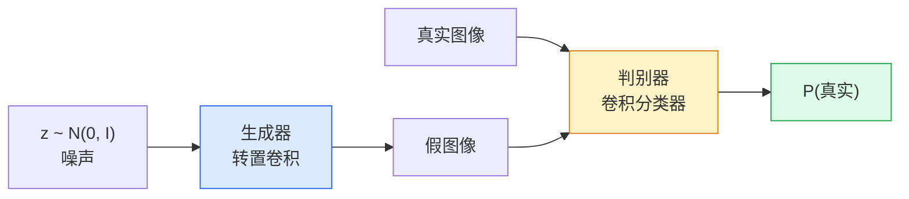
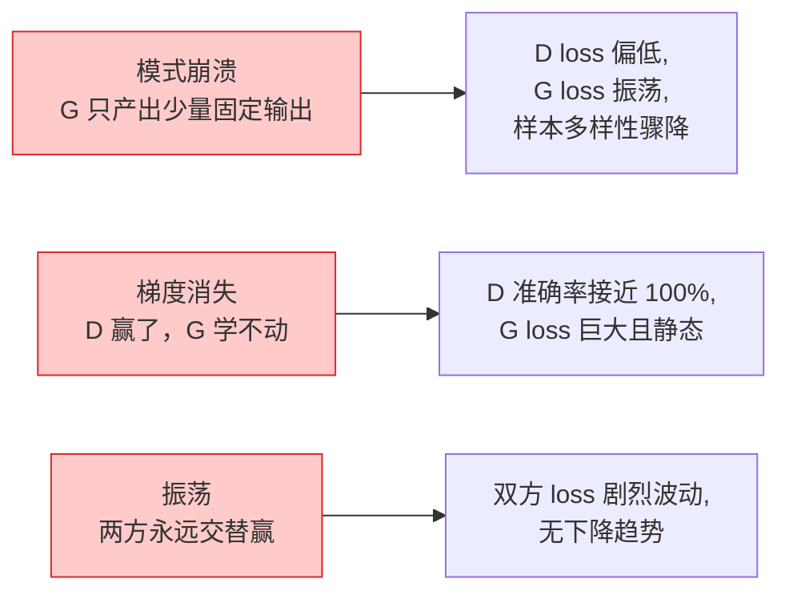

# GAN：生成对抗网络

> 两个神经网络在玩一个固定规则的游戏。一个画图，一个挑刺。它们共同进步，直到画出的图像骗过评判者。

**类型：** 实现课
**语言：** Python
**前置知识：** 第 05 节（卷积神经网络）、第 03 阶段的优化器和正则化
**预计时间：** ~90 分钟
**所处阶段：** Tier 1（基础课 -> 第 5 章为"知识连线"）
**关联课程：** 第 08 阶段 · 02（扩散模型）— 理解 GAN 的隐空间概念有助于分析扩散过程

## 🎯 学习目标

完成本课后，你能够：

- [ ] 解释生成器和判别器的极小极大博弈，以及为什么均衡点对应 p_model = p_data
- [ ] 从零实现 DCGAN，在合成圆形数据集上生成可辨识的圆形
- [ ] 使用谱归一化和标签平滑技巧稳定 GAN 训练
- [ ] 读取训练曲线以诊断模式崩溃、判别器占优和振荡三种失败模式

## 1. 问题

分类教会神经网络把图像映射到标签。生成则反转了这个任务：采样新的图像，让它们看起来像是来自同一个分布。这里没有你可以对照 diff 的"正确答案"——只有一个你想要模仿的分布。

标准的损失函数（MSE、交叉熵）无法衡量"这个样本是否来自真实分布"。最小化像素级误差会产生模糊的平均结果，而不是逼真的样本。突破点在于学会损失本身：训练第二个网络来判断真假，并用它的判断来推动生成器进步。

Goodfellow 等人在 2014 年提出的生成对抗网络（GAN）定义了这套框架。到 2018 年，StyleGAN 已经能生成 1024x1024 的逼真人脸。尽管扩散模型后来在质量和可控性上占据了主导地位，但让扩散模型可行的所有技巧——归一化选择、隐空间、特征损失——都是在 GAN 上第一次被理解的。

## 2. 概念

### 2.1 直观理解



**生成器 (Generator)** G 接收一个噪声向量 z 并输出一张图像。**判别器 (Discriminator)** D 接收一张图像并输出单个标量——该图像为真的概率。

### 2.2 极小极大博弈

G 想要 D 犯错，D 想要做对。形式化为以下博弈：

$$
\min_G \max_D \; \mathbb{E}_{x \sim p_\text{data}} [\log D(x)] + \mathbb{E}_{z \sim p_z} [\log(1 - D(G(z)))]
$$

从左到右阅读：D 最大化真实样本的对数概率（log D(x)）和假样本的对数错误率（log(1 - D(G(z)))）。G 则在最小化 D 对假样本的准确率——它希望 D(G(z)) 尽可能接近 1。

Goodfellow 证明了：这个极小极大博弈有一个全局均衡点，在该点上 p_G = p_data，D 处处输出 0.5，且生成分布与真实分布之间的 Jensen-Shannon 散度为零。困难的部分在于如何到达那个均衡点。

### 2.3 非饱和损失

上述公式在数值上不稳定。训练初期，D(G(z)) 对每个假样本都接近零，于是 log(1 - D(G(z))) 对 G 的梯度接近消失。修复方法是翻转 G 的损失：

$$
\begin{aligned}
\mathcal{L}_D &= -\mathbb{E}_x[\log D(x)] - \mathbb{E}_z[\log(1 - D(G(z)))] \\
\mathcal{L}_G &= -\mathbb{E}_z[\log D(G(z))] \quad \text{（非饱和形式）}
\end{aligned}
$$

现在当 D(G(z)) 接近零时，G 的损失仍然很大，梯度仍然有用。每个现代 GAN 都使用这种变体训练。

### 2.4 DCGAN 架构规则

Radford、Metz 和 Chintala（2015）从多年的失败实验中提炼出五条让 GAN 训练稳定的规则：

1. 用带步长的卷积替换池化操作（生成器和判别器都适用）
2. 在生成器和判别器中都使用批归一化，除了 G 的输出和 D 的输入
3. 在深层架构中移除全连接层
4. G 在所有层上使用 ReLU，输出层使用 tanh（输出值域 [-1, 1]）
5. D 在所有层上使用 LeakyReLU（negative_slope=0.2）

这些规则至今仍适用于每一个基于卷积的现代 GAN（StyleGAN、BigGAN、GigaGAN），现代模型只是在这些规则之上逐块替换组件。

### 2.5 故障模式及其信号



| 故障模式 | 现象 | 诊断方法 | 修复方案 |
|---|---|---|---|
| 模式崩溃 | G 只产出少数几种固定图像 | 不同噪声输入产生相同或相似图像 | 加谱归一化、增大批次大小、加入小批量鉴别 |
| 判别器占优 | D loss 趋近于零，G loss 居高不下 | D 准确率超过 95% | 降低 D 的学习率、使用标签平滑、换 WGAN-GP |
| 振荡 | loss 剧烈上下波动 | 训练曲线无下降趋势 | TTUR（D 学习率为 G 的 2-4 倍）或换 Wasserstein 损失 |
| Nash 均衡 | D loss 约 1.386，G loss 约 0.693 | 两者均不再变化 | 这不是故障——已达到均衡。检查样本质量并评估 FID |

### 2.6 Wasserstein GAN (WGAN-GP)

原始 GAN 的目标函数基于 Jensen-Shannon 散度，在生成分布与真实分布支撑集不相交时存在严重问题。Arjovsky 等人（2017）提出用 Earth-Mover 距离替代 JSD，得到了 Wasserstein GAN。关键创新包括：

- **损失不再是概率**：判别器直接输出一个实数评分，而非概率
- **Lipschitz 约束**：通过梯度惩罚确保判别器的导数范数不超过 1
- **更平滑的训练**：即使生成分布未完全覆盖真实分布，损失梯度仍然有效

$$
\mathcal{L}_{GP} = \mathbb{E}[D(x_r)] - \mathbb{E}[D(x_g)] + \lambda \cdot \mathbb{E}\left[ \left(\|\nabla_\hat{x} D(\hat{x})\|_2 - 1\right)^2 \right]
$$

其中 x_hat = alpha * x_r + (1-alpha) * x_g，alpha ~ U[0, 1]。梯度惩罚项确保插值点的判别器梯度范数接近 1。

### 2.7 模型评估

GAN 没有"正确答案"可以对照，如何判断训练效果？

- **样本检查** —— 每个轮次末尾看 16-64 个样本。这是底线要求。
- **FID（Fréchet Inception Distance）** —— 真实图像集合和生成图像集合在 Inception-v3 特征空间中的分布距离。越低越好，是目前社区标准。
- **Inception Score** —— 早期指标，但对多模态数据有偏差；优先使用 FID。
- **Precision/Recall** —— 分别衡量生成质量（precision）和覆盖度（recall），比 FID 更多信息量。

对于小规模合成数据训练，样本检查就够了。

## 3. 从零实现

### 第 1 步：最简单的生成器

从最基础的版本开始——四个转置卷积逐步放大噪声：

```python
import torch.nn as nn

class Generator(nn.Module):
    def __init__(self, z_dim=64, img_channels=3, feat=32):
        super().__init__()
        self.net = nn.Sequential(
            nn.ConvTranspose2d(z_dim, feat*4, 4, 1, 0, bias=False),
            nn.BatchNorm2d(feat*4),
            nn.ReLU(True),
            nn.ConvTranspose2d(feat*4, feat*2, 4, 2, 1, bias=False),
            nn.BatchNorm2d(feat*2),
            nn.ReLU(True),
            nn.ConvTranspose2d(feat*2, feat, 4, 2, 1, bias=False),
            nn.BatchNorm2d(feat),
            nn.ReLU(True),
            nn.ConvTranspose2d(feat, img_channels, 4, 2, 1, bias=False),
            nn.Tanh(),
        )

    def forward(self, z):
        return self.net(z.view(z.size(0), -1, 1, 1))
```

每个转置卷积的参数都是 kernel_size=4, stride=2, padding=1，这让空间尺寸正好翻倍。Tanh 将输出限制在 [-1, 1]，与数据增强后标准化到同一范围。

### 第 2 步：判别器

判别器是对称的镜像结构——用常规卷积逐步缩小特征图，最后压缩为单个标量：

```python
class Discriminator(nn.Module):
    def __init__(self, img_channels=3, feat=32):
        super().__init__()
        self.net = nn.Sequential(
            nn.Conv2d(img_channels, feat, 4, 2, 1),
            nn.LeakyReLU(0.2, True),
            nn.Conv2d(feat, feat*2, 4, 2, 1, bias=False),
            nn.BatchNorm2d(feat*2),
            nn.LeakyReLU(0.2, True),
            nn.Conv2d(feat*2, feat*4, 4, 2, 1, bias=False),
            nn.BatchNorm2d(feat*4),
            nn.LeakyReLU(0.2, True),
            nn.Conv2d(feat*4, 1, 4, 1, 0),
        )

    def forward(self, x):
        return self.net(x).view(-1)
```

最后的卷积将 4x4 的特征图压缩为 1x1。输出是每张图像的单个 logit 值；在计算损失时才应用 sigmoid。

### 第 3 步：训练步

交替更新——每批数据先更新 D 一步，再更新 G 一步：

```python
import torch.nn.functional as F

def train_step(G, D, real, z, opt_g, opt_d):
    bs = real.size(0)

    # D 步：拉近真实，推远假
    opt_d.zero_grad()
    d_real = D(real)
    d_fake = D(G(z).detach())  # detach 是关键！
    loss_d = (F.binary_cross_entropy_with_logits(d_real, torch.ones(bs))
              + F.binary_cross_entropy_with_logits(d_fake, torch.zeros(bs)))
    loss_d.backward()
    opt_d.step()

    # G 步：不饱和损失 —— 让 D 认为 fake 是 real
    opt_g.zero_grad()
    d_fake_gen = D(G(z))
    loss_g = F.binary_cross_entropy_with_logits(d_fake_gen, torch.ones(bs))
    loss_g.backward()
    opt_g.step()

    return loss_d.item(), loss_g.item()
```

G(z).detach() 至关重要：在 D 的更新中，我们不想让梯度回传到 G。忘记这一点是最常见的初学者错误。

使用非饱和损失（log D(G(z))）而非饱和形式（log(1 - D(G(z)))），因为训练初期 D 对假图像的判定很低，饱和形式的梯度会消失。

### 第 4 步：完整训练循环

```python
from torch.utils.data import DataLoader, TensorDataset

device = 'cuda' if torch.cuda.is_available() else 'cpu'
data = synthetic_circles()
loader = DataLoader(TensorDataset(data), batch_size=64, shuffle=True)

G = Generator(z_dim=64, img_channels=3, feat=32).to(device)
D = Discriminator(img_channels=3, feat=32).to(device)
# Adam 的 beta1=0.5 是 GAN 默认值
opt_g = torch.optim.Adam(G.parameters(), lr=2e-4, betas=(0.5, 0.999))
opt_d = torch.optim.Adam(D.parameters(), lr=2e-4, betas=(0.5, 0.999))

for epoch in range(10):
    for (batch,) in loader:
        z = torch.randn(batch.size(0), 64, device=device)
        ld, lg = train_step(G, D, batch, z, opt_g, opt_d)
    print(f'epoch {epoch}  D {ld:.3f}  G {lg:.3f}')
```

Adam 学习率 2e-4 和 betas=(0.5, 0.999) 是 DCGAN 的默认设置——较低的 beta1 可以防止动量项在对抗博弈中过早稳定。

### 第 5 步：谱归一化——最实用的稳定性升级

在判别器上使用谱归一化可以替代批归一化，保证网络的 Lipschitz 连续性。这是一行代码级别的改动，但通常可以解决大部分"D 赢了太多"的问题：

```python
from torch.nn.utils import spectral_norm

class SNDiscriminator(nn.Module):
    def __init__(self, img_channels=3, feat=32):
        super().__init__()
        self.net = nn.Sequential(
            spectral_norm(nn.Conv2d(img_channels, feat, 4, 2, 1)),
            nn.LeakyReLU(0.2, True),
            spectral_norm(nn.Conv2d(feat, feat*2, 4, 2, 1)),
            nn.LeakyReLU(0.2, True),
            spectral_norm(nn.Conv2d(feat*2, feat*4, 4, 2, 1)),
            nn.LeakyReLU(0.2, True),
            spectral_norm(nn.Conv2d(feat*4, 1, 4, 1, 0)),
        )

    def forward(self, x):
        return self.net(x).view(-1)
```

将 Discriminator 替换为 SNDiscriminator 后，通常不需要 TTUR 技巧也能获得稳定训练。

## 4. 工业工具

### 4.1 PyTorch 内置实现

PyTorch 原生提供了构建 GAN 所需的全部组件。核心类都在 torch.nn 中：

```python
import torch.nn as nn

# 转置卷积——生成器核心
tconv = nn.ConvTranspose2d(64, 32, 4, 2, 1)
z = torch.randn(1, 64, 1, 1)
out = tconv(z)  # (1, 32, 2, 2)

# 谱归一化——判别器稳定性
from torch.nn.utils import spectral_norm
sn_conv = spectral_norm(nn.Conv2d(3, 64, 4, 2, 1))
```

### 4.2 高质量 GAN 库

| 库 | 用途 | 状态 |
|---|---|---|
| torch-fidelity | 计算 FID/IS 等生成质量指标 | 活跃维护 |
| StudioGAN | HuggingFace 出品的 18+ 种 GAN 参考实现 | 活跃维护 |
| stylegan3-pytorch | StyleGAN3 的独立 PyTorch 实现 | 活跃维护 |
| biggan-pytorch | BigGAN 实现 | 社区维护 |

### 4.3 评估工具

```python
# 计算 FID 只需要几行代码
from torchmetrics.image.fid import FrechetInceptionDistance

fid = FrechetInceptionDistance(feature=64)
fid.update(real_images, real=True)
fid.update(fake_images, real=False)
print(f'FID: {fid.compute():.2f}')
```

### 4.4 架构演进对比

| 特性 | DCGAN | WGAN-GP | StyleGAN3 |
|---|---|---|---|
| 损失函数 | BCE | Earth-Mover + GP | 原始 BCE |
| 稳定性 | 需要小心调参 | 更稳定 | 高度稳定 |
| 典型分辨率 | 32x32 - 64x64 | 64x64 - 128x128 | 1024x1024 |
| 模式崩溃 | 常见 | 较少 | 极少 |
| 训练速度 | 快 | 中等 | 慢 |
| 2026 年定位 | 教学入门 | 实用研究 | 生产级生成 |

## 5. 知识连线

本课学到的对抗训练思想在后续学习中会继续发挥作用：

- **阶段 04 · 10（目标检测分割）**：你会看到对抗样本攻击如何绕过检测和分割模型，这本质上利用了 GAN 训练中发现的梯度脆弱性
- **阶段 08（生成式 AI）**：扩散模型的训练虽然不使用对抗博弈，但其隐空间建模和条件生成长度与 GAN 有深刻联系
- **阶段 12（多模态 AI）**：CLIP 的对比学习损失与 GAN 的判别器目标有异曲同工之妙——都是让模型学会区分真实和相关配对

## 6. 工程最佳实践

### 6.1 工业界常用方案

| 场景 | 推荐方案 | 备注 |
|---|---|---|
| 学习/实验 | DCGAN + BCE | 最容易理解和调试 |
| 稳定训练 | WGAN-GP | 减少手动调参，默认更稳定 |
| 高质量输出 | StyleGAN3 | 工业标准，1024x1024 |
| 实时生成 | 轻量化 GAN（如 FastGAN） | < 10ms 延迟，适合边缘部署 |

### 6.2 训练稳定性建议

- **G 使用非饱和损失**：始终用 -log(D(G(z))) 而非 log(1 - D(G(z)))
- **Adam beta1=0.5**：GAN 默认值，降低动量带来的滞后效应
- **混合精度训练**：使用 FP16 可将显存占用减半，GPU 上的训练速度提升 1.5-2 倍
- **每个 epoch 保存样本**：loss 曲线的解读存在歧义，只有肉眼看的样本才是真实的
- **随机种子敏感性**：GAN 对随机种子极其敏感，至少用三个不同种子跑一次以确认结果可靠性

### 6.3 踩坑经验

- **忘记 .detach()**：在 D 的更新中使用 G(z).detach() 而非常见的 G(z)，否则梯度会同时传入两个网络，导致训练爆炸
- **G 和 D 学习率相同导致不平衡**：如果 D 的 loss 快速下降到零，说明判别器太强，尝试将 G 的学习率提升一倍或将 D 的批次大小减半
- **输出层激活函数错误**：G 的输出层必须用 Tanh（输出范围 [-1, 1]），如果用 ReLU 会有大量负值像素

## 7. 常见错误

### 错误 1：判别器更新时忘记 detach

**现象：** 训练几轮后 loss 变为 NaN，或者两个网络的 loss 同步暴涨。

**原因：** 判别器反向传播时如果不 detach 生成的假图像，梯度会通过生成器回传。这等同于同时优化两个网络，违背了交替更新的对抗博弈设计。

**修复：**
```python
# ❌ 错误写法
d_fake = D(G(z))  # 梯度会同时流向 G 和 D

# ✓ 正确写法
d_fake = D(G(z).detach())  # 只更新 D
```

### 错误 2：使用饱和损失函数

**现象：** 训练初期 G 的 loss 不下降，生成的图像完全没有变化。

**原因：** 使用 log(1 - D(G(z))) 作为 G 的损失。当 D(G(z)) 接近零时，log(1 - 0) = 0，梯度消失，生成器收不到任何有用信号。

**修复：**
```python
# ❌ 饱和损失
loss_g = F.binary_cross_entropy(d(G(z)), zeros)  # log(1-D)

# ✓ 非饱和损失
loss_g = F.binary_cross_entropy_with_logits(d_fake_gen, ones)  # -log(D)
```

### 错误 3：忘记设置 G.eval() 进行采样

**现象：** 生成的图像质量明显低于训练中途看到的样本，BatchNorm 的统计量影响了输出。

**原因：** 在 eval 模式下，BatchNorm 使用运行统计量而非当前批次的统计量。在 training 模式下采样，每次采样得到不同的归一化结果。

**修复：**
```python
# ❌ 错误
samples = G(noise)

# ✓ 正确
G.eval()
samples = G(noise)
G.train()  # 恢复训练模式
```

### 错误 4：梯度惩罚系数 lambda 设置过小

**现象：** WGAN-GP 训练仍然不稳定，判别器偶尔会出现陡峭的权重。

**原因：** 梯度惩罚系数过小，无法有效约束判别器的 Lipschitz 连续性。通常 lambda = 10 是一个好的起点。

**修复：** 将 gp_lambda 设为 10.0，并在训练初期监控梯度范数的分布。

## 8. 面试考点

### Q1：GAN 中为什么使用交替更新（先更新 D，再更新 G），而不是一起更新？（难度：⭐⭐）

**参考答案：**
GAN 的训练是一个极小极大博弈。交替更新确保了每个网络在对当前对手策略最优的方向上做出一步响应。如果同时更新，两个网络的梯度方向会互相干扰，导致优化轨迹不再收敛到博弈均衡点。先更新 D 确保它能在当前 G 下充分学习辨别能力，然后 G 才能在这个"成熟的"判别器基础上学习如何欺骗它。这就是纳什均衡的离散近似。

### Q2：DCGAN 为什么要用转置卷积替代池化操作？（难度：⭐⭐）

**参考答案：**
最大池化是一种固定的、不可学习的下采样操作，它只保留局部最大值而丢弃其余信息。在生成任务中，模型需要尽可能多的细节来完成高质量的图像重建。转置卷积让模型通过学习的方式来进行上采样和下采样，保留了跨步长传递信息的通道。这 empirically 产生了更清晰、更锐利的生成图像。

### Q3：什么是模式崩溃？为什么它在 GAN 中特别容易出现？（难度：⭐⭐⭐）

**参考答案：**
模式崩溃是指生成器发现了判别器的一个漏洞——例如只生成某一种特定类别的图像——并反复利用这个漏洞。这是因为 G 的优化目标是"欺骗 D"而非"覆盖整个数据分布"。如果只生成某一类图像就能持续欺骗 D，G 就没有动力去探索其他部分。这类似于博弈论中的"纯策略优于混合策略"现象。解决方案包括增大批次大小（引入小批量鉴别）、使用谱归一化或切换到 WGAN-GP。

### Q4：手写 Wasserstein 损失中的梯度惩罚项。（难度：⭐⭐⭐）

**参考答案：**
```python
def gradient_penalty(D, real, fake):
    # 在真实和假样本之间线性插值
    alpha = torch.rand(real.size(0), 1, 1, 1)
    x_hat = alpha * real + (1 - alpha) * fake.detach()
    x_hat.requires_grad_(True)
    # 判别器输出
    logit = D(x_hat)
    # 计算梯度
    grads = torch.autograd.grad(
        outputs=logit, inputs=x_hat,
        grad_outputs=torch.ones_like(logit),
        create_graph=True, retain_graph=True
    )[0]
    # 梯度范数惩罚
    grad_norm = grads.reshape(grads.size(0), -1).norm(2, dim=1)
    return (((grad_norm - 1) ** 2) * 10).mean()
```

## 🔑 关键术语

| 术语 | 人们怎么说 | 实际含义 |
|---|---|---|
| 生成器 (Generator) | "那个画画的网络" | 将噪声向量映射为图像的神经网络，目标是欺骗判别器 |
| 判别器 (Discriminator) | "那个评判的" | 二分类器，被训练来区分真实样本和生成样本 |
| 极小极大 (Minimax) | "两人游戏" | G 最小化 D 的准确率，D 最大化自身准确率；均衡时 p_G = p_data |
| 非饱和损失 | "不那么傻的损失" | G 的损失使用 -log(D(G(z))) 而非 log(1 - D(G(z)))，避免早期梯度消失 |
| 模式崩溃 (Mode Collapse) | "生成器偷懒" | G 只产出数据分布的一个子集；修复方案包括谱归一化、小批量鉴别和更大的批次 |
| WGAN-GP | "更好的 GAN" | 用 Earth-Mover 距离 + 梯度惩罚替代 BCE 损失，训练大幅稳定 |
| 谱归一化 (Spectral Norm) | "给网络设限速" | 约束每层权重的最大奇异值为 1，等价于约束网络的全局 Lipschitz 常数 |
| TTUR | "两套学习率" | D 的学习率是 G 的 2-4 倍，让判别器更快适应，稳定对抗训练 |
| FID | "Fréchet Inception Distance" | 真实和生成图像在 Inception-v3 特征空间中的 Fréchet 距离，目前生成质量的社区标准指标 |

## 📚 小结

GAN 的核心洞察是"与其设计一个好的损失函数，不如让网络自己学会损失"。生成器和判别器在极小极大博弈中相互竞争，最终的均衡点对应着生成分布与真实分布的一致。你从零实现了一个完整的 DCGAN 训练管线，理解了转置卷积、谱归一化和非饱和损失的实际意义。

下一课我们将探索扩散模型——另一种基于神经网络的生成方法，它通过分析加噪过程的学习来生成高质量图像，目前在图像生成的质量和可控性上超越了 GAN。

## ✏️ 练习

1. 【理解】用自己的话解释为什么 GAN 的训练需要使用交替更新（先 D 后 G），而不是同时更新两个网络。写 200 字以内的说明，使用博弈论类比来帮助读者理解。

2. 【实现】修改 train_step_bce 函数，支持两种损失选项：非饱和损失（默认）和饱和损失。观察使用饱和损失时训练前 10 轮的 G loss 变化情况，并记录。

3. 【实验】在同一代码库中分别训练原始 DCGAN、带谱归一化的 DCGAN 和 WGAN-GP 三种版本。比较它们在 20 个 epoch 后的训练稳定性和生成质量（肉眼观察 16 张样本图）。哪种版本最快收敛？

4. 【思考】阅读 StyleGAN3 论文（Karras et al., 2021）的摘要和方法概述。用你自己的话解释为什么 StyleGAN3 需要在生成器中加入移不变性（translation equivariance）约束。这与 DCGAN 中的转置卷积有什么关系？

## 🚀 产出

本课产出以下可复用内容：

| 产出 | 文件 | 说明 |
|---|---|---|
| DCGAN 完整实现 | code/main.py | 从零实现的 DCGAN，包含 BCE 和 WGAN-GP 两种训练模式 |
| 合成数据集生成器 | code/main.py::synthetic_circles() | 可复用的圆形数据集生成函数，用于 GAN 原型验证 |
| 训练监控脚本 | code/main.py::sample_images() + save_sample_grid() | 保存训练过程中的样本图和训练曲线 |
| 可复用提示词 | outputs/prompt-gan-guide.md | GAN 训练故障排查提示词模板 |

## 📖 参考资料

[1] [论文] Goodfellow et al. "Generative Adversarial Networks". NeurIPS, 2014. https://arxiv.org/abs/1406.2661

[2] [论文] Radford, Metz, Chintala. "Unsupervised Representation Learning with Deep Convolutional Generative Adversarial Networks." ICLR, 2016. https://arxiv.org/abs/1511.06434

[3] [论文] Arjovsky, Chintala, Bottou. "Wasserstein GAN." arXiv preprint, 2017. https://arxiv.org/abs/1701.07875

[4] [论文] Gulrajani et al. "Improved Training of Wasserstein GANs." NeurIPS, 2017. https://arxiv.org/abs/1704.00028

[5] [论文] Miyato et al. "Spectral Normalization for Generative Adversarial Networks." ICLR, 2018. https://arxiv.org/abs/1802.05957

[6] [论文] Karras et al. "A Style-Based Generator Architecture for Generative Adversarial Networks." CVPR, 2018. https://arxiv.org/abs/1812.04948

[7] [论文] Karras et al. "Analyzing and Improving the Image Quality of StyleGAN." CVPR, 2020. https://arxiv.org/abs/1912.04958

[8] [论文] Karras et al. "Alias-Free Generative Adversarial Networks." NeurIPS, 2021. https://arxiv.org/abs/2106.12423

[9] [官方文档] PyTorch nn.ConvTranspose2d: https://pytorch.org/docs/stable/generated/torch.nn.ConvTranspose2d.html

[10] [GitHub] Lucidrains/stylegan3-pytorch: https://github.com/lucidrains/stylegan3-pytorch

---

> 本课程参考了 AI Engineering From Scratch（MIT License）的课程体系，在此基础上进行了重构和原创内容的扩充。所有中文表达、案例、工程最佳实践、常见错误、面试考点等均为原创内容。
