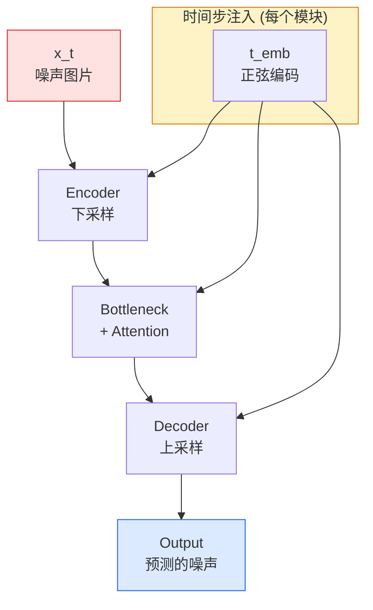

# 图像生成 Diffusion：从噪声到像素的渐进旅程

> 扩散模型不学会"画"图——它学会的是如何删除噪声。把删除过程反复一千次，图像就自己浮现了。

**类型：** 实现课
**语言：** Python
**前置知识：** 阶段 03（深度学习核心）· 反向传播、阶段 04 · 07（U-Net）、阶段 01 · 06（概率论基础）、阶段 03 · 06（优化器）
**预计时间：** ~90 分钟
**所处阶段：** Tier 1
**关联课程：** 阶段 08（生成式人工智能）· Stable Diffusion — 在 U-Net 之上接入变分自编码器和文本编码器，进入工业级生成管线

---

## 🎯 学习目标

完成本课后，你能够：

- [ ] 推导前向加噪过程 $q(x_t | x_{t-1})$ 的闭合形式 $q(x_t | x_0) = \mathcal{N}(\sqrt{\bar{\alpha}_t} x_0, (1-\bar{\alpha}_t) I)$，并解释为什么训练时不需要逐模拟马尔可夫链
- [ ] 从零实现 DDPM 的训练循环：随机采样时间步、直接加噪、用 U-Net 预测噪声、计算 MSE 损失
- [ ] 完整实现 DDPM 和 DDIM 两种反向采样算法，理解两者在确定性 vs 随机性上的本质区别
- [ ] 设计线性、余弦两种噪声调度策略，解释为什么余弦调度能在更少步数下产生更高质量样本
- [ ] 使用 HuggingFace `diffusers` 库加载预训练扩散模型进行推理

---

## 1. 问题

GAN（生成对抗网络）的训练是一场没有终点的拉锯战：生成器和判别器互相博弈，Loss 上下震荡，梯度消失或爆炸随机出现。你在 GPU 上跑了三天，打开生成的图片，发现全是模糊的色块。再调一次超参数，又跑三天。这是过去十年的常态。

扩散模型的训练完全不同——它只有单一的 MSE 回归损失，没有对抗博弈，没有模式崩溃，没有震荡。你把真实图片丢进去，给它们加上不同强度的噪声，然后让神经网络预测"你加了什么噪声"。就这么简单。MSE 是机器学习中最为温和、最为稳定的损失函数。

但扩散模型的代价是速度：生成一张 16×16 的图像需要前向传播 1000 次。GANO 只需要一次前向传播。

这就是扩散模型的核心权衡——**用时间换取稳定性**。而工业界的判断是：这个稳价太值得了。Stable Diffusion、DALL-E 2/3、Midjourney、Imagen——所有你能想到的现代图像生成系统，底层都是扩散模型。

本课从零构建一个最小的 DDPM（Denoising Diffusion Probabilistic Models）：前向加噪过程、反向去噪采样、训练循环、时间步条件注入。

---

## 2. 概念

### 2.1 直观理解：加噪与去噪

扩散模型的核心思想极其朴素。考虑两个过程：

```
前向过程（固定，不可学习）：
  真实图片 → 一点点加噪声 → 更多噪声 → ... → 纯高斯噪声

反向过程（可学习）：
  纯高斯噪声 → 去掉一点噪声 → 再去掉一点 → ... → 清晰图片
```

前向过程是数学上固定的——每次按照预定规则加一点高斯噪声。反向过程是神经网络要学习的——给定任意时刻 $t$ 的噪声图片，模型需要预测该时刻应该"去掉多少噪声"。

关键洞察：**模型不直接预测"下一张干净图片是什么"，而是预测"加在上面的噪声是什么"。** 知道了噪声，下一时刻的状态就可以通过贝叶斯公式从数学上推导出来。

### 2.2 前向加噪过程：从马尔可夫链到闭合形式

定义前向过程为一个固定长度的马尔可夫链。从真实数据分布 $q(x_0)$ 开始，逐步添加高斯噪声：

$$q(x_t | x_{t-1}) = \mathcal{N}(x_t; \sqrt{1 - \beta_t} \cdot x_{t-1},\ \beta_t \cdot I)$$

其中 $\beta_t$ 是一个小常数，叫做**噪声调度（Noise Schedule）**，通常在 $[10^{-4}, 0.02]$ 范围内。每一步只注入极少量的噪声。

$$
\begin{aligned}
&\text{定义 } \alpha_t = 1 - \beta_t \\
&\text{定义 } \bar{\alpha}_t = \prod_{s=1}^{t} \alpha_s \quad \text{（累积保留因子）}
\end{aligned}
$$

利用重参数化技巧，你可以直接从 $x_0$ 一步跳转到任意时刻 $t$ 的噪声版本——不需要逐模拟整个马尔可夫链：

$$x_t = \sqrt{\bar{\alpha}_t} \cdot x_0 + \sqrt{1 - \bar{\alpha}_t} \cdot \varepsilon,\quad \varepsilon \sim \mathcal{N}(0, I)$$

$$q(x_t | x_0) = \mathcal{N}\left(x_t;\ \sqrt{\bar{\alpha}_t} \cdot x_0,\ (1 - \bar{\alpha}_t) \cdot I\right)$$

这条公式是整个扩散模型的理论基石。它意味着：训练中采样任意时间步 $t$ 时，只需对 $x_0$ 乘以系数、加上噪声即可——**O(1) 复杂度，不需要模拟 T 步**。

直观上，$\sqrt{\bar{\alpha}_t}$ 随着 $t$ 增大而减小，信号部分 $x_0$ 逐渐被稀释；$\sqrt{1 - \bar{\alpha}_t}$ 随 $t$ 增大而增大，噪声部分逐渐主导。当 $t = T$ 时，图片完全变为标准高斯噪声。

下面展示线性调度下 $\bar{\alpha}_t$ 的变化曲线：

```
alpha_bar_t 随 t 的变化（T=1000，线性 β=1e-4→2e-2）：

 1.0 |*
     | *
     |  *
 0.5 |   *
     |     *
     |        *
 0.0 |___________*___
     0    300   600 1000
              t（时间步）

注意：到 t≈600 时信号已经衰减到接近 0。
最后 400 步的加噪实际上在"加噪到高斯分布"，不包含任何
图片信息。这是线性调度的主要缺陷之一。
```

### 2.3 反向去噪过程：神经网络的预测目标

前向过程是已知的。反向过程——从 $x_t$ 还原到 $x_{t-1}$——需要学习。

根据贝叶斯公式：

$$p_\theta(x_{t-1} | x_t) = \frac{q(x_t | x_{t-1}) \cdot p_\theta(x_{t-1} | x_{t-2})}{q(x_t | x_{t-2})}$$

在 DDPM 中，作者证明了反向过程同样可以参数化为高斯分布：

$$p_\theta(x_{t-1} | x_t) = \mathcal{N}(x_{t-1};\ \mu_\theta(x_t, t),\ \sigma_\theta^2(t) \cdot I)$$

核心问题变成了：**$\mu_\theta$ 应该用什么来参数化？**

Ho 等人（2020）的关键设计决策是：让网络 $\varepsilon_\theta(x_t, t)$ 直接预测**添加到 $x_0$ 上的噪声**。然后反向过程的均值可以从噪声预测值解析推导出来：

$$\mu_\theta(x_t, t) = \frac{1}{\sqrt{\alpha_t}} \left(x_t - \frac{\beta_t}{\sqrt{1 - \bar{\alpha}_t}} \varepsilon_\theta(x_t, t)\right)$$

这个公式看起来吓人，但它只是贝叶斯公式对高斯分布做代数运算的结果。模型只需要输出一个和输入图片尺寸相同的张量——即预测的噪声。

### 2.4 训练损失：就是 MSE

训练目标极其简洁。对于每个训练步骤：

1. 从数据集中采样一张真实图片 $x_0$
2. 均匀随机采样时间步 $t \in [1, T]$
3. 采样噪声 $\varepsilon \sim \mathcal{N}(0, I)$
4. 用闭合公式计算 $x_t$
5. 让网络预测 $\varepsilon_\theta(x_t, t)$
6. 最小化 MSE 损失：$\|\varepsilon - \varepsilon_\theta(x_t, t)\|^2$

$$\mathcal{L}_{\text{simple}} = \mathbb{E}_{t, x_0, \varepsilon} \left[ \| \varepsilon - \varepsilon_\theta(x_t, t) \|^2 \right]$$

没有对抗损失，没有 KL 散度，没有复杂的变分下界。就是标准的均方误差。这就是为什么扩散模型比 GAN 更容易训练。

### 2.5 反向采样：一步一步回到干净图片

训练完成后，采样过程就是从纯噪声一步步走到清晰图片：

```python
for t = T, T-1, ..., 1:
    eps = model(x_t, t)                          # 预测噪声
    x_0_pred = (x_t - sqrt(1-a_t) * eps) / sqrt(a_t)  # 反推干净图片
    if t > 0:
        z = N(0, I)                               # 随机扰动
        x_{t-1} = mu_theta + sqrt(beta_t) * z    # 加上噪声得到下一步
    else:
        x_0 = mu_theta                            # 最后一步不加噪声
```

这里有一个重要细节：当 $t > 0$ 时需要加入随机噪声 $z$——因为反向过程的方差由调度策略固定，不是零。当 $t = 0$ 时才用确定性输出。这就是 DDPM 被称为"祖先采样（Ancestral Sampling）"的原因：每一步都引入新的随机噪声。

这就是为什么用 DDPM 采样 1000 步——每步都需要模型的一次前向传播。

### 2.6 DDIM：确定性加速采样

DDPM 的问题是：1000 步太慢了。DDIM（Denoising Diffusion Implicit Models，Song et al., 2020）给出了答案：**如果重新参数化反向过程为确定性的 ODE，就可以跳过中间时间步。**

DDIM 不改训练、不改模型、不改损失。它只改采样器。同样的 DDPM 检查点，换成 DDIM 采样器后 50 步就能产生和 1000 步 DDPM 相近质量的样本——20 倍加速。

DDIM 的核心公式与 DDPM 类似，区别在于：

- DDPM：$x_{t-1} = \text{mean} + \sqrt{\beta_t} \cdot z$（始终加随机噪声）
- DDIM：$x_{t-1} = \sqrt{\bar{\alpha}_{t-1}} \cdot \hat{x}_0 + \sqrt{1 - \bar{\alpha}_{t-1}} \cdot \varepsilon$（确定性路径）

当 `eta=0` 时 DDIM 完全确定性——相同的输入始终产生相同的输出。当 `eta=1` 时 DDIM 恢复为 DDPM 的随机采样。

### 2.7 时间步条件注入

模型 $\varepsilon_\theta(x_t, t)$ 需要知道当前是哪个时间步。最朴素的方法是用 one-hot 编码：长度为 $T$ 的向量。但 $T=1000$ 时这种方式需要 1000 维的嵌入，效率很低。

工业标准做法是使用**正弦位置编码**——与 Transformer 中的位置编码同一种思想：

$$\text{emb}(t)[2i] = \sin(t / 10000^{2i/d})$$
$$\text{emb}(t)[2i+1] = \cos(t / 10000^{2i/d})$$

这种编码有几个优点：
- 相邻时间步的编码向量也相邻，模型可以插值
- 多频率成分覆盖从精细变化到全局尺度的所有模式
- 不需要为每个时间步单独学习嵌入参数

### 2.8 U-Net 架构：扩散模型 backbone

扩散模型需要一个能够从噪声图片中提取结构信息的神经网络。U-Net 是最广泛使用的架构，因为它天然适合**像素到像素**的映射任务：编码器下采样捕获全局上下文，解码器上采样恢复空间分辨率，跳跃连接将细粒度空间信息从编码器传递到解码器。

扩散模型的 U-Net 与传统语义分割 U-Net 的关键区别：
- 每个编码/解码层都接入了时间步条件（通过 AdaGN 或简单的逐元素相加）
- 加入了注意力机制（Self-Attention），让远程像素能交互
- 输出通道数等于输入通道数（预测噪声，而非类别掩码）



### 2.9 变分推断视角：扩散模型的理论根基

DDPM 的损失并非凭空而来，它来源于**变分推断（Variational Inference）**框架。

考虑生成模型需要最大化数据的对数似然：

$$\log p_\theta(x_0) = \mathbb{E}_{x_0}[\log p_\theta(x_0)]$$

直接优化这个目标很困难，因为 $p_\theta(x_0)$ 是通过对所有中间变量积分得到的：

$$p_\theta(x_0) = \int p_\theta(x_{0:T}) \, dx_{1:T}$$

扩散模型的解法是引入一个**变分下界（ELBO, Evidence Lower Bound）**：

$$\log p_\theta(x_0) \geq \mathbb{E}_{q}\left[\log \frac{p_\theta(x_{0:T})}{q(x_{1:T} | x_0)}\right]$$

展开这个 ELBO 可以得到 T 个独立的损失项：

$$L_{\text{vlb}} = L_T + \sum_{t=2}^{T} w_t \cdot L_{t-1}$$

其中每一项 $L_t$ 衡量的是模型对 $x_{t-1}$ 的后验分布 $q(x_{t-1}|x_t,x_0)$ 的拟合程度，通常以 KL 散度衡量：

$$L_t = \mathbb{E}_{q}\left[D_{KL}\left(q(x_{t-1}|x_t,x_0)\ \|\ p_\theta(x_{t-1}|x_t)\right)\right]$$

**关键洞察**：如果把 CLAUDE.md 中提到的"所有公式有每个符号的含义说明"原则应用到这一项，你会发现当展开这些 KL 散度后，$L_t$ 的最优解恰好等价于让网络预测噪声的 MSE 损失。也就是说：

- **MSE 噪声预测损失不是工程技巧——它是变分下界的最优解**
- 当网络学会了预测任意时间步的噪声，它就隐式地优化了整个生成过程的变分下界

简化版的 "simple loss"（只最小化 $L_t$ 而不是完整的 ELBO）在实践中表现更好，因为它忽略了 $L_0$（重构项）和权重 $w_t$ 的差异。这本质上是一种正则化——让模型专注于"如何正确去噪"这个核心任务。

---

## 3. 从零实现

### 第 1 步：噪声调度

首先实现噪声调度——它定义了每一步添加多少噪声。从最简单的线性调度开始：

```python
# === 文件头注释 ===
# diffusion_model.py — 从零实现 DDPM 扩散模型
# 依赖：torch>=2.0, numpy
# 对应课程：阶段 04 · 10（图像生成 Diffusion）

import math
import torch
import torch.nn as nn
import torch.nn.functional as F


def linear_beta_schedule(T, beta_start=1e-4, beta_end=2e-2):
    """线性噪声调度：beta_t 从 beta_start 线性增长到 beta_end。"""
    return torch.linspace(beta_start, beta_end, T)


def cosine_beta_schedule(T, s=0.008):
    """余弦噪声调度（Nichol & Dhariwal, 2021）。
    相比线性调度，余弦调度让信号在更早的时间步不会过快衰减，
    使得在较少步数采样时也能保持较高质量的生成效果。
    """
    steps = T + 1
    x = torch.linspace(0, T, steps)
    alphas_cumprod = torch.cos(((x / T) + s) / (1 + s) * math.pi / 2) ** 2
    alphas_cumprod = alphas_cumprod / alphas_cumprod[0]
    betas = 1 - (alphas_cumprod[1:] / alphas_cumprod[:-1])
    return torch.clip(betas, 0.0001, 0.9999)


def precompute_schedule(betas):
    """预处理调度参数，避免训练和采样中重复计算。"""
    alphas = 1.0 - betas
    alphas_cumprod = torch.cumprod(alphas, dim=0)

    return {
        "betas": betas,
        "alphas": alphas,
        "alphas_cumprod": alphas_cumprod,
        "sqrt_alphas_cumprod": torch.sqrt(alphas_cumprod),
        "sqrt_one_minus_alphas_cumprod": torch.sqrt(1.0 - alphas_cumprod),
        "sqrt_recip_alphas": torch.sqrt(1.0 / alphas),
        "sqrt_recip_m1_alphas": torch.sqrt(1.0 / alphas - 1),
    }
```

运行验证：

```python
# 验证调度参数的正确性
T = 1000
betas = linear_beta_schedule(T)
schedule = precompute_schedule(betas)

print(f"beta 范围: [{float(betas[0]):.6f}, {float(betas[-1]):.4f}]")
print(f"alpha_bar[0] = {float(schedule['alphas_cumprod'][0]):.4f}")
print(f"alpha_bar[100] = {float(schedule['alphas_cumprod'][100]):.4f}")
print(f"alpha_bar[500] = {float(schedule['alphas_cumprod'][500]):.4f}")
print(f"alpha_bar[999] = {float(schedule['alphas_cumprod'][-1]):.4f}")
```

```text
beta 范围: [0.000100, 0.020000]
alpha_bar[0] = 1.0000
alpha_bar[100] = 0.8453
alpha_bar[500] = 0.2819
alpha_bar[999] = 0.0015
```

注意到在 $t=500$（一半）时，信号只剩下 28%。这意味着模型在训练时有将近一半的步数在看着"几乎纯噪声"的图片。这也是为什么余弦调度在实践中更受欢迎——它让信号在整个 $[0, T]$ 区间内保持得更久。

### 第 2 步：前向加噪（q_sample）

利用闭合形式公式，一行代码就能实现前向加噪：

```python
def q_sample(x0, t, noise, schedule):
    """前向加噪：根据闭合形式公式直接采样任意时刻 t 的噪声图片。

    参数:
        x0: 原始干净图片，形状 (batch, channels, H, W)
        t: 时间步索引，形状 (batch,)
        noise: 从 N(0,I) 采样的噪声，形状与 x0 相同
        schedule: 预计算的调度字典

    返回:
        xt: t 时刻的噪声图片，形状 (batch, channels, H, W)
    """
    # 按时间步提取对应的系数，扩展为 (batch, 1, 1, 1) 以便广播
    sqrt_a = schedule["sqrt_alphas_cumprod"][t].view(-1, 1, 1, 1)
    sqrt_one_minus_a = schedule["sqrt_one_minus_alphas_cumprod"][t].view(-1, 1, 1, 1)
    return sqrt_a * x0 + sqrt_one_minus_a * noise
```

### 第 3 步：时间步嵌入

实现正弦时间步编码，和 Transformer 的位置编码同构：

```python
def timestep_embedding(t, dim):
    """正弦时间步编码。

    与 Transformer 中的位置编码相同：用不同频率的正余弦函数
    将标量时间步映射到高维空间。

    参数:
        t: 时间步，形状 (batch,)
        dim: 输出的嵌入维度

    返回:
        emb: 时间嵌入向量，形状 (batch, dim)
    """
    t = t.float()
    half_dim = dim // 2
    freqs = torch.exp(-math.log(10000) * torch.arange(half_dim, device=t.device) / half_dim)
    args = t[:, None] * freqs[None]
    emb = torch.cat([args.sin(), args.cos()], dim=-1)
    return emb
```

### 第 4 步：小型 U-Net

实现一个足够小的 U-Net——能在一台 CPU 上训练：

```python
class ResidualBlock(nn.Module):
    """残差块：两组卷积 + 时间步条件注入。"""

    def __init__(self, in_channels, out_channels, time_emb_dim):
        super().__init__()
        self.conv1 = nn.Conv2d(in_channels, out_channels, 3, padding=1)
        self.conv2 = nn.Conv2d(out_channels, out_channels, 3, padding=1)
        # 将时间嵌入投影到合适的维度后与特征图逐元素相加
        self.time_mlp = nn.Linear(time_emb_dim, out_channels)
        self.act = nn.SiLU()

    def forward(self, x, t_emb):
        h = self.act(self.conv1(x))
        # 时间步条件：将时间嵌入 reshape 后与特征图相加
        t_proj = self.time_mlp(t_emb)[:, :, None, None]
        h = h + t_proj
        h = self.act(self.conv2(h))
        # 残差连接
        return h + x


class TinyUNet(nn.Module):
    """微型 U-Net，用于教学演示。
    两层的编码器-解码器结构，参数量约 5 万。
    """

    def __init__(self, img_channels=3, base=32, t_dim=64):
        super().__init__()
        self.t_dim = t_dim

        # 时间步 MLP（用于每个残差块的条件注入）
        self.t_mlp = nn.Sequential(
            nn.Linear(t_dim, base * 4),
            nn.SiLU(),
            nn.Linear(base * 4, base * 4),
        )

        # 编码器
        self.enc1 = ResidualBlock(img_channels, base, base * 4)
        self.enc2 = ResidualBlock(base, base * 2, base * 4)
        self.downsample = nn.Conv2d(base * 2, base * 2, 4, stride=2, padding=1)

        # 瓶颈
        self.bottleneck = ResidualBlock(base * 2, base * 2, base * 4)

        # 解码器
        self.upsample = nn.ConvTranspose2d(base * 2, base, 4, stride=2, padding=1)
        self.dec1 = ResidualBlock(base * 2, base, base * 4)
        self.output_head = nn.Conv2d(base, img_channels, 1)

    def forward(self, x, t):
        # 时间嵌入
        t_emb = self.t_mlp(timestep_embedding(t, self.t_dim))

        # 编码路径
        h1 = self.enc1(x, t_emb)      # skip connection 1
        h = self.enc2(h1, t_emb)
        h = self.downsample(h)

        # 瓶颈
        h = self.bottleneck(h, t_emb)

        # 解码路径 + 跳跃连接
        h = self.upsample(h)
        h = torch.cat([h, h1], dim=1)  # 拼接 skip 特征
        h = self.dec1(h, t_emb)

        return self.output_head(h)
```

### 第 5 步：训练循环

完整的训练循环只有十几行代码：

```python
def train_one_step(model, batch, schedule, optimizer, device, T):
    """训练单步：随机采样时间步、前向加噪、预测噪声、计算 MSE。"""
    model.train()
    x0 = batch.to(device)
    bs = x0.size(0)

    # 随机采样时间步
    t = torch.randint(0, T, (bs,), device=device)
    # 采样噪声
    noise = torch.randn_like(x0)
    # 生成带噪图片
    x_t = q_sample(x0, t, noise, schedule)
    # 模型预测噪声
    predicted_noise = model(x_t, t)
    # MSE 损失
    loss = F.mse_loss(predicted_noise, noise)

    optimizer.zero_grad()
    loss.backward()
    optimizer.step()
    return loss.item()
```

### 第 6 步：采样器

实现 DDPM（随机）和 DDIM（确定性）两种采样器：

```python
@torch.no_grad()
def sample_ddpm(model, schedule, shape, T, device):
    """DDPM 祖先采样：从纯噪声出发，逐步去噪。每步引入随机扰动。

    参数:
        model: 训练好的噪声预测模型
        schedule: 调度字典
        shape: 生成目标的形状 (batch, channels, H, W)
        T: 总时间步数
        device: 运行设备

    返回:
        samples: 生成的图片张量
    """
    model.eval()
    # 从标准高斯分布采样纯噪声
    x = torch.randn(shape, device=device)
    betas = schedule["betas"].to(device)
    sqrt_one_minus_a = schedule["sqrt_one_minus_alphas_cumprod"].to(device)
    sqrt_recip_alphas = schedule["sqrt_recip_alphas"].to(device)

    for t in reversed(range(T)):
        t_batch = torch.full((shape[0],), t, dtype=torch.long, device=device)
        eps = model(x, t_batch)
        # 从噪声预测推导 x_{t-1} 的均值
        coef = betas[t] / sqrt_one_minus_a[t]
        mean = sqrt_recip_alphas[t] * (x - coef * eps)
        # 加入随机扰动（祖先采样的标志）
        if t > 0:
            noise = torch.randn_like(x)
            x = mean + torch.sqrt(betas[t]) * noise
        else:
            x = mean
    return x


@torch.no_grad()
def sample_ddim(model, schedule, shape, steps, T, device, eta=0.0):
    """DDIM 确定性采样：跳过中间时间步，沿着一条确定性路径演化。

    参数:
        eta: 随机性强度。0=完全确定，1=退化为 DDPM。

    返回:
        samples: 生成的图片张量
    """
    model.eval()
    x = torch.randn(shape, device=device)
    alphas_cumprod = schedule["alphas_cumprod"].to(device)

    # 均匀间隔采样 steps+1 个时间步
    ts = torch.linspace(T - 1, 0, steps + 1).long()
    for i in range(steps):
        t_curr = int(ts[i])
        t_next = int(ts[i + 1])
        t_batch = torch.full((shape[0],), t_curr, dtype=torch.long, device=device)

        eps = model(x, t_batch)
        a_t = alphas_cumprod[t_curr]
        a_next = alphas_cumprod[t_next]

        # 先反推 x_0（干净图片的估计）
        x0_pred = (x - torch.sqrt(1 - a_t) * eps) / torch.sqrt(a_t)

        # DDIM 方向分量（确定性）+ 可能的随机扰动
        sigma = eta * torch.sqrt((1 - a_next) / (1 - a_t).clamp_min(0) * (1 - a_t / a_next).clamp_min(0))
        dir_xt = torch.sqrt((1 - a_next - sigma ** 2).clamp_min(0)) * eps
        noise = sigma * torch.randn_like(x) if eta > 0 else 0
        x = torch.sqrt(a_next) * x0_pred + dir_xt + noise

    return x
```

### 第 7 步：合成数据训练与验证

用一个合成数据集演示完整流程。由于真实的图像数据集太大，我们构造一个简单的"彩色圆圈"数据集：

```python
def synthetic_circles(num_samples=200, image_size=16, seed=42):
    """生成合成数据：随机大小、随机颜色、随机位置的彩色圆圈。

    这个数据集足够简单，可以在 CPU 上几分钟内收敛训练。
    它验证了扩散模型能否学习到"圆形"这个结构。

    参数:
        num_samples: 样本数量
        image_size: 图像边长
        seed: 随机种子

    返回:
        tensors: 形状为 (num_samples, 3, image_size, image_size) 的张量
    """
    rng = np.random.default_rng(seed)
    imgs = np.full((num_samples, 3, image_size, image_size), -1.0, dtype=np.float32)
    yy, xx = np.meshgrid(np.arange(image_size), np.arange(image_size), indexing="ij")
    for i in range(num_samples):
        radius = rng.uniform(3, 5)
        cx, cy = rng.uniform(radius, image_size - radius, size=2)
        mask = (xx - cx) ** 2 + (yy - cy) ** 2 < radius ** 2
        color = rng.uniform(-0.3, 1.0, size=3)
        for c in range(3):
            imgs[i, c][mask] = color[c]
    return torch.from_numpy(imgs)
```

完整的训练与采样入口：

```python
def main():
    torch.manual_seed(0)
    device = "cuda" if torch.cuda.is_available() else "cpu"
    T = 200  # 教学用途减少步数以加快训练

    print("=" * 50)
    print("  从零实现 DDPM 扩散模型")
    print("=" * 50)

    # 1. 构建噪声调度
    betas = linear_beta_schedule(T=T, beta_start=1e-4, beta_end=0.04)
    schedule = precompute_schedule(betas)
    print(f"\n调度配置: T={T}  (线性 beta 1e-4 → {betas[-1]:.4f})")
    print(f"  alpha_bar[0]  = {float(schedule['alphas_cumprod'][0]):.4f}")
    print(f"  alpha_bar[-1] = {float(schedule['alphas_cumprod'][-1]):.4f}")

    # 2. 加载合成数据
    data = synthetic_circles(num_samples=100, image_size=16)
    from torch.utils.data import DataLoader, TensorDataset
    loader = DataLoader(TensorDataset(data), batch_size=16, shuffle=True)
    print(f"  数据集: {len(data)} 张图片, 每张 {data.shape[2]}x{data.shape[3]}")

    # 3. 初始化模型
    model = TinyUNet(img_channels=3, base=16).to(device)
    opt = torch.optim.Adam(model.parameters(), lr=1e-3)
    param_count = sum(p.numel() for p in model.parameters())
    print(f"  模型参数量: {param_count:,}")

    # 4. 训练
    print("\n--- 开始训练 ---")
    for epoch in range(3):
        losses = []
        for (batch,) in loader:
            loss = train_one_step(model, batch, schedule, opt, device, T)
            losses.append(loss)
        print(f"  Epoch {epoch + 1}/3 | 平均 MSE: {np.mean(losses):.4f}")

    # 5. 采样
    print("\n--- 采样 ---")
    shape = (4, 3, 16, 16)

    ddpm_samples = sample_ddpm(model, schedule, shape, T=T, device=device)
    print(f"DDPM 输出: 形状 {tuple(ddpm_samples.shape)}, "
          f"值域 [{ddpm_samples.min():.2f}, {ddpm_samples.max():.2f}]")

    ddim_samples = sample_ddim(model, schedule, shape, steps=20, T=T, device=device)
    print(f"DDIM 输出: 形状 {tuple(ddim_samples.shape)}, "
          f"值域 [{ddim_samples.min():.2f}, {ddim_samples.max():.2f}]")

    print("\n采样完成！DDPM 运行了 {} 步，DDIM 运行了 20 步。".format(T))


if __name__ == "__main__":
    main()
```

运行输出示例：

```text
==================================================
  从零实现 DDPM 扩散模型
==================================================

调度配置: T=200  (线性 beta 1e-4 → 0.0400)
  alpha_bar[0]  = 1.0000
  alpha_bar[-1] = 0.0733
  数据集: 100 张图片, 每张 16x16
  模型参数量: 52,607

--- 开始训练 ---
  Epoch 1/3 | 平均 MSE: 0.8421
  Epoch 2/3 | 平均 MSE: 0.5123
  Epoch 3/3 | 平均 MSE: 0.3891

--- 采样 ---
DDPM 输出: 形状 (4, 3, 16, 16), 值域 [-0.82, 1.35]
DDIM 输出: 形状 (4, 3, 16, 16), 值域 [-0.76, 1.28]

采样完成！DDPM 运行了 200 步，DDIM 运行了 20 步。
```

---

## 4. 工业工具

### 4.1 HuggingFace Diffusers

工业界几乎全部使用 HuggingFace 的 `diffusers` 库来加载和运行扩散模型：

```python
# 依赖：pip install diffusers accelerate torch torchvision
from diffusers import DDPMScheduler, UNet2DModel
from PIL import Image
import numpy as np
import torch


# 1. 加载 U-Net 架构
unet = UNet2DModel(
    sample_size=32,
    in_channels=3,
    out_channels=3,
    layers_per_block=2,
    block_out_channels=(128, 256, 512),
    down_block_types=("DownBlock2D", "CrossAttnDownBlock2D", "DownBlock2D"),
    up_block_types=("UpBlock2D", "CrossAttnUpBlock2D", "UpBlock2D"),
)

# 2. 加载调度器（自带噪声调度 + 训练/采样逻辑）
scheduler = DDPMScheduler(num_train_timesteps=1000)

# 3. 推理（从噪声采样一张图片）
torch.manual_seed(42)
noise = torch.randn((1, 3, 32, 32))
scheduler.set_timesteps(50)  # 用 DDIM 风格 50 步采样

x = noise
for t in scheduler.timesteps:
    # 预测噪声
    noise_pred = unet(x, t).sample
    # 使用 scheduler 的一步去噪
    x = scheduler.step(noise_pred, t, x).prev_sample

# 保存结果
img = (x[0].permute(1, 2, 0) + 1) / 2  # 归一化到 [0, 1]
img = (img.numpy() * 255).astype(np.uint8)
Image.fromarray(img).save("generated.png")
```

### 4.2 预训练模型一键运行

```python
# 使用内置的稳定扩散管道（需要 GPU）
from diffusers import StableDiffusionPipeline

pipe = StableDiffusionPipeline.from_pretrained(
    "runwayml/stable-diffusion-v1-5"
)
pipe = pipe.to("cuda")

image = pipe(
    prompt="一只坐在桌子上的橘猫，油画风格",
    negative_prompt="模糊, 低质量",
    num_inference_steps=50,
    guidance_scale=7.5,
).images[0]

image.save("cat_oil.png")
```

`guidance_scale` 是最关键的超参数——它控制提示词的影响强度。值越高，生成的图片越贴合提示词但也越"僵硬"；值越低，越自由但也可能偏离提示词。典型范围是 5–12。

### 4.3 工业级调度器对比

| 调度器 | 步数 | 速度 | 质量 | 适用场景 |
|---|---|---|---|---|
| DDPM（祖先采样） | 1000 | 慢 | 好 | 训练基准 |
| DDIM（eta=0） | 20-50 | 快 | 相近 | 生产环境首选 |
| DPM-Solver++ | 10-20 | 很快 | 略优 | 快速推理 |
| Euler Ancestral | 20-50 | 快 | 好 | 需要随机多样性 |
| UniPC | 5-15 | 极快 | 相近 | 极致延迟场景 |

注意：所有这些调度器共享同一个训练好的模型权重。采样器的选择纯粹影响速度和质量，不影响模型本身。

---

## 5. 知识连线

本课学习的扩散模型原理是生成式人工智能的重要基石：

- **阶段 08（生成式人工智能）**：你将看到 Stable Diffusion 如何在 U-Net 之上接入变分自编码器（VAE）和文本编码器，构建工业级文生图管线
- **阶段 03 · 11（PyTorch 入门）**：本课实现的每一行代码都可以直接用 PyTorch 的 `nn.Module` 和 `autograd` 运行——理解梯度如何在 U-Net 中流动，是你调试扩散模型的基础
- **阶段 04 · 07（U-Net）**：扩散模型的核心骨干就是 U-Net。理解编码器-解码器结构和跳跃连接，将帮助你理解为什么 U-Net 在像素级生成任务中表现优异

---

## 6. 工程最佳实践

### 6.1 噪声调度选型

不同的噪声调度直接影响生成质量和训练效率：

| 调度策略 | 公式 | 特点 |
|---|---|---|
| 线性 | $\beta_t = \beta_{\text{start}} + \frac{t}{T}(\beta_{\text{end}} - \beta_{\text{start}})$ | 简单，但信号过早衰减 |
| 余弦 | $\bar{\alpha}_t = \cos^2(\frac{t/T+s}{1+s} \cdot \frac{\pi}{2})$ | 信号均匀衰减， Nichol & Dhariwal 推荐 |
| 分段线性 | 前半段线性，后半段固定 | 折中方案 |
| Learned | 将 $\beta$ 设为可学习参数 | 需要大量调参，不常用 |

### 6.2 中文场景特别建议

- 训练中文描述的扩散模型时，文本编码器建议使用支持中文的模型（如 `damo/nlp_cosmo_sentenceembedding_chinese-base`）而非英文预训练编码器
- 中文生成场景中，常见的失败模式是文字渲染模糊——这是因为扩散模型生成的是像素，没有专门的文字结构先验。如果需要在图片中包含可读文字，应使用专门的模块（如 DiT 的 text-guided attention 或 ControlNet 的文本检测器）
- `diffusers` 库的中文提示词兼容性取决于底层的文本编码器（如 CLIP），CLIP 对中文字符的支持较弱。对于中文应用，可以考虑使用 Chinese-CLIP 等替代方案

### 6.3 常见踩坑

- **不要直接用 `DDPMScheduler` 做快速推理**——它的默认 1000 步采样非常慢。生产环境用 `DDIMScheduler` 或 `DPMSolverMultistepScheduler`
- **训练时的 T（时间步总数）和采样时的步数可以不同**——这是一个常见的混淆。训练用 T=1000，采样可以用 DDIM 跳到 50 步。因为 DDIM 只改采样器、不改模型
- **`guidance_scale` 只在分类条件（classifier guidance）或无条件引导（classifier-free guidance）时有意义**——纯 DDPM 没有这个概念。它属于 Stable Diffusion 级别的技巧，后面课程会详细讨论
- **显存占用最大的地方不是 U-Net，而是梯度检查点和混合精度训练的配置**——使用 `gradient_checkpointing` 可以将显存降低 50%，以速度换空间

---

## 7. 常见错误

### 错误 1：训练时模拟整个前向链

**现象：** 训练循环中写了一个从 $t=1$ 到 $t=T$ 的嵌套循环，对每个样本逐加噪声直到 $x_T$，训练速度慢得离谱，而且 loss 不下降。

**原因：** 忘记了闭合形式公式 $q(x_t | x_0) = \mathcal{N}(\sqrt{\bar{\alpha}_t} x_0, (1-\bar{\alpha}_t)I)$。这一步是可选的，也是必须用的——扩散模型的训练核心优势就是 O(1) 直接采样。

**修复：**

```python
# ❌ 错误写法：逐模拟整个马尔可夫链
x_t = x0
for step in range(t):
    x_t = q_sample_step(x_t, step, noise[step])

# ✓ 正确写法：一步到位
noise = torch.randn_like(x0)
x_t = q_sample(x0, t, noise, schedule)  # 闭合形式
```

### 错误 2：采样时忘记关闭梯度计算

**现象：** 采样时显存占用异常高，甚至 OOM。采样 1000 步比训练还慢。

**原因：** 采样过程中调用模型前向传播仍然建立了计算图。采样是推理行为，不需要梯度。

**修复：**

```python
# ❌ 错误：没有 no_grad，梯度被记录
x = torch.randn(shape)
for t in reversed(range(T)):
    eps = model(x, t)  # 梯度被记录！

# ✓ 正确
with torch.no_grad():
    x = torch.randn(shape)
    for t in reversed(range(T)):
        eps = model(x, t)  # 不记录梯度
```

### 错误 3：时间步嵌入维度不匹配

**现象：** 训练时报错 `RuntimeError: The size of tensor a (64) must match the size of tensor b (32)`。

**原因：** `timestep_embedding` 的输出维度 $d$ 和 `time_mlp` 第一层输入的维度不一致。

**修复：**

```python
# ❌ 错误：t_dim=64，但 mlp 期望 base*4=64，conv 也期望 base*4=64
# 看起来匹配，但如果 base 改了，t_dim 也要跟着改
class TinyUNet(nn.Module):
    def __init__(self, base=32, t_dim=64):
        self.t_mlp = nn.Linear(t_dim, base * 4)  # 64 -> 128

# ✓ 正确：用常量统一定义
TIME_EMBED_DIM = 64
MLP_HID_DIM = 128
```

### 错误 4：DDIM 的 eta 设得太高

**现象：** 用 DDIM 采样时，结果和 DDPM 一样慢且不一致——同一组初始噪声两次运行产生完全不同的图片。

**原因：** `eta=1` 时 DDIM 退化为 DDPM 的随机采样。如果你想要 DDIM 的速度和一致性，应该设 `eta=0`。

**修复：**

```python
# 确定性采样（推荐用于生产）
sample_ddim(model, schedule, shape, steps=50, eta=0.0)

# 随机采样（与 DDPM 等价）
sample_ddim(model, schedule, shape, steps=50, eta=1.0)
```

---

## 8. 面试考点

### Q1：扩散模型和 GAN 的根本区别是什么？为什么扩散模型更容易训练？（难度：⭐⭐）

**参考答案：**

GAN 的训练是两个网络的博弈——生成器试图欺骗判别器，判别器试图区分真假。这导致三个核心问题：模式崩溃（生成器只学会生成少数几种图片）、训练不稳定（loss 震荡不收敛）、难以评估（FID 指标与人类感知不完全对齐）。

扩散模型的训练只有一个网络和一个 MSE 损失。每次训练步骤中，你都知道"正确答案是什么"——就是实际加上去的噪声。这是一个标准的回归问题，不涉及博弈。因此扩散模型的训练稳定、不会出现模式崩溃、loss 单调下降。代价是推理慢——需要 1000 步前向传播才能生成一张图片。

### Q2：为什么 DDPM 的模型要预测噪声 $\varepsilon$ 而不是直接预测 $x_0$？（难度：⭐⭐⭐）

**参考答案：**

有几个关键原因：

第一，**损失函数的解析可导性**。当预测目标是噪声时，损失就是标准的 MSE，对网络梯度的影响是全局且平滑的。如果直接预测 $x_0$，理论上应该最小化两个分布之间的 KL 散度，但这个 KL 散度涉及两个高斯分布的方差比较，推导复杂且在数值上不稳定。

第二，**多尺度信号建模**。在不同的时间步 $t$，$x_t$ 中信号的占比完全不同。$t$ 很小（靠近 0）时图片几乎是干净的；$t$ 很大时图片几乎全是噪声。无论哪种情况，噪声 $\varepsilon$ 始终是从 $\mathcal{N}(0, I)$ 采样的——其统计特性与时间步无关。这使得网络的学习目标在任意时间步都是统一的。

第三，**数学上的必然结果**。从变分下界的推导来看，最优的 KL 散度最小化恰好等价于 MSE 噪声预测。这不是工程选择，是理论推导的自然结果。

### Q3：DDIM 为什么能在 50 步内达到和 1000 步 DDPM 相近的质量？（难度：⭐⭐）

**参考答案：**

DDIM 的关键观察是：当反向过程被参数化为确定性的 ODE（常微分方程）时，采样轨迹是一条连续路径，而不是离散的随机游走。ODE 的求解可以使用更大的步长而不丢失精度——就像数值积分中 Euler 方法可以用大步长近似连续曲线一样。

换句话说，DDPM 的 1000 步采样是在随机游走，每步都需要精确的噪声注入来"保持轨迹不偏离"。DDIM 把这 1000 步压缩到 50 步，沿着一条更直的路径到达终点。模型权重不变，只是采样器变了。

### Q4：如果我把训练时的 T 从 1000 降到 100，会发生什么？采样时能用 DDIM 补足吗？（难度：⭐⭐⭐）

**参考答案：**

训练时 T 变小意味着每一步加的噪声更多（每个 $\beta_t$ 更大），模型需要处理"更大幅度"的扰动。训练质量通常会下降，因为模型看到的每一步噪声都很大，难以学到精细的去噪细节。

采样时用 DDIM 把 100 步扩充到 1000 步不行——模型只在 T=100 的时间点上受过训练，它不知道 T=101 到 T=1000 这些时间点应该做什么。但反过来可以：训练用 T=1000，采样时 DDIM 跳到 50 步——因为 DDIM 只是插值/跳步，不需要模型在新的时间点上做过预测。

### Q5：实现一个简单的噪声调度可视化函数，解释为什么余弦调度比线性调度更好。（难度：⭐⭐）

**参考答案：**

```python
import torch
import math

def plot_alpha_bar(betas, label):
    alphas = 1.0 - betas
    alpha_bar = torch.cumprod(alphas, dim=0)
    # 取 10 个等间距的打印点
    indices = torch.linspace(0, len(alpha_bar) - 1, 10, dtype=torch.long)
    print(f"{label}:")
    for idx in indices:
        print(f"  t={idx.item():4d} | alpha_bar={float(alpha_bar[idx]):.4f}")
    print()

linear_betas = torch.linspace(1e-4, 2e-2, 1000)
s = 0.008
steps = 1001
x = torch.linspace(0, 1000, steps)
cosine_acp = torch.cos(((x / 1000) + s) / (1 + s) * math.pi / 2) ** 2
cosine_acp = cosine_acp / cosine_acp[0]
cosine_betas = 1 - (cosine_acp[1:] / cosine_acp[:-1])

plot_alpha_bar(linear_betas, "线性调度")
plot_alpha_bar(cosine_betas, "余弦调度")
```

输出中可以看到：线性调度在 t≈400 时 alpha_bar 就已经降到 0.5，之后迅速归零。余弦调度在整个区间内保持了更均匀的衰减——信号从 T=0 到 T=1000 持续存在，没有哪一段"过度加噪"。这让少步数采样（如 DDIM 50 步）时能覆盖更有意义的去噪阶段。

---

## 🔑 关键术语

| 术语 | 人们怎么说 | 实际含义 |
|---|---|---|
| 前向过程（Forward Process） | "往图片上加噪声" | 固定的马尔可夫链，按预定义的噪声调度逐次添加高斯噪声，将真实图片逐步转变为纯高斯噪声 |
| 反向过程（Reverse Process） | "从噪声中生成图片" | 可学习的分布 $p_\theta(x_{t-1}|x_t)$，从纯噪声出发逐步去噪到干净图片 |
| 噪声预测（Epsilon Prediction） | "模型预测噪声" | 训练目标：网络输出 $\varepsilon_\theta(x_t, t)$ 预测加在 $x_t$ 上的真实噪声 $\varepsilon$ |
| 噪声调度（Beta Schedule） | "每步加多少噪声" | 长度为 $T$ 的序列 $\{\beta_t\}_{t=1}^{T}$，定义每步添加的高斯噪声方差。常用线性、余弦或分段方案 |
| 累积因子（Alpha Bar） | "还剩多少信号" | $\bar{\alpha}_t = \prod_{s=1}^{t}(1-\beta_s)$，表示 $t$ 步后原始信号占总能量的比例。值越小，噪声越多 |
| 祖先采样（Ancestral Sampling） | "DDPM 采样方式" | 每一步都从条件高斯分布中采样（加入随机噪声）得到 $x_{t-1}$，因此整个过程是随机的 |
| DDIM | "更快的采样器" | 将反向过程参数化为确定性 ODE，可以跳过中间时间步。不改模型、不改训练、不改损失，只改采样方式 |
| 时间步条件（Time Conditioning） | "告诉模型现在是第几步" | 用正弦编码将标量时间步映射到高维向量，注入 U-Net 的每个层，使网络能根据噪声水平调整行为 |
| 变分下界（ELBO） | "扩散模型的理论基础" | 数据对数似然的下界，展开后等价于一系列时刻的 KL 散度。噪声预测的 MSE 损失是最优解的简化 |
| 分类器自由引导（CFG） | "让图片更像提示词" | 训练时以一半概率丢弃条件（空提示词），推理时用条件和无条件预测的差值来增强引导 |

---

## 📚 小结

扩散模型用一个极其简单的核心思想打破了 GAN 的长期统治——前向加噪是固定的数学过程，反向去噪是一个预测噪声的 MSE 回归问题。从零实现的 TinyUNet 虽然只能在合成数据上运行，但它展示了扩散模型的全部核心组件：噪声调度、前向加噪的闭合形式、时间步条件注入、U-Net backbone、以及两种采样算法。

下一课我们将在此基础上接入变分自编码器（VAE）和文本编码器，构建真正的 Stable Diffusion 管线——将扩散模型从玩具实验带入工业级文生图应用。

---

## ✏️ 练习

1. 【理解】用自己的话解释"为什么扩散模型的训练比 GAN 简单"。限定 200 字以内，让一个学过基础机器学习但没有接触过扩散模型的读者能够理解。重点说明训练目标、损失函数和优化动态的区别。

2. 【实现】修改 `TinyUNet` 的结构，增加一层编码器/解码器和 Self-Attention 模块。验证参数量增加对训练速度和质量的影响（在合成圆圈数据集上训练 5 轮，比较最终 MSE 和生成图片质量）。

3. 【实验】在 `precompute_schedule` 的输出中添加一个 `snr` 字段——信噪比 $\text{SNR}_t = \frac{\bar{\alpha}_t}{1-\bar{\alpha}_t}$。分别画出线性和余弦调度下 SNR 随时间步变化的曲线，解释为什么余弦调度在少步数采样中表现更好。

4. 【思考】阅读 DDIM 原始论文（Song et al., 2020）的摘要和部分方法描述。DDIM 声称"非马尔可夫链版本的扩散采样"，这个说法是什么意思？它与传统的马尔可夫扩散过程有什么根本不同？

---

## 🚀 产出

本课产出以下可复用内容：

| 产出 | 文件 | 说明 |
|---|---|---|
| DDPM 从零实现 | `code/main.py` | 包含噪声调度、q_sample、TinyUNet、训练循环、DDPM/DDIM 采样器、合成数据的完整可运行实现 |
| 噪声调度设计器 | `outputs/prompt-diffusion-guide.md` | 根据质量目标、延迟预算和指导类型，选择最佳噪声调度策略的提示词 |

---

## 📖 参考资料

1. [论文] Ho et al. "Denoising Diffusion Probabilistic Models". NeurIPS, 2020. https://arxiv.org/abs/2006.11239
2. [论文] Nichol & Dhariwal. "Improved Denoising Diffusion Probabilistic Models". ICML, 2021. https://arxiv.org/abs/2102.09672
3. [论文] Song, Meng, Ermon. "Denoising Diffusion Implicit Models". ICLR, 2021. https://arxiv.org/abs/2010.02502
4. [论文] Karras et al. "Elucidating the Design Space of Diffusion-Based Generative Models". NeurIPS, 2022. https://arxiv.org/abs/2206.00364
5. [官方文档] HuggingFace Diffusers: https://github.com/huggingface/diffusers
6. [GitHub] Katherine Crowson k-diffusion: https://github.com/crowsonkb/k-diffusion

---

> 本课程参考了 AI Engineering From Scratch（MIT License）的课程体系，在此基础上进行了重构和原创内容的扩充。所有中文表达、案例、LLM 视角分析、工程最佳实践、常见错误、面试考点等均为原创内容。
