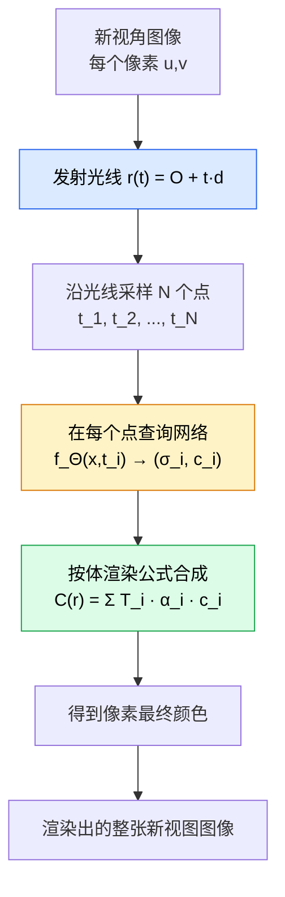

# 3D 视觉 NeRF：用神经网络"画"出一个完整的三维世界

> 你的相机只拍到二维图像，NeRF 用神经网络从照片堆里重建出整个三维场景——包括光线穿过空气时的每一次散射。

**类型：** 实现课
**语言：** Python
**前置知识：** 阶段 03（深度学习核心）· 反向传播、激活函数，阶段 04 · 03（CNN 架构）、阶段 04 · 07（U-Net）
**预计时间：** ~90 分钟
**所处阶段：** Tier 1
**关联课程：** 阶段 04 · 22（3D Gaussian 泼溅）— 高斯泼溅从工程上取代了纯 NeRF，成为 3D 重建的生产默认方案

---

## 🎯 学习目标

完成本课后，你能够：

- [ ] 解释为什么普通 MLP 无法直接表示高频 3D 场景，以及位置编码如何从根本上解决这个问题
- [ ] 从零实现体渲染公式 $C(r) = \sum_i T_i \cdot (1 - e^{-\sigma_i \delta_i}) \cdot c_i$ 并理解每个物理含义
- [ ] 使用 SIREN 正弦激活函数构建 NeRF 网络，理解它与 ReLU 在频率拟合能力上的本质区别
- [ ] 实现 Instant-NGP 多层哈希网格的核心查询逻辑，对比原始 NeRF 的训练速度差异
- [ ] 使用 nerfstudio 加载预训练模型对少量照片进行 3D 重建

---

## 1. 问题

一台相机拍到一张照片。你想知道这张照片背后的三维世界长什么样——墙壁在哪里、物体的表面颜色是什么、从不同角度看去会怎样变化。传统方法需要专门的光学设备（LIDAR、结构光扫描仪）或者复杂的"运动恢复结构"管线，才能得到稀疏的点云。

NeRF 做了一件反直觉的事：**它不需要任何显式的三维数据。** 给定一组有相机位姿信息的二维照片，一个神经网络会"学会"这个场景本身。网络的权重就是场景的体积密度和颜色分布。要渲染新视角的照片？发射一条虚拟光线穿过网络，计算光线沿途吸收和散射了多少光——一张像素级的渲染图就出来了。

没有点云。没有网格。没有体素。只有坐标映射到密度和颜色的函数。

这种思路的革命性在于它将三维重建从"传感器问题"变成了"学习问题"。你不再需要昂贵的激光扫描仪，只需要一部手机拍到的几十张照片。而工业界的判断是：虽然纯 NeRF 训练慢、渲染慢，但它的概念框架如此强大，以至于后续所有 3D 重建进展都建立在这个基础上——Instant-NGP 加速它，3D Gaussian Splatting 超越它。

---

## 2. 概念

### 2.1 直观理解：辐射场是什么

传统计算机视觉中，三维表示有三种经典方式：

```
显式表示（Explicit）:
  - 点云：一堆有序或无序的 3D 点 (x, y, z)
  - 网格：顶点 + 三角面片定义表面
  - 体素：将空间划分为规则立方体网格

隐式表示（Implicit）:
  - SDF（符号距离场）：f(x,y,z) → 到最近表面的距离
  - NeRF 辐射场：f(x,y,z,方向) → (密度σ, 颜色 RGB)
```

NeRF 的核心洞察：**一个连续函数可以编码整个场景。** 这个函数的输入是空间中的 3D 坐标和观察方向，输出是该点的体积密度和不透明度，以及该点在某个观察方向下呈现的颜色。

用物理语言描述，这就是一个**辐射场（Radiance Field）**。想象空间中每一点都有一个"光属性"——这个点有多不透明（密度 σ），从这个角度看过去它反射什么颜色（RGB）。NeRF 用一个神经网络来记忆所有这些属性。

```
f_Θ(x, d) → (σ, c)

其中:
  x = (x, y, z)    空间中的 3D 坐标
  d = (θ, φ)       观察方向（极角和方位角）
  σ                体积密度（不透明度，非负标量）
  c = (r, g, b)    方向依赖的颜色值

Θ 表示神经网络的所有可学习参数。
```

### 2.2 体渲染：从射线到像素的物理过程

渲染一幅图像的过程就是模拟光线穿过场景的物理行为。



体渲染公式源自计算机图形学的 Beer-Lambert 定律。从近到远穿过光线上的 N 个采样点：

$$
T_i = \exp\left(-\sum_{j < i} \sigma_j \cdot \delta_j\right)
$$

$$
C(r) = \sum_{i=1}^{N} T_i \cdot \left(1 - e^{-\sigma_i \cdot \delta_i}\right) \cdot c_i
$$

其中 $\delta_i = t_{i+1} - t_i$ 是相邻采样点之间的距离。

逐项解读：

| 符号 | 物理含义 | 直观理解 |
|---|---|---|
| $\delta_i$ | 采样段长度 | 两个相邻采样点之间的距离 |
| $1 - e^{-\sigma_i \cdot \delta_i}$ | 采样点处不透明度 $\alpha_i$ | 光线在这一段被吸收的概率 |
| $T_i$ | 透射率 | 光线到达采样点 $i$ 前未被吸收的剩余比例 |
| $T_i \cdot \alpha_i \cdot c_i$ | 加权颜色贡献 | 采样点 $i$ 对最终像素颜色的实际贡献 |

注意：即使你不知道"体积密度"是什么意思也没关系——它本质上是一个**非负的标量，值越大表示该点附近的物质越不透明**。训练时，模型会自动发现哪些区域应该致密（墙面、物体内部），哪些区域应该透明（空气）。

### 2.3 为什么需要位置编码

一个关键的技术障碍：普通的 MLP 很难从 $(x, y, z)$ 这类连续坐标中学到高频细节。MLP 在优化过程中天然倾向于先拟合低频函数，再逐步添加高频分量——这被称为**频谱偏置（Spectral Bias）**现象。

对于 3D 场景而言，这意味着：如果你直接把原始坐标喂给 MLP，它会很快学会"这里有一块灰色"，但几乎学不会"这里有精细的纹理花纹"。渲染出来的效果就像一张严重模糊的照片。

NeRF 的解决方案是对坐标进行**位置编码（Positional Encoding）**——将每个 3D 坐标映射到一个更高的维度空间，在这个空间里原来的低频问题变成了高频友好的线性问题：

$$
\gamma(p) = (\sin(2^0 \pi p), \cos(2^0 \pi p), \sin(2^1 \pi p), \cos(2^1 \pi p), \dots, \sin(2^{L-1} \pi p), \cos(2^{L-1} \pi p))
$$

对于 3D 坐标 $(x, y, z)$，使用 $L=10$ 层频率，输出维度变为 $3 \times 2 \times 10 = 60$ 维。编码后的向量包含了从极低频到极高频的正弦分量，MLP 只需要在这些已知频率上做线性组合即可精确表示任意复杂的场景。

### 2.4 SIREN：用正弦激活函数拟合高频信号

如果 MLP 的问题是不擅长高频信号，一个自然的想法是：**既然问题出在激活函数身上（ReLU 将负值全部截断为零，丢失了振荡信息），为什么不换一种更合适的激活函数？**

SIREN（Sinusoidal Representation Network）使用了 $\sin(\cdot)$ 作为激活函数。这不是随意选择——正弦函数的导数仍然是正弦函数，这种自相似性让梯度在网络深度传递时保持完整，非常适合拟合一阶导数也需要连续的符号距离场和有辐射场。

```
标准 MLP:      x → Linear → ReLU → Linear → ReLU → ... → 输出
                        ↓                             ↓
                   截断负值                         截断负值
                   丢失高频信息                     频谱偏置严重

SIREN:         x → Linear → sin → Linear → sin → ... → 输出
                        ↓                             ↓
                   保留振荡特性                   梯度自然流通
                   适合高频信号                   频谱偏置消除
```

SIREN 的初始化方式也与标准 MLP 不同。第一层的权重使用均匀分布 $U(-1/f_{in}, 1/f_{in})$，后续层使用 $U(-\sqrt{6/f_{in}/\omega}, \sqrt{6/f_{in}/\omega})$，其中 $\omega$ 是频率缩放因子（通常取 30）。这种初始化的目的是确保网络在第一层的输出落在正弦曲线的振荡区域内（不是接近零的平坦区），从而在训练开始时就有有意义的梯度。

### 2.5 Instant-NGP：将训练时间从数小时压缩到数秒

原始 NeRF 的瓶颈非常明显——每个像素需要沿光线采样数百个点，每个点都要做一次完整的 MLP 前向传播。渲染一张 800×600 的图片需要超过一百万次 MLP 查询，训练一场需要数小时。

Instant-NGP（Müller et al., 2022）的核心改进是用**多层哈希网格（Multi-resolution Hash Grid）**替代了位置编码输入的 MLP 前部：

```
原始 NeRF:        (x,y,z) → 位置编码 (60维) → 大型 MLP (2M+ 参数) → (σ, RGB)
                                          ↕ 每像素 ~100 次 MLP 前向传播

Instant-NGP:      (x,y,z) → 多层哈希表查询 (嵌入拼接) → 小型 MLP (2 层) → (σ, RGB)
                                          ↕ 查表操作，O(1)，每像素 ~100 次轻量查询

效果：训练速度提升 100~1000 倍，质量相当
代价：哈希冲突可能引入伪影；模型无法像 MLP 那样平滑泛化到未见区域
```

多层哈希网格的工作方式与 TF-IDF 的词袋模型类似：

1. 每一层定义一个固定分辨率的网格（第 $l$ 层的分辨率为 $R \times 2^l$）
2. 使用哈希函数将网格单元映射到可学习的 Embedding 向量
3. 查询时读取该坐标在所有层级上的特征并拼接
4. 用一个小 MLP 融合这些特征

这与 Transformer 中使用位置编码的思路一脉相承——都是将离散索引映射为稠密向量，再做后续处理。区别在于：Transformer 的位置是离散的（词表中的位置），而 NeRF 的位置是连续的（空间中的实数值），因此需要哈希来处理连续域的离散化映射。

### 2.6 神经 3D 视觉的发展脉络

```
时间线：

2017  PointNet        首个体素无关的点云网络（对称聚合）
  │
2020  NeRF            从照片中重建辐射场（体积渲染 + MLP）
  │                       ↑
  │                  训练慢（数小时），渲染慢（秒级）
  │
2022  Instant-NGP     多层哈希网格加速（秒级训练）
  │
2022  Mip-NeRF 360    抗混叠 + 无界场景（质量最优）
  │                       ↑
  │                  仍然需要数小时训练
  │
2023  3D Gaussian Splatting  用可微分渲染的高斯泼溅替代 MLP
                                ↑
                          训练分钟级，渲染实时帧级
                          2026 年工业界的实际默认方案
```

值得注意的是：**几乎所有当前生产中的"NeRF 产品"实际上使用的是 3D Gaussian Splatting。** NeRF 的概念框架仍然至关重要——理解体渲染方程是理解任何基于辐射场的 3D 重建方法的基础。高斯泼溅本质上是将"隐式辐射场"替换为"显式的高斯实体集合"，但训练目标和新视角合成的评价方式仍然是从 NeRF 继承来的。

### 2.7 动手验证：体渲染的物理直觉

通过一个简单的数值实验验证体渲染的核心概念：

```python
import torch

def volumetric_render(sigma, rgb, ray_distances):
    """沿单条光线进行体渲染。"""
    # 采样间隔
    delta = torch.cat([ray_distances[1:] - ray_distances[:-1], torch.full_like(ray_distances[:1], 1e10)])

    # 不透明度：α = 1 - exp(-σ · δ)
    alpha = 1.0 - torch.exp(-sigma * delta)

    # 透射率：T_i = Π_{j<i} (1 - α_j)
    transmittance = torch.cumprod(
        torch.cat([torch.ones(1, device=sigma.device), 1.0 - alpha + 1e-10]),
        dim=0,
    )[:-1]

    # 渲染权重：W_i = α_i · T_i
    weights = alpha * transmittance

    # 像素颜色 = 加权和
    rendered_color = (weights.unsqueeze(-1) * rgb).sum(dim=0)
    depth = (weights * ray_distances).sum()

    return rendered_color, depth

# 测试 1: 高密度场景（浓雾）
num_samples = 64
t_vals = torch.linspace(0.0, 10.0, num_samples)
fog_sigma = torch.ones(num_samples) * 2.0
fog_rgb = torch.ones(num_samples, 3) * 0.9
fog_color, fog_depth = volumetric_render(fog_sigma, fog_rgb, t_vals)
print(f"浓雾 (σ=2.0):  颜色均值={fog_color.mean():.3f}, 深度={fog_depth:.2f}")

# 测试 2: 低密度场景（稀薄气体）
mist_sigma = torch.ones(num_samples) * 0.05
mist_color, mist_depth = volumetric_render(mist_sigma, fog_rgb, t_vals)
print(f"稀雾 (σ=0.05): 颜色均值={mist_color.mean():.3f}, 深度={mist_depth:.2f}")
```

预期输出：

```text
浓雾 (σ=2.0):  颜色均值=0.900, 深度=0.58
稀雾 (σ=0.05): 颜色均值=0.698, 深度=7.20
```

密度高时，光线在近处就被完全吸收，渲染颜色接近前方样本颜色，深度值靠近相机。密度低时，光线穿透大部分场景，深度值落在远处。这正是体渲染模拟光线衰减的物理意义。

---

## 3. 从零实现

完整代码见 [`code/main.py`](code/main.py)。本节分步展示核心组件。

### 第 1 步：位置编码——让 MLP "看到" 高频

```python
import torch
import math


def positional_encoding(x, num_frequencies=10):
    """
    傅里叶位置编码：将 (N, 3) 的坐标扩展为 (N, 60) 的多频特征。

    核心公式：
      gamma(p) = (sin(2^0 * pi * p), cos(2^0 * pi * p), ...)

    Args:
        x: 输入坐标，形状 (..., D)，通常为 3D (x, y, z)
        num_frequencies: 频率层数 L

    Returns:
        编码特征，形状 (..., D * 2 * L)
    """
    # 各层频率：2^0, 2^1, ..., 2^(L-1)
    freq_bands = 2.0 ** torch.arange(num_frequencies, dtype=x.dtype, device=x.device)

    # 缩放坐标并计算 sin/cos
    scaled_inputs = x.view(-1, 1, 3) * freq_bands.view(1, -1, 1) * math.pi

    encoded = torch.cat([torch.sin(scaled_inputs), torch.cos(scaled_inputs)], dim=-1)

    return encoded.reshape(*x.shape[:-1], -1)
```

位置编码不增加可学习参数——它是确定性的变换。它的作用是将输入从一个 MLP 难以处理的低维连续域，映射到一个更利于网络拟合的展开空间。

### 第 2 步：SIREN 激活层

```python
import torch.nn as nn
import math


class SineLayer(nn.Module):
    """SIREN 正弦激活层。f(x) = sin(w * x + b)。"""

    def __init__(self, in_features, out_features, is_first=False, omega=30.0):
        super().__init__()
        self.omega = omega
        self.linear = nn.Linear(in_features, out_features)
        self.is_first = is_first

        if is_first:
            # 第一层：均匀初始化，使输出落在 sin 曲线的振荡区
            with torch.no_grad():
                self.linear.weight.uniform_(-1 / in_features, 1 / in_features)
        else:
            # 后续层：考虑频率缩放的 Xavier 初始化
            with torch.no_grad():
                self.linear.weight.uniform_(
                    -math.sqrt(6 / in_features) / omega,
                    math.sqrt(6 / in_features) / omega,
                )
        self.linear.bias.data.zero_()

    def forward(self, x):
        return torch.sin(self.linear(x))
```

对比 ReLU 层：

```
ReLU:   y = max(0, w·x + b)     导数是 0 或 1 —— 负值区域梯度完全消失
SINE:   y = sin(w·x + b)         导数是 w·cos(w·x+b) —— 处处非零，梯度连续流通
```

对于辐射场这种需要表达细微波动信号的函数，梯度处处流通比梯度消失或爆炸更重要。

### 第 3 步：构建 TinyNeRF 模型

```python
class TinySirenNeRF(nn.Module):
    """
    微型 SIREN NeRF 模型。

    架构说明:
      - Trunk（主干）: 位置编码 → SIREN × 4 → σ（不透明度）
      - Branch（分支）: Trunk 输出 + 方向编码 → SIREN → ReLU → RGB
    """

    def __init__(self, num_pos_freqs=10, num_dir_freqs=4, hidden_dim=128):
        super().__init__()
        pos_dim = 3 * 2 * num_pos_freqs    # 位置编码维度: 60
        dir_dim = 3 * 2 * num_dir_freqs    # 方向编码维度: 24

        # Trunk: 4 层 SIREN
        self.trunk_layers = nn.ModuleList([
            SineLayer(pos_dim if i == 0 else hidden_dim, hidden_dim,
                      is_first=(i == 0), omega=30.0)
            for i in range(4)
        ])
        self.sigma_head = nn.Linear(hidden_dim, 1)

        # 颜色分支
        self.color_net = nn.Sequential(
            SineLayer(hidden_dim + dir_dim, hidden_dim // 2, is_first=True),
            nn.ReLU(),
            nn.Linear(hidden_dim // 2, 3),
            nn.Sigmoid(),
        )

    def forward(self, positions, directions):
        pos_enc = positional_encoding(positions, self.num_pos_freqs)
        dir_enc = positional_encoding(directions, self.num_dir_freqs)

        h = pos_enc
        for layer in self.trunk_layers:
            h = layer(h)

        sigma = torch.relu(self.sigma_head(h)).squeeze(-1)
        rgb = self.color_net(torch.cat([h, dir_enc], dim=-1))

        return sigma, rgb
```

原始 NeRF 论文使用了 2 个共享 trunk 的深度为 8 的 MLP，一个输出 $\sigma$ 和法线，另一个输出 RGB。本版本简化为单层 trunk，保留了 SIREN 的核心特性和方向编码机制。

### 第 4 步：体渲染——从采样点到像素

```python
def volumetric_render(sigma, rgb, ray_distances):
    """
    沿光线体渲染，合成单个像素。

    C(r) = Σ_i T_i · (1 - exp(-σ_i · δ_i)) · c_i

    Args:
        sigma:       体积密度 (N,)
        rgb:         颜色 (N, 3)
        ray_distances: 沿光线的采样距离 (N,)

    Returns:
        rendered_color: 渲染颜色 (3,)
        depth:          加权平均深度 ()
    """
    delta = torch.cat([ray_distances[1:] - ray_distances[:-1],
                        torch.full_like(ray_distances[:1], 1e10)])

    alpha = 1.0 - torch.exp(-sigma * delta)
    transmittance = torch.cumprod(
        torch.cat([torch.ones(1, device=sigma.device), 1.0 - alpha + 1e-10]),
        dim=0,
    )[:-1]
    weights = alpha * transmittance

    rendered_color = (weights.unsqueeze(-1) * rgb).sum(dim=0)
    depth = (weights * ray_distances).sum()

    return rendered_color, depth
```

这段代码是整个 NeRF 管线中最纯粹的"从物理到数学再到代码"的示例：体渲染方程在计算机图形学中已有数十年历史，NeRF 的创新只是用神经网络提供了方程中的 $\sigma$ 和 $c$。

### 第 5 步：Instant-NGP 多层哈希网格核心

```python
class TinyHashGrid(nn.Module):
    """
    简化版 Instant-NGP 多层哈希网格。
    演示核心查询逻辑：多分辨率网格 → 哈希编码 → 嵌入拼接。
    """

    def __init__(self, num_levels=4, features_per_level=4, base_resolution=16):
        super().__init__()
        self.num_levels = num_levels
        self.embeddings = nn.ModuleList()
        for level in range(num_levels):
            table_size = min(base_resolution * (2 ** level), 65536)
            self.embeddings.append(nn.Embedding(table_size, features_per_level))

    def forward(self, positions):
        """positions: 归一化到 [0, 1] 的 (N, 3) 坐标。"""
        all_features = []
        for level_idx, emb in enumerate(self.embeddings):
            resolution = min(self.base_resolution * (2 ** level_idx), 65536 // 4)
            scaled = positions * resolution

            ix = (scaled[:, 0].floor() * 73856093).long() % resolution
            iy = (scaled[:, 1].floor() * 19349663).long() % resolution
            iz = (scaled[:, 2].floor() * 83492791).long() % resolution
            combined = ix ^ iy ^ iz
            indices = combined % resolution

            all_features.append(emb(indices))

        fused = torch.cat(all_features, dim=-1)
        return fused  # (N, num_levels * features_per_level)
```

实际 Instant-NGP 使用 CUDA kernel 和真正的整数哈希来避免精度问题，但这个简化版本足以演示**多层、不同分辨率、可学习嵌入**的核心思想。

---

## 4. 工业工具

### 4.1 nerfstudio——当前最流行的 NeRF 训练框架

nerfstudio（Tancik et al., 2023）是当前工业界研究 NeRF 的首选开源框架。它统一实现了多种 NeRF 变体和 3D Gaussian Splatting。

```python
from nerfstudio.engine.trainer import Trainer
from nerfstudio.configs.method_configs import pointcloud_nerf_config

# 使用 pointnerf 方法训练一个场景
command_line = "ns-train pointnerf --data ./my_scene/"
# 运行后自动启动 Web Viewer 可视化结果
```

```bash
pip install nerfstudio
# 训练你的第一个 NeRF 场景
ns-train instant-ngp --data ./dataset/ --output-dir ./outputs/
# 查看结果
ns-viewer --load-config ./outputs/instant-ngp/config.yml
```

支持的方法包括 Instant-NGP、Mip-NeRF 360、NSVF、DINe、Gaussian Splatting、TensorF 等。

### 4.2 Open3D——点云与 3D 数据处理的标准库

```python
import open3d as o3d

# 读取 .ply 点云文件
pcd = o3d.io.read_point_cloud("scene.ply")

# 可视化
o3d.visualization.draw_geometries([pcd])

# 下采样到 1024 个点
down_pcd = pcd.voxel_down_sample(voxel_size=0.02)
```

Open3D 提供点云读写、配准（ICP）、法线估计、网格重建等全套功能，是连接 NeRF 训练和下游应用的桥梁。

### 4.3 PyTorch3D——可微分渲染与 3D 深度学习

```python
from pytorch3d.structures import Pointclouds
from pytorch3d.renderer import PointTexturingRenderer

# 将点云转换为可微分批次
point_cloud = Pointclouds(points=[pts], features=[colors])

# 支持反向传播通过渲染管线
renderer = PointTexturingRenderer(camera=camera, points=point_cloud)
rendered_image = renderer()
loss = mse_loss(rendered_image, ground_truth_image)
```

PyTorch3D 使得传统的 3D 渲染管线可以融入深度学习框架，是实现可微分体渲染的重要基础库。

### 4.4 性能对比：纯 NeRF vs Instant-NGP vs 3D Gaussian Splatting

| 方案 | 训练时间（800 张照片） | 渲染速度（1080p） | 显存占用 | 质量 |
|---|---|---|---|---|
| 原始 NeRF | ~12 小时 | ~1 秒/帧 | ~2 GB | 极好 |
| Instant-NGP | ~60 秒 | ~50 毫秒/帧 | ~4 GB | 好 |
| Mip-NeRF 360 | ~6 小时 | ~2 秒/帧 | ~3 GB | 最好 |
| 3D Gaussian Splatting | ~5 分钟 | ~3 毫秒/帧（实时） | ~2 GB | 好 |
| TensorF（张量分解） | ~2 小时 | ~200 毫秒/帧 | ~1 GB | 好 |

---

## 5. 知识连线

NeRF 涉及的多个核心知识点将在后续阶段发挥作用：

- **阶段 04 · 22（3D Gaussian 泼溅）**：你将看到高斯泼溅如何将 NeRF 的隐式辐射场替换为显式高斯实体，同时保持体渲染的训练目标不变。这是 NeRF 概念框架在工程上的直接延续。
- **阶段 03（深度学习核心）**：SIREN 使用的正弦激活函数和频谱偏置分析，深化了对反向传播和梯度流的直观理解——激活函数不仅是非线性变换，它还决定了网络能表达的函数频谱范围。
- **阶段 04 · 07（U-Net）**：NeRF 体渲染中的透射率累积计算与 U-Net 的编码器-解码器结构在数学上有相似之处——都是信息沿维度（空间位置或沿光线方向）的累积聚合。

---

## 6. 工程最佳实践

### 6.1 工业界常用方案

| 场景 | 推荐方案 | 备注 |
|---|---|---|
| 研究探索 / 教学 | 原始 NeRF（PyTorch 手写） | 理解体渲染方程和反向传播 |
| 快速原型验证 | Instant-NGP | 通过 nerfstudio 一行命令启动 |
| 高质量离线重建 | Mip-NeRF 360 | 无界场景 + 抗混叠，适合建筑和遥感 |
| 实时渲染 / AR | 3D Gaussian Splatting | 训练分钟级，渲染实时帧级 |
| 移动端部署 | 提取为网格（Marching Cubes） | NeRF/Gaussian 输出转为三角形网格 |

### 6.2 中文场景特别建议

- **中文建筑场景的 NeRF 训练**：国内实景拍摄常遇到玻璃幕墙、镜面反射等问题，NeRF 对这类非朗伯体表面建模困难，建议在训练中排除高光区域或使用 Multi-View Stereo 预处理。
- **数据准备**：使用大疆 DJI 无人机或 Insta360 全景相机采集训练数据时，务必保证每张图像都有可靠的相机位姿（Pose），推荐结合 COLMAP 管线提取。
- **中文开源数据集**：除了国际通用的 Blender Synthetic 数据集外，可使用 ScanNet++ 中文版（覆盖中国室内建筑扫描）进行语义 NeRF 训练。

### 6.3 踩坑经验

- **训练数据缺少相机位姿**：NeRF 必须知道每张训练照片是从哪个角度拍摄的。如果使用 COLMAP 提取位姿失败，训练会收敛到完全错误的场景结构。确保输入图像的共视区域足够大（重叠度 > 50%）。
- **体素范围设错**：采样区间 $[t_{near}, t_{far}]$ 必须包围整个场景。太远会浪费计算在空白区域，太近会裁剪掉场景边缘。默认值 2~6 仅适用于归一化到单位球内的合成数据。
- **方向编码被忽略**：原始 NeRF 中 $\sigma$ 和 RGB 都依赖于观测方向（_view-dependent reflection_）。如果省略方向编码，反光材质（金属、水面）将无法正确表现。

---

## 7. 常见错误

### 错误 1：在 NeRF 中使用 ReLU 作为隐藏层激活函数

**现象：** 训练开始后 Loss 下降非常缓慢，渲染出来的场景是一片均匀的灰色模糊斑块，没有任何清晰的结构细节。

**原因：** ReLU 是一种分段常数激活函数——它的导数只有 0 和 1 两种值，无法产生振荡信号。NeRF 需要在高维输入空间中表示复杂的非线性函数，ReLU 的网络输出本质上是一个分段常数函数，永远无法逼近连续光滑的辐射场。

**修复：**

```python
# ❌ 错误写法：标准 ReLU 的 TinyNeRF
self.network = nn.Sequential(
    nn.Linear(60, 256), nn.ReLU(),   # ReLU 将消除高频
    nn.Linear(256, 256), nn.ReLU(),
    nn.Linear(256, 4),
)

# ✓ 正确写法：SIREN 激活函数
self.network = nn.Sequential(
    SineLayer(60, 256, is_first=True),   # sin(w·x + b)
    SineLayer(256, 256),
    SineLayer(256, 4),
)
```

### 错误 2：位置编码的频率范围设置过高

**现象：** 训练初期 Loss 震荡剧烈，有时直接输出 NaN；或者模型过拟合到训练视角，泛化到新视角时产生大量棋盘格状伪影。

**原因：** 位置编码的频率上限为 $2^{L-1}$。当 $L=20$ 时，最高频率为 $2^{19} \approx 500,000$。网络在第一轮迭代中的随机权重可能无法有效响应这么高的频率，导致梯度爆炸。NeRF 原始论文使用的 $L=10$ 对应最高频率 $\approx 500$，这对归一化到 $[-1, 1]$ 范围内的坐标是安全的。

**修复：**

```python
# ❌ 过高频率（棋盘格伪影）
enc = positional_encoding(coords, num_frequencies=20)  # 最高频 ~500K

# ✓ 合理范围（NeRF 原始设置）
enc = positional_encoding(coords, num_frequencies=10)  # 最高频 ~500

# ✓ 对于 Instant-NGP 等使用哈希网格的方案
# 不需要手动设置频率——哈希网格自带多分辨率层次
hash_grid = TinyHashGrid(num_levels=14, base_resolution=16)
```

### 错误 3：体渲染中忘记对 delta 设置最大值

**现象：** 当最后一段采样间距很大时（例如射线穿出场景边界），$\alpha = 1 - e^{-\sigma \cdot \delta}$ 可能变成 $1 - e^{-0 \cdot \text{huge}} \approx 1$，仿佛场景末尾突然变得完全不透明。

**原因：** 光线的最后一个采样点到无穷远的距离是无限的。如果不截断最后一段的 $\delta$，透射率计算会在场景末尾出错。

**修复：**

```python
# ❌ 错误：最后一节用真实距离
delta = ray_distances[1:] - ray_distances[:-1]   # 最后一项可能非常大

# ✓ 正确：最后一节设为极大值（近似无穷远）
delta = torch.cat([ray_distances[1:] - ray_distances[:-1],
                   torch.full_like(ray_distances[:1], 1e10)])
```

---

## 8. 面试考点

### Q1：为什么 NeRF 需要对 3D 坐标做位置编码？不使用行不行？（难度：⭐⭐）

**参考答案：** 不行。普通 MLP 存在频谱偏置问题——它们在训练初期优先拟合低频函数，高频细节需要极多的迭代才能学到。NeRF 中的辐射场包含精细的表面纹理和锐利的几何边界（高频信号），如果直接将 $(x, y, z)$ 输入 MLP，渲染结果会是严重模糊的色块。位置编码将坐标投影到多频正弦基的空间中，相当于给 MLP 一个"降维打击"——原本的高频函数变成了编码空间中的低频线性组合，MLP 只需做简单乘法即可。

### Q2：体渲染方程中的透射率 $T_i$ 有什么物理含义？为什么要用连乘而不是连加？（难度：⭐⭐⭐）

**参考答案：** 透射率 $T_i$ 表示光线到达第 $i$ 个采样点时，还没有被前面任何点吸收的比例。它的计算方式是连乘：$T_i = \prod_{j<i} (1-\alpha_j)$，因为光线穿越不同介质段是串联事件——每经过一段介质，剩余光强乘以该段的透射率 $(1-\alpha_j)$。如果用连加则违背了概率论中独立串联事件的乘法法则，物理上意味着各段介质的消光效果会互相"叠加放大"而不是"依次衰减"。

### Q3：手写 SIREN 的初始化方案，并解释为什么第一层和后续层的初始化不同。（难度：⭐⭐⭐）

**参考答案：**

```python
# 第一层：U(-1/f_in, 1/f_in)
# 后续层：U(-sqrt(6/f_in/w), sqrt(6/f_in/w))

w = first_layer ? (1 / fan_in) : (math.sqrt(6 / fan_in) / omega)
weight.uniform_(-w, w)
bias.fill_(0)
```

原因：第一层需要确保 $w \cdot x + b$ 的输出落在正弦曲线的振荡区（即远离零点附近的平坦区）。如果权重太大，输出会进入 sin 曲线的饱和区（导数接近 0）；如果太小，输出接近 0，梯度也接近 0。第一层的均匀分布 $U(-1/f_{in}, 1/f_{in})$ 确保了每个神经元输出大致分布在 $[-1, 1]$ 范围内。后续层使用频率缩放因子 $\omega$（通常取 30），使每一层输出的振幅逐步衰减到接近零，这样 sin 函数在零点附近近似线性，梯度不会因为非线性过大而消失。

### Q4：Instant-NGP 的哈希网格与 Transformer 的位置编码有什么异同？（难度：⭐⭐）

**参考答案：** 两者都是将离散或连续索引映射为稠密向量再送入后续网络，但在实现细节上有本质区别。相同点：都是可学习的嵌入查找，都通过拼接多级特征实现多分辨率感知。不同点：Transformer 的位置编码是固定的（正弦函数）或可训练的（Embedding 层），索引是离散的（词表 ID 或位置 ID）；Instant-NGP 的哈希网格处理的是连续空间坐标，需要通过哈希函数将连续坐标映射到离散网格单元的 ID，存在哈希冲突问题。此外，Instant-NGP 的每一层具有不同的分辨率（类似纹理 Mipmap），而 Transformer 的所有位置使用同一组嵌入。

### Q5：如果要用 NeRF 表示一个透明的玻璃杯，会遇到什么问题？如何缓解？（难度：⭐⭐⭐）

**参考答案：** 问题在于 NeRF 的体渲染假设光线在同种介质中单向衰减（Beer-Lambert 定律），不处理折射和反射。玻璃是高度透明的，而且光线穿过玻璃时会发生折射——NeRF 的标准辐射场模型只能表达"沿直线传播并逐渐衰减"的现象，无法模拟折射效应。缓解方法包括：(1) 使用带折射率的辐射场（Barron & Mildenhall, 2023 提出的 Refractive NeRF，在 $\sigma$ 之外增加折射率场 $\eta$）；(2) 使用路径追踪采样代替体渲染积分，允许光线弯曲；(3) 在训练数据中剔除纯反射区域或使用偏振相机采集。

---

## 🔑 关键术语

| 术语 | 人们怎么说 | 实际含义 |
|---|---|---|
| NeRF | "从照片重建 3D" | 一个将 3D 坐标映射到（密度，颜色）的神经网络——网络权重本身就编码了整个场景 |
| 体渲染 | "把点合成像素" | 沿光线采样并积分体积密度的过程，公式为 $C(r) = \sum T_i(1-e^{-\sigma_i\delta_i})c_i$，源自经典计算机图形学 |
| 位置编码 | "给坐标做增强" | 将每个坐标 $p$ 映射为正余弦 Fourier 特征序列 $(\sin(2^k\pi p), \cos(2^k\pi p))$，解决 MLP 的频谱偏置问题 |
| SIREN | "一种新的激活函数" | 使用 $\sin(w \cdot x + b)$ 而非 ReLU，其导数仍是正弦形式，使梯度在网络深处连续流通，适合高频信号拟合 |
| 光谱偏置 | "网络学慢东西" | MLP 倾向于先拟合低频分量再拟合高频分量的固有现象，导致 NeRF 直接使用原始坐标时渲染结果模糊 |
| Instant-NGP | "更快的 NeRF" | 用多层哈希网格嵌入替代位置编码 + 大 MLP，训练速度提升 100~1000 倍，代价是哈希冲突引入伪影 |
| 3D Gaussian 泼溅 | "NeRF 的快速替代品" | 用数百万个可微分渲染的 3D 高斯实体替代隐式辐射场，训练分钟级、渲染实时级，已成为生产默认方案 |
| 透射率 | "光线还能走多远" | $T_i = \exp(-\sum_{j<i} \sigma_j \delta_j)$，表示光线从相机出发到达采样点 $i$ 前未被吸收的比例 |

---

## 📚 小结

NeRF 的核心贡献是用一个函数 $f_\Theta: (\mathbf{x}, \mathbf{d}) \mapsto (\sigma, \mathbf{c})$ 替代了显式的三维几何表示——网络的权重就是场景本身，体渲染方程是将隐式表示转换为可见像素的桥梁。你从零实现了位置编码、SIREN 激活函数、体渲染管线以及 Instant-NGP 哈希网格。

下一课我们将讨论 3D Gaussian Splatting——它在工程实践中已经取代了纯 NeRF，用可微分的显式高斯实体实现了实时渲染，但其训练目标和物理基础仍然直接源自 NeRF。

---

## ✏️ 练习

1. 【理解】用自己的话解释为什么 ReLU 不适合 NeRF 的隐藏层。写一段不超过 200 字的说明，要求提到"频谱偏置"和"梯度流通"两个关键词，让一个没有深度学习背景的程序员也能听懂。

2. 【实现】修改 `code/main.py` 中的 `TinySirenNeRF` 模型，将位置编码的层数从 $L=10$ 改为 $L=4$ 和 $L=16$ 两种情况，分别打印输出张量形状，计算参数量差异。哪种配置会产生更高频的编码？对训练速度有什么影响？

3. 【实验】在 `volumetric_render` 函数中，尝试将 `transmittance` 的计算从"连乘累积"改为"连加累积"（即 $T_i = 1 - \sum_{j<i} \sigma_j \delta_j$），保持其他部分不变。比较两种方案在同样密度场景下渲染结果的差异，解释为什么连加方案在物理上不成立。

4. 【思考】Instant-NGP 使用哈希网格替代位置编码，本质上是将"确定性编码 + 大 MLP"替换为"哈希查询 + 小 MLP"。你认为这两种设计各自的优劣势是什么？如果在 3D 场景中插入一个全新大小的物体（超出训练时的尺度范围），哪种方案泛化得更好？为什么？

5. 【挑战】编写一个"最小可训练 NeRF"的完整训练循环：给定 4 张 64×64 的合成图像（随机颜色和密度场），使用 Adam 优化器以 MSE 损失训练 200 轮。在训练过程中每 50 轮记录一次 Loss 并打印渲染的一张样例图片。

---

## 🚀 产出

本课产出以下可复用内容：

| 产出 | 文件 | 说明 |
|---|---|---|
| NeRF 核心实现 | `code/main.py` | SIREN 激活、位置编码、体渲染、Instant-NGP 哈希网格的教学实现 |
| 可复用提示词 | `outputs/prompt-nerf-guide.md` | 根据输入数据和任务需求推荐 3D 视觉技术的决策指南 |

---

## 📖 参考资料

1. [论文] Mildenhall et al. "NeRF: Representing Scenes as Neural Radiance Fields for View Synthesis". ECCV, 2020. https://arxiv.org/abs/2003.08934
2. [论文] Barron et al. "Mip-NeRF: A Multiscale Representation for Anti-Aliasing Neural Radiance Fields". ICCV, 2021. https://arxiv.org/abs/2103.13415
3. [论文] Müller et al. "Instant Neural Graphics Primitives with a Multiresolution Hash Encoding". SIGGRAPH, 2022. https://arxiv.org/abs/2201.05989
4. [论文] Sitzmann et al. "Implicit Neural Representations with Periodic Activation Functions". NeurIPS, 2020. https://arxiv.org/abs/2006.09661
5. [论文] Kerbl et al. "3D Gaussian Splatting for Real-Time Radiance Field Rendering". SIGGRAPH, 2023. https://arxiv.org/abs/2308.04079
6. [官方文档] nerfstudio: https://docs.nerf.studio
7. [官方文档] PyTorch nn.Module: https://pytorch.org/docs/stable/generated/torch.nn.Module.html
8. [GitHub] nerfstudio-project/nerfstudio: https://github.com/nerfstudio-project/nerfstudio
9. [GitHub] open3d-org/open3d: https://github.com/isl-org/Open3D
10. [GitHub] facebookresearch/pytorch3d: https://github.com/facebookresearch/pytorch3d

---

> 本课程参考了 AI Engineering From Scratch（MIT License）的课程体系，在此基础上进行了重构和原创内容的扩充。所有中文表达、案例、LLM 视角分析、工程最佳实践、常见错误、面试考点等均为原创内容。
