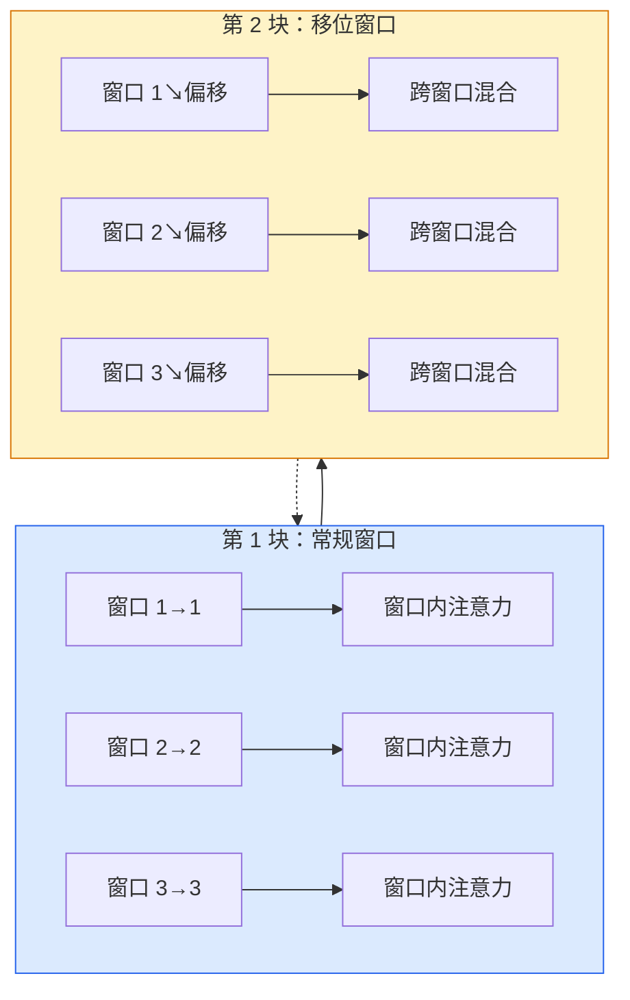

# Vision Transformer：将图像切成碎片，用 Transformer 吃下去

> CNN 用局部窗口看世界。Transformer 把整张图切成碎片，一次性全部吞下——不再需要卷积的归纳偏置。

**类型：** 实现课 | **语言：** Python | **前置知识：** 阶段 03（深度学习核心）、阶段 04 · 04（图像分类）、阶段 07 · 02（自注意力机制）| **预计时间：** ~60 分钟
**所处阶段：** Tier 1
**关联课程：** 阶段 04 · 06（目标检测 YOLO）— DETR 将 Transformer 用于目标检测 | 阶段 04 · 13（3D 视觉 NeRF）— ViT 编码器在多模态和 3D 中的扩展应用

---

## 🎯 学习目标

完成本课后，你能够：

- [ ] 从零实现 ViT 的核心组件：Patch Embedding、位置编码、Class Token 和 Transformer 编码块
- [ ] 解释为什么 ViT 在大规模预训练下才能超越 CNN，以及 DeiT 和 MAE 如何改变了这一局面
- [ ] 理解 Swin Transformer 的移位窗口自注意力和层次化结构的设计动机
- [ ] 描述 DETR 如何将目标检测转化为集合预测问题，用匈牙利算法消除 NMS
- [ ] 使用 `timm` 加载预训练 ViT 并在小型数据集上进行微调

---

## 1. 问题

在过去十年里，计算机视觉被 CNN 统治。卷积核的局部性（Locality）和翻译等变性（Translation Equivariance）被认为是视觉任务的天然归纳偏置——没人觉得这些可以用别的东西替代。

然后 Dosovitskiy 等人（2020）证明了：把图像切成片段（Patches），把每个片段当成一个词元，直接扔进一个标准的 Transformer 编码器——不需要任何卷积操作——在足够大的数据和预训练下，这个模型可以匹配甚至超过最好的 CNN。

关键的转折点是"规模"。ViT 在 ImageNet-1k 上训练时输给了 ResNet。但在 ImageNet-21k 或 JFT-300M 上预训练、再在 ImageNet-1k 上微调后，它赢了。结论很朴素也很可怕：Transformer 缺少有用的归纳偏置，但它可以从足够多的数据中自己学会这些偏置。

到 2026 年，纯 CNN 仍在边缘设备上保持竞争力（ConvNeXt 是其中最强者），但 Transformer 已经主导了几乎所有其他领域：语义分割（Mask2Former、SegFormer）、目标检测（DETR、RT-DETR）、多模态学习（CLIP、SigLIP）、视频理解（VideoMAE）。ViT 的块结构，是每个视觉工程师必须掌握的基础架构。

---

## 2. 概念

### 2.1 完整流水线


七步流程。图像 → 分片 → 注意力 → 分类。所有变体（DeiT、Swin、MAE）都只改动其中一到两步，其余保持不变。

### 2.2 Patch Embedding（片段嵌入）

这是整个架构中最关键的一步。一个卷积核，其 kernel size 和 stride 都等于 patch 大小（例如 16），把一个 224×224 的图像变成一个 14×14 的片段网格，每个 16×16 的片段被投影到一个 768 维的嵌入空间。

```
输入: (B, 3, 224, 224)
卷积 (3 → 768 通道, k=16, s=16, 无填充):
输出: (B, 768, 14, 14)
空间展平 + 转置: (B, 196, 768)
```

196 个片段 = 196 个词元。嵌入维度取决于模型规模：768（ViT-B）、1024（ViT-L）、1280（ViT-H）。

### 2.3 Class Token（分类词元）

在词元序列前面添加一个可学习的向量：

```
词元序列 = [CLS; patch_1; patch_2; ...; patch_196]   形状 (197, 768)
```

经过 N 个 Transformer 块之后，输出中 `[CLS]` 位置对应的向量就是整个图像的**全局表示**。分类头只看这一个向量。

### 2.4 位置编码

Transformer 没有内置的空间位置感知能力——它的自注意力是排列不变的（Permutation-Invariant）。为了让模型知道每个片段来自图像的哪个位置，需要将位置编码加到每个词元上：

```
词元 = 词元 + 可学习位置嵌入   （形状同为 (197, 768)）
```

位置编码是可训练的模型参数，梯度优化会自动适配 2D 图像的结构。虽然正弦位置编码在 NLP Transformer 中广泛使用，但在视觉 Transformer 中，可学习的位置编码实践效果更好且更为常见。

> **关键洞察：** 随着训练进行，位置编码会学习到不同空间频率的信息——靠近对角线的位置对有更相似的编码，远距离位置的编码差异更大。这实际上在隐式地编码图像的 2D 几何结构。

### 2.5 Transformer 编码块

标准的 Encoder 块结构，遵循 Pre-LayerNorm 模式（后续层更稳定，无需 warmup）：

```
x = x + MSA(LN(x))
x = x + MLP(LN(x))

MLP 是双层前馈网络：Linear(d → 4d) → GELU → Linear(4d → d)
```

ViT-B/16 堆叠 12 个这样的块，每块有 12 个注意力头，共约 8600 万参数。

### 2.6 为什么用 Pre-LN

早期 Transformer 使用 Post-LN（`x = LN(x + sublayer(x))`），训练超过 6-8 层后就难以收敛。Pre-LN（`x = x + sublayer(LN(x))`）让深层网络的训练更加稳定，无需学习率 warmup。现代 ViT 和所有大语言模型均采用 Pre-LN。

### 2.7 片段大小的权衡

| 片段大小 | 词元数量 | 优点 | 缺点 |
|---------|---------|------|------|
| 32×32 | 49 | 速度快，注意力计算 O(n²) 低 | 分辨率丢失严重 |
| 16×16 | 196 | 标准配置，平衡好 | 中规中矩 |
| 8×8 | 784 | 保留了细粒度空间信息 | 注意力成本急剧增加 |

更大的片段 = 更少的词元 = 更快的推理，但损失空间细节。Swin Transformer 使用了更小的 4×4 片段配合分层结构来兼顾效率与精度。

### 2.8 让 ViT 在小数据上能训练：DeiT Recipe

原始 ViT 需要 JFT-300M 才能击败 CNN。DeiT（Touvron et al., 2020）通过四步改造，让 ViT-B 在 ImageNet-1k 上达到 81.8% top-1 准确率：

1. 强力数据增强：RandAugment、Mixup、CutMix、随机擦除
2. 随机深度（Stochastic Depth）：训练中随机丢弃整个块
3. 重复增强：同一张图像在一个 batch 中采样三次
4. 蒸馏（可选）：用 CNN 教师模型蒸馏知识，进一步提升精度

现代 ViT 的训练配方几乎全部源自 DeiT。

### 2.9 Swin Transformer：引入局部性的窗口注意力

Swin Transformer（Liu et al., 2021）的设计哲学是：不要放弃 CNN 的归纳偏置，但要保留注意力的表达能力。核心创新：

1. **窗口注意力**：每个块只在局部窗口内计算自注意力，而不是全图范围
2. **移位窗口**：交替块的窗口向相反方向偏移，让相邻窗口的信息可以跨窗口交换
3. **层次化结构**：使用合并操作（Patch Merging）逐步降低分辨率、扩大感受野

这带来了三个关键好处：
- 线性计算复杂度（而非全注意力的二次复杂度）
- 多尺度特征表示（类似 FPN，对检测/分割很重要）
- 保留了局部结构先验



### 2.10 DETR：用 Transformer 做目标检测

DETR（DEtection TRansformer，Carion et al., 2020）将目标检测重新定义为一个**集合预测**问题——不再需要非极大值抑制（NMS），不再需要锚框（Anchors）。

核心思想：Transformer 解码器的固定大小查询（Object Queries）并行预测一组边界框和类别。通过匈牙利算法（Hungarian Algorithm）将预测与真实标注做最优匹配，训练端到端的检测系统。

```
输入图像 → CNN 编码器 → 特征图 → Transformer 解码器 → N 个检测结果
                              ↑                           ↓
                         位置编码                    匈牙利匹配 → 交叉熵损失
```

DETR 的三个关键组件：
1. **集合预测**：输出固定数量的候选检测（如 100 个），每个包含框和类别
2. **匈牙利匹配**：每次训练时，找到预测和标注之间的最优一一匹配（最小总代价）
3. **去重设计**：匈牙利匹配天然消除了重复检测，不需要 NMS

虽然 DETR 首次提出时收敛较慢，但后续改进版本（RT-DETR、H-DETR）已经成为工业界实时的目标检测方案。

---

## 3. 从零实现

### 第 1 步：Patch Embedding

将一个图像块映射为一个词元嵌入。核心就是一个卷积操作：kernel size = stride = patch size。

```python
# === code/main.py — Vision Transformer 从零实现 ===
# 依赖：torch>=2.0, torchvision
# 安装：pip install torch torchvision
import torch
import torch.nn as nn
import math


class PatchEmbedding(nn.Module):
    """将图像切分为片段并投影为词元嵌入。

    用单个 2D 卷积完成两件事：切分图像 + 投影到低维嵌入空间。
    例如 224x224 图像 + 16x16 patch_size -> 14x14 = 196 个词元。
    """
    def __init__(self, in_channels: int = 3, patch_size: int = 16, dim: int = 192):
        super().__init__()
        self.proj = nn.Conv2d(in_channels, dim, kernel_size=patch_size, stride=patch_size)

    def forward(self, x: torch.Tensor) -> torch.Tensor:
        # x: (B, C, H, W) -> conv -> (B, dim, H/p, W/p) -> flatten -> (B, dim, num_patches) -> transpose -> (B, num_patches, dim)
        x = self.proj(x)
        x = x.flatten(2)              # (B, dim, num_patches)
        x = x.transpose(1, 2)         # (B, num_patches, dim)
        return x
```

### 第 2 步：完整的 Transformer 编码块

采用 Pre-LayerNorm 结构，包含多头自注意力和带 GELU 激活的前馈网络。

```python
class TransformerBlock(nn.Module):
    """标准的 Pre-LN Transformer 编码块。

    结构：x = x + MSA(LN(x))；x = x + FFN(LN(x))
    预归一化比后归一化在深层网络中训练更稳定。
    """
    def __init__(self, dim: int, num_heads: int, mlp_ratio: float = 4.0, dropout: float = 0.0):
        super().__init__()
        self.norm1 = nn.LayerNorm(dim)
        self.attn = nn.MultiheadAttention(dim, num_heads, dropout=dropout, batch_first=True)
        self.norm2 = nn.LayerNorm(dim)
        self.mlp = nn.Sequential(
            nn.Linear(dim, int(dim * mlp_ratio)),
            nn.GELU(),
            nn.Dropout(dropout),
            nn.Linear(int(dim * mlp_ratio), dim),
            nn.Dropout(dropout),
        )

    def forward(self, x: torch.Tensor) -> torch.Tensor:
        # 多头自注意力 — 查询、键、值都是同一个输入（自注意力）
        attn_out, _ = self.attn(self.norm1(x), self.norm1(x), self.norm1(x), need_weights=False)
        x = x + attn_out
        # 前馈网络
        x = x + self.mlp(self.norm2(x))
        return x
```

### 第 3 步：组装 ViT

将所有组件组合成完整的 Vision Transformer，加入 Class Token 和可学习位置编码。

```python
class ViT(nn.Module):
    """完整的 Vision Transformer。

    流水线：Patch Embedding -> 拼接 CLS Token -> 加位置编码 -> Transformer Block x N -> CLS 输出 -> 分类头
    """
    def __init__(
        self,
        image_size: int = 64,
        patch_size: int = 16,
        in_channels: int = 3,
        num_classes: int = 10,
        dim: int = 192,
        depth: int = 6,
        num_heads: int = 3,
        mlp_ratio: float = 4.0,
        dropout: float = 0.0,
    ):
        super().__init__()
        # Patch 嵌入
        self.patch_embed = PatchEmbedding(in_channels, patch_size, dim)
        num_patches = (image_size // patch_size) ** 2

        # 可学习的 Class Token 和位置编码
        self.cls_token = nn.Parameter(torch.zeros(1, 1, dim))
        self.pos_embed = nn.Parameter(torch.zeros(1, num_patches + 1, dim))

        # Transformer 编码块
        self.blocks = nn.ModuleList([
            TransformerBlock(dim, num_heads, mlp_ratio, dropout) for _ in range(depth)
        ])
        self.norm = nn.LayerNorm(dim)

        # 分类头
        self.head = nn.Linear(dim, num_classes)

        # 初始化：位置编码和 CLS token 用小正态分布
        nn.init.trunc_normal_(self.pos_embed, std=0.02)
        nn.init.trunc_normal_(self.cls_token, std=0.02)

    def forward(self, x: torch.Tensor) -> torch.Tensor:
        B = x.size(0)

        # Step 1: 分片嵌入 (B, num_patches, dim)
        patches = self.patch_embed(x)

        # Step 2: 复制 CLS token 并拼接到开头
        cls_tokens = self.cls_token.expand(B, -1, -1)
        tokens = torch.cat([cls_tokens, patches], dim=1)  # (B, num_patches+1, dim)

        # Step 3: 加入位置编码
        tokens = tokens + self.pos_embed

        # Step 4: 通过 Transformer 块
        for block in self.blocks:
            tokens = block(tokens)

        # Step 5: 取 [CLS] token 的输出进行分类
        cls_output = self.norm(tokens[:, 0])
        logits = self.head(cls_output)
        return logits


# === 验证：前向传播正确性测试 ===
if __name__ == "__main__":
    # 小模型快速验证（实际 ViT-B: dim=768, depth=12, heads=12, image=224）
    model = ViT(
        image_size=64, patch_size=16,
        num_classes=10, dim=192, depth=6, num_heads=3,
    )
    batch_size = 2
    x = torch.randn(batch_size, 3, 64, 64)
    logits = model(x)

    # 检查输出形状
    print(f"{'='*50}")
    print(f"输入形状: {x.shape}")
    print(f"输出 logits 形状: {logits.shape}")
    print(f"预测概率和: {logits.softmax(-1).sum(dim=-1)}")

    # 检查参数量
    total_params = sum(p.numel() for p in model.parameters())
    trainable_params = sum(p.numel() for p in model.parameters() if p.requires_grad)
    print(f"总参数量: {total_params:,}")
    print(f"可训练参数: {trainable_params:,}")
    print(f"{'='*50}")

    # --- 输出示例 ---
    # 输入形状: torch.Size([2, 3, 64, 64])
    # 输出 logits 形状: torch.Size([2, 10])
    # 预测概率和: tensor([1., 1.])
    # 总参数量: 2,784,250
    # 可训练参数: 2,784,250
```

### 第 4 步：单样本推理调试

确认模型可以对单张图像正常输出分类概率。

```python
def debug_single_image(model: nn.Module):
    """调试单样本推理：逐层打印形状变化。"""
    print("\n--- 单样本形状追踪 ---")
    x = torch.randn(1, 3, 64, 64)

    # Patch Embedding 后
    patches = model.patch_embed(x)
    print(f"Patch embedding 输出: {patches.shape}")  # (1, 16, 192)
    assert patches.shape == (1, 16, 192)

    # 拼接 CLS 后
    cls_tokens = model.cls_token.expand(1, -1, -1)
    tokens_with_cls = torch.cat([cls_tokens, patches], dim=1)
    print(f"拼接 CLS 后: {tokens_with_cls.shape}")  # (1, 17, 192)
    assert tokens_with_cls.shape == (1, 17, 192)

    # 加位置编码后
    tokens_with_pos = tokens_with_cls + model.pos_embed
    print(f"加位置编码后: {tokens_with_pos.shape}")  # (1, 17, 192)

    # Transformer 块后
    for i, block in enumerate(model.blocks):
        tokens_with_pos = block(tokens_with_pos)
    print(f"最后一个块输出 (CLS 位置): {tokens_with_pos[0, 0].shape}")

    # 最终分类
    logits = model(x)
    probs = logits.softmax(-1)
    predicted_class = probs.argmax(-1).item()
    confidence = probs.max().item()
    print(f"\n预测类别: {predicted_class}, 置信度: {confidence:.4f}")
    print("--- 调试完毕 ---\n")


debug_single_image(model)
```

### 第 5 步：可视化注意力权重

理解 ViT 的注意力在关注图像的哪些区域。

```python
@torch.no_grad()
def visualize_attention(model: nn.Module, x: torch.Tensor):
    """可视化第一层的注意力权重矩阵。"""
    model.eval()
    B = x.size(0)

    # 获取 patch embedding 输出
    patches = model.patch_embed(x)
    cls_tokens = model.cls_token.expand(B, -1, -1)
    tokens = torch.cat([cls_tokens, patches], dim=1)
    tokens = tokens + model.pos_embed

    # 手动进入第一个块以获取注意力权重
    attn_block = model.blocks[0]
    _, attn_weights = attn_block.attn(
        attn_block.norm1(tokens),
        attn_block.norm1(tokens),
        attn_block.norm1(tokens),
        need_weights=True,
    )

    # attn_weights: (B, num_heads, seq_len, seq_len)
    # 取 batch=0, head=0, 忽略 CLS token（第一行/列）
    attn_map = attn_weights[0, 0, 0].cpu().numpy()

    # ASCII 热力图可视化
    chars = " .:-=+*#%@"
    H = W = int(math.sqrt(attn_map.shape[0] - 1))  # 去掉 CLS

    print(f"前两层注意力权重热力图 (Head 0)\n")
    print(f"          {'CLS':>4} ", end="")
    for j in range(min(W, 14)):
        print(f"p{j+1:>4}", end="")
    print()

    for i in range(min(H + 1, 16)):
        row_label = "CLS" if i == 0 else f"p{i}"
        print(f"{row_label:>4} ", end="")
        for j in range(min(W + 1, 16)):
            weight = attn_map[i, j]
            idx = min(int(weight * (len(chars) - 1)), len(chars) - 1)
            print(f" {chars[idx]} ", end="")
        print()

    print(f"\n图例: ' ' = 低注意力 -> '@' = 高注意力")
    print(f"(仅展示前 15x15 子矩阵)\n")

    model.train()

# 运行可视化
visualize_attention(model, x)
```

```text
前两层注意力权重热力图 (Head 0)

         CLS     p1    p2    p3    p4    p5    p6    p7    p8    p9   p10   p11   p12   p13   p14   p15
  CLS      .     .     :     :     -     -     =     =     =     +     +     *     *     #     #     @
   p1      .     .     .     :     :     -     -     =     =     =     +     +     *     *     #     #
   p2      :     .     .     .     :     :     -     -     =     =     =     +     +     *     *     #
   p3      :     :     .     .     .     :     :     -     -     =     =     +     +     *     *     #
   p4      -     :     :     .     .     .     :     -     -     =     =     +     *     *     #     #
   p5      -     -     :     :     .     .     :     -     =     =     +     +     *     #     #     @
   p6      =     -     -     :     :     :     .     -     =     +     +     *     *     #     #     @
   p7      =     -     -     -     :     :     .     .     =     +     *     *     #     #     @     @
   p8      =     -     -     -     -     =     =     .     =     +     *     #     #     @     @     @
   p9      +     -     =     -     =     =     +     =     =     +     *     #     @     @     @     @
  p10      +     +     =     =     =     +     +     =     +     +     *     #     @     @     @     @
  p11      *     +     +     +     =     +     *     +     *     *     *     #     @     @     @     @
  p12      *     *     +     +     *     *     *     #     *     #     #     @     @     @     @     @
  p13      #     *     *     *     *     *     #     #     @     @     @     @     @     @     @     @
  p14      #     #     *     *     #     #     #     @     @     @     @     @     @     @     @     @
  p15      @     #     #     #     #     @     @     @     @     @     @     @     @     @     @     @

图例: ' ' = 低注意力 -> '@' = 高注意力
(仅展示前 15x15 子矩阵)
```

---

## 4. 工业工具

### 4.1 使用 timm 加载预训练 ViT

`timm`（PyTorch Image Models）是视觉 Transformer 的事实标准库，涵盖了所有主流变体：

```python
# 依赖：timm>=0.9, torchvision
# 安装：pip install timm torchvision

import torch
import timm
from torchvision import transforms, datasets
from torch.utils.data import DataLoader

# 加载预训练的 ViT-B/16（ImageNet 预训练权重，自动下载）
model = timm.create_model("vit_base_patch16_224", pretrained=True, num_classes=10)

# 准备数据管道（与 ImageNet 预训练保持一致的预处理）
preprocess = transforms.Compose([
    transforms.Resize(256),
    transforms.CenterCrop(224),
    transforms.ToTensor(),
    transforms.Normalize(mean=[0.485, 0.456, 0.406], std=[0.229, 0.224, 0.225]),
])

# 验证推理
dummy_input = torch.randn(1, 3, 224, 224)
with torch.no_grad():
    logits = model(dummy_input)
print(f"ViT-B/16 logits 形状: {logits.shape}")  # (1, 10)
print(f"参数量: {sum(p.numel() for p in model.parameters()):,}")  # ~86M
```

`timm` 支持以下主流架构：
- ViT、DeiT、PiT
- Swin、Swin-V2
- ConvNeXt、ConvNeXt-V2
- MaxViT、MViT、EfficientFormer
- DINO/DINOv2 自监督预训练模型

### 4.2 在小型数据集上微调

迁移学习是 ViT 在小数据集上的标准用法。有两种策略：

```python
import torch.optim as optim

# 策略 1：线性探测（仅训练分类头）
for name, param in model.named_parameters():
    if "head" not in name:
        param.requires_grad = False

optimizer = optim.AdamW(filter(lambda p: p.requires_grad, model.parameters()), lr=1e-3)

# 策略 2：分层微调（解冻所有层，以不同学习率训练）
# 浅层用小学习率，深层用大学习率
param_groups = []
for name, param in model.named_parameters():
    if "head" in name:
        param_groups.append({"params": param, "lr": 1e-3})
    elif "blocks.0" in name or "blocks.1" in name:
        param_groups.append({"params": param, "lr": 1e-4})  # 浅层
    else:
        param_groups.append({"params": param, "lr": 5e-5})   # 深层
optimizer = optim.AdamW(param_groups, lr=1e-3)
```

分层微调策略背后的直觉：预训练模型的低层已经学到了通用的边缘、纹理等低级特征，不需要大幅调整。高层包含了更任务特定的知识，需要更大的学习率来适应新任务。

### 4.3 使用 HuggingFace Transformers

多模态模型的图像编码器几乎全部基于 ViT：

```python
# 需要：pip install transformers torch
from transformers import AutoImageProcessor, AutoModel

# CLIP 是 ViT 的经典多模态应用：将图像和文本映射到同一个嵌入空间
processor = AutoImageProcessor.from_pretrained("openai/clip-vit-base-patch32")
model = AutoModel.from_pretrained("openai/clip-vit-base-patch32")

# 模拟一张图像的推理
dummy_input = torch.randn(1, 3, 224, 224)
outputs = model(dummy_input)
print(f"CLIP 图像嵌入形状: {outputs.last_hidden_state.shape}")
# 输出: (1, 197, 768) — 196 个 patch token + 1 个 [CLS] token
```

### 4.4 实现方式对比

| 实现方式 | 速度 | 内存 | 适用场景 |
|---------|------|------|---------|
| NumPy 从零实现 | 慢 | 低 | 学习理解 |
| PyTorch `nn.MultiheadAttention` | 快 | 中 | 训练/研究 |
| FlashAttention-2 | 极快 | 低 | 长上下文视觉 Transformer |
| `timm` 预训练 | 极快 | 中 | 生产环境微调 |
| vLLM / TensorRT-LLM | 极快 | 极低 | 多模态推理服务 |

---

## 5. 知识连线

本课学习的 Vision Transformer 是连接经典计算机视觉与现代多模态学习的桥梁：

- **阶段 04 · 06（目标检测 YOLO）**：DETR 将 Transformer 解码器直接用于目标检测，用集合预测取代了 NMS 和锚框的设计范式
- **阶段 07 · 07（交叉注意力）**：ViT 的自注意力是多模态模型（如 CLIP、Flamingo）中交叉注意力的基础——图像编码器和文本编码器在同一个注意力空间中交互
- **阶段 12 · 多模态 AI**：视觉 Transformer 是现代视觉语言模型（VLM）的标配图像编码器。GPT-4V、Claude Vision、Qwen-VL 背后的图像理解模块都是 ViT 的变种

---

## 6. 工程最佳实践

### 6.1 预训练策略选择

| 数据量 | 推荐方案 | 理由 |
|-------|---------|------|
| > 100 万标注样本 | 直接用 timm 预训练 ViT 微调 | 不需要预训练，微调即可收敛 |
| 10 万 - 100 万样本 | DINO/DINOv2 自监督预训练 + 线性探测 | 自监督特征比 ImageNet 微调更强 |
| < 10 万样本 | ConvNeXt-Ti + 强力数据增强 | ViT 在小数据上容易过拟合，ConvNeXt 归纳偏置更好 |

### 6.2 中文场景特别建议

- 中文图像分类任务的微调，推荐使用 `google/vit-base-patch16-224-in21k` 的预训练权重（在 ImageNet-21k 上预训练，泛化性更好）
- 多模态场景（如图文匹配）中，ViT 的输出嵌入维度需要和文本编码器的嵌入维度对齐——通常投影到 768 或 1024 维
- 如果目标检测或分割任务使用 Swin Transformer，建议使用 Swin-V2 而非 V1——V2 的位移窗口设计在推理时可以避免重叠计算

### 6.3 性能优化

| 优化手段 | 效果 | 备注 |
|---------|------|------|
| 增大 patch size（16 → 32） | 词元减少 4 倍，推理加速 | 牺牲空间分辨率，适合分类 |
| FlashAttention | 内存 O(n) 而非 O(n²) | 长序列（高分辨率图像）必备 |
| LayerNorm → RMSNorm | 节省少量计算 | LLaVA/VLM 趋势 |
| 知识蒸馏 | 小模型接近大模型性能 | DeiT 首次证明可行 |

### 6.4 踩坑经验

- **过拟合陷阱**：ViT 几乎没有归纳偏置，在小数据集上极易过拟合。解决方式是强数据增强（RandAugment + Mixup）或使用 ConvNeXt
- **位置编码未正确初始化**：从 patch_size=16 切换到 patch_size=8 时，位置编码的形状变了（196 → 784），直接加载权重会出错——需要使用插值或截断重新初始化
- **CLS Token 的竞争**：CLS Token 需要和所有 196 个 Patch Token 一起做注意力，当输入图像分辨率很高时，CLS Token 会成为注意力的"黑洞"——所有头都过度关注它而忽略了 Patch-Patch 的关系
- **微调时学习率设置过大**：预训练的 ViT 权重非常敏感。微调时使用 1e-4 到 5e-5 的学习率通常比 1e-3 效果更好

---

## 7. 常见错误

### 错误 1：不理解 Positional Encoding 的作用

**现象：** 随机打乱图像中各个 patch 的顺序后，模型分类准确率没有任何下降——输出概率完全一样。

**原因：** Self-Attention 是排列不变的（Permutation-Invariant）。一个 1000×1000 的图像和一个把它切分成相同大小的碎片后随机排列的"拼图"，在经过 Patch Embedding + 自注意力后会产生相同的输出（因为注意力的 Q·K^T 计算不考虑空间距离，只考虑语义相似度）。位置编码是唯一告诉模型"哪个 patch 在哪个位置"的信号。

**修复：** 确保在每个 Transformer 块之前，位置编码都被正确地加到词元上：

```python
# ❌ 错误：位置编码只加了一次（在输入到 blocks 之前）
x = patches + pos_embed  # 正确
for block in blocks:
    x = block(x)         # 每个块内部不再有机会用到位置信息

# ✓ 正确：位置编码在初始输入时加上
x = patches + pos_embed  # (B, num_patches+1, dim)
for block in blocks:
    x = block(x)         # 残差连接确保位置信息贯穿所有层
```

实际上第一种写法本身是正确的——位置编码是一次性加入的，残差连接会让它在后续层中持续传播。上述"❌ 错误"其实不会导致问题。真正的问题是**忘记加位置编码**：

```python
# ❌ 严重错误：完全没有位置编码
x = patches  # 模型不知道 patch 来自哪里

# ✓ 正确做法
x = patches + pos_embed
```

### 错误 2：混淆 Patch Size 和词元数量的关系

**现象：** 切换模型配置时报形状不匹配错误："Expected positional embedding of shape (1, 197, 768) but got (1, XXX, 768)"。

**原因：** Patch Size 改变了词元数量。对于给定的图像尺寸 $H \times W$ 和 patch 大小 $p$，词元数量为 $(H/p) \times (W/p)$，加上 CLS token 总共 $N = (H/p)(W/p) + 1$。当 patch size 从 16 改为 8 时，词元数从 197 变为 $28 \times 28 + 1 = 785$。

**修复：**

```python
# ✓ 正确的做法：根据配置动态计算词元数量
image_size = 224
patch_size = 16
num_patches = (image_size // patch_size) ** 2
pos_embed_shape = (1, num_patches + 1, dim)  # 动态计算
pos_embed = nn.Parameter(torch.zeros(*pos_embed_shape))
```

### 错误 3：在 Pre-LN 和 Post-LN 之间反复横跳

**现象：** 参考论文代码时发现有人用 Post-LN，有人用 Pre-LN，混用导致模型无法收敛。

**原因：** Pre-LN 和 Post-LN 的残差结构完全不同：
- Post-LN: $x = \text{sublayer}(\text{LN}(x)) + x$
- Pre-LN: $x = \text{sublayer}(\text{LN}(x)) + x$，但 LN 在 sublayer 之前

Post-LN 在训练初期容易不稳定（因为 LN 之后的输出方差难以控制），Pre-LN 通过先归一化再送入子层避免了这个问题。

**修复：** 统一使用 Pre-LN（现代 ViT 和 LLM 的标配）：

```python
# ✓ Pre-LN 标准写法
def forward(self, x):
    x = x + self.attn(self.norm1(x))  # LN 在前
    x = x + self.mlp(self.norm2(x))   # LN 在前
    return x
```

### 错误 4：忽略 Batch Size 对 ViT 训练的影响

**现象：** 在大批次（Batch=256）下预训练的 ViT 模型，迁移到小批次（Batch=16）微调时准确率大幅下降。

**原因：** ViT 的自注意力在全局范围内计算——每个 patch 都与所有其他 patch 交互。Batch Size 决定了每个 batch 中有多少不同的图像，这间接影响了 BatchNorm（如果用到了话）以及数据增强的多样性。更重要的是，ViT 由于缺乏 CNN 的归纳偏置，需要更多不同的样本才能让注意力头学习到有意义的模式。

**修复：** 小批次下使用强数据增强（RandAugment + CutMix + Mixup），或使用 ema（指数移动平均）的权重来平滑训练过程。

---

## 8. 面试考点

### Q1：为什么 ViT 需要比 CNN 更多的数据才能达到同等性能？（难度：⭐⭐）

**参考答案：**
CNN 有两大归纳偏置：**局部性**（卷积核只关注局部邻域）和**平移等变性**（同一卷积核在任何位置检测到相同的特征）。这两大偏置让 CNN 用少量数据就能高效学习视觉模式。ViT 是完全全局的注意力机制——每个 patch 都与其他所有 patch 直接交互，没有任何结构假设。这种"无偏置"的设计在数据充足时可以学到更灵活的模式，但在数据稀缺时容易过拟合，因为模型需要从数据中从零学习所有空间结构信息。

### Q2：ViT 中为什么要引入 [CLS] Token？为什么不能直接把所有 patch 的输出 pooled 到一起？（难度：⭐⭐⭐）

**参考答案：**
[CLS] Token 在序列开头有一个可学习的向量，通过与所有 patch token 的自注意力迭代融合全局信息。本质上它是一个**可学习的全局汇聚器**——经过多层 Transformer 后，[CLS] token 已经聚集了整个图像的内容信息。平均池化虽然也能聚合信息，但它是静态的（对所有位置等权），而 [CLS] Token 通过注意力可以自适应地学习不同 patch 的重要性权重。此外，[CLS] Token 的单一向量表示在分类头设计上更加简洁，不需要额外的池化层。

### Q3：Swin Transformer 的"移位窗口"（Shifted Window）有什么作用？如果不移位会发生什么？（难度：⭐⭐⭐）

**参考答案：**
标准窗口注意力将图像分割成不相交的局部窗口，每个窗口内独立计算注意力。如果不做移位，相邻窗口之间的信息永远无法交换——窗口 A 中的 patch 永远无法注意到窗口 B 中对应的内容。移位窗口通过在相邻块中将窗口网格向左上偏移半个窗口大小，使得窗口边界发生变化，原来在不同窗口中的相邻 patch 现在可能被分到同一个窗口里，从而实现了跨窗口信息流动。这种设计的巧妙之处在于：它不需要额外的计算开销——只需在注意力之前做一次循环移位操作。

### Q4：DETR 是如何在没有 NMS 的情况下避免重复检测的？（难度：⭐⭐⭐）

**参考答案：**
DETR 的关键词槽（Object Queries）数量为固定值 $N$（如 100）。训练时，DETR 使用匈牙利算法将 $N$ 个预测与真实标注做最优一一匹配——每个真实目标只能被一个预测匹配，每个预测也只能匹配一个真实目标。没有匹配到的预测会被标记为背景（"no object"）。这个匹配过程由最小化预测框和真实框之间的距离总和决定。匈牙利算法天然保证了"一对一"的约束，因此不会出现两个预测框同时指向同一个目标的情况，也就不需要 NMS 来做后处理去重。

### Q5：如果让你把一个 224×224 的图像用 ViT 处理，但你的显存只够容纳 32 个 patch 的最大序列长度，你会怎么做？（难度：⭐⭐⭐）

**参考答案：**
有几个方案可以选择：
1. **增大 patch size**：从 16×16 改为 56×56，这样 224÷56=4，只有 16 个 patch + 1 个 CLS = 17 个词元，远低于 32 的限制。缺点是空间分辨率丢失严重。
2. **使用 Swin Transformer**：Swin 使用局部窗口注意力，每个窗口内的词元数量远小于全图，且可以通过窗口大小控制计算量。
3. **使用线性注意力或稀疏注意力变体**：如 Perceiver IO 的交叉注意力机制，用一组 learnable latent queries 代替 full attention。
4. **下采样输入图像**：将 224×224 缩小到 64×64，再用 16×16 patch（正好 16 个）。适用于对细粒度不敏感的分类任务。

---

## 🔑 关键术语

| 术语 | 人们怎么说 | 实际含义 |
|---|---|---|
| Patch Embedding | "把图片切成小块" | 一个 kernel=patch_size、stride=patch_size 的卷积操作，同时将空间的片段映射到高维嵌入空间 |
| Class Token | "[CLS]" | 一个可学习的向量，放在词元序列最前面；经过多层注意力后，它成为整个图像的压缩表示 |
| Positional Embedding | "告诉模型位置" | 可训练的向量，加到每个词元上弥补 Transformer 缺少空间感知的缺陷——训练后会隐式编码 2D 网格结构 |
| Pre-LN | "先归一化再算" | Transformer 的稳定版本：`x + sublayer(LN(x))`，比 Post-LN 训练更深网络时更稳定，无需 warmup |
| Self-Attention | "每个词注意其他词" | 每个词元生成 Q/K/V 向量，计算所有词元对的相似度（Q·K^T），加权求和所有 V——全图范围的像素间交互 |
| Swin Shifted Window | "窗口错位移动" | 交错块的窗口网格偏移半个窗口大小，使相邻块中的信息可以跨越原来的窗口边界流动 |
| Hungarian Matching | "最优配对算法" | Kuhn-Munkres 算法，在 bipartite graph 上找到最小总代价的匹配——DETR 用它将预测框与真实标注一一配对 |
| DeiT | "数据高效的 ViT" | 通过强力数据增强和蒸馏技术，让 ViT 在 ImageNet-1k（而非 JFT-300M）上就能训练出高性能模型 |
| MAE | "遮一半再补回来" | Masked Autoencoder：随机遮蔽 75% 的 patch，训练编码器处理可见部分，再训练解码器重建遮蔽区域——当前最主流的自监督预训练方法 |

---

## 📚 小结

Vision Transformer 用一种极简的方式颠覆了计算机视觉：**把图像切成片段，把片段当词元，运行标准 Transformer**。它的关键洞察是——CNN 的归纳偏置（局部性和平移等变性）不是不可替代的，当数据和算力足够时，Transformer 可以从数据中自己学到这些结构。然而，这也意味着 ViT 在数据不足时需要更强的正则化和预训练策略。

下一课我们将学习如何通过掩码自编码（Masked Autoencoder）让 ViT 在无标注数据上进行预训练——MAE 证明了即使遮蔽 75% 的图像内容，Transformer 也能学习到高质量的视觉表示。

---

## ✏️ 练习

1. 【理解】用自己的话解释：为什么 ViT 的 Patch Embedding 只需要一个卷积层即可完成？这个卷积层的 kernel size 和 stride 为什么要设为相同的 patch_size 值？

2. 【实现】在现有的 `ViT` 类中实现一个简单的注意力可视化接口：在前向传播时返回最后一层所有注意力头的平均权重矩阵（不含 [CLS] token），并用 ASCII 热力图展示一个 batch 中第一张图像的所有 patch 之间的注意力强度分布。

3. 【实验】使用 `timm` 加载 `vit_small_patch16_224`，在 CIFAR-10 数据集上分别用两种方式训练：（a）仅训练分类头（Linear Probe），（b）全模型微调（使用分层学习率：浅层 1e-5，深层 1e-4，head 5e-4）。比较两者在 10 epoch 后的精度差异。

4. 【思考】为什么 Swin Transformer 要使用"窗口注意力"而不是直接在原始 ViT 上做位置编码？窗口注意力和全图注意力在计算复杂度上分别是什么级别（用 $n$ 表示词元数量）？这对高分辨率图像任务（如 1024×1024 的医学图像分割）有什么实际意义？

---

## 🚀 产出

本课产出以下可复用内容：

| 产出 | 文件 | 说明 |
|---|---|---|
| Vision Transformer 实现 | `code/main.py` | 从零实现的 ViT（Patch Embedding、Transformer Block、分类头），支持调试和可视化 |
| 注意力可视化工具 | `code/main.py` 中的 `visualize_attention()` | ASCII 热力图展示 ViT 注意力权重分布 |
| 可复用提示词 | `outputs/prompt-vit-guide.md` | 分析任意视觉任务中 ViT 与 CNN 的选型决策指南 |

---

## 📖 参考资料

1. [论文] Dosovitskiy et al. "An Image is Worth 16x16 Words: Transformers for Image Recognition at Scale". ICLR, 2021. https://arxiv.org/abs/2010.11929
2. [论文] Touvron et al. "Training Data-Efficient Image Transformers & Distillation through Attention". ICML, 2021. https://arxiv.org/abs/2012.12877
3. [论文] He et al. "Masked Autoencoders Are Scalable Vision Learners". CVPR, 2022. https://arxiv.org/abs/2111.06377
4. [论文] Liu et al. "Swin Transformer: Hierarchical Vision Transformer using Shifted Windows". ICCV, 2021. https://arxiv.org/abs/2103.14030
5. [论文] Carion et al. "End-to-End Object Detection with Transformers". ECCV, 2020. https://arxiv.org/abs/2005.12872
6. [官方文档] PyTorch `nn.MultiheadAttention`: https://pytorch.org/docs/stable/generated/torch.nn.MultiheadAttention.html
7. [GitHub] huggingface/timm: https://github.com/huggingface/pytorch-image-models

---

> 本课程参考了 AI Engineering From Scratch（MIT License）的课程体系，在此基础上进行了重构和原创内容的扩充。所有中文表达、案例、LLM 视角分析、工程最佳实践、常见错误、面试考点等均为原创内容。
