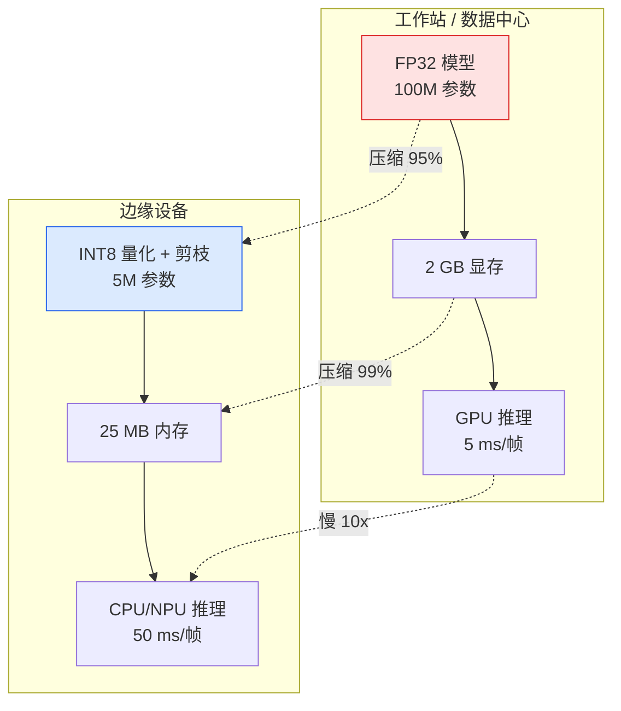

# 实时边缘部署：从工作站到设备

> 在 2 GB 显存、30 帧每秒的限制下，90% 准确率的模型不是"差不多就行"——是每个百分比点都要拿毫秒来换的硬交易。

**类型：** 实现课
**语言：** Python
**前置知识：** 阶段 03（深度学习核心）、阶段 04 · 04（图像分类）、阶段 04 · 11（模型压缩与剪枝）
**预计时间：** ~90 分钟
**所处阶段：** Tier 1
**关联课程：** 阶段 04 · 06（YOLO 目标检测）— 理解检测模型在嵌入式设备上的部署挑战

---

## 🎯 学习目标

完成本课后，你能够：

- [ ] 正确测量推理延迟——预热、同步 GPU、报告百分位而不是均值
- [ ] 解释深度可分离卷积（Depthwise Separable Convolution）的原理，并推导它与标准卷积的参数缩减倍数
- [ ] 用 PyTorch 训练后静态量化（PTQ）将 Vision 模型量化为 INT8，并验证准确率损失小于 1%
- [ ] 将 PyTorch 模型导出为 ONNX 并使用 ONNX Runtime / TensorRT 进行推理加速
- [ ] 根据内存预算和延迟目标选择最合适的轻量级网络架构

---

## 1. 问题

一个在实验室里训练好的视觉模型通常是一个"浮点数巨兽"：一亿个参数、每做一次前向传播消耗 10 GFLOPs、占用 2 GB 显存。这些数字在一块 RTX 4090 上只是热身。但当你把同样的模型放到手机上、车机娱乐系统里、工业相机上、或者无人机上时，你会发现一个残酷的现实——这些设备的资源预算只有工作站的百分之一。

**边缘部署的核心矛盾是：同一个预测任务，必须在比训练环境小两个数量级的资源预算内完成。**

三个旋钮控制了绝大部分优化空间：模型选择（用一个更小的架构但相同的训练配方）、量化（INT8 代替 FP32）、推理运行时（ONNX Runtime、TensorRT、Core ML、TFLite）。把它们调好，区别在于一个只在演示中跑得动的系统和一个能装进 30 美元摄像头模组的真实产品。



---

## 2. 概念

### 2.1 三个预算指标

边缘部署不是只看一个"速度"指标。你需要同时关心三个维度的资源约束：

```
           模型设计决策
              │
     ┌────────┼────────┐
     ▼        ▼        ▼
  延迟       峰值内存   功耗
  (ms/帧)   (MB)      (mJ/次推理)
     │        │         │
     └────────┼────────┘
              ▼
         是否发货决策
```

- **延迟（Latency）**：必须报告 p50 / p95 / p99，而不是只报平均值。p50 告诉你"正常情况多快"，p95 告诉你"少数慢请求有多慢"，p99 告诉你"极端情况会不会超时"。对实时系统来说，尾部延迟往往比平均延迟更重要。
- **峰值内存（Peak Memory）**：系统在运行过程中见过的最大内存占用，而不是稳态平均值。因为嵌入式系统的内存溢出（OOM）是致命的，程序直接崩溃。
- **功耗（Power）**：对于电池驱动的设备（无人机、移动摄像头），每次推理消耗的毫焦耳数决定了续航时间。

所有这三个指标都必须在**目标硬件**上测量。工作站上跑出来的数据不代表手机上的表现。

### 2.2 测量纪律

任何边缘部署基准测试都必须遵守三条规则：

1. **预热**：在正式测量之前，先用 5-10 次 dummy 前向传播"热身"模型。冷缓存和 JIT 编译会让第一次运行的数字完全不可信。
2. **同步**：GPU 上必须调用 `torch.cuda.synchronize()` 后再计时。不这样的话，你测量的内核调度时间而非内核执行时间。
3. **固定输入尺寸**：必须使用生产环境中实际使用的分辨率。224×224 的延迟和 512×512 的延迟不是一个概念。

### 2.3 FLOPs：廉价的代理指标

FLOPs（每次前向传播的浮点运算次数）是一个便宜且设备无关的代理指标。它可以用来比较不同架构的计算量，但如果把它当成真实的 wall-clock 延迟就误导了。

一个有 10% 更多 FLOPs 的模型在实际中可能比另一个快 2 倍——因为它大量使用了硬件友好的算子（深度卷积编译效果好，而大的 7×7 卷积不一定）。

**原则：用 FLOPs 做架构搜索，用目标设备上的延迟做部署决策。**

### 2.4 轻量级架构：MobileNet 的深度可分离卷积

MobileNet 系列的核心创新是**深度可分离卷积（Depthwise Separable Convolution）**，它将标准卷积分解为两个步骤：

**标准卷积**：一个 3×3 卷积核同时做两件事——在空间维度上滤波（提取局部特征），以及跨通道混合信息。参数量为：

$$C_{\text{in}} \times C_{\text{out}} \times K_h \times K_w$$

其中 $K_h = K_w = 3$ 是卷积核大小。

**深度可分离卷积**拆成两步：

1. **逐通道卷积（Depthwise）**：每个输入通道独立用 3×3 核做空间滤波。参数量仅为 $C_{\text{in}} \times 3 \times 3$。
2. **逐点卷积（Pointwise）**：1×1 卷积负责跨通道信息融合。参数量仅为 $C_{\text{in}} \times C_{\text{out}} \times 1 \times 1$。

总参数量为：

$$C_{\text{in}} \times 9 + C_{\text{in}} \times C_{\text{out}}$$

对比标准卷积的 $C_{\text{in}} \times C_{\text{out}} \times 9$，当 $C_{\text{out}}$ 较大时（这在现代网络中很常见），深度可分离卷积可以将参数量减少约 **8-9 倍**。

```
标准卷积 (C_in=64, C_out=128):
┌──────────────────────────────┐
│ 卷积核: 128 × 64 × 3 × 3     │
│ 参数量: 128 × 64 × 9 = 73,728 │
└──────────────────────────────┘
     一次性做空间滤波 + 通道混合

深度可分离卷积 (C_in=64, C_out=128):
┌───────────────────────┐
│ Depthwise: 64 × 3 × 3 │  ← 每个通道独立滤波
│ 参数量: 64 × 9 = 576  │
└───────────────────────┘
          │
          ▼
┌───────────────────────┐
│ Pointwise: 128 × 64   │  ← 跨通道融合
│ 参数量: 128 × 64 = 8192 │
└───────────────────────┘
     总参数量: 8,768 (↓ 88%)
```

### 2.5 ShuffleNet 的通道混洗

ShuffleNet 是另一条轻量级路线的代表。它的核心问题是：**如果使用了分组卷积（Group Convolution），不同组之间的特征无法交互，网络的表达能力会严重受限。**

ShuffleNet 的解决方案极其简洁——**通道混洗（Channel Shuffle）**。

在分组卷积之后，做一个简单的张量重塑操作，让原来属于不同组的通道特征"洗牌"混在一起，然后再进入下一个卷积层。这样既保留了分组卷积的效率优势，又恢复了组间的信息流通。

通道混洗的操作流程：

```
输入形状: (N, C, H, W)，分成 g 组
     │
     ▼
reshape → (N, g, C/g, H, W)
     │
     ▼
transpose(1, 2) → (N, C/g, g, H, W)
     │
     ▼
flatten → (N, C, H, W)

结果：每个输出通道的特征现在混合了来自不同输入组的信号
```

这是整个论文中唯一的新增算子，但它是让分组卷积变得可用的关键。

### 2.6 量化：从 FP32 到 INT8

量化是将模型的浮点权重和激活值用较低精度的整数表示的过程。

**为什么量化有效？**

- 模型体积缩小 4 倍（FP32 是 4 字节，INT8 是 1 字节）
- 显存带宽需求降低 4 倍（每次读取传输的数据量更少）
- 在现代硬件上，INT8 矩阵乘法被专门硬件加速（GPU Tensor Core、NPU、ARM NEON SIMD），推理速度提升 2-4 倍

**三种量化方式：**

| 方式 | 权重 | 激活 | 实现难度 | 精度保持 |
|---|---|---|---|---|
| 动态量化 | INT8 | FP32（运行时即时量化） | 低 | 中等 |
| 静态量化（PTQ） | INT8 | INT8（校准确定范围） | 中 | 高 |
| 量化感知训练（QAT） | INT8 | INT8（训练时模拟量化噪声） | 高 | 最高 |

对于视觉任务，**训练后静态量化（Post-Training Static Quantization, PTQ）** 是最实用的方案——它能在 95% 的情况下获得接近 QAT 的效果，但只需要 5% 的工作量。具体来说，PTQ 在 ImageNet 分类任务上的准确率损失通常在 0.1-1 个百分点。

**PTQ 的流程：**

```
1. 配置量化方案 → 设置 qconfig
2. prepare     → 在卷积/BN/ReLU 之后插入观察者
3. 校准         → 用少量真实数据跑前向传播，记录激活值的 min/max
4. convert     → 融合 BatchNorm、生成 INT8 权重、固化观察到的范围
```

### 2.7 剪枝与蒸馏

除了量化，还有两种经典的压缩手段：

- **剪枝（Pruning）**：移除不重要的权重或通道。幅度剪枝最简单——将绝对值最小的权重设为零。结构化剪枝更实用——直接删除整条通道或整个卷积核，这样生成的稀疏矩阵可以直接变成非方阵，真正减少计算量。
- **蒸馏（Distillation）**：用一个大的教师模型训练一个小的学生模型，让学生模仿教师的 logits 输出。蒸馏通常能恢复压缩带来的大部分精度损失，是工业界部署边缘模型的标配技术。

### 2.8 推理运行时选型

不同的目标硬件需要不同的推理引擎：

| 平台 | 运行时 | 转换格式 | 备注 |
|---|---|---|---|
| NVIDIA GPU / Jetson | TensorRT | ONNX | 延迟最低，但仅支持 NVIDIA 硬件 |
| 通用 CPU | ONNX Runtime | ONNX | 中立平台，CPU/GPU 均支持 |
| iOS / macOS | Core ML | `.mlmodel` / `.mlpackage` | Apple 原生框架 |
| Android | TFLite | `.tflite` | Google 主导，广泛支持 ARM NPU |
| Intel CPU / VPU | OpenVINO | `.xml` + `.bin` | 适合 Intel 硬件生态 |

实际操作中的通用路径是：**PyTorch → ONNX → 选择目标硬件对应的运行时**。ONNX 是这个领域的通用语（lingua franca）。

### 2.9 边缘架构选型表

给定资源预算，如何选择骨干网络？

| 预算 | 推荐模型 | 理由 |
|---|---|---|
| < 3M 参数 | MobileNetV3-Small | 编译兼容性最好，移动端基线 |
| 3-10M 参数 | EfficientNet-Lite-B0 | TFLite 上每参数的精度最优 |
| 10-20M 参数 | ConvNeXt-Tiny | CPU 友好的 Transformer 继承者 |
| 20-30M 参数 | MobileViT-S | 将 ViT 能力带到移动端 |
| > 30M 参数 | Swin-V2-Tiny | 仅在部署链支持窗口注意力时使用 |

所有这些模型都应该量化到 INT8 再部署，除非有特定原因不使用。

---

## 3. 从零实现

完整代码在 `code/main.py` 中。以下逐步拆解核心组件。

### 第 1 步：正确的延迟测量

测量延迟不是调用 `time.time()` 那么简单。错误做法和正确做法的差别决定了你的数据是噪音还是决策依据：

```python
# ❌ 错误写法：没有预热、没有同步、只报均值
def wrong_latency(model, x, device="cpu", iters=20):
    model.eval()
    times = []
    for _ in range(iters):
        t0 = time.time()
        model(x)
        times.append(time.time() - t0)
    return np.mean(times)

# ✓ 正确写法：预热 + CUDA 同步 + 百分位
def measure_latency(model, input_shape, device="cpu", warmup=10, iters=50):
    model = model.to(device).eval()
    x = torch.randn(input_shape, device=device)
    with torch.no_grad():
        for _ in range(warmup):
            model(x)                  # 预热：跳过 JIT 编译和冷缓存
        if device == "cuda":
            torch.cuda.synchronize()  # 确保 GPU kernel 全部完成
        times = []
        for _ in range(iters):
            if device == "cuda":
                torch.cuda.synchronize()
            t0 = time.perf_counter()
            model(x)
            if device == "cuda":
                torch.cuda.synchronize()
            times.append((time.perf_counter() - t0) * 1000)
    times.sort()
    n = len(times)
    return {
        "p50_ms": times[n // 2],
        "p95_ms": times[int(n * 0.95)],
        "p99_ms": times[-1],
        "mean_ms": sum(times) / n,
    }
```

关键点：

- `time.perf_counter()` 的分辨率远高于 `time.time()`，适合微秒级测量
- `warmup=10` 是为了跳过第一次前向传播的额外开销（Python 的 import 缓存、CUDA 内核编译等）
- CUDA 上必须 `synchronize()` 否则返回的是异步 kernel 的调度时间，不是执行时间
- 报告百分位而不是均值——一个 p99  outlier 可能把均值翻两倍，但 p50 保持稳定

### 第 2 步：深度可分离卷积

从标准卷积分解出深度可分离卷积，只用了不到 20 行代码：

```python
class DepthwiseSeparableConv(nn.Module):
    def __init__(self, in_channels, out_channels, stride=1, padding=1):
        super().__init__()
        # 深度卷积：每个通道独立的空间滤波
        self.depthwise = nn.Conv2d(
            in_channels, in_channels,
            kernel_size=3, stride=stride, padding=padding,
            groups=in_channels,    # 关键：groups=in_channels 即逐通道
            bias=False,
        )
        # 逐点卷积：跨通道信息融合
        self.pointwise = nn.Conv2d(
            in_channels, out_channels,
            kernel_size=1, stride=1, bias=False,
        )
        self.bn_dw = nn.BatchNorm2d(in_channels)
        self.bn_pw = nn.BatchNorm2d(out_channels)
        self.relu = nn.ReLU(inplace=True)

    def forward(self, x):
        x = self.depthwise(x)
        x = self.bn_dw(x)
        x = self.relu(x)
        x = self.pointwise(x)
        x = self.bn_pw(x)
        x = self.relu(x)
        return x
```

这里最关键的一行是 `groups=in_channels`。PyTorch 的 `nn.Conv2d` 中，`groups` 参数控制输入通道如何分配给卷积核。当 `groups=in_channels` 时，每个卷积核只处理一个通道——这就是逐通道卷积。

### 第 3 步：通道混洗

ShuffleNet 的核心算子——通道混洗——本质上是三步张量重塑：

```python
def channel_shuffle(x, groups):
    batch_size, channels, height, width = x.size()
    channels_per_group = channels // groups

    # 第一步：按组拆分
    x = x.view(batch_size, groups, channels_per_group, height, width)
    # 第二步：组间转置
    x = x.transpose(1, 2).contiguous()
    # 第三步：展平回原来的形状
    x = x.view(batch_size, channels, height, width)
    return x
```

`contiguous()` 是必需的——transpose 操作后张量在内存中不再连续存储，后续操作需要连续内存才能高效执行。

### 第 4 步：INT8 静态量化

用 PyTorch 的 `torch.ao.quantization` API 给模型做量化，只需四步：

```python
import torch.ao.quantization as tq

model = model.eval().cpu()

# Step 1: 配置量化方案
model.qconfig = tq.get_default_qconfig("fbgemm")

# Step 2: prepare —— 插入观察者（observer）
tq.prepare(model, inplace=True)

# Step 3: 校准 —— 用真实数据收集激活值范围
with torch.no_grad():
    for x, _ in calibration_loader:
        model(x)

# Step 4: convert —— 融合 BN、固化 INT8 参数
tq.convert(model, inplace=True)
```

Observer（观察者）是 PyTorch 量化的核心概念。`prepare` 会在每个应该量化的位置前后插入特殊的观察者模块，它们会在前向传播过程中记录数据的 min 和 max 值。校准阶段就是让这些数据流过观察者，最终确定缩放因子（scale）和零点（zero-point）。`convert` 会用这些标定的参数替换掉原始 FP32 算子。

### 第 5 步：幅度剪枝

最简单的剪枝策略——按权重绝对值排序，切除最小的部分：

```python
def magnitude_pruning(model, sparsity=0.5):
    total_params = 0
    pruned_params = 0
    for name, param in model.named_parameters():
        if param.ndim > 1 and "conv" in name:
            absolute_weights = param.abs()
            # 找到第 sparsity 分位数的阈值
            threshold = absolute_weights.flatten().quantile(sparsity).item()
            # 小于阈值的权重设为 0
            mask = (absolute_weights >= threshold).float()
            pruned_count = (mask == 0).sum().item()
            total_params += param.numel()
            pruned_params += pruned_count
            param.data.mul_(mask)
    return {"sparsity": pruned_params / total_params}
```

---

## 4. 工业工具

### 4.1 PyTorch 内置量化

PyTorch 2.x 提供了完整的量化工具链：

```python
import torch
from torchvision.models import mobilenet_v3_small

# 加载预训练模型
model = mobilenet_v3_small(weights="DEFAULT")
model.eval()

# 量化配置
model.qconfig = torch.ao.quantization.get_default_qconfig("fbgemm")

# 全流程量化
prepared = torch.ao.quantization.prepare(model, inplace=True)

# 校准（这里使用验证集的前 100 个样本）
calibration_set = ...  # DataLoader of (images, labels)
with torch.no_grad():
    for images, _ in calibration_set:
        prepared(images)

# 转换为量化模型
quantized_model = torch.ao.quantization.convert(prepared, inplace=True)

print(f"量化前参数量: {sum(p.numel() for p in model.parameters()):,}")
print(f"量化后文件大小（FP32 → INT8）: 约减少 4 倍")
```

### 4.2 ONNX Export

```python
import torch

model = ...  # 任意 PyTorch 模型
model.eval()

sample_input = torch.randn(1, 3, 224, 224)

torch.onnx.export(
    model,
    sample_input,
    "mobilenet_v3.onnx",
    input_names=["input"],
    output_names=["output"],
    dynamic_axes={"input": {0: "batch"}, "output": {0: "batch"}},
    opset_version=17,
    do_constant_folding=True,
)
```

常用 export 失败情况及修复：

| 错误 | 原因 | 修复 |
|---|---|---|
| `Unsupported operator` | 自定义 OP 没有 ONNX 映射 | 用等效标准 OP 替代 |
| `dynamic shapes not supported` | 使用了隐式 shape 变化 | 添加 `@torch.jit.unused` 或使用 `torch.jit.script` |
| `Torch was not able to export...` | 模型中有 Python 级别的控制流 | 改写为可追踪的张量操作 |

### 4.3 ONNX Runtime 推理

```python
import onnxruntime as ort
import numpy as np

# 加载 ONNX 模型
session = ort.InferenceSession("mobilenet_v3.onnx", providers=["CPUExecutionProvider"])

# 准备输入
input_name = session.get_inputs()[0].name
image = np.random.rand(1, 3, 224, 224).astype(np.float32)

# 推理
outputs = session.run(None, {input_name: image})
pred_class = np.argmax(outputs[0][0])
confidence = np.max(outputs[0][0])
print(f"类别: {pred_class}, 置信度: {confidence:.4f}")
```

### 4.4 TensorRT 加速

对于 NVIDIA GPU（包括 Jetson 系列），TensorRT 是业界延迟最低的推理引擎：

```bash
# 命令行方式：将 ONNX 编译为 TensorRT Engine
trtexec --onnx=mobilenet_v3.onnx \
        --saveEngine=mobilenet_v3.engine \
        --fp16 \
        --workspace=1024

# 在 Python 中使用 TensorRT Python API
import tensorrt as trt
# ... 构建 optimized engine，与 PyTorch 无缝对接
```

TensorRT 的关键优化能力：
- **层融合**（Layer Fusion）：将 Conv + BN + ReLU 合并为一个 kernel
- **精度校准**（Calibration）：自动寻找最佳精度（FP32/FP16/INT8）
- **内核自动调优**（Auto-Tuning）：在编译时尝试多种实现策略，选择最快的

---

## 5. 知识连线

本课学习的边缘部署技术，是后续深度学习系统的必要基础：

- **阶段 04 · 06（YOLO 目标检测）**：目标检测模型的参数量和计算量比分类器高一个数量级——如何在同样资源受限的边缘设备上部署 YOLO 是本课技术的直接应用场景。
- **阶段 04 · 07（语义分割 U-Net）**：分割模型通常需要更高分辨率的特征图和更大的通道数，边缘部署的挑战更为严峻。
- **阶段 11（LLM 工程）**· 模型部署与推理：虽然 LLM 的优化方向不同，但量化（INT8/AWQ）、KV Cache 优化、TensorRT-LLM 等思想与本课程中的量化和推理加速一脉相承。

---

## 6. 工程最佳实践

### 6.1 部署前的决策检查清单

在选择边缘部署方案之前，回答以下问题：

| 问题 | 推荐方向 |
|---|---|
| 目标硬件是什么？ | GPU → TensorRT; ARM → TFLite/Core ML; x86 → ONNX Runtime |
| 延迟 SLA 是多少？ | <10ms → 剪枝+INT8; 10-50ms → INT8; >50ms → FP16 即可 |
| 内存预算多少？ | <10MB → MobileNetV3-Small; 10-50MB → ConvNeXt-Tiny |
| 允许精度损失吗？ | 不允许 → QAT + 蒸馏; 允许 <1% → PTQ 静态量化 |
| 输入尺寸是否固定？ | 固定 → 编译时优化更多; 可变 → 需要 ONNX dynamic axes |

### 6.2 量化实战建议

- **BatchNorm 融合**：量化前必须将 Conv + BN 融合，否则 BN 的归一化统计量无法被 INT8 量化器正确处理。`torch.ao.quantization.fuse_modules` 可以自动化这一步。
- **校准数据量**：20-100 张代表性图片通常足够校准。不需要整个训练集。关键是覆盖真实场景中的各种外观变化。
- **逐通道量化 vs 逐_tensor 量化**：卷积层的权重推荐使用逐通道量化（per-channel），它能保留更重要的信息维度；激活值推荐使用逐 tensor 量化（per-tensor）。
- **遇到量化后精度骤降**：优先检查是否有 `aten::floor`、`aten::gt` 等无法量化的操作，这些操作需要 INT8 到 FP32 的反量化，破坏了量化的加速效果。

### 6.3 中文场景特别建议

- 国内边缘硬件生态丰富（海思、瑞芯微 RK3588、地平线 J5/J6），不同平台的推理引擎各不相同。建议在项目早期就选定目标芯片平台，而不是先用通用方案再移植。
- 如果使用 RK3588 等国产 SoC，需要关注 rknn-toolkit2 的兼容性——PyTorch 模型通常需要先转 ONNX，再通过 RKNN 转换链到 .rknn 格式。
- 安防监控领域（海康威视、大华）常用的嵌入式平台是 ARM Cortex-A76 + Mali-G57 GPU，TFLite 或 RKNN 是目前最成熟的选择。

### 6.4 踩坑经验

1. **忘记预热导致的延迟评估偏差**：第一次前向传播包含 Python 导入缓存填充、CUDA 内核编译等一次性开销，可能比后续运行慢 10 倍以上。务必先跑 10 次热身再说。
2. **export ONNX 时忘记 eval()**：Dropout 和 BatchNorm 在 train 模式和 eval 模式下的行为不同。如果忘记调 `.eval()`，导出的 ONNX 模型在推理时会引入随机性。
3. **INT8 量化后某些层回退到 FP32**：如果 ONNX 模型中某些操作不支持 INT8 算子（如池化、sigmoid、自定义算子），TensorRT 会自动将其降级为 FP32。这不会导致错误，但会拖慢整体推理速度。用 `polygraphy` 检查哪些层降级了。
4. **用错 opset 版本**：PyTorch 的 `torch.onnx.export` 默认 opset 版本可能低于推理引擎所需的最小版本。显式指定 `opset_version=17` 可以避免兼容性问题。

---

## 7. 常见错误

### 错误 1：用平均值报告延迟

**现象：** 团队报告中写"模型延迟 5 毫秒"，实际使用时发现经常超过 50 毫秒。

**原因：** 平均值掩盖了尾部行为。在实时系统中，偶尔的 100 毫秒延迟（由于垃圾回收、页面置换、GPU 竞争）就足以导致整个流水线崩溃。

**修复：**

```python
# ❌ 错误：只报告均值
return np.mean(latency_list)

# ✓ 正确：报告百分位
latency_sorted = sorted(latency_list)
n = len(latency_sorted)
print(f"p50={latency_sorted[n//2]:.1f}ms, "
      f"p95={latency_sorted[int(n*0.95)]:.1f}ms, "
      f"p99={latency_sorted[-1]:.1f}ms")
```

### 错误 2：在 CPU 上测完延迟就直接部署到 GPU

**现象：** 在 CPU 上测试延迟为 5ms，搬到 GPU 上后变成了 50ms。

**原因：** CPU 和 GPU 的内存层次结构完全不同。CPU 擅长大缓存（L3 cache 可达数百 MB），而 GPU 擅长大规模并行计算但缓存极小。一个在 CPU 上高效的模型（比如使用大量小型逐元素操作的模型）在 GPU 上可能因为内核启动开销过大而变慢。

**修复：** 永远在**目标硬件**上测量延迟。如果目标硬件暂不可用，至少在同一类硬件上做初步测试（如 A10 上的测试不能直接代表 Jetson Orin 的表现）。

### 错误 3：量化后忘记校准

**现象：** 直接将模型转换为 `QuantizedModel` 而不跑校准数据，精度暴跌 10-20 个百分点。

**原因：** 量化的核心是确定每个张量的 scale（缩放因子）和 zero_point（零点偏移）。如果没有校准阶段来观察激活值的分布，这些参数就是猜测的，会导致严重的截断误差。

**修复：**

```python
# ❌ 错误：没有校准就 convert
tq.prepare(model)
tq.convert(model)  # 观察者没有收集到任何数据！

# ✓ 正确：先校准
tq.prepare(model)
with torch.no_grad():
    for images, _ in calibration_loader:
        model(images)  # 让数据流过观察者
tq.convert(model)
```

---

## 8. 面试考点

### Q1：深度可分离卷积比标准卷积快多少？是 8 倍吗？（难度：⭐⭐）

**参考答案：**

参数量减少 8 倍不等于速度提升 8 倍。原因有二：

第一，深度可分离卷积的两步分解引入了额外的内存访问。标准卷积是一次读取、一次计算；深度可分离卷积需要先做逐通道卷积（读取一次、计算一次），再做逐点卷积（再次读取、再次计算）。这增加了内存带宽的消耗。

第二，现代 GPU 对于大型矩阵乘法（标准卷积的规模）有更好的算力利用率。深度可分离卷积的逐通道卷积实际上是多个独立的小矩阵乘法，GPU 上的线程块无法被完全填满，利用率低。

在实际中，MobileNetV3-Small 在 CPU 上的速度通常是 ResNet-18 的 3-5 倍，而不是 8 倍。在 GPU 上由于并行效率的差距，倍数会更小。但 3-5 倍的加速对于边缘设备来说已经足够了。

### Q2：为什么量化后的模型在某些层会回退到 FP32？（难度：⭐⭐）

**参考答案：**

并非所有操作都可以高效地用 INT8 实现。常见的回退场景包括：

- 激活函数（sigmoid、softmax、tanh）：它们的非线性特性难以用线性 INT8 算子近似
- 池化操作（max pooling、adaptive average pooling）：没有专门的 INT8 池化内核
- 自定义算子：如果有不在推理引擎支持列表中的算子，该层会被降级为 FP32

这意味着模型中会出现 FP32 和 INT8 算子的混合执行。每次精度切换都需要 FP32 ↔ INT8 的数据格式转换，这会带来额外的开销。因此，在设计轻量化网络时应尽量避免使用难以量化的操作。

### Q3：解释 ONNX 作为模型交换格式为什么重要，它的缺点是什么？（难度：⭐⭐）

**参考答案：**

ONNX 的重要性在于它解决了**模型移植的碎片化问题**。没有 ONNX 之前，每个厂商都有自己的模型格式（TensorFlow 的 .pb，PyTorch 的 .pth，Caffe 的 .caffemodel），从一个框架移植到另一个框架需要手动重写模型定义。

ONNX 定义了一套框架无关的标准算子和模型描述格式，使得：
1. 可以在不同框架之间自由转换（PyTorch → ONNX → TensorRT / TFLite / OpenVINO）
2. 推理引擎只需要实现 ONNX 标准支持的所有算子即可

但 ONNX 也有缺点：
- **算子覆盖不完整**：某些新算子（如 FlashAttention）还没有官方 ONNX 规范
- **动态 shape 支持有限**：复杂条件分支和变长张量容易导致导出失败
- **精度差异**：不同框架导出到同一 ONNX 模型可能在数值上有微小差异
- **调试困难**：ONNX 模型出错时，stack trace 不如原生框架友好

### Q4：PTQ 和 QAT 有什么区别？什么时候必须用 QAT？（难度：⭐⭐⭐）

**参考答案：**

PTQ（训练后量化）：训练好的 FP32 模型直接量化，校准阶段用少量真实数据确定激活范围。优点是实现简单、不需要重新训练；缺点是对于某些对数值敏感的模型（如目标检测、分割），精度损失可能达到 3-5 个百分点。

QAT（量化感知训练）：在训练过程中模拟量化噪声——前向传播时加入伪量化操作，反向传播时使用直通估计器（STE）让梯度绕过量化步骤。优点是可以让模型学会适应量化误差，通常能将精度损失压缩到 0.5 个百分点以内；缺点是需要完整的训练数据、训练时间增加、且需要微调阶段的标注数据。

必须使用 QAT 的场景：
- 精度要求极高的任务（医疗影像、自动驾驶）
- 检测头和分割头这类对小数值变化敏感的结构
- PTQ 后精度损失超过 2 个百分点且无法通过增加校准数据缓解

### Q5：在端侧部署一个 YOLOv8n 检测器，你会用什么策略将它从 30 FPS 提升到 60 FPS？（难度：⭐⭐⭐）

**参考答案：**

这是一个综合优化问题，可以从多个层面入手：

1. **量化（INT8 PTQ）**：从 FP32 降到 INT8，模型体积缩小 4 倍，推理速度通常提升 2-3 倍，精度损失 <1%。这是性价比最高的单步优化。
2. **降低输入分辨率**：YOLOv8n 在 320×320 上仍然保持不错的精度，但在 CPU/NPU 上的速度比 640×640 快 4 倍。
3. **切换到 TensorRT 或 NPU 运行时**：ONNX Runtime 是通用的，但 TensorRT 会对算子做深度优化（层融合、内核选择、精度校准），通常比 ONNX Runtime 快 2-5 倍。
4. **批处理**：如果系统能接受端到端延迟而不是严格帧率，将多帧合并为一个批次一起推理可以利用 GPU 的并行计算能力，提高吞吐量。
5. **模型蒸馏**：用 YOLOv8x 作为教师蒸馏出一个更小的学生模型（如 1M 参数的 YOLO-Nano），可以进一步压缩。

综合起来，INT8 量化 + 降低分辨率 + TensorRT 编译通常能把 YOLOv8n 在 Jetson Nano 上的推理从 30 FPS 提升到 60 FPS 以上，同时 mAP 下降不超过 2 个点。

---

## 🔑 关键术语

| 术语 | 人们怎么说 | 实际含义 |
|---|---|---|
| 延迟（Latency） | "有多快" | 从输入到输出的时间——必须报告 p50/p95/p99 百分位，均值掩盖尾部延迟 |
| FLOPs | "模型有多大" | 每次前向传播的浮点运算次数——是硬件无关的计算量代理指标，不是真实延迟 |
| 深度可分离卷积 | "更小的卷积" | 将标准卷积分解为逐通道卷积（空间滤波）+ 逐点卷积（通道融合），参数量减少 8-9 倍 |
| 通道混洗 | "把通道打乱" | Group Convolution 之后对张量做 reshape+transpose+flatten 操作，让不同组的特征重新混合 |
| INT8 量化 | "8 位模型" | 将 FP32 权重和激活值替换为 8 位整数表示——体积缩小 4 倍，有硬件加速时推理快 2-4 倍 |
| PTQ | "量化一下就完了" | 训练后静态量化——不需要重新训练，用少量数据校准即可，精度损失通常 <1% |
| QAT | "边训练边量化" | 量化感知训练——在训练过程中模拟量化噪声，让模型学会适应，精度最优但成本最高 |
| ONNX | "模型中间格式" | Open Neural Network Exchange——框架无关的模型描述格式，所有主流推理引擎的共同起点 |
| TensorRT | "NVIDIA 编译器" | NVIDIA 的推理优化编译器，能将 ONNX 模型编译为针对特定 GPU 高度优化的推理引擎 |
| 预热（Warmup） | "跑几次再说" | 正式测量前的多次 dummy 前向传播——跳过 JIT 编译和冷缓存的影响 |

---

## 📚 小结

边缘部署的本质是在三个相互制约的预算（延迟、内存、功耗）中寻找最优解。你从零实现了深度可分离卷积的推导、通道混洗的核心操作、INT8 静态量化的四步流程，并理解了 FLOPs 作为代理指标的边界在哪里。

下一课我们将把这些压缩和优化技术整合到一个完整的部署流水线中，实际部署一个目标检测模型到真实的边缘硬件上。

---

## ✏️ 练习

1. 【理解】用自己的话解释为什么"深度可分离卷积的参数量比标准卷积少 8-9 倍"。写出 64 输入通道、128 输出通道的 3×3 卷积的标准卷积参数量和深度可分离卷积参数量，做具体对比。

2. 【实现】修改 `code/main.py` 中的 `measure_latency` 函数，增加 `peak_memory_mb` 的测量——对于 CPU 使用 `psutil.Process().memory_info().rss`，对于 CUDA 使用 `torch.cuda.max_memory_allocated()`。

3. 【实验】加载 `mobilenet_v3_small` 模型，分别测量 224×224 和 640×640 分辨率下的 p50/p95/p99 延迟，对比两者的延迟增长倍数和 GFLOPs 增长倍数的关系。

4. 【思考】TensorRT 声称能将模型速度提升 2-4 倍。查阅 TensorRT 的文档，列出它的至少三种图优化策略（如图融合、内核调优），并解释为什么这些优化在 ONNX Runtime 中没有同等程度的应用。

5. 【思考】如果你的目标硬件是 RK3588（RKNN 工具链），请画出从 PyTorch 模型到设备上跑的完整转换流程图，标注每一步的输入输出格式和潜在风险点。

---

## 🚀 产出

本课产出以下可复用内容：

| 产出 | 文件 | 说明 |
|---|---|---|
| 边缘部署度量管线 | `code/main.py` | 从零实现的延迟测量、参数计数、FLOPs 估算、深度可分离卷积、通道混洗、INT8 量化、剪枝、ONNX 导出全流程 |
| 延迟基准测试提示词 | `outputs/prompt-edge-deployment-guide.md` | 根据目标设备和性能指标选择部署方案的提示词模板 |

---

## 📖 参考资料

1. [论文] Howard et al. "MobileNetV3: Searching for MobileNetV3". CVPR, 2019. https://arxiv.org/abs/1905.02244
2. [论文] Ma et al. "ShuffleNet V2: Practical Guidelines for Efficient CNN Architecture Design". ECCV, 2018. https://arxiv.org/abs/1807.11164
3. [论文] Sandler et al. "MobileNetV2: Inverted Residuals and Linear Bottlenecks". CVPR, 2018. https://arxiv.org/abs/1801.04381
4. [官方文档] PyTorch Quantization Documentation: https://pytorch.org/docs/stable/quantization.html
5. [官方文档] PyTorch AO Quantization: https://pytorch.org/docs/stable/ao_quantization.html
6. [官方文档] ONNX Runtime: https://onnxruntime.ai/docs/
7. [官方文档] NVIDIA TensorRT Documentation: https://docs.nvidia.com/deeplearning/tensorrt/developer-guide/
8. [GitHub] Dao-AILab. "flash-attention". https://github.com/Dao-AILab/flash-attention — 参考 IO 感知的算子优化思路
9. [论文] Ghiasi et al. "EfficientNet-Lite: Exploiting Labeling Efficiency in Compacting CNN Models". arXiv, 2020. https://arxiv.org/abs/1905.11946

---

> 本课程参考了 AI Engineering From Scratch（MIT License）的课程体系，在此基础上进行了重构和原创内容的扩充。所有中文表达、案例、工程最佳实践、常见错误、面试考点等均为原创内容。
